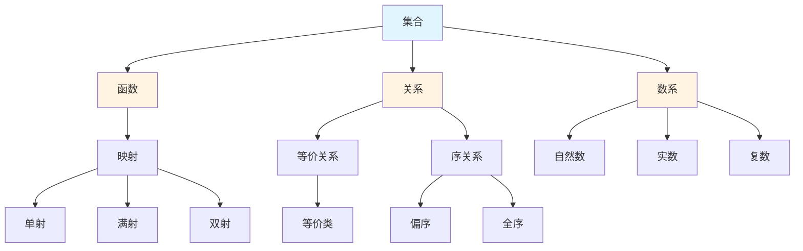

# 基础数学概念梳理

**主题编号**: C.03.01
**创建日期**: 2025年11月21日
**最后更新**: 2025年1月（三视角转换全面完成）

---

## 📋 目录 / Table of Contents

- [基础数学概念梳理](#基础数学概念梳理)
  - [📋 目录 / Table of Contents](#-目录--table-of-contents)
  - [📋 概述 (编号: C.03.01.01)](#-概述-编号-c030101)
  - [🎯 核心概念体系 (编号: C.03.01.02)](#-核心概念体系-编号-c030102)
    - [1. 集合论核心概念 (编号: C.03.01.02.01)](#1-集合论核心概念-编号-c03010201)
      - [基础概念](#基础概念)
      - [高级概念](#高级概念)
    - [2. 数系核心概念 (编号: C.03.01.02.02)](#2-数系核心概念-编号-c03010202)
      - [自然数](#自然数)
      - [整数](#整数)
      - [有理数](#有理数)
      - [实数](#实数)
      - [复数](#复数)
    - [3. 函数与映射核心概念 (编号: C.03.01.02.03)](#3-函数与映射核心概念-编号-c03010203)
      - [基础概念](#基础概念-1)
      - [函数性质](#函数性质)
      - [特殊函数](#特殊函数)
    - [4. 关系与等价核心概念 (编号: C.03.01.02.04)](#4-关系与等价核心概念-编号-c03010204)
      - [二元关系](#二元关系)
      - [等价关系](#等价关系)
      - [序关系](#序关系)
    - [5. 逻辑基础核心概念 (编号: C.03.01.02.05)](#5-逻辑基础核心概念-编号-c03010205)
      - [命题逻辑](#命题逻辑)
      - [谓词逻辑](#谓词逻辑)
      - [证明系统](#证明系统)
  - [🔗 概念关联图 (编号: C.03.01.03)](#-概念关联图-编号-c030103)
  - [📊 概念重要性矩阵 (编号: C.03.01.04)](#-概念重要性矩阵-编号-c030104)

---

## 📋 概述 (编号: C.03.01.01)

本文档系统梳理基础数学领域的核心概念，包括集合论、数系、函数与映射、关系与等价、逻辑基础等。

**核心概念三视角版本**: 本文档中涉及的以下核心概念已有三视角深度版本：

- [关系](../核心概念/00-关系-三视角版.md) (C.CORE.000) - 关系核心概念的三视角深度分析
- [集合](../核心概念/01-集合-三视角版.md) (C.CORE.001) - 集合论核心概念的三视角深度分析
- [函数](../核心概念/02-函数-三视角版.md) (C.CORE.002) - 函数核心概念的三视角深度分析
- [自然数](../核心概念/03-自然数-三视角版.md) (C.CORE.003) - 自然数核心概念的三视角深度分析
- [整数](../核心概念/04-整数-三视角版.md) (C.CORE.004) - 整数核心概念的三视角深度分析
- [有理数](../核心概念/05-有理数-三视角版.md) (C.CORE.005) - 有理数核心概念的三视角深度分析
- [实数](../核心概念/06-实数-三视角版.md) (C.CORE.006) - 实数核心概念的三视角深度分析
- [复数](../核心概念/07-复数-三视角版.md) (C.CORE.007) - 复数核心概念的三视角深度分析

详见：[核心概念索引](../核心概念/00-核心概念索引.md) - 所有33个核心概念的三视角版本

**哲学背景**: 基础数学概念的发展深受哲学思想影响。集合论的公理化体现了逻辑主义和形式主义的结合，数系的构造反映了建构主义的要求，逻辑基础的发展体现了从逻辑主义到形式主义的转变。详见[数学哲学维度矩阵](../02-知识矩阵/09-数学哲学维度矩阵.md)。

**权威资源对齐**: 本文档的概念定义和结构参考了Wikipedia数学条目、MIT 18.01-18.06系列课程、Stanford和Princeton的基础数学课程，以及Metamath的形式化定义。详见[权威资源对齐说明](../00-权威资源对齐说明.md)和[权威资源对标改进计划](../00-权威资源对标改进计划.md)。

---

## 🎯 核心概念体系 (编号: C.03.01.02)

### 1. 集合论核心概念 (编号: C.03.01.02.01)

#### 基础概念

- **集合 (Set)**: 由确定对象组成的整体
  - **严格定义**: 集合是满足ZFC公理的对象，通常用描述法 $\{x : P(x)\}$ 或列举法表示
  - **性质**: 集合的元素是确定的、互异的、无序的
  - **记号**: $x \in A$ 表示 $x$ 是 $A$ 的元素，$A \subseteq B$ 表示 $A$ 是 $B$ 的子集
- **元素 (Element)**: 集合中的个体对象
  - **定义**: 属于集合的对象，满足集合的定义条件
- **子集 (Subset)**: 一个集合的所有元素都属于另一个集合
  - **严格定义**: $A \subseteq B \leftrightarrow \forall x (x \in A \Rightarrow x \in B)$
  - **性质**: 空集是任意集合的子集；集合是自身的子集
- **幂集 (Power Set)**: 集合的所有子集构成的集合
  - **定义**: $\mathcal{P}(A) = \{B : B \subseteq A\}$
  - **性质**: $|\mathcal{P}(A)| = 2^{|A|}$（$n$ 个元素的集合有 $2^n$ 个子集）
  - **证明思路**: 每个元素要么在子集中要么不在，共 $2^n$ 种可能
- **并集 (Union)**: 两个集合所有元素的集合
  - **定义**: $A \cup B = \{x : x \in A \text{ 或 } x \in B\}$
  - **性质**: 交换律 $A \cup B = B \cup A$，结合律 $(A \cup B) \cup C = A \cup (B \cup C)$
- **交集 (Intersection)**: 两个集合共同元素的集合
  - **定义**: $A \cap B = \{x : x \in A \text{ 且 } x \in B\}$
  - **性质**: 交换律、结合律；分配律 $A \cap (B \cup C) = (A \cap B) \cup (A \cap C)$
- **差集 (Difference)**: 属于一个集合但不属于另一个集合的元素
  - **定义**: $A \setminus B = \{x : x \in A \text{ 且 } x \notin B\}$
  - **性质**: $A \setminus B = A \cap B^c$（$B^c$ 是 $B$ 的补集）
- **补集 (Complement)**: 相对于全集的差集
  - **定义**: 在全集 $U$ 中，$A^c = U \setminus A = \{x \in U : x \notin A\}$
  - **性质**: $(A^c)^c = A$，$A \cup A^c = U$，$A \cap A^c = \emptyset$（德摩根律）

#### 高级概念

- **基数 (Cardinality)**: 集合中元素的个数
  - **定义**: 有限集合 $A$ 的基数 $|A|$ 是 $A$ 中元素的个数
  - **性质**: $|A \cup B| = |A| + |B| - |A \cap B|$（容斥原理）
  - **无限基数**: 可数无限集的基数为 $\aleph_0$，实数集的基数为 $\mathfrak{c}$
- **序数 (Ordinal)**: 表示顺序的数
  - **定义**: 序数是良序集的同构类，表示顺序位置
  - **性质**: 每个序数都是其所有前驱序数的集合
  - **应用**: 超限归纳法、序数算术
- **ZFC公理体系**: 集合论的公理化基础
  - **核心公理**: 外延公理、配对公理、并集公理、幂集公理、无穷公理、替换公理、选择公理
  - **重要性**: 为所有数学提供基础，避免罗素悖论等矛盾
- **连续统假设**: 关于基数的问题
  - **表述**: 不存在基数严格介于 $\aleph_0$ 和 $\mathfrak{c}$ 之间的集合
  - **地位**: 在ZFC中既不能证明也不能否定（哥德尔、科恩）

### 2. 数系核心概念 (编号: C.03.01.02.02)

#### 自然数

- **Peano公理**: 自然数的公理化定义
  - **公理1**: $0$ 是自然数
  - **公理2**: 每个自然数 $n$ 有唯一后继 $S(n)$
  - **公理3**: $0$ 不是任何数的后继
  - **公理4**: 不同自然数的后继不同（单射性）
  - **公理5**: 数学归纳法原理
  - **重要性**: 为自然数提供严格基础，所有自然数性质可由此推导
- **数学归纳法**: 证明自然数性质的方法
  - **原理**: 若 $P(0)$ 成立，且 $P(n) \Rightarrow P(n+1)$，则 $\forall n P(n)$
  - **证明思路**: 假设存在反例，取最小反例 $m$，则 $P(m-1)$ 成立，由归纳步骤得 $P(m)$ 成立，矛盾
  - **变体**: 强归纳法（假设 $P(0), \ldots, P(n)$ 都成立，证明 $P(n+1)$）
- **递归定义**: 通过自身定义自身的方法
  - **定义**: 用已定义的值定义新值，如 $f(0) = a$，$f(n+1) = g(f(n))$
  - **存在性**: 由递归定理保证递归定义的函数存在且唯一
  - **应用**: 阶乘 $n!$、斐波那契数列等

#### 整数

- **整数构造**: 从自然数构造整数
  - **严格定义**: 整数 $\mathbb{Z}$ 可以通过自然数对的等价类构造：$(a,b) \sim (c,d)$ 当且仅当 $a+d = b+c$
  - **构造方法**: $\mathbb{Z} = (\mathbb{N} \times \mathbb{N})/\sim$，其中 $(a,b)$ 表示 $a-b$
  - **历史背景**: 整数概念在古代数学中已出现，但严格的构造由Dedekind和Peano在19世纪完成
  - **性质**: 整数构成交换环，满足加法交换律、结合律，乘法交换律、结合律，分配律
  - **应用**: 数论、密码学、编码理论
  - **参考文献**:
    - Wikipedia: [Integer](https://en.wikipedia.org/wiki/Integer)
    - Enderton, H. B. (1977). *Elements of Set Theory*. Academic Press.
- **整数运算**: 加法、减法、乘法
  - **加法定义**: $[(a,b)] + [(c,d)] = [(a+c, b+d)]$
  - **乘法定义**: $[(a,b)] \cdot [(c,d)] = [(ac+bd, ad+bc)]$
  - **性质**: 交换律、结合律、分配律、存在加法单位元（0）和乘法单位元（1）
- **整数性质**: 交换律、结合律、分配律
  - **交换律**: $a+b = b+a$，$ab = ba$
  - **结合律**: $(a+b)+c = a+(b+c)$，$(ab)c = a(bc)$
  - **分配律**: $a(b+c) = ab + ac$

#### 有理数

- **有理数构造**: 从整数构造有理数
  - **严格定义**: 有理数 $\mathbb{Q}$ 可以通过整数对的等价类构造：$(a,b) \sim (c,d)$ 当且仅当 $ad = bc$（$b,d \neq 0$）
  - **构造方法**: $\mathbb{Q} = (\mathbb{Z} \times (\mathbb{Z} \setminus \{0\}))/\sim$，其中 $(a,b)$ 表示 $\frac{a}{b}$
  - **历史背景**: 有理数概念在古希腊数学中已出现，但严格的构造由Dedekind在19世纪完成
  - **性质**: 有理数构成域，满足所有域公理
  - **应用**: 分数运算、比例、测量
  - **参考文献**:
    - Wikipedia: [Rational Number](https://en.wikipedia.org/wiki/Rational_number)
    - Rudin, W. (1976). *Principles of Mathematical Analysis*. McGraw-Hill.
- **有理数性质**: 稠密性、可数性
  - **稠密性**: 任意两个有理数之间存在另一个有理数（$\frac{a+b}{2}$）
  - **可数性**: 有理数集是可数的（Cantor对角线法）
  - **证明思路（可数性）**: 构造双射 $f: \mathbb{N} \to \mathbb{Q}$，使用Cantor配对函数
- **有理数运算**: 四则运算
  - **加法**: $\frac{a}{b} + \frac{c}{d} = \frac{ad+bc}{bd}$
  - **乘法**: $\frac{a}{b} \cdot \frac{c}{d} = \frac{ac}{bd}$
  - **除法**: $\frac{a}{b} \div \frac{c}{d} = \frac{ad}{bc}$（$c \neq 0$）

#### 实数

- **实数构造**: 从有理数构造实数
  - **Dedekind分割法**: 实数定义为有理数的分割（Dedekind cut）
    - **定义**: Dedekind分割是满足特定条件的有理数子集对 $(A,B)$
    - **性质**: 每个分割对应一个实数，实数集是完备的
  - **Cauchy序列法**: 实数定义为有理数Cauchy序列的等价类
    - **定义**: $(a_n) \sim (b_n)$ 当且仅当 $\lim_{n \to \infty} (a_n - b_n) = 0$
    - **性质**: 两种构造方法等价
  - **历史背景**: 实数的严格构造由Dedekind（1872）和Cantor（1872）独立完成，解决了微积分基础问题
  - **重要性**: 实数的完备性是分析学的基础
  - **应用**: 微积分、分析学、物理
  - **参考文献**:
    - Wikipedia: [Real Number](https://en.wikipedia.org/wiki/Real_number)
    - Dedekind, R. (1872). *Stetigkeit und irrationale Zahlen*. Vieweg.
    - Rudin, W. (1976). *Principles of Mathematical Analysis*. McGraw-Hill.
- **实数完备性**: 实数系的完备性
  - **完备性定理**: 实数集是完备的（每个Cauchy序列都收敛）
  - **等价表述**:
    - 上确界性质：每个有上界的非空子集有上确界
    - 单调有界定理：单调有界序列收敛
    - 区间套定理：嵌套闭区间序列有公共点
  - **重要性**: 完备性是实分析与有理数的主要区别
- **实数性质**: 连续性、不可数性
  - **连续性**: 实数集是连续的（任意两个实数之间有无穷多个实数）
  - **不可数性**: 实数集是不可数的（Cantor对角线法）
  - **证明思路（不可数性）**: 假设可数，构造不在列表中的实数，导出矛盾

#### 复数

- **复数构造**: 从实数构造复数
  - **严格定义**: 复数 $\mathbb{C} = \mathbb{R} \times \mathbb{R}$，配备运算 $(a,b) + (c,d) = (a+c, b+d)$，$(a,b) \cdot (c,d) = (ac-bd, ad+bc)$
  - **标准记号**: $(a,b) = a + bi$，其中 $i^2 = -1$
  - **历史背景**: 复数由Cardano（1545）在解三次方程时引入，但严格构造由Hamilton（1837）完成
  - **性质**: 复数构成代数闭域（代数基本定理）
  - **应用**: 复分析、量子力学、信号处理、控制理论
  - **参考文献**:
    - Wikipedia: [Complex Number](https://en.wikipedia.org/wiki/Complex_number)
    - Ahlfors, L. V. (1979). *Complex Analysis*. McGraw-Hill.
    - Needham, T. (1997). *Visual Complex Analysis*. Oxford University Press.
- **复数表示**: 代数形式、三角形式、指数形式
  - **代数形式**: $z = a + bi$（$a,b \in \mathbb{R}$）
  - **三角形式**: $z = r(\cos\theta + i\sin\theta)$（$r = |z|$，$\theta = \arg(z)$）
  - **指数形式**: $z = re^{i\theta}$（Euler公式：$e^{i\theta} = \cos\theta + i\sin\theta$）
  - **转换**: $a = r\cos\theta$，$b = r\sin\theta$，$r = \sqrt{a^2+b^2}$，$\theta = \arctan\frac{b}{a}$
- **复数运算**: 加法、乘法、除法
  - **加法**: $(a+bi) + (c+di) = (a+c) + (b+d)i$
  - **乘法**: $(a+bi)(c+di) = (ac-bd) + (ad+bc)i$
  - **除法**: $\frac{a+bi}{c+di} = \frac{(a+bi)(c-di)}{c^2+d^2} = \frac{ac+bd}{c^2+d^2} + \frac{bc-ad}{c^2+d^2}i$
  - **共轭**: $\overline{a+bi} = a-bi$，$z\overline{z} = |z|^2$

### 3. 函数与映射核心概念 (编号: C.03.01.02.03)

#### 基础概念

- **函数 (Function)**: 从一个集合到另一个集合的映射
  - **严格定义**: 函数 $f: A \to B$ 是满足单值性的关系：$\forall a \in A, \exists! b \in B, (a,b) \in f$
  - **等价定义**: 函数是笛卡尔积 $A \times B$ 的子集，满足：$\forall a \in A, \exists! b \in B, (a,b) \in f$
  - **历史背景**: 函数概念由Leibniz（1694）引入，Euler（1748）给出现代定义，Dirichlet（1837）给出严格定义
  - **记号**: $f(a) = b$ 表示 $(a,b) \in f$，$b$ 是 $a$ 的像
  - **性质**: 每个输入对应唯一输出（单值性）
  - **应用**: 所有数学分支的基础概念
  - **参考文献**:
    - Wikipedia: [Function (Mathematics)](https://en.wikipedia.org/wiki/Function_(mathematics))
    - Bourbaki, N. (1968). *Theory of Sets*. Springer.
- **定义域 (Domain)**: 函数的输入集合
  - **定义**: $\text{dom}(f) = \{a : \exists b, (a,b) \in f\} = A$
- **值域 (Range)**: 函数的输出集合
  - **定义**: $\text{ran}(f) = \{b : \exists a, (a,b) \in f\} = f(A)$
  - **注意**: 值域是像的子集，可能真包含于目标集合 $B$
- **像 (Image)**: 函数值的集合
  - **定义**: 子集 $S \subseteq A$ 的像 $f(S) = \{f(x) : x \in S\}$
  - **性质**: $f(A \cup B) = f(A) \cup f(B)$，但 $f(A \cap B) \subseteq f(A) \cap f(B)$（一般不等）
- **原像 (Preimage)**: 函数值对应的输入集合
  - **定义**: 子集 $T \subseteq B$ 的原像 $f^{-1}(T) = \{x \in A : f(x) \in T\}$
  - **性质**: $f^{-1}(T \cup U) = f^{-1}(T) \cup f^{-1}(U)$，$f^{-1}(T \cap U) = f^{-1}(T) \cap f^{-1}(U)$

#### 函数性质

- **单射 (Injection)**: 不同的输入对应不同的输出
  - **严格定义**: $f: A \to B$ 是单射当且仅当 $\forall x_1, x_2 \in A, f(x_1) = f(x_2) \Rightarrow x_1 = x_2$
  - **等价条件**: $\forall y \in B, |f^{-1}(\{y\})| \leq 1$
  - **性质**: 单射的复合仍是单射
- **满射 (Surjection)**: 每个输出都有对应的输入
  - **严格定义**: $f: A \to B$ 是满射当且仅当 $\forall y \in B, \exists x \in A, f(x) = y$
  - **等价条件**: $f(A) = B$（像等于目标集合）
  - **性质**: 满射的复合仍是满射
- **双射 (Bijection)**: 既是单射又是满射
  - **严格定义**: $f: A \to B$ 是双射当且仅当 $f$ 既是单射又是满射
  - **性质**: 双射存在逆函数 $f^{-1}: B \to A$，满足 $f^{-1}(f(x)) = x$ 和 $f(f^{-1}(y)) = y$
  - **应用**: 两个集合等势（基数相同）当且仅当存在双射

#### 特殊函数

- **恒等函数 (Identity Function)**: 输出等于输入的函数
  - **定义**: $\text{id}_A: A \to A$，$\text{id}_A(x) = x$
  - **性质**: 对任意函数 $f: A \to B$，$f \circ \text{id}_A = f$，$\text{id}_B \circ f = f$
  - **应用**: 范畴论中的恒等态射
- **常值函数 (Constant Function)**: 输出恒为常数的函数
  - **定义**: $f: A \to B$，存在 $c \in B$ 使得 $\forall x \in A, f(x) = c$
  - **性质**: 常值函数是满射当且仅当 $B = \{c\}$
  - **应用**: 数学分析、拓扑学
- **复合函数 (Composition)**: 两个函数的复合
  - **定义**: 若 $f: A \to B$，$g: B \to C$，则复合函数 $g \circ f: A \to C$ 定义为 $(g \circ f)(x) = g(f(x))$
  - **性质**: 复合满足结合律：$(h \circ g) \circ f = h \circ (g \circ f)$
  - **应用**: 函数变换、范畴论
- **反函数 (Inverse Function)**: 双射函数的逆映射
  - **定义**: 若 $f: A \to B$ 是双射，则存在唯一反函数 $f^{-1}: B \to A$ 使得 $f^{-1}(f(x)) = x$ 且 $f(f^{-1}(y)) = y$
  - **性质**: $(f^{-1})^{-1} = f$，$(g \circ f)^{-1} = f^{-1} \circ g^{-1}$
  - **应用**: 函数方程、坐标变换

### 4. 关系与等价核心概念 (编号: C.03.01.02.04)

#### 二元关系

- **二元关系 (Binary Relation)**: 两个集合元素之间的对应关系
  - **严格定义**: 集合 $A$ 和 $B$ 上的二元关系 $R$ 是 $A \times B$ 的子集，$(a,b) \in R$ 表示 $a$ 与 $b$ 有关系
  - **记号**: $aRb$ 表示 $(a,b) \in R$
  - **历史背景**: 关系概念由De Morgan（1860）引入，Peirce（1870）发展，现代定义由Russell和Whitehead（1910）给出
  - **应用**: 所有数学结构的基础（函数、等价关系、序关系）
  - **参考文献**:
    - Wikipedia: [Binary Relation](https://en.wikipedia.org/wiki/Binary_relation)
    - Enderton, H. B. (1977). *Elements of Set Theory*. Academic Press.
- **自反性 (Reflexivity)**: 每个元素与自己有关系
  - **定义**: 关系 $R$ 在 $A$ 上自反当且仅当 $\forall a \in A, (a,a) \in R$
  - **例子**: 相等关系、包含关系、整除关系
- **对称性 (Symmetry)**: 如果 $a$ 与 $b$ 有关系，则 $b$ 与 $a$ 也有关系
  - **定义**: 关系 $R$ 对称当且仅当 $\forall a,b, (a,b) \in R \Rightarrow (b,a) \in R$
  - **例子**: 相等关系、平行关系
- **传递性 (Transitivity)**: 如果 $a$ 与 $b$ 有关系，$b$ 与 $c$ 有关系，则 $a$ 与 $c$ 有关系
  - **定义**: 关系 $R$ 传递当且仅当 $\forall a,b,c, ((a,b) \in R \land (b,c) \in R) \Rightarrow (a,c) \in R$
  - **例子**: 包含关系、整除关系、大小关系

#### 等价关系

- **等价关系 (Equivalence Relation)**: 满足自反性、对称性、传递性的关系
  - **严格定义**: 集合 $A$ 上的关系 $\sim$ 是等价关系当且仅当：
    1. 自反性: $\forall a \in A, a \sim a$
    2. 对称性: $\forall a,b \in A, a \sim b \Rightarrow b \sim a$
    3. 传递性: $\forall a,b,c \in A, (a \sim b \land b \sim c) \Rightarrow a \sim c$
  - **历史背景**: 等价关系概念由Frege（1879）引入，用于定义数的概念
  - **应用**: 分类、商结构、同余关系
  - **参考文献**:
    - Wikipedia: [Equivalence Relation](https://en.wikipedia.org/wiki/Equivalence_relation)
    - Mac Lane, S., & Birkhoff, G. (1999). *Algebra*. AMS Chelsea Publishing.
- **等价类 (Equivalence Class)**: 等价关系下的元素分类
  - **定义**: 元素 $a \in A$ 的等价类 $[a] = \{x \in A : x \sim a\}$
  - **性质**:
    - 等价类构成 $A$ 的划分（互不相交且覆盖 $A$）
    - $a \sim b$ 当且仅当 $[a] = [b]$
    - 每个元素属于唯一等价类
  - **应用**: 商群、商环、商空间
- **商集 (Quotient Set)**: 所有等价类构成的集合
  - **定义**: $A/\sim = \{[a] : a \in A\}$
  - **性质**: 商集是 $A$ 的划分，每个等价类是 $A/\sim$ 的元素
  - **应用**: 构造新的数学结构（商群、商环、商拓扑空间）
  - **例子**: $\mathbb{Z}/n\mathbb{Z}$（模 $n$ 同余类）、$\mathbb{R}/\mathbb{Z}$（实数模整数）

#### 序关系

- **偏序关系 (Partial Order)**: 满足自反性、反对称性、传递性的关系
  - **严格定义**: 集合 $A$ 上的偏序关系 $\leq$ 满足：
    - 自反性: $\forall a \in A, a \leq a$
    - 反对称性: $\forall a,b \in A, (a \leq b \land b \leq a) \Rightarrow a = b$
    - 传递性: $\forall a,b,c \in A, (a \leq b \land b \leq c) \Rightarrow a \leq c$
  - **历史背景**: 偏序关系概念由Hausdorff（1914）引入，用于研究拓扑空间和序结构
  - **性质**: 偏序关系允许不可比较的元素存在
  - **应用**: 集合的包含关系、整除关系、子群关系、格论
  - **例子**: $(\mathbb{N}, \mid)$（整除关系）、$(\mathcal{P}(A), \subseteq)$（集合包含关系）
  - **参考文献**:
    - Wikipedia: [Partially Ordered Set](https://en.wikipedia.org/wiki/Partially_ordered_set)
    - Davey, B. A., & Priestley, H. A. (2002). *Introduction to Lattices and Order*. Cambridge University Press.

- **偏序集 (Poset)**: 配备偏序关系的集合
  - **定义**: 有序对 $(P, \leq)$，其中 $P$ 是集合，$\leq$ 是 $P$ 上的偏序关系
  - **性质**: 偏序集是序理论的基本对象
  - **应用**: 格论、布尔代数、拓扑学

- **全序关系 (Total Order)**: 任意两个元素都可比较的偏序关系
  - **严格定义**: 偏序关系 $\leq$ 满足 $\forall a,b \in A, a \leq b \lor b \leq a$
  - **性质**: 全序关系是偏序关系的特殊情况，所有元素都可比较
  - **应用**: 实数的大小关系、字典序
  - **例子**: $(\mathbb{R}, \leq)$（实数的大小关系）

- **全序集 (Totally Ordered Set)**: 配备全序关系的集合
  - **定义**: 有序对 $(T, \leq)$，其中 $\leq$ 是全序关系
  - **性质**: 全序集是偏序集的特殊情况
  - **应用**: 排序算法、有序结构

- **良序关系 (Well Order)**: 每个非空子集都有最小元的全序关系
  - **严格定义**: 全序关系 $\leq$ 满足：$\forall S \subseteq A (S \neq \emptyset \Rightarrow \exists m \in S, \forall s \in S, m \leq s)$
  - **历史背景**: 良序概念由Cantor（1883）引入，用于研究序数和基数
  - **性质**: 良序关系允许超限归纳法
  - **应用**: 序数理论、超限归纳、选择公理（良序定理）
  - **例子**: $(\mathbb{N}, \leq)$（自然数的标准序）
  - **参考文献**:
    - Wikipedia: [Well-Order](https://en.wikipedia.org/wiki/Well-order)
    - Jech, T. (2003). *Set Theory: The Third Millennium Edition*. Springer.

- **良序集 (Well-Ordered Set)**: 配备良序关系的集合
  - **定义**: 有序对 $(W, \leq)$，其中 $\leq$ 是良序关系
  - **性质**: 良序集是序数的基础
  - **应用**: 序数理论、超限递归

- **上界和下界 (Upper Bound and Lower Bound)**: 偏序集中的界
  - **上界**: 对于 $S \subseteq P$，$u \in P$ 是上界当且仅当 $\forall s \in S, s \leq u$
  - **下界**: 对于 $S \subseteq P$，$l \in P$ 是下界当且仅当 $\forall s \in S, l \leq s$
  - **应用**: 确界理论、完备性

- **上确界和下确界 (Supremum and Infimum)**: 偏序集中的确界
  - **上确界**: $S$ 的最小上界，记为 $\sup S$
  - **下确界**: $S$ 的最大下界，记为 $\inf S$
  - **性质**: 若存在则唯一
  - **应用**: 实数的完备性、格论

### 5. 逻辑基础核心概念 (编号: C.03.01.02.05)

#### 命题逻辑

- **命题 (Proposition)**: 可以判断真假的陈述句
  - **严格定义**: 命题是具有确定真值的陈述，真值只能是真（T）或假（F）
  - **历史背景**: 命题逻辑由Aristotle（公元前4世纪）开创，Boole（1847）建立代数化系统，Frege（1879）建立现代形式化
  - **性质**: 命题的真值不依赖于语境
  - **应用**: 逻辑推理、计算机科学、形式化验证
  - **参考文献**:
    - Wikipedia: [Propositional Logic](https://en.wikipedia.org/wiki/Propositional_calculus)
    - Mendelson, E. (2009). *Mathematical Logic*. Chapman & Hall/CRC.
- **逻辑联结词 (Logical Connectives)**: 且、或、非、蕴含、当且仅当
  - **合取 (Conjunction, AND)**: $P \land Q$ 为真当且仅当 $P$ 和 $Q$ 都为真
  - **析取 (Disjunction, OR)**: $P \lor Q$ 为真当且仅当 $P$ 或 $Q$ 至少一个为真
  - **否定 (Negation, NOT)**: $\neqg P$ 为真当且仅当 $P$ 为假
  - **蕴含 (Implication)**: $P \Rightarrow Q$ 为假当且仅当 $P$ 为真且 $Q$ 为假
  - **双条件 (Biconditional, IFF)**: $P \leftrightarrow Q$ 为真当且仅当 $P$ 和 $Q$ 真值相同
  - **功能完备性**: $\{\neqg, \land\}$、$\{\neqg, \lor\}$、$\{\neqg, \Rightarrow\}$ 都是功能完备集
- **真值表 (Truth Table)**: 命题逻辑运算的真值表
  - **定义**: 列出所有可能的真值组合及其对应的运算结果
  - **应用**: 验证逻辑等价、证明逻辑恒等式
- **逻辑等价 (Logical Equivalence)**: 两个命题在所有情况下真值相同
  - **定义**: $P \equiv Q$ 当且仅当 $P \leftrightarrow Q$ 是重言式
  - **重要等价**: De Morgan律、分配律、吸收律
  - **应用**: 逻辑化简、证明

#### 谓词逻辑

- **谓词 (Predicate)**: 包含变量的陈述
  - **严格定义**: $n$ 元谓词 $P(x_1, \ldots, x_n)$ 是将 $n$ 元组映射到真值的函数
  - **历史背景**: 谓词逻辑由Frege（1879）建立，是命题逻辑的推广
  - **应用**: 数学证明、形式化系统、数据库查询
  - **参考文献**:
    - Wikipedia: [First-Order Logic](https://en.wikipedia.org/wiki/First-order_logic)
    - Enderton, H. B. (2001). *A Mathematical Introduction to Logic*. Academic Press.
- **量词 (Quantifiers)**: 全称量词、存在量词
  - **全称量词 (Universal Quantifier)**: $\forall x P(x)$ 表示"对所有 $x$，$P(x)$ 成立"
  - **存在量词 (Existential Quantifier)**: $\exists x P(x)$ 表示"存在 $x$ 使得 $P(x)$ 成立"
  - **否定规则**: $\neqg(\forall x P(x)) \equiv \exists x \neqg P(x)$，$\neqg(\exists x P(x)) \equiv \forall x \neqg P(x)$
  - **应用**: 数学陈述的形式化、证明
- **公式 (Formula)**: 由谓词和量词构成的逻辑表达式
  - **定义**: 原子公式、逻辑联结词、量词构成的表达式
  - **分类**: 开公式（含自由变量）、闭公式（不含自由变量，即句子）
- **自由变量 (Free Variable)**: 不受量词约束的变量
  - **定义**: 变量 $x$ 在公式 $\phi$ 中自由当且仅当 $x$ 的出现不在任何量词 $\forall x$ 或 $\exists x$ 的范围内
- **约束变量 (Bound Variable)**: 受量词约束的变量
  - **定义**: 变量 $x$ 在公式 $\phi$ 中约束当且仅当 $x$ 的出现在某量词 $\forall x$ 或 $\exists x$ 的范围内

#### 证明系统

- **自然演绎 (Natural Deduction)**: 基于推理规则的自然证明系统
  - **定义**: 使用引入规则和消去规则进行推理的证明系统
  - **历史背景**: 由Gentzen（1934）建立，提供直观的证明方法
  - **规则**: 合取引入/消去、析取引入/消去、蕴含引入/消去等
  - **应用**: 逻辑证明、类型论
  - **参考文献**:
    - Wikipedia: [Natural Deduction](https://en.wikipedia.org/wiki/Natural_deduction)
    - Prawitz, D. (2006). *Natural Deduction: A Proof-Theoretical Study*. Dover Publications.
- **公理化系统 (Axiomatic System)**: 基于公理和推理规则的形式系统
  - **定义**: 由公理集合和推理规则构成的逻辑系统
  - **历史背景**: 由Hilbert（1920s）建立，是现代形式化数学的基础
  - **组成部分**: 公理、推理规则（如Modus Ponens）、定理
  - **应用**: 形式化数学、自动定理证明
- **证明 (Proof)**: 从前提推导结论的过程
  - **定义**: 证明是从公理或前提出发，通过推理规则得到结论的有限序列
  - **性质**: 证明必须是有限的、可验证的
  - **类型**: 直接证明、反证法、构造性证明

---

## 🔗 概念关联图 (编号: C.03.01.03)

---

## 📊 概念重要性矩阵 (编号: C.03.01.04)

| 概念 | 基础性 | 应用性 | 重要性 |
|-----|--------|--------|--------|
| 集合 | ⭐⭐⭐⭐⭐ | ⭐⭐⭐⭐⭐ | ⭐⭐⭐⭐⭐ |
| 函数 | ⭐⭐⭐⭐⭐ | ⭐⭐⭐⭐⭐ | ⭐⭐⭐⭐⭐ |
| 关系 | ⭐⭐⭐⭐ | ⭐⭐⭐⭐ | ⭐⭐⭐⭐ |
| 自然数 | ⭐⭐⭐⭐⭐ | ⭐⭐⭐⭐ | ⭐⭐⭐⭐⭐ |
| 实数 | ⭐⭐⭐⭐⭐ | ⭐⭐⭐⭐⭐ | ⭐⭐⭐⭐⭐ |
| 复数 | ⭐⭐⭐⭐ | ⭐⭐⭐⭐ | ⭐⭐⭐⭐ |
| 等价关系 | ⭐⭐⭐⭐ | ⭐⭐⭐ | ⭐⭐⭐⭐ |
| 序关系 | ⭐⭐⭐ | ⭐⭐⭐ | ⭐⭐⭐ |
| 命题逻辑 | ⭐⭐⭐⭐ | ⭐⭐⭐ | ⭐⭐⭐⭐ |
| 谓词逻辑 | ⭐⭐⭐ | ⭐⭐⭐ | ⭐⭐⭐ |

---

**创建日期**: 2025年11月21日
**最后更新**: 2025年11月21日
**维护状态**: 持续更新中
