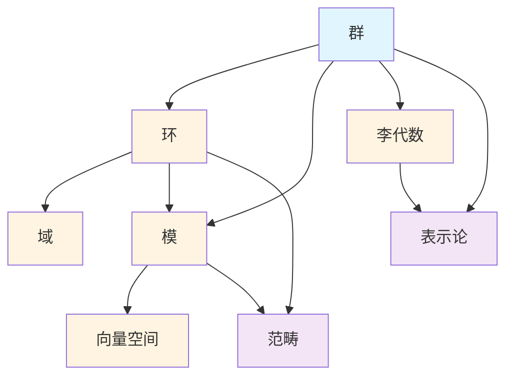

# 代数结构概念梳理

**主题编号**: C.03.02
**创建日期**: 2025年11月21日
**最后更新**: 2025年11月21日

---

## 📋 目录 / Table of Contents

- [代数结构概念梳理](#代数结构概念梳理)
  - [📋 目录 / Table of Contents](#-目录--table-of-contents)
  - [📋 概述 (编号: C.03.02.01)](#-概述-编号-c030201)
  - [🎯 核心概念体系 (编号: C.03.02.02)](#-核心概念体系-编号-c030202)
    - [1. 群论核心概念 (编号: C.03.02.02.01)](#1-群论核心概念-编号-c03020201)
      - [基础概念](#基础概念)
      - [特殊群](#特殊群)
      - [高级概念](#高级概念)
    - [2. 环论核心概念 (编号: C.03.02.02.02)](#2-环论核心概念-编号-c03020202)
      - [基础概念](#基础概念-1)
      - [特殊环](#特殊环)
      - [高级概念](#高级概念-1)
    - [3. 域论核心概念 (编号: C.03.02.02.03)](#3-域论核心概念-编号-c03020203)
      - [基础概念](#基础概念-2)
      - [伽罗瓦理论](#伽罗瓦理论)
    - [4. 模论核心概念 (编号: C.03.02.02.04)](#4-模论核心概念-编号-c03020204)
      - [基础概念](#基础概念-3)
      - [特殊模](#特殊模)
      - [高级概念](#高级概念-2)
    - [5. 线性代数核心概念 (编号: C.03.02.02.05)](#5-线性代数核心概念-编号-c03020205)
      - [基础概念](#基础概念-4)
      - [矩阵理论](#矩阵理论)
    - [6. 李代数核心概念 (编号: C.03.02.02.06)](#6-李代数核心概念-编号-c03020206)
      - [基础概念](#基础概念-5)
      - [分类理论](#分类理论)
      - [表示论](#表示论)
    - [7. 范畴论核心概念 (编号: C.03.02.02.07)](#7-范畴论核心概念-编号-c03020207)
      - [基础概念](#基础概念-6)
      - [函子理论](#函子理论)
      - [极限理论](#极限理论)
  - [🔗 概念关联图 (编号: C.03.02.03)](#-概念关联图-编号-c030203)
  - [📊 概念重要性矩阵 (编号: C.03.02.04)](#-概念重要性矩阵-编号-c030204)
  - [🎓 学习路径建议 (编号: C.03.02.05)](#-学习路径建议-编号-c030205)
    - [基础路径](#基础路径)
    - [进阶路径](#进阶路径)
    - [高级路径](#高级路径)

---

## 📋 概述 (编号: C.03.02.01)

本文档系统梳理代数结构领域的核心概念，包括群论、环论、域论、模论、线性代数、李代数、范畴论等。

---

## 🎯 核心概念体系 (编号: C.03.02.02)

### 1. 群论核心概念 (编号: C.03.02.02.01)

#### 基础概念

- **群 (Group)**: 满足结合律、单位元、逆元的代数结构
  - **严格定义**: 群 $(G, \cdot)$ 是集合 $G$ 和二元运算 $\cdot$，满足：
    - 结合律: $\forall a,b,c \in G, (a \cdot b) \cdot c = a \cdot (b \cdot c)$
    - 单位元: $\exists e \in G, \forall a \in G, e \cdot a = a \cdot e = a$
    - 逆元: $\forall a \in G, \exists a^{-1} \in G, a \cdot a^{-1} = a^{-1} \cdot a = e$
  - **性质**: 单位元唯一，每个元素的逆元唯一，消去律成立
- **子群 (Subgroup)**: 群的子集，本身也是群
  - **严格定义**: $H \subseteq G$ 是子群当且仅当 $H$ 非空且对运算和逆元封闭
  - **判定**: $H$ 是子群 $\Leftrightarrow$ $\forall a,b \in H, ab^{-1} \in H$
  - **性质**: 子群的交仍是子群
- **正规子群 (Normal Subgroup)**: 满足共轭不变性的子群
  - **严格定义**: $H \trianglelefteq G$ 当且仅当 $\forall g \in G, gHg^{-1} = H$
  - **等价条件**: $\forall g \in G, h \in H, ghg^{-1} \in H$
  - **性质**: 正规子群是商群的核
- **商群 (Quotient Group)**: 通过正规子群构造的群
  - **定义**: $G/H = \{gH : g \in G\}$，运算 $(g_1H)(g_2H) = (g_1g_2)H$
  - **条件**: 需要 $H$ 是正规子群才能保证运算良定义
  - **性质**: $|G/H| = |G|/|H|$（拉格朗日定理）
- **群同态 (Group Homomorphism)**: 保持群运算的映射
  - **严格定义**: $\phi: G \to H$ 是同态当且仅当 $\forall a,b \in G, \phi(ab) = \phi(a)\phi(b)$
  - **性质**: $\phi(e_G) = e_H$，$\phi(a^{-1}) = \phi(a)^{-1}$
  - **核**: $\ker(\phi) = \{g \in G : \phi(g) = e_H\}$ 是 $G$ 的正规子群
- **群同构 (Group Isomorphism)**: 双射的群同态
  - **定义**: 同态 $\phi: G \to H$ 如果是双射，则称为同构
  - **性质**: 同构的群在代数上完全相同，$G \cong H$ 表示 $G$ 与 $H$ 同构
  - **应用**: 分类群的结构
- **群作用 (Group Action)**: 群在集合上的作用

#### 特殊群

- **循环群 (Cyclic Group)**: 由一个元素生成的群
- **对称群 (Symmetric Group)**: 集合上所有置换构成的群
- **置换群 (Permutation Group)**: 对称群的子群
- **阿贝尔群 (Abelian Group)**: 满足交换律的群
- **有限群 (Finite Group)**: 元素个数有限的群
- **无限群 (Infinite Group)**: 元素个数无限的群

#### 高级概念

- **群的表示 (Group Representation)**: 群到线性群的同态
- **特征标 (Character)**: 表示的迹
- **不可约表示 (Irreducible Representation)**: 不能分解的表示
- **群的同调 (Group Cohomology)**: 群的同调理论

### 2. 环论核心概念 (编号: C.03.02.02.02)

#### 基础概念

- **环 (Ring)**: 满足加法群、乘法半群、分配律的代数结构
  - **严格定义**: 环 $(R, +, \cdot)$ 满足：
    - $(R, +)$ 是阿贝尔群
    - $(R, \cdot)$ 是半群（结合律）
    - 分配律: $a(b+c) = ab + ac$，$(a+b)c = ac + bc$
  - **性质**: $0 \cdot a = a \cdot 0 = 0$（零元性质）
  - **特殊环**: 有单位元的环、交换环、整环、域
- **子环 (Subring)**: 环的子集，本身也是环
  - **定义**: $S \subseteq R$ 是子环当且仅当 $S$ 对加法和乘法封闭，且包含加法逆元
  - **判定**: $S$ 非空，$\forall a,b \in S, a-b \in S$ 且 $ab \in S$
- **理想 (Ideal)**: 环的子集，满足吸收律
  - **严格定义**: $I \subseteq R$ 是理想当且仅当：
    - $(I, +)$ 是 $(R, +)$ 的子群
    - 吸收律: $\forall r \in R, a \in I, ra \in I$ 且 $ar \in I$
  - **性质**: 理想是商环的核，$R/I$ 是商环
- **主理想 (Principal Ideal)**: 由一个元素生成的理想
  - **定义**: $(a) = \{ra : r \in R\}$ 是由 $a$ 生成的主理想
  - **性质**: 整环中每个理想都是主理想时，称为主理想整环（PID）
- **素理想 (Prime Ideal)**: 满足素性条件的理想
  - **严格定义**: $P$ 是素理想当且仅当 $P \neq R$ 且 $\forall a,b \in R, ab \in P \Rightarrow a \in P \text{ 或 } b \in P$
  - **性质**: $R/P$ 是整环当且仅当 $P$ 是素理想
- **极大理想 (Maximal Ideal)**: 不被其他真理想包含的理想
  - **严格定义**: $M$ 是极大理想当且仅当 $M \neq R$ 且不存在理想 $I$ 使得 $M \subsetneq I \subsetneq R$
  - **性质**: $R/M$ 是域当且仅当 $M$ 是极大理想
- **商环 (Quotient Ring)**: 通过理想构造的环

#### 特殊环

- **整环 (Integral Domain)**: 无零因子的交换环
- **域 (Field)**: 非零元素都有逆元的整环
- **多项式环 (Polynomial Ring)**: 多项式的环
- **局部环 (Local Ring)**: 只有一个极大理想的环
- **诺特环 (Noetherian Ring)**: 理想满足升链条件的环

#### 高级概念

- **环的维数 (Krull Dimension)**: 环的维数理论
- **环的完备化 (Completion)**: 环的完备化理论
- **平坦性 (Flatness)**: 模的平坦性

### 3. 域论核心概念 (编号: C.03.02.02.03)

#### 基础概念

- **域 (Field)**: 非零元素都有逆元的整环
- **子域 (Subfield)**: 域的子集，本身也是域
- **域扩张 (Field Extension)**: 一个域包含另一个域
- **单扩张 (Simple Extension)**: 由一个元素生成的扩张
- **有限扩张 (Finite Extension)**: 扩张次数有限的扩张
- **代数扩张 (Algebraic Extension)**: 所有元素都是代数的扩张
- **超越扩张 (Transcendental Extension)**: 包含超越元素的扩张

#### 伽罗瓦理论

- **伽罗瓦群 (Galois Group)**: 域扩张的自同构群
- **伽罗瓦对应 (Galois Correspondence)**: 子群与子域的对应
- **可解群 (Solvable Group)**: 可以通过交换群构造的群
- **根式可解 (Solvable by Radicals)**: 方程可以用根式求解

### 4. 模论核心概念 (编号: C.03.02.02.04)

#### 基础概念

- **模 (Module)**: 环上的模结构
- **左模 (Left Module)**: 左作用模
- **右模 (Right Module)**: 右作用模
- **双模 (Bimodule)**: 左右作用模
- **子模 (Submodule)**: 模的子集，本身也是模
- **商模 (Quotient Module)**: 通过子模构造的模
- **模同态 (Module Homomorphism)**: 保持模运算的映射

#### 特殊模

- **自由模 (Free Module)**: 有基的模
- **投射模 (Projective Module)**: 投射性质的模
- **内射模 (Injective Module)**: 内射性质的模
- **平坦模 (Flat Module)**: 平坦性质的模
- **有限生成模 (Finitely Generated Module)**: 由有限个元素生成的模

#### 高级概念

- **张量积 (Tensor Product)**: 模的张量积
- **同调维数 (Homological Dimension)**: 模的同调维数
- **导出函子 (Derived Functor)**: Ext、Tor等导出函子

### 5. 线性代数核心概念 (编号: C.03.02.02.05)

#### 基础概念

- **向量空间 (Vector Space)**: 域上的向量空间
- **基 (Basis)**: 线性无关的生成集
- **维数 (Dimension)**: 基的元素个数
- **子空间 (Subspace)**: 向量空间的子集，本身也是向量空间
- **线性映射 (Linear Map)**: 保持线性运算的映射
- **矩阵 (Matrix)**: 线性映射的表示

#### 矩阵理论

- **矩阵运算**: 加法、乘法、转置
- **行列式 (Determinant)**: 矩阵的行列式
- **特征值 (Eigenvalue)**: 矩阵的特征值
- **特征向量 (Eigenvector)**: 矩阵的特征向量
- **相似矩阵 (Similar Matrix)**: 通过相似变换相关的矩阵
- **对角化 (Diagonalization)**: 矩阵的对角化

### 6. 李代数核心概念 (编号: C.03.02.02.06)

#### 基础概念

- **李代数 (Lie Algebra)**: 满足雅可比恒等式的代数结构
- **李括号 (Lie Bracket)**: 李代数的二元运算
- **结构常数 (Structure Constants)**: 李代数的结构常数
- **子代数 (Subalgebra)**: 李代数的子集，本身也是李代数
- **理想 (Ideal)**: 李代数的理想
- **商代数 (Quotient Algebra)**: 通过理想构造的李代数

#### 分类理论

- **单李代数 (Simple Lie Algebra)**: 没有非平凡理想的李代数
- **半单李代数 (Semisimple Lie Algebra)**: 单李代数的直和
- **可解李代数 (Solvable Lie Algebra)**: 可解的李代数
- **幂零李代数 (Nilpotent Lie Algebra)**: 幂零的李代数

#### 表示论

- **李代数表示 (Lie Algebra Representation)**: 李代数到线性代数的同态
- **最高权表示 (Highest Weight Representation)**: 最高权表示理论

### 7. 范畴论核心概念 (编号: C.03.02.02.07)

#### 基础概念

- **范畴 (Category)**: 对象和态射的集合
- **对象 (Object)**: 范畴中的对象
- **态射 (Morphism)**: 对象之间的映射
- **复合 (Composition)**: 态射的复合
- **恒等态射 (Identity Morphism)**: 恒等映射

#### 函子理论

- **函子 (Functor)**: 范畴之间的映射
- **协变函子 (Covariant Functor)**: 保持方向的函子
- **反变函子 (Contravariant Functor)**: 反转方向的函子
- **自然变换 (Natural Transformation)**: 函子之间的映射

#### 极限理论

- **极限 (Limit)**: 范畴的极限
- **余极限 (Colimit)**: 范畴的余极限
- **积 (Product)**: 范畴的积
- **余积 (Coproduct)**: 范畴的余积
- **等化子 (Equalizer)**: 范畴的等化子
- **拉回 (Pullback)**: 范畴的拉回

---

## 🔗 概念关联图 (编号: C.03.02.03)

---

## 📊 概念重要性矩阵 (编号: C.03.02.04)

| 概念 | 基础性 | 应用性 | 重要性 | 学习优先级 |
|-----|--------|--------|--------|-----------|
| 群 | ⭐⭐⭐⭐⭐ | ⭐⭐⭐⭐⭐ | ⭐⭐⭐⭐⭐ | 1 |
| 环 | ⭐⭐⭐⭐⭐ | ⭐⭐⭐⭐ | ⭐⭐⭐⭐⭐ | 2 |
| 域 | ⭐⭐⭐⭐⭐ | ⭐⭐⭐⭐ | ⭐⭐⭐⭐⭐ | 3 |
| 模 | ⭐⭐⭐⭐ | ⭐⭐⭐⭐ | ⭐⭐⭐⭐ | 4 |
| 向量空间 | ⭐⭐⭐⭐⭐ | ⭐⭐⭐⭐⭐ | ⭐⭐⭐⭐⭐ | 1 |
| 李代数 | ⭐⭐⭐ | ⭐⭐⭐⭐ | ⭐⭐⭐⭐ | 5 |
| 范畴 | ⭐⭐⭐ | ⭐⭐⭐ | ⭐⭐⭐⭐ | 6 |

---

## 🎓 学习路径建议 (编号: C.03.02.05)

### 基础路径

1. **向量空间** → **线性映射** → **矩阵理论**
2. **群** → **子群** → **群同态** → **商群**
3. **环** → **理想** → **商环** → **域**

### 进阶路径

1. **模论** → **张量积** → **同调代数**
2. **李代数** → **表示论** → **李群**
3. **范畴论** → **函子** → **极限理论**

### 高级路径

1. **导出范畴** → **三角范畴** → **稳定范畴**
2. **几何表示论** → **朗兰兹纲领**
3. **∞-范畴** → **同伦代数**

---

**创建日期**: 2025年11月21日
**最后更新**: 2025年11月21日
**维护状态**: 持续更新中
