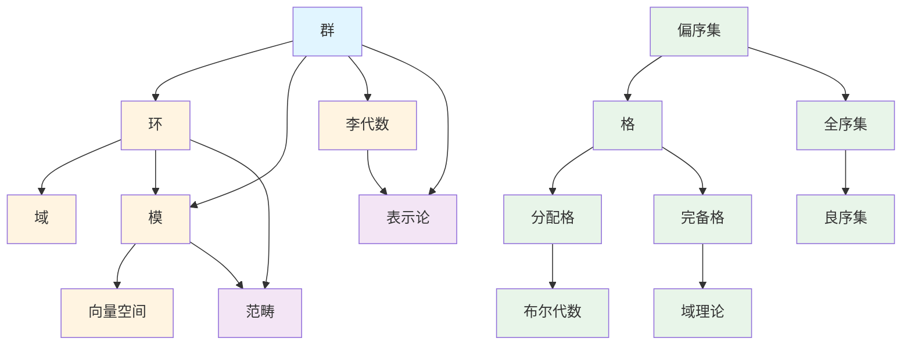

# 代数结构概念梳理

**主题编号**: C.03.02
**创建日期**: 2025年11月21日
**最后更新**: 2025年1月（三视角转换全面完成）

---

## 📋 目录 / Table of Contents

- [代数结构概念梳理](#代数结构概念梳理)
  - [📋 目录 / Table of Contents](#-目录--table-of-contents)
  - [📋 概述 (编号: C.03.02.01)](#-概述-编号-c030201)
  - [🎯 核心概念体系 (编号: C.03.02.02)](#-核心概念体系-编号-c030202)
    - [1. 群论核心概念 (编号: C.03.02.02.01)](#1-群论核心概念-编号-c03020201)
      - [基础概念](#基础概念)
      - [特殊群](#特殊群)
      - [高级概念](#高级概念)
    - [2. 环论核心概念 (编号: C.03.02.02.02)](#2-环论核心概念-编号-c03020202)
      - [基础概念](#基础概念-1)
      - [特殊环](#特殊环)
      - [高级概念](#高级概念-1)
    - [3. 域论核心概念 (编号: C.03.02.02.03)](#3-域论核心概念-编号-c03020203)
      - [基础概念](#基础概念-2)
      - [伽罗瓦理论](#伽罗瓦理论)
    - [4. 模论核心概念 (编号: C.03.02.02.04)](#4-模论核心概念-编号-c03020204)
      - [基础概念](#基础概念-3)
      - [特殊模](#特殊模)
      - [高级概念](#高级概念-2)
    - [5. 线性代数核心概念 (编号: C.03.02.02.05)](#5-线性代数核心概念-编号-c03020205)
      - [基础概念](#基础概念-4)
      - [矩阵理论](#矩阵理论)
    - [6. 李代数核心概念 (编号: C.03.02.02.06)](#6-李代数核心概念-编号-c03020206)
      - [基础概念](#基础概念-5)
      - [分类理论](#分类理论)
      - [表示论](#表示论)
    - [7. 范畴论核心概念 (编号: C.03.02.02.07)](#7-范畴论核心概念-编号-c03020207)
      - [基础概念](#基础概念-6)
      - [函子理论](#函子理论)
      - [极限理论](#极限理论)
  - [🔗 概念关联图 (编号: C.03.02.03)](#-概念关联图-编号-c030203)
  - [📊 概念重要性矩阵 (编号: C.03.02.04)](#-概念重要性矩阵-编号-c030204)
  - [🎓 学习路径建议 (编号: C.03.02.05)](#-学习路径建议-编号-c030205)
    - [基础路径](#基础路径)
    - [进阶路径](#进阶路径)
    - [高级路径](#高级路径)
    - [8. 序结构核心概念 (编号: C.03.02.02.08) ⭐ 新增](#8-序结构核心概念-编号-c03020208--新增)
      - [偏序集与格](#偏序集与格)
      - [分配格与布尔代数](#分配格与布尔代数)
      - [完备格与域理论](#完备格与域理论)

---

## 📋 概述 (编号: C.03.02.01)

本文档系统梳理代数结构领域的核心概念，包括群论、环论、域论、模论、线性代数、李代数、范畴论等。

**核心概念三视角版本**: 本文档中涉及的以下核心概念已有三视角深度版本：

- [群](../核心概念/08-群-三视角版.md) (C.CORE.008) - 群论核心概念的三视角深度分析
- [环](../核心概念/09-环-三视角版.md) (C.CORE.009) - 环论核心概念的三视角深度分析
- [域](../核心概念/10-域-三视角版.md) (C.CORE.010) - 域论核心概念的三视角深度分析
- [向量空间](../核心概念/11-向量空间-三视角版.md) (C.CORE.011) - 线性代数核心概念的三视角深度分析
- [线性映射](../核心概念/12-线性映射-三视角版.md) (C.CORE.012) - 线性映射核心概念的三视角深度分析

详见：[核心概念索引](../核心概念/00-核心概念索引.md) - 所有33个核心概念的三视角版本

**哲学背景**: 代数结构的发展体现了结构主义的思想。布尔巴基学派用结构统一数学，范畴论为结构主义提供了现代工具。抽象代数的公理化方法体现了形式主义的影响。详见[数学哲学维度矩阵](../02-知识矩阵/09-数学哲学维度矩阵.md)。

**权威资源对齐**: 本文档的概念定义和结构参考了Wikipedia代数条目、MIT 18.701-18.702抽象代数课程、Stanford和Princeton的代数课程，以及Metamath的代数定理。详见[权威资源对齐说明](../00-权威资源对齐说明.md)和[权威资源对标改进计划](../00-权威资源对标改进计划.md)。

---

## 🎯 核心概念体系 (编号: C.03.02.02)

### 1. 群论核心概念 (编号: C.03.02.02.01)

#### 基础概念

- **群 (Group)**: 满足结合律、单位元、逆元的代数结构
  - **严格定义**: 群 $(G, \cdot)$ 是集合 $G$ 和二元运算 $\cdot$，满足：
    - 结合律: $\forall a,b,c \in G, (a \cdot b) \cdot c = a \cdot (b \cdot c)$
    - 单位元: $\exists e \in G, \forall a \in G, e \cdot a = a \cdot e = a$
    - 逆元: $\forall a \in G, \exists a^{-1} \in G, a \cdot a^{-1} = a^{-1} \cdot a = e$
  - **历史背景**: 群概念由Galois（1832）在研究方程可解性时引入，Cayley（1854）给出抽象定义，现代群论由Burnside、Frobenius等发展
  - **性质**: 单位元唯一，每个元素的逆元唯一，消去律成立
  - **应用**: 对称性研究、密码学、物理（粒子物理、晶体学）、化学（分子对称性）
  - **参考文献**:
    - Wikipedia: [Group (Mathematics)](https://en.wikipedia.org/wiki/Group_(mathematics))
    - Artin, M. (2011). *Algebra*. Prentice Hall.
    - Lang, S. (2002). *Algebra*. Springer.
    - Dummit, D. S., & Foote, R. M. (2004). *Abstract Algebra*. Wiley.
- **子群 (Subgroup)**: 群的子集，本身也是群
  - **严格定义**: $H \subseteq G$ 是子群当且仅当 $H$ 非空且对运算和逆元封闭
  - **判定**: $H$ 是子群 $\Leftrightarrow$ $\forall a,b \in H, ab^{-1} \in H$
  - **性质**: 子群的交仍是子群，子群的并一般不是子群
  - **拉格朗日定理**: 若 $H$ 是有限群 $G$ 的子群，则 $|H|$ 整除 $|G|$，即 $|G| = |H| \cdot |G/H|$
  - **应用**: 群的结构分析、分类理论
- **正规子群 (Normal Subgroup)**: 满足共轭不变性的子群
  - **严格定义**: $H \trianglelefteq G$ 当且仅当 $\forall g \in G, gHg^{-1} = H$
  - **等价条件**:
    - $\forall g \in G, h \in H, ghg^{-1} \in H$
    - $\forall g \in G, gH = Hg$（左陪集等于右陪集）
  - **性质**: 正规子群是商群的核，阿贝尔群的子群都是正规子群
  - **应用**: 构造商群、群同态定理
- **商群 (Quotient Group)**: 通过正规子群构造的群
  - **定义**: $G/H = \{gH : g \in G\}$，运算 $(g_1H)(g_2H) = (g_1g_2)H$
  - **条件**: 需要 $H$ 是正规子群才能保证运算良定义（否则陪集乘法不封闭）
  - **性质**: $|G/H| = |G|/|H|$（拉格朗日定理），$G/H$ 的单位元是 $H$
  - **同态定理**: 若 $\phi: G \to K$ 是群同态，则 $G/\ker(\phi) \cong \text{im}(\phi)$
  - **应用**: 群的结构分解、同态像的构造
- **群同态 (Group Homomorphism)**: 保持群运算的映射
  - **严格定义**: $\phi: G \to H$ 是同态当且仅当 $\forall a,b \in G, \phi(ab) = \phi(a)\phi(b)$
  - **性质**:
    - $\phi(e_G) = e_H$（单位元映射到单位元）
    - $\phi(a^{-1}) = \phi(a)^{-1}$（逆元映射到逆元）
    - $\phi(a^n) = \phi(a)^n$（幂映射到幂）
  - **核**: $\ker(\phi) = \{g \in G : \phi(g) = e_H\}$ 是 $G$ 的正规子群
  - **像**: $\text{im}(\phi) = \{\phi(g) : g \in G\}$ 是 $H$ 的子群
  - **应用**: 群的结构比较、表示理论
- **群同构 (Group Isomorphism)**: 双射的群同态
  - **定义**: 同态 $\phi: G \to H$ 如果是双射，则称为同构
  - **性质**: 同构的群在代数上完全相同，$G \cong H$ 表示 $G$ 与 $H$ 同构
  - **应用**: 分类群的结构
- **群作用 (Group Action)**: 群在集合上的作用
  - **严格定义**: 群 $G$ 在集合 $X$ 上的作用是一个映射 $G \times X \to X$，$(g,x) \mapsto g \cdot x$，满足：
    - $e \cdot x = x$（单位元作用不变）
    - $(gh) \cdot x = g \cdot (h \cdot x)$（结合律）
  - **轨道**: $G \cdot x = \{g \cdot x : g \in G\}$ 是 $x$ 的轨道
  - **稳定子**: $\text{Stab}_G(x) = \{g \in G : g \cdot x = x\}$ 是 $x$ 的稳定子群
  - **轨道-稳定子定理**: $|G \cdot x| = |G|/|\text{Stab}_G(x)|$
  - **应用**: 计数问题、对称性分析、Burnside引理

#### 特殊群

- **循环群 (Cyclic Group)**: 由一个元素生成的群
  - **定义**: 群 $G$ 是循环群当且仅当存在 $g \in G$ 使得 $G = \langle g \rangle = \{g^n : n \in \mathbb{Z}\}$
  - **分类**: 有限循环群同构于 $\mathbb{Z}/n\mathbb{Z}$，无限循环群同构于 $\mathbb{Z}$
  - **性质**: 循环群是阿贝尔群，循环群的子群仍是循环群
  - **应用**: 数论、密码学（RSA算法）
  - **参考文献**:
    - Wikipedia: [Cyclic Group](https://en.wikipedia.org/wiki/Cyclic_group)
- **对称群 (Symmetric Group)**: 集合上所有置换构成的群
  - **定义**: $S_n$ 是 $n$ 元集合上所有置换构成的群，$|S_n| = n!$
  - **性质**: $S_n$ 由对换生成，$S_n$ 的每个置换可以唯一分解为不相交循环的乘积
  - **应用**: 组合数学、Galois理论（$S_n$ 是 $n$ 次一般方程的Galois群）
  - **参考文献**:
    - Wikipedia: [Symmetric Group](https://en.wikipedia.org/wiki/Symmetric_group)
- **置换群 (Permutation Group)**: 对称群的子群
  - **定义**: $G \leq S_n$ 是 $n$ 元集合上的置换群
  - **Cayley定理**: 每个有限群都同构于某个置换群
  - **应用**: 群表示、组合结构
- **阿贝尔群 (Abelian Group)**: 满足交换律的群
  - **定义**: 群 $G$ 是阿贝尔群当且仅当 $\forall a,b \in G, ab = ba$
  - **历史背景**: 以Abel命名，纪念其在方程可解性方面的贡献
  - **结构定理**: 有限生成阿贝尔群分类定理（主理想整环上的模）
  - **应用**: 数论、代数拓扑（同调群）、代数几何
  - **参考文献**:
    - Wikipedia: [Abelian Group](https://en.wikipedia.org/wiki/Abelian_group)
    - Lang, S. (2002). *Algebra*. Springer.
- **有限群 (Finite Group)**: 元素个数有限的群
  - **定义**: $|G| < \infty$
  - **分类问题**: 有限单群分类（2004年完成，是数学史上最大的证明）
  - **应用**: 晶体学、化学（分子对称性）、密码学
- **无限群 (Infinite Group)**: 元素个数无限的群
  - **定义**: $|G| = \infty$
  - **例子**: $\mathbb{Z}$（整数加法群）、$\mathbb{R}^*$（非零实数乘法群）、$GL_n(\mathbb{R})$（一般线性群）
  - **应用**: 拓扑群、李群

#### 高级概念

- **群的表示 (Group Representation)**: 群到线性群的同态
- **特征标 (Character)**: 表示的迹
- **不可约表示 (Irreducible Representation)**: 不能分解的表示
- **群的同调 (Group Cohomology)**: 群的同调理论

### 2. 环论核心概念 (编号: C.03.02.02.02)

#### 基础概念

- **环 (Ring)**: 满足加法群、乘法半群、分配律的代数结构
  - **严格定义**: 环 $(R, +, \cdot)$ 满足：
    - $(R, +)$ 是阿贝尔群
    - $(R, \cdot)$ 是半群（结合律）
    - 分配律: $a(b+c) = ab + ac$，$(a+b)c = ac + bc$
  - **历史背景**: 环概念由Dedekind（1871）在研究代数数时引入，Noether（1921）建立现代环论
  - **性质**:
    - $0 \cdot a = a \cdot 0 = 0$（零元性质）
    - $(-a) \cdot b = -(ab) = a \cdot (-b)$
  - **特殊环**: 有单位元的环、交换环、整环、域
  - **应用**: 代数数论、代数几何、编码理论
  - **参考文献**:
    - Wikipedia: [Ring (Mathematics)](https://en.wikipedia.org/wiki/Ring_(mathematics))
    - Atiyah, M. F., & Macdonald, I. G. (1969). *Introduction to Commutative Algebra*. Addison-Wesley.
    - Lang, S. (2002). *Algebra*. Springer.
- **子环 (Subring)**: 环的子集，本身也是环
  - **定义**: $S \subseteq R$ 是子环当且仅当 $S$ 对加法和乘法封闭，且包含加法逆元
  - **判定**: $S$ 非空，$\forall a,b \in S, a-b \in S$ 且 $ab \in S$
- **理想 (Ideal)**: 环的子集，满足吸收律
  - **严格定义**: $I \subseteq R$ 是理想当且仅当：
    - $(I, +)$ 是 $(R, +)$ 的子群
    - 吸收律: $\forall r \in R, a \in I, ra \in I$ 且 $ar \in I$
  - **历史背景**: 理想概念由Dedekind（1871）引入，用于推广数论中的整除概念
  - **性质**:
    - 理想是商环的核，$R/I$ 是商环
    - 理想的交仍是理想，理想的并一般不是理想
    - 理想的和 $I + J = \{a + b : a \in I, b \in J\}$ 是理想
  - **应用**: 构造商环、同态定理、代数几何（代数集的理想对应）
- **主理想 (Principal Ideal)**: 由一个元素生成的理想
  - **定义**: $(a) = \{ra : r \in R\}$ 是由 $a$ 生成的主理想
  - **性质**: 整环中每个理想都是主理想时，称为主理想整环（PID）
- **素理想 (Prime Ideal)**: 满足素性条件的理想
  - **严格定义**: $P$ 是素理想当且仅当 $P \neq R$ 且 $\forall a,b \in R, ab \in P \Rightarrow a \in P \text{ 或 } b \in P$
  - **性质**: $R/P$ 是整环当且仅当 $P$ 是素理想
- **极大理想 (Maximal Ideal)**: 不被其他真理想包含的理想
  - **严格定义**: $M$ 是极大理想当且仅当 $M \neq R$ 且不存在理想 $I$ 使得 $M \subsetneq I \subsetneq R$
  - **性质**: $R/M$ 是域当且仅当 $M$ 是极大理想
- **商环 (Quotient Ring)**: 通过理想构造的环
  - **定义**: $R/I = \{r + I : r \in R\}$，运算 $(r_1 + I)(r_2 + I) = (r_1r_2) + I$
  - **同态定理**: 若 $\phi: R \to S$ 是环同态，则 $R/\ker(\phi) \cong \text{im}(\phi)$
  - **应用**: 构造新环、同态像的构造

#### 特殊环

- **整环 (Integral Domain)**: 无零因子的交换环
  - **定义**: 交换环 $R$ 是整环当且仅当 $R \neq \{0\}$ 且 $\forall a,b \in R, ab = 0 \Rightarrow a = 0 \text{ 或 } b = 0$
  - **性质**: 整环中消去律成立，整环的子环仍是整环
  - **例子**: $\mathbb{Z}$（整数环）、$\mathbb{Z}[i]$（高斯整数环）、多项式环 $F[x]$（$F$ 是域）
  - **应用**: 唯一分解、代数数论
  - **参考文献**:
    - Wikipedia: [Integral Domain](https://en.wikipedia.org/wiki/Integral_domain)
- **域 (Field)**: 非零元素都有逆元的整环
  - **定义**: 域 $F$ 是交换环，且 $F^* = F \setminus \{0\}$ 在乘法下构成群
  - **性质**: 域是整环，域的理想只有 $\{0\}$ 和 $F$
  - **例子**: $\mathbb{Q}$（有理数域）、$\mathbb{R}$（实数域）、$\mathbb{C}$（复数域）、$\mathbb{F}_p$（有限域，$p$ 是素数）
  - **应用**: 线性代数、Galois理论、编码理论
  - **参考文献**:
    - Wikipedia: [Field (Mathematics)](https://en.wikipedia.org/wiki/Field_(mathematics))
- **多项式环 (Polynomial Ring)**: 多项式的环
  - **定义**: $R[x] = \{a_0 + a_1x + \cdots + a_nx^n : a_i \in R, n \in \mathbb{N}\}$
  - **性质**: 若 $R$ 是整环，则 $R[x]$ 也是整环；若 $R$ 是域，则 $R[x]$ 是主理想整环
  - **应用**: 代数方程、代数几何、编码理论
  - **参考文献**:
    - Wikipedia: [Polynomial Ring](https://en.wikipedia.org/wiki/Polynomial_ring)
- **局部环 (Local Ring)**: 只有一个极大理想的环
  - **定义**: 环 $R$ 是局部环当且仅当 $R$ 有唯一的极大理想 $M$
  - **性质**: $R/M$ 是域（称为剩余域），$R \setminus M$ 是 $R$ 的单位群
  - **应用**: 代数几何（局部化）、交换代数
  - **参考文献**:
    - Wikipedia: [Local Ring](https://en.wikipedia.org/wiki/Local_ring)
- **诺特环 (Noetherian Ring)**: 理想满足升链条件的环
  - **定义**: 环 $R$ 是诺特环当且仅当每个理想升链 $I_1 \subseteq I_2 \subseteq \cdots$ 都稳定（存在 $n$ 使得 $I_n = I_{n+1} = \cdots$）
  - **等价条件**: 每个理想都是有限生成的
  - **历史背景**: 以Noether命名，纪念其在代数方面的贡献
  - **Hilbert基定理**: 若 $R$ 是诺特环，则 $R[x]$ 也是诺特环
  - **应用**: 代数几何、交换代数
  - **参考文献**:
    - Wikipedia: [Noetherian Ring](https://en.wikipedia.org/wiki/Noetherian_ring)
    - Atiyah, M. F., & Macdonald, I. G. (1969). *Introduction to Commutative Algebra*. Addison-Wesley.

#### 高级概念

- **环的维数 (Krull Dimension)**: 环的维数理论
- **环的完备化 (Completion)**: 环的完备化理论
- **平坦性 (Flatness)**: 模的平坦性

### 3. 域论核心概念 (编号: C.03.02.02.03)

#### 基础概念

- **域 (Field)**: 非零元素都有逆元的整环
- **子域 (Subfield)**: 域的子集，本身也是域
- **域扩张 (Field Extension)**: 一个域包含另一个域
- **单扩张 (Simple Extension)**: 由一个元素生成的扩张
- **有限扩张 (Finite Extension)**: 扩张次数有限的扩张
- **代数扩张 (Algebraic Extension)**: 所有元素都是代数的扩张
- **超越扩张 (Transcendental Extension)**: 包含超越元素的扩张

#### 伽罗瓦理论

- **伽罗瓦群 (Galois Group)**: 域扩张的自同构群
- **伽罗瓦对应 (Galois Correspondence)**: 子群与子域的对应
- **可解群 (Solvable Group)**: 可以通过交换群构造的群
- **根式可解 (Solvable by Radicals)**: 方程可以用根式求解

### 4. 模论核心概念 (编号: C.03.02.02.04)

#### 基础概念

- **模 (Module)**: 环上的模结构
- **左模 (Left Module)**: 左作用模
- **右模 (Right Module)**: 右作用模
- **双模 (Bimodule)**: 左右作用模
- **子模 (Submodule)**: 模的子集，本身也是模
- **商模 (Quotient Module)**: 通过子模构造的模
- **模同态 (Module Homomorphism)**: 保持模运算的映射

#### 特殊模

- **自由模 (Free Module)**: 有基的模
- **投射模 (Projective Module)**: 投射性质的模
- **内射模 (Injective Module)**: 内射性质的模
- **平坦模 (Flat Module)**: 平坦性质的模
- **有限生成模 (Finitely Generated Module)**: 由有限个元素生成的模

#### 高级概念

- **张量积 (Tensor Product)**: 模的张量积
- **同调维数 (Homological Dimension)**: 模的同调维数
- **导出函子 (Derived Functor)**: Ext、Tor等导出函子

### 5. 线性代数核心概念 (编号: C.03.02.02.05)

#### 基础概念

- **向量空间 (Vector Space)**: 域上的向量空间
- **基 (Basis)**: 线性无关的生成集
- **维数 (Dimension)**: 基的元素个数
- **子空间 (Subspace)**: 向量空间的子集，本身也是向量空间
- **线性映射 (Linear Map)**: 保持线性运算的映射
- **矩阵 (Matrix)**: 线性映射的表示

#### 矩阵理论

- **矩阵运算**: 加法、乘法、转置
- **行列式 (Determinant)**: 矩阵的行列式
- **特征值 (Eigenvalue)**: 矩阵的特征值
- **特征向量 (Eigenvector)**: 矩阵的特征向量
- **相似矩阵 (Similar Matrix)**: 通过相似变换相关的矩阵
- **对角化 (Diagonalization)**: 矩阵的对角化

### 6. 李代数核心概念 (编号: C.03.02.02.06)

**定义**: 李代数是配备李括号（满足反对称性和雅可比恒等式）的向量空间，是研究李群和连续对称性的代数工具。

**历史背景**: 从19世纪的Sophus Lie，到20世纪的Cartan分类，再到现代的表示论和量子群。

#### 基础概念

- **李代数 (Lie Algebra)**: 李代数
  - **严格定义**: 向量空间 $\mathfrak{g}$ 配备双线性映射 $[\cdot, \cdot]: \mathfrak{g} \times \mathfrak{g} \to \mathfrak{g}$，满足：
    - 反对称性：$[x,y] = -[y,x]$
    - 雅可比恒等式：$[x,[y,z]] + [y,[z,x]] + [z,[x,y]] = 0$
  - **性质**: 非结合代数，与李群对应（通过指数映射）
  - **应用**: 李群、物理中的对称性、微分几何
- **李括号 (Lie Bracket)**: 李括号
  - **定义**: 李代数的二元运算 $[\cdot, \cdot]$
  - **性质**: 反对称、满足雅可比恒等式
  - **应用**: 定义李代数结构、李群的对数映射
- **结构常数 (Structure Constants)**: 结构常数
  - **定义**: 在基 $\{e_i\}$ 下，$[e_i, e_j] = \sum_k c_{ij}^k e_k$，$c_{ij}^k$ 是结构常数
  - **性质**: 反对称性、雅可比恒等式
  - **应用**: 分类李代数、计算
- **子代数 (Subalgebra)**: 子代数
  - **定义**: 李代数 $\mathfrak{g}$ 的子空间 $\mathfrak{h}$，满足 $[\mathfrak{h}, \mathfrak{h}] \subseteq \mathfrak{h}$
  - **性质**: 本身是李代数
  - **应用**: 分类、表示论
- **理想 (Ideal)**: 理想
  - **定义**: 子代数 $\mathfrak{i}$ 满足 $[\mathfrak{g}, \mathfrak{i}] \subseteq \mathfrak{i}$
  - **性质**: 可以构造商代数
  - **应用**: 分类、表示论
- **商代数 (Quotient Algebra)**: 商代数
  - **定义**: $\mathfrak{g}/\mathfrak{i}$ 是商向量空间，配备诱导的李括号
  - **性质**: 是李代数
  - **应用**: 分类、表示论

#### 分类理论

- **单李代数 (Simple Lie Algebra)**: 单李代数
  - **定义**: 没有非平凡理想的李代数
  - **分类**: Cartan分类（A, B, C, D, E, F, G型）
  - **应用**: 李群分类、表示论
- **半单李代数 (Semisimple Lie Algebra)**: 半单李代数
  - **定义**: 单李代数的直和
  - **性质**: Killing形式非退化
  - **应用**: 表示论、物理
- **可解李代数 (Solvable Lie Algebra)**: 可解李代数
  - **定义**: 导出列 $\mathfrak{g}^{(n)} = 0$ 对某个 $n$
  - **性质**: 可解李群对应
  - **应用**: 分类、表示论
- **幂零李代数 (Nilpotent Lie Algebra)**: 幂零李代数
  - **定义**: 下中心列 $\mathfrak{g}^n = 0$ 对某个 $n$
  - **性质**: 幂零李群对应
  - **应用**: 分类、表示论

#### 表示论

- **李代数表示 (Lie Algebra Representation)**: 李代数表示
  - **定义**: 李代数同态 $\rho: \mathfrak{g} \to \mathfrak{gl}(V)$
  - **性质**: 与李群表示对应（通过微分）
  - **应用**: 物理中的对称性、调和分析
- **最高权表示 (Highest Weight Representation)**: 最高权表示
  - **定义**: 半单李代数的不可约表示，由最高权确定
  - **性质**: 分类、特征标公式
  - **应用**: 表示论、物理

### 7. 范畴论核心概念 (编号: C.03.02.02.07)

**定义**: 范畴论是研究数学结构及其关系的抽象理论，通过对象、态射、函子等概念统一描述不同数学分支的结构。

**历史背景**: 从20世纪40年代的Eilenberg-MacLane，到60年代的Grothendieck，再到现代的无穷范畴和同伦类型论。

#### 基础概念

- **范畴 (Category)**: 范畴
  - **严格定义**: 范畴 $\mathcal{C}$ 由对象集合 $\text{Ob}(\mathcal{C})$ 和态射集合 $\text{Mor}(\mathcal{C})$ 组成，满足：
    - 对每个对象 $X$，有恒等态射 $\text{id}_X$
    - 态射可以复合，满足结合律和单位律
  - **形式化**: $(X, Y) \mapsto \text{Hom}(X, Y)$，$\text{id}_X \in \text{Hom}(X, X)$，复合满足结合律
  - **性质**: 抽象结构，统一描述数学对象
  - **应用**: 代数几何、拓扑学、逻辑学
- **对象 (Object)**: 对象
  - **定义**: 范畴中的元素，如集合、群、拓扑空间
  - **性质**: 由态射关系定义
  - **应用**: 抽象数学结构
- **态射 (Morphism)**: 态射
  - **定义**: 对象之间的映射，如函数、群同态、连续映射
  - **性质**: 可以复合，满足结合律
  - **应用**: 结构保持映射
- **复合 (Composition)**: 复合
  - **定义**: 态射 $f: X \to Y$ 和 $g: Y \to Z$ 的复合 $g \circ f: X \to Z$
  - **性质**: 结合律：$(h \circ g) \circ f = h \circ (g \circ f)$
  - **应用**: 构造新态射
- **恒等态射 (Identity Morphism)**: 恒等态射
  - **定义**: 对每个对象 $X$，恒等态射 $\text{id}_X: X \to X$ 满足 $f \circ \text{id}_X = f$，$\text{id}_X \circ g = g$
  - **性质**: 唯一性
  - **应用**: 定义同构

#### 函子理论

- **函子 (Functor)**: 函子
  - **严格定义**: 函子 $F: \mathcal{C} \to \mathcal{D}$ 将对象映射到对象，态射映射到态射，保持复合和恒等
  - **形式化**: $F(f: X \to Y) = F(f): F(X) \to F(Y)$，$F(g \circ f) = F(g) \circ F(f)$，$F(\text{id}_X) = \text{id}_{F(X)}$
  - **性质**: 保持范畴结构
  - **应用**: 代数几何（层函子）、拓扑学（同调函子）
- **协变函子 (Covariant Functor)**: 协变函子
  - **定义**: 保持方向的函子
  - **性质**: $F(f: X \to Y) = F(f): F(X) \to F(Y)$
  - **应用**: 同调函子、张量积
- **反变函子 (Contravariant Functor)**: 反变函子
  - **定义**: 反转方向的函子
  - **性质**: $F(f: X \to Y) = F(f): F(Y) \to F(X)$
  - **应用**: 上同调函子、对偶
- **自然变换 (Natural Transformation)**: 自然变换
  - **定义**: 函子之间的映射 $\eta: F \Rightarrow G$，对每个对象 $X$ 有态射 $\eta_X: F(X) \to G(X)$，满足自然性
  - **形式化**: 对态射 $f: X \to Y$，$G(f) \circ \eta_X = \eta_Y \circ F(f)$
  - **性质**: 可以复合
  - **应用**: 同调理论、表示论

#### 极限理论

- **极限 (Limit)**: 极限
  - **定义**: 图 $D: J \to \mathcal{C}$ 的极限是对象 $L$ 和态射族 $\pi_j: L \to D(j)$，满足泛性质
  - **性质**: 唯一性（在同构意义下）
  - **应用**: 积、等化子、拉回
- **余极限 (Colimit)**: 余极限
  - **定义**: 图 $D: J \to \mathcal{C}$ 的余极限是对象 $C$ 和态射族 $\iota_j: D(j) \to C$，满足泛性质
  - **性质**: 对偶于极限
  - **应用**: 余积、余等化子、推出
- **积 (Product)**: 积
  - **定义**: 对象族 $\{X_i\}$ 的积是对象 $P$ 和投影 $\pi_i: P \to X_i$，满足泛性质
  - **性质**: 唯一性
  - **应用**: 笛卡尔积、直积
- **余积 (Coproduct)**: 余积
  - **定义**: 对象族 $\{X_i\}$ 的余积是对象 $C$ 和包含 $\iota_i: X_i \to C$，满足泛性质
  - **性质**: 对偶于积
  - **应用**: 不交并、直和
- **等化子 (Equalizer)**: 等化子
  - **定义**: 态射 $f, g: X \to Y$ 的等化子是对象 $E$ 和态射 $e: E \to X$，使得 $f \circ e = g \circ e$，满足泛性质
  - **性质**: 核的对偶
  - **应用**: 方程的解、核
- **拉回 (Pullback)**: 拉回
  - **定义**: 态射 $f: X \to Z$ 和 $g: Y \to Z$ 的拉回是对象 $P$ 和态射 $p_1: P \to X$，$p_2: P \to Y$，使得 $f \circ p_1 = g \circ p_2$，满足泛性质
  - **性质**: 纤维积
  - **应用**: 纤维积、基变换

---

## 🔗 概念关联图 (编号: C.03.02.03)

---

## 📊 概念重要性矩阵 (编号: C.03.02.04)

| 概念 | 基础性 | 应用性 | 重要性 | 学习优先级 |
|-----|--------|--------|--------|-----------|
| 群 | ⭐⭐⭐⭐⭐ | ⭐⭐⭐⭐⭐ | ⭐⭐⭐⭐⭐ | 1 |
| 环 | ⭐⭐⭐⭐⭐ | ⭐⭐⭐⭐ | ⭐⭐⭐⭐⭐ | 2 |
| 域 | ⭐⭐⭐⭐⭐ | ⭐⭐⭐⭐ | ⭐⭐⭐⭐⭐ | 3 |
| 模 | ⭐⭐⭐⭐ | ⭐⭐⭐⭐ | ⭐⭐⭐⭐ | 4 |
| 向量空间 | ⭐⭐⭐⭐⭐ | ⭐⭐⭐⭐⭐ | ⭐⭐⭐⭐⭐ | 1 |
| 李代数 | ⭐⭐⭐ | ⭐⭐⭐⭐ | ⭐⭐⭐⭐ | 5 |
| 范畴 | ⭐⭐⭐ | ⭐⭐⭐ | ⭐⭐⭐⭐ | 6 |
| 偏序集 | ⭐⭐⭐⭐ | ⭐⭐⭐⭐ | ⭐⭐⭐⭐ | 3 |
| 格 | ⭐⭐⭐⭐ | ⭐⭐⭐⭐ | ⭐⭐⭐⭐ | 4 |
| 布尔代数 | ⭐⭐⭐⭐ | ⭐⭐⭐⭐⭐ | ⭐⭐⭐⭐⭐ | 2 |
| 完备格 | ⭐⭐⭐ | ⭐⭐⭐ | ⭐⭐⭐ | 5 |

---

## 🎓 学习路径建议 (编号: C.03.02.05)

### 基础路径

1. **向量空间** → **线性映射** → **矩阵理论**
2. **群** → **子群** → **群同态** → **商群**
3. **环** → **理想** → **商环** → **域**

### 进阶路径

1. **模论** → **张量积** → **同调代数**
2. **李代数** → **表示论** → **李群**
3. **范畴论** → **函子** → **极限理论**

### 高级路径

1. **导出范畴** → **三角范畴** → **稳定范畴**
2. **几何表示论** → **朗兰兹纲领**
3. **∞-范畴** → **同伦代数**

---

### 8. 序结构核心概念 (编号: C.03.02.02.08) ⭐ 新增

**定义**: 序结构是研究集合元素之间顺序关系的数学结构，包括偏序集、格、布尔代数等，是连接集合论、代数和逻辑的重要桥梁。

**历史背景**: 从19世纪布尔（Boole）的布尔代数，到20世纪格论的发展，再到现代域理论和程序语义中的应用，序结构在数学和计算机科学中都有重要地位。

#### 偏序集与格

- **偏序集 (Poset)**: 配备偏序关系的集合
  - **严格定义**: 有序对 $(P, \leq)$，其中 $P$ 是集合，$\leq$ 是 $P$ 上的偏序关系（自反、反对称、传递）
  - **性质**: 偏序集是序理论的基本对象，允许不可比较的元素
  - **应用**: 集合论、代数、拓扑、计算机科学
  - **例子**: $(\mathcal{P}(A), \subseteq)$（幂集的包含关系）、$(\mathbb{N}, \mid)$（自然数的整除关系）

- **全序集 (Totally Ordered Set)**: 任意两元素可比较的偏序集
  - **严格定义**: 偏序集 $(T, \leq)$ 满足 $\forall a,b \in T, a \leq b \lor b \leq a$
  - **性质**: 全序集是偏序集的特殊情况
  - **应用**: 排序算法、有序结构、实数理论
  - **例子**: $(\mathbb{R}, \leq)$（实数的大小关系）

- **格 (Lattice)**: 任意两元素有上确界和下确界的偏序集
  - **严格定义**: 偏序集 $(L, \leq)$ 满足 $\forall a,b \in L, \exists \sup\{a,b\}, \exists \inf\{a,b\}$
  - **等价定义**: 格是配备两个二元运算（并 $\vee$ 和交 $\wedge$）的代数结构，满足交换律、结合律、吸收律
  - **性质**: 格是序结构和代数结构的结合
  - **应用**: 布尔代数、逻辑、拓扑、计算机科学
  - **例子**: $(\mathcal{P}(A), \subseteq)$（幂集的包含关系构成格）

#### 分配格与布尔代数

- **分配格 (Distributive Lattice)**: 满足分配律的格
  - **严格定义**: 格 $(L, \vee, \wedge)$ 满足 $a \vee (b \wedge c) = (a \vee b) \wedge (a \vee c)$ 和 $a \wedge (b \vee c) = (a \wedge b) \vee (a \wedge c)$
  - **性质**: 分配格是格的子类，具有更好的结构性质
  - **应用**: 布尔代数、逻辑、集合论
  - **例子**: 布尔格、集合的幂集格

- **布尔代数 (Boolean Algebra)**: 有补分配格
  - **严格定义**: 分配格 $(B, \vee, \wedge, \neg, 0, 1)$ 满足：
    - 有最大元 $1$ 和最小元 $0$
    - 每个元素 $a$ 有补元 $\neg a$，使得 $a \vee \neg a = 1$ 且 $a \wedge \neg a = 0$
  - **性质**: 布尔代数等价于布尔格，是逻辑和集合论的代数化
  - **应用**: 逻辑、集合论、计算机科学、电路设计
  - **例子**: $(\mathcal{P}(A), \cup, \cap, ^c, \emptyset, A)$（幂集的布尔代数）

- **布尔环 (Boolean Ring)**: 每个元素都是幂等元的环
  - **严格定义**: 环 $(R, +, \cdot)$ 满足 $\forall a \in R, a^2 = a$
  - **性质**: 布尔环与布尔代数一一对应
  - **应用**: 逻辑、集合论
  - **对应**: 布尔环 $\leftrightarrow$ 布尔代数（通过 $a \wedge b = ab$，$a \vee b = a + b + ab$，$\neg a = 1 + a$）

#### 完备格与域理论

- **完备格 (Complete Lattice)**: 任意子集都有上确界和下确界的格
  - **严格定义**: 格 $(L, \leq)$ 满足 $\forall S \subseteq L, \exists \sup S, \exists \inf S$
  - **性质**: 完备格是格的推广，允许无限运算
  - **应用**: 拓扑、域理论、程序语义
  - **例子**: 闭区间的集合、拓扑空间的开集族

- **Heyting代数 (Heyting Algebra)**: 直觉逻辑的代数化
  - **严格定义**: 分配格 $(H, \vee, \wedge, \to, 0, 1)$ 配备蕴含运算 $\to$，满足 $a \wedge x \leq b \Leftrightarrow x \leq a \to b$
  - **性质**: Heyting代数是布尔代数的推广，对应直觉逻辑
  - **应用**: 直觉逻辑、拓扑、程序语义
  - **关系**: 布尔代数 $\subset$ Heyting代数

- **域理论 (Domain Theory)**: 研究程序语义的序结构理论
  - **定义**: 使用完备偏序集（CPO）和连续函数研究程序语义
  - **应用**: 程序语义、不动点理论、递归理论
  - **核心概念**: 连续函数、不动点、递归定义

---

**创建日期**: 2025年11月21日
**最后更新**: 2025年1月（三视角转换全面完成）
**维护状态**: 持续更新中
