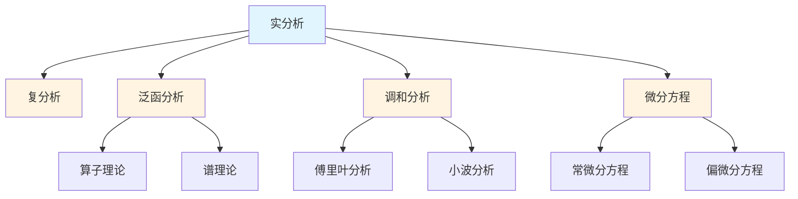

# 分析学概念梳理

**主题编号**: C.03.03
**创建日期**: 2025年11月21日
**最后更新**: 2025年11月21日

---

## 📋 目录 / Table of Contents

- [分析学概念梳理](#分析学概念梳理)
  - [📋 目录 / Table of Contents](#-目录--table-of-contents)
  - [📋 概述 (编号: C.03.03.01)](#-概述-编号-c030301)
  - [🎯 核心概念体系 (编号: C.03.03.02)](#-核心概念体系-编号-c030302)
    - [1. 实分析核心概念 (编号: C.03.03.02.01)](#1-实分析核心概念-编号-c03030201)
      - [极限理论](#极限理论)
      - [连续性](#连续性)
      - [微分学](#微分学)
      - [积分学](#积分学)
      - [级数理论](#级数理论)
    - [2. 复分析核心概念 (编号: C.03.03.02.02)](#2-复分析核心概念-编号-c03030202)
      - [复数基础](#复数基础)
      - [解析函数](#解析函数)
      - [复积分](#复积分)
      - [特殊理论](#特殊理论)
    - [3. 泛函分析核心概念 (编号: C.03.03.02.03)](#3-泛函分析核心概念-编号-c03030203)
      - [赋范空间](#赋范空间)
      - [希尔伯特空间](#希尔伯特空间)
      - [算子理论](#算子理论)
    - [4. 调和分析核心概念 (编号: C.03.03.02.04)](#4-调和分析核心概念-编号-c03030204)
      - [傅里叶分析](#傅里叶分析)
      - [小波分析](#小波分析)
      - [群上的调和分析](#群上的调和分析)
    - [5. 微分方程核心概念 (编号: C.03.03.02.05)](#5-微分方程核心概念-编号-c03030205)
      - [常微分方程](#常微分方程)
      - [偏微分方程](#偏微分方程)
  - [🔗 概念关联图 (编号: C.03.03.03)](#-概念关联图-编号-c030303)
  - [📊 概念重要性矩阵 (编号: C.03.03.04)](#-概念重要性矩阵-编号-c030304)
  - [🎓 学习路径建议 (编号: C.03.03.05)](#-学习路径建议-编号-c030305)
    - [基础路径](#基础路径)
    - [进阶路径](#进阶路径)
    - [高级路径](#高级路径)

---

## 📋 概述 (编号: C.03.03.01)

本文档系统梳理分析学领域的核心概念，包括实分析、复分析、泛函分析、调和分析、微分方程等。

---

## 🎯 核心概念体系 (编号: C.03.03.02)

### 1. 实分析核心概念 (编号: C.03.03.02.01)

#### 极限理论

- **数列极限 (Sequence Limit)**: 数列的极限
  - **严格定义**: $\lim_{n \to \infty} a_n = L$ 当且仅当 $\forall \varepsilon > 0, \exists N \in \mathbb{N}, \forall n > N, |a_n - L| < \varepsilon$
  - **性质**: 若极限存在则唯一；有界收敛序列有极限
  - **应用**: 级数收敛性、函数连续性
- **函数极限 (Function Limit)**: 函数的极限
  - **严格定义**: $\lim_{x \to a} f(x) = L$ 当且仅当 $\forall \varepsilon > 0, \exists \delta > 0, \forall x (0 < |x-a| < \delta \Rightarrow |f(x) - L| < \varepsilon)$
  - **性质**: 唯一性、局部有界性、四则运算
  - **证明思路（唯一性）**: 假设两个极限，用三角不等式导出矛盾
- **左极限 (Left Limit)**: 从左侧趋近的极限
  - **定义**: $\lim_{x \to a^-} f(x) = L$ 当且仅当 $\forall \varepsilon > 0, \exists \delta > 0, \forall x (a-\delta < x < a \Rightarrow |f(x) - L| < \varepsilon)$
- **右极限 (Right Limit)**: 从右侧趋近的极限
  - **定义**: $\lim_{x \to a^+} f(x) = L$ 当且仅当 $\forall \varepsilon > 0, \exists \delta > 0, \forall x (a < x < a+\delta \Rightarrow |f(x) - L| < \varepsilon)$
  - **性质**: $\lim_{x \to a} f(x)$ 存在当且仅当左右极限存在且相等
- **无穷极限 (Infinite Limit)**: 趋于无穷的极限
  - **定义**: $\lim_{x \to \infty} f(x) = L$ 当且仅当 $\forall \varepsilon > 0, \exists M > 0, \forall x > M, |f(x) - L| < \varepsilon$
- **极限的性质**: 唯一性、保号性、夹逼定理
  - **夹逼定理**: 若 $g(x) \leq f(x) \leq h(x)$ 且 $\lim g(x) = \lim h(x) = L$，则 $\lim f(x) = L$
  - **证明思路**: 由 $g(x) \leq f(x) \leq h(x)$ 和极限定义，用三角不等式

#### 连续性

- **连续函数 (Continuous Function)**: 在点处连续的函数
  - **严格定义**: $f$ 在 $a$ 连续当且仅当 $\lim_{x \to a} f(x) = f(a)$
  - **等价定义**: $\forall \varepsilon > 0, \exists \delta > 0, \forall x (|x-a| < \delta \Rightarrow |f(x) - f(a)| < \varepsilon)$
  - **性质**: 连续函数的和、差、积、商（分母不为零）仍连续；连续函数的复合仍连续
  - **应用**: 介值定理、极值定理
- **一致连续 (Uniformly Continuous)**: 一致连续的函数
  - **严格定义**: $f$ 在 $A$ 上一致连续当且仅当 $\forall \varepsilon > 0, \exists \delta > 0, \forall x,y \in A (|x-y| < \delta \Rightarrow |f(x) - f(y)| < \varepsilon)$
  - **与连续的区别**: 连续是逐点性质，一致连续是整体性质
  - **性质**: 闭区间上的连续函数必一致连续（Cantor定理）
- **间断点 (Discontinuity Point)**: 不连续的点
  - **分类**: 可去间断点（左右极限存在且相等但不等于函数值）、跳跃间断点（左右极限存在但不相等）、无穷间断点（至少一个极限为无穷）
- **可去间断点 (Removable Discontinuity)**: 可去间断点
- **跳跃间断点 (Jump Discontinuity)**: 跳跃间断点
- **无穷间断点 (Infinite Discontinuity)**: 无穷间断点

#### 微分学

- **导数 (Derivative)**: 函数的导数
  - **严格定义**: $f'(a) = \lim_{h \to 0} \frac{f(a+h) - f(a)}{h}$（如果极限存在）
  - **几何意义**: 切线的斜率
  - **性质**: 可导必连续；$(f+g)' = f' + g'$，$(fg)' = f'g + fg'$，$(f/g)' = \frac{f'g - fg'}{g^2}$
  - **链式法则**: $(f \circ g)'(x) = f'(g(x)) \cdot g'(x)$
- **微分 (Differential)**: 函数的微分
  - **定义**: $df = f'(x) dx$，其中 $dx$ 是自变量的增量
  - **几何意义**: 函数在点处的线性近似
  - **应用**: 误差估计、近似计算
- **高阶导数 (Higher Order Derivative)**: 高阶导数
  - **定义**: $f^{(n)}(x) = (f^{(n-1)})'(x)$，$f^{(0)} = f$
  - **应用**: 泰勒展开、函数凸性判断
- **中值定理 (Mean Value Theorem)**: 拉格朗日中值定理
  - **定理**: 若 $f$ 在 $[a,b]$ 连续，在 $(a,b)$ 可导，则存在 $c \in (a,b)$ 使得 $f'(c) = \frac{f(b) - f(a)}{b-a}$
  - **证明思路**: 构造辅助函数 $g(x) = f(x) - \frac{f(b)-f(a)}{b-a}(x-a)$，应用Rolle定理
  - **应用**: 证明不等式、函数单调性、L'Hôpital法则
- **泰勒展开 (Taylor Expansion)**: 泰勒级数
  - **定理**: 若 $f$ 在 $a$ 的邻域内 $n+1$ 次可导，则 $f(x) = \sum_{k=0}^n \frac{f^{(k)}(a)}{k!}(x-a)^k + R_n(x)$
  - **余项**: $R_n(x) = \frac{f^{(n+1)}(\xi)}{(n+1)!}(x-a)^{n+1}$（Lagrange余项）
  - **应用**: 函数近似、级数展开、数值计算
- **洛必达法则 (L'Hôpital's Rule)**: 求极限的方法
  - **定理**: 若 $\lim_{x \to a} f(x) = \lim_{x \to a} g(x) = 0$（或 $\infty$），且 $\lim_{x \to a} \frac{f'(x)}{g'(x)}$ 存在，则 $\lim_{x \to a} \frac{f(x)}{g(x)} = \lim_{x \to a} \frac{f'(x)}{g'(x)}$
  - **证明思路**: 应用中值定理和极限定义
  - **应用**: 计算 $\frac{0}{0}$ 和 $\frac{\infty}{\infty}$ 型未定式

#### 积分学

- **黎曼积分 (Riemann Integral)**: 黎曼积分
  - **定义**: 通过分割、取点、求和、取极限定义：$\int_a^b f(x)dx = \lim_{\|P\| \to 0} \sum_{i=1}^n f(\xi_i)\Delta x_i$
  - **可积条件**: 有界函数在闭区间上可积当且仅当不连续点集测度为零
  - **性质**: 线性性、单调性、区间可加性
- **勒贝格积分 (Lebesgue Integral)**: 勒贝格积分
  - **思想**: 按函数值分割而非按定义域分割
  - **优势**: 更广泛的可积函数类，更好的收敛定理
  - **定义**: 通过简单函数逼近：$\int f d\mu = \sup\{\int \phi d\mu : \phi \leq f, \phi \text{ 简单函数}\}$
- **不定积分 (Indefinite Integral)**: 原函数
  - **定义**: $F$ 是 $f$ 的原函数当且仅当 $F' = f$
  - **性质**: 原函数相差常数：若 $F' = G' = f$，则 $F = G + C$
  - **记号**: $\int f(x)dx = F(x) + C$
- **定积分 (Definite Integral)**: 定积分
  - **定义**: $\int_a^b f(x)dx = F(b) - F(a)$，其中 $F$ 是 $f$ 的原函数
  - **几何意义**: 曲线下的面积（$f \geq 0$ 时）
- **微积分基本定理 (Fundamental Theorem of Calculus)**: 微积分基本定理
  - **第一部分**: 若 $f$ 连续，则 $F(x) = \int_a^x f(t)dt$ 可导且 $F' = f$
  - **第二部分**: 若 $F' = f$，则 $\int_a^b f(x)dx = F(b) - F(a)$
  - **证明思路**: 第一部分用积分中值定理；第二部分用Newton-Leibniz公式
  - **意义**: 连接微分和积分，是微积分的核心
- **重积分 (Multiple Integral)**: 多重积分
  - **定义**: 通过累次积分或Fubini定理计算
  - **Fubini定理**: 若 $f$ 可积，则 $\iint f(x,y)dxdy = \int (\int f(x,y)dy)dx = \int (\int f(x,y)dx)dy$
  - **应用**: 体积计算、概率论、物理

#### 级数理论

- **数项级数 (Numerical Series)**: 数项级数
- **函数项级数 (Function Series)**: 函数项级数
- **幂级数 (Power Series)**: 幂级数
- **傅里叶级数 (Fourier Series)**: 傅里叶级数
- **收敛性 (Convergence)**: 级数的收敛性
- **一致收敛 (Uniform Convergence)**: 一致收敛

### 2. 复分析核心概念 (编号: C.03.03.02.02)

#### 复数基础

- **复数 (Complex Number)**: 复数的定义
- **复平面 (Complex Plane)**: 复数的几何表示
- **复数的运算**: 加法、乘法、除法
- **共轭复数 (Complex Conjugate)**: 共轭复数
- **模 (Modulus)**: 复数的模
- **幅角 (Argument)**: 复数的幅角

#### 解析函数

- **全纯函数 (Holomorphic Function)**: 全纯函数
  - **严格定义**: $f: U \to \mathbb{C}$ 在 $z_0$ 全纯当且仅当 $f'(z_0) = \lim_{h \to 0} \frac{f(z_0+h) - f(z_0)}{h}$ 存在（$h \in \mathbb{C}$）
  - **等价条件**: 在 $z_0$ 的邻域内可展开为幂级数
  - **性质**: 全纯函数无穷次可导；零点的孤立性
- **解析函数 (Analytic Function)**: 解析函数
  - **定义**: 在每点都可展开为收敛幂级数的函数
  - **关系**: 全纯函数必解析（在单连通域内）
  - **性质**: 解析延拓、唯一性定理
- **柯西-黎曼方程 (Cauchy-Riemann Equations)**: 全纯函数的条件
  - **方程**: 设 $f = u + iv$，则 $f$ 全纯当且仅当 $\frac{\partial u}{\partial x} = \frac{\partial v}{\partial y}$ 且 $\frac{\partial u}{\partial y} = -\frac{\partial v}{\partial x}$
  - **证明思路**: 从全纯定义出发，分别取 $h$ 为实数和纯虚数
  - **应用**: 判断函数是否全纯
- **调和函数 (Harmonic Function)**: 调和函数
  - **定义**: 满足拉普拉斯方程 $\Delta u = \frac{\partial^2 u}{\partial x^2} + \frac{\partial^2 u}{\partial y^2} = 0$ 的函数
  - **关系**: 全纯函数的实部和虚部都是调和函数
  - **性质**: 平均值性质、最大值原理
- **共形映射 (Conformal Mapping)**: 共形映射
  - **定义**: 保持角度和方向的映射
  - **性质**: 全纯函数（导数非零）是共形映射
  - **应用**: 复分析、流体力学、电动力学

#### 复积分

- **复积分 (Complex Integral)**: 复函数的积分
  - **定义**: $\int_\gamma f(z)dz = \int_a^b f(\gamma(t))\gamma'(t)dt$，其中 $\gamma: [a,b] \to \mathbb{C}$ 是路径
  - **性质**: 路径无关性（在单连通域内，若 $f$ 全纯）
- **柯西积分定理 (Cauchy's Integral Theorem)**: 柯西积分定理
  - **定理**: 若 $f$ 在单连通域 $D$ 内全纯，$\gamma$ 是 $D$ 内的闭曲线，则 $\oint_\gamma f(z)dz = 0$
  - **证明思路**: 用Green定理转化为实积分，应用Cauchy-Riemann方程
  - **应用**: 证明路径无关性、计算积分
- **柯西积分公式 (Cauchy's Integral Formula)**: 柯西积分公式
  - **定理**: 若 $f$ 在 $D$ 内全纯，$z_0 \in D$，$\gamma$ 是围绕 $z_0$ 的简单闭曲线，则 $f(z_0) = \frac{1}{2\pi i} \oint_\gamma \frac{f(z)}{z-z_0}dz$
  - **证明思路**: 用柯西积分定理和路径变形
  - **应用**: 计算积分、证明全纯函数可导
- **留数 (Residue)**: 函数的留数
  - **定义**: $f$ 在孤立奇点 $z_0$ 的留数 $\text{Res}(f,z_0) = \frac{1}{2\pi i} \oint_{|z-z_0|=r} f(z)dz$（$r$ 充分小）
  - **计算**: 若 $z_0$ 是 $k$ 阶极点，则 $\text{Res}(f,z_0) = \frac{1}{(k-1)!} \lim_{z \to z_0} \frac{d^{k-1}}{dz^{k-1}}[(z-z_0)^k f(z)]$
- **留数定理 (Residue Theorem)**: 留数定理
  - **定理**: 若 $f$ 在 $D$ 内除有限个孤立奇点外全纯，$\gamma$ 是围绕这些奇点的闭曲线，则 $\oint_\gamma f(z)dz = 2\pi i \sum \text{Res}(f,z_k)$
  - **应用**: 计算实积分、级数求和

#### 特殊理论

- **黎曼映射定理 (Riemann Mapping Theorem)**: 黎曼映射定理
- **最大模原理 (Maximum Modulus Principle)**: 最大模原理
- **刘维尔定理 (Liouville's Theorem)**: 刘维尔定理

### 3. 泛函分析核心概念 (编号: C.03.03.02.03)

#### 赋范空间

- **范数 (Norm)**: 向量空间的范数
- **赋范空间 (Normed Space)**: 赋范空间
- **巴拿赫空间 (Banach Space)**: 完备的赋范空间
- **有界线性算子 (Bounded Linear Operator)**: 有界线性算子
- **算子范数 (Operator Norm)**: 算子的范数

#### 希尔伯特空间

- **内积 (Inner Product)**: 向量空间的内积
- **希尔伯特空间 (Hilbert Space)**: 完备的内积空间
- **正交性 (Orthogonality)**: 向量的正交性
- **正交基 (Orthogonal Basis)**: 正交基
- **标准正交基 (Orthonormal Basis)**: 标准正交基
- **傅里叶级数 (Fourier Series)**: 希尔伯特空间中的傅里叶级数

#### 算子理论

- **有界算子 (Bounded Operator)**: 有界算子
- **紧算子 (Compact Operator)**: 紧算子
- **自伴算子 (Self-Adjoint Operator)**: 自伴算子
- **谱理论 (Spectral Theory)**: 算子的谱理论
- **特征值 (Eigenvalue)**: 算子的特征值
- **特征向量 (Eigenvector)**: 算子的特征向量

### 4. 调和分析核心概念 (编号: C.03.03.02.04)

#### 傅里叶分析

- **傅里叶级数 (Fourier Series)**: 周期函数的傅里叶级数
- **傅里叶变换 (Fourier Transform)**: 函数的傅里叶变换
- **逆傅里叶变换 (Inverse Fourier Transform)**: 逆变换
- **卷积 (Convolution)**: 函数的卷积
- **帕塞瓦尔定理 (Parseval's Theorem)**: 能量守恒定理

#### 小波分析

- **小波 (Wavelet)**: 小波函数
- **小波变换 (Wavelet Transform)**: 小波变换
- **多分辨率分析 (Multiresolution Analysis)**: 多分辨率分析
- **小波基 (Wavelet Basis)**: 小波基

#### 群上的调和分析

- **李群表示 (Lie Group Representation)**: 李群的表示
- **特征标 (Character)**: 表示的特征标
- **彼得-外尔定理 (Peter-Weyl Theorem)**: 紧群的表示定理

### 5. 微分方程核心概念 (编号: C.03.03.02.05)

#### 常微分方程

- **一阶ODE (First Order ODE)**: 一阶常微分方程
- **高阶ODE (Higher Order ODE)**: 高阶常微分方程
- **线性ODE (Linear ODE)**: 线性常微分方程
- **非线性ODE (Nonlinear ODE)**: 非线性常微分方程
- **初值问题 (Initial Value Problem)**: 初值问题
- **边值问题 (Boundary Value Problem)**: 边值问题

#### 偏微分方程

- **椭圆型方程 (Elliptic Equation)**: 椭圆型偏微分方程
- **抛物型方程 (Parabolic Equation)**: 抛物型偏微分方程
- **双曲型方程 (Hyperbolic Equation)**: 双曲型偏微分方程
- **波动方程 (Wave Equation)**: 波动方程
- **热方程 (Heat Equation)**: 热传导方程
- **拉普拉斯方程 (Laplace Equation)**: 拉普拉斯方程

---

## 🔗 概念关联图 (编号: C.03.03.03)

---

## 📊 概念重要性矩阵 (编号: C.03.03.04)

| 概念 | 基础性 | 应用性 | 重要性 | 学习优先级 |
|-----|--------|--------|--------|-----------|
| 极限 | ⭐⭐⭐⭐⭐ | ⭐⭐⭐⭐⭐ | ⭐⭐⭐⭐⭐ | 1 |
| 连续 | ⭐⭐⭐⭐⭐ | ⭐⭐⭐⭐⭐ | ⭐⭐⭐⭐⭐ | 1 |
| 导数 | ⭐⭐⭐⭐⭐ | ⭐⭐⭐⭐⭐ | ⭐⭐⭐⭐⭐ | 1 |
| 积分 | ⭐⭐⭐⭐⭐ | ⭐⭐⭐⭐⭐ | ⭐⭐⭐⭐⭐ | 1 |
| 级数 | ⭐⭐⭐⭐ | ⭐⭐⭐⭐ | ⭐⭐⭐⭐ | 2 |
| 全纯函数 | ⭐⭐⭐⭐ | ⭐⭐⭐ | ⭐⭐⭐⭐ | 3 |
| 巴拿赫空间 | ⭐⭐⭐ | ⭐⭐⭐⭐ | ⭐⭐⭐⭐ | 4 |
| 希尔伯特空间 | ⭐⭐⭐ | ⭐⭐⭐⭐⭐ | ⭐⭐⭐⭐ | 4 |
| 傅里叶变换 | ⭐⭐⭐ | ⭐⭐⭐⭐⭐ | ⭐⭐⭐⭐⭐ | 3 |
| 微分方程 | ⭐⭐⭐⭐ | ⭐⭐⭐⭐⭐ | ⭐⭐⭐⭐⭐ | 2 |

---

## 🎓 学习路径建议 (编号: C.03.03.05)

### 基础路径

1. **极限** → **连续** → **导数** → **积分**
2. **级数** → **幂级数** → **傅里叶级数**

### 进阶路径

1. **复分析** → **全纯函数** → **留数理论**
2. **泛函分析** → **巴拿赫空间** → **希尔伯特空间**
3. **调和分析** → **傅里叶变换** → **小波分析**

### 高级路径

1. **算子理论** → **谱理论** → **应用**
2. **偏微分方程** → **椭圆型** → **抛物型** → **双曲型**
3. **几何分析** → **里奇流** → **几何化猜想**

---

**创建日期**: 2025年11月21日
**最后更新**: 2025年11月21日
**维护状态**: 持续更新中
