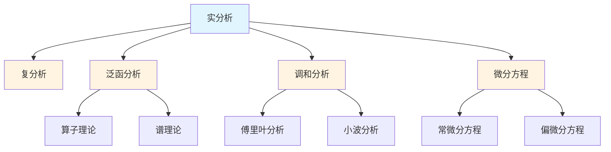

# 分析学概念梳理

## 📋 概述

本文档系统梳理分析学领域的核心概念，包括实分析、复分析、泛函分析、调和分析、微分方程等。

---

## 🎯 核心概念体系

### 1. 实分析核心概念

#### 极限理论

- **数列极限 (Sequence Limit)**: 数列的极限
- **函数极限 (Function Limit)**: 函数的极限
- **左极限 (Left Limit)**: 从左侧趋近的极限
- **右极限 (Right Limit)**: 从右侧趋近的极限
- **无穷极限 (Infinite Limit)**: 趋于无穷的极限
- **极限的性质**: 唯一性、保号性、夹逼定理

#### 连续性

- **连续函数 (Continuous Function)**: 在点处连续的函数
- **一致连续 (Uniformly Continuous)**: 一致连续的函数
- **间断点 (Discontinuity Point)**: 不连续的点
- **可去间断点 (Removable Discontinuity)**: 可去间断点
- **跳跃间断点 (Jump Discontinuity)**: 跳跃间断点
- **无穷间断点 (Infinite Discontinuity)**: 无穷间断点

#### 微分学

- **导数 (Derivative)**: 函数的导数
- **微分 (Differential)**: 函数的微分
- **高阶导数 (Higher Order Derivative)**: 高阶导数
- **中值定理 (Mean Value Theorem)**: 拉格朗日中值定理
- **泰勒展开 (Taylor Expansion)**: 泰勒级数
- **洛必达法则 (L'Hôpital's Rule)**: 求极限的方法

#### 积分学

- **黎曼积分 (Riemann Integral)**: 黎曼积分
- **勒贝格积分 (Lebesgue Integral)**: 勒贝格积分
- **不定积分 (Indefinite Integral)**: 原函数
- **定积分 (Definite Integral)**: 定积分
- **微积分基本定理 (Fundamental Theorem of Calculus)**: 微积分基本定理
- **重积分 (Multiple Integral)**: 多重积分

#### 级数理论

- **数项级数 (Numerical Series)**: 数项级数
- **函数项级数 (Function Series)**: 函数项级数
- **幂级数 (Power Series)**: 幂级数
- **傅里叶级数 (Fourier Series)**: 傅里叶级数
- **收敛性 (Convergence)**: 级数的收敛性
- **一致收敛 (Uniform Convergence)**: 一致收敛

### 2. 复分析核心概念

#### 复数基础

- **复数 (Complex Number)**: 复数的定义
- **复平面 (Complex Plane)**: 复数的几何表示
- **复数的运算**: 加法、乘法、除法
- **共轭复数 (Complex Conjugate)**: 共轭复数
- **模 (Modulus)**: 复数的模
- **幅角 (Argument)**: 复数的幅角

#### 解析函数

- **全纯函数 (Holomorphic Function)**: 全纯函数
- **解析函数 (Analytic Function)**: 解析函数
- **柯西-黎曼方程 (Cauchy-Riemann Equations)**: 全纯函数的条件
- **调和函数 (Harmonic Function)**: 调和函数
- **共形映射 (Conformal Mapping)**: 共形映射

#### 复积分

- **复积分 (Complex Integral)**: 复函数的积分
- **柯西积分定理 (Cauchy's Integral Theorem)**: 柯西积分定理
- **柯西积分公式 (Cauchy's Integral Formula)**: 柯西积分公式
- **留数 (Residue)**: 函数的留数
- **留数定理 (Residue Theorem)**: 留数定理

#### 特殊理论

- **黎曼映射定理 (Riemann Mapping Theorem)**: 黎曼映射定理
- **最大模原理 (Maximum Modulus Principle)**: 最大模原理
- **刘维尔定理 (Liouville's Theorem)**: 刘维尔定理

### 3. 泛函分析核心概念

#### 赋范空间

- **范数 (Norm)**: 向量空间的范数
- **赋范空间 (Normed Space)**: 赋范空间
- **巴拿赫空间 (Banach Space)**: 完备的赋范空间
- **有界线性算子 (Bounded Linear Operator)**: 有界线性算子
- **算子范数 (Operator Norm)**: 算子的范数

#### 希尔伯特空间

- **内积 (Inner Product)**: 向量空间的内积
- **希尔伯特空间 (Hilbert Space)**: 完备的内积空间
- **正交性 (Orthogonality)**: 向量的正交性
- **正交基 (Orthogonal Basis)**: 正交基
- **标准正交基 (Orthonormal Basis)**: 标准正交基
- **傅里叶级数 (Fourier Series)**: 希尔伯特空间中的傅里叶级数

#### 算子理论

- **有界算子 (Bounded Operator)**: 有界算子
- **紧算子 (Compact Operator)**: 紧算子
- **自伴算子 (Self-Adjoint Operator)**: 自伴算子
- **谱理论 (Spectral Theory)**: 算子的谱理论
- **特征值 (Eigenvalue)**: 算子的特征值
- **特征向量 (Eigenvector)**: 算子的特征向量

### 4. 调和分析核心概念

#### 傅里叶分析

- **傅里叶级数 (Fourier Series)**: 周期函数的傅里叶级数
- **傅里叶变换 (Fourier Transform)**: 函数的傅里叶变换
- **逆傅里叶变换 (Inverse Fourier Transform)**: 逆变换
- **卷积 (Convolution)**: 函数的卷积
- **帕塞瓦尔定理 (Parseval's Theorem)**: 能量守恒定理

#### 小波分析

- **小波 (Wavelet)**: 小波函数
- **小波变换 (Wavelet Transform)**: 小波变换
- **多分辨率分析 (Multiresolution Analysis)**: 多分辨率分析
- **小波基 (Wavelet Basis)**: 小波基

#### 群上的调和分析

- **李群表示 (Lie Group Representation)**: 李群的表示
- **特征标 (Character)**: 表示的特征标
- **彼得-外尔定理 (Peter-Weyl Theorem)**: 紧群的表示定理

### 5. 微分方程核心概念

#### 常微分方程

- **一阶ODE (First Order ODE)**: 一阶常微分方程
- **高阶ODE (Higher Order ODE)**: 高阶常微分方程
- **线性ODE (Linear ODE)**: 线性常微分方程
- **非线性ODE (Nonlinear ODE)**: 非线性常微分方程
- **初值问题 (Initial Value Problem)**: 初值问题
- **边值问题 (Boundary Value Problem)**: 边值问题

#### 偏微分方程

- **椭圆型方程 (Elliptic Equation)**: 椭圆型偏微分方程
- **抛物型方程 (Parabolic Equation)**: 抛物型偏微分方程
- **双曲型方程 (Hyperbolic Equation)**: 双曲型偏微分方程
- **波动方程 (Wave Equation)**: 波动方程
- **热方程 (Heat Equation)**: 热传导方程
- **拉普拉斯方程 (Laplace Equation)**: 拉普拉斯方程

---

## 🔗 概念关联图

---

## 📊 概念重要性矩阵

| 概念 | 基础性 | 应用性 | 重要性 | 学习优先级 |
|-----|--------|--------|--------|-----------|
| 极限 | ⭐⭐⭐⭐⭐ | ⭐⭐⭐⭐⭐ | ⭐⭐⭐⭐⭐ | 1 |
| 连续 | ⭐⭐⭐⭐⭐ | ⭐⭐⭐⭐⭐ | ⭐⭐⭐⭐⭐ | 1 |
| 导数 | ⭐⭐⭐⭐⭐ | ⭐⭐⭐⭐⭐ | ⭐⭐⭐⭐⭐ | 1 |
| 积分 | ⭐⭐⭐⭐⭐ | ⭐⭐⭐⭐⭐ | ⭐⭐⭐⭐⭐ | 1 |
| 级数 | ⭐⭐⭐⭐ | ⭐⭐⭐⭐ | ⭐⭐⭐⭐ | 2 |
| 全纯函数 | ⭐⭐⭐⭐ | ⭐⭐⭐ | ⭐⭐⭐⭐ | 3 |
| 巴拿赫空间 | ⭐⭐⭐ | ⭐⭐⭐⭐ | ⭐⭐⭐⭐ | 4 |
| 希尔伯特空间 | ⭐⭐⭐ | ⭐⭐⭐⭐⭐ | ⭐⭐⭐⭐ | 4 |
| 傅里叶变换 | ⭐⭐⭐ | ⭐⭐⭐⭐⭐ | ⭐⭐⭐⭐⭐ | 3 |
| 微分方程 | ⭐⭐⭐⭐ | ⭐⭐⭐⭐⭐ | ⭐⭐⭐⭐⭐ | 2 |

---

## 🎓 学习路径建议

### 基础路径

1. **极限** → **连续** → **导数** → **积分**
2. **级数** → **幂级数** → **傅里叶级数**

### 进阶路径

1. **复分析** → **全纯函数** → **留数理论**
2. **泛函分析** → **巴拿赫空间** → **希尔伯特空间**
3. **调和分析** → **傅里叶变换** → **小波分析**

### 高级路径

1. **算子理论** → **谱理论** → **应用**
2. **偏微分方程** → **椭圆型** → **抛物型** → **双曲型**
3. **几何分析** → **里奇流** → **几何化猜想**

---

**创建日期**: 2025年11月21日
**维护状态**: 持续更新中
