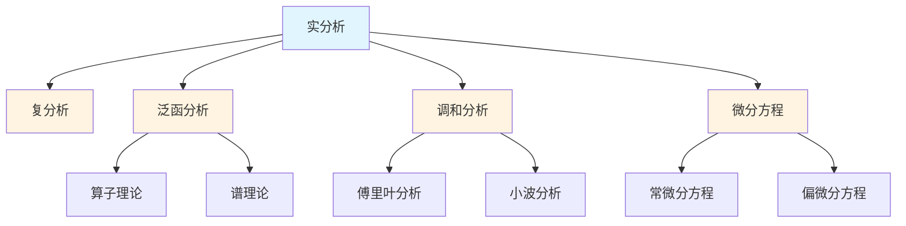

# 分析学概念梳理

**主题编号**: C.03.03
**创建日期**: 2025年11月21日
**最后更新**: 2025年1月（三视角转换全面完成）

---

## 📋 目录 / Table of Contents

- [分析学概念梳理](#分析学概念梳理)
  - [📋 目录 / Table of Contents](#-目录--table-of-contents)
  - [📋 概述 (编号: C.03.03.01)](#-概述-编号-c030301)
  - [🎯 核心概念体系 (编号: C.03.03.02)](#-核心概念体系-编号-c030302)
    - [1. 实分析核心概念 (编号: C.03.03.02.01)](#1-实分析核心概念-编号-c03030201)
      - [极限理论](#极限理论)
      - [连续性](#连续性)
      - [微分学](#微分学)
      - [积分学](#积分学)
      - [级数理论](#级数理论)
    - [2. 复分析核心概念 (编号: C.03.03.02.02)](#2-复分析核心概念-编号-c03030202)
      - [复数基础](#复数基础)
      - [解析函数](#解析函数)
      - [复积分](#复积分)
      - [特殊理论](#特殊理论)
    - [3. 泛函分析核心概念 (编号: C.03.03.02.03)](#3-泛函分析核心概念-编号-c03030203)
      - [赋范空间](#赋范空间)
      - [希尔伯特空间](#希尔伯特空间)
      - [算子理论](#算子理论)
    - [4. 调和分析核心概念 (编号: C.03.03.02.04)](#4-调和分析核心概念-编号-c03030204)
      - [傅里叶分析](#傅里叶分析)
      - [小波分析](#小波分析)
      - [群上的调和分析](#群上的调和分析)
    - [5. 微分方程核心概念 (编号: C.03.03.02.05)](#5-微分方程核心概念-编号-c03030205)
      - [常微分方程](#常微分方程)
      - [偏微分方程](#偏微分方程)
  - [🔗 概念关联图 (编号: C.03.03.03)](#-概念关联图-编号-c030303)
  - [📊 概念重要性矩阵 (编号: C.03.03.04)](#-概念重要性矩阵-编号-c030304)
  - [🎓 学习路径建议 (编号: C.03.03.05)](#-学习路径建议-编号-c030305)
    - [基础路径](#基础路径)
    - [进阶路径](#进阶路径)
    - [高级路径](#高级路径)

---

## 📋 概述 (编号: C.03.03.01)

本文档系统梳理分析学领域的核心概念，包括实分析、复分析、泛函分析、调和分析、微分方程等。

**核心概念三视角版本**: 本文档中涉及的以下核心概念已有三视角深度版本：

- [极限](../核心概念/13-极限-三视角版.md) (C.CORE.013) - 极限核心概念的三视角深度分析
- [连续](../核心概念/14-连续-三视角版.md) (C.CORE.014) - 连续核心概念的三视角深度分析
- [导数](../核心概念/15-导数-三视角版.md) (C.CORE.015) - 导数核心概念的三视角深度分析
- [积分](../核心概念/16-积分-三视角版.md) (C.CORE.016) - 积分核心概念的三视角深度分析
- [级数](../核心概念/17-级数-三视角版.md) (C.CORE.017) - 级数核心概念的三视角深度分析

详见：[核心概念索引](../核心概念/00-核心概念索引.md) - 所有33个核心概念的三视角版本

**哲学背景**: 分析学的发展体现了形式主义和逻辑主义的影响。实分析的严格化（Weierstrass、Dedekind、Cantor）体现了形式主义对严格性的要求。微积分的创立（Newton、Leibniz）体现了经验主义和理性主义的结合。构造性分析的发展体现了建构主义的影响。详见[数学哲学维度矩阵](../02-知识矩阵/09-数学哲学维度矩阵.md)。

**权威资源对齐**: 本文档的概念定义和结构参考了Wikipedia分析学条目、MIT 18.01-18.112分析学课程、Stanford的实分析和复分析课程，以及Metamath的分析定理。详见[权威资源对齐说明](../00-权威资源对齐说明.md)和[权威资源对标改进计划](../00-权威资源对标改进计划.md)。

---

## 🎯 核心概念体系 (编号: C.03.03.02)

### 1. 实分析核心概念 (编号: C.03.03.02.01)

#### 极限理论

- **数列极限 (Sequence Limit)**: 数列的极限
  - **严格定义**: $\lim_{n \to \infty} a_n = L$ 当且仅当 $\forall \varepsilon > 0, \exists N \in \mathbb{N}, \forall n > N, |a_n - L| < \varepsilon$
  - **历史背景**: 极限的严格定义由Weierstrass（1860s）建立，解决了微积分基础问题，是分析严格化的基石
  - **性质**:
    - 若极限存在则唯一
    - 有界收敛序列有极限
    - 极限的运算：$\lim(a_n + b_n) = \lim a_n + \lim b_n$，$\lim(a_n b_n) = \lim a_n \cdot \lim b_n$
  - **应用**: 级数收敛性、函数连续性、数值计算
  - **参考文献**:
    - Wikipedia: [Limit of a Sequence](https://en.wikipedia.org/wiki/Limit_of_a_sequence)
    - Rudin, W. (1976). *Principles of Mathematical Analysis*. McGraw-Hill.
    - Apostol, T. M. (1974). *Mathematical Analysis*. Addison-Wesley.
- **函数极限 (Function Limit)**: 函数的极限
  - **严格定义**: $\lim_{x \to a} f(x) = L$ 当且仅当 $\forall \varepsilon > 0, \exists \delta > 0, \forall x (0 < |x-a| < \delta \Rightarrow |f(x) - L| < \varepsilon)$
  - **性质**: 唯一性、局部有界性、四则运算
  - **证明思路（唯一性）**: 假设两个极限，用三角不等式导出矛盾
- **左极限 (Left Limit)**: 从左侧趋近的极限
  - **定义**: $\lim_{x \to a^-} f(x) = L$ 当且仅当 $\forall \varepsilon > 0, \exists \delta > 0, \forall x (a-\delta < x < a \Rightarrow |f(x) - L| < \varepsilon)$
- **右极限 (Right Limit)**: 从右侧趋近的极限
  - **定义**: $\lim_{x \to a^+} f(x) = L$ 当且仅当 $\forall \varepsilon > 0, \exists \delta > 0, \forall x (a < x < a+\delta \Rightarrow |f(x) - L| < \varepsilon)$
  - **性质**: $\lim_{x \to a} f(x)$ 存在当且仅当左右极限存在且相等
- **无穷极限 (Infinite Limit)**: 趋于无穷的极限
  - **定义**: $\lim_{x \to \infty} f(x) = L$ 当且仅当 $\forall \varepsilon > 0, \exists M > 0, \forall x > M, |f(x) - L| < \varepsilon$
- **极限的性质**: 唯一性、保号性、夹逼定理
  - **夹逼定理**: 若 $g(x) \leq f(x) \leq h(x)$ 且 $\lim g(x) = \lim h(x) = L$，则 $\lim f(x) = L$
  - **证明思路**: 由 $g(x) \leq f(x) \leq h(x)$ 和极限定义，用三角不等式

#### 连续性

- **连续函数 (Continuous Function)**: 在点处连续的函数
  - **严格定义**: $f$ 在 $a$ 连续当且仅当 $\lim_{x \to a} f(x) = f(a)$
  - **等价定义**: $\forall \varepsilon > 0, \exists \delta > 0, \forall x (|x-a| < \delta \Rightarrow |f(x) - f(a)| < \varepsilon)$
  - **历史背景**: 连续性的严格定义由Bolzano（1817）和Cauchy（1821）建立，Weierstrass（1860s）完善
  - **性质**:
    - 连续函数的和、差、积、商（分母不为零）仍连续
    - 连续函数的复合仍连续
    - 闭区间上的连续函数有界且达到最大值和最小值（极值定理）
  - **应用**: 介值定理、极值定理、不动点定理
  - **参考文献**:
    - Wikipedia: [Continuous Function](https://en.wikipedia.org/wiki/Continuous_function)
    - Rudin, W. (1976). *Principles of Mathematical Analysis*. McGraw-Hill.
- **一致连续 (Uniformly Continuous)**: 一致连续的函数
  - **严格定义**: $f$ 在 $A$ 上一致连续当且仅当 $\forall \varepsilon > 0, \exists \delta > 0, \forall x,y \in A (|x-y| < \delta \Rightarrow |f(x) - f(y)| < \varepsilon)$
  - **与连续的区别**: 连续是逐点性质，一致连续是整体性质
  - **性质**: 闭区间上的连续函数必一致连续（Cantor定理）
- **间断点 (Discontinuity Point)**: 不连续的点
  - **分类**: 可去间断点（左右极限存在且相等但不等于函数值）、跳跃间断点（左右极限存在但不相等）、无穷间断点（至少一个极限为无穷）
- **可去间断点 (Removable Discontinuity)**: 可去间断点
- **跳跃间断点 (Jump Discontinuity)**: 跳跃间断点
- **无穷间断点 (Infinite Discontinuity)**: 无穷间断点

#### 微分学

- **导数 (Derivative)**: 函数的导数
  - **严格定义**: $f'(a) = \lim_{h \to 0} \frac{f(a+h) - f(a)}{h}$（如果极限存在）
  - **历史背景**: 导数概念由Newton（1665-1666）和Leibniz（1684）独立发明，是微积分的核心概念
  - **几何意义**: 切线的斜率
  - **物理意义**: 瞬时变化率（速度、加速度等）
  - **性质**:
    - 可导必连续（反之不成立）
    - 线性性：$(f+g)' = f' + g'$，$(cf)' = cf'$
    - 乘积法则：$(fg)' = f'g + fg'$
    - 商法则：$(f/g)' = \frac{f'g - fg'}{g^2}$（$g \neq 0$）
  - **链式法则**: $(f \circ g)'(x) = f'(g(x)) \cdot g'(x)$
  - **应用**: 优化问题、物理建模、经济学
  - **参考文献**:
    - Wikipedia: [Derivative](https://en.wikipedia.org/wiki/Derivative)
    - Rudin, W. (1976). *Principles of Mathematical Analysis*. McGraw-Hill.
    - Spivak, M. (2008). *Calculus*. Publish or Perish.
- **微分 (Differential)**: 函数的微分
  - **定义**: $df = f'(x) dx$，其中 $dx$ 是自变量的增量
  - **几何意义**: 函数在点处的线性近似
  - **应用**: 误差估计、近似计算
- **高阶导数 (Higher Order Derivative)**: 高阶导数
  - **定义**: $f^{(n)}(x) = (f^{(n-1)})'(x)$，$f^{(0)} = f$
  - **应用**: 泰勒展开、函数凸性判断
- **中值定理 (Mean Value Theorem)**: 拉格朗日中值定理
  - **定理**: 若 $f$ 在 $[a,b]$ 连续，在 $(a,b)$ 可导，则存在 $c \in (a,b)$ 使得 $f'(c) = \frac{f(b) - f(a)}{b-a}$
  - **证明思路**: 构造辅助函数 $g(x) = f(x) - \frac{f(b)-f(a)}{b-a}(x-a)$，应用Rolle定理
  - **应用**: 证明不等式、函数单调性、L'Hôpital法则
- **泰勒展开 (Taylor Expansion)**: 泰勒级数
  - **定理**: 若 $f$ 在 $a$ 的邻域内 $n+1$ 次可导，则 $f(x) = \sum_{k=0}^n \frac{f^{(k)}(a)}{k!}(x-a)^k + R_n(x)$
  - **余项**: $R_n(x) = \frac{f^{(n+1)}(\xi)}{(n+1)!}(x-a)^{n+1}$（Lagrange余项）
  - **应用**: 函数近似、级数展开、数值计算
- **洛必达法则 (L'Hôpital's Rule)**: 求极限的方法
  - **定理**: 若 $\lim_{x \to a} f(x) = \lim_{x \to a} g(x) = 0$（或 $\infty$），且 $\lim_{x \to a} \frac{f'(x)}{g'(x)}$ 存在，则 $\lim_{x \to a} \frac{f(x)}{g(x)} = \lim_{x \to a} \frac{f'(x)}{g'(x)}$
  - **证明思路**: 应用中值定理和极限定义
  - **应用**: 计算 $\frac{0}{0}$ 和 $\frac{\infty}{\infty}$ 型未定式

#### 积分学

- **黎曼积分 (Riemann Integral)**: 黎曼积分
  - **定义**: 通过分割、取点、求和、取极限定义：$\int_a^b f(x)dx = \lim_{\|P\| \to 0} \sum_{i=1}^n f(\xi_i)\Delta x_i$
  - **可积条件**: 有界函数在闭区间上可积当且仅当不连续点集测度为零
  - **性质**: 线性性、单调性、区间可加性
- **勒贝格积分 (Lebesgue Integral)**: 勒贝格积分
  - **思想**: 按函数值分割而非按定义域分割
  - **优势**: 更广泛的可积函数类，更好的收敛定理
  - **定义**: 通过简单函数逼近：$\int f d\mu = \sup\{\int \phi d\mu : \phi \leq f, \phi \text{ 简单函数}\}$
- **不定积分 (Indefinite Integral)**: 原函数
  - **定义**: $F$ 是 $f$ 的原函数当且仅当 $F' = f$
  - **性质**: 原函数相差常数：若 $F' = G' = f$，则 $F = G + C$
  - **记号**: $\int f(x)dx = F(x) + C$
- **定积分 (Definite Integral)**: 定积分
  - **定义**: $\int_a^b f(x)dx = F(b) - F(a)$，其中 $F$ 是 $f$ 的原函数
  - **几何意义**: 曲线下的面积（$f \geq 0$ 时）
- **微积分基本定理 (Fundamental Theorem of Calculus)**: 微积分基本定理
  - **第一部分**: 若 $f$ 连续，则 $F(x) = \int_a^x f(t)dt$ 可导且 $F' = f$
  - **第二部分**: 若 $F' = f$，则 $\int_a^b f(x)dx = F(b) - F(a)$（Newton-Leibniz公式）
  - **历史背景**: 由Newton和Leibniz在17世纪建立，是微积分的核心定理，连接了微分和积分
  - **证明思路**:
    - 第一部分：用积分中值定理和连续函数的性质
    - 第二部分：用第一部分和原函数的定义
  - **意义**: 连接微分和积分，使得积分计算可以通过求原函数完成
  - **应用**: 计算定积分、证明积分恒等式、建立微分方程
  - **参考文献**:
    - Wikipedia: [Fundamental Theorem of Calculus](https://en.wikipedia.org/wiki/Fundamental_theorem_of_calculus)
    - Rudin, W. (1976). *Principles of Mathematical Analysis*. McGraw-Hill.
- **重积分 (Multiple Integral)**: 多重积分
  - **定义**: 通过累次积分或Fubini定理计算
  - **Fubini定理**: 若 $f$ 可积，则 $\iint f(x,y)dxdy = \int (\int f(x,y)dy)dx = \int (\int f(x,y)dx)dy$
  - **应用**: 体积计算、概率论、物理

#### 级数理论

- **数项级数 (Numerical Series)**: 数项级数
  - **定义**: $\sum_{n=1}^\infty a_n = \lim_{N \to \infty} S_N$，其中 $S_N = \sum_{n=1}^N a_n$ 是部分和
  - **收敛性**: 级数收敛当且仅当部分和序列收敛
  - **Cauchy准则**: $\sum a_n$ 收敛当且仅当 $\forall \varepsilon > 0, \exists N, \forall m > n > N, |\sum_{k=n+1}^m a_k| < \varepsilon$
  - **收敛判别法**: 比较判别法、比值判别法、根值判别法、积分判别法
  - **应用**: 函数展开、数值计算、概率论
  - **参考文献**:
    - Wikipedia: [Series (Mathematics)](https://en.wikipedia.org/wiki/Series_(mathematics))
    - Rudin, W. (1976). *Principles of Mathematical Analysis*. McGraw-Hill.
- **函数项级数 (Function Series)**: 函数项级数
  - **定义**: $\sum_{n=1}^\infty f_n(x)$，其中 $f_n$ 是函数
  - **收敛性**: 逐点收敛和一致收敛
  - **Weierstrass M-判别法**: 若 $|f_n(x)| \leq M_n$ 且 $\sum M_n$ 收敛，则 $\sum f_n$ 一致收敛
  - **应用**: 函数展开、近似理论
- **幂级数 (Power Series)**: 幂级数
  - **定义**: $\sum_{n=0}^\infty a_n (x-c)^n$，其中 $a_n$ 是系数，$c$ 是中心
  - **收敛半径**: $R = \frac{1}{\limsup |a_n|^{1/n}}$（Cauchy-Hadamard公式）
  - **性质**: 在收敛圆内一致收敛，可逐项求导和积分
  - **应用**: 函数展开、解析延拓、微分方程
  - **参考文献**:
    - Wikipedia: [Power Series](https://en.wikipedia.org/wiki/Power_series)
- **傅里叶级数 (Fourier Series)**: 傅里叶级数
  - **定义**: $f(x) = \frac{a_0}{2} + \sum_{n=1}^\infty (a_n \cos nx + b_n \sin nx)$，其中 $a_n, b_n$ 是Fourier系数
  - **历史背景**: 由Fourier（1807）在研究热传导方程时引入，是调和分析的基础
  - **收敛性**: Dirichlet定理给出收敛条件
  - **应用**: 信号处理、偏微分方程、量子力学
  - **参考文献**:
    - Wikipedia: [Fourier Series](https://en.wikipedia.org/wiki/Fourier_series)
    - Stein, E. M., & Shakarchi, R. (2003). *Fourier Analysis: An Introduction*. Princeton University Press.
- **收敛性 (Convergence)**: 级数的收敛性
  - **绝对收敛**: $\sum |a_n|$ 收敛，则 $\sum a_n$ 绝对收敛
  - **条件收敛**: $\sum a_n$ 收敛但 $\sum |a_n|$ 发散
  - **性质**: 绝对收敛级数可重排，条件收敛级数不可重排（Riemann重排定理）
- **一致收敛 (Uniform Convergence)**: 一致收敛
  - **定义**: $f_n \to f$ 一致收敛当且仅当 $\forall \varepsilon > 0, \exists N, \forall n > N, \forall x, |f_n(x) - f(x)| < \varepsilon$
  - **性质**: 一致收敛保持连续性、可积性、可导性（在适当条件下）
  - **应用**: 函数序列的极限、级数的和函数

### 2. 复分析核心概念 (编号: C.03.03.02.02)

#### 复数基础

- **复数 (Complex Number)**: 复数的定义
- **复平面 (Complex Plane)**: 复数的几何表示
- **复数的运算**: 加法、乘法、除法
- **共轭复数 (Complex Conjugate)**: 共轭复数
- **模 (Modulus)**: 复数的模
- **幅角 (Argument)**: 复数的幅角

#### 解析函数

- **全纯函数 (Holomorphic Function)**: 全纯函数
  - **严格定义**: $f: U \to \mathbb{C}$ 在 $z_0$ 全纯当且仅当 $f'(z_0) = \lim_{h \to 0} \frac{f(z_0+h) - f(z_0)}{h}$ 存在（$h \in \mathbb{C}$）
  - **历史背景**: 全纯函数概念由Cauchy（1821）建立，是复分析的核心
  - **等价条件**:
    - 在 $z_0$ 的邻域内可展开为幂级数
    - 满足Cauchy-Riemann方程
    - 在 $z_0$ 的邻域内路径积分与路径无关
  - **性质**:
    - 全纯函数无穷次可导
    - 零点的孤立性
    - 最大模原理
    - 唯一性定理
  - **应用**: 复分析、流体力学、电动力学、数论
  - **参考文献**:
    - Wikipedia: [Holomorphic Function](https://en.wikipedia.org/wiki/Holomorphic_function)
    - Ahlfors, L. V. (1979). *Complex Analysis*. McGraw-Hill.
    - Conway, J. B. (1978). *Functions of One Complex Variable*. Springer.
- **解析函数 (Analytic Function)**: 解析函数
  - **定义**: 在每点都可展开为收敛幂级数的函数
  - **关系**: 全纯函数必解析（在单连通域内）
  - **性质**: 解析延拓、唯一性定理
- **柯西-黎曼方程 (Cauchy-Riemann Equations)**: 全纯函数的条件
  - **方程**: 设 $f = u + iv$，则 $f$ 全纯当且仅当 $\frac{\partial u}{\partial x} = \frac{\partial v}{\partial y}$ 且 $\frac{\partial u}{\partial y} = -\frac{\partial v}{\partial x}$
  - **证明思路**: 从全纯定义出发，分别取 $h$ 为实数和纯虚数
  - **应用**: 判断函数是否全纯
- **调和函数 (Harmonic Function)**: 调和函数
  - **定义**: 满足拉普拉斯方程 $\Delta u = \frac{\partial^2 u}{\partial x^2} + \frac{\partial^2 u}{\partial y^2} = 0$ 的函数
  - **关系**: 全纯函数的实部和虚部都是调和函数
  - **性质**: 平均值性质、最大值原理
- **共形映射 (Conformal Mapping)**: 共形映射
  - **定义**: 保持角度和方向的映射
  - **性质**: 全纯函数（导数非零）是共形映射
  - **应用**: 复分析、流体力学、电动力学

#### 复积分

- **复积分 (Complex Integral)**: 复函数的积分
  - **定义**: $\int_\gamma f(z)dz = \int_a^b f(\gamma(t))\gamma'(t)dt$，其中 $\gamma: [a,b] \to \mathbb{C}$ 是路径
  - **性质**: 路径无关性（在单连通域内，若 $f$ 全纯）
- **柯西积分定理 (Cauchy's Integral Theorem)**: 柯西积分定理
  - **定理**: 若 $f$ 在单连通域 $D$ 内全纯，$\gamma$ 是 $D$ 内的闭曲线，则 $\oint_\gamma f(z)dz = 0$
  - **历史背景**: 由Cauchy（1825）建立，是复分析的基础定理，揭示了全纯函数的深刻性质
  - **证明思路**: 用Green定理转化为实积分，应用Cauchy-Riemann方程
  - **推广**: Goursat定理（不需要假设导数连续）、多连通域的推广
  - **应用**: 证明路径无关性、计算积分、证明Cauchy积分公式
  - **参考文献**:
    - Wikipedia: [Cauchy's Integral Theorem](https://en.wikipedia.org/wiki/Cauchy%27s_integral_theorem)
    - Ahlfors, L. V. (1979). *Complex Analysis*. McGraw-Hill.
- **柯西积分公式 (Cauchy's Integral Formula)**: 柯西积分公式
  - **定理**: 若 $f$ 在 $D$ 内全纯，$z_0 \in D$，$\gamma$ 是围绕 $z_0$ 的简单闭曲线，则 $f(z_0) = \frac{1}{2\pi i} \oint_\gamma \frac{f(z)}{z-z_0}dz$
  - **历史背景**: 由Cauchy（1831）建立，是复分析的核心公式
  - **推广**: 高阶导数公式 $f^{(n)}(z_0) = \frac{n!}{2\pi i} \oint_\gamma \frac{f(z)}{(z-z_0)^{n+1}}dz$
  - **证明思路**: 用柯西积分定理和路径变形，构造小圆围绕 $z_0$
  - **应用**:
    - 计算积分
    - 证明全纯函数可导（从而无穷次可导）
    - 证明全纯函数的平均值性质
  - **参考文献**:
    - Wikipedia: [Cauchy's Integral Formula](https://en.wikipedia.org/wiki/Cauchy%27s_integral_formula)
    - Ahlfors, L. V. (1979). *Complex Analysis*. McGraw-Hill.
- **留数 (Residue)**: 函数的留数
  - **定义**: $f$ 在孤立奇点 $z_0$ 的留数 $\text{Res}(f,z_0) = \frac{1}{2\pi i} \oint_{|z-z_0|=r} f(z)dz$（$r$ 充分小）
  - **计算**: 若 $z_0$ 是 $k$ 阶极点，则 $\text{Res}(f,z_0) = \frac{1}{(k-1)!} \lim_{z \to z_0} \frac{d^{k-1}}{dz^{k-1}}[(z-z_0)^k f(z)]$
- **留数定理 (Residue Theorem)**: 留数定理
  - **定理**: 若 $f$ 在 $D$ 内除有限个孤立奇点外全纯，$\gamma$ 是围绕这些奇点的闭曲线，则 $\oint_\gamma f(z)dz = 2\pi i \sum \text{Res}(f,z_k)$
  - **应用**: 计算实积分、级数求和

#### 特殊理论

- **黎曼映射定理 (Riemann Mapping Theorem)**: 黎曼映射定理
  - **定理**: 任意单连通真开子集 $U \subset \mathbb{C}$ 都共形等价于单位圆盘 $\mathbb{D}$
  - **历史背景**: 由Riemann（1851）提出，Koebe（1907）给出完整证明
  - **应用**: 共形映射、复分析、流体力学
  - **参考文献**:
    - Wikipedia: [Riemann Mapping Theorem](https://en.wikipedia.org/wiki/Riemann_mapping_theorem)
    - Ahlfors, L. V. (1979). *Complex Analysis*. McGraw-Hill.
- **最大模原理 (Maximum Modulus Principle)**: 最大模原理
  - **定理**: 若 $f$ 在区域 $D$ 内全纯且非常数，则 $|f|$ 在 $D$ 内不能达到最大值
  - **应用**: 证明唯一性定理、估计函数值
  - **参考文献**:
    - Wikipedia: [Maximum Modulus Principle](https://en.wikipedia.org/wiki/Maximum_modulus_principle)
- **刘维尔定理 (Liouville's Theorem)**: 刘维尔定理
  - **定理**: 有界整函数（在整个 $\mathbb{C}$ 上全纯）必为常数
  - **应用**: 证明代数基本定理、证明某些函数不存在
  - **参考文献**:
    - Wikipedia: [Liouville's Theorem (Complex Analysis)](https://en.wikipedia.org/wiki/Liouville%27s_theorem_(complex_analysis))

### 3. 泛函分析核心概念 (编号: C.03.03.02.03)

#### 赋范空间

- **范数 (Norm)**: 向量空间的范数
  - **严格定义**: 向量空间 $V$ 上的范数 $\|\cdot\|: V \to \mathbb{R}$ 满足：
    - 正定性：$\|v\| \geq 0$，$\|v\| = 0 \leftrightarrow v = 0$
    - 齐次性：$\|\lambda v\| = |\lambda| \|v\|$
    - 三角不等式：$\|v + w\| \leq \|v\| + \|w\|$
  - **历史背景**: 范数概念由Banach（1922）建立，是泛函分析的基础
  - **例子**: $\|x\|_p = (\sum |x_i|^p)^{1/p}$（$p$-范数），$\|x\|_\infty = \max |x_i|$（$\infty$-范数）
  - **应用**: 度量空间、拓扑、优化
  - **参考文献**:
    - Wikipedia: [Norm (Mathematics)](https://en.wikipedia.org/wiki/Norm_(mathematics))
    - Rudin, W. (1991). *Functional Analysis*. McGraw-Hill.
- **赋范空间 (Normed Space)**: 赋范空间
  - **定义**: 配备范数的向量空间 $(V, \|\cdot\|)$
  - **性质**: 范数诱导度量 $d(x,y) = \|x-y\|$，使 $V$ 成为度量空间
  - **应用**: 函数空间、序列空间
- **巴拿赫空间 (Banach Space)**: 完备的赋范空间
  - **定义**: 赋范空间 $V$ 是Banach空间当且仅当 $V$ 在范数诱导的度量下完备
  - **历史背景**: 以Banach命名，纪念其在泛函分析方面的贡献
  - **例子**: $L^p$ 空间、$C[a,b]$（连续函数空间）、$\ell^p$（序列空间）
  - **性质**: Banach空间是闭的，Banach空间的闭子空间仍是Banach空间
  - **应用**: 偏微分方程、概率论、数值分析
  - **参考文献**:
    - Wikipedia: [Banach Space](https://en.wikipedia.org/wiki/Banach_space)
    - Rudin, W. (1991). *Functional Analysis*. McGraw-Hill.
    - Brezis, H. (2011). *Functional Analysis, Sobolev Spaces and Partial Differential Equations*. Springer.
- **有界线性算子 (Bounded Linear Operator)**: 有界线性算子
  - **定义**: 线性算子 $T: X \to Y$ 有界当且仅当存在 $M > 0$ 使得 $\|Tx\| \leq M\|x\|$ 对所有 $x \in X$
  - **等价条件**: $T$ 连续当且仅当 $T$ 有界
  - **应用**: 微分算子、积分算子、矩阵
- **算子范数 (Operator Norm)**: 算子的范数
  - **定义**: $\|T\| = \sup\{\|Tx\| : \|x\| \leq 1\} = \sup\{\frac{\|Tx\|}{\|x\|} : x \neq 0\}$
  - **性质**: $\|TS\| \leq \|T\| \|S\|$，$\|T\|$ 是使 $\|Tx\| \leq \|T\| \|x\|$ 成立的最小常数

#### 希尔伯特空间

- **内积 (Inner Product)**: 向量空间的内积
  - **严格定义**: 向量空间 $V$ 上的内积 $\langle\cdot,\cdot\rangle: V \times V \to \mathbb{C}$ 满足：
    - 正定性：$\langle v,v \rangle \geq 0$，$\langle v,v \rangle = 0 \leftrightarrow v = 0$
    - 共轭对称性：$\langle u,v \rangle = \overline{\langle v,u \rangle}$
    - 线性性：$\langle \lambda u + \mu v, w \rangle = \lambda \langle u,w \rangle + \mu \langle v,w \rangle$
  - **历史背景**: 内积概念由Gram（1883）和Schmidt（1907）发展，Hilbert（1906）建立Hilbert空间理论
  - **性质**: 内积诱导范数 $\|v\| = \sqrt{\langle v,v \rangle}$，满足Cauchy-Schwarz不等式
  - **应用**: 几何、物理、信号处理
  - **参考文献**:
    - Wikipedia: [Inner Product Space](https://en.wikipedia.org/wiki/Inner_product_space)
    - Rudin, W. (1991). *Functional Analysis*. McGraw-Hill.
- **希尔伯特空间 (Hilbert Space)**: 完备的内积空间
  - **定义**: 内积空间 $H$ 是Hilbert空间当且仅当 $H$ 在内积诱导的范数下完备
  - **历史背景**: 以Hilbert命名，纪念其在积分方程和谱理论方面的贡献
  - **例子**: $\ell^2$（平方可和序列空间）、$L^2[a,b]$（平方可积函数空间）
  - **性质**:
    - 投影定理：闭子空间有正交补
    - Riesz表示定理：连续线性泛函由内积表示
  - **应用**: 量子力学、信号处理、偏微分方程
  - **参考文献**:
    - Wikipedia: [Hilbert Space](https://en.wikipedia.org/wiki/Hilbert_space)
    - Reed, M., & Simon, B. (1980). *Methods of Modern Mathematical Physics*. Academic Press.
- **正交性 (Orthogonality)**: 向量的正交性
  - **定义**: $u \perp v$ 当且仅当 $\langle u,v \rangle = 0$
  - **性质**: 正交向量满足勾股定理：$\|u + v\|^2 = \|u\|^2 + \|v\|^2$
- **正交基 (Orthogonal Basis)**: 正交基
  - **定义**: 向量集合 $\{e_i\}$ 是正交基当且仅当 $\langle e_i, e_j \rangle = 0$（$i \neq j$）且 $\text{span}\{e_i\} = H$
- **标准正交基 (Orthonormal Basis)**: 标准正交基
  - **定义**: 正交基 $\{e_i\}$ 是标准正交基当且仅当 $\|e_i\| = 1$ 对所有 $i$
  - **性质**: 每个Hilbert空间都有标准正交基（Zorn引理）
  - **Fourier展开**: $x = \sum \langle x, e_i \rangle e_i$（Parseval恒等式）
- **傅里叶级数 (Fourier Series)**: 希尔伯特空间中的傅里叶级数
  - **定义**: 在 $L^2[-\pi,\pi]$ 中，$\{e^{inx}/\sqrt{2\pi}\}$ 是标准正交基
  - **Fourier系数**: $c_n = \langle f, e^{inx}/\sqrt{2\pi} \rangle = \frac{1}{2\pi} \int_{-\pi}^{\pi} f(x) e^{-inx} dx$
  - **收敛性**: $L^2$ 收敛（Parseval定理）

#### 算子理论

- **有界算子 (Bounded Operator)**: 有界算子
- **紧算子 (Compact Operator)**: 紧算子
- **自伴算子 (Self-Adjoint Operator)**: 自伴算子
- **谱理论 (Spectral Theory)**: 算子的谱理论
- **特征值 (Eigenvalue)**: 算子的特征值
- **特征向量 (Eigenvector)**: 算子的特征向量

### 4. 调和分析核心概念 (编号: C.03.03.02.04)

**定义**: 调和分析是研究函数在群上的分解和表示，特别是通过傅里叶分析、小波分析等方法研究函数的频率成分和局部性质。

**历史背景**: 从19世纪的傅里叶级数，到20世纪的傅里叶变换和抽象调和分析，再到现代的小波分析和群上的调和分析。

#### 傅里叶分析

- **傅里叶级数 (Fourier Series)**: 周期函数的傅里叶级数
  - **严格定义**: 周期为 $2\pi$ 的函数 $f$ 的傅里叶级数为 $f(x) = \sum_{n=-\infty}^\infty c_n e^{inx}$，其中 $c_n = \frac{1}{2\pi} \int_0^{2\pi} f(x) e^{-inx} dx$
  - **性质**: 正交性、Parseval定理、收敛性
  - **应用**: 信号处理、偏微分方程、数论
- **傅里叶变换 (Fourier Transform)**: 函数的傅里叶变换
  - **严格定义**: $\hat{f}(\xi) = \int_{-\infty}^\infty f(x) e^{-2\pi i \xi x} dx$
  - **性质**: 线性性、卷积定理、Parseval定理、不确定性原理
  - **应用**: 信号处理、量子力学、偏微分方程
- **逆傅里叶变换 (Inverse Fourier Transform)**: 逆变换
  - **定义**: $f(x) = \int_{-\infty}^\infty \hat{f}(\xi) e^{2\pi i \xi x} d\xi$
  - **性质**: 与傅里叶变换互逆（在适当函数空间上）
  - **应用**: 信号重构、图像处理
- **卷积 (Convolution)**: 函数的卷积
  - **定义**: $(f * g)(x) = \int_{-\infty}^\infty f(y) g(x-y) dy$
  - **性质**: 交换律、结合律、卷积定理：$\widehat{f * g} = \hat{f} \cdot \hat{g}$
  - **应用**: 滤波、信号处理、偏微分方程
- **帕塞瓦尔定理 (Parseval's Theorem)**: 能量守恒定理
  - **内容**: $\int_{-\infty}^\infty |f(x)|^2 dx = \int_{-\infty}^\infty |\hat{f}(\xi)|^2 d\xi$
  - **意义**: 时域和频域的能量守恒
  - **应用**: 信号分析、量子力学

#### 小波分析

- **小波 (Wavelet)**: 小波函数
  - **定义**: 满足 $\int_{-\infty}^\infty \psi(x) dx = 0$ 的函数，通过平移和伸缩生成基
  - **性质**: 局部化、多分辨率
  - **应用**: 图像压缩、信号处理、数值分析
- **小波变换 (Wavelet Transform)**: 小波变换
  - **定义**: $W_f(a,b) = \frac{1}{\sqrt{a}} \int_{-\infty}^\infty f(x) \psi\left(\frac{x-b}{a}\right) dx$
  - **性质**: 时频局部化、多分辨率
  - **应用**: 图像处理、数据压缩、去噪
- **多分辨率分析 (Multiresolution Analysis)**: 多分辨率分析
  - **定义**: 嵌套的子空间序列 $V_j \subset V_{j+1}$，满足多分辨率性质
  - **性质**: 尺度函数、小波基
  - **应用**: 图像处理、信号分析
- **小波基 (Wavelet Basis)**: 小波基
  - **定义**: 由小波函数通过平移和伸缩生成的基
  - **性质**: 正交性、紧支撑、消失矩
  - **应用**: 函数分解、数据压缩

#### 群上的调和分析

- **李群表示 (Lie Group Representation)**: 李群的表示
  - **定义**: 李群 $G$ 到 $\text{GL}(V)$ 的连续同态
  - **性质**: 与李代数表示对应（通过微分）
  - **应用**: 物理中的对称性、调和分析
- **特征标 (Character)**: 表示的特征标
  - **定义**: $\chi_\rho(g) = \text{tr}(\rho(g))$
  - **性质**: 类函数、正交关系
  - **应用**: 表示的分类、Plancherel公式
- **彼得-外尔定理 (Peter-Weyl Theorem)**: 紧群的表示定理
  - **内容**: 紧群的不可约表示构成 $L^2(G)$ 的完备正交基
  - **意义**: 将函数分解为表示的线性组合
  - **应用**: 调和分析、表示论

### 5. 微分方程核心概念 (编号: C.03.03.02.05)

#### 常微分方程

- **一阶ODE (First Order ODE)**: 一阶常微分方程
- **高阶ODE (Higher Order ODE)**: 高阶常微分方程
- **线性ODE (Linear ODE)**: 线性常微分方程
- **非线性ODE (Nonlinear ODE)**: 非线性常微分方程
- **初值问题 (Initial Value Problem)**: 初值问题
- **边值问题 (Boundary Value Problem)**: 边值问题

#### 偏微分方程

- **椭圆型方程 (Elliptic Equation)**: 椭圆型偏微分方程
- **抛物型方程 (Parabolic Equation)**: 抛物型偏微分方程
- **双曲型方程 (Hyperbolic Equation)**: 双曲型偏微分方程
- **波动方程 (Wave Equation)**: 波动方程
- **热方程 (Heat Equation)**: 热传导方程
- **拉普拉斯方程 (Laplace Equation)**: 拉普拉斯方程

---

## 🔗 概念关联图 (编号: C.03.03.03)

---

## 📊 概念重要性矩阵 (编号: C.03.03.04)

| 概念 | 基础性 | 应用性 | 重要性 | 学习优先级 |
|-----|--------|--------|--------|-----------|
| 极限 | ⭐⭐⭐⭐⭐ | ⭐⭐⭐⭐⭐ | ⭐⭐⭐⭐⭐ | 1 |
| 连续 | ⭐⭐⭐⭐⭐ | ⭐⭐⭐⭐⭐ | ⭐⭐⭐⭐⭐ | 1 |
| 导数 | ⭐⭐⭐⭐⭐ | ⭐⭐⭐⭐⭐ | ⭐⭐⭐⭐⭐ | 1 |
| 积分 | ⭐⭐⭐⭐⭐ | ⭐⭐⭐⭐⭐ | ⭐⭐⭐⭐⭐ | 1 |
| 级数 | ⭐⭐⭐⭐ | ⭐⭐⭐⭐ | ⭐⭐⭐⭐ | 2 |
| 全纯函数 | ⭐⭐⭐⭐ | ⭐⭐⭐ | ⭐⭐⭐⭐ | 3 |
| 巴拿赫空间 | ⭐⭐⭐ | ⭐⭐⭐⭐ | ⭐⭐⭐⭐ | 4 |
| 希尔伯特空间 | ⭐⭐⭐ | ⭐⭐⭐⭐⭐ | ⭐⭐⭐⭐ | 4 |
| 傅里叶变换 | ⭐⭐⭐ | ⭐⭐⭐⭐⭐ | ⭐⭐⭐⭐⭐ | 3 |
| 微分方程 | ⭐⭐⭐⭐ | ⭐⭐⭐⭐⭐ | ⭐⭐⭐⭐⭐ | 2 |

---

## 🎓 学习路径建议 (编号: C.03.03.05)

### 基础路径

1. **极限** → **连续** → **导数** → **积分**
2. **级数** → **幂级数** → **傅里叶级数**

### 进阶路径

1. **复分析** → **全纯函数** → **留数理论**
2. **泛函分析** → **巴拿赫空间** → **希尔伯特空间**
3. **调和分析** → **傅里叶变换** → **小波分析**

### 高级路径

1. **算子理论** → **谱理论** → **应用**
2. **偏微分方程** → **椭圆型** → **抛物型** → **双曲型**
3. **几何分析** → **里奇流** → **几何化猜想**

---

**创建日期**: 2025年11月21日
**最后更新**: 2025年1月（三视角转换全面完成）
**维护状态**: 持续更新中
