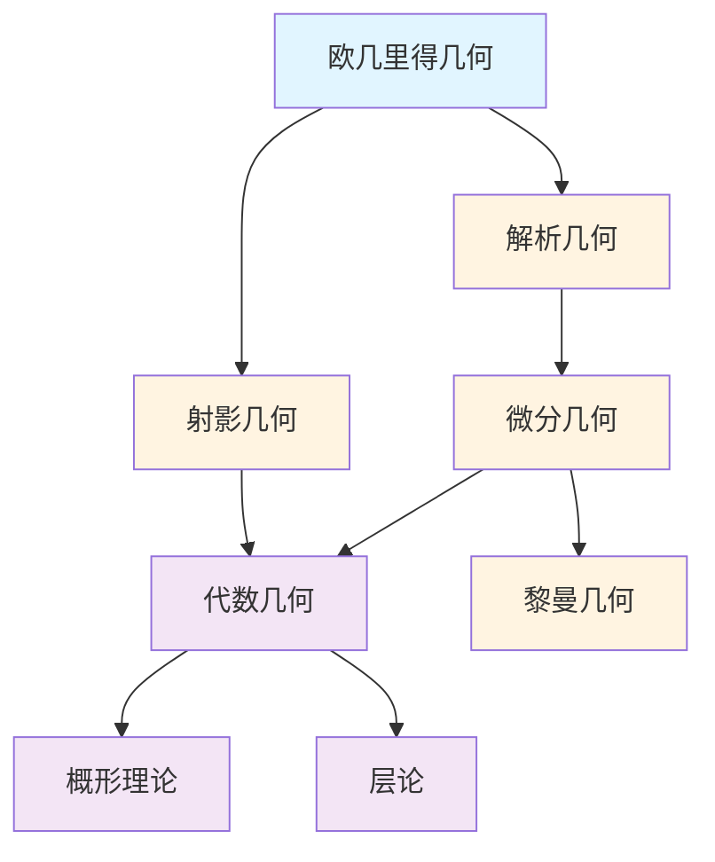

# 几何学概念梳理

**主题编号**: C.03.04
**创建日期**: 2025年11月21日
**最后更新**: 2025年1月（三视角转换全面完成）

---

## 📋 目录 / Table of Contents

- [几何学概念梳理](#几何学概念梳理)
  - [📋 目录 / Table of Contents](#-目录--table-of-contents)
  - [📋 概述 (编号: C.03.04.01)](#-概述-编号-c030401)
  - [🎯 核心概念体系 (编号: C.03.04.02)](#-核心概念体系-编号-c030402)
    - [1. 欧几里得几何核心概念 (编号: C.03.04.02.01)](#1-欧几里得几何核心概念-编号-c03040201)
      - [基础概念](#基础概念)
      - [平面几何](#平面几何)
      - [立体几何](#立体几何)
    - [2. 解析几何核心概念 (编号: C.03.04.02.02)](#2-解析几何核心概念-编号-c03040202)
      - [坐标系统](#坐标系统)
      - [曲线](#曲线)
      - [曲面](#曲面)
    - [3. 微分几何核心概念 (编号: C.03.04.02.03)](#3-微分几何核心概念-编号-c03040203)
      - [流形理论](#流形理论)
      - [黎曼几何](#黎曼几何)
      - [外微分](#外微分)
    - [4. 射影几何核心概念 (编号: C.03.04.02.04)](#4-射影几何核心概念-编号-c03040204)
      - [射影空间](#射影空间)
      - [射影变换](#射影变换)
    - [5. 代数几何核心概念 (编号: C.03.04.02.05)](#5-代数几何核心概念-编号-c03040205)
      - [代数簇](#代数簇)
      - [概形](#概形)
      - [层论](#层论)
  - [🔗 概念关联图 (编号: C.03.04.03)](#-概念关联图-编号-c030403)
  - [📊 概念重要性矩阵 (编号: C.03.04.04)](#-概念重要性矩阵-编号-c030404)
  - [🎓 学习路径建议 (编号: C.03.04.05)](#-学习路径建议-编号-c030405)
    - [基础路径](#基础路径)
    - [进阶路径](#进阶路径)
    - [高级路径](#高级路径)

---

## 📋 概述 (编号: C.03.04.01)

本文档系统梳理几何学领域的核心概念，包括欧几里得几何、解析几何、微分几何、射影几何、代数几何等。

**核心概念三视角版本**: 本文档中涉及的以下核心概念已有三视角深度版本：

- [流形](../核心概念/18-流形-三视角版.md) (C.CORE.018) - 微分几何核心概念的三视角深度分析
- [黎曼流形](../核心概念/19-黎曼流形-三视角版.md) (C.CORE.019) - 黎曼几何核心概念的三视角深度分析
- [曲率](../核心概念/20-曲率-三视角版.md) (C.CORE.020) - 微分几何核心概念的三视角深度分析
- [概形](../核心概念/21-概形-三视角版.md) (C.CORE.021) - 代数几何核心概念的三视角深度分析
- [层](../核心概念/22-层-三视角版.md) (C.CORE.022) - 代数几何核心概念的三视角深度分析

详见：[核心概念索引](../核心概念/00-核心概念索引.md) - 所有33个核心概念的三视角版本

**哲学背景**: 几何学的发展深受康德哲学的影响。康德认为欧几里得几何是空间的先验形式，这一观点在非欧几何出现后受到挑战。解析几何（Descartes）体现了理性主义。微分几何和代数几何的发展体现了结构主义的影响。详见[数学哲学维度矩阵](../02-知识矩阵/09-数学哲学维度矩阵.md)。

**权威资源对齐**: 本文档的概念定义和结构参考了Wikipedia几何学条目、MIT 18.901拓扑学课程、Princeton的微分几何和代数几何课程，以及Metamath的几何定理。详见[权威资源对齐说明](../00-权威资源对齐说明.md)和[权威资源对标改进计划](../00-权威资源对标改进计划.md)。

---

## 🎯 核心概念体系 (编号: C.03.04.02)

### 1. 欧几里得几何核心概念 (编号: C.03.04.02.01)

#### 基础概念

- **点 (Point)**: 几何的基本元素
  - **定义**: 没有大小、只有位置的几何对象
  - **历史背景**: 欧几里得（约公元前300年）在《几何原本》中给出原始定义，Hilbert（1899）建立现代公理化体系
  - **公理化**: 在Hilbert公理体系中，点、线、面是未定义的基本概念
  - **应用**: 所有几何对象的基础
  - **参考文献**:
    - Wikipedia: [Point (Geometry)](https://en.wikipedia.org/wiki/Point_(geometry))
    - Hilbert, D. (1902). *The Foundations of Geometry*. Open Court Publishing.
- **线 (Line)**: 点的集合
  - **定义**: 一维几何对象，由无限多个点组成
  - **公理**: 通过两点有且仅有一条直线（欧几里得第一公设）
  - **历史背景**: 欧几里得几何的基础概念，Hilbert公理化后成为基本对象
  - **应用**: 几何构造、解析几何
  - **参考文献**:
    - Wikipedia: [Line (Geometry)](https://en.wikipedia.org/wiki/Line_(geometry))
- **面 (Plane)**: 平面的概念
  - **定义**: 二维几何对象，由无限多条直线组成
  - **公理**: 通过不共线的三点确定唯一平面
  - **应用**: 立体几何、解析几何
- **角 (Angle)**: 角的概念
  - **定义**: 由两条射线（或线段）从同一点出发形成的图形
  - **度量**: 用弧度或度度量，$180° = \pi$ 弧度
  - **应用**: 三角函数、几何证明
- **距离 (Distance)**: 两点之间的距离
  - **定义**: 在欧几里得空间中，两点 $P(x_1, y_1)$ 和 $Q(x_2, y_2)$ 的距离 $d = \sqrt{(x_2-x_1)^2 + (y_2-y_1)^2}$
  - **性质**: 满足三角不等式、对称性、正定性
  - **应用**: 度量几何、优化问题
- **平行 (Parallel)**: 平行关系
  - **定义**: 两条直线在同一平面内不相交
  - **平行公设**: 通过直线外一点，有且仅有一条直线与给定直线平行（欧几里得第五公设）
  - **历史意义**: 平行公设的独立性导致非欧几何的发现
  - **应用**: 几何证明、解析几何
  - **参考文献**:
    - Wikipedia: [Parallel (Geometry)](https://en.wikipedia.org/wiki/Parallel_(geometry))
- **垂直 (Perpendicular)**: 垂直关系
  - **定义**: 两条直线相交成直角（$90°$）
  - **性质**: 垂直直线的斜率乘积为 $-1$（在解析几何中）
  - **应用**: 几何构造、坐标系统

#### 平面几何

- **三角形 (Triangle)**: 三角形及其性质
  - **定义**: 由三条线段围成的封闭图形
  - **分类**: 按边长（等边、等腰、一般），按角度（锐角、直角、钝角）
  - **性质**:
    - 内角和为 $180°$
    - 三角形不等式：任意两边之和大于第三边
    - 面积公式：$S = \frac{1}{2}bh$（底乘高）或 $S = \frac{1}{2}ab\sin C$
  - **应用**: 几何证明、三角学、计算几何
  - **参考文献**:
    - Wikipedia: [Triangle](https://en.wikipedia.org/wiki/Triangle)
- **圆 (Circle)**: 圆及其性质
  - **定义**: 平面上到定点（圆心）距离等于定值（半径）的所有点的集合
  - **方程**: $(x-h)^2 + (y-k)^2 = r^2$（标准形式）
  - **性质**:
    - 周长：$C = 2\pi r$
    - 面积：$A = \pi r^2$
    - 圆周角定理：同弧所对圆周角等于圆心角的一半
  - **历史背景**: 圆的研究可以追溯到古代，是几何学的基本对象
  - **应用**: 几何构造、解析几何、三角学
  - **参考文献**:
    - Wikipedia: [Circle](https://en.wikipedia.org/wiki/Circle)
- **多边形 (Polygon)**: 多边形
  - **定义**: 由有限条线段首尾相连围成的封闭图形
  - **分类**: 三角形、四边形、五边形等
  - **性质**: $n$ 边形内角和为 $(n-2) \times 180°$
  - **应用**: 计算几何、图形学
- **相似 (Similar)**: 相似关系
  - **定义**: 两个图形形状相同但大小不同
  - **判定**: 对应角相等，对应边成比例
  - **性质**: 相似比保持面积比为相似比的平方
  - **应用**: 几何证明、测量
- **全等 (Congruent)**: 全等关系
  - **定义**: 两个图形完全重合
  - **判定**: SSS、SAS、ASA、AAS、HL（直角三角形）
  - **应用**: 几何证明、构造

#### 立体几何

- **多面体 (Polyhedron)**: 多面体
- **球 (Sphere)**: 球体
- **柱体 (Cylinder)**: 圆柱体
- **锥体 (Cone)**: 圆锥体
- **体积 (Volume)**: 体积的概念
- **表面积 (Surface Area)**: 表面积的概念

### 2. 解析几何核心概念 (编号: C.03.04.02.02)

#### 坐标系统

- **笛卡尔坐标 (Cartesian Coordinates)**: 直角坐标系
  - **定义**: 用有序对 $(x, y)$ 表示平面上的点，其中 $x$ 和 $y$ 是到坐标轴的距离
  - **历史背景**: 由Descartes（1637）在《几何学》中引入，是解析几何的基础
  - **性质**: 建立了代数与几何的桥梁
  - **应用**: 函数图像、几何问题代数化
  - **参考文献**:
    - Wikipedia: [Cartesian Coordinate System](https://en.wikipedia.org/wiki/Cartesian_coordinate_system)
    - Descartes, R. (1637). *La Géométrie*. Leiden.
- **极坐标 (Polar Coordinates)**: 极坐标系
  - **定义**: 用 $(r, \theta)$ 表示点，其中 $r$ 是到原点的距离，$\theta$ 是与极轴的角度
  - **转换**: $x = r\cos\theta$，$y = r\sin\theta$；$r = \sqrt{x^2+y^2}$，$\theta = \arctan\frac{y}{x}$
  - **应用**: 圆形对称问题、复数表示
  - **参考文献**:
    - Wikipedia: [Polar Coordinate System](https://en.wikipedia.org/wiki/Polar_coordinate_system)
- **球坐标 (Spherical Coordinates)**: 球坐标系
  - **定义**: 用 $(r, \theta, \phi)$ 表示三维空间中的点，其中 $r$ 是到原点的距离，$\theta$ 是方位角，$\phi$ 是极角
  - **转换**: $x = r\sin\phi\cos\theta$，$y = r\sin\phi\sin\theta$，$z = r\cos\phi$
  - **应用**: 物理（量子力学、电磁学）、天文学
  - **参考文献**:
    - Wikipedia: [Spherical Coordinate System](https://en.wikipedia.org/wiki/Spherical_coordinate_system)
- **柱坐标 (Cylindrical Coordinates)**: 柱坐标系
  - **定义**: 用 $(\rho, \phi, z)$ 表示三维空间中的点，其中 $\rho$ 是到 $z$ 轴的距离，$\phi$ 是方位角，$z$ 是高度
  - **转换**: $x = \rho\cos\phi$，$y = \rho\sin\phi$，$z = z$
  - **应用**: 圆柱对称问题、工程
  - **参考文献**:
    - Wikipedia: [Cylindrical Coordinate System](https://en.wikipedia.org/wiki/Cylindrical_coordinate_system)

#### 曲线

- **直线 (Line)**: 直线的方程
  - **一般式**: $Ax + By + C = 0$
  - **斜截式**: $y = mx + b$（$m$ 是斜率，$b$ 是 $y$ 截距）
  - **点斜式**: $y - y_1 = m(x - x_1)$
  - **两点式**: $\frac{y-y_1}{y_2-y_1} = \frac{x-x_1}{x_2-x_1}$
  - **应用**: 线性函数、几何问题
- **圆锥曲线 (Conic Section)**: 椭圆、双曲线、抛物线
  - **定义**: 平面与圆锥面的交线
  - **椭圆**: $\frac{x^2}{a^2} + \frac{y^2}{b^2} = 1$，焦点在 $(\pm c, 0)$，$c^2 = a^2 - b^2$
  - **双曲线**: $\frac{x^2}{a^2} - \frac{y^2}{b^2} = 1$，焦点在 $(\pm c, 0)$，$c^2 = a^2 + b^2$
  - **抛物线**: $y^2 = 4px$，焦点在 $(p, 0)$
  - **历史背景**: 由Apollonius（约公元前200年）系统研究，Kepler（1609）发现行星轨道是椭圆
  - **应用**: 天体力学、光学、工程
  - **参考文献**:
    - Wikipedia: [Conic Section](https://en.wikipedia.org/wiki/Conic_section)
    - Apollonius of Perga (c. 200 BCE). *Conics*. (古代经典)
- **参数曲线 (Parametric Curve)**: 参数方程表示的曲线
  - **定义**: $x = x(t)$，$y = y(t)$，其中 $t$ 是参数
  - **例子**: 圆 $x = r\cos t$，$y = r\sin t$；摆线、心形线
  - **应用**: 轨迹问题、计算机图形学
- **极坐标曲线 (Polar Curve)**: 极坐标方程表示的曲线
  - **定义**: $r = f(\theta)$
  - **例子**: 心形线 $r = 1 + \cos\theta$，玫瑰线 $r = a\cos(n\theta)$
  - **应用**: 对称问题、艺术设计

#### 曲面

- **平面 (Plane)**: 平面的方程
- **二次曲面 (Quadric Surface)**: 二次曲面
- **参数曲面 (Parametric Surface)**: 参数方程表示的曲面
- **隐式曲面 (Implicit Surface)**: 隐式方程表示的曲面

### 3. 微分几何核心概念 (编号: C.03.04.02.03)

#### 流形理论

- **流形 (Manifold)**: 流形的定义
  - **严格定义**: $n$ 维流形 $M$ 是满足局部同胚于 $\mathbb{R}^n$ 的拓扑空间
  - **形式化**: $\forall p \in M, \exists$ 开邻域 $U$ 和同胚 $\phi: U \to \mathbb{R}^n$
  - **历史背景**: 流形概念由Riemann（1854）引入，Whitney（1936）建立现代理论
  - **性质**: 流形是局部欧几里得的，但整体可能不是
  - **例子**: 球面、环面、$\mathbb{R}^n$、Lie群
  - **应用**: 物理中的时空（广义相对论）、机器学习中的数据流形、拓扑学
  - **参考文献**:
    - Wikipedia: [Manifold](https://en.wikipedia.org/wiki/Manifold)
    - Lee, J. M. (2012). *Introduction to Smooth Manifolds*. Springer.
    - do Carmo, M. P. (1992). *Riemannian Geometry*. Birkhäuser.
- **微分流形 (Differentiable Manifold)**: 可微流形
  - **定义**: 流形 $M$ 配备坐标卡集 $\{(U_\alpha, \phi_\alpha)\}$，使得坐标变换 $\phi_\beta \circ \phi_\alpha^{-1}$ 可微
  - **条件**: 坐标变换的雅可比矩阵非奇异
  - **应用**: 微分几何、物理中的相空间
- **光滑流形 (Smooth Manifold)**: 光滑流形
  - **定义**: 坐标变换 $C^\infty$ 可微的微分流形
  - **性质**: 可以定义光滑函数、向量场、微分形式
  - **应用**: 黎曼几何、规范理论
- **坐标卡 (Coordinate Chart)**: 坐标卡
  - **定义**: 对 $(U, \phi)$，其中 $U \subseteq M$ 开集，$\phi: U \to \mathbb{R}^n$ 同胚
  - **作用**: 将流形局部参数化
  - **性质**: 流形由坐标卡覆盖
- **坐标变换 (Coordinate Transformation)**: 坐标变换
  - **定义**: 两个坐标卡 $(U, \phi)$ 和 $(V, \psi)$ 的坐标变换是 $\psi \circ \phi^{-1}: \phi(U \cap V) \to \psi(U \cap V)$
  - **性质**: 坐标变换必须是同胚（拓扑流形）或可微同胚（微分流形）
- **切空间 (Tangent Space)**: 切空间
  - **定义**: 在点 $p \in M$ 的切空间 $T_p M$ 是所有切向量的向量空间
  - **构造**: 切向量是等价类 $[\gamma]$，其中 $\gamma: (-\varepsilon, \varepsilon) \to M$ 是过 $p$ 的曲线
  - **维数**: $\dim T_p M = \dim M$
  - **应用**: 定义导数、向量场
- **切丛 (Tangent Bundle)**: 切丛
  - **定义**: $TM = \bigcup_{p \in M} T_p M$，配备自然流形结构
  - **性质**: 若 $M$ 是 $n$ 维流形，则 $TM$ 是 $2n$ 维流形
  - **应用**: 向量场、联络、测地线
- **余切丛 (Cotangent Bundle)**: 余切丛
  - **定义**: $T^*M = \bigcup_{p \in M} T_p^* M$，其中 $T_p^* M$ 是 $T_p M$ 的对偶空间
  - **应用**: 微分形式、辛几何

#### 黎曼几何

- **黎曼流形 (Riemannian Manifold)**: 黎曼流形
  - **定义**: 微分流形 $M$ 配备正定对称双线性形式 $g$（度规）
  - **度规**: $g_p: T_p M \times T_p M \to \mathbb{R}$ 在每点 $p$ 定义内积
  - **历史背景**: 由Riemann（1854）在就职演讲中引入，是微分几何的基础
  - **性质**: 可以定义长度、角度、体积、曲率
  - **例子**: 欧几里得空间、球面、双曲面、Lie群（配备双不变度规）
  - **应用**: 广义相对论（时空是4维Lorentz流形）、最优传输、机器学习
  - **参考文献**:
    - Wikipedia: [Riemannian Manifold](https://en.wikipedia.org/wiki/Riemannian_manifold)
    - do Carmo, M. P. (1992). *Riemannian Geometry*. Birkhäuser.
    - Spivak, M. (1999). *A Comprehensive Introduction to Differential Geometry*. Publish or Perish.
- **度规 (Metric)**: 黎曼度规
  - **定义**: 在每点 $p$ 的对称正定双线性形式 $g_p$
  - **局部表示**: 在坐标卡中，$g = \sum_{i,j} g_{ij} dx^i \otimes dx^j$
  - **性质**: $g_{ij}$ 是对称正定矩阵
  - **应用**: 定义距离、测地线
- **曲率 (Curvature)**: 曲率张量
  - **思想**: 度量流形偏离平坦空间的程度
  - **历史背景**: 曲率概念由Gauss（1827）在曲面理论中引入，Riemann（1854）推广到高维
  - **类型**: 黎曼曲率、里奇曲率、标量曲率
  - **几何意义**:
    - 正曲率：球面（局部收缩）
    - 负曲率：双曲面（局部扩张）
    - 零曲率：平面（局部平坦）
  - **应用**: 广义相对论（物质决定曲率）、几何分析
  - **参考文献**:
    - Wikipedia: [Curvature](https://en.wikipedia.org/wiki/Curvature)
    - do Carmo, M. P. (1992). *Riemannian Geometry*. Birkhäuser.
- **黎曼曲率 (Riemann Curvature)**: 黎曼曲率张量
  - **定义**: $R(X,Y)Z = \nabla_X \nabla_Y Z - \nabla_Y \nabla_X Z - \nabla_{[X,Y]} Z$
  - **性质**: 四阶张量，满足Bianchi恒等式
  - **应用**: 刻画流形的局部几何
- **里奇曲率 (Ricci Curvature)**: 里奇曲率张量
  - **定义**: $\text{Ric}(X,Y) = \text{tr}(Z \mapsto R(Z,X)Y)$（对黎曼曲率取迹）
  - **性质**: 对称二阶张量
  - **应用**: Einstein方程、几何流
- **标量曲率 (Scalar Curvature)**: 标量曲率
  - **定义**: $S = \text{tr}(\text{Ric})$（对里奇曲率取迹）
  - **性质**: 标量函数
  - **应用**: Yamabe问题、共形几何
- **测地线 (Geodesic)**: 测地线
  - **定义**: 流形上连接两点的最短路径（局部）
  - **方程**: $\frac{d^2 x^i}{dt^2} + \Gamma_{jk}^i \frac{dx^j}{dt} \frac{dx^k}{dt} = 0$（测地线方程）
  - **性质**: 测地线是自平行的（$\nabla_{\dot{\gamma}} \dot{\gamma} = 0$）
  - **应用**: 广义相对论中的自由落体、优化问题
- **指数映射 (Exponential Map)**: 指数映射
  - **定义**: $\exp_p: T_p M \to M$，$\exp_p(v) = \gamma_v(1)$，其中 $\gamma_v$ 是从 $p$ 出发、初始速度为 $v$ 的测地线
  - **性质**: 在 $0$ 附近是局部微分同胚
  - **应用**: 定义法坐标、Riemannian优化

#### 外微分

- **微分形式 (Differential Form)**: 微分形式
  - **定义**: $k$ 形式是 $k$ 次反对称多重线性映射
  - **例子**: 0-形式是函数，1-形式是余切向量，2-形式是面积元素
  - **历史背景**: 由Élie Cartan（1899）引入，是现代微分几何的基础
  - **应用**: 积分、Stokes定理、de Rham上同调
  - **参考文献**:
    - Wikipedia: [Differential Form](https://en.wikipedia.org/wiki/Differential_form)
    - Spivak, M. (1999). *A Comprehensive Introduction to Differential Geometry*. Publish or Perish.
- **外微分 (Exterior Derivative)**: 外微分算子
  - **定义**: $d: \Omega^k(M) \to \Omega^{k+1}(M)$，满足 $d^2 = 0$
  - **性质**: 外微分是局部算子，满足Leibniz法则
  - **应用**: de Rham上同调、Maxwell方程
- **外积 (Wedge Product)**: 外积
  - **定义**: $\wedge: \Omega^k(M) \times \Omega^l(M) \to \Omega^{k+l}(M)$，满足反对称性
  - **性质**: $\alpha \wedge \beta = (-1)^{kl} \beta \wedge \alpha$
  - **应用**: 体积形式、积分
- **积分 (Integration)**: 流形上的积分
  - **定义**: 通过坐标卡和单位分解定义 $k$ 形式在 $k$ 维子流形上的积分
  - **性质**: 与坐标选择无关（定向流形）
  - **应用**: 体积计算、物理量（质量、电荷等）
- **斯托克斯定理 (Stokes' Theorem)**: 斯托克斯定理
  - **定理**: $\int_M d\omega = \int_{\partial M} \omega$，其中 $M$ 是定向流形，$\partial M$ 是边界
  - **特例**: Green定理（平面）、Gauss散度定理（三维）
  - **历史背景**: 由Stokes（1854）提出，是微积分基本定理的高维推广
  - **应用**: 向量分析、物理（电磁学、流体力学）
  - **参考文献**:
    - Wikipedia: [Stokes' Theorem](https://en.wikipedia.org/wiki/Stokes%27_theorem)
    - Spivak, M. (1999). *A Comprehensive Introduction to Differential Geometry*. Publish or Perish.

### 4. 射影几何核心概念 (编号: C.03.04.02.04)

#### 射影空间

- **射影平面 (Projective Plane)**: 射影平面
- **射影空间 (Projective Space)**: 射影空间
- **齐次坐标 (Homogeneous Coordinates)**: 齐次坐标
- **无穷远点 (Point at Infinity)**: 无穷远点
- **无穷远直线 (Line at Infinity)**: 无穷远直线

#### 射影变换

- **射影映射 (Projective Map)**: 射影映射
- **对偶性 (Duality)**: 点与线的对偶
- **交比 (Cross Ratio)**: 交比
- **射影不变量 (Projective Invariant)**: 射影不变量

### 5. 代数几何核心概念 (编号: C.03.04.02.05)

#### 代数簇

- **仿射簇 (Affine Variety)**: 仿射代数簇
  - **定义**: 仿射空间 $\mathbb{A}^n$ 中多项式方程组 $f_1 = \cdots = f_k = 0$ 的零点集
  - **记号**: $V(f_1, \ldots, f_k) = \{x \in \mathbb{A}^n : f_i(x) = 0\}$
  - **历史背景**: 由Hilbert（1890）的零点定理建立，是代数几何的基础对象
  - **性质**: 仿射簇对应素理想（Hilbert零点定理）
  - **应用**: 代数几何、编码理论、密码学
  - **参考文献**:
    - Wikipedia: [Algebraic Variety](https://en.wikipedia.org/wiki/Algebraic_variety)
    - Hartshorne, R. (1977). *Algebraic Geometry*. Springer.
- **射影簇 (Projective Variety)**: 射影代数簇
  - **定义**: 射影空间 $\mathbb{P}^n$ 中齐次多项式方程组的零点集
  - **性质**: 射影簇是紧的（在复拓扑中）
  - **应用**: 代数几何、数论（Diophantine方程）
- **不可约簇 (Irreducible Variety)**: 不可约代数簇
  - **定义**: 不能表示为两个真子簇的并
  - **性质**: 不可约簇对应素理想
  - **应用**: 代数簇的分解
- **维数 (Dimension)**: 代数簇的维数
  - **定义**: 不可约簇的维数是其函数域的超越次数
  - **几何意义**: 一般点的局部参数个数
  - **应用**: 分类理论
- **奇点 (Singularity)**: 代数簇的奇点
  - **定义**: 切空间维数大于簇维数的点
  - **例子**: 节点、尖点、自交点
  - **应用**: 奇点消解、模空间

#### 概形

- **概形 (Scheme)**: 概形的定义
  - **定义**: 概形是局部同构于仿射概形的局部环化空间
  - **历史背景**: 由Grothendieck（1960s）引入，统一了代数几何和数论
  - **构造**: 从交换环构造：$\text{Spec}(R)$ 是环 $R$ 的素理想集合，配备Zariski拓扑和结构层
  - **意义**: 概形理论是代数几何的现代基础，统一了代数簇、数论、代数拓扑
  - **应用**: 数论（Weil猜想、Fermat大定理）、代数几何、表示论
  - **参考文献**:
    - Wikipedia: [Scheme (Mathematics)](https://en.wikipedia.org/wiki/Scheme_(mathematics))
    - Hartshorne, R. (1977). *Algebraic Geometry*. Springer.
    - Grothendieck, A., & Dieudonné, J. (1960). *Éléments de géométrie algébrique*. IHES.
- **仿射概形 (Affine Scheme)**: 仿射概形
  - **定义**: $\text{Spec}(R)$，其中 $R$ 是交换环
  - **性质**: 仿射概形是概形的基本构件
- **射影概形 (Projective Scheme)**: 射影概形
  - **定义**: $\text{Proj}(S)$，其中 $S$ 是分次环
  - **性质**: 射影概形是紧的
- **概形态射 (Scheme Morphism)**: 概形之间的态射
  - **定义**: 保持结构层的连续映射
  - **应用**: 定义纤维、基变换
- **纤维积 (Fiber Product)**: 概形的纤维积
  - **定义**: $X \times_S Y$ 是概形的范畴积
  - **应用**: 基变换、下降理论

#### 层论

- **层 (Sheaf)**: 层的定义
- **预层 (Presheaf)**: 预层
- **拟凝聚层 (Quasicoherent Sheaf)**: 拟凝聚层
- **上同调 (Cohomology)**: 层上同调
- **导出范畴 (Derived Category)**: 导出范畴

---

## 🔗 概念关联图 (编号: C.03.04.03)

---

## 📊 概念重要性矩阵 (编号: C.03.04.04)

| 概念 | 基础性 | 应用性 | 重要性 | 学习优先级 |
|-----|--------|--------|--------|-----------|
| 点线面 | ⭐⭐⭐⭐⭐ | ⭐⭐⭐⭐⭐ | ⭐⭐⭐⭐⭐ | 1 |
| 坐标系统 | ⭐⭐⭐⭐⭐ | ⭐⭐⭐⭐⭐ | ⭐⭐⭐⭐⭐ | 1 |
| 流形 | ⭐⭐⭐⭐ | ⭐⭐⭐⭐ | ⭐⭐⭐⭐⭐ | 2 |
| 切空间 | ⭐⭐⭐⭐ | ⭐⭐⭐ | ⭐⭐⭐⭐ | 3 |
| 度规 | ⭐⭐⭐ | ⭐⭐⭐⭐ | ⭐⭐⭐⭐ | 3 |
| 曲率 | ⭐⭐⭐ | ⭐⭐⭐⭐ | ⭐⭐⭐⭐ | 3 |
| 概形 | ⭐⭐⭐ | ⭐⭐⭐ | ⭐⭐⭐⭐ | 4 |
| 层 | ⭐⭐⭐ | ⭐⭐⭐ | ⭐⭐⭐⭐ | 4 |

---

## 🎓 学习路径建议 (编号: C.03.04.05)

### 基础路径

1. **欧几里得几何** → **解析几何** → **坐标系统**
2. **曲线** → **曲面** → **参数方程**

### 进阶路径

1. **微分几何** → **流形** → **切空间** → **度规**
2. **射影几何** → **射影空间** → **射影变换**

### 高级路径

1. **代数几何** → **概形** → **层论** → **上同调**
2. **黎曼几何** → **曲率** → **几何分析**
3. **导出代数几何** → **∞-范畴**

---

**创建日期**: 2025年11月21日
**最后更新**: 2025年1月（三视角转换全面完成）
**维护状态**: 持续更新中
