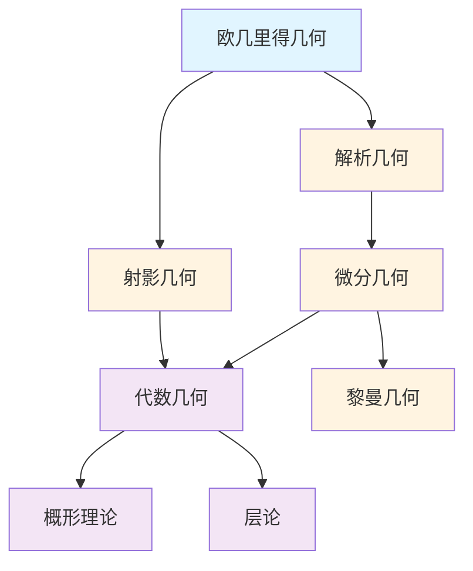

# 几何学概念梳理

## 📋 概述

本文档系统梳理几何学领域的核心概念，包括欧几里得几何、解析几何、微分几何、射影几何、代数几何等。

---

## 🎯 核心概念体系

### 1. 欧几里得几何核心概念

#### 基础概念

- **点 (Point)**: 几何的基本元素
- **线 (Line)**: 点的集合
- **面 (Plane)**: 平面的概念
- **角 (Angle)**: 角的概念
- **距离 (Distance)**: 两点之间的距离
- **平行 (Parallel)**: 平行关系
- **垂直 (Perpendicular)**: 垂直关系

#### 平面几何

- **三角形 (Triangle)**: 三角形及其性质
- **圆 (Circle)**: 圆及其性质
- **多边形 (Polygon)**: 多边形
- **相似 (Similar)**: 相似关系
- **全等 (Congruent)**: 全等关系

#### 立体几何

- **多面体 (Polyhedron)**: 多面体
- **球 (Sphere)**: 球体
- **柱体 (Cylinder)**: 圆柱体
- **锥体 (Cone)**: 圆锥体
- **体积 (Volume)**: 体积的概念
- **表面积 (Surface Area)**: 表面积的概念

### 2. 解析几何核心概念

#### 坐标系统

- **笛卡尔坐标 (Cartesian Coordinates)**: 直角坐标系
- **极坐标 (Polar Coordinates)**: 极坐标系
- **球坐标 (Spherical Coordinates)**: 球坐标系
- **柱坐标 (Cylindrical Coordinates)**: 柱坐标系

#### 曲线

- **直线 (Line)**: 直线的方程
- **圆锥曲线 (Conic Section)**: 椭圆、双曲线、抛物线
- **参数曲线 (Parametric Curve)**: 参数方程表示的曲线
- **极坐标曲线 (Polar Curve)**: 极坐标方程表示的曲线

#### 曲面

- **平面 (Plane)**: 平面的方程
- **二次曲面 (Quadric Surface)**: 二次曲面
- **参数曲面 (Parametric Surface)**: 参数方程表示的曲面
- **隐式曲面 (Implicit Surface)**: 隐式方程表示的曲面

### 3. 微分几何核心概念

#### 流形理论

- **流形 (Manifold)**: 流形的定义
- **微分流形 (Differentiable Manifold)**: 可微流形
- **光滑流形 (Smooth Manifold)**: 光滑流形
- **坐标卡 (Coordinate Chart)**: 坐标卡
- **坐标变换 (Coordinate Transformation)**: 坐标变换
- **切空间 (Tangent Space)**: 切空间
- **切丛 (Tangent Bundle)**: 切丛
- **余切丛 (Cotangent Bundle)**: 余切丛

#### 黎曼几何

- **黎曼流形 (Riemannian Manifold)**: 黎曼流形
- **度规 (Metric)**: 黎曼度规
- **曲率 (Curvature)**: 曲率张量
- **黎曼曲率 (Riemann Curvature)**: 黎曼曲率张量
- **里奇曲率 (Ricci Curvature)**: 里奇曲率张量
- **标量曲率 (Scalar Curvature)**: 标量曲率
- **测地线 (Geodesic)**: 测地线
- **指数映射 (Exponential Map)**: 指数映射

#### 外微分

- **微分形式 (Differential Form)**: 微分形式
- **外微分 (Exterior Derivative)**: 外微分算子
- **外积 (Wedge Product)**: 外积
- **积分 (Integration)**: 流形上的积分
- **斯托克斯定理 (Stokes' Theorem)**: 斯托克斯定理

### 4. 射影几何核心概念

#### 射影空间

- **射影平面 (Projective Plane)**: 射影平面
- **射影空间 (Projective Space)**: 射影空间
- **齐次坐标 (Homogeneous Coordinates)**: 齐次坐标
- **无穷远点 (Point at Infinity)**: 无穷远点
- **无穷远直线 (Line at Infinity)**: 无穷远直线

#### 射影变换

- **射影映射 (Projective Map)**: 射影映射
- **对偶性 (Duality)**: 点与线的对偶
- **交比 (Cross Ratio)**: 交比
- **射影不变量 (Projective Invariant)**: 射影不变量

### 5. 代数几何核心概念

#### 代数簇

- **仿射簇 (Affine Variety)**: 仿射代数簇
- **射影簇 (Projective Variety)**: 射影代数簇
- **不可约簇 (Irreducible Variety)**: 不可约代数簇
- **维数 (Dimension)**: 代数簇的维数
- **奇点 (Singularity)**: 代数簇的奇点

#### 概形

- **概形 (Scheme)**: 概形的定义
- **仿射概形 (Affine Scheme)**: 仿射概形
- **射影概形 (Projective Scheme)**: 射影概形
- **概形态射 (Scheme Morphism)**: 概形之间的态射
- **纤维积 (Fiber Product)**: 概形的纤维积

#### 层论

- **层 (Sheaf)**: 层的定义
- **预层 (Presheaf)**: 预层
- **拟凝聚层 (Quasicoherent Sheaf)**: 拟凝聚层
- **上同调 (Cohomology)**: 层上同调
- **导出范畴 (Derived Category)**: 导出范畴

---

## 🔗 概念关联图

---

## 📊 概念重要性矩阵

| 概念 | 基础性 | 应用性 | 重要性 | 学习优先级 |
|-----|--------|--------|--------|-----------|
| 点线面 | ⭐⭐⭐⭐⭐ | ⭐⭐⭐⭐⭐ | ⭐⭐⭐⭐⭐ | 1 |
| 坐标系统 | ⭐⭐⭐⭐⭐ | ⭐⭐⭐⭐⭐ | ⭐⭐⭐⭐⭐ | 1 |
| 流形 | ⭐⭐⭐⭐ | ⭐⭐⭐⭐ | ⭐⭐⭐⭐⭐ | 2 |
| 切空间 | ⭐⭐⭐⭐ | ⭐⭐⭐ | ⭐⭐⭐⭐ | 3 |
| 度规 | ⭐⭐⭐ | ⭐⭐⭐⭐ | ⭐⭐⭐⭐ | 3 |
| 曲率 | ⭐⭐⭐ | ⭐⭐⭐⭐ | ⭐⭐⭐⭐ | 3 |
| 概形 | ⭐⭐⭐ | ⭐⭐⭐ | ⭐⭐⭐⭐ | 4 |
| 层 | ⭐⭐⭐ | ⭐⭐⭐ | ⭐⭐⭐⭐ | 4 |

---

## 🎓 学习路径建议

### 基础路径

1. **欧几里得几何** → **解析几何** → **坐标系统**
2. **曲线** → **曲面** → **参数方程**

### 进阶路径

1. **微分几何** → **流形** → **切空间** → **度规**
2. **射影几何** → **射影空间** → **射影变换**

### 高级路径

1. **代数几何** → **概形** → **层论** → **上同调**
2. **黎曼几何** → **曲率** → **几何分析**
3. **导出代数几何** → **∞-范畴**

---

**创建日期**: 2025年11月21日
**维护状态**: 持续更新中
