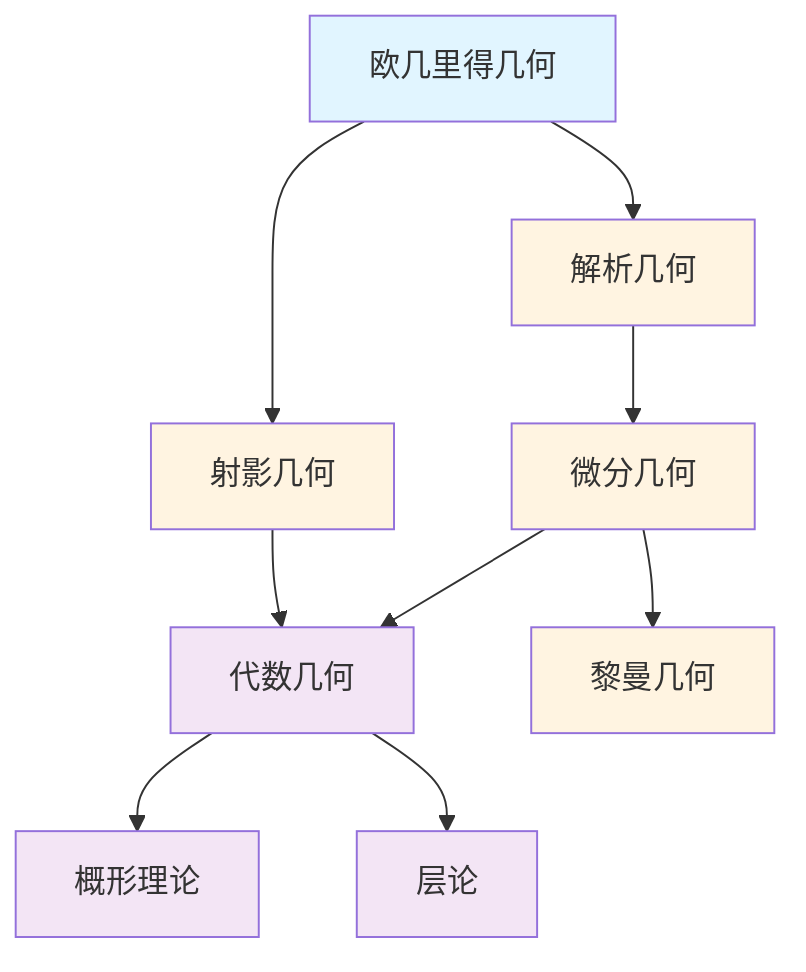

# 几何学概念梳理

**主题编号**: C.03.04
**创建日期**: 2025年11月21日
**最后更新**: 2025年11月21日

---

## 📋 目录 / Table of Contents

- [几何学概念梳理](#几何学概念梳理)
  - [📋 目录 / Table of Contents](#-目录--table-of-contents)
  - [📋 概述 (编号: C.03.04.01)](#-概述-编号-c030401)
  - [🎯 核心概念体系 (编号: C.03.04.02)](#-核心概念体系-编号-c030402)
    - [1. 欧几里得几何核心概念 (编号: C.03.04.02.01)](#1-欧几里得几何核心概念-编号-c03040201)
      - [基础概念](#基础概念)
      - [平面几何](#平面几何)
      - [立体几何](#立体几何)
    - [2. 解析几何核心概念 (编号: C.03.04.02.02)](#2-解析几何核心概念-编号-c03040202)
      - [坐标系统](#坐标系统)
      - [曲线](#曲线)
      - [曲面](#曲面)
    - [3. 微分几何核心概念 (编号: C.03.04.02.03)](#3-微分几何核心概念-编号-c03040203)
      - [流形理论](#流形理论)
      - [黎曼几何](#黎曼几何)
      - [外微分](#外微分)
    - [4. 射影几何核心概念 (编号: C.03.04.02.04)](#4-射影几何核心概念-编号-c03040204)
      - [射影空间](#射影空间)
      - [射影变换](#射影变换)
    - [5. 代数几何核心概念 (编号: C.03.04.02.05)](#5-代数几何核心概念-编号-c03040205)
      - [代数簇](#代数簇)
      - [概形](#概形)
      - [层论](#层论)
  - [🔗 概念关联图 (编号: C.03.04.03)](#-概念关联图-编号-c030403)
  - [📊 概念重要性矩阵 (编号: C.03.04.04)](#-概念重要性矩阵-编号-c030404)
  - [🎓 学习路径建议 (编号: C.03.04.05)](#-学习路径建议-编号-c030405)
    - [基础路径](#基础路径)
    - [进阶路径](#进阶路径)
    - [高级路径](#高级路径)

---

## 📋 概述 (编号: C.03.04.01)

本文档系统梳理几何学领域的核心概念，包括欧几里得几何、解析几何、微分几何、射影几何、代数几何等。

---

## 🎯 核心概念体系 (编号: C.03.04.02)

### 1. 欧几里得几何核心概念 (编号: C.03.04.02.01)

#### 基础概念

- **点 (Point)**: 几何的基本元素
- **线 (Line)**: 点的集合
- **面 (Plane)**: 平面的概念
- **角 (Angle)**: 角的概念
- **距离 (Distance)**: 两点之间的距离
- **平行 (Parallel)**: 平行关系
- **垂直 (Perpendicular)**: 垂直关系

#### 平面几何

- **三角形 (Triangle)**: 三角形及其性质
- **圆 (Circle)**: 圆及其性质
- **多边形 (Polygon)**: 多边形
- **相似 (Similar)**: 相似关系
- **全等 (Congruent)**: 全等关系

#### 立体几何

- **多面体 (Polyhedron)**: 多面体
- **球 (Sphere)**: 球体
- **柱体 (Cylinder)**: 圆柱体
- **锥体 (Cone)**: 圆锥体
- **体积 (Volume)**: 体积的概念
- **表面积 (Surface Area)**: 表面积的概念

### 2. 解析几何核心概念 (编号: C.03.04.02.02)

#### 坐标系统

- **笛卡尔坐标 (Cartesian Coordinates)**: 直角坐标系
- **极坐标 (Polar Coordinates)**: 极坐标系
- **球坐标 (Spherical Coordinates)**: 球坐标系
- **柱坐标 (Cylindrical Coordinates)**: 柱坐标系

#### 曲线

- **直线 (Line)**: 直线的方程
- **圆锥曲线 (Conic Section)**: 椭圆、双曲线、抛物线
- **参数曲线 (Parametric Curve)**: 参数方程表示的曲线
- **极坐标曲线 (Polar Curve)**: 极坐标方程表示的曲线

#### 曲面

- **平面 (Plane)**: 平面的方程
- **二次曲面 (Quadric Surface)**: 二次曲面
- **参数曲面 (Parametric Surface)**: 参数方程表示的曲面
- **隐式曲面 (Implicit Surface)**: 隐式方程表示的曲面

### 3. 微分几何核心概念 (编号: C.03.04.02.03)

#### 流形理论

- **流形 (Manifold)**: 流形的定义
  - **严格定义**: $n$ 维流形 $M$ 是满足局部同胚于 $\mathbb{R}^n$ 的拓扑空间
  - **形式化**: $\forall p \in M, \exists$ 开邻域 $U$ 和同胚 $\phi: U \to \mathbb{R}^n$
  - **性质**: 流形是局部欧几里得的，但整体可能不是
  - **应用**: 物理中的时空、机器学习中的数据流形
- **微分流形 (Differentiable Manifold)**: 可微流形
  - **定义**: 流形 $M$ 配备坐标卡集 $\{(U_\alpha, \phi_\alpha)\}$，使得坐标变换 $\phi_\beta \circ \phi_\alpha^{-1}$ 可微
  - **条件**: 坐标变换的雅可比矩阵非奇异
  - **应用**: 微分几何、物理中的相空间
- **光滑流形 (Smooth Manifold)**: 光滑流形
  - **定义**: 坐标变换 $C^\infty$ 可微的微分流形
  - **性质**: 可以定义光滑函数、向量场、微分形式
  - **应用**: 黎曼几何、规范理论
- **坐标卡 (Coordinate Chart)**: 坐标卡
  - **定义**: 对 $(U, \phi)$，其中 $U \subseteq M$ 开集，$\phi: U \to \mathbb{R}^n$ 同胚
  - **作用**: 将流形局部参数化
  - **性质**: 流形由坐标卡覆盖
- **坐标变换 (Coordinate Transformation)**: 坐标变换
  - **定义**: 两个坐标卡 $(U, \phi)$ 和 $(V, \psi)$ 的坐标变换是 $\psi \circ \phi^{-1}: \phi(U \cap V) \to \psi(U \cap V)$
  - **性质**: 坐标变换必须是同胚（拓扑流形）或可微同胚（微分流形）
- **切空间 (Tangent Space)**: 切空间
  - **定义**: 在点 $p \in M$ 的切空间 $T_p M$ 是所有切向量的向量空间
  - **构造**: 切向量是等价类 $[\gamma]$，其中 $\gamma: (-\varepsilon, \varepsilon) \to M$ 是过 $p$ 的曲线
  - **维数**: $\dim T_p M = \dim M$
  - **应用**: 定义导数、向量场
- **切丛 (Tangent Bundle)**: 切丛
  - **定义**: $TM = \bigcup_{p \in M} T_p M$，配备自然流形结构
  - **性质**: 若 $M$ 是 $n$ 维流形，则 $TM$ 是 $2n$ 维流形
  - **应用**: 向量场、联络、测地线
- **余切丛 (Cotangent Bundle)**: 余切丛
  - **定义**: $T^*M = \bigcup_{p \in M} T_p^* M$，其中 $T_p^* M$ 是 $T_p M$ 的对偶空间
  - **应用**: 微分形式、辛几何

#### 黎曼几何

- **黎曼流形 (Riemannian Manifold)**: 黎曼流形
  - **定义**: 微分流形 $M$ 配备正定对称双线性形式 $g$（度规）
  - **度规**: $g_p: T_p M \times T_p M \to \mathbb{R}$ 在每点 $p$ 定义内积
  - **性质**: 可以定义长度、角度、体积、曲率
  - **应用**: 广义相对论、最优传输
- **度规 (Metric)**: 黎曼度规
  - **定义**: 在每点 $p$ 的对称正定双线性形式 $g_p$
  - **局部表示**: 在坐标卡中，$g = \sum_{i,j} g_{ij} dx^i \otimes dx^j$
  - **性质**: $g_{ij}$ 是对称正定矩阵
  - **应用**: 定义距离、测地线
- **曲率 (Curvature)**: 曲率张量
  - **思想**: 度量流形偏离平坦空间的程度
  - **类型**: 黎曼曲率、里奇曲率、标量曲率
  - **几何意义**: 正曲率（球面）、负曲率（双曲面）、零曲率（平面）
- **黎曼曲率 (Riemann Curvature)**: 黎曼曲率张量
  - **定义**: $R(X,Y)Z = \nabla_X \nabla_Y Z - \nabla_Y \nabla_X Z - \nabla_{[X,Y]} Z$
  - **性质**: 四阶张量，满足Bianchi恒等式
  - **应用**: 刻画流形的局部几何
- **里奇曲率 (Ricci Curvature)**: 里奇曲率张量
  - **定义**: $\text{Ric}(X,Y) = \text{tr}(Z \mapsto R(Z,X)Y)$（对黎曼曲率取迹）
  - **性质**: 对称二阶张量
  - **应用**: Einstein方程、几何流
- **标量曲率 (Scalar Curvature)**: 标量曲率
  - **定义**: $S = \text{tr}(\text{Ric})$（对里奇曲率取迹）
  - **性质**: 标量函数
  - **应用**: Yamabe问题、共形几何
- **测地线 (Geodesic)**: 测地线
  - **定义**: 流形上连接两点的最短路径（局部）
  - **方程**: $\frac{d^2 x^i}{dt^2} + \Gamma_{jk}^i \frac{dx^j}{dt} \frac{dx^k}{dt} = 0$（测地线方程）
  - **性质**: 测地线是自平行的（$\nabla_{\dot{\gamma}} \dot{\gamma} = 0$）
  - **应用**: 广义相对论中的自由落体、优化问题
- **指数映射 (Exponential Map)**: 指数映射
  - **定义**: $\exp_p: T_p M \to M$，$\exp_p(v) = \gamma_v(1)$，其中 $\gamma_v$ 是从 $p$ 出发、初始速度为 $v$ 的测地线
  - **性质**: 在 $0$ 附近是局部微分同胚
  - **应用**: 定义法坐标、Riemannian优化

#### 外微分

- **微分形式 (Differential Form)**: 微分形式
- **外微分 (Exterior Derivative)**: 外微分算子
- **外积 (Wedge Product)**: 外积
- **积分 (Integration)**: 流形上的积分
- **斯托克斯定理 (Stokes' Theorem)**: 斯托克斯定理

### 4. 射影几何核心概念 (编号: C.03.04.02.04)

#### 射影空间

- **射影平面 (Projective Plane)**: 射影平面
- **射影空间 (Projective Space)**: 射影空间
- **齐次坐标 (Homogeneous Coordinates)**: 齐次坐标
- **无穷远点 (Point at Infinity)**: 无穷远点
- **无穷远直线 (Line at Infinity)**: 无穷远直线

#### 射影变换

- **射影映射 (Projective Map)**: 射影映射
- **对偶性 (Duality)**: 点与线的对偶
- **交比 (Cross Ratio)**: 交比
- **射影不变量 (Projective Invariant)**: 射影不变量

### 5. 代数几何核心概念 (编号: C.03.04.02.05)

#### 代数簇

- **仿射簇 (Affine Variety)**: 仿射代数簇
- **射影簇 (Projective Variety)**: 射影代数簇
- **不可约簇 (Irreducible Variety)**: 不可约代数簇
- **维数 (Dimension)**: 代数簇的维数
- **奇点 (Singularity)**: 代数簇的奇点

#### 概形

- **概形 (Scheme)**: 概形的定义
- **仿射概形 (Affine Scheme)**: 仿射概形
- **射影概形 (Projective Scheme)**: 射影概形
- **概形态射 (Scheme Morphism)**: 概形之间的态射
- **纤维积 (Fiber Product)**: 概形的纤维积

#### 层论

- **层 (Sheaf)**: 层的定义
- **预层 (Presheaf)**: 预层
- **拟凝聚层 (Quasicoherent Sheaf)**: 拟凝聚层
- **上同调 (Cohomology)**: 层上同调
- **导出范畴 (Derived Category)**: 导出范畴

---

## 🔗 概念关联图 (编号: C.03.04.03)

---

## 📊 概念重要性矩阵 (编号: C.03.04.04)

| 概念 | 基础性 | 应用性 | 重要性 | 学习优先级 |
|-----|--------|--------|--------|-----------|
| 点线面 | ⭐⭐⭐⭐⭐ | ⭐⭐⭐⭐⭐ | ⭐⭐⭐⭐⭐ | 1 |
| 坐标系统 | ⭐⭐⭐⭐⭐ | ⭐⭐⭐⭐⭐ | ⭐⭐⭐⭐⭐ | 1 |
| 流形 | ⭐⭐⭐⭐ | ⭐⭐⭐⭐ | ⭐⭐⭐⭐⭐ | 2 |
| 切空间 | ⭐⭐⭐⭐ | ⭐⭐⭐ | ⭐⭐⭐⭐ | 3 |
| 度规 | ⭐⭐⭐ | ⭐⭐⭐⭐ | ⭐⭐⭐⭐ | 3 |
| 曲率 | ⭐⭐⭐ | ⭐⭐⭐⭐ | ⭐⭐⭐⭐ | 3 |
| 概形 | ⭐⭐⭐ | ⭐⭐⭐ | ⭐⭐⭐⭐ | 4 |
| 层 | ⭐⭐⭐ | ⭐⭐⭐ | ⭐⭐⭐⭐ | 4 |

---

## 🎓 学习路径建议 (编号: C.03.04.05)

### 基础路径

1. **欧几里得几何** → **解析几何** → **坐标系统**
2. **曲线** → **曲面** → **参数方程**

### 进阶路径

1. **微分几何** → **流形** → **切空间** → **度规**
2. **射影几何** → **射影空间** → **射影变换**

### 高级路径

1. **代数几何** → **概形** → **层论** → **上同调**
2. **黎曼几何** → **曲率** → **几何分析**
3. **导出代数几何** → **∞-范畴**

---

**创建日期**: 2025年11月21日
**最后更新**: 2025年11月21日
**维护状态**: 持续更新中
