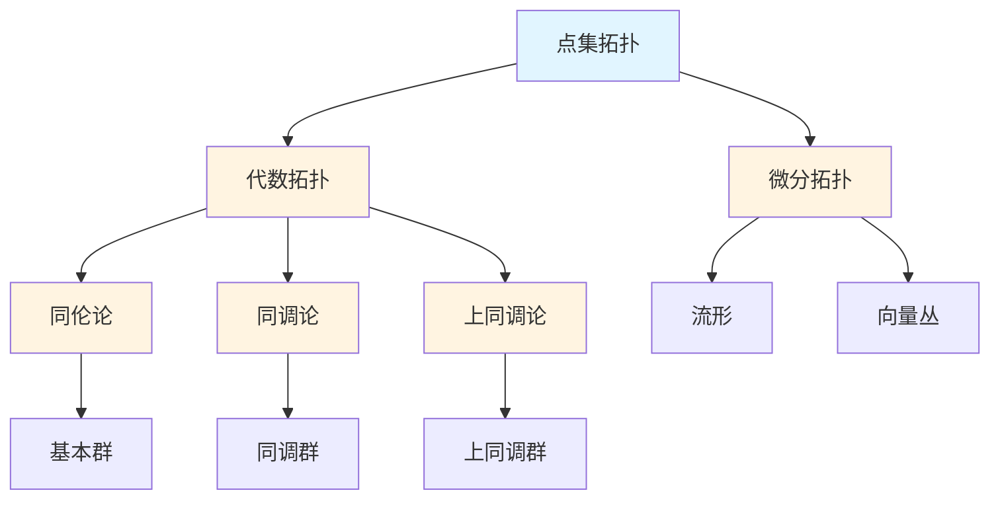

# 拓扑学概念梳理

**主题编号**: C.03.05
**创建日期**: 2025年11月21日
**最后更新**: 2025年11月21日

---

## 📋 目录 / Table of Contents

- [拓扑学概念梳理](#拓扑学概念梳理)
  - [📋 目录 / Table of Contents](#-目录--table-of-contents)
  - [📋 概述 (编号: C.03.05.01)](#-概述-编号-c030501)
  - [🎯 核心概念体系 (编号: C.03.05.02)](#-核心概念体系-编号-c030502)
    - [1. 点集拓扑核心概念 (编号: C.03.05.02.01)](#1-点集拓扑核心概念-编号-c03050201)
      - [拓扑空间](#拓扑空间)
      - [连续映射](#连续映射)
      - [基本性质](#基本性质)
    - [2. 代数拓扑核心概念 (编号: C.03.05.02.02)](#2-代数拓扑核心概念-编号-c03050202)
      - [同伦论](#同伦论)
      - [同调论](#同调论)
      - [上同调论](#上同调论)
    - [3. 微分拓扑核心概念 (编号: C.03.05.02.03)](#3-微分拓扑核心概念-编号-c03050203)
      - [流形](#流形)
      - [向量丛](#向量丛)
      - [特殊理论](#特殊理论)
  - [🔗 概念关联图 (编号: C.03.05.03)](#-概念关联图-编号-c030503)
  - [📊 概念重要性矩阵 (编号: C.03.05.04)](#-概念重要性矩阵-编号-c030504)
  - [🎓 学习路径建议 (编号: C.03.05.05)](#-学习路径建议-编号-c030505)
    - [基础路径](#基础路径)
    - [进阶路径](#进阶路径)
    - [高级路径](#高级路径)

---

## 📋 概述 (编号: C.03.05.01)

本文档系统梳理拓扑学领域的核心概念，包括点集拓扑、代数拓扑、微分拓扑等。

---

## 🎯 核心概念体系 (编号: C.03.05.02)

### 1. 点集拓扑核心概念 (编号: C.03.05.02.01)

#### 拓扑空间

- **拓扑空间 (Topological Space)**: 拓扑空间的定义
- **拓扑 (Topology)**: 开集族
- **开集 (Open Set)**: 拓扑中的开集
- **闭集 (Closed Set)**: 闭集
- **邻域 (Neighborhood)**: 点的邻域
- **内部 (Interior)**: 集合的内部
- **闭包 (Closure)**: 集合的闭包
- **边界 (Boundary)**: 集合的边界

#### 连续映射

- **连续函数 (Continuous Function)**: 连续映射
- **同胚 (Homeomorphism)**: 拓扑同胚
- **嵌入 (Embedding)**: 嵌入映射
- **商映射 (Quotient Map)**: 商映射
- **覆盖映射 (Covering Map)**: 覆盖映射

#### 基本性质

- **紧性 (Compactness)**: 紧空间
- **连通性 (Connectedness)**: 连通空间
- **道路连通 (Path Connected)**: 道路连通
- **分离性 (Separation Axioms)**: T0, T1, T2等分离公理
- **可数性 (Countability)**: 第一、第二可数性
- **可度量化 (Metrizability)**: 可度量化空间

### 2. 代数拓扑核心概念 (编号: C.03.05.02.02)

#### 同伦论

- **同伦 (Homotopy)**: 映射的同伦
- **同伦等价 (Homotopy Equivalence)**: 同伦等价
- **基本群 (Fundamental Group)**: 基本群
- **高阶同伦群 (Higher Homotopy Group)**: 高阶同伦群
- **纤维化 (Fibration)**: 纤维化
- **上纤维化 (Cofibration)**: 上纤维化

#### 同调论

- **奇异同调 (Singular Homology)**: 奇异同调
- **胞腔同调 (Cellular Homology)**: 胞腔同调
- **同调群 (Homology Group)**: 同调群
- **同调长正合列 (Long Exact Sequence)**: 同调长正合列
- **相对同调 (Relative Homology)**: 相对同调
- **约化同调 (Reduced Homology)**: 约化同调

#### 上同调论

- **上同调群 (Cohomology Group)**: 上同调群
- **上同调环 (Cohomology Ring)**: 上同调环
- **上同调运算 (Cohomology Operation)**: 上同调运算
- **上同调长正合列 (Long Exact Sequence)**: 上同调长正合列
- **杯积 (Cup Product)**: 上同调环的乘法

### 3. 微分拓扑核心概念 (编号: C.03.05.02.03)

#### 流形

- **光滑流形 (Smooth Manifold)**: 光滑流形
- **切空间 (Tangent Space)**: 切空间
- **切丛 (Tangent Bundle)**: 切丛
- **余切丛 (Cotangent Bundle)**: 余切丛
- **向量场 (Vector Field)**: 向量场
- **微分形式 (Differential Form)**: 微分形式

#### 向量丛

- **向量丛 (Vector Bundle)**: 向量丛
- **主丛 (Principal Bundle)**: 主丛
- **纤维丛 (Fiber Bundle)**: 纤维丛
- **分类空间 (Classifying Space)**: 分类空间
- **示性类 (Characteristic Class)**: 示性类

#### 特殊理论

- **横截性 (Transversality)**: 横截性
- **浸入 (Immersion)**: 浸入
- **嵌入 (Embedding)**: 嵌入
- **配边理论 (Cobordism Theory)**: 配边理论

---

## 🔗 概念关联图 (编号: C.03.05.03)

---

## 📊 概念重要性矩阵 (编号: C.03.05.04)

| 概念 | 基础性 | 应用性 | 重要性 | 学习优先级 |
|-----|--------|--------|--------|-----------|
| 拓扑空间 | ⭐⭐⭐⭐⭐ | ⭐⭐⭐⭐ | ⭐⭐⭐⭐⭐ | 1 |
| 连续映射 | ⭐⭐⭐⭐⭐ | ⭐⭐⭐⭐ | ⭐⭐⭐⭐⭐ | 1 |
| 紧性 | ⭐⭐⭐⭐ | ⭐⭐⭐ | ⭐⭐⭐⭐ | 2 |
| 连通性 | ⭐⭐⭐⭐ | ⭐⭐⭐ | ⭐⭐⭐⭐ | 2 |
| 同伦 | ⭐⭐⭐ | ⭐⭐⭐ | ⭐⭐⭐⭐ | 3 |
| 基本群 | ⭐⭐⭐ | ⭐⭐⭐ | ⭐⭐⭐⭐ | 3 |
| 同调群 | ⭐⭐⭐ | ⭐⭐⭐ | ⭐⭐⭐⭐ | 3 |
| 上同调群 | ⭐⭐⭐ | ⭐⭐⭐ | ⭐⭐⭐⭐ | 3 |
| 流形 | ⭐⭐⭐ | ⭐⭐⭐⭐ | ⭐⭐⭐⭐ | 3 |
| 向量丛 | ⭐⭐ | ⭐⭐⭐ | ⭐⭐⭐ | 4 |

---

## 🎓 学习路径建议 (编号: C.03.05.05)

### 基础路径

1. **点集拓扑** → **拓扑空间** → **连续映射** → **基本性质**
2. **紧性** → **连通性** → **分离性**

### 进阶路径

1. **代数拓扑** → **同伦论** → **基本群** → **高阶同伦群**
2. **同调论** → **奇异同调** → **胞腔同调** → **同调群**
3. **上同调论** → **上同调群** → **上同调环**

### 高级路径

1. **微分拓扑** → **流形** → **向量丛** → **示性类**
2. **稳定同伦** → **谱序列** → **K理论**
3. **同伦类型论** → **∞-范畴**

---

**创建日期**: 2025年11月21日
**最后更新**: 2025年11月21日
**维护状态**: 持续更新中
