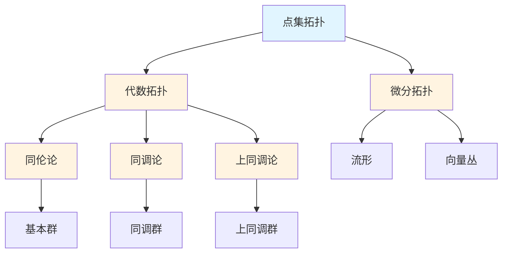

# 拓扑学概念梳理

**主题编号**: C.03.05
**创建日期**: 2025年11月21日
**最后更新**: 2025年11月21日

---

## 📋 目录 / Table of Contents

- [拓扑学概念梳理](#拓扑学概念梳理)
  - [📋 目录 / Table of Contents](#-目录--table-of-contents)
  - [📋 概述 (编号: C.03.05.01)](#-概述-编号-c030501)
  - [🎯 核心概念体系 (编号: C.03.05.02)](#-核心概念体系-编号-c030502)
    - [1. 点集拓扑核心概念 (编号: C.03.05.02.01)](#1-点集拓扑核心概念-编号-c03050201)
      - [拓扑空间](#拓扑空间)
      - [连续映射](#连续映射)
      - [基本性质](#基本性质)
    - [2. 代数拓扑核心概念 (编号: C.03.05.02.02)](#2-代数拓扑核心概念-编号-c03050202)
      - [同伦论](#同伦论)
      - [同调论](#同调论)
      - [上同调论](#上同调论)
    - [3. 微分拓扑核心概念 (编号: C.03.05.02.03)](#3-微分拓扑核心概念-编号-c03050203)
      - [流形](#流形)
      - [向量丛](#向量丛)
      - [特殊理论](#特殊理论)
  - [🔗 概念关联图 (编号: C.03.05.03)](#-概念关联图-编号-c030503)
  - [📊 概念重要性矩阵 (编号: C.03.05.04)](#-概念重要性矩阵-编号-c030504)
  - [🎓 学习路径建议 (编号: C.03.05.05)](#-学习路径建议-编号-c030505)
    - [基础路径](#基础路径)
    - [进阶路径](#进阶路径)
    - [高级路径](#高级路径)

---

## 📋 概述 (编号: C.03.05.01)

本文档系统梳理拓扑学领域的核心概念，包括点集拓扑、代数拓扑、微分拓扑等。

**哲学背景**: 拓扑学的发展体现了直觉主义和结构主义的影响。布劳威尔（直觉主义创始人）也是拓扑学的重要贡献者，他的直觉主义思想影响了拓扑学的发展。代数拓扑的发展体现了结构主义的思想，用代数方法研究拓扑性质。详见[数学哲学维度矩阵](../02-知识矩阵/09-数学哲学维度矩阵.md)。

**权威资源对齐**: 本文档的概念定义和结构参考了Wikipedia拓扑学条目、MIT 18.901拓扑学课程、Princeton的代数拓扑课程，以及Metamath的拓扑定理。详见[权威资源对齐说明](../00-权威资源对齐说明.md)和[权威资源对标改进计划](../00-权威资源对标改进计划.md)。

---

## 🎯 核心概念体系 (编号: C.03.05.02)

### 1. 点集拓扑核心概念 (编号: C.03.05.02.01)

#### 拓扑空间

- **拓扑空间 (Topological Space)**: 拓扑空间的定义
  - **严格定义**: 集合 $X$ 配备拓扑 $\tau \subseteq \mathcal{P}(X)$，满足：
    - $\emptyset, X \in \tau$
    - 任意并：$\bigcup_{i \in I} U_i \in \tau$（$U_i \in \tau$）
    - 有限交：$\bigcap_{i=1}^n U_i \in \tau$（$U_i \in \tau$）
  - **历史背景**: 拓扑空间概念由Hausdorff（1914）和Kuratowski（1922）建立，统一了连续性的概念
  - **性质**: 开集族定义了空间的"接近"概念，比度量更一般
  - **例子**: 度量空间（度量诱导拓扑）、离散拓扑、平凡拓扑、Zariski拓扑
  - **应用**: 连续性的基础、流形定义、泛函分析、代数几何
  - **参考文献**:
    - Wikipedia: [Topological Space](https://en.wikipedia.org/wiki/Topological_space)
    - Munkres, J. R. (2000). *Topology*. Prentice Hall.
    - Kelley, J. L. (1955). *General Topology*. Van Nostrand.
- **拓扑 (Topology)**: 开集族
  - **定义**: 拓扑 $\tau$ 是满足上述公理的开集族
  - **性质**: 不同的拓扑定义不同的拓扑空间
- **开集 (Open Set)**: 拓扑中的开集
  - **定义**: $U \in \tau$ 是开集
  - **性质**: 开集的任意并和有限交仍是开集
- **闭集 (Closed Set)**: 闭集
  - **定义**: $F$ 是闭集当且仅当 $X \setminus F$ 是开集
  - **性质**: 闭集的任意交和有限并仍是闭集
- **邻域 (Neighborhood)**: 点的邻域
  - **定义**: $N$ 是 $x$ 的邻域当且仅当存在开集 $U$ 使得 $x \in U \subseteq N$
  - **应用**: 定义连续性、极限
- **内部 (Interior)**: 集合的内部
  - **定义**: $\text{int}(A) = \bigcup\{U : U \text{ 开集}, U \subseteq A\}$ 是 $A$ 的最大开子集
  - **性质**: $A$ 是开集当且仅当 $A = \text{int}(A)$
- **闭包 (Closure)**: 集合的闭包
  - **定义**: $\overline{A} = \bigcap\{F : F \text{ 闭集}, A \subseteq F\}$ 是 $A$ 的最小闭超集
  - **性质**: $A$ 是闭集当且仅当 $A = \overline{A}$，$\overline{A} = A \cup A'$（$A'$ 是 $A$ 的导集）
- **边界 (Boundary)**: 集合的边界
  - **定义**: $\partial A = \overline{A} \setminus \text{int}(A) = \overline{A} \cap \overline{X \setminus A}$
  - **性质**: $\partial A$ 是闭集，$\overline{A} = \text{int}(A) \cup \partial A$

#### 连续映射

- **连续函数 (Continuous Function)**: 连续映射
  - **严格定义**: $f: X \to Y$ 连续当且仅当 $\forall U \subseteq Y$ 开集，$f^{-1}(U)$ 是 $X$ 的开集
  - **等价条件**:
    - $\forall F \subseteq Y$ 闭集，$f^{-1}(F)$ 是 $X$ 的闭集
    - $\forall x \in X$，$f$ 在 $x$ 处连续（邻域定义）
  - **历史背景**: 拓扑学中的连续性定义由Hausdorff（1914）建立，推广了分析学中的连续性
  - **性质**: 连续映射的复合仍连续，连续映射保持紧性和连通性
  - **应用**: 拓扑不变量、分类问题
  - **参考文献**:
    - Wikipedia: [Continuous Function](https://en.wikipedia.org/wiki/Continuous_function)
    - Munkres, J. R. (2000). *Topology*. Prentice Hall.
- **同胚 (Homeomorphism)**: 拓扑同胚
  - **定义**: 双射连续映射，其逆也连续
  - **记法**: $X \cong Y$ 表示 $X$ 与 $Y$ 同胚
  - **性质**: 同胚保持所有拓扑性质（紧性、连通性、分离性等）
  - **应用**: 拓扑空间的分类
- **嵌入 (Embedding)**: 嵌入映射
  - **定义**: 单射连续映射，使得 $f: X \to f(X)$ 是同胚（$f(X)$ 配备子空间拓扑）
  - **应用**: 将空间嵌入到更简单的空间中
- **商映射 (Quotient Map)**: 商映射
  - **定义**: 满射连续映射 $q: X \to Y$，使得 $U \subseteq Y$ 开当且仅当 $q^{-1}(U)$ 开
  - **应用**: 构造商空间、识别等价关系
- **覆盖映射 (Covering Map)**: 覆盖映射
  - **定义**: 局部同胚的满射连续映射
  - **性质**: 覆盖映射是纤维丛的特殊情况
  - **应用**: 基本群的计算、Riemann曲面

#### 基本性质

- **紧性 (Compactness)**: 紧空间
  - **定义**: 空间 $X$ 紧当且仅当每个开覆盖有有限子覆盖
  - **历史背景**: 紧性概念由Alexandrov和Urysohn（1924）引入，是分析学中有限性的推广
  - **等价条件**:
    - 在度量空间中，紧等价于有界闭集（Heine-Borel定理）
    - 每个无限子集有聚点（Bolzano-Weierstrass性质）
    - 每个网有收敛子网
  - **性质**:
    - 紧空间的连续像是紧的
    - 紧空间上的连续函数有最大值和最小值
    - 紧空间的闭子集是紧的
  - **应用**: 极值定理、存在性证明、泛函分析（弱紧性）
  - **参考文献**:
    - Wikipedia: [Compact Space](https://en.wikipedia.org/wiki/Compact_space)
    - Munkres, J. R. (2000). *Topology*. Prentice Hall.
- **连通性 (Connectedness)**: 连通空间
  - **定义**: 空间 $X$ 连通当且仅当不能写成两个非空不相交开集的并
  - **等价**: $X$ 连通当且仅当 $X$ 和 $\emptyset$ 是仅有的既开又闭的集合
  - **历史背景**: 连通性概念由Jordan（1893）在研究曲线时引入
  - **性质**:
    - 连通空间的连续像是连通的
    - 介值定理：连通空间上的连续函数取到所有中间值
    - 连通分支是最大连通子集
  - **应用**: 证明存在性、分类问题、复分析
  - **参考文献**:
    - Wikipedia: [Connected Space](https://en.wikipedia.org/wiki/Connected_space)
    - Munkres, J. R. (2000). *Topology*. Prentice Hall.
- **道路连通 (Path Connected)**: 道路连通
  - **定义**: 空间 $X$ 道路连通当且仅当任意两点间存在连续路径
  - **关系**: 道路连通 $\Rightarrow$ 连通（反之不成立，如拓扑学家的正弦曲线）
  - **性质**: 道路连通空间的连续像是道路连通的
- **分离性 (Separation Axioms)**: T0, T1, T2等分离公理
  - **T0**: 任意两点，存在开集只包含其中一个
  - **T1**: 任意两点，各自有开邻域不包含另一点
  - **T2 (Hausdorff)**: 任意两点有不相交的开邻域
  - **T3 (正则)**: T1 + 点与闭集有不相交邻域
  - **T4 (正规)**: T1 + 两个不相交闭集有不相交邻域
  - **应用**: 唯一性定理、Urysohn引理
- **可数性 (Countability)**: 第一、第二可数性
- **可度量化 (Metrizability)**: 可度量化空间

### 2. 代数拓扑核心概念 (编号: C.03.05.02.02)

#### 同伦论

- **同伦 (Homotopy)**: 映射的同伦
  - **定义**: 映射 $f, g: X \to Y$ 同伦当且仅当存在连续映射 $H: X \times [0,1] \to Y$ 使得 $H(x,0) = f(x)$，$H(x,1) = g(x)$
  - **记法**: $f \simeq g$ 表示 $f$ 与 $g$ 同伦
  - **历史背景**: 同伦概念由Poincaré（1895）引入，是代数拓扑的基础
  - **性质**:
    - 同伦是等价关系
    - 同伦保持连续映射的复合
  - **应用**: 分类拓扑空间、定义同伦群、简化计算
  - **参考文献**:
    - Wikipedia: [Homotopy](https://en.wikipedia.org/wiki/Homotopy)
    - Hatcher, A. (2002). *Algebraic Topology*. Cambridge University Press.
    - May, J. P. (1999). *A Concise Course in Algebraic Topology*. University of Chicago Press.
- **同伦等价 (Homotopy Equivalence)**: 同伦等价
  - **定义**: 空间 $X$ 与 $Y$ 同伦等价当且仅当存在映射 $f: X \to Y$ 和 $g: Y \to X$ 使得 $g \circ f \simeq \text{id}_X$，$f \circ g \simeq \text{id}_Y$
  - **性质**: 同伦等价的空间有相同的同伦群
  - **应用**: 简化空间分类
- **基本群 (Fundamental Group)**: 基本群
  - **定义**: $\pi_1(X,x_0) = \{[f] : f \text{ 是 } x_0 \text{ 处的回路}\}$，运算为路径复合
  - **历史背景**: 由Poincaré（1895）引入，是第一个同伦不变量
  - **性质**:
    - 群结构（路径复合）
    - 同伦不变量：同伦等价的空间有同构的基本群
    - 若 $X$ 道路连通，则基本群与基点选择无关（在同构意义下）
  - **计算**: 
    - $\pi_1(S^1) \cong \mathbb{Z}$（圆周）
    - $\pi_1(S^n) = 0$（$n \geq 2$，球面）
    - 使用Van Kampen定理、覆盖空间
  - **应用**: 分类曲面、证明Brouwer不动点定理、Knot理论
  - **参考文献**:
    - Wikipedia: [Fundamental Group](https://en.wikipedia.org/wiki/Fundamental_group)
    - Hatcher, A. (2002). *Algebraic Topology*. Cambridge University Press.
- **高阶同伦群 (Higher Homotopy Group)**: 高阶同伦群
  - **定义**: $\pi_n(X,x_0) = \{[f] : f: S^n \to X, f(*) = x_0\}$，$n \geq 2$
  - **性质**: 阿贝尔群（$n \geq 2$），同伦不变量
  - **应用**: 分类高维流形、稳定同伦理论
- **纤维化 (Fibration)**: 纤维化
- **上纤维化 (Cofibration)**: 上纤维化

#### 同调论

- **奇异同调 (Singular Homology)**: 奇异同调
  - **定义**: $H_n(X) = \ker(\partial_n) / \text{im}(\partial_{n+1})$，其中 $\partial_n$ 是边界算子
  - **历史背景**: 由Eilenberg和Steenrod（1945）建立公理化同调理论
  - **性质**:
    - 同伦不变量
    - 满足切除公理、长正合列公理
    - $H_0(X)$ 是连通分支数
  - **应用**: 分类流形、计算拓扑不变量
  - **参考文献**:
    - Wikipedia: [Singular Homology](https://en.wikipedia.org/wiki/Singular_homology)
    - Hatcher, A. (2002). *Algebraic Topology*. Cambridge University Press.
    - Eilenberg, S., & Steenrod, N. (1952). *Foundations of Algebraic Topology*. Princeton University Press.
- **胞腔同调 (Cellular Homology)**: 胞腔同调
  - **定义**: 通过CW复形的胞腔结构计算同调
  - **优势**: 比奇异同调更容易计算
  - **应用**: 计算具体空间的同调群
- **同调群 (Homology Group)**: 同调群
  - **定义**: $H_n(X)$ 是 $n$ 维同调群，度量 $n$ 维"洞"的数量
  - **几何意义**:
    - $H_0$：连通分支
    - $H_1$：1维洞（如环面的洞）
    - $H_2$：2维洞（如球面的内部）
  - **性质**: 阿贝尔群，同伦不变量
- **同调长正合列 (Long Exact Sequence)**: 同调长正合列
  - **定理**: 对偶 $(X,A)$，存在长正合列 $\cdots \to H_n(A) \to H_n(X) \to H_n(X,A) \to H_{n-1}(A) \to \cdots$
  - **应用**: 计算相对同调、Mayer-Vietoris序列
- **相对同调 (Relative Homology)**: 相对同调
  - **定义**: $H_n(X,A) = H_n(X/A)$（$A$ 是子空间）
  - **应用**: 计算对偶空间的同调
- **约化同调 (Reduced Homology)**: 约化同调
  - **定义**: $\tilde{H}_n(X) = H_n(X)$（$n > 0$），$\tilde{H}_0(X) = H_0(X) / \mathbb{Z}$
  - **优势**: 简化计算，$\tilde{H}_n(\text{point}) = 0$ 对所有 $n$

#### 上同调论

- **上同调群 (Cohomology Group)**: 上同调群
  - **定义**: $H^n(X) = \text{Hom}(H_n(X), \mathbb{Z})$ 或通过上链复形定义
  - **历史背景**: 由Alexander（1935）和Kolmogorov（1936）独立引入
  - **优势**: 上同调有环结构（杯积），更丰富的代数结构
  - **性质**:
    - 同伦不变量
    - 有环结构（杯积）
    - 与同调对偶（在适当条件下）
  - **应用**: 分类流形、特征类、K理论
  - **参考文献**:
    - Wikipedia: [Cohomology](https://en.wikipedia.org/wiki/Cohomology)
    - Hatcher, A. (2002). *Algebraic Topology*. Cambridge University Press.
- **上同调环 (Cohomology Ring)**: 上同调环
  - **定义**: $H^*(X) = \bigoplus_{n \geq 0} H^n(X)$ 配备杯积
  - **性质**: 分次交换环（在适当系数下）
  - **应用**: 区分同伦等价但不同胚的空间
- **上同调运算 (Cohomology Operation)**: 上同调运算
  - **定义**: 上同调群之间的自然变换
  - **例子**: Steenrod平方、Bockstein同态
  - **应用**: 稳定同伦理论
- **上同调长正合列 (Long Exact Sequence)**: 上同调长正合列
  - **定理**: 对偶 $(X,A)$，存在长正合列 $\cdots \to H^n(X,A) \to H^n(X) \to H^n(A) \to H^{n+1}(X,A) \to \cdots$
  - **应用**: 计算上同调、Mayer-Vietoris序列
- **杯积 (Cup Product)**: 上同调环的乘法
  - **定义**: $\smile: H^p(X) \times H^q(X) \to H^{p+q}(X)$
  - **性质**:
    - 双线性、结合律
    - 分次交换：$\alpha \smile \beta = (-1)^{pq} \beta \smile \alpha$
  - **应用**: 计算上同调环、分类空间

### 3. 微分拓扑核心概念 (编号: C.03.05.02.03)

#### 流形

- **光滑流形 (Smooth Manifold)**: 光滑流形
  - **定义**: 微分流形，坐标变换 $C^\infty$ 可微
  - **历史背景**: 流形概念由Riemann（1854）引入，Whitney（1936）建立嵌入定理
  - **性质**: 可以定义光滑函数、向量场、微分形式
  - **应用**: 微分几何、物理（广义相对论、规范理论）
  - **参考文献**:
    - Wikipedia: [Manifold](https://en.wikipedia.org/wiki/Manifold)
    - Lee, J. M. (2012). *Introduction to Smooth Manifolds*. Springer.
- **切空间 (Tangent Space)**: 切空间
  - **定义**: $T_p M$ 是在点 $p$ 的切向量空间
  - **构造**: 切向量是等价类 $[\gamma]$，其中 $\gamma$ 是过 $p$ 的曲线
  - **应用**: 定义导数、向量场
- **切丛 (Tangent Bundle)**: 切丛
  - **定义**: $TM = \bigcup_{p \in M} T_p M$，配备自然流形结构
  - **性质**: 若 $M$ 是 $n$ 维流形，则 $TM$ 是 $2n$ 维流形
  - **应用**: 向量场、联络、测地线
- **余切丛 (Cotangent Bundle)**: 余切丛
  - **定义**: $T^*M = \bigcup_{p \in M} T_p^* M$，其中 $T_p^* M$ 是 $T_p M$ 的对偶空间
  - **应用**: 微分形式、辛几何
- **向量场 (Vector Field)**: 向量场
  - **定义**: 光滑映射 $X: M \to TM$，使得 $\pi \circ X = \text{id}_M$（$\pi$ 是投影）
  - **应用**: 微分方程、Lie群、动力系统
- **微分形式 (Differential Form)**: 微分形式
  - **定义**: $k$ 形式是 $k$ 次反对称多重线性映射
  - **应用**: 积分、Stokes定理、de Rham上同调

#### 向量丛

- **向量丛 (Vector Bundle)**: 向量丛
  - **定义**: 局部同构于 $U \times \mathbb{R}^n$ 的纤维丛，其中 $U$ 是开集
  - **历史背景**: 由Whitney（1935）引入，是拓扑学和微分几何的重要工具
  - **例子**: 切丛、余切丛、法丛
  - **应用**: K理论、示性类、规范理论
  - **参考文献**:
    - Wikipedia: [Vector Bundle](https://en.wikipedia.org/wiki/Vector_bundle)
    - Milnor, J., & Stasheff, J. (1974). *Characteristic Classes*. Princeton University Press.
- **主丛 (Principal Bundle)**: 主丛
  - **定义**: 以Lie群 $G$ 为纤维的纤维丛，配备 $G$ 作用
  - **应用**: 规范理论、联络理论
- **纤维丛 (Fiber Bundle)**: 纤维丛
  - **定义**: 局部同构于 $U \times F$ 的连续满射 $\pi: E \to B$，其中 $F$ 是纤维
  - **性质**: 纤维丛是向量丛的推广
  - **应用**: 覆盖空间、向量丛、主丛
- **分类空间 (Classifying Space)**: 分类空间
  - **定义**: $BG$ 是群 $G$ 的分类空间，使得 $G$-主丛对应 $BG$ 的映射
  - **性质**: $[X, BG]$ 分类 $X$ 上的 $G$-主丛
  - **应用**: K理论、示性类
- **示性类 (Characteristic Class)**: 示性类
  - **定义**: 向量丛的上同调类，是拓扑不变量
  - **例子**: Stiefel-Whitney类、Chern类、Pontryagin类
  - **应用**: 分类向量丛、区分流形
  - **参考文献**:
    - Wikipedia: [Characteristic Class](https://en.wikipedia.org/wiki/Characteristic_class)
    - Milnor, J., & Stasheff, J. (1974). *Characteristic Classes*. Princeton University Press.

#### 特殊理论

- **横截性 (Transversality)**: 横截性
- **浸入 (Immersion)**: 浸入
- **嵌入 (Embedding)**: 嵌入
- **配边理论 (Cobordism Theory)**: 配边理论

---

## 🔗 概念关联图 (编号: C.03.05.03)

---

## 📊 概念重要性矩阵 (编号: C.03.05.04)

| 概念 | 基础性 | 应用性 | 重要性 | 学习优先级 |
|-----|--------|--------|--------|-----------|
| 拓扑空间 | ⭐⭐⭐⭐⭐ | ⭐⭐⭐⭐ | ⭐⭐⭐⭐⭐ | 1 |
| 连续映射 | ⭐⭐⭐⭐⭐ | ⭐⭐⭐⭐ | ⭐⭐⭐⭐⭐ | 1 |
| 紧性 | ⭐⭐⭐⭐ | ⭐⭐⭐ | ⭐⭐⭐⭐ | 2 |
| 连通性 | ⭐⭐⭐⭐ | ⭐⭐⭐ | ⭐⭐⭐⭐ | 2 |
| 同伦 | ⭐⭐⭐ | ⭐⭐⭐ | ⭐⭐⭐⭐ | 3 |
| 基本群 | ⭐⭐⭐ | ⭐⭐⭐ | ⭐⭐⭐⭐ | 3 |
| 同调群 | ⭐⭐⭐ | ⭐⭐⭐ | ⭐⭐⭐⭐ | 3 |
| 上同调群 | ⭐⭐⭐ | ⭐⭐⭐ | ⭐⭐⭐⭐ | 3 |
| 流形 | ⭐⭐⭐ | ⭐⭐⭐⭐ | ⭐⭐⭐⭐ | 3 |
| 向量丛 | ⭐⭐ | ⭐⭐⭐ | ⭐⭐⭐ | 4 |

---

## 🎓 学习路径建议 (编号: C.03.05.05)

### 基础路径

1. **点集拓扑** → **拓扑空间** → **连续映射** → **基本性质**
2. **紧性** → **连通性** → **分离性**

### 进阶路径

1. **代数拓扑** → **同伦论** → **基本群** → **高阶同伦群**
2. **同调论** → **奇异同调** → **胞腔同调** → **同调群**
3. **上同调论** → **上同调群** → **上同调环**

### 高级路径

1. **微分拓扑** → **流形** → **向量丛** → **示性类**
2. **稳定同伦** → **谱序列** → **K理论**
3. **同伦类型论** → **∞-范畴**

---

**创建日期**: 2025年11月21日
**最后更新**: 2025年11月21日
**维护状态**: 持续更新中
