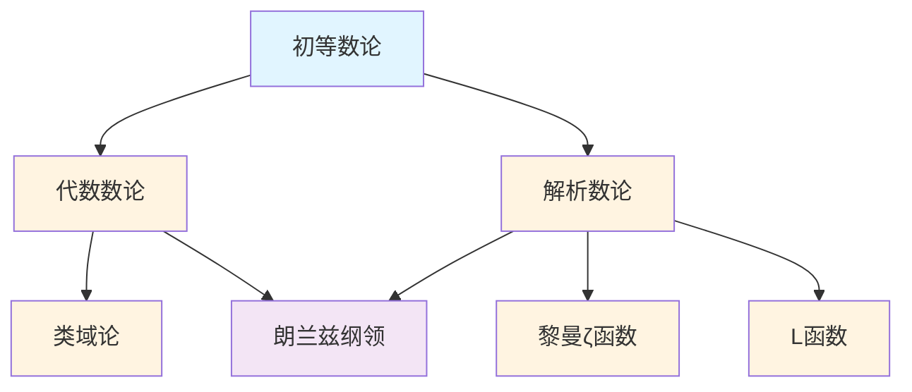

# 数论概念梳理

**主题编号**: C.03.06
**创建日期**: 2025年11月21日
**最后更新**: 2025年11月21日

---

## 📋 目录 / Table of Contents

- [数论概念梳理](#数论概念梳理)
  - [📋 目录 / Table of Contents](#-目录--table-of-contents)
  - [📋 概述 (编号: C.03.06.01)](#-概述-编号-c030601)
  - [🎯 核心概念体系 (编号: C.03.06.02)](#-核心概念体系-编号-c030602)
    - [1. 初等数论核心概念 (编号: C.03.06.02.01)](#1-初等数论核心概念-编号-c03060201)
      - [整除理论](#整除理论)
      - [同余理论](#同余理论)
      - [素数理论](#素数理论)
    - [2. 代数数论核心概念 (编号: C.03.06.02.02)](#2-代数数论核心概念-编号-c03060202)
      - [代数整数](#代数整数)
      - [类域论](#类域论)
      - [代数数域](#代数数域)
    - [3. 解析数论核心概念 (编号: C.03.06.02.03)](#3-解析数论核心概念-编号-c03060203)
      - [黎曼ζ函数](#黎曼ζ函数)
      - [L函数](#l函数)
      - [素数分布](#素数分布)
  - [🔗 概念关联图 (编号: C.03.06.03)](#-概念关联图-编号-c030603)
  - [📊 概念重要性矩阵 (编号: C.03.06.04)](#-概念重要性矩阵-编号-c030604)
  - [🎓 学习路径建议 (编号: C.03.06.05)](#-学习路径建议-编号-c030605)
    - [基础路径](#基础路径)
    - [进阶路径](#进阶路径)
    - [高级路径](#高级路径)

---

## 📋 概述 (编号: C.03.06.01)

本文档系统梳理数论领域的核心概念，包括初等数论、代数数论、解析数论等。

**哲学背景**: 数论的发展体现了逻辑主义和结构主义的影响。代数数论的发展体现了结构主义的思想，用代数结构研究数论问题。解析数论的发展体现了形式主义的方法。朗兰兹纲领体现了结构主义和逻辑主义的结合，试图统一数论、表示论和几何。详见[数学哲学维度矩阵](../02-知识矩阵/09-数学哲学维度矩阵.md)。

**权威资源对齐**: 本文档的概念定义和结构参考了Wikipedia数论条目、Princeton的代数数论和解析数论课程、Harvard的数论课程，以及Metamath的数论定理。详见[权威资源对齐说明](../00-权威资源对齐说明.md)和[权威资源对标改进计划](../00-权威资源对标改进计划.md)。

---

## 🎯 核心概念体系 (编号: C.03.06.02)

### 1. 初等数论核心概念 (编号: C.03.06.02.01)

#### 整除理论

- **整除 (Divisibility)**: 整除关系
  - **定义**: $a \mid b$ 当且仅当存在整数 $c$ 使得 $b = ac$
  - **性质**: 传递性、线性组合保持整除性
  - **应用**: 数论的基础概念
- **最大公约数 (Greatest Common Divisor, GCD)**: 最大公约数
  - **定义**: $\gcd(a,b) = \max\{d \in \mathbb{Z}^+ : d \mid a \text{ 且 } d \mid b\}$
  - **历史背景**: 欧几里得算法由欧几里得（约公元前300年）在《几何原本》中给出，是已知最古老的算法之一
  - **性质**:
    - $\gcd(a,b) = \gcd(b, a \bmod b)$（欧几里得算法基础）
    - $\gcd(a,b) = \gcd(b,a)$（交换律）
    - $\gcd(a,0) = |a|$
  - **应用**: 约分、同余方程求解、密码学
  - **参考文献**:
    - Wikipedia: [Greatest Common Divisor](https://en.wikipedia.org/wiki/Greatest_common_divisor)
    - Hardy, G. H., & Wright, E. M. (2008). *An Introduction to the Theory of Numbers*. Oxford University Press.
- **最小公倍数 (Least Common Multiple, LCM)**: 最小公倍数
  - **定义**: $\text{lcm}(a,b) = \min\{m \in \mathbb{Z}^+ : a \mid m \text{ 且 } b \mid m\}$
  - **关系**: $\gcd(a,b) \cdot \text{lcm}(a,b) = ab$
  - **证明思路**: 使用素因子分解，$\gcd$ 取最小指数，$\text{lcm}$ 取最大指数
- **欧几里得算法 (Euclidean Algorithm)**: 求最大公约数的算法
  - **算法**: $\gcd(a,b) = \gcd(b, a \bmod b)$，重复直到 $b = 0$
  - **历史背景**: 由欧几里得（约公元前300年）在《几何原本》第7卷中给出，是已知最古老的算法
  - **时间复杂度**: $O(\log \min(a,b))$（Lamé定理）
  - **正确性**: 基于 $\gcd(a,b) = \gcd(b, a-b)$ 和 $\gcd(a,b) = \gcd(b, a \bmod b)$
  - **应用**: 计算最大公约数、RSA算法、连分数
  - **参考文献**:
    - Wikipedia: [Euclidean Algorithm](https://en.wikipedia.org/wiki/Euclidean_algorithm)
    - Knuth, D. E. (1997). *The Art of Computer Programming, Volume 2*. Addison-Wesley.
- **扩展欧几里得算法 (Extended Euclidean Algorithm)**: 扩展算法
  - **功能**: 计算 $\gcd(a,b)$ 的同时，找到 $x,y$ 使得 $ax + by = \gcd(a,b)$
  - **应用**: 求解线性同余方程、计算模逆元
  - **算法**: 在欧几里得算法过程中维护 $x,y$ 的递推关系
- **贝祖等式 (Bézout's Identity)**: 贝祖等式
  - **定理**: 对任意整数 $a,b$，存在整数 $x,y$ 使得 $ax + by = \gcd(a,b)$
  - **证明思路**: 使用扩展欧几里得算法构造 $x,y$
  - **应用**: 证明 $a,b$ 互素当且仅当存在 $x,y$ 使得 $ax + by = 1$

#### 同余理论

- **同余 (Congruence)**: 同余关系
  - **定义**: $a \equiv b \pmod{m}$ 当且仅当 $m \mid (a-b)$
  - **历史背景**: 同余记号由Gauss（1801）在《算术研究》中引入，是现代数论的基础
  - **性质**:
    - 等价关系（自反、对称、传递）
    - 保持加法、减法、乘法
    - 若 $\gcd(c,m) = 1$，则保持除法（可约性）
  - **应用**: 模运算、密码学、编码理论、计算机科学
  - **参考文献**:
    - Wikipedia: [Modular Arithmetic](https://en.wikipedia.org/wiki/Modular_arithmetic)
    - Gauss, C. F. (1801). *Disquisitiones Arithmeticae*. (经典著作)
    - Hardy, G. H., & Wright, E. M. (2008). *An Introduction to the Theory of Numbers*. Oxford University Press.
- **剩余类 (Residue Class)**: 同余类
  - **定义**: $[a]_m = \{b \in \mathbb{Z} : b \equiv a \pmod{m}\}$
  - **性质**: 模 $m$ 的剩余类构成 $\mathbb{Z}/m\mathbb{Z}$（模 $m$ 的整数环）
  - **应用**: 构造有限域、群论
- **完全剩余系 (Complete Residue System)**: 完全剩余系
  - **定义**: 模 $m$ 的完全剩余系是 $m$ 个两两不同余的整数集合
  - **例子**: $\{0, 1, 2, \ldots, m-1\}$ 是模 $m$ 的完全剩余系
  - **性质**: 任意完全剩余系的大小为 $m$
- **简化剩余系 (Reduced Residue System)**: 简化剩余系
  - **定义**: 模 $m$ 的简化剩余系是与 $m$ 互素的完全剩余系
  - **大小**: $\phi(m)$（欧拉函数）
  - **应用**: 欧拉定理的证明
- **中国剩余定理 (Chinese Remainder Theorem)**: 中国剩余定理
  - **定理**: 若 $m_1, \ldots, m_k$ 两两互素，则同余方程组 $x \equiv a_i \pmod{m_i}$ 有唯一解模 $m_1 \cdots m_k$
  - **历史背景**: 出现在《孙子算经》（约公元3-5世纪），由Gauss（1801）给出现代形式
  - **证明思路**: 构造解 $x = \sum a_i M_i M_i^{-1}$，其中 $M_i = \prod_{j \neq i} m_j$，$M_i^{-1}$ 是 $M_i$ 模 $m_i$ 的逆元
  - **应用**: 大数运算、密码学（RSA）、编码理论、并行计算
  - **参考文献**:
    - Wikipedia: [Chinese Remainder Theorem](https://en.wikipedia.org/wiki/Chinese_remainder_theorem)
    - Gauss, C. F. (1801). *Disquisitiones Arithmeticae*. (经典著作)
- **费马小定理 (Fermat's Little Theorem)**: 费马小定理
  - **定理**: 若 $p$ 是素数，$\gcd(a,p) = 1$，则 $a^{p-1} \equiv 1 \pmod{p}$
  - **历史背景**: 由Fermat（1640）提出，Euler（1736）给出第一个证明
  - **证明思路**:
    - 方法1：考虑集合 $\{a, 2a, \ldots, (p-1)a\}$，证明它是模 $p$ 的简化剩余系的排列
    - 方法2：使用群论（$\mathbb{Z}_p^*$ 的阶是 $p-1$）
  - **应用**: 素性测试（Fermat测试）、计算模逆元、RSA加密
  - **参考文献**:
    - Wikipedia: [Fermat's Little Theorem](https://en.wikipedia.org/wiki/Fermat%27s_little_theorem)
    - Hardy, G. H., & Wright, E. M. (2008). *An Introduction to the Theory of Numbers*. Oxford University Press.
- **欧拉定理 (Euler's Theorem)**: 欧拉定理
  - **定理**: 若 $\gcd(a,m) = 1$，则 $a^{\phi(m)} \equiv 1 \pmod{m}$
  - **历史背景**: 由Euler（1763）证明，是费马小定理的推广
  - **证明思路**: 类似费马小定理，考虑与 $m$ 互素的数的集合，使用群论（$\mathbb{Z}_m^*$ 的阶是 $\phi(m)$）
  - **应用**: RSA加密、计算大数幂模、密码学
  - **参考文献**:
    - Wikipedia: [Euler's Theorem](https://en.wikipedia.org/wiki/Euler%27s_theorem)
    - Hardy, G. H., & Wright, E. M. (2008). *An Introduction to the Theory of Numbers*. Oxford University Press.
- **欧拉函数 (Euler's Totient Function)**: 欧拉函数
  - **定义**: $\phi(n) = |\{k : 1 \leq k \leq n, \gcd(k,n) = 1\}|$（与 $n$ 互素的正整数个数）
  - **性质**: 若 $n = p_1^{e_1} \cdots p_k^{e_k}$，则 $\phi(n) = n \prod_{i=1}^k (1 - 1/p_i)$
  - **应用**: 欧拉定理、RSA加密

#### 素数理论

- **素数 (Prime Number)**: 素数的定义
  - **定义**: 大于1的整数 $p$ 是素数当且仅当 $p$ 的正因子只有1和 $p$
  - **历史背景**: 素数研究可以追溯到古希腊，欧几里得（约公元前300年）证明了素数无穷多
  - **性质**:
    - 无穷多个素数（欧几里得证明）
    - 算术基本定理（唯一分解）：每个大于1的整数可以唯一表示为素数的乘积
    - 素数定理：$\pi(x) \sim x/\ln x$
  - **应用**: 密码学（RSA）、编码理论、数论
  - **参考文献**:
    - Wikipedia: [Prime Number](https://en.wikipedia.org/wiki/Prime_number)
    - Hardy, G. H., & Wright, E. M. (2008). *An Introduction to the Theory of Numbers*. Oxford University Press.
    - Ribenboim, P. (2004). *The Little Book of Bigger Primes*. Springer.
- **合数 (Composite Number)**: 合数
  - **定义**: 大于1的非素数整数
  - **性质**: 有非平凡因子
- **素数分布 (Prime Distribution)**: 素数的分布
  - **问题**: 素数在整数中的分布规律
  - **结果**: 素数定理描述渐近分布；黎曼假设与误差项相关
  - **应用**: 密码学中的素性测试
- **素数定理 (Prime Number Theorem)**: 素数定理
  - **定理**: $\pi(x) \sim \frac{x}{\ln x}$，其中 $\pi(x)$ 是不超过 $x$ 的素数个数
  - **等价形式**: $p_n \sim n \ln n$，其中 $p_n$ 是第 $n$ 个素数
  - **历史背景**: 由Legendre（1798）和Gauss（约1792）猜想，Hadamard和de la Vallée Poussin（1896）独立证明
  - **证明思路**: 使用复分析，特别是黎曼ζ函数的性质，证明 $\zeta(1+it) \neq 0$
  - **应用**: 估计素数密度、密码学、算法分析
  - **参考文献**:
    - Wikipedia: [Prime Number Theorem](https://en.wikipedia.org/wiki/Prime_number_theorem)
    - Davenport, H. (2000). *Multiplicative Number Theory*. Springer.
    - Ingham, A. E. (1990). *The Distribution of Prime Numbers*. Cambridge University Press.
- **黎曼ζ函数 (Riemann Zeta Function)**: 黎曼ζ函数
  - **定义**: $\zeta(s) = \sum_{n=1}^\infty \frac{1}{n^s} = \prod_{p} \frac{1}{1-p^{-s}}$（$\text{Re}(s) > 1$，Euler乘积）
  - **历史背景**: 由Euler（1737）引入，Riemann（1859）研究其解析性质，提出黎曼假设
  - **解析延拓**: 可延拓到整个复平面（除 $s=1$ 外，$s=1$ 是单极点）
  - **函数方程**: $\zeta(s) = 2^s \pi^{s-1} \sin(\pi s/2) \Gamma(1-s) \zeta(1-s)$
  - **性质**:
    - Euler乘积：$\zeta(s) = \prod_p (1-p^{-s})^{-1}$
    - 平凡零点：$s = -2, -4, -6, \ldots$
    - 非平凡零点在临界带 $0 < \text{Re}(s) < 1$
  - **应用**: 素数分布、L函数理论、朗兰兹纲领
  - **参考文献**:
    - Wikipedia: [Riemann Zeta Function](https://en.wikipedia.org/wiki/Riemann_zeta_function)
    - Titchmarsh, E. C. (1986). *The Theory of the Riemann Zeta-Function*. Oxford University Press.
    - Edwards, H. M. (2001). *Riemann's Zeta Function*. Dover Publications.
- **黎曼假设 (Riemann Hypothesis)**: 黎曼假设
  - **表述**: $\zeta(s)$ 的所有非平凡零点都在直线 $\text{Re}(s) = 1/2$（临界线）上
  - **历史背景**: 由Riemann（1859）在论文《论小于给定值的素数个数》中提出
  - **意义**:
    - 如果成立，素数定理的误差项可以大幅改进：$|\pi(x) - \text{li}(x)| = O(\sqrt{x} \ln x)$
    - 与数论中的许多问题相关
  - **地位**: 千禧年七大数学难题之一，Clay数学研究所悬赏100万美元，未解决
  - **部分结果**: 已证明至少40%的非平凡零点在临界线上（Levinson、Conrey）
  - **应用**: 素数分布、密码学安全性、算法分析
  - **参考文献**:
    - Wikipedia: [Riemann Hypothesis](https://en.wikipedia.org/wiki/Riemann_hypothesis)
    - Edwards, H. M. (2001). *Riemann's Zeta Function*. Dover Publications.
    - Bombieri, E. (2000). *The Riemann Hypothesis*. Clay Mathematics Institute.
- **孪生素数猜想 (Twin Prime Conjecture)**: 孪生素数猜想
  - **表述**: 存在无穷多对孪生素数（相差2的素数对）
  - **进展**: 张益唐证明了存在无穷多对素数，其差小于7000万（2013）
  - **应用**: 数论、密码学

### 2. 代数数论核心概念 (编号: C.03.06.02.02)

#### 代数整数

- **代数整数 (Algebraic Integer)**: 代数整数的定义
  - **定义**: 复数 $\alpha$ 是代数整数当且仅当 $\alpha$ 是首一整数系数多项式的根
  - **等价条件**: $\alpha$ 是代数整数当且仅当 $\mathbb{Z}[\alpha]$ 是有限生成 $\mathbb{Z}$-模
  - **例子**: $\sqrt{2}$、$\frac{1+\sqrt{-3}}{2}$（Eisenstein整数）
  - **应用**: 代数数论、Fermat大定理
  - **参考文献**:
    - Wikipedia: [Algebraic Integer](https://en.wikipedia.org/wiki/Algebraic_integer)
    - Lang, S. (1994). *Algebraic Number Theory*. Springer.
- **整环 (Integral Domain)**: 整环
  - **定义**: 见代数结构概念文档
- **理想 (Ideal)**: 环的理想
  - **定义**: 见代数结构概念文档
  - **数论意义**: 在代数数域中，理想推广了整数的概念
- **素理想 (Prime Ideal)**: 素理想
  - **定义**: 见代数结构概念文档
  - **数论意义**: 素理想推广了素数的概念
- **素理想分解 (Prime Ideal Factorization)**: 素理想的分解
  - **定理**: 在代数数域的整数环中，每个非零理想可以唯一分解为素理想的乘积
  - **意义**: 推广了算术基本定理
  - **应用**: 代数数论、类域论
- **分式理想 (Fractional Ideal)**: 分式理想
  - **定义**: 代数数域 $K$ 的分式理想是 $K$ 的子集，存在非零整数 $d$ 使得 $dI$ 是整数环的理想
  - **性质**: 分式理想构成群（理想类群）
- **理想类群 (Ideal Class Group)**: 理想类群
  - **定义**: 分式理想群模主理想子群的商群
  - **性质**: 有限群（类数有限定理）
  - **应用**: 数域的分类、Fermat大定理
  - **参考文献**:
    - Wikipedia: [Ideal Class Group](https://en.wikipedia.org/wiki/Ideal_class_group)
    - Neukirch, J. (1999). *Algebraic Number Theory*. Springer.

#### 类域论

- **类域 (Class Field)**: 类域
  - **定义**: 数域的Abel扩张，其Galois群与理想类群相关
  - **历史背景**: 由Hilbert（1897）提出，Takagi（1920）和Artin（1927）建立类域论
  - **应用**: 数域的Abel扩张分类
  - **参考文献**:
    - Wikipedia: [Class Field Theory](https://en.wikipedia.org/wiki/Class_field_theory)
    - Neukirch, J. (1999). *Algebraic Number Theory*. Springer.
- **阿贝尔扩张 (Abelian Extension)**: 阿贝尔扩张
  - **定义**: Galois群是Abel群的域扩张
  - **性质**: 类域论分类所有Abel扩张
- **互反律 (Reciprocity Law)**: 互反律
  - **二次互反律**: 由Gauss（1801）证明，是数论的里程碑
  - **高次互反律**: 由Artin（1927）的互反律统一
  - **应用**: 判断二次剩余、类域论
  - **参考文献**:
    - Wikipedia: [Quadratic Reciprocity](https://en.wikipedia.org/wiki/Quadratic_reciprocity)
- **局部类域论 (Local Class Field Theory)**: 局部类域论
  - **定义**: 局部域（$p$-adic域、$\mathbb{R}$、$\mathbb{C}$）的Abel扩张理论
  - **历史背景**: 由Hasse（1930s）建立
  - **应用**: 整体类域论的局部化
- **整体类域论 (Global Class Field Theory)**: 整体类域论
  - **定义**: 数域的Abel扩张理论
  - **历史背景**: 由Takagi（1920）和Artin（1927）建立
  - **应用**: 数域的Abel扩张分类、朗兰兹纲领

#### 代数数域

- **代数数域 (Algebraic Number Field)**: 代数数域
  - **定义**: $\mathbb{Q}$ 的有限扩张
  - **例子**: $\mathbb{Q}(\sqrt{2})$、$\mathbb{Q}(\sqrt{-1})$、$\mathbb{Q}(\sqrt[3]{2})$
  - **性质**: 每个代数数域都是单扩张（本原元定理）
  - **应用**: 代数数论、Fermat大定理
  - **参考文献**:
    - Wikipedia: [Algebraic Number Field](https://en.wikipedia.org/wiki/Algebraic_number_field)
    - Lang, S. (1994). *Algebraic Number Theory*. Springer.
- **数域的整数环 (Ring of Integers)**: 整数环
  - **定义**: 代数数域 $K$ 的整数环 $\mathcal{O}_K$ 是 $K$ 中所有代数整数构成的环
  - **性质**:
    - $\mathcal{O}_K$ 是Dedekind整环
    - $\mathcal{O}_K$ 是有限生成 $\mathbb{Z}$-模
  - **应用**: 理想分解、类域论
- **判别式 (Discriminant)**: 判别式
  - **定义**: $\Delta_K = \det(\text{Tr}(\alpha_i \alpha_j))$，其中 $\{\alpha_i\}$ 是整数基
  - **性质**: 判别式是整数，$\Delta_K \neq 0$ 当且仅当 $K$ 是分离扩张
  - **应用**: 判断整数基、计算类数
- **单位群 (Unit Group)**: 单位群
  - **定义**: $\mathcal{O}_K^*$ 是 $\mathcal{O}_K$ 的单位群
  - **Dirichlet单位定理**: $\mathcal{O}_K^* \cong \mu_K \times \mathbb{Z}^{r+s-1}$，其中 $\mu_K$ 是单位根群，$r$ 是实嵌入数，$s$ 是复嵌入对数
  - **应用**: Pell方程、Diophantine方程
  - **参考文献**:
    - Wikipedia: [Dirichlet's Unit Theorem](https://en.wikipedia.org/wiki/Dirichlet%27s_unit_theorem)
- **类数 (Class Number)**: 类数
  - **定义**: $h_K = |\text{Cl}_K|$ 是理想类群的阶
  - **性质**:
    - $h_K = 1$ 当且仅当 $\mathcal{O}_K$ 是主理想整环
    - 类数有限（类数有限定理）
  - **应用**: 数域的分类、Fermat大定理（Kummer的工作）
  - **计算**: 使用Minkowski界、L函数
  - **参考文献**:
    - Wikipedia: [Class Number](https://en.wikipedia.org/wiki/Class_number)

### 3. 解析数论核心概念 (编号: C.03.06.02.03)

**定义**: 解析数论是使用分析方法（复分析、傅里叶分析）研究数论问题的数学分支，特别是通过L函数和ζ函数研究素数分布和数论函数。

**历史背景**: 从19世纪的Dirichlet和Riemann，到20世纪的Hardy-Littlewood圆法，再到现代的朗兰兹纲领。

#### 黎曼ζ函数

- **黎曼ζ函数 (Riemann Zeta Function)**: ζ函数的定义
  - **严格定义**: $\zeta(s) = \sum_{n=1}^\infty \frac{1}{n^s} = \prod_{p} \frac{1}{1-p^{-s}}$（$\text{Re}(s) > 1$，Euler乘积）
  - **历史背景**: 由Euler（1737）引入，Riemann（1859）研究其解析性质
  - **解析延拓**: 可以延拓到整个复平面（除 $s=1$ 外，$s=1$ 是单极点）
  - **性质**:
    - 函数方程：$\zeta(s) = 2^s \pi^{s-1} \sin(\pi s/2) \Gamma(1-s) \zeta(1-s)$
    - 零点分布：平凡零点在负偶数，非平凡零点在临界带
    - Euler乘积：$\zeta(s) = \prod_p (1-p^{-s})^{-1}$
  - **应用**: 素数分布、L函数、朗兰兹纲领
  - **参考文献**:
    - Wikipedia: [Riemann Zeta Function](https://en.wikipedia.org/wiki/Riemann_zeta_function)
    - Titchmarsh, E. C. (1986). *The Theory of the Riemann Zeta-Function*. Oxford University Press.
    - Edwards, H. M. (2001). *Riemann's Zeta Function*. Dover Publications.
- **函数方程 (Functional Equation)**: ζ函数的函数方程
  - **内容**: $\zeta(s) = 2^s \pi^{s-1} \sin\left(\frac{\pi s}{2}\right) \Gamma(1-s) \zeta(1-s)$
  - **意义**: 连接 $\zeta(s)$ 和 $\zeta(1-s)$
  - **应用**: 零点分布、解析延拓
- **零点 (Zero)**: ζ函数的零点
  - **平凡零点**: $s = -2, -4, -6, \ldots$（负偶数）
  - **非平凡零点**: 位于临界带 $0 < \text{Re}(s) < 1$ 的零点
  - **性质**: 关于实轴和临界线对称
  - **应用**: 素数分布、黎曼假设
- **黎曼假设 (Riemann Hypothesis)**: 黎曼假设
  - **内容**: 所有非平凡零点的实部都是 $\frac{1}{2}$
  - **意义**: 如果成立，可以精确估计素数分布
  - **状态**: 未解决，千禧年难题之一
  - **应用**: 素数分布、密码学

#### L函数

- **L函数 (L-Function)**: L函数的定义
  - **定义**: 数论对象的生成函数，如 $\zeta(s) = \sum_{n=1}^\infty \frac{1}{n^s}$
  - **历史背景**: L函数概念由Dirichlet（1837）引入，用于研究算术级数中的素数分布
  - **性质**:
    - 解析延拓到整个复平面（除可能的极点外）
    - 函数方程（连接 $s$ 和 $1-s$）
    - Euler乘积（与素数相关）
  - **应用**: 素数分布、朗兰兹纲领、数论
  - **参考文献**:
    - Wikipedia: [L-Function](https://en.wikipedia.org/wiki/L-function)
    - Iwaniec, H., & Kowalski, E. (2004). *Analytic Number Theory*. American Mathematical Society.
- **Dirichlet L函数 (Dirichlet L-Function)**: Dirichlet L函数
  - **定义**: $L(s, \chi) = \sum_{n=1}^\infty \frac{\chi(n)}{n^s}$，其中 $\chi$ 是Dirichlet特征
  - **历史背景**: 由Dirichlet（1837）引入，用于证明算术级数中的素数定理
  - **性质**:
    - 解析延拓、函数方程
    - 零点分布：$L(1, \chi) \neq 0$（Dirichlet定理的关键）
  - **应用**: 算术级数中的素数分布、类域论
  - **参考文献**:
    - Wikipedia: [Dirichlet L-Function](https://en.wikipedia.org/wiki/Dirichlet_L-function)
    - Davenport, H. (2000). *Multiplicative Number Theory*. Springer.
- **Artin L函数 (Artin L-Function)**: Artin L函数
  - **定义**: 与Galois表示相关的L函数，$L(s, \rho) = \prod_p \det(I - \rho(\text{Frob}_p) p^{-s})^{-1}$
  - **历史背景**: 由Artin（1923）引入，用于研究Galois扩张
  - **性质**:
    - 解析延拓（Artin猜想）
    - 函数方程
  - **应用**: 类域论、朗兰兹纲领、Fermat大定理
  - **参考文献**:
    - Wikipedia: [Artin L-Function](https://en.wikipedia.org/wiki/Artin_L-function)
    - Lang, S. (1994). *Algebraic Number Theory*. Springer.

#### 素数分布

- **素数定理 (Prime Number Theorem)**: 素数定理
  - **内容**: $\pi(x) \sim \frac{x}{\log x}$，其中 $\pi(x)$ 是不超过 $x$ 的素数个数
  - **历史背景**: 由Legendre（1798）和Gauss（约1792）猜想，Hadamard和de la Vallée Poussin（1896）独立证明
  - **证明**: 使用ζ函数的零点分布，关键步骤是证明 $\zeta(1+it) \neq 0$
  - **等价形式**: $p_n \sim n \ln n$，$\text{li}(x) = \int_2^x \frac{dt}{\ln t} \sim \frac{x}{\ln x}$
  - **意义**: 描述素数的渐近分布，是解析数论的里程碑
  - **应用**: 数论、密码学、算法分析
  - **参考文献**:
    - Wikipedia: [Prime Number Theorem](https://en.wikipedia.org/wiki/Prime_number_theorem)
    - Davenport, H. (2000). *Multiplicative Number Theory*. Springer.
    - Ingham, A. E. (1990). *The Distribution of Prime Numbers*. Cambridge University Press.
- **广义黎曼假设 (Generalized Riemann Hypothesis)**: 广义黎曼假设
  - **内容**: 所有Dirichlet L函数的非平凡零点的实部都是 $\frac{1}{2}$
  - **意义**: 如果成立，可以精确估计算术级数中的素数分布
  - **状态**: 未解决
  - **应用**: 数论、算法
- **素数分布函数 (Prime Counting Function)**: 素数计数函数
  - **定义**: $\pi(x) = |\{p \leq x : p \text{ 是素数}\}|$
  - **性质**: 与ζ函数零点相关
  - **应用**: 素数分布研究
- **切比雪夫函数 (Chebyshev Function)**: 切比雪夫函数
  - **定义**: $\psi(x) = \sum_{p^k \leq x} \log p$
  - **性质**: 与ζ函数相关，$\psi(x) \sim x$
  - **应用**: 素数分布、素数定理

---

## 🔗 概念关联图 (编号: C.03.06.03)

---

## 📊 概念重要性矩阵 (编号: C.03.06.04)

| 概念 | 基础性 | 应用性 | 重要性 | 学习优先级 |
|-----|--------|--------|--------|-----------|
| 整除 | ⭐⭐⭐⭐⭐ | ⭐⭐⭐⭐ | ⭐⭐⭐⭐⭐ | 1 |
| 同余 | ⭐⭐⭐⭐⭐ | ⭐⭐⭐⭐ | ⭐⭐⭐⭐⭐ | 1 |
| 素数 | ⭐⭐⭐⭐⭐ | ⭐⭐⭐⭐ | ⭐⭐⭐⭐⭐ | 1 |
| 最大公约数 | ⭐⭐⭐⭐⭐ | ⭐⭐⭐⭐ | ⭐⭐⭐⭐⭐ | 1 |
| 中国剩余定理 | ⭐⭐⭐⭐ | ⭐⭐⭐ | ⭐⭐⭐⭐ | 2 |
| 费马小定理 | ⭐⭐⭐⭐ | ⭐⭐⭐ | ⭐⭐⭐⭐ | 2 |
| 代数整数 | ⭐⭐⭐ | ⭐⭐⭐ | ⭐⭐⭐⭐ | 3 |
| 类域论 | ⭐⭐⭐ | ⭐⭐ | ⭐⭐⭐⭐ | 4 |
| 黎曼ζ函数 | ⭐⭐⭐ | ⭐⭐⭐ | ⭐⭐⭐⭐⭐ | 3 |
| 黎曼假设 | ⭐⭐ | ⭐⭐⭐ | ⭐⭐⭐⭐⭐ | 5 |

---

## 🎓 学习路径建议 (编号: C.03.06.05)

### 基础路径

1. **整除理论** → **最大公约数** → **欧几里得算法**
2. **同余理论** → **中国剩余定理** → **费马小定理**

### 进阶路径

1. **素数理论** → **素数分布** → **素数定理**
2. **代数数论** → **代数整数** → **理想理论**

### 高级路径

1. **类域论** → **互反律** → **应用**
2. **解析数论** → **黎曼ζ函数** → **L函数** → **黎曼假设**
3. **朗兰兹纲领** → **几何朗兰兹**

---

**创建日期**: 2025年11月21日
**最后更新**: 2025年11月21日
**维护状态**: 持续更新中
