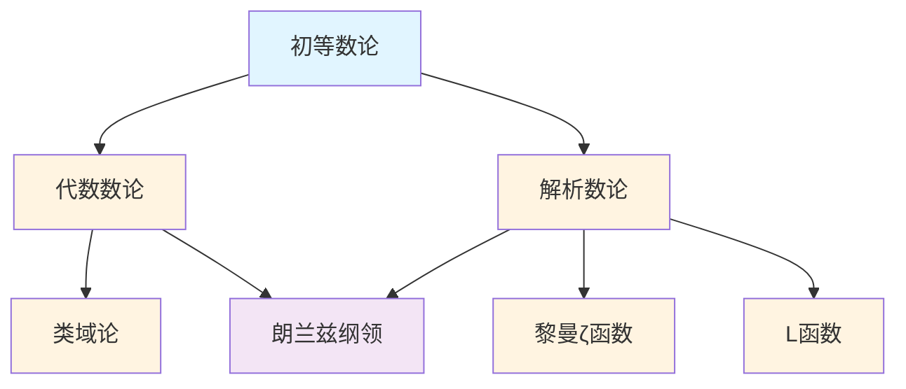

# 数论概念梳理

## 📋 概述

本文档系统梳理数论领域的核心概念，包括初等数论、代数数论、解析数论等。

---

## 🎯 核心概念体系

### 1. 初等数论核心概念

#### 整除理论

- **整除 (Divisibility)**: 整除关系
- **最大公约数 (Greatest Common Divisor, GCD)**: 最大公约数
- **最小公倍数 (Least Common Multiple, LCM)**: 最小公倍数
- **欧几里得算法 (Euclidean Algorithm)**: 求最大公约数的算法
- **扩展欧几里得算法 (Extended Euclidean Algorithm)**: 扩展算法
- **贝祖等式 (Bézout's Identity)**: 贝祖等式

#### 同余理论

- **同余 (Congruence)**: 同余关系
- **剩余类 (Residue Class)**: 同余类
- **完全剩余系 (Complete Residue System)**: 完全剩余系
- **简化剩余系 (Reduced Residue System)**: 简化剩余系
- **中国剩余定理 (Chinese Remainder Theorem)**: 中国剩余定理
- **费马小定理 (Fermat's Little Theorem)**: 费马小定理
- **欧拉定理 (Euler's Theorem)**: 欧拉定理
- **欧拉函数 (Euler's Totient Function)**: 欧拉函数

#### 素数理论

- **素数 (Prime Number)**: 素数的定义
- **合数 (Composite Number)**: 合数
- **素数分布 (Prime Distribution)**: 素数的分布
- **素数定理 (Prime Number Theorem)**: 素数定理
- **黎曼ζ函数 (Riemann Zeta Function)**: 黎曼ζ函数
- **黎曼假设 (Riemann Hypothesis)**: 黎曼假设
- **孪生素数猜想 (Twin Prime Conjecture)**: 孪生素数猜想

### 2. 代数数论核心概念

#### 代数整数

- **代数整数 (Algebraic Integer)**: 代数整数的定义
- **整环 (Integral Domain)**: 整环
- **理想 (Ideal)**: 环的理想
- **素理想 (Prime Ideal)**: 素理想
- **素理想分解 (Prime Ideal Factorization)**: 素理想的分解
- **分式理想 (Fractional Ideal)**: 分式理想
- **理想类群 (Ideal Class Group)**: 理想类群

#### 类域论

- **类域 (Class Field)**: 类域
- **阿贝尔扩张 (Abelian Extension)**: 阿贝尔扩张
- **互反律 (Reciprocity Law)**: 互反律
- **局部类域论 (Local Class Field Theory)**: 局部类域论
- **整体类域论 (Global Class Field Theory)**: 整体类域论

#### 代数数域

- **代数数域 (Algebraic Number Field)**: 代数数域
- **数域的整数环 (Ring of Integers)**: 整数环
- **判别式 (Discriminant)**: 判别式
- **单位群 (Unit Group)**: 单位群
- **类数 (Class Number)**: 类数

### 3. 解析数论核心概念

#### 黎曼ζ函数

- **黎曼ζ函数 (Riemann Zeta Function)**: ζ函数的定义
- **函数方程 (Functional Equation)**: ζ函数的函数方程
- **零点 (Zero)**: ζ函数的零点
- **平凡零点 (Trivial Zero)**: 平凡零点
- **非平凡零点 (Non-Trivial Zero)**: 非平凡零点
- **黎曼假设 (Riemann Hypothesis)**: 黎曼假设

#### L函数

- **L函数 (L-Function)**: L函数的定义
- **Dirichlet L函数 (Dirichlet L-Function)**: Dirichlet L函数
- **Artin L函数 (Artin L-Function)**: Artin L函数
- **L函数的性质**: L函数的解析性质
- **L函数的应用**: L函数在数论中的应用

#### 素数分布

- **素数定理 (Prime Number Theorem)**: 素数定理
- **黎曼假设 (Riemann Hypothesis)**: 黎曼假设
- **广义黎曼假设 (Generalized Riemann Hypothesis)**: 广义黎曼假设
- **素数分布函数 (Prime Counting Function)**: 素数计数函数
- **切比雪夫函数 (Chebyshev Function)**: 切比雪夫函数

---

## 🔗 概念关联图

---

## 📊 概念重要性矩阵

| 概念 | 基础性 | 应用性 | 重要性 | 学习优先级 |
|-----|--------|--------|--------|-----------|
| 整除 | ⭐⭐⭐⭐⭐ | ⭐⭐⭐⭐ | ⭐⭐⭐⭐⭐ | 1 |
| 同余 | ⭐⭐⭐⭐⭐ | ⭐⭐⭐⭐ | ⭐⭐⭐⭐⭐ | 1 |
| 素数 | ⭐⭐⭐⭐⭐ | ⭐⭐⭐⭐ | ⭐⭐⭐⭐⭐ | 1 |
| 最大公约数 | ⭐⭐⭐⭐⭐ | ⭐⭐⭐⭐ | ⭐⭐⭐⭐⭐ | 1 |
| 中国剩余定理 | ⭐⭐⭐⭐ | ⭐⭐⭐ | ⭐⭐⭐⭐ | 2 |
| 费马小定理 | ⭐⭐⭐⭐ | ⭐⭐⭐ | ⭐⭐⭐⭐ | 2 |
| 代数整数 | ⭐⭐⭐ | ⭐⭐⭐ | ⭐⭐⭐⭐ | 3 |
| 类域论 | ⭐⭐⭐ | ⭐⭐ | ⭐⭐⭐⭐ | 4 |
| 黎曼ζ函数 | ⭐⭐⭐ | ⭐⭐⭐ | ⭐⭐⭐⭐⭐ | 3 |
| 黎曼假设 | ⭐⭐ | ⭐⭐⭐ | ⭐⭐⭐⭐⭐ | 5 |

---

## 🎓 学习路径建议

### 基础路径

1. **整除理论** → **最大公约数** → **欧几里得算法**
2. **同余理论** → **中国剩余定理** → **费马小定理**

### 进阶路径

1. **素数理论** → **素数分布** → **素数定理**
2. **代数数论** → **代数整数** → **理想理论**

### 高级路径

1. **类域论** → **互反律** → **应用**
2. **解析数论** → **黎曼ζ函数** → **L函数** → **黎曼假设**
3. **朗兰兹纲领** → **几何朗兰兹**

---

**创建日期**: 2025年11月21日
**维护状态**: 持续更新中
