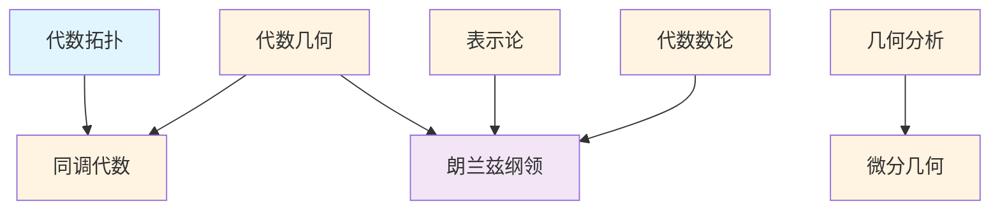

# 交叉领域概念梳理

## 📋 概述

本文档系统梳理数学交叉领域的核心概念，包括代数拓扑、代数几何、几何分析、同调代数、表示论等。

---

## 🎯 核心概念体系

### 1. 代数拓扑核心概念

#### 基础概念

- **基本群 (Fundamental Group)**: 拓扑空间的基本群
- **同伦群 (Homotopy Group)**: 高阶同伦群
- **同调群 (Homology Group)**: 奇异同调群
- **上同调群 (Cohomology Group)**: 上同调群
- **纤维化 (Fibration)**: 纤维化
- **上纤维化 (Cofibration)**: 上纤维化

#### 高级概念

- **谱序列 (Spectral Sequence)**: 谱序列
- **K理论 (K-Theory)**: 拓扑K理论
- **稳定同伦 (Stable Homotopy)**: 稳定同伦理论
- **同伦类型论 (Homotopy Type Theory)**: 同伦类型论

### 2. 代数几何核心概念

#### 基础概念

- **概形 (Scheme)**: 概形的定义
- **仿射概形 (Affine Scheme)**: 仿射概形
- **射影概形 (Projective Scheme)**: 射影概形
- **层 (Sheaf)**: 层的定义
- **上同调 (Cohomology)**: 层上同调

#### 高级概念

- **导出范畴 (Derived Category)**: 导出范畴
- **导出代数几何 (Derived Algebraic Geometry)**: 导出代数几何
- **无穷范畴 (∞-Category)**: 无穷范畴
- **稳定范畴 (Stable Category)**: 稳定范畴

### 3. 几何分析核心概念

#### 基础概念

- **黎曼流形 (Riemannian Manifold)**: 黎曼流形
- **曲率 (Curvature)**: 曲率张量
- **测地线 (Geodesic)**: 测地线
- **调和函数 (Harmonic Function)**: 调和函数

#### 高级概念

- **里奇流 (Ricci Flow)**: 里奇流
- **几何偏微分方程 (Geometric PDE)**: 几何偏微分方程
- **几何化猜想 (Geometrization Conjecture)**: 几何化猜想
- **庞加莱猜想 (Poincaré Conjecture)**: 庞加莱猜想

### 4. 同调代数核心概念

#### 基础概念

- **链复形 (Chain Complex)**: 链复形
- **同调 (Homology)**: 同调群
- **上同调 (Cohomology)**: 上同调群
- **导出函子 (Derived Functor)**: 导出函子
- **Ext函子 (Ext Functor)**: Ext函子
- **Tor函子 (Tor Functor)**: Tor函子

#### 高级概念

- **三角范畴 (Triangulated Category)**: 三角范畴
- **导出范畴 (Derived Category)**: 导出范畴
- **谱序列 (Spectral Sequence)**: 谱序列
- **模型范畴 (Model Category)**: 模型范畴

### 5. 表示论核心概念

#### 基础概念

- **群表示 (Group Representation)**: 群的表示
- **特征标 (Character)**: 表示的特征标
- **不可约表示 (Irreducible Representation)**: 不可约表示
- **李群表示 (Lie Group Representation)**: 李群的表示

#### 高级概念

- **几何表示论 (Geometric Representation Theory)**: 几何表示论
- **朗兰兹纲领 (Langlands Program)**: 朗兰兹纲领
- **几何朗兰兹 (Geometric Langlands)**: 几何朗兰兹纲领
- **量子几何朗兰兹 (Quantum Geometric Langlands)**: 量子几何朗兰兹

### 6. 代数数论核心概念

#### 基础概念

- **代数整数 (Algebraic Integer)**: 代数整数
- **理想 (Ideal)**: 环的理想
- **类域论 (Class Field Theory)**: 类域论
- **互反律 (Reciprocity Law)**: 互反律

#### 高级概念

- **算术几何 (Arithmetic Geometry)**: 算术几何
- **L函数 (L-Function)**: L函数
- **朗兰兹纲领 (Langlands Program)**: 朗兰兹纲领

---

## 🔗 概念关联图

---

## 📊 概念重要性矩阵

| 概念 | 基础性 | 应用性 | 重要性 | 学习优先级 |
|-----|--------|--------|--------|-----------|
| 基本群 | ⭐⭐⭐ | ⭐⭐⭐ | ⭐⭐⭐⭐ | 3 |
| 同调群 | ⭐⭐⭐ | ⭐⭐⭐ | ⭐⭐⭐⭐ | 3 |
| 概形 | ⭐⭐⭐ | ⭐⭐⭐ | ⭐⭐⭐⭐ | 4 |
| 层 | ⭐⭐⭐ | ⭐⭐⭐ | ⭐⭐⭐⭐ | 4 |
| 导出函子 | ⭐⭐ | ⭐⭐⭐ | ⭐⭐⭐⭐ | 4 |
| 里奇流 | ⭐⭐ | ⭐⭐⭐ | ⭐⭐⭐⭐ | 5 |
| 朗兰兹纲领 | ⭐⭐ | ⭐⭐ | ⭐⭐⭐⭐⭐ | 5 |

---

## 🎓 学习路径建议

### 基础路径

1. **代数拓扑** → **基本群** → **同调群** → **上同调群**
2. **代数几何** → **概形** → **层** → **上同调**

### 进阶路径

1. **同调代数** → **导出函子** → **导出范畴**
2. **几何分析** → **里奇流** → **几何化猜想**

### 高级路径

1. **表示论** → **几何表示论** → **朗兰兹纲领**
2. **导出代数几何** → **∞-范畴** → **稳定范畴**
3. **算术几何** → **L函数** → **朗兰兹纲领**

---

**创建日期**: 2025年11月21日
**维护状态**: 持续更新中
