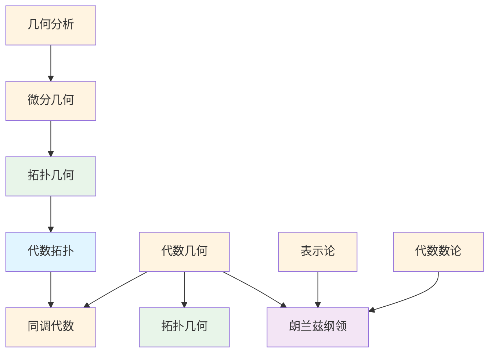

# 交叉领域概念梳理

**主题编号**: C.03.07
**创建日期**: 2025年11月21日
**最后更新**: 2025年11月21日

---

## 📋 目录 / Table of Contents

- [交叉领域概念梳理](#交叉领域概念梳理)
  - [📋 目录 / Table of Contents](#-目录--table-of-contents)
  - [📋 概述 (编号: C.03.07.01)](#-概述-编号-c030701)
  - [🎯 核心概念体系 (编号: C.03.07.02)](#-核心概念体系-编号-c030702)
    - [1. 代数拓扑核心概念 (编号: C.03.07.02.01)](#1-代数拓扑核心概念-编号-c03070201)
      - [基础概念](#基础概念)
      - [高级概念](#高级概念)
    - [2. 代数几何核心概念 (编号: C.03.07.02.02)](#2-代数几何核心概念-编号-c03070202)
      - [基础概念](#基础概念-1)
      - [高级概念](#高级概念-1)
    - [3. 微分几何核心概念 (编号: C.03.07.02.03) ⭐ 新增](#3-微分几何核心概念-编号-c03070203--新增)
      - [基础概念](#基础概念-2)
      - [高级概念](#高级概念-2)
    - [4. 拓扑几何核心概念 (编号: C.03.07.02.04) ⭐ 新增](#4-拓扑几何核心概念-编号-c03070204--新增)
      - [基础概念](#基础概念-3)
      - [高级概念](#高级概念-3)
    - [5. 几何分析核心概念 (编号: C.03.07.02.05)](#5-几何分析核心概念-编号-c03070205)
      - [基础概念](#基础概念-4)
      - [高级概念](#高级概念-4)
    - [6. 同调代数核心概念 (编号: C.03.07.02.06)](#6-同调代数核心概念-编号-c03070206)
      - [基础概念](#基础概念-5)
      - [高级概念](#高级概念-5)
    - [7. 表示论核心概念 (编号: C.03.07.02.07)](#7-表示论核心概念-编号-c03070207)
      - [基础概念](#基础概念-6)
      - [高级概念](#高级概念-6)
    - [8. 代数数论核心概念 (编号: C.03.07.02.08)](#8-代数数论核心概念-编号-c03070208)
      - [基础概念](#基础概念-7)
      - [高级概念](#高级概念-7)
  - [🔗 概念关联图 (编号: C.03.07.03)](#-概念关联图-编号-c030703)
  - [📊 概念重要性矩阵 (编号: C.03.07.04)](#-概念重要性矩阵-编号-c030704)
  - [🎓 学习路径建议 (编号: C.03.07.05)](#-学习路径建议-编号-c030705)
    - [基础路径](#基础路径)
    - [进阶路径](#进阶路径)
    - [高级路径](#高级路径)

---

## 📋 概述 (编号: C.03.07.01)

本文档系统梳理数学交叉领域的核心概念，包括代数拓扑、代数几何、微分几何、拓扑几何、几何分析、同调代数、表示论等。

**哲学背景**: 交叉领域的发展体现了结构主义和形式主义的影响。代数几何、微分几何、拓扑几何等交叉领域强调不同数学分支的结构性联系，体现了结构主义的思想。这些领域的公理化发展体现了形式主义的影响。详见[数学哲学维度矩阵](../02-知识矩阵/09-数学哲学维度矩阵.md)。

**权威资源对齐**: 本文档的概念定义和结构参考了Wikipedia交叉领域条目（代数几何、微分几何、拓扑几何等）、Princeton和Harvard的代数几何课程、MIT的微分几何课程，以及Metamath的相关定理。详见[权威资源对齐说明](../00-权威资源对齐说明.md)和[权威资源对标改进计划](../00-权威资源对标改进计划.md)。

---

## 🎯 核心概念体系 (编号: C.03.07.02)

### 1. 代数拓扑核心概念 (编号: C.03.07.02.01)

**定义**: 代数拓扑是使用代数方法（群、环、模）研究拓扑空间的数学分支，通过代数不变量（如同伦群、同调群）分类和区分拓扑空间。

**历史背景**: 从Poincaré的基本群（1895），到20世纪中期的同调论和上同调论，再到现代的稳定同伦理论和同伦类型论。

#### 基础概念

- **基本群 (Fundamental Group)**: 基本群
  - **严格定义**: $\pi_1(X,x_0) = \{[f] : f \text{ 是 } x_0 \text{ 处的回路}\}$，其中 $[f]$ 是同伦等价类
  - **历史背景**: 由Poincaré（1895）引入，是第一个同伦不变量，开创了代数拓扑
  - **形式化**: 群运算为路径复合，单位元为常路径，逆元为路径反转
  - **性质**: 群结构，同伦不变量，$\pi_1(X \times Y) \cong \pi_1(X) \times \pi_1(Y)$
  - **应用**: 分类曲面、证明Brouwer不动点定理、覆盖空间理论
  - **参考文献**: Wikipedia: [Fundamental Group](https://en.wikipedia.org/wiki/Fundamental_group); Hatcher, A. (2002). *Algebraic Topology*. Cambridge University Press.
- **同伦群 (Homotopy Group)**: 同伦群
  - **定义**: $\pi_n(X,x_0) = \{[f] : f: S^n \to X, f(*) = x_0\}$，$n \geq 2$
  - **性质**: 阿贝尔群（$n \geq 2$），同伦不变量，$\pi_n(X \times Y) \cong \pi_n(X) \times \pi_n(Y)$
  - **应用**: 分类高维流形、稳定同伦理论、Whitehead定理
- **同调群 (Homology Group)**: 同调群
  - **定义**: $H_n(X) = \ker(\partial_n) / \text{im}(\partial_{n+1})$，其中 $\partial$ 是边界映射
  - **性质**: 同伦不变量，长正合列，Mayer-Vietoris序列
  - **应用**: 分类拓扑空间、计算Betti数、Poincaré对偶
- **上同调群 (Cohomology Group)**: 上同调群
  - **定义**: $H^n(X) = \ker(\delta^n) / \text{im}(\delta^{n-1})$，其中 $\delta$ 是上边界映射
  - **性质**: 上同调环（杯积），比同调更丰富，长正合列
  - **应用**: 分类向量丛（示性类）、障碍理论、K理论
- **纤维化 (Fibration)**: 纤维化
  - **定义**: 映射 $p: E \to B$ 满足同伦提升性质
  - **性质**: 长正合列：$\cdots \to \pi_n(F) \to \pi_n(E) \to \pi_n(B) \to \pi_{n-1}(F) \to \cdots$
  - **应用**: 纤维丛、覆盖空间、Postnikov塔
- **上纤维化 (Cofibration)**: 上纤维化
  - **定义**: 映射 $i: A \to X$ 满足同伦延拓性质
  - **性质**: 长正合列：$\cdots \to \pi_n(A) \to \pi_n(X) \to \pi_n(X/A) \to \pi_{n-1}(A) \to \cdots$
  - **应用**: 相对同调、CW复形、同伦余纤维

#### 高级概念

- **谱序列 (Spectral Sequence)**: 谱序列
  - **定义**: 计算同调的工具，通过过滤逐步逼近
  - **性质**: 收敛性、函子性、微分
  - **应用**: Leray谱序列（纤维化）、Serre谱序列、Hochschild-Serre谱序列
- **K理论 (K-Theory)**: 拓扑K理论
  - **定义**: 向量丛的等价类构成的群 $K(X)$
  - **性质**: 上同调理论，Bott周期性
  - **应用**: Atiyah-Singer指标定理、代数K理论、算子K理论
- **稳定同伦 (Stable Homotopy)**: 稳定同伦理论
  - **定义**: 稳定同伦群 $\pi_n^S(X) = \lim_{k \to \infty} \pi_{n+k}(\Sigma^k X)$
  - **性质**: 稳定同伦群是有限群（Adams谱序列）
  - **应用**: 球面稳定同伦群、谱理论
- **同伦类型论 (Homotopy Type Theory)**: 同伦类型论
  - **定义**: 将同伦论与类型论结合，类型对应空间，项对应点
  - **性质**: 同伦等价对应类型等价，高阶归纳类型
  - **应用**: 形式化数学、证明助手（如Coq、Agda）、Voevodsky的Univalence公理

### 2. 代数几何核心概念 (编号: C.03.07.02.02)

**定义**: 代数几何是研究代数簇（由多项式方程定义的几何对象）的数学分支，结合了代数和几何的方法。

**历史背景**: 从19世纪的代数曲线理论，到20世纪中期的概形理论（Grothendieck），再到现代的导出代数几何。

#### 基础概念

- **概形 (Scheme)**: 概形的定义
  - **严格定义**: 概形是局部同构于仿射概形的拓扑空间，配备结构层
  - **历史背景**: 由Grothendieck（1960s）在EGA中引入，统一了代数几何和数论
  - **形式化**: 概形 $(X, \mathcal{O}_X)$ 由拓扑空间 $X$ 和环层 $\mathcal{O}_X$ 组成
  - **性质**: 概形是代数簇的推广，允许更一般的环（如非代数闭域）
  - **应用**: 数论（算术几何）、编码理论、模空间
  - **参考文献**: Wikipedia: [Scheme (Mathematics)](https://en.wikipedia.org/wiki/Scheme_(mathematics)); Hartshorne, R. (1977). *Algebraic Geometry*. Springer; Grothendieck, A., & Dieudonné, J. (1960). *Éléments de géométrie algébrique*. I.H.É.S.
- **仿射概形 (Affine Scheme)**: 仿射概形
  - **定义**: 对交换环 $A$，仿射概形 $\text{Spec}(A)$ 是 $A$ 的素理想集合，配备Zariski拓扑和结构层
  - **性质**: 每个概形局部同构于仿射概形
  - **应用**: 代数簇的局部研究
- **射影概形 (Projective Scheme)**: 射影概形
  - **定义**: 由齐次理想定义的概形
  - **性质**: 紧致、分离
  - **应用**: 代数几何中的紧致对象
- **层 (Sheaf)**: 层的定义
  - **严格定义**: 层 $\mathcal{F}$ 是预层，满足局部确定全局的性质
  - **形式化**: 对开覆盖 $\{U_i\}$，若 $s_i \in \mathcal{F}(U_i)$ 在交上一致，则存在唯一的 $s \in \mathcal{F}(U)$ 限制为 $s_i$
  - **性质**: 层是局部到全局的桥梁
  - **应用**: 上同调理论、凝聚层
- **上同调 (Cohomology)**: 层上同调
  - **定义**: 层的上同调群 $H^i(X, \mathcal{F})$ 衡量层在 $X$ 上的"非平凡性"
  - **性质**: 长正合列、Leray谱序列
  - **应用**: Riemann-Roch定理、Serre对偶

#### 高级概念

- **导出范畴 (Derived Category)**: 导出范畴
  - **定义**: 链复形的同伦范畴的局部化
  - **性质**: 三角范畴结构
  - **应用**: 导出函子、导出代数几何
- **导出代数几何 (Derived Algebraic Geometry)**: 导出代数几何
  - **定义**: 使用导出范畴和无穷范畴研究代数几何
  - **思想**: 允许"高阶"结构，处理奇点和相交理论
  - **应用**: 模空间、形变理论
- **无穷范畴 (∞-Category)**: 无穷范畴
  - **定义**: 允许高阶同伦的范畴
  - **性质**: 同伦等价、纤维积
  - **应用**: 导出代数几何、拓扑量子场论
- **稳定范畴 (Stable Category)**: 稳定范畴
  - **定义**: 具有零对象、纤维积、上纤维积的无穷范畴
  - **性质**: 同伦群、谱对象
  - **应用**: 稳定同伦理论、K理论

### 3. 微分几何核心概念 (编号: C.03.07.02.03) ⭐ 新增

**定义**: 微分几何是使用微积分和线性代数研究流形（局部像欧几里得空间的拓扑空间）的几何性质的数学分支。

**历史背景**: 从Gauss的曲面理论，到Riemann的黎曼几何，再到现代的微分流形理论。

#### 基础概念

- **流形 (Manifold)**: 流形
  - **严格定义**: $n$ 维流形 $M$ 是满足局部同胚于 $\mathbb{R}^n$ 的拓扑空间
  - **历史背景**: 流形概念由Riemann（1854）引入，Whitney（1936）建立嵌入定理
  - **形式化**: $\forall p \in M, \exists$ 开邻域 $U$ 和同胚 $\phi: U \to \mathbb{R}^n$
  - **性质**: 流形是局部欧几里得的，但整体可能不是
  - **应用**: 物理中的时空、机器学习中的数据流形、微分几何
  - **参考文献**: Wikipedia: [Manifold](https://en.wikipedia.org/wiki/Manifold); Lee, J. M. (2012). *Introduction to Smooth Manifolds*. Springer; do Carmo, M. P. (1992). *Riemannian Geometry*. Birkhäuser.
- **切空间 (Tangent Space)**: 切空间
  - **定义**: 在点 $p \in M$ 的切空间 $T_p M$ 是所有切向量的向量空间
  - **构造**: 切向量是等价类 $[\gamma]$，其中 $\gamma: (-\varepsilon, \varepsilon) \to M$ 是过 $p$ 的曲线
  - **维数**: $\dim T_p M = \dim M$
  - **应用**: 定义导数、向量场
- **黎曼流形 (Riemannian Manifold)**: 黎曼流形
  - **定义**: 微分流形 $M$ 配备正定对称双线性形式 $g$（度规）
  - **历史背景**: 由Riemann（1854）在《论几何学基础》中引入，开创了黎曼几何
  - **度规**: $g_p: T_p M \times T_p M \to \mathbb{R}$ 在每点 $p$ 定义内积
  - **性质**: 可以定义长度、角度、体积、曲率
  - **应用**: 广义相对论、最优传输、几何分析
  - **参考文献**: Wikipedia: [Riemannian Manifold](https://en.wikipedia.org/wiki/Riemannian_manifold); do Carmo, M. P. (1992). *Riemannian Geometry*. Birkhäuser; Spivak, M. (1979). *A Comprehensive Introduction to Differential Geometry*. Publish or Perish.
- **曲率 (Curvature)**: 曲率张量
  - **思想**: 度量流形偏离平坦空间的程度
  - **历史背景**: 曲率概念由Gauss（1827）在研究曲面时引入，Riemann（1854）推广到高维
  - **类型**: 黎曼曲率、里奇曲率、标量曲率
  - **几何意义**: 正曲率（球面）、负曲率（双曲面）、零曲率（平面）
  - **应用**: 几何分析、广义相对论、几何化猜想
  - **参考文献**: Wikipedia: [Curvature](https://en.wikipedia.org/wiki/Curvature); do Carmo, M. P. (1992). *Riemannian Geometry*. Birkhäuser.
- **测地线 (Geodesic)**: 测地线
  - **定义**: 流形上连接两点的最短路径（局部）
  - **方程**: $\frac{d^2 x^i}{dt^2} + \Gamma_{jk}^i \frac{dx^j}{dt} \frac{dx^k}{dt} = 0$（测地线方程）
  - **性质**: 测地线是自平行的（$\nabla_{\dot{\gamma}} \dot{\gamma} = 0$）
  - **应用**: 广义相对论中的自由落体、优化问题

#### 高级概念

- **里奇流 (Ricci Flow)**: 里奇流
  - **定义**: 度规 $g(t)$ 满足 $\frac{\partial g}{\partial t} = -2\text{Ric}(g)$
  - **历史背景**: 由Hamilton（1982）引入，Perelman（2002-2003）用于证明几何化猜想和庞加莱猜想
  - **性质**: 曲率在流下演化，流使度规"更均匀"
  - **应用**: 几何化猜想、庞加莱猜想的证明、几何分析
  - **参考文献**: Wikipedia: [Ricci Flow](https://en.wikipedia.org/wiki/Ricci_flow); Hamilton, R. S. (1982). "Three-manifolds with positive Ricci curvature". *Journal of Differential Geometry*; Perelman, G. (2002-2003). "The entropy formula for the Ricci flow and its geometric applications".
- **几何偏微分方程 (Geometric PDE)**: 几何偏微分方程
  - **定义**: 描述几何对象演化的偏微分方程
  - **例子**: 调和映射方程、Yamabe方程
  - **应用**: 几何流、共形几何
- **几何化猜想 (Geometrization Conjecture)**: 几何化猜想
  - **内容**: 每个3维流形可以分解为具有8种几何结构的片段
  - **证明**: Perelman使用里奇流证明
  - **意义**: 统一了3维流形的分类
- **庞加莱猜想 (Poincaré Conjecture)**: 庞加莱猜想
  - **内容**: 单连通的3维闭流形同胚于3维球面
  - **历史背景**: 由Poincaré（1904）提出，是千禧年七大数学难题之一
  - **证明**: Perelman（2002-2003）使用里奇流证明，拒绝Fields奖和Clay奖
  - **意义**: 拓扑学的基本问题，3维流形分类的基础
  - **参考文献**: Wikipedia: [Poincaré Conjecture](https://en.wikipedia.org/wiki/Poincar%C3%A9_conjecture); Perelman, G. (2002-2003). "The entropy formula for the Ricci flow and its geometric applications".

### 4. 拓扑几何核心概念 (编号: C.03.07.02.04) ⭐ 新增

**定义**: 拓扑几何是结合拓扑学和几何学方法研究几何对象的数学分支，关注拓扑不变量和几何结构的关系。

**历史背景**: 从Poincaré的拓扑学，到现代的纤维丛理论，再到代数拓扑和微分拓扑的交叉。

#### 基础概念

- **纤维丛 (Fiber Bundle)**: 纤维丛
  - **严格定义**: 纤维丛 $(E, B, F, \pi)$ 由全空间 $E$、底空间 $B$、纤维 $F$ 和投影 $\pi: E \to B$ 组成
  - **形式化**: 局部同构于乘积 $U \times F$，其中 $U \subseteq B$ 开集
  - **性质**: 纤维丛是局部平凡的
  - **应用**: 向量丛、主丛、规范理论
- **向量丛 (Vector Bundle)**: 向量丛
  - **定义**: 纤维是向量空间的纤维丛
  - **性质**: 可以定义截面、联络
  - **应用**: 切丛、余切丛、规范场
- **主丛 (Principal Bundle)**: 主丛
  - **定义**: 纤维是群的纤维丛，群在纤维上自由作用
  - **性质**: 可以定义联络、曲率
  - **应用**: 规范理论、微分几何
- **示性类 (Characteristic Class)**: 示性类
  - **定义**: 向量丛的拓扑不变量
  - **类型**: Stiefel-Whitney类、Chern类、Pontryagin类
  - **应用**: 分类向量丛、指标定理

#### 高级概念

- **Atiyah-Singer指标定理 (Atiyah-Singer Index Theorem)**: Atiyah-Singer指标定理
  - **内容**: 椭圆算子的解析指标等于拓扑指标
  - **应用**: 统一了分析、几何、拓扑
  - **意义**: 现代数学的重要定理
- **K理论 (K-Theory)**: K理论
  - **定义**: 向量丛的等价类构成的群
  - **性质**: 拓扑K理论、代数K理论
  - **应用**: 指标定理、代数几何
- **同伦群 (Homotopy Group)**: 同伦群
  - **定义**: $\pi_n(X)$ 是 $n$ 维球面到 $X$ 的同伦类
  - **性质**: 高阶同伦群一般非交换
  - **应用**: 分类拓扑空间

### 5. 几何分析核心概念 (编号: C.03.07.02.05)

**定义**: 几何分析是使用分析方法（偏微分方程、变分法）研究几何问题的数学分支。

#### 基础概念

- **调和函数 (Harmonic Function)**: 调和函数
  - **定义**: 满足Laplace方程 $\Delta u = 0$ 的函数
  - **性质**: 最大值原理、平均值性质
  - **应用**: 势理论、复分析
- **调和映射 (Harmonic Map)**: 调和映射
  - **定义**: 能量泛函的临界点
  - **性质**: 满足调和映射方程
  - **应用**: 极小曲面、规范理论

#### 高级概念

- **Yamabe问题 (Yamabe Problem)**: Yamabe问题
  - **内容**: 在共形类中寻找常标量曲率度规
  - **证明**: 使用变分法和PDE方法
  - **应用**: 共形几何

### 6. 同调代数核心概念 (编号: C.03.07.02.06)

**定义**: 同调代数是研究代数对象（如群、环、模）的同调不变量和导出函子的数学分支，是代数拓扑、代数几何、表示论等领域的共同工具。

**历史背景**: 从20世纪40年代的Cartan-Eilenberg同调代数，到60年代的导出范畴理论，再到现代的模型范畴和无穷范畴理论。

#### 基础概念

- **链复形 (Chain Complex)**: 链复形
  - **严格定义**: 链复形 $(C_\bullet, d_\bullet)$ 是一系列模 $C_n$ 和边界映射 $d_n: C_n \to C_{n-1}$，满足 $d_{n-1} \circ d_n = 0$
  - **历史背景**: 链复形概念由Eilenberg和Steenrod（1952）在同调代数中系统化
  - **形式化**: $\cdots \to C_{n+1} \xrightarrow{d_{n+1}} C_n \xrightarrow{d_n} C_{n-1} \to \cdots$，且 $d^2 = 0$
  - **性质**: 边界映射的复合为零，$\text{im}(d_{n+1}) \subseteq \ker(d_n)$
  - **应用**: 同调群、上同调群、导出函子
  - **参考文献**: Wikipedia: [Chain Complex](https://en.wikipedia.org/wiki/Chain_complex); Weibel, C. A. (1994). *An Introduction to Homological Algebra*. Cambridge University Press; Eilenberg, S., & Steenrod, N. (1952). *Foundations of Algebraic Topology*. Princeton University Press.
- **同调 (Homology)**: 同调群
  - **定义**: $H_n(C_\bullet) = \ker(d_n) / \text{im}(d_{n+1})$
  - **几何意义**: 衡量"循环"（cycles）与"边界"（boundaries）的差异
  - **性质**: 同调是函子性的，短正合列诱导长正合列
  - **应用**: 代数拓扑、代数几何、数论
- **上同调 (Cohomology)**: 上同调群
  - **定义**: 上链复形 $(C^\bullet, d^\bullet)$ 的上同调群 $H^n(C^\bullet) = \ker(d^n) / \text{im}(d^{n-1})$
  - **性质**: 上同调有环结构（杯积），比同调更丰富
  - **应用**: 代数几何（层上同调）、拓扑学（上同调环）
- **导出函子 (Derived Functor)**: 导出函子
  - **定义**: 左（右）导出函子 $L_n F$（$R^n F$）是函子 $F$ 的导出，衡量 $F$ 的非正合性
  - **构造**: 使用投射（内射）分解
  - **性质**: 长正合列、函子性
  - **应用**: Ext、Tor、层上同调
- **Ext函子 (Ext Functor)**: Ext函子
  - **定义**: $\text{Ext}^n_R(M, N) = R^n \text{Hom}_R(M, -)(N)$
  - **几何意义**: 分类 $N$ 的 $n$ 次扩张
  - **性质**: $\text{Ext}^0(M, N) = \text{Hom}(M, N)$
  - **应用**: 代数几何、表示论、同调维数
- **Tor函子 (Tor Functor)**: Tor函子
  - **定义**: $\text{Tor}_n^R(M, N) = L_n(M \otimes_R -)(N)$
  - **几何意义**: 衡量张量积的非正合性
  - **性质**: $\text{Tor}_0(M, N) = M \otimes_R N$
  - **应用**: 代数几何、交换代数、K理论

#### 高级概念

- **三角范畴 (Triangulated Category)**: 三角范畴
  - **定义**: 配备平移函子 $[1]$ 和三角的范畴
  - **性质**: 三角公理、八面体公理
  - **应用**: 导出范畴、稳定同伦理论
- **导出范畴 (Derived Category)**: 导出范畴
  - **定义**: 链复形范畴的局部化，使拟同构成为同构
  - **性质**: 三角范畴结构，保持同调信息
  - **应用**: 代数几何（导出函子）、表示论（导出等价）
- **谱序列 (Spectral Sequence)**: 谱序列
  - **定义**: 计算同调的工具，通过过滤逐步逼近
  - **性质**: 收敛性、函子性
  - **应用**: Leray谱序列、Hochschild-Serre谱序列
- **模型范畴 (Model Category)**: 模型范畴
  - **定义**: 配备三类态射（弱等价、纤维化、上纤维化）的范畴
  - **性质**: 因子分解、提升性质
  - **应用**: 同伦理论、导出范畴的构造

### 7. 表示论核心概念 (编号: C.03.07.02.07)

**定义**: 表示论是研究群、李代数等代数结构通过线性变换作用在向量空间上的数学分支，连接代数和线性代数。

**历史背景**: 从19世纪的有限群表示（Frobenius），到20世纪的李群表示（Weyl、Cartan），再到现代的几何表示论和朗兰兹纲领。

#### 基础概念

- **群表示 (Group Representation)**: 群的表示
  - **严格定义**: 群 $G$ 的表示是群同态 $\rho: G \to \text{GL}(V)$，其中 $V$ 是向量空间
  - **历史背景**: 群表示理论由Frobenius（1896）开创，用于研究有限群的结构
  - **形式化**: $\rho(g_1 g_2) = \rho(g_1) \rho(g_2)$，$\rho(e) = \text{id}_V$
  - **性质**: 表示将群运算转化为矩阵乘法
  - **应用**: 对称性研究、量子力学、编码理论、数论
  - **参考文献**: Wikipedia: [Group Representation](https://en.wikipedia.org/wiki/Group_representation); Fulton, W., & Harris, J. (2004). *Representation Theory: A First Course*. Springer; Serre, J.-P. (1977). *Linear Representations of Finite Groups*. Springer.
- **特征标 (Character)**: 表示的特征标
  - **定义**: 特征标 $\chi_\rho(g) = \text{tr}(\rho(g))$ 是表示 $\rho$ 的迹函数
  - **性质**: 类函数（在共轭类上常数），$\chi_\rho(g^{-1}) = \overline{\chi_\rho(g)}$
  - **应用**: 分类表示、正交关系
- **不可约表示 (Irreducible Representation)**: 不可约表示
  - **定义**: 没有非平凡不变子空间的表示
  - **性质**: Maschke定理（有限群在特征不整除阶的域上完全可约）
  - **应用**: 表示的分类、特征标表
- **李群表示 (Lie Group Representation)**: 李群的表示
  - **定义**: 李群 $G$ 到 $\text{GL}(V)$ 的连续同态
  - **性质**: 与李代数表示对应（通过微分）
  - **应用**: 物理中的对称性、调和分析

#### 高级概念

- **几何表示论 (Geometric Representation Theory)**: 几何表示论
  - **定义**: 用几何方法（如概形、层）研究表示论
  - **思想**: 将表示与几何对象（如旗流形）对应
  - **应用**: 量子群、Kazhdan-Lusztig理论
- **朗兰兹纲领 (Langlands Program)**: 朗兰兹纲领
  - **内容**: 统一数论、表示论、几何的宏大猜想
  - **核心**: 自守形式与Galois表示的对应
  - **意义**: 数学的"大统一理论"
  - **应用**: 费马大定理的证明、BSD猜想
- **几何朗兰兹 (Geometric Langlands)**: 几何朗兰兹纲领
  - **定义**: 朗兰兹纲领的几何版本，研究概形上的几何对象
  - **内容**: D-模、Hecke算子、几何对应
  - **应用**: 量子场论、弦理论
- **量子几何朗兰兹 (Quantum Geometric Langlands)**: 量子几何朗兰兹
  - **定义**: 几何朗兰兹的量子化版本
  - **内容**: 量子化参数、量子对应
  - **应用**: 量子场论、共形场论

### 8. 代数数论核心概念 (编号: C.03.07.02.08)

**定义**: 代数数论是使用代数方法（特别是交换代数、代数几何）研究数论问题的数学分支，研究代数数域和它们的整数环。

**历史背景**: 从19世纪的Kummer、Dedekind，到20世纪的类域论（Hilbert、Artin），再到现代的算术几何和朗兰兹纲领。

#### 基础概念

- **代数整数 (Algebraic Integer)**: 代数整数
  - **严格定义**: 代数整数是首一整数系数多项式的根
  - **历史背景**: 代数整数概念由Dedekind（1871）在研究数域时引入，推广了整数的概念
  - **形式化**: $\alpha \in \mathbb{C}$ 是代数整数当且仅当存在 $f(x) = x^n + a_{n-1}x^{n-1} + \cdots + a_0 \in \mathbb{Z}[x]$ 使得 $f(\alpha) = 0$
  - **性质**: 代数整数构成环，$\mathbb{Z}[\alpha]$ 是有限生成 $\mathbb{Z}$-模
  - **应用**: 数域的整数环、理想分解、Fermat大定理
  - **参考文献**: Wikipedia: [Algebraic Integer](https://en.wikipedia.org/wiki/Algebraic_integer); Lang, S. (1994). *Algebraic Number Theory*. Springer; Neukirch, J. (1999). *Algebraic Number Theory*. Springer.
- **理想 (Ideal)**: 环的理想
  - **定义**: 环 $R$ 的子集 $I$ 满足：$a, b \in I \Rightarrow a+b \in I$，$r \in R, a \in I \Rightarrow ra \in I$
  - **性质**: 理想是"广义的数"，可以分解为素理想的乘积（Dedekind整环）
  - **应用**: 唯一分解、类群、单位群
- **类域论 (Class Field Theory)**: 类域论
  - **定义**: 描述数域的Abel扩张与理想类群的对应
  - **历史背景**: 由Hilbert（1897）提出，Takagi（1920）和Artin（1927）建立类域论
  - **核心**: Artin互反律：$\text{Gal}(K^{ab}/K) \cong C_K$（类群）
  - **应用**: 二次互反律的推广、L函数、数域的Abel扩张分类
  - **参考文献**: Wikipedia: [Class Field Theory](https://en.wikipedia.org/wiki/Class_field_theory); Neukirch, J. (1999). *Algebraic Number Theory*. Springer; Artin, E. (1927). "Beweis des allgemeinen Reziprozitätsgesetzes". *Abhandlungen aus dem Mathematischen Seminar der Universität Hamburg*.
- **互反律 (Reciprocity Law)**: 互反律
  - **定义**: 描述素数的分解规律
  - **例子**: 二次互反律：$\left(\frac{p}{q}\right)\left(\frac{q}{p}\right) = (-1)^{\frac{p-1}{2}\frac{q-1}{2}}$
  - **应用**: 素数的判定、分解

#### 高级概念

- **算术几何 (Arithmetic Geometry)**: 算术几何
  - **定义**: 结合代数几何和数论，研究数域上的代数簇
  - **内容**: 概形、L函数、Mordell-Weil定理
  - **应用**: 费马大定理、BSD猜想、有理点问题
- **L函数 (L-Function)**: L函数
  - **定义**: 数论对象的生成函数，如 $\zeta(s) = \sum_{n=1}^\infty \frac{1}{n^s}$
  - **性质**: 解析延拓、函数方程、Riemann假设
  - **应用**: 素数分布、朗兰兹纲领

---

## 🔗 概念关联图 (编号: C.03.07.03)

---

## 📊 概念重要性矩阵 (编号: C.03.07.04)

| 概念 | 基础性 | 应用性 | 重要性 | 学习优先级 |
|-----|--------|--------|--------|-----------|
| 基本群 | ⭐⭐⭐ | ⭐⭐⭐ | ⭐⭐⭐⭐ | 3 |
| 同伦群 | ⭐⭐⭐ | ⭐⭐⭐ | ⭐⭐⭐⭐ | 3 |
| 同调群 | ⭐⭐⭐ | ⭐⭐⭐ | ⭐⭐⭐⭐ | 3 |
| 上同调群 | ⭐⭐⭐ | ⭐⭐⭐ | ⭐⭐⭐⭐ | 3 |
| 纤维化 | ⭐⭐⭐ | ⭐⭐⭐ | ⭐⭐⭐⭐ | 3 |
| 上纤维化 | ⭐⭐⭐ | ⭐⭐⭐ | ⭐⭐⭐ | 3 |
| 谱序列 | ⭐⭐ | ⭐⭐⭐ | ⭐⭐⭐⭐ | 4 |
| K理论 | ⭐⭐ | ⭐⭐⭐ | ⭐⭐⭐⭐ | 4 |
| 稳定同伦 | ⭐⭐ | ⭐⭐ | ⭐⭐⭐ | 5 |
| 同伦类型论 | ⭐⭐ | ⭐⭐ | ⭐⭐⭐ | 5 |
| 概形 | ⭐⭐⭐ | ⭐⭐⭐ | ⭐⭐⭐⭐ | 4 |
| 层 | ⭐⭐⭐ | ⭐⭐⭐ | ⭐⭐⭐⭐ | 4 |
| 流形 | ⭐⭐⭐⭐ | ⭐⭐⭐⭐ | ⭐⭐⭐⭐⭐ | 2 |
| 黎曼流形 | ⭐⭐⭐ | ⭐⭐⭐⭐ | ⭐⭐⭐⭐ | 3 |
| 纤维丛 | ⭐⭐⭐ | ⭐⭐⭐ | ⭐⭐⭐⭐ | 3 |
| 向量丛 | ⭐⭐⭐ | ⭐⭐⭐ | ⭐⭐⭐⭐ | 3 |
| 链复形 | ⭐⭐⭐ | ⭐⭐⭐ | ⭐⭐⭐⭐ | 3 |
| 同调 | ⭐⭐⭐ | ⭐⭐⭐ | ⭐⭐⭐⭐ | 3 |
| 上同调 | ⭐⭐⭐ | ⭐⭐⭐ | ⭐⭐⭐⭐ | 3 |
| 导出函子 | ⭐⭐ | ⭐⭐⭐ | ⭐⭐⭐⭐ | 4 |
| Ext函子 | ⭐⭐ | ⭐⭐⭐ | ⭐⭐⭐⭐ | 4 |
| Tor函子 | ⭐⭐ | ⭐⭐⭐ | ⭐⭐⭐⭐ | 4 |
| 导出范畴 | ⭐⭐ | ⭐⭐⭐ | ⭐⭐⭐⭐ | 4 |
| 群表示 | ⭐⭐⭐ | ⭐⭐⭐⭐ | ⭐⭐⭐⭐ | 3 |
| 特征标 | ⭐⭐⭐ | ⭐⭐⭐ | ⭐⭐⭐⭐ | 3 |
| 不可约表示 | ⭐⭐⭐ | ⭐⭐⭐ | ⭐⭐⭐⭐ | 3 |
| 几何表示论 | ⭐⭐ | ⭐⭐⭐ | ⭐⭐⭐⭐ | 4 |
| 代数整数 | ⭐⭐⭐ | ⭐⭐⭐ | ⭐⭐⭐⭐ | 3 |
| 理想 | ⭐⭐⭐⭐ | ⭐⭐⭐⭐ | ⭐⭐⭐⭐⭐ | 2 |
| 类域论 | ⭐⭐ | ⭐⭐⭐ | ⭐⭐⭐⭐ | 4 |
| 算术几何 | ⭐⭐ | ⭐⭐⭐ | ⭐⭐⭐⭐ | 4 |
| L函数 | ⭐⭐ | ⭐⭐⭐ | ⭐⭐⭐⭐ | 4 |
| 里奇流 | ⭐⭐ | ⭐⭐⭐ | ⭐⭐⭐⭐ | 5 |
| 朗兰兹纲领 | ⭐⭐ | ⭐⭐ | ⭐⭐⭐⭐⭐ | 5 |

---

## 🎓 学习路径建议 (编号: C.03.07.05)

### 基础路径

1. **代数拓扑** → **基本群** → **同调群** → **上同调群**
2. **代数几何** → **概形** → **层** → **上同调**
3. **微分几何** → **流形** → **切空间** → **黎曼流形** → **曲率**
4. **拓扑几何** → **纤维丛** → **向量丛** → **示性类**

### 进阶路径

1. **同调代数** → **链复形** → **导出函子** → **导出范畴**
2. **表示论** → **群表示** → **特征标** → **不可约表示**
3. **代数数论** → **代数整数** → **理想** → **类域论**
4. **几何分析** → **里奇流** → **几何化猜想**
5. **微分几何** → **测地线** → **指数映射** → **里奇流**
6. **拓扑几何** → **主丛** → **联络** → **曲率**

### 高级路径

1. **表示论** → **几何表示论** → **朗兰兹纲领**
2. **导出代数几何** → **∞-范畴** → **稳定范畴**
3. **算术几何** → **L函数** → **朗兰兹纲领**
4. **拓扑几何** → **K理论** → **Atiyah-Singer指标定理**
5. **微分几何** → **几何偏微分方程** → **Yamabe问题**

---

**创建日期**: 2025年11月21日
**最后更新**: 2025年11月21日
**维护状态**: 持续更新中
