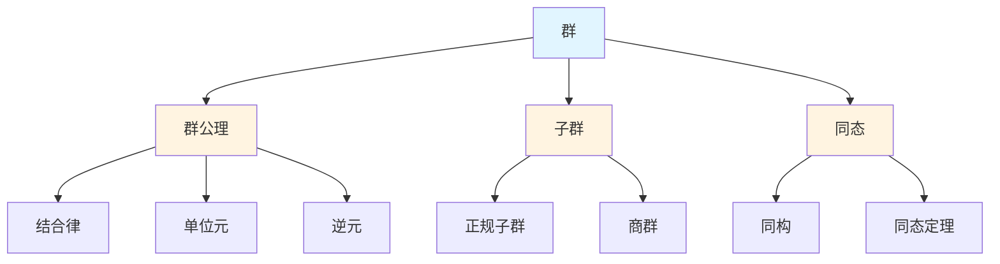
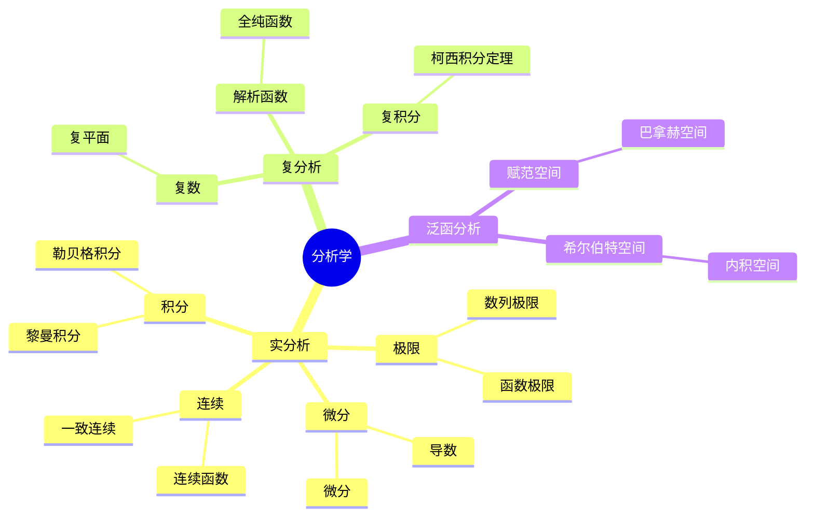
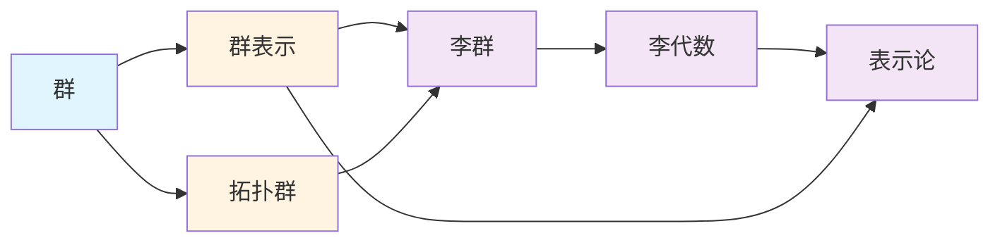
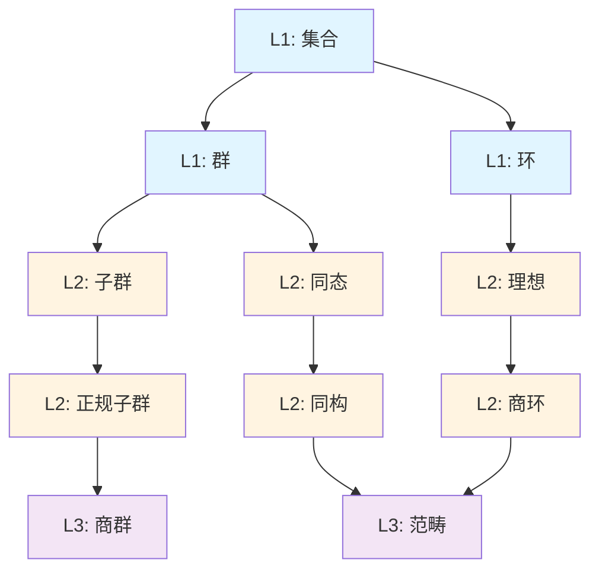

# 思维模型工具

## 📋 概述

本文档介绍用于理解和组织数学知识的思维模型工具。

---

## 🗺️ 1. 概念地图 (Concept Map)

### 定义

概念地图是一种可视化工具，用于展示概念之间的关系。

### 特点

- **节点**: 表示概念
- **边**: 表示关系
- **层次**: 可以表示概念的层次结构

### 应用场景

- 理解概念之间的关系
- 发现知识盲点
- 规划学习路径

### 示例：群论概念地图

---

## 🌳 2. 思维导图 (Mind Map)

### 定义

思维导图是一种层次化的知识组织工具，以中心主题为核心，向外辐射相关概念。

### 特点

- **中心主题**: 核心概念
- **分支**: 相关概念
- **层次**: 多层次的树状结构

### 应用场景

- 知识梳理
- 学习笔记
- 知识复习

### 示例：分析学思维导图

---

## 🔗 3. 知识图谱 (Knowledge Graph)

### 定义

知识图谱是一种网络化的知识表示方法，通过节点和边表示概念及其关系。

### 特点

- **节点**: 概念、实体
- **边**: 关系、属性
- **网络**: 复杂的网络结构

### 应用场景

- 知识发现
- 关联分析
- 智能推荐

### 示例：跨分支知识图谱

---

## 📊 4. 概念层次 (Concept Hierarchy)

### 定义

概念层次是一种按抽象层次组织概念的方法。

### 特点

- **层次**: L1基础、L2中级、L3高级
- **依赖**: 上层概念依赖下层概念
- **路径**: 从基础到高级的学习路径

### 应用场景

- 学习路径规划
- 知识依赖分析
- 难度评估

### 示例：代数结构概念层次

---

## 🎯 工具选择指南

### 根据目标选择工具

| 目标 | 推荐工具 | 原因 |
|-----|---------|------|
| 理解概念关系 | 概念地图 | 清晰展示关系 |
| 知识梳理 | 思维导图 | 层次化组织 |
| 知识发现 | 知识图谱 | 网络化关联 |
| 学习规划 | 概念层次 | 依赖关系清晰 |

---

## 💡 使用技巧

### 1. 概念地图

- 从核心概念开始
- 逐步添加相关概念
- 标注关系类型
- 保持简洁清晰

### 2. 思维导图

- 确定中心主题
- 按逻辑分支展开
- 使用颜色区分
- 保持层次清晰

### 3. 知识图谱

- 识别核心节点
- 建立关联关系
- 分析网络结构
- 发现隐藏关联

### 4. 概念层次

- 识别基础概念
- 建立依赖关系
- 规划学习路径
- 评估学习难度

---

**创建日期**: 2025年11月21日
**维护状态**: 持续更新中
