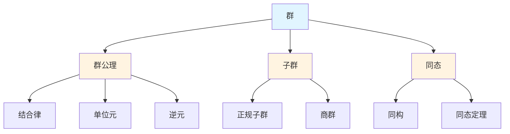
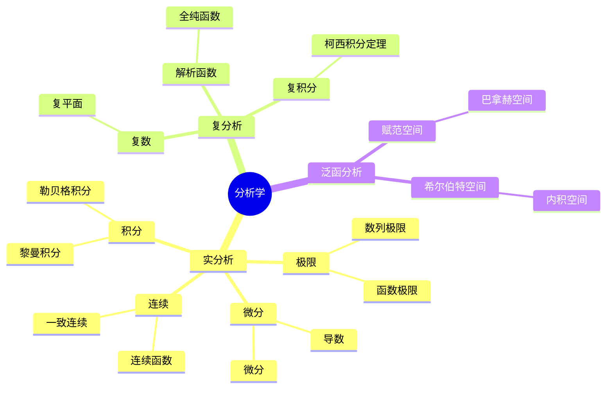
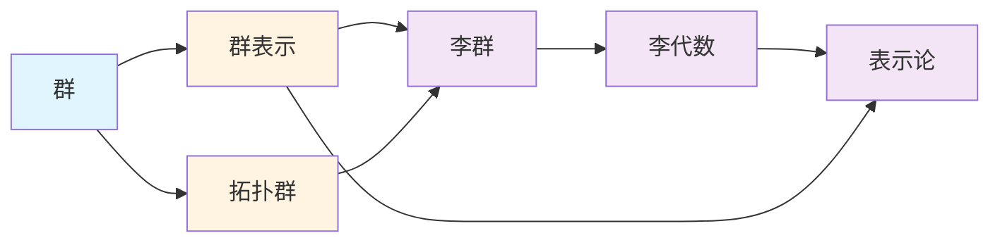
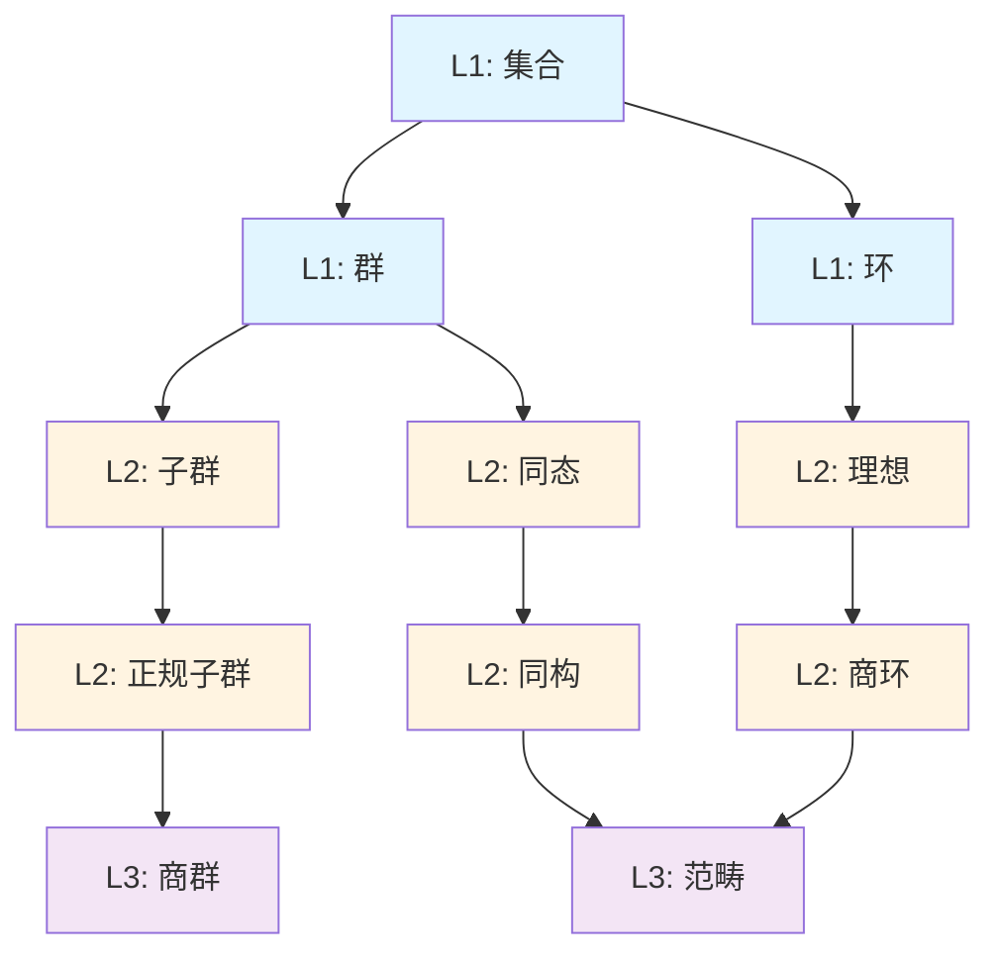

# 思维模型工具

**主题编号**: C.04.01
**创建日期**: 2025年11月21日
**最后更新**: 2025年11月21日

---

## 📋 目录 / Table of Contents

- [思维模型工具](#思维模型工具)
  - [📋 目录 / Table of Contents](#-目录--table-of-contents)
  - [📋 概述 (编号: C.04.01.01)](#-概述-编号-c040101)
  - [🗺️ 1. 概念地图 (Concept Map) (编号: C.04.01.02)](#️-1-概念地图-concept-map-编号-c040102)
    - [定义](#定义)
    - [特点](#特点)
    - [应用场景](#应用场景)
    - [使用方法](#使用方法)
    - [关系类型](#关系类型)
    - [示例：群论概念地图](#示例群论概念地图)
  - [🌳 2. 思维导图 (Mind Map) (编号: C.04.01.03)](#-2-思维导图-mind-map-编号-c040103)
    - [定义](#定义-1)
    - [特点](#特点-1)
    - [应用场景](#应用场景-1)
    - [使用方法](#使用方法-1)
    - [构建原则](#构建原则)
    - [示例：分析学思维导图](#示例分析学思维导图)
  - [🔗 3. 知识图谱 (Knowledge Graph) (编号: C.04.01.04)](#-3-知识图谱-knowledge-graph-编号-c040104)
    - [定义](#定义-2)
    - [特点](#特点-2)
    - [应用场景](#应用场景-2)
    - [使用方法](#使用方法-2)
    - [关系类型示例](#关系类型示例)
    - [特点1](#特点1)
    - [应用场景1](#应用场景1)
    - [示例：跨分支知识图谱](#示例跨分支知识图谱)
  - [📊 4. 概念层次 (Concept Hierarchy) (编号: C.04.01.05)](#-4-概念层次-concept-hierarchy-编号-c040105)
    - [定义](#定义-3)
    - [特点](#特点-3)
    - [应用场景](#应用场景-3)
    - [示例：代数结构概念层次](#示例代数结构概念层次)
  - [🎯 工具选择指南 (编号: C.04.01.06)](#-工具选择指南-编号-c040106)
    - [根据目标选择工具](#根据目标选择工具)
  - [💡 使用技巧 (编号: C.04.01.07)](#-使用技巧-编号-c040107)
    - [1. 概念地图](#1-概念地图)
    - [2. 思维导图](#2-思维导图)
    - [3. 知识图谱](#3-知识图谱)
    - [4. 概念层次](#4-概念层次)

---

## 📋 概述 (编号: C.04.01.01)

本文档介绍用于理解和组织数学知识的思维模型工具。

---

## 🗺️ 1. 概念地图 (Concept Map) (编号: C.04.01.02)

### 定义

概念地图是一种可视化工具，用于展示概念之间的关系。

**严格定义**: 概念地图 $G = (V, E, L)$ 其中：

- $V$ 是概念节点集合
- $E \subseteq V \times V$ 是关系边集合
- $L: E \to \text{Labels}$ 是关系标签函数

### 特点

- **节点**: 表示概念，通常用椭圆或矩形表示
- **边**: 表示关系，可以是有向或无向，带标签（如"包含"、"依赖"、"应用"）
- **层次**: 可以表示概念的层次结构（从一般到特殊）

### 应用场景

- **理解概念之间的关系**: 通过可视化发现概念间的依赖和应用关系
- **发现知识盲点**: 识别未掌握的概念或关系
- **规划学习路径**: 根据依赖关系确定学习顺序

### 使用方法

1. **选择核心概念**: 确定要分析的主题
2. **列出相关概念**: 列出所有相关概念
3. **建立关系**: 用箭头和标签表示概念间的关系
4. **验证完整性**: 检查是否遗漏重要概念或关系
5. **迭代完善**: 随着学习深入，不断更新概念地图

### 关系类型

- **包含关系**: A 包含 B（如"群"包含"子群"）
- **依赖关系**: A 依赖 B（如"商群"依赖"正规子群"）
- **应用关系**: A 应用于 B（如"同调方法"应用于"拓扑分类"）
- **推广关系**: A 推广 B（如"范畴"推广"集合"）

### 示例：群论概念地图

---

## 🌳 2. 思维导图 (Mind Map) (编号: C.04.01.03)

### 定义

思维导图是一种层次化的知识组织工具，以中心主题为核心，向外辐射相关概念。

**结构定义**: 思维导图 $T = (r, V, E)$ 其中：

- $r \in V$ 是根节点（中心主题）
- $V$ 是节点集合（概念）
- $E \subseteq V \times V$ 是树边（父子关系）

### 特点

- **中心主题**: 核心概念，位于中心位置
- **分支**: 相关概念，从中心向外辐射
- **层次**: 多层次的树状结构，每层表示不同的抽象级别

### 应用场景

- **知识梳理**: 整理学习内容，建立知识结构
- **学习笔记**: 记录学习过程，形成知识体系
- **知识复习**: 快速回顾知识结构，发现薄弱环节

### 使用方法

1. **确定中心主题**: 选择要组织的核心概念
2. **创建主要分支**: 围绕中心主题创建3-7个主要分支
3. **添加子分支**: 为每个主要分支添加子概念
4. **使用关键词**: 每个节点使用关键词而非完整句子
5. **使用颜色和图像**: 增强记忆效果
6. **保持简洁**: 避免信息过载

### 构建原则

- **层次性**: 从一般到特殊，从抽象到具体
- **关联性**: 相关概念放在相邻位置
- **完整性**: 覆盖主题的所有重要方面
- **可扩展性**: 便于后续添加新内容

### 示例：分析学思维导图

---

## 🔗 3. 知识图谱 (Knowledge Graph) (编号: C.04.01.04)

### 定义

知识图谱是一种网络化的知识表示方法，通过节点和边表示概念及其关系。

**形式化定义**: 知识图谱 $KG = (E, R, P, A)$ 其中：

- $E$ 是实体集合（数学对象）
- $R \subseteq E \times E$ 是关系集合（实体间关系）
- $P$ 是属性集合（实体的性质）
- $A: E \times P \to \text{Values}$ 是属性赋值函数

### 特点

- **实体**: 数学对象（概念、定理、方法）
- **关系**: 实体间的关系（依赖、应用、推广）
- **属性**: 实体的性质（定义、难度、应用场景）
- **结构化**: 便于计算机处理和查询

### 应用场景

- **知识检索**: 通过关系网络快速查找相关信息
- **知识推理**: 利用关系进行逻辑推理
- **知识发现**: 发现隐藏的知识关联
- **学习路径规划**: 根据关系网络规划学习路径

### 使用方法

1. **识别实体**: 确定要表示的概念、定理、方法等
2. **建立关系**: 定义实体间的关系类型
3. **添加属性**: 为每个实体添加属性信息
4. **构建网络**: 将实体、关系、属性组织成图结构
5. **查询分析**: 使用图查询语言进行知识检索和分析

### 关系类型示例

- **is-a**: 分类关系（"群" is-a "代数结构"）
- **depends-on**: 依赖关系（"商群" depends-on "正规子群"）
- **applies-to**: 应用关系（"同调方法" applies-to "拓扑分类"）
- **generalizes**: 推广关系（"范畴" generalizes "集合"）
- **proves**: 证明关系（"拉格朗日定理" proves "子群阶整除群阶"）

### 特点1

- **节点**: 概念、实体
- **边**: 关系、属性
- **网络**: 复杂的网络结构

### 应用场景1

- 知识发现
- 关联分析
- 智能推荐

### 示例：跨分支知识图谱

---

## 📊 4. 概念层次 (Concept Hierarchy) (编号: C.04.01.05)

### 定义

概念层次是一种按抽象层次组织概念的方法。

### 特点

- **层次**: L1基础、L2中级、L3高级
- **依赖**: 上层概念依赖下层概念
- **路径**: 从基础到高级的学习路径

### 应用场景

- 学习路径规划
- 知识依赖分析
- 难度评估

### 示例：代数结构概念层次

---

## 🎯 工具选择指南 (编号: C.04.01.06)

### 根据目标选择工具

| 目标 | 推荐工具 | 原因 |
|-----|---------|------|
| 理解概念关系 | 概念地图 | 清晰展示关系 |
| 知识梳理 | 思维导图 | 层次化组织 |
| 知识发现 | 知识图谱 | 网络化关联 |
| 学习规划 | 概念层次 | 依赖关系清晰 |

---

## 💡 使用技巧 (编号: C.04.01.07)

### 1. 概念地图

- 从核心概念开始
- 逐步添加相关概念
- 标注关系类型
- 保持简洁清晰

### 2. 思维导图

- 确定中心主题
- 按逻辑分支展开
- 使用颜色区分
- 保持层次清晰

### 3. 知识图谱

- 识别核心节点
- 建立关联关系
- 分析网络结构
- 发现隐藏关联

### 4. 概念层次

- 识别基础概念
- 建立依赖关系
- 规划学习路径
- 评估学习难度

---

**创建日期**: 2025年11月21日
**最后更新**: 2025年11月21日
**维护状态**: 持续更新中
