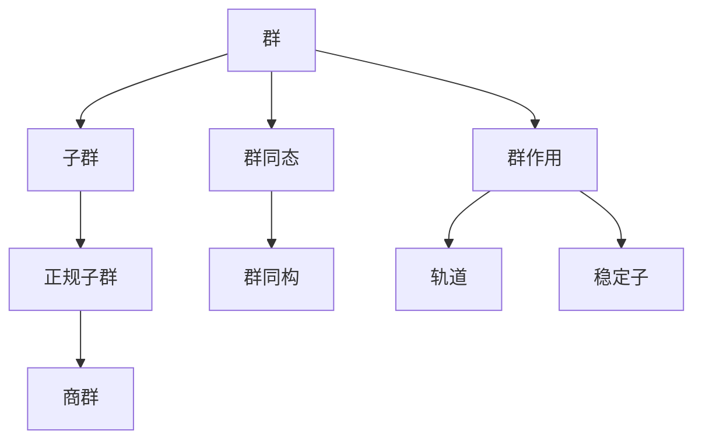
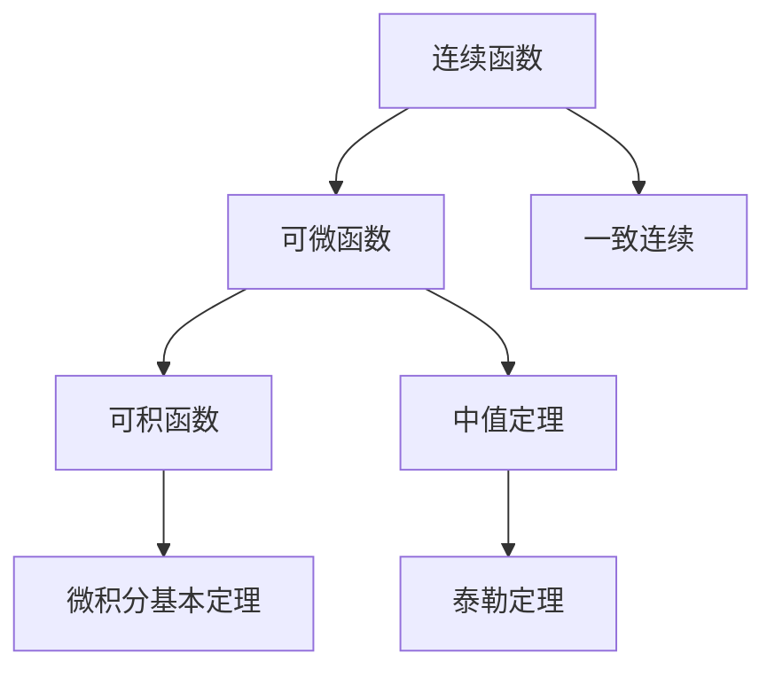

# 记忆与理解工具详细版

**主题编号**: C.04.05
**创建日期**: 2025年11月21日
**最后更新**: 2025年11月21日

---

## 📋 目录 / Table of Contents

- [记忆与理解工具详细版](#记忆与理解工具详细版)
  - [📋 目录 / Table of Contents](#-目录--table-of-contents)
  - [📋 概述 (编号: C.04.05.01)](#-概述-编号-c040501)
  - [📝 一、概念卡片法 (编号: C.04.05.02)](#-一概念卡片法-编号-c040502)
    - [1.1 核心概念卡片](#11-核心概念卡片)
    - [1.2 定理卡片](#12-定理卡片)
  - [🔗 二、关系图法 (编号: C.04.05.03)](#-二关系图法-编号-c040503)
    - [2.1 概念关系图](#21-概念关系图)
    - [2.2 定理关系图](#22-定理关系图)
  - [🔀 三、类比法 (编号: C.04.05.04)](#-三类比法-编号-c040504)
    - [3.1 数学内部类比](#31-数学内部类比)
    - [3.2 数学外部类比](#32-数学外部类比)
    - [3.3 类比应用步骤](#33-类比应用步骤)
  - [💡 四、实例法 (编号: C.04.05.05)](#-四实例法-编号-c040505)
    - [4.1 典型实例](#41-典型实例)
    - [4.2 反例](#42-反例)
    - [4.3 实例应用步骤](#43-实例应用步骤)
  - [🔄 五、间隔重复法 (编号: C.04.05.06)](#-五间隔重复法-编号-c040506)
    - [5.1 艾宾浩斯遗忘曲线](#51-艾宾浩斯遗忘曲线)
    - [5.2 间隔重复时间表](#52-间隔重复时间表)
    - [5.3 间隔重复实施](#53-间隔重复实施)
  - [📊 六、工具选择矩阵 (编号: C.04.05.07)](#-六工具选择矩阵-编号-c040507)
    - [6.1 按记忆目标选择工具](#61-按记忆目标选择工具)
    - [6.2 按概念类型选择工具](#62-按概念类型选择工具)
    - [6.3 按学习阶段选择工具](#63-按学习阶段选择工具)
  - [🔗 关联文档 (编号: C.04.05.08)](#-关联文档-编号-c040508)
    - [认知工具文档](#认知工具文档)
    - [相关文档](#相关文档)

---

## 📋 概述 (编号: C.04.05.01)

本文档提供FormalMath项目的详细记忆与理解工具，帮助学习者更好地记忆和理解数学概念。

**目标**: 建立系统化的记忆与理解工具体系

---

## 📝 一、概念卡片法 (编号: C.04.05.02)

### 1.1 核心概念卡片

**结构**:

- **正面**: 概念名称
- **背面**: 定义、性质、例子、应用

**示例**: 群的概念卡片

**正面**:

```text
群 (Group)
```

**背面**:

```text
定义: 一个集合G配上一个二元运算·，满足：
1. 结合律: (a·b)·c = a·(b·c)
2. 单位元: 存在e使得e·a = a·e = a
3. 逆元: 对每个a存在a⁻¹使得a·a⁻¹ = e

例子:
- 整数加法群 (Z, +)
- 对称群 S₃

性质:
- 单位元唯一
- 逆元唯一
- 消去律成立

应用:
- 对称性研究
- 密码学
```

### 1.2 定理卡片

**结构**:

- **正面**: 定理名称
- **背面**: 定理陈述、证明思路、应用

**示例**: 拉格朗日定理卡片

**正面**:

```text
拉格朗日定理
```

**背面**:

```text
陈述: 有限群G的子群H的阶整除G的阶

证明思路:
1. 定义陪集
2. 证明陪集划分群
3. 证明陪集等势
4. 得到|G| = |H|·[G:H]

应用:
- 确定子群可能阶
- 证明群的性质
```

---

## 🔗 二、关系图法 (编号: C.04.05.03)

### 2.1 概念关系图

**用途**: 可视化概念之间的关系

**类型**:

- **依赖关系图**: 展示概念依赖
- **类比关系图**: 展示概念类比
- **推广关系图**: 展示概念推广

**示例**: 群论概念关系图



### 2.2 定理关系图

**用途**: 展示定理之间的逻辑关系

**示例**: 分析学定理关系图



---

## 🔀 三、类比法 (编号: C.04.05.04)

### 3.1 数学内部类比

**群 ↔ 向量空间**:

- 群运算 ↔ 向量加法
- 单位元 ↔ 零向量
- 逆元 ↔ 负向量
- 子群 ↔ 子空间

**环 ↔ 整数环**:

- 环运算 ↔ 整数运算
- 理想 ↔ 倍数集合
- 商环 ↔ 模n剩余类

### 3.2 数学外部类比

**函数 ↔ 机器**:

- 输入 ↔ 定义域
- 输出 ↔ 值域
- 映射规则 ↔ 机器功能

**极限 ↔ 接近**:

- 极限值 ↔ 目标点
- 接近过程 ↔ 趋近过程
- 误差控制 ↔ 距离控制

### 3.3 类比应用步骤

1. **识别类比对象**
   - 找出熟悉概念
   - 识别相似特征

2. **建立对应关系**
   - 概念对应
   - 性质对应
   - 关系对应

3. **验证类比有效性**
   - 检查对应是否合理
   - 注意类比局限性

---

## 💡 四、实例法 (编号: C.04.05.05)

### 4.1 典型实例

**群论典型实例**:

- **整数加法群**: 最简单的群
- **对称群**: 几何对称
- **循环群**: 最简单的有限群
- **矩阵群**: 线性变换

**分析学典型实例**:

- **多项式函数**: 最简单的函数
- **指数函数**: 连续可微
- **三角函数**: 周期函数
- **分段函数**: 不连续点

### 4.2 反例

**反例的作用**:

- 澄清概念边界
- 理解定理条件
- 避免错误理解

**群论反例**:

- **非群**: 自然数加法（无逆元）
- **非交换群**: 对称群S₃
- **非有限群**: 整数加法群

**分析学反例**:

- **不可微连续函数**: 魏尔斯特拉斯函数
- **不连续可积函数**: 狄利克雷函数
- **不一致连续**: f(x) = x²在R上

### 4.3 实例应用步骤

1. **选择典型实例**
   - 选择简单实例
   - 选择代表性实例

2. **分析实例特征**
   - 识别关键特征
   - 理解实例结构

3. **推广到一般**
   - 从实例抽象
   - 形成一般理解

---

## 🔄 五、间隔重复法 (编号: C.04.05.06)

### 5.1 艾宾浩斯遗忘曲线

**遗忘规律**:

- 20分钟后遗忘42%
- 1小时后遗忘56%
- 1天后遗忘74%
- 1周后遗忘77%

**应对策略**:

- 及时复习
- 间隔复习
- 多次复习

### 5.2 间隔重复时间表

| 复习次数 | 时间间隔 | 说明 |
|---------|---------|------|
| 第1次 | 1天后 | 第一次复习 |
| 第2次 | 3天后 | 第二次复习 |
| 第3次 | 1周后 | 第三次复习 |
| 第4次 | 2周后 | 第四次复习 |
| 第5次 | 1月后 | 第五次复习 |
| 第6次 | 3月后 | 第六次复习 |

### 5.3 间隔重复实施

1. **创建复习计划**
   - 确定复习内容
   - 制定时间表
   - 设置提醒

2. **执行复习**
   - 按时复习
   - 主动回忆
   - 检查理解

3. **调整计划**
   - 根据效果调整
   - 优化时间间隔
   - 更新复习内容

---

## 📊 六、工具选择矩阵 (编号: C.04.05.07)

### 6.1 按记忆目标选择工具

| 记忆目标 | 推荐工具 | 优先级 | 说明 |
|---------|---------|--------|------|
| **记忆定义** | 概念卡片法 | ⭐⭐⭐⭐⭐ | 结构化记忆 |
| **记忆关系** | 关系图法 | ⭐⭐⭐⭐⭐ | 可视化记忆 |
| **理解抽象** | 类比法 | ⭐⭐⭐⭐⭐ | 通过类比理解 |
| **理解概念** | 实例法 | ⭐⭐⭐⭐⭐ | 通过实例理解 |
| **长期记忆** | 间隔重复法 | ⭐⭐⭐⭐⭐ | 科学记忆 |

### 6.2 按概念类型选择工具

| 概念类型 | 推荐工具 | 优先级 | 说明 |
|---------|---------|--------|------|
| **基础概念** | 概念卡片法 | ⭐⭐⭐⭐⭐ | 结构化 |
| **关系概念** | 关系图法 | ⭐⭐⭐⭐⭐ | 可视化 |
| **抽象概念** | 类比法 | ⭐⭐⭐⭐⭐ | 具体化 |
| **应用概念** | 实例法 | ⭐⭐⭐⭐⭐ | 实例化 |

### 6.3 按学习阶段选择工具

| 学习阶段 | 推荐工具 | 优先级 | 说明 |
|---------|---------|--------|------|
| **初学阶段** | 实例法 | ⭐⭐⭐⭐⭐ | 建立直观 |
| **理解阶段** | 类比法 | ⭐⭐⭐⭐ | 加深理解 |
| **记忆阶段** | 概念卡片法 | ⭐⭐⭐⭐⭐ | 系统记忆 |
| **巩固阶段** | 间隔重复法 | ⭐⭐⭐⭐⭐ | 长期记忆 |

---

## 🔗 关联文档 (编号: C.04.05.08)

### 认知工具文档

- [认知工具总览 (C.04.00)](./00-认知工具总览.md)
- [思维模型工具 (C.04.01)](./01-思维模型工具.md)
- [知识组织方法 (C.04.02)](./02-知识组织方法.md)
- [认知工具应用指南 (C.04.03)](./03-认知工具应用指南.md)
- [学习策略工具详细版 (C.04.04)](./04-学习策略工具详细版.md)

### 相关文档

- [主题概念总览](../03-主题概念梳理/00-主题概念总览.md)
- [概念层次矩阵](../02-知识矩阵/02-概念层次矩阵.md)

---

**创建日期**: 2025年11月21日
**最后更新**: 2025年11月21日
**维护状态**: 持续更新中
**版本**: v1.0
