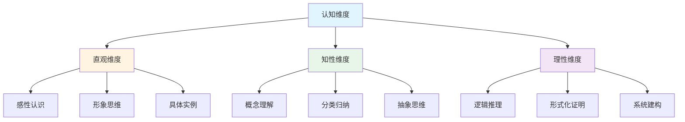
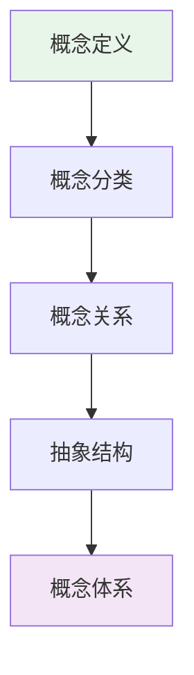
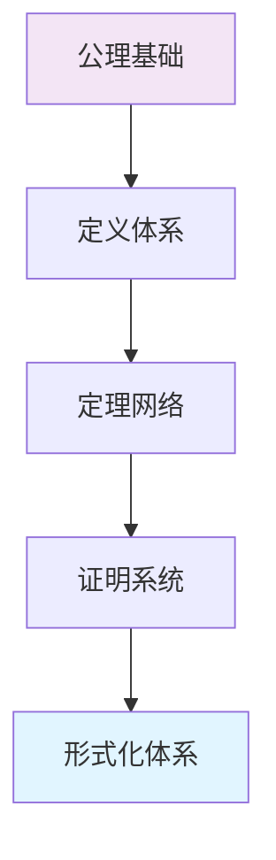
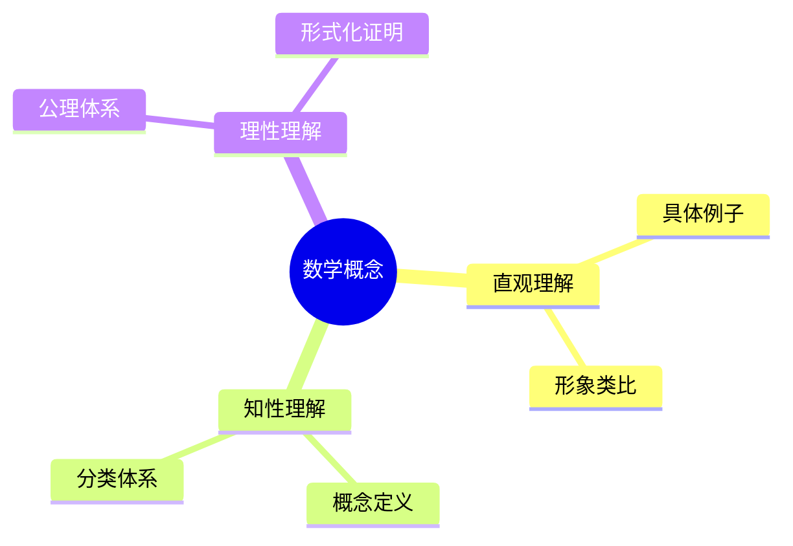
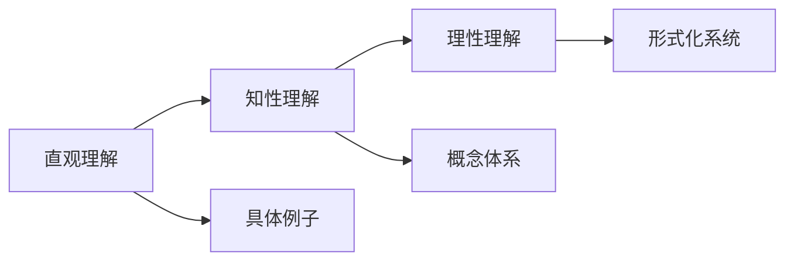
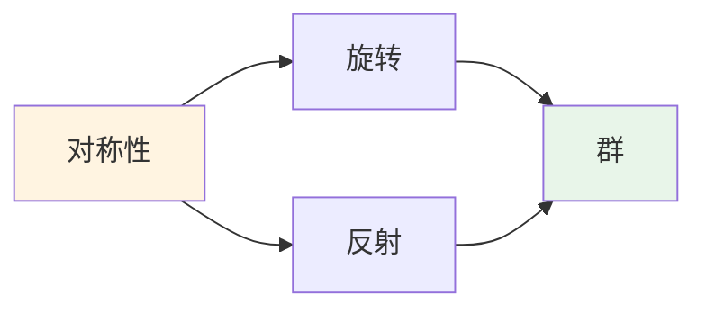
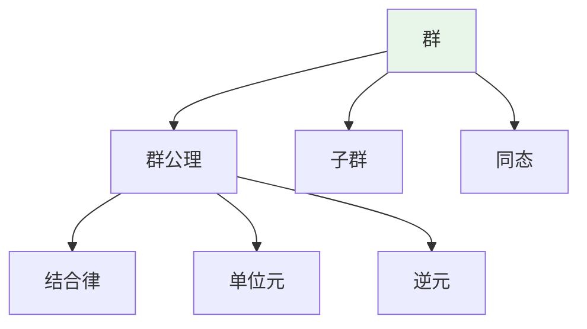
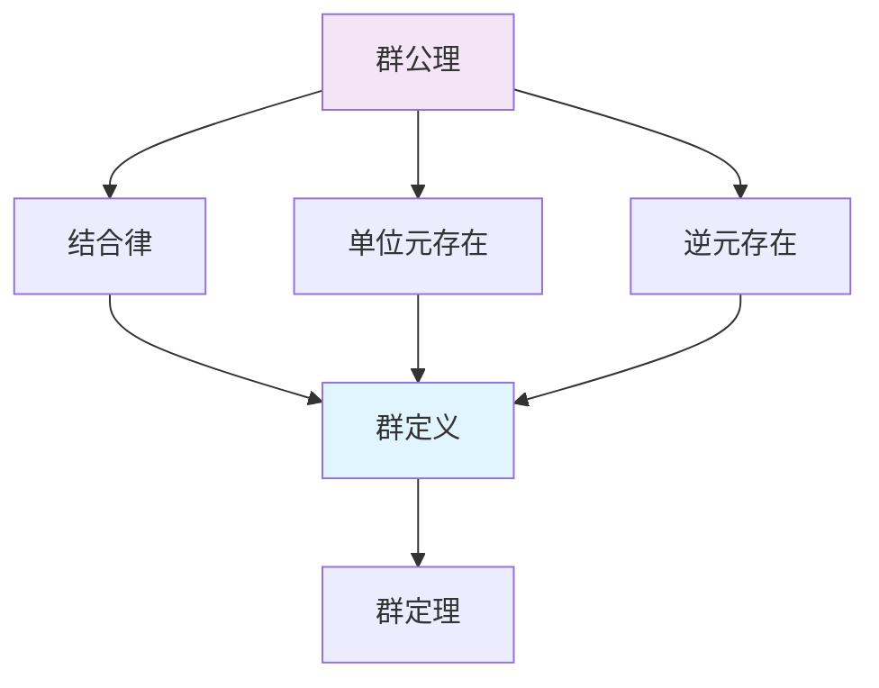
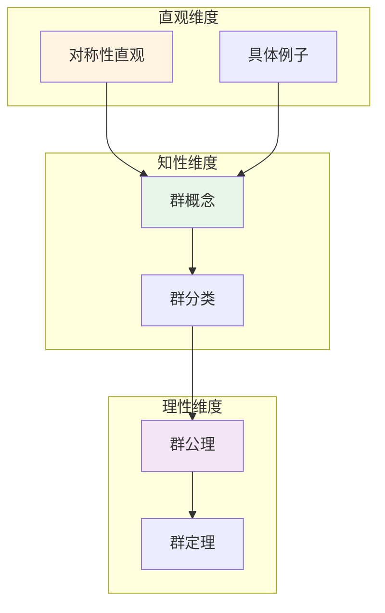

# 认知方式表征综合

**主题编号**: C.04.07
**创建日期**: 2025年11月21日
**最后更新**: 2025年11月21日

---

## 📋 概述

本文档整合多种认知方式表征，包括直观、知性、理性等维度的结构关系表征，以及思维导图、认知建模视图、多维矩阵对比、图表达和转换等认知工具的综合应用。

**目标**: 建立完整的认知方式表征体系，整合不同认知维度和工具

---

## 🎯 一、认知维度框架 (编号: C.04.07.01)

### 1.1 直观-知性-理性三维认知模型

### 1.2 认知维度特征矩阵

| 认知维度 | 特征 | 数学表现 | 工具支持 | 学习阶段 |
|---------|------|---------|---------|---------|
| **直观维度** | 感性认识、形象思维、具体实例 | 几何图形、物理直觉、具体例子 | 思维导图、可视化图表 | 入门阶段 |
| **知性维度** | 概念理解、分类归纳、抽象思维 | 概念定义、分类体系、抽象结构 | 概念地图、知识矩阵 | 中级阶段 |
| **理性维度** | 逻辑推理、形式化证明、系统建构 | 严格证明、公理体系、形式化系统 | 证明系统、形式化工具 | 高级阶段 |

---

## 🗺️ 二、认知方式表征工具整合 (编号: C.04.07.02)

### 2.1 思维导图与认知维度结合

#### 直观维度思维导图

- **特点**: 强调形象化、具体化、可视化
- **应用**: 几何概念、具体例子、形象类比
- **示例**: 群论的对称性可视化、函数的图像表示

#### 知性维度思维导图

- **特点**: 强调概念关系、分类体系、抽象结构
- **应用**: 概念分类、层次结构、关联关系
- **示例**: 代数结构的分类体系、拓扑空间的层次结构

#### 理性维度思维导图

- **特点**: 强调逻辑结构、证明路径、形式化体系
- **应用**: 定理证明、公理体系、形式化系统
- **示例**: ZFC公理体系、范畴论的形式化结构

### 2.2 认知建模视图

#### 视图1: 直观建模视图

**应用场景**:

- 初学者理解抽象概念
- 几何概念的直观理解
- 物理现象的数学建模

#### 视图2: 知性建模视图

**应用场景**:

- 概念的系统化理解
- 知识结构的组织
- 学习路径的规划

#### 视图3: 理性建模视图

**应用场景**:

- 严格的理论建构
- 形式化证明
- 系统化知识体系

---

## 📊 三、多维矩阵对比分析 (编号: C.04.07.03)

### 3.1 认知维度-知识层次矩阵

| 知识层次 | 直观维度 | 知性维度 | 理性维度 | 主要维度 |
|---------|---------|---------|---------|---------|
| **L0基础** | ⭐⭐⭐⭐⭐ | ⭐⭐⭐ | ⭐⭐ | 直观 |
| **L1中级** | ⭐⭐⭐ | ⭐⭐⭐⭐⭐ | ⭐⭐⭐ | 知性 |
| **L2高级** | ⭐⭐ | ⭐⭐⭐⭐ | ⭐⭐⭐⭐⭐ | 理性 |
| **L3研究** | ⭐ | ⭐⭐⭐ | ⭐⭐⭐⭐⭐ | 理性 |

**说明**: 不同知识层次需要不同的认知维度支持

### 3.2 认知维度-数学分支矩阵

| 数学分支 | 直观维度 | 知性维度 | 理性维度 | 主要维度 |
|---------|---------|---------|---------|---------|
| **几何学** | ⭐⭐⭐⭐⭐ | ⭐⭐⭐⭐ | ⭐⭐⭐ | 直观 |
| **分析学** | ⭐⭐⭐⭐ | ⭐⭐⭐⭐⭐ | ⭐⭐⭐⭐ | 知性 |
| **代数结构** | ⭐⭐⭐ | ⭐⭐⭐⭐⭐ | ⭐⭐⭐⭐⭐ | 知性+理性 |
| **拓扑学** | ⭐⭐⭐ | ⭐⭐⭐⭐ | ⭐⭐⭐⭐⭐ | 理性 |
| **数论** | ⭐⭐⭐ | ⭐⭐⭐⭐ | ⭐⭐⭐⭐⭐ | 理性 |
| **逻辑学** | ⭐⭐ | ⭐⭐⭐ | ⭐⭐⭐⭐⭐ | 理性 |

### 3.3 认知工具-认知维度矩阵

| 认知工具 | 直观维度 | 知性维度 | 理性维度 | 主要支持 |
|---------|---------|---------|---------|---------|
| **思维导图** | ⭐⭐⭐⭐⭐ | ⭐⭐⭐⭐ | ⭐⭐⭐ | 直观+知性 |
| **概念地图** | ⭐⭐⭐ | ⭐⭐⭐⭐⭐ | ⭐⭐⭐⭐ | 知性 |
| **知识矩阵** | ⭐⭐ | ⭐⭐⭐⭐⭐ | ⭐⭐⭐⭐ | 知性+理性 |
| **知识图谱** | ⭐⭐⭐ | ⭐⭐⭐⭐⭐ | ⭐⭐⭐⭐ | 知性 |
| **证明系统** | ⭐ | ⭐⭐⭐ | ⭐⭐⭐⭐⭐ | 理性 |
| **形式化工具** | ⭐ | ⭐⭐ | ⭐⭐⭐⭐⭐ | 理性 |

---

## 🔄 四、图表达和转换 (编号: C.04.07.04)

### 4.1 不同图形表示形式

#### 形式1: 树状结构（思维导图）

#### 形式2: 网络结构（知识图谱）

#### 形式3: 矩阵结构（知识矩阵）

| 认知维度 | 直观 | 知性 | 理性 |
|---------|------|------|------|
| **理解方式** | 形象化 | 概念化 | 形式化 |
| **工具支持** | 思维导图 | 概念地图 | 证明系统 |

### 4.2 图形表示转换规则

#### 转换1: 思维导图 → 知识图谱

- **规则**: 将树状结构转换为网络结构
- **方法**:
  1. 识别中心节点
  2. 提取分支关系
  3. 建立节点连接
  4. 添加关系标签

#### 转换2: 知识图谱 → 知识矩阵

- **规则**: 将网络结构转换为矩阵表示
- **方法**:
  1. 提取节点集合
  2. 建立关系矩阵
  3. 量化关系强度
  4. 组织矩阵结构

#### 转换3: 知识矩阵 → 思维导图

- **规则**: 将矩阵表示转换为树状结构
- **方法**:
  1. 识别核心概念
  2. 建立层次关系
  3. 组织分支结构
  4. 添加可视化元素

### 4.3 图形表示选择指南

| 目标 | 推荐形式 | 原因 |
|-----|---------|------|
| **知识梳理** | 思维导图 | 层次清晰，易于理解 |
| **关系分析** | 知识图谱 | 网络结构，关系完整 |
| **对比分析** | 知识矩阵 | 矩阵形式，易于比较 |
| **系统建构** | 形式化系统 | 严格结构，逻辑清晰 |

---

## 🎨 五、认知方式表征应用示例 (编号: C.04.07.05)

### 5.1 群论概念的认知方式表征

#### 直观维度表征

**说明**: 通过对称性的直观理解引入群的概念

#### 知性维度表征

**说明**: 通过概念分类和关系理解群的结构

#### 理性维度表征

**说明**: 通过公理体系和逻辑推理严格定义群

### 5.2 多维度整合表征

---

## 🔗 六、与其他认知工具的整合 (编号: C.04.07.06)

### 6.1 与思维模型工具的整合

- **概念地图**: 支持知性维度的概念关系分析
- **思维导图**: 支持直观维度的知识梳理
- **知识图谱**: 支持多维度关系的网络分析
- **概念层次**: 支持理性维度的层次结构分析

### 6.2 与知识组织方法的整合

- **分类法**: 支持知性维度的概念分类
- **层次法**: 支持理性维度的层次结构
- **关联法**: 支持多维度关系的关联分析
- **矩阵法**: 支持多维度对比分析

### 6.3 与学习策略工具的整合

- **渐进式学习**: 从直观到知性到理性
- **关联式学习**: 通过多维度关联理解
- **对比式学习**: 通过多维度对比理解
- **应用式学习**: 通过多维度应用理解

---

## 📚 七、使用建议 (编号: C.04.07.07)

### 7.1 根据学习阶段选择认知维度

- **入门阶段**: 主要使用直观维度，通过具体例子和形象类比理解概念
- **中级阶段**: 主要使用知性维度，通过概念分类和关系理解结构
- **高级阶段**: 主要使用理性维度，通过公理体系和逻辑推理严格理解

### 7.2 根据数学分支选择认知维度

- **几何学**: 优先使用直观维度，结合几何图形理解
- **分析学**: 优先使用知性维度，结合概念体系理解
- **代数结构**: 结合知性和理性维度，既要有概念理解，又要有严格证明
- **拓扑学**: 优先使用理性维度，通过公理体系理解

### 7.3 根据学习目标选择图形表示

- **知识梳理**: 使用思维导图
- **关系分析**: 使用知识图谱
- **对比分析**: 使用知识矩阵
- **系统建构**: 使用形式化系统

---

## 🔗 关联文档

- [思维模型工具 (C.04.01)](./01-思维模型工具.md)
- [知识组织方法 (C.04.02)](./02-知识组织方法.md)
- [认知工具应用指南 (C.04.03)](./03-认知工具应用指南.md)
- [总体思维导图总览](../01-总体思维导图/00-总体思维导图总览.md)
- [知识矩阵总览](../02-知识矩阵/00-知识矩阵总览.md)

---

**创建日期**: 2025年11月21日
**最后更新**: 2025年11月21日
**维护状态**: 持续更新中
