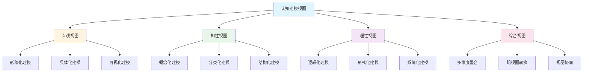
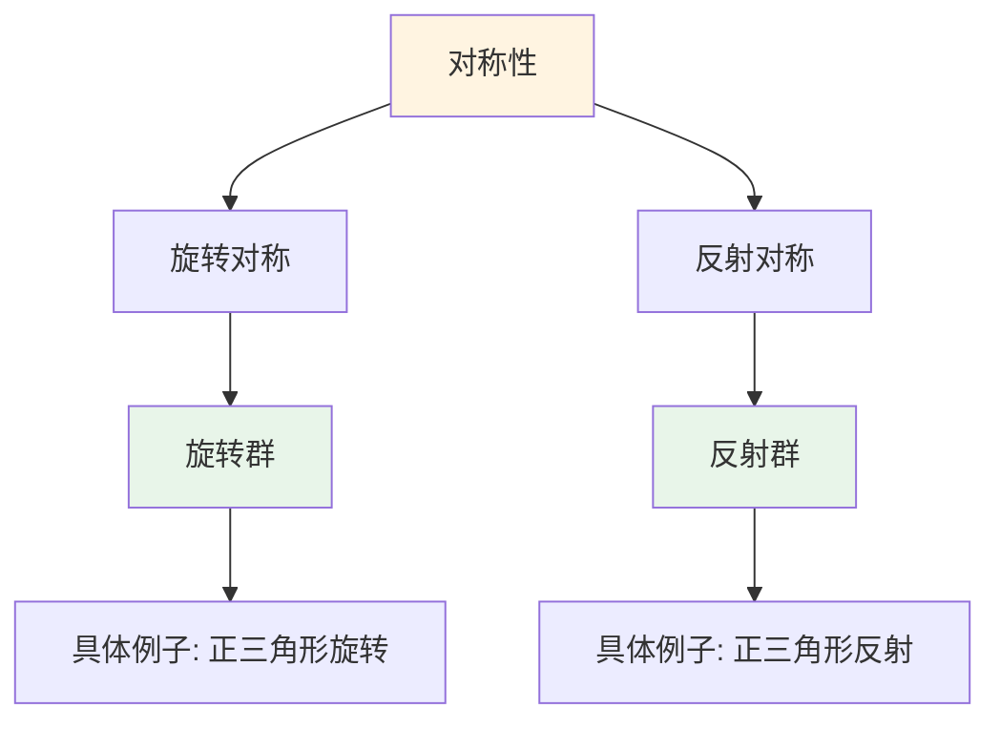
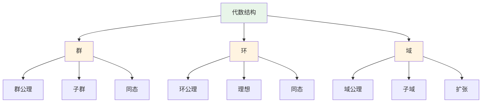
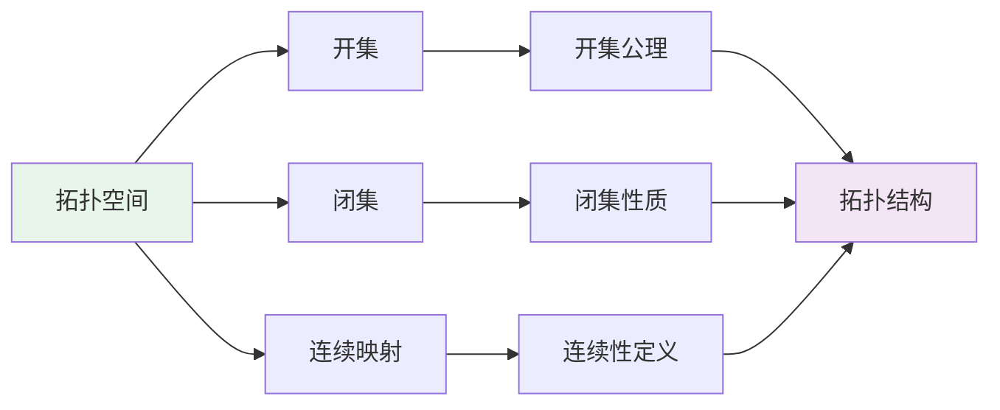
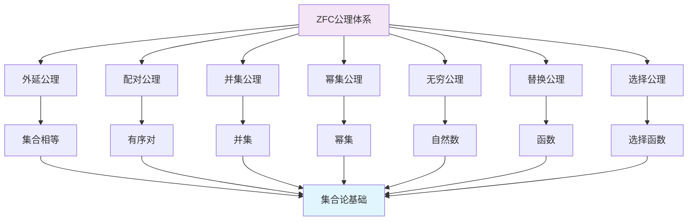
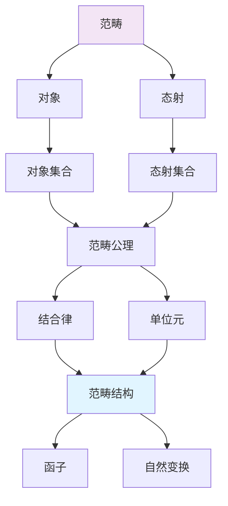
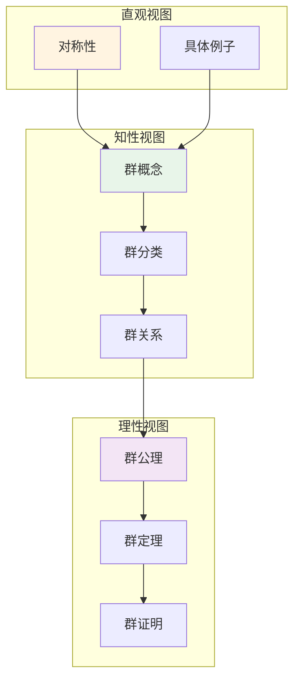

# 认知建模视图

**主题编号**: C.04.08
**创建日期**: 2025年11月21日
**最后更新**: 2025年11月21日

---

## 📋 概述

本文档提供多种认知建模视图，展示如何从不同认知视角对数学知识进行建模，包括直观视图、知性视图、理性视图以及综合视图。

**目标**: 建立多视角的认知建模体系

---

## 🎯 一、认知建模视图框架 (编号: C.04.08.01)

### 1.1 视图分类



---

## 🖼️ 二、直观视图建模 (编号: C.04.08.02)

### 2.1 直观视图特征

- **目标**: 通过形象化、具体化、可视化理解数学概念
- **方法**: 几何图形、物理直觉、具体例子、形象类比
- **适用**: 入门学习、几何概念、直观理解

### 2.2 直观视图建模示例

#### 示例1: 函数的直观视图

```mermaid
graph LR
    A[输入x] --> B[函数f]
    B --> C[输出f(x)]

    D[具体例子] --> E[x=2]
    E --> F[f(x)=x²]
    F --> G[f(2)=4]

    H[图像表示] --> I[y=x²的抛物线]

    style A fill:#fff4e1
    style C fill:#e8f5e9
```

**建模要素**:

- **输入输出关系**: 直观展示函数的映射关系
- **具体例子**: 通过具体数值理解函数
- **图像表示**: 通过几何图形理解函数性质

#### 示例2: 群的直观视图



**建模要素**:

- **对称性直观**: 通过几何对称理解群
- **具体例子**: 通过具体图形理解群结构
- **操作直观**: 通过操作理解群运算

### 2.3 直观视图建模方法

| 方法 | 描述 | 应用场景 |
|-----|------|---------|
| **形象类比** | 用熟悉的事物类比数学概念 | 初学者理解抽象概念 |
| **几何图形** | 用几何图形表示数学对象 | 几何、拓扑概念 |
| **具体例子** | 用具体数值或对象理解概念 | 函数、运算概念 |
| **物理直觉** | 用物理现象理解数学概念 | 分析学、几何学 |

---

## 🧠 三、知性视图建模 (编号: C.04.08.03)

### 3.1 知性视图特征

- **目标**: 通过概念化、分类化、结构化理解数学知识
- **方法**: 概念定义、分类体系、层次结构、关联关系
- **适用**: 中级学习、概念理解、知识组织

### 3.2 知性视图建模示例

#### 示例1: 代数结构的知性视图



**建模要素**:

- **概念分类**: 按结构类型分类
- **概念关系**: 展示概念间的关联
- **层次结构**: 展示概念的层次关系

#### 示例2: 拓扑空间的知性视图



**建模要素**:

- **概念定义**: 严格定义核心概念
- **公理体系**: 展示公理结构
- **概念关联**: 展示概念间的关系

### 3.3 知性视图建模方法

| 方法 | 描述 | 应用场景 |
|-----|------|---------|
| **概念地图** | 用概念地图表示概念关系 | 概念理解、知识组织 |
| **分类体系** | 用分类体系组织概念 | 概念分类、知识结构 |
| **层次结构** | 用层次结构表示抽象层次 | 学习路径、知识层次 |
| **关联网络** | 用关联网络表示概念关系 | 知识关联、交叉领域 |

---

## 🔬 四、理性视图建模 (编号: C.04.08.04)

### 4.1 理性视图特征

- **目标**: 通过逻辑化、形式化、系统化严格理解数学理论
- **方法**: 公理体系、形式化定义、逻辑推理、证明系统
- **适用**: 高级学习、理论研究、形式化系统

### 4.2 理性视图建模示例

#### 示例1: ZFC公理体系的理性视图



**建模要素**:

- **公理基础**: 展示公理体系
- **逻辑结构**: 展示逻辑关系
- **系统建构**: 展示系统化结构

#### 示例2: 范畴论的理性视图



**建模要素**:

- **形式化定义**: 严格定义核心概念
- **公理体系**: 展示公理结构
- **逻辑推理**: 展示逻辑关系

### 4.3 理性视图建模方法

| 方法 | 描述 | 应用场景 |
|-----|------|---------|
| **公理体系** | 用公理体系构建理论 | 基础理论、形式化系统 |
| **形式化定义** | 用形式化语言定义概念 | 严格理论、计算机实现 |
| **证明系统** | 用证明系统展示推理 | 定理证明、逻辑推理 |
| **系统建构** | 用系统化方法组织理论 | 理论体系、知识系统 |

---

## 🔄 五、综合视图建模 (编号: C.04.08.05)

### 5.1 综合视图特征

- **目标**: 整合多种认知视角，全面理解数学知识
- **方法**: 多维度整合、跨视图转换、视图协同
- **适用**: 全面学习、深入研究、系统理解

### 5.2 综合视图建模示例

#### 示例: 群论的综合视图



**建模要素**:

- **多维度整合**: 整合直观、知性、理性三个维度
- **视图转换**: 展示不同视图间的转换关系
- **视图协同**: 展示视图间的协同作用

### 5.3 综合视图建模方法

| 方法 | 描述 | 应用场景 |
|-----|------|---------|
| **多维度整合** | 整合多个认知维度 | 全面理解、系统学习 |
| **跨视图转换** | 在不同视图间转换 | 深入学习、灵活理解 |
| **视图协同** | 协同使用多个视图 | 复杂概念、交叉领域 |

---

## 📊 六、视图选择指南 (编号: C.04.08.06)

### 6.1 根据学习阶段选择视图

| 学习阶段 | 推荐视图 | 原因 |
|---------|---------|------|
| **入门阶段** | 直观视图 | 通过形象化理解概念 |
| **中级阶段** | 知性视图 | 通过概念化理解结构 |
| **高级阶段** | 理性视图 | 通过形式化严格理解 |
| **研究阶段** | 综合视图 | 全面深入理解 |

### 6.2 根据数学分支选择视图

| 数学分支 | 推荐视图 | 原因 |
|---------|---------|------|
| **几何学** | 直观视图+知性视图 | 几何直观+概念理解 |
| **分析学** | 知性视图+理性视图 | 概念体系+严格证明 |
| **代数结构** | 知性视图+理性视图 | 抽象结构+形式化 |
| **拓扑学** | 理性视图 | 公理体系+逻辑推理 |
| **数论** | 理性视图 | 严格证明+逻辑推理 |

### 6.3 根据学习目标选择视图

| 学习目标 | 推荐视图 | 原因 |
|---------|---------|------|
| **快速理解** | 直观视图 | 形象化、具体化 |
| **系统学习** | 知性视图 | 概念化、结构化 |
| **深入研究** | 理性视图 | 形式化、系统化 |
| **全面掌握** | 综合视图 | 多维度、全方位 |

---

## 🔗 七、与其他工具的整合 (编号: C.04.08.07)

### 7.1 与思维导图的整合

- **直观视图**: 使用思维导图展示形象化内容
- **知性视图**: 使用思维导图展示概念结构
- **理性视图**: 使用思维导图展示逻辑结构

### 7.2 与知识矩阵的整合

- **直观视图**: 矩阵展示直观理解程度
- **知性视图**: 矩阵展示概念理解程度
- **理性视图**: 矩阵展示形式化程度

### 7.3 与知识图谱的整合

- **直观视图**: 图谱展示形象化关系
- **知性视图**: 图谱展示概念关系
- **理性视图**: 图谱展示逻辑关系

---

## 🔗 关联文档

- [认知方式表征综合 (C.04.07)](./07-认知方式表征综合.md)
- [思维模型工具 (C.04.01)](./01-思维模型工具.md)
- [知识组织方法 (C.04.02)](./02-知识组织方法.md)
- [总体思维导图总览](../01-总体思维导图/00-总体思维导图总览.md)

---

**创建日期**: 2025年11月21日
**最后更新**: 2025年11月21日
**维护状态**: 持续更新中
