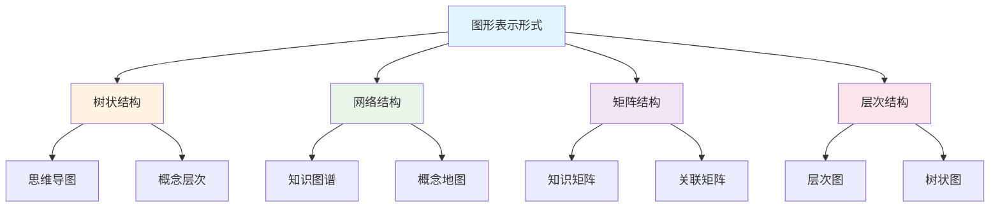
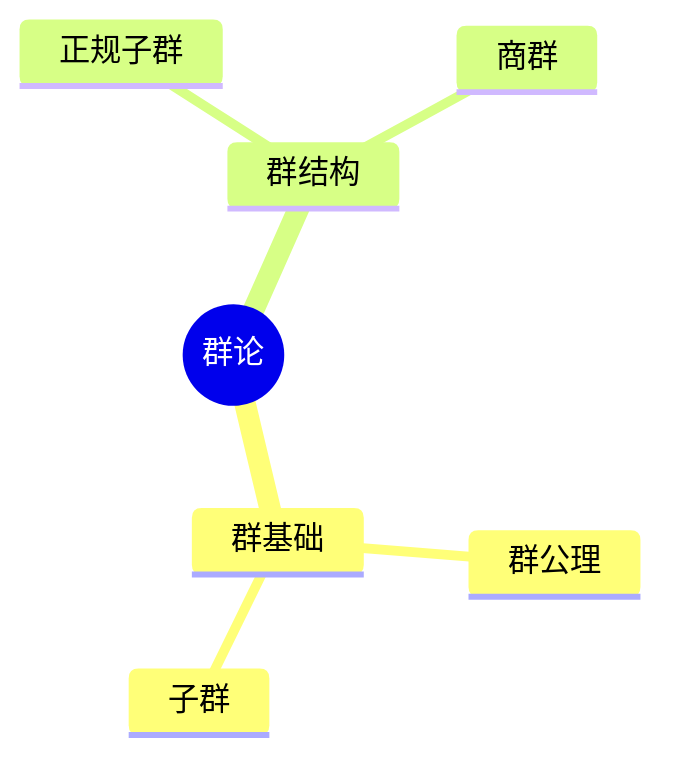
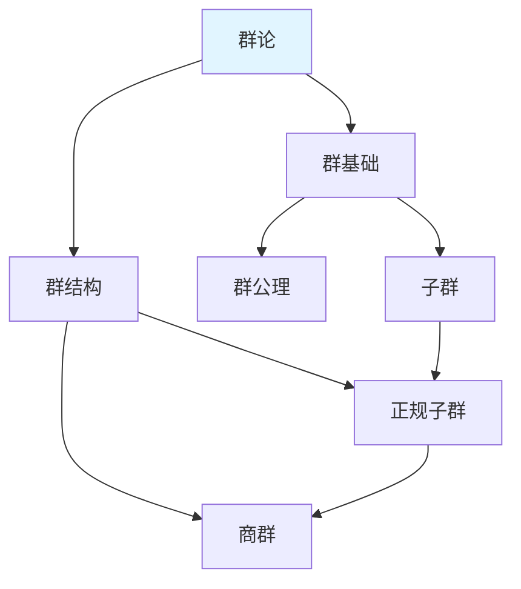
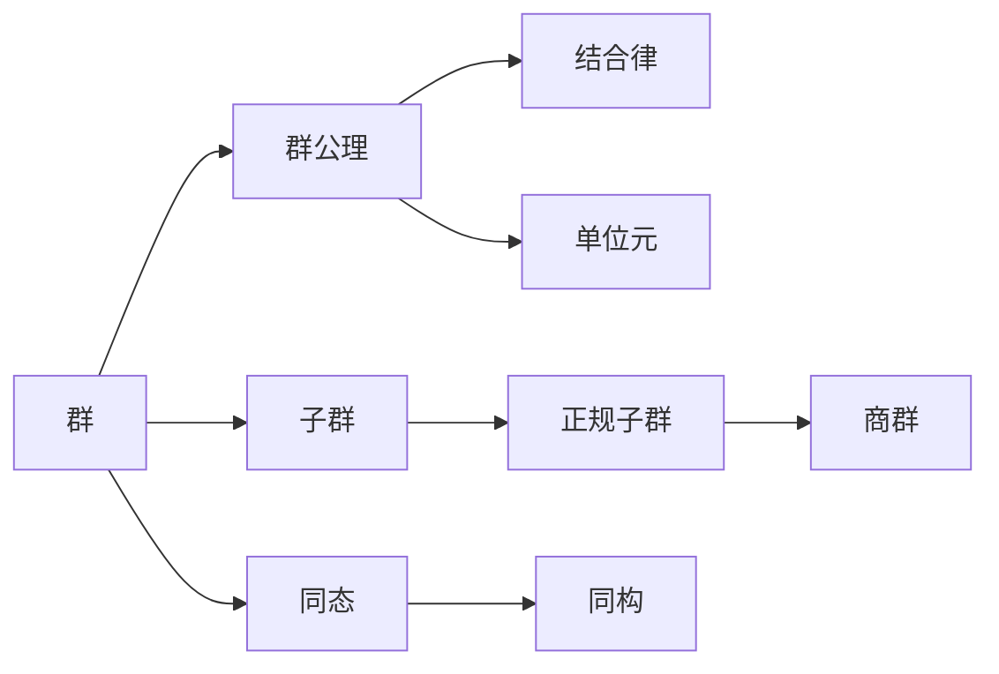
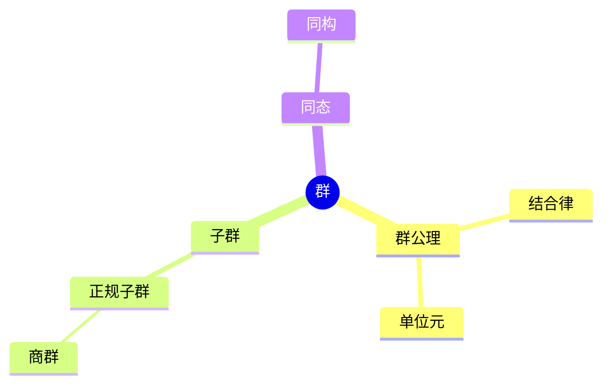
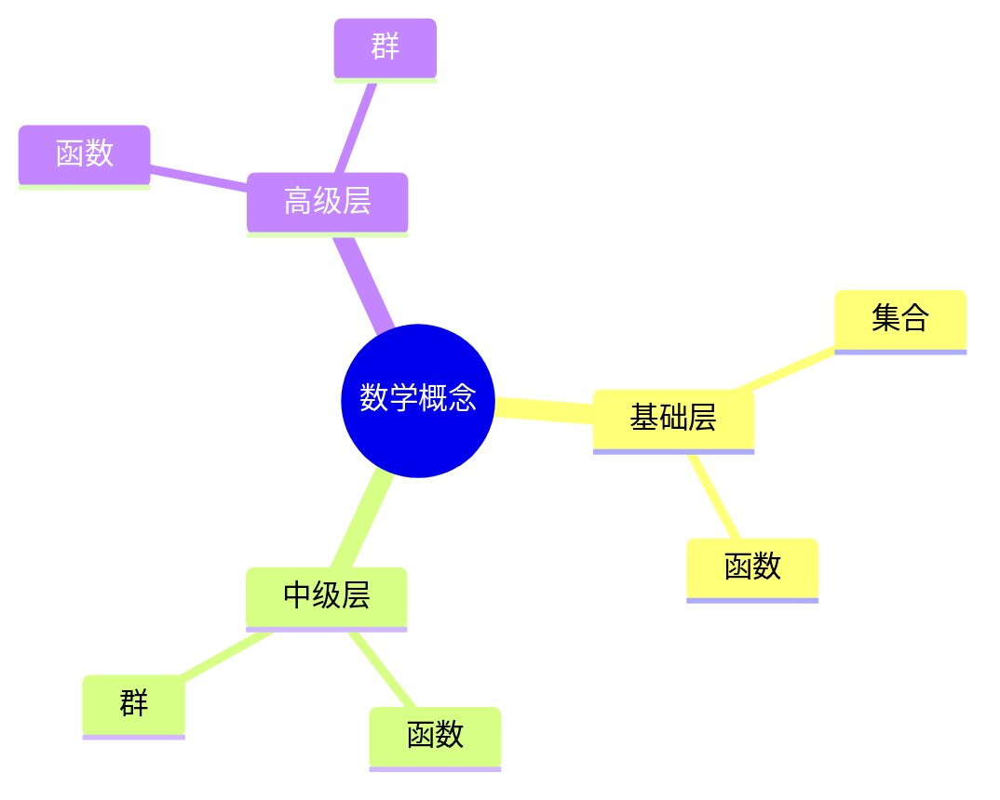
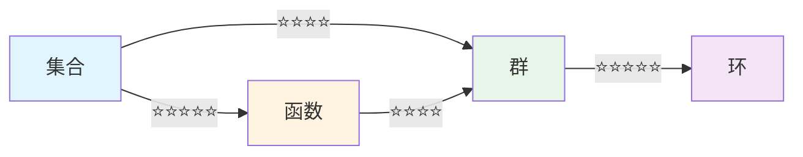
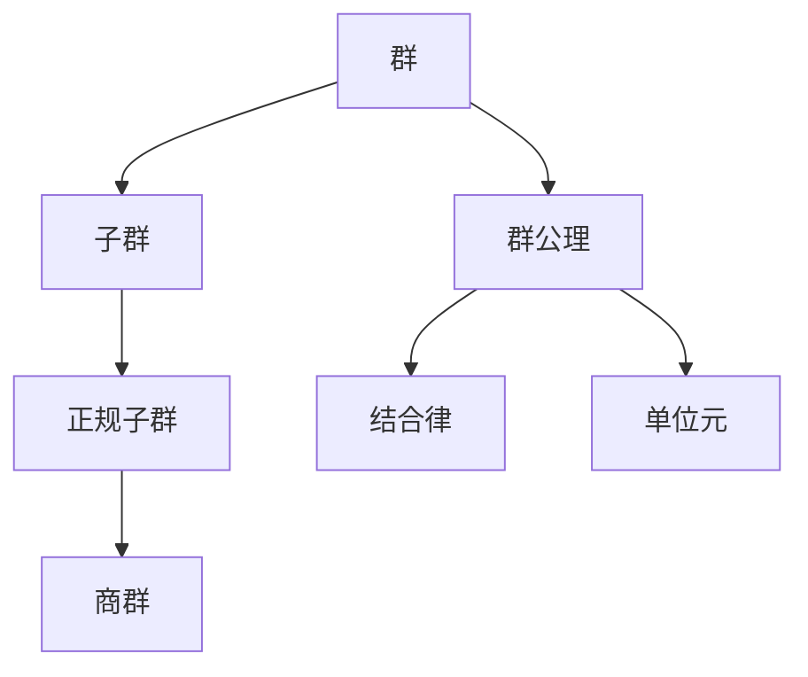

# 图表达和转换

**主题编号**: C.04.09
**创建日期**: 2025年11月21日
**最后更新**: 2025年11月21日

---

## 📋 概述

本文档提供不同图形表示形式之间的转换方法和规则，包括思维导图、知识图谱、知识矩阵、概念地图等图形表示之间的相互转换。

**目标**: 建立图形表示转换体系，实现不同表示形式间的灵活转换

---

## 🎯 一、图形表示形式分类 (编号: C.04.09.01)

### 1.1 图形表示类型

### 1.2 图形表示特征对比

| 表示形式 | 结构类型 | 关系表示 | 适用场景 | 优势 | 劣势 |
|---------|---------|---------|---------|------|------|
| **思维导图** | 树状 | 层次关系 | 知识梳理 | 层次清晰 | 关系单一 |
| **知识图谱** | 网络 | 多关系 | 关系分析 | 关系完整 | 复杂度高 |
| **知识矩阵** | 矩阵 | 量化关系 | 对比分析 | 易于比较 | 直观性差 |
| **概念地图** | 网络 | 概念关系 | 概念理解 | 关系清晰 | 规模限制 |

---

## 🔄 二、思维导图转换 (编号: C.04.09.02)

### 2.1 思维导图 → 知识图谱

#### 转换规则

1. **提取节点**: 从思维导图中提取所有节点
2. **识别关系**: 识别节点间的层次关系和关联关系
3. **建立连接**: 将层次关系转换为网络连接
4. **添加标签**: 为连接添加关系标签

#### 转换示例

**原始思维导图**:

**转换后的知识图谱**:

**转换要点**:

- 保留层次关系
- 添加横向关联（如子群→正规子群）
- 添加关系标签

### 2.2 思维导图 → 知识矩阵

#### 转换规则

1. **提取概念**: 从思维导图中提取所有概念
2. **建立维度**: 确定矩阵的行和列维度
3. **量化关系**: 将关系强度量化为数值
4. **组织矩阵**: 组织成矩阵形式

#### 转换示例

**原始思维导图**: 群论思维导图

**转换后的知识矩阵**:

| 概念 | 群基础 | 群结构 | 关联强度 |
|------|--------|--------|---------|
| **群公理** | ⭐⭐⭐⭐⭐ | ⭐⭐⭐ | ⭐⭐⭐⭐ |
| **子群** | ⭐⭐⭐⭐ | ⭐⭐⭐⭐ | ⭐⭐⭐⭐ |
| **正规子群** | ⭐⭐⭐ | ⭐⭐⭐⭐⭐ | ⭐⭐⭐⭐⭐ |
| **商群** | ⭐⭐ | ⭐⭐⭐⭐⭐ | ⭐⭐⭐⭐ |

**转换要点**:

- 提取所有概念节点
- 建立概念分类维度
- 量化关联强度

---

## 🔗 三、知识图谱转换 (编号: C.04.09.03)

### 3.1 知识图谱 → 思维导图

#### 转换规则

1. **识别核心节点**: 找到知识图谱中的核心节点
2. **建立层次结构**: 根据关系建立层次结构
3. **组织分支**: 将相关节点组织成分支
4. **简化关系**: 保留主要关系，简化次要关系

#### 转换示例

**原始知识图谱**:

**转换后的思维导图**:

**转换要点**:

- 选择核心节点作为根节点
- 按关系类型组织分支
- 简化复杂关系

### 3.2 知识图谱 → 知识矩阵

#### 转换规则

1. **提取节点和边**: 从知识图谱中提取所有节点和边
2. **建立节点矩阵**: 建立节点间的关联矩阵
3. **量化关系强度**: 将关系强度量化为数值
4. **组织矩阵结构**: 组织成矩阵形式

#### 转换示例

**原始知识图谱**: 群论知识图谱

**转换后的知识矩阵**:

| 节点A | 节点B | 关系类型 | 关系强度 |
|------|------|---------|---------|
| **群** | **群公理** | 包含 | ⭐⭐⭐⭐⭐ |
| **群** | **子群** | 包含 | ⭐⭐⭐⭐⭐ |
| **群** | **同态** | 包含 | ⭐⭐⭐⭐⭐ |
| **子群** | **正规子群** | 特殊化 | ⭐⭐⭐⭐ |
| **正规子群** | **商群** | 构造 | ⭐⭐⭐⭐⭐ |

**转换要点**:

- 提取所有节点对
- 标注关系类型
- 量化关系强度

---

## 📊 四、知识矩阵转换 (编号: C.04.09.04)

### 4.1 知识矩阵 → 思维导图

#### 转换规则

1. **识别核心概念**: 从矩阵中识别核心概念（高关联度）
2. **建立层次关系**: 根据矩阵值建立层次关系
3. **组织分支结构**: 将相关概念组织成分支
4. **添加可视化元素**: 添加颜色、图标等可视化元素

#### 转换示例

**原始知识矩阵**:

| 概念 | L0基础 | L1中级 | L2高级 | 综合评分 |
|------|--------|--------|--------|---------|
| **集合** | ⭐⭐⭐⭐⭐ | ⭐⭐⭐⭐ | ⭐⭐⭐ | 4.0 |
| **函数** | ⭐⭐⭐⭐⭐ | ⭐⭐⭐⭐⭐ | ⭐⭐⭐⭐ | 4.3 |
| **群** | ⭐⭐⭐⭐ | ⭐⭐⭐⭐⭐ | ⭐⭐⭐⭐ | 4.1 |

**转换后的思维导图**:

**转换要点**:

- 根据矩阵值确定层次
- 按层次组织概念
- 保留重要关联

### 4.2 知识矩阵 → 知识图谱

#### 转换规则

1. **提取概念**: 从矩阵中提取所有概念
2. **建立节点**: 为每个概念建立节点
3. **建立连接**: 根据矩阵值建立节点连接
4. **添加权重**: 根据矩阵值设置连接权重

#### 转换示例

**原始知识矩阵**: 概念关联矩阵

**转换后的知识图谱**:

**转换要点**:

- 根据矩阵值确定连接强度
- 设置连接权重
- 保留重要关联

---

## 🔄 五、转换规则总结 (编号: C.04.09.05)

### 5.1 转换规则矩阵

| 源形式 | 目标形式 | 转换规则 | 难度 | 信息损失 |
|--------|---------|---------|------|---------|
| **思维导图** | **知识图谱** | 提取节点+建立连接 | 低 | 低 |
| **思维导图** | **知识矩阵** | 提取概念+量化关系 | 中 | 中 |
| **知识图谱** | **思维导图** | 识别核心+建立层次 | 中 | 中 |
| **知识图谱** | **知识矩阵** | 提取节点对+量化强度 | 低 | 低 |
| **知识矩阵** | **思维导图** | 识别核心+组织分支 | 中 | 中 |
| **知识矩阵** | **知识图谱** | 提取概念+建立连接 | 低 | 低 |

### 5.2 转换工具

| 工具 | 功能 | 适用转换 |
|-----|------|---------|
| **Mermaid** | 图形绘制 | 思维导图↔知识图谱 |
| **Python** | 数据处理 | 知识矩阵转换 |
| **Graphviz** | 图形可视化 | 知识图谱绘制 |
| **Excel** | 矩阵处理 | 知识矩阵处理 |

---

## 🎨 六、转换应用示例 (编号: C.04.09.06)

### 6.1 群论知识的多形式表示

#### 形式1: 思维导图

#### 形式2: 知识图谱

#### 形式3: 知识矩阵

| 概念 | 群基础 | 群结构 | 关联强度 |
|------|--------|--------|---------|
| **群公理** | ⭐⭐⭐⭐⭐ | ⭐⭐⭐ | ⭐⭐⭐⭐ |
| **子群** | ⭐⭐⭐⭐ | ⭐⭐⭐⭐ | ⭐⭐⭐⭐ |
| **正规子群** | ⭐⭐⭐ | ⭐⭐⭐⭐⭐ | ⭐⭐⭐⭐⭐ |
| **商群** | ⭐⭐ | ⭐⭐⭐⭐⭐ | ⭐⭐⭐⭐ |

### 6.2 转换流程示例

---

## 📚 七、使用建议 (编号: C.04.09.07)

### 7.1 根据目标选择表示形式

| 目标 | 推荐形式 | 原因 |
|-----|---------|------|
| **知识梳理** | 思维导图 | 层次清晰 |
| **关系分析** | 知识图谱 | 关系完整 |
| **对比分析** | 知识矩阵 | 易于比较 |
| **概念理解** | 概念地图 | 关系清晰 |

### 7.2 根据内容选择表示形式

| 内容类型 | 推荐形式 | 原因 |
|---------|---------|------|
| **层次结构** | 思维导图 | 树状结构 |
| **复杂关系** | 知识图谱 | 网络结构 |
| **量化关系** | 知识矩阵 | 矩阵形式 |
| **概念关系** | 概念地图 | 关系清晰 |

### 7.3 转换时机

- **学习阶段转换**: 从思维导图到知识图谱，深入理解关系
- **分析需求转换**: 从知识图谱到知识矩阵，进行量化分析
- **展示需求转换**: 从知识矩阵到思维导图，简化展示

---

## 🔗 关联文档

- [思维模型工具 (C.04.01)](./01-思维模型工具.md)
- [认知方式表征综合 (C.04.07)](./07-认知方式表征综合.md)
- [认知建模视图 (C.04.08)](./08-认知建模视图.md)
- [多维矩阵对比分析 (C.02.11)](../02-知识矩阵/11-多维矩阵对比分析.md)

---

**创建日期**: 2025年11月21日
**最后更新**: 2025年11月21日
**维护状态**: 持续更新中
