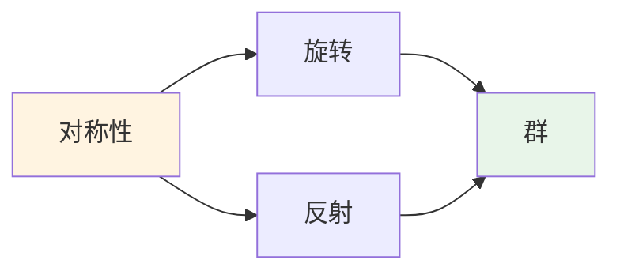
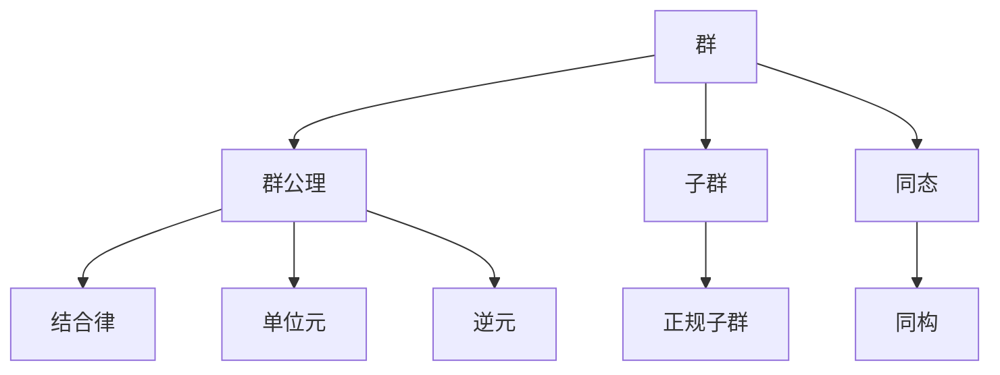
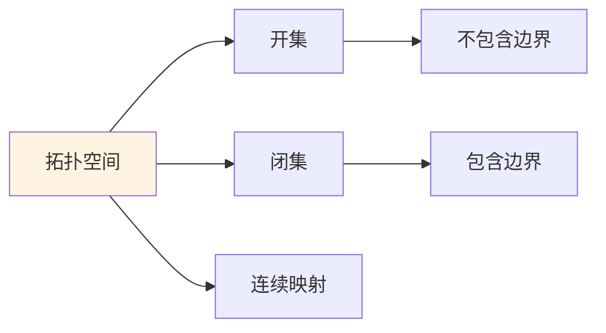
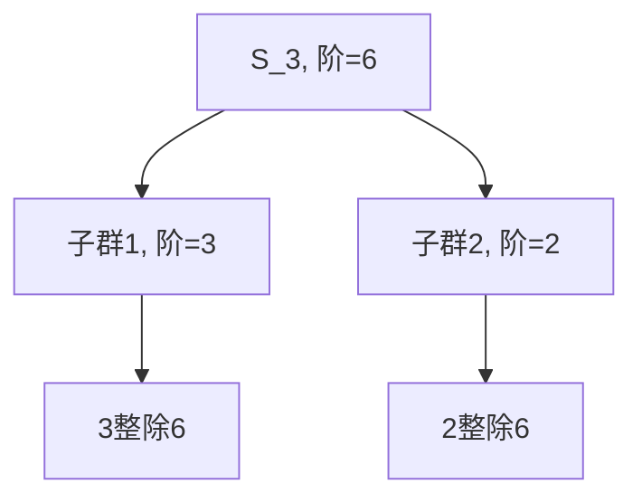
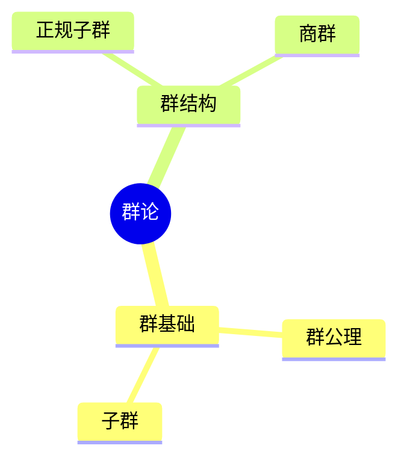
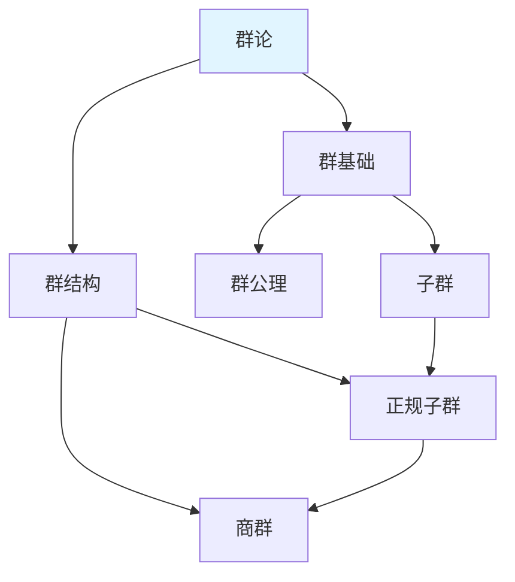
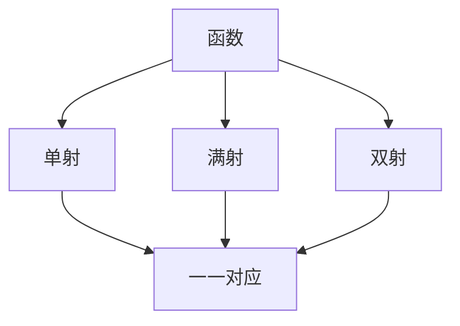

# 认知方式表征应用案例

**主题编号**: C.04.10
**创建日期**: 2025年11月21日
**最后更新**: 2025年11月21日

---

## 📋 概述

本文档提供认知方式表征在实际学习、研究和问题解决中的应用案例，展示如何综合运用直观、知性、理性等认知维度以及各种图形表示工具。

**目标**: 通过实际案例展示认知方式表征的综合应用

---

## 🎓 一、学习案例 (编号: C.04.10.01)

### 案例1: 学习群论概念

#### 阶段1: 直观维度理解

**目标**: 通过直观方式理解群的概念

**方法**:

1. **形象类比**: 用对称性理解群
   - 正三角形的旋转对称 → 旋转群
   - 正方形的反射对称 → 反射群

2. **具体例子**:
   - 整数加法群 $(\mathbb{Z}, +)$
   - 非零有理数乘法群 $(\mathbb{Q}^*, \cdot)$
   - 置换群 $S_n$

3. **可视化表示**:



**成果**: 建立对群的直观认识

#### 阶段2: 知性维度理解

**目标**: 通过概念化方式理解群的结构

**方法**:

1. **概念分类**:
   - 群 → 子群 → 正规子群 → 商群
   - 群 → 同态 → 同构

2. **概念地图**:



1. **知识矩阵**:
| 概念 | 群基础 | 群结构 | 关联强度 |
|------|--------|--------|---------|
| **群公理** | ⭐⭐⭐⭐⭐ | ⭐⭐⭐ | ⭐⭐⭐⭐ |
| **子群** | ⭐⭐⭐⭐ | ⭐⭐⭐⭐ | ⭐⭐⭐⭐ |
| **正规子群** | ⭐⭐⭐ | ⭐⭐⭐⭐⭐ | ⭐⭐⭐⭐⭐ |

**成果**: 建立群的概念体系

#### 阶段3: 理性维度理解

**目标**: 通过形式化方式严格理解群

**方法**:

1. **公理体系**:
   - 结合律公理
   - 单位元存在性公理
   - 逆元存在性公理

2. **形式化定义**:
   - 群 $(G, \cdot)$ 的定义
   - 子群的形式化定义
   - 同态的形式化定义

3. **证明系统**:
   - 拉格朗日定理的证明
   - 同态基本定理的证明

**成果**: 建立群的严格理论体系

#### 阶段4: 综合应用

**目标**: 整合三个维度，全面理解群

**方法**:

1. **多维度整合**: 结合直观、知性、理性三个维度
2. **图形转换**: 在思维导图、知识图谱、知识矩阵间转换
3. **实际应用**: 解决群论问题

**成果**: 全面掌握群的概念

---

### 案例2: 学习拓扑空间概念

#### 阶段1: 直观维度理解

**方法**:

1. **几何直观**:
   - 开集 = 不包含边界的集合
   - 闭集 = 包含边界的集合
   - 连续映射 = 不撕裂的映射

2. **具体例子**:
   - 实数上的开区间
   - 闭区间
   - 连续函数

**可视化**:



#### 阶段2: 知性维度理解

**方法**:

1. **概念体系**:
   - 拓扑空间 → 开集公理
   - 拓扑空间 → 连续映射
   - 拓扑空间 → 紧性、连通性

2. **知识矩阵**:
| 概念 | 基础 | 中级 | 高级 |
|------|------|------|------|
| **拓扑空间** | ⭐⭐⭐⭐⭐ | ⭐⭐⭐⭐ | ⭐⭐⭐ |
| **紧性** | ⭐⭐⭐ | ⭐⭐⭐⭐⭐ | ⭐⭐⭐⭐ |
| **连通性** | ⭐⭐⭐ | ⭐⭐⭐⭐⭐ | ⭐⭐⭐⭐ |

#### 阶段3: 理性维度理解

**方法**:

1. **公理体系**: 开集公理
2. **形式化定义**: 拓扑空间的严格定义
3. **定理证明**: 紧性定理、连通性定理

---

## 🔬 二、研究案例 (编号: C.04.10.02)

### 案例3: 研究代数几何方向

#### 阶段1: 领域调研

**方法**:

1. **知识图谱**: 构建代数几何的知识图谱
   - 概形理论
   - 层论
   - 上同调理论

2. **矩阵对比**: 对比代数几何与其他领域
   - 代数几何 vs 代数拓扑
   - 代数几何 vs 微分几何

#### 阶段2: 知识准备

**方法**:

1. **学习路径**: 从基础到高级
   - 环论 → 交换代数 → 概形理论
   - 拓扑学 → 层论 → 上同调

2. **认知维度**: 综合运用三个维度
   - 直观: 几何直观
   - 知性: 概念体系
   - 理性: 形式化理论

#### 阶段3: 研究方向选择

**方法**:

1. **矩阵分析**: 分析研究热点矩阵
2. **关联网络**: 分析概念关联网络
3. **综合判断**: 结合多个维度选择方向

---

## 💡 三、问题解决案例 (编号: C.04.10.03)

### 案例4: 解决群论问题

**问题**: 证明有限群的子群的阶整除群的阶（拉格朗日定理）

#### 步骤1: 直观理解

**方法**:

1. **具体例子**:
   - $S_3$ 的子群
   - 子群的阶与群的阶的关系

2. **可视化**:



#### 步骤2: 知性分析

**方法**:

1. **概念关系**:
   - 群 → 子群 → 陪集
   - 陪集分解

2. **知识矩阵**: 分析相关概念
| 概念 | 重要性 | 难度 |
|------|--------|------|
| **子群** | ⭐⭐⭐⭐⭐ | ⭐⭐⭐ |
| **陪集** | ⭐⭐⭐⭐⭐ | ⭐⭐⭐⭐ |
| **陪集分解** | ⭐⭐⭐⭐⭐ | ⭐⭐⭐⭐ |

#### 步骤3: 理性证明

**方法**:

1. **形式化证明**:
   - 陪集分解的严格证明
   - 拉格朗日定理的证明

2. **证明系统**: 使用形式化证明工具

---

## 🔄 四、图形转换案例 (编号: C.04.10.04)

### 案例5: 群论知识的图形转换

#### 转换1: 思维导图 → 知识图谱

**原始思维导图**:



**转换后的知识图谱**:



**转换要点**:

- 保留层次关系
- 添加横向关联
- 添加关系标签

#### 转换2: 知识图谱 → 知识矩阵

**原始知识图谱**: 群论知识图谱

**转换后的知识矩阵**:

| 概念 | 群基础 | 群结构 | 关联强度 |
|------|--------|--------|---------|
| **群公理** | ⭐⭐⭐⭐⭐ | ⭐⭐⭐ | ⭐⭐⭐⭐ |
| **子群** | ⭐⭐⭐⭐ | ⭐⭐⭐⭐ | ⭐⭐⭐⭐ |
| **正规子群** | ⭐⭐⭐ | ⭐⭐⭐⭐⭐ | ⭐⭐⭐⭐⭐ |
| **商群** | ⭐⭐ | ⭐⭐⭐⭐⭐ | ⭐⭐⭐⭐ |

**转换要点**:

- 提取所有概念节点
- 建立概念分类维度
- 量化关联强度

---

## 📊 五、多维度整合案例 (编号: C.04.10.05)

### 案例6: 函数概念的多维度理解

#### 直观维度

**方法**:

1. **图像表示**: 函数的图像
2. **具体例子**: $f(x) = x^2$
3. **物理类比**: 输入输出关系

**可视化**:

```mermaid
graph LR
    A[输入x] --> B[函数f]
    B --> C[输出f(x)]

    style A fill:#fff4e1
    style C fill:#e8f5e9
```

#### 知性维度

**方法**:

1. **概念分类**:
   - 函数 → 单射 → 双射
   - 函数 → 连续函数 → 可微函数

2. **概念地图**:



#### 理性维度

**方法**:

1. **形式化定义**: 函数的严格定义
2. **公理体系**: 函数公理
3. **定理证明**: 函数性质定理

#### 综合整合

**方法**:

1. **多维度整合**: 结合三个维度
2. **图形转换**: 在不同图形间转换
3. **矩阵分析**: 多维度矩阵分析

---

## 🎯 六、应用建议 (编号: C.04.10.06)

### 6.1 学习新概念

**步骤**:

1. **直观维度**: 通过具体例子和形象类比建立直观认识
2. **知性维度**: 通过概念分类和关系建立概念体系
3. **理性维度**: 通过形式化定义和证明建立严格理论
4. **综合整合**: 整合三个维度，全面理解

### 6.2 解决数学问题

**步骤**:

1. **直观理解**: 理解问题的直观含义
2. **知性分析**: 分析问题的概念结构
3. **理性解决**: 使用形式化方法解决
4. **综合验证**: 从多个维度验证结果

### 6.3 研究规划

**步骤**:

1. **知识图谱**: 构建领域的知识图谱
2. **矩阵分析**: 分析知识矩阵
3. **认知维度**: 确定需要的认知维度
4. **学习路径**: 规划学习路径

---

## 🔗 关联文档

- [认知方式表征综合 (C.04.07)](./07-认知方式表征综合.md)
- [认知建模视图 (C.04.08)](./08-认知建模视图.md)
- [图表达和转换 (C.04.09)](./09-图表达和转换.md)
- [认知工具应用指南 (C.04.03)](./03-认知工具应用指南.md)
- [实际应用案例 (C.00.07)](../00-实际应用案例.md)

---

**创建日期**: 2025年11月21日
**最后更新**: 2025年11月21日
**维护状态**: 持续更新中
