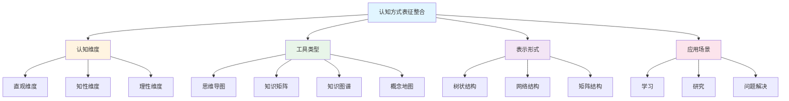
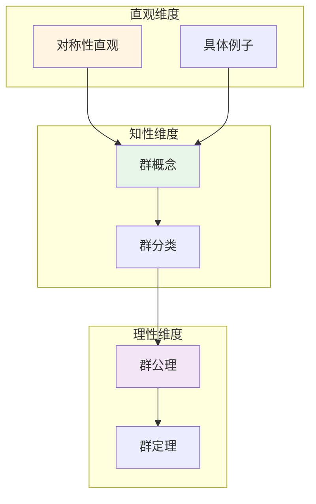
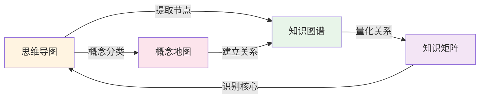
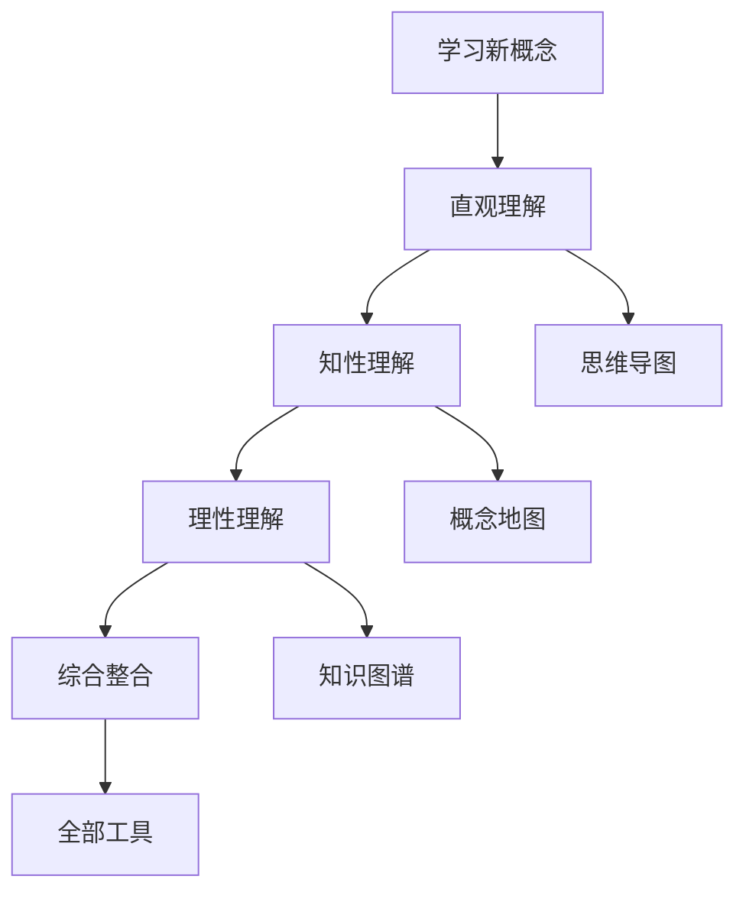

# 认知方式表征整合指南

**主题编号**: C.04.11
**创建日期**: 2025年11月21日
**最后更新**: 2025年11月21日

---

## 📋 概述

本文档提供认知方式表征的整合指南，说明如何将直观、知性、理性等认知维度与思维导图、知识矩阵、知识图谱等工具整合使用，形成完整的认知方式表征体系。

**目标**: 建立认知方式表征的整合使用框架

---

## 🎯 一、整合框架 (编号: C.04.11.01)

### 1.1 整合维度

### 1.2 整合原则

1. **多维度协同**: 结合直观、知性、理性三个维度
2. **工具互补**: 不同工具相互补充
3. **形式转换**: 在不同表示形式间灵活转换
4. **场景适配**: 根据应用场景选择合适组合

---

## 🔄 二、认知维度整合 (编号: C.04.11.02)

### 2.1 三维认知模型整合

#### 整合策略

| 学习阶段 | 主要维度 | 辅助维度 | 工具组合 |
|---------|---------|---------|---------|
| **入门** | 直观 | 知性 | 思维导图 + 可视化 |
| **中级** | 知性 | 直观+理性 | 概念地图 + 知识矩阵 |
| **高级** | 理性 | 知性 | 知识图谱 + 形式化系统 |
| **研究** | 综合 | 全部 | 全部工具整合 |

#### 整合示例

**群论概念的三维整合**:

---

## 🛠️ 三、工具类型整合 (编号: C.04.11.03)

### 3.1 工具组合策略

#### 组合1: 思维导图 + 知识矩阵

**适用场景**: 知识梳理和对比分析

**方法**:

1. 用思维导图梳理知识结构
2. 用知识矩阵进行对比分析
3. 两者相互补充

**示例**:

- 思维导图: 群论知识结构
- 知识矩阵: 群论概念对比

#### 组合2: 知识图谱 + 概念地图

**适用场景**: 关系分析和概念理解

**方法**:

1. 用知识图谱分析复杂关系
2. 用概念地图理解核心概念
3. 两者相互验证

**示例**:

- 知识图谱: 跨分支知识关联
- 概念地图: 核心概念关系

#### 组合3: 全部工具整合

**适用场景**: 全面学习和研究

**方法**:

1. 思维导图: 知识梳理
2. 知识矩阵: 对比分析
3. 知识图谱: 关系分析
4. 概念地图: 概念理解

---

## 📊 四、表示形式整合 (编号: C.04.11.04)

### 4.1 形式转换整合

#### 转换流程

#### 整合策略

| 起始形式 | 目标形式 | 转换方法 | 整合要点 |
|---------|---------|---------|---------|
| **思维导图** | **知识图谱** | 提取节点+建立连接 | 保留层次+添加横向关联 |
| **知识图谱** | **知识矩阵** | 提取节点对+量化强度 | 完整关系+量化分析 |
| **知识矩阵** | **思维导图** | 识别核心+组织分支 | 重要概念+层次结构 |
| **概念地图** | **知识图谱** | 扩展关系+网络化 | 核心概念+完整关系 |

---

## 🎓 五、应用场景整合 (编号: C.04.11.05)

### 5.1 学习场景整合

#### 场景1: 学习新概念

**整合方案**:

1. **直观维度**: 思维导图 + 可视化
2. **知性维度**: 概念地图 + 知识矩阵
3. **理性维度**: 知识图谱 + 形式化系统

**流程**:

#### 场景2: 复习已学知识

**整合方案**:

1. **知识矩阵**: 对比分析
2. **知识图谱**: 关系回顾
3. **思维导图**: 结构梳理

### 5.2 研究场景整合

#### 场景1: 领域调研

**整合方案**:

1. **知识图谱**: 构建领域知识网络
2. **知识矩阵**: 分析领域特征
3. **概念地图**: 理解核心概念

#### 场景2: 研究方向选择

**整合方案**:

1. **矩阵对比**: 对比不同方向
2. **图谱分析**: 分析关联网络
3. **综合判断**: 整合多个维度

### 5.3 问题解决场景整合

#### 场景1: 解决数学问题

**整合方案**:

1. **直观理解**: 思维导图理解问题
2. **知性分析**: 概念地图分析结构
3. **理性解决**: 知识图谱寻找方法

---

## 📋 六、整合检查清单 (编号: C.04.11.06)

### 6.1 认知维度检查

- [ ] 是否使用了直观维度？
- [ ] 是否使用了知性维度？
- [ ] 是否使用了理性维度？
- [ ] 三个维度是否相互补充？

### 6.2 工具类型检查

- [ ] 是否选择了合适的工具？
- [ ] 工具之间是否互补？
- [ ] 是否进行了工具整合？

### 6.3 表示形式检查

- [ ] 是否进行了形式转换？
- [ ] 转换是否正确？
- [ ] 不同形式是否一致？

### 6.4 应用场景检查

- [ ] 是否适配应用场景？
- [ ] 整合方案是否有效？
- [ ] 是否达到预期目标？

---

## 🎯 七、最佳实践 (编号: C.04.11.07)

### 7.1 学习新概念

1. **开始**: 使用思维导图建立直观认识
2. **深入**: 使用概念地图理解概念关系
3. **严格**: 使用知识图谱建立严格理论
4. **整合**: 使用知识矩阵进行对比分析

### 7.2 解决数学问题

1. **理解**: 使用思维导图理解问题
2. **分析**: 使用概念地图分析结构
3. **解决**: 使用知识图谱寻找方法
4. **验证**: 使用知识矩阵验证结果

### 7.3 研究规划

1. **调研**: 使用知识图谱构建领域网络
2. **分析**: 使用知识矩阵分析特征
3. **选择**: 使用概念地图理解核心概念
4. **规划**: 使用思维导图规划路径

---

## 🔗 关联文档

- [认知方式表征综合 (C.04.07)](./07-认知方式表征综合.md)
- [认知建模视图 (C.04.08)](./08-认知建模视图.md)
- [图表达和转换 (C.04.09)](./09-图表达和转换.md)
- [认知方式表征应用案例 (C.04.10)](./10-认知方式表征应用案例.md)
- [认知工具应用指南 (C.04.03)](./03-认知工具应用指南.md)

---

**创建日期**: 2025年11月21日
**最后更新**: 2025年11月21日
**维护状态**: 持续更新中
