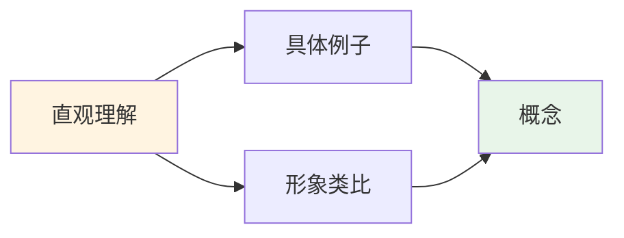
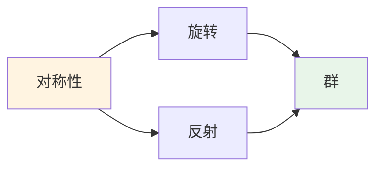
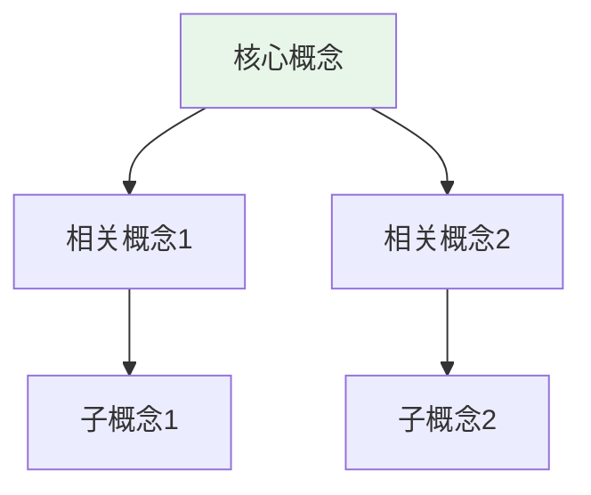
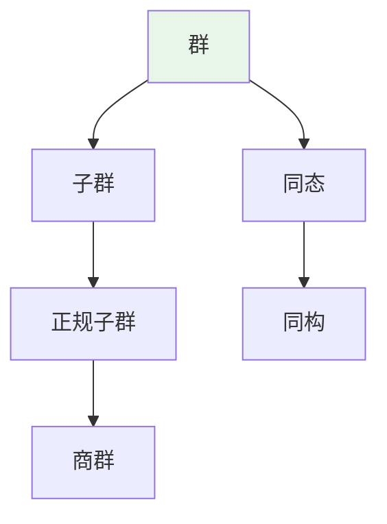
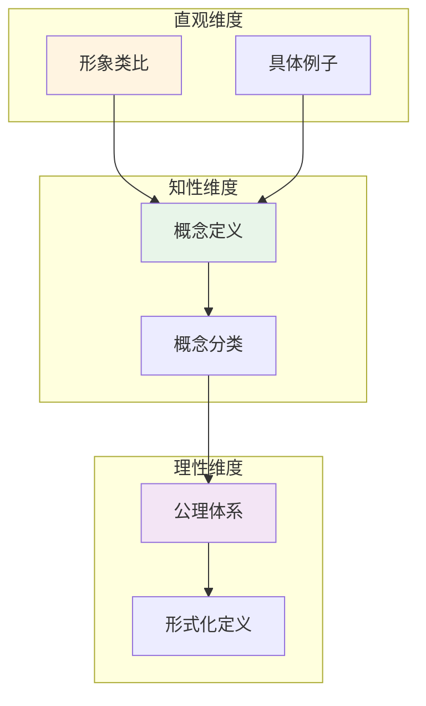

# 核心概念认知维度表征模板

**主题编号**: C.04.12
**创建日期**: 2025年11月21日
**最后更新**: 2025年11月21日

---

## 📋 概述

本文档提供核心概念的认知维度表征模板，用于为核心概念文档添加直观、知性、理性三个认知维度的表征内容。

**目标**: 为核心概念提供标准化的认知维度表征模板

---

## 🎯 一、认知维度表征结构 (编号: C.04.12.01)

### 1.1 标准结构

每个核心概念的认知维度表征应包含以下部分：

1. **直观维度表征** (编号: C.CORE.XXX.INTUITIVE)
   - 形象类比
   - 具体例子
   - 可视化表示
   - 几何直观

2. **知性维度表征** (编号: C.CORE.XXX.INTELLECTUAL)
   - 概念定义
   - 概念分类
   - 概念关系
   - 知识矩阵

3. **理性维度表征** (编号: C.CORE.XXX.RATIONAL)
   - 公理体系
   - 形式化定义
   - 逻辑推理
   - 证明系统

4. **综合整合表征** (编号: C.CORE.XXX.INTEGRATED)
   - 多维度整合
   - 图形转换
   - 应用示例

---

## 🖼️ 二、直观维度表征模板 (编号: C.04.12.02)

### 2.1 模板结构

```markdown
## 🎨 直观维度表征 (编号: C.CORE.XXX.INTUITIVE)

### 形象类比

- **类比1**: [描述类比]
- **类比2**: [描述类比]
- **类比3**: [描述类比]

### 具体例子

- **例子1**: [具体例子描述]
- **例子2**: [具体例子描述]
- **例子3**: [具体例子描述]

### 可视化表示



### 几何直观

- **几何表示**: [几何图形描述]
- **空间直觉**: [空间关系描述]

### 2.2 示例：群概念的直观维度表征

```markdown
## 🎨 直观维度表征 (编号: C.CORE.008.INTUITIVE)

### 形象类比

- **对称性类比**: 群就像"对称操作的集合"
  - 正三角形的旋转对称 → 旋转群
  - 正方形的反射对称 → 反射群

- **操作类比**: 群就像"可逆操作的集合"
  - 整数的加法 → 加法群
  - 非零有理数的乘法 → 乘法群

### 具体例子

- **例子1**: $(\mathbb{Z}, +)$ - 整数加法群
  - 单位元: 0
  - 逆元: $a$ 的逆元是 $-a$

- **例子2**: $S_3$ - 3个元素的对称群
  - 6个元素: 所有3个元素的置换
  - 运算: 置换的复合

### 可视化表示



### 几何直观示例

- **对称性**: 通过几何图形的对称性理解群
- **操作**: 通过几何变换理解群运算

---

## 🧠 三、知性维度表征模板 (编号: C.04.12.03)

### 3.1 模板结构

```markdown
## 🧠 知性维度表征 (编号: C.CORE.XXX.INTELLECTUAL)

### 概念定义

- **严格定义**: [形式化定义]
- **等价定义**: [等价定义]
- **特征描述**: [特征描述]

### 概念分类

- **分类1**: [分类描述]
- **分类2**: [分类描述]
- **分类3**: [分类描述]

### 概念关系



### 知识矩阵

| 维度 | 指标 | 评分 |
|------|------|------|
| **知识层次** | L0基础 | ⭐⭐⭐⭐⭐ |
| **知识领域** | D1基础数学 | ⭐⭐⭐⭐⭐ |
| **学习难度** | 直观理解 | ⭐⭐ |

### 3.2 示例：群概念的知性维度表征

```markdown
## 🧠 知性维度表征 (编号: C.CORE.008.INTELLECTUAL)

### 概念定义

- **严格定义**: 群 $(G, \cdot)$ 是满足结合律、有单位元、每个元素有逆元的代数结构
- **等价定义**: 群是满足左消去律和右消去律的半群
- **特征描述**: 群是研究对称性的数学工具

### 概念分类

- **有限群 vs 无限群**: 按元素个数分类
- **交换群 vs 非交换群**: 按运算交换性分类
- **循环群 vs 非循环群**: 按生成元分类

### 概念关系



### 知识矩阵示例

| 维度 | 指标 | 群 |
|------|------|------|
| **知识层次** | L0基础 | ⭐⭐⭐⭐ |
| | L1中级 | ⭐⭐⭐⭐⭐ |
| | L2高级 | ⭐⭐⭐⭐ |
| **知识领域** | D2代数 | ⭐⭐⭐⭐⭐ |
| **学习难度** | 直观理解 | ⭐⭐⭐ |
| | 形式化理解 | ⭐⭐⭐⭐ |

---

## 🔬 四、理性维度表征模板 (编号: C.04.12.04)

### 4.1 模板结构

```markdown
## 🔬 理性维度表征 (编号: C.CORE.XXX.RATIONAL)

### 公理体系

- **公理1**: [公理描述]
- **公理2**: [公理描述]
- **公理3**: [公理描述]

### 形式化定义

- **形式化定义**: [形式化语言描述]
- **符号系统**: [符号说明]
- **类型系统**: [类型说明]

### 逻辑推理

- **基本定理**: [定理描述]
- **证明思路**: [证明思路]
- **推理链**: [推理步骤]

### 证明系统

- **证明方法**: [证明方法]
- **形式化证明**: [形式化证明]
- **验证工具**: [验证工具]
```

### 4.2 示例：群概念的理性维度表征

```markdown
## 🔬 理性维度表征 (编号: C.CORE.008.RATIONAL)

### 公理体系

- **公理1 (结合律)**: $\forall a, b, c \in G, (a \cdot b) \cdot c = a \cdot (b \cdot c)$
- **公理2 (单位元存在性)**: $\exists e \in G, \forall a \in G, e \cdot a = a \cdot e = a$
- **公理3 (逆元存在性)**: $\forall a \in G, \exists a^{-1} \in G, a \cdot a^{-1} = a^{-1} \cdot a = e$

### 形式化定义

- **形式化定义**: 群 $(G, \cdot)$ 是满足群公理的代数结构
- **符号系统**: $G$ 表示群，$\cdot$ 表示群运算，$e$ 表示单位元，$a^{-1}$ 表示逆元
- **类型系统**: 群是集合类型配备运算类型

### 逻辑推理

- **基本定理**: 拉格朗日定理 - 有限群的子群的阶整除群的阶
- **证明思路**: 通过陪集分解证明
- **推理链**: 子群 → 陪集 → 陪集分解 → 拉格朗日定理

### 证明系统

- **证明方法**: 构造性证明、反证法、归纳法
- **形式化证明**: 可以使用Lean4等工具进行形式化
- **验证工具**: Metamath、Lean4等
```

---

## 🔄 五、综合整合表征模板 (编号: C.04.12.05)

### 5.1 模板结构

```markdown
## 🔄 综合整合表征 (编号: C.CORE.XXX.INTEGRATED)

### 多维度整合



### 图形转换

- **思维导图**: [思维导图描述]
- **知识图谱**: [知识图谱描述]
- **知识矩阵**: [知识矩阵描述]

### 应用示例

- **应用1**: [应用示例描述]
- **应用2**: [应用示例描述]

---

## 📋 六、使用指南 (编号: C.04.12.06)

### 6.1 使用步骤

1. **选择核心概念**: 确定要添加认知维度表征的概念
2. **填写直观维度**: 添加形象类比、具体例子、可视化表示
3. **填写知性维度**: 添加概念定义、分类、关系、矩阵
4. **填写理性维度**: 添加公理体系、形式化定义、逻辑推理
5. **整合表征**: 整合三个维度，创建综合表征

### 6.2 注意事项

- **一致性**: 确保三个维度的内容一致
- **完整性**: 尽量完整地填写各个部分
- **准确性**: 确保内容的准确性
- **可读性**: 保持内容的可读性

### 6.3 示例参考

可以参考以下核心概念文档的认知维度表征：

- [集合 (C.CORE.001)](../核心概念/01-集合.md)
- [群 (C.CORE.008)](../核心概念/08-群.md)
- [函数 (C.CORE.002)](../核心概念/02-函数.md)

---

## 🔗 关联文档

- [认知方式表征综合 (C.04.07)](./07-认知方式表征综合.md)
- [认知建模视图 (C.04.08)](./08-认知建模视图.md)
- [认知方式表征应用案例 (C.04.10)](./10-认知方式表征应用案例.md)
- [核心概念索引 (C.CORE.00)](../核心概念/00-核心概念索引.md)

---

**创建日期**: 2025年11月21日
**最后更新**: 2025年11月21日
**维护状态**: 持续更新中
