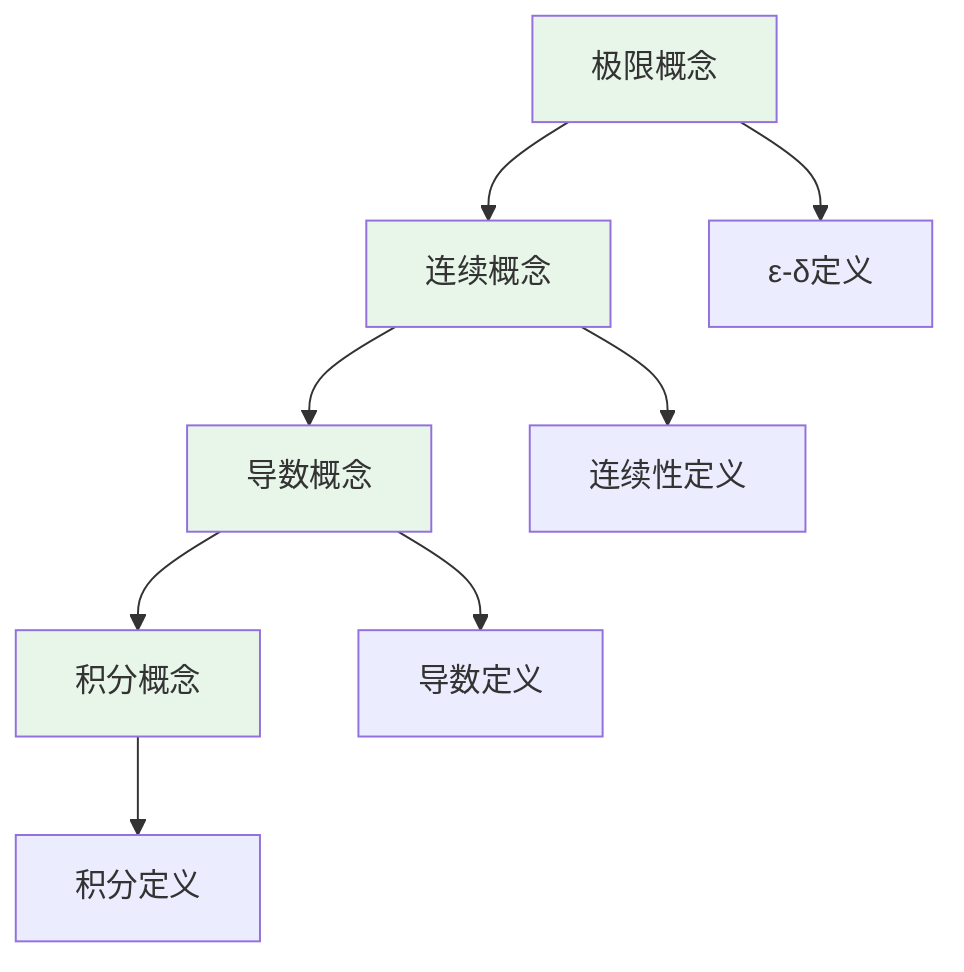
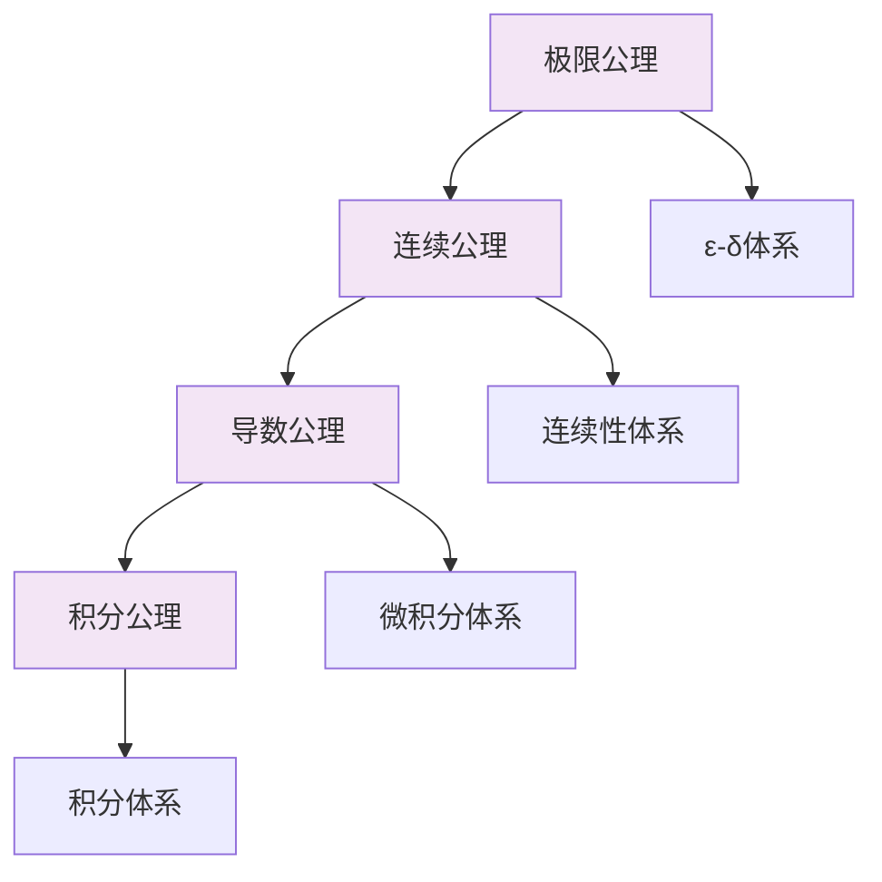
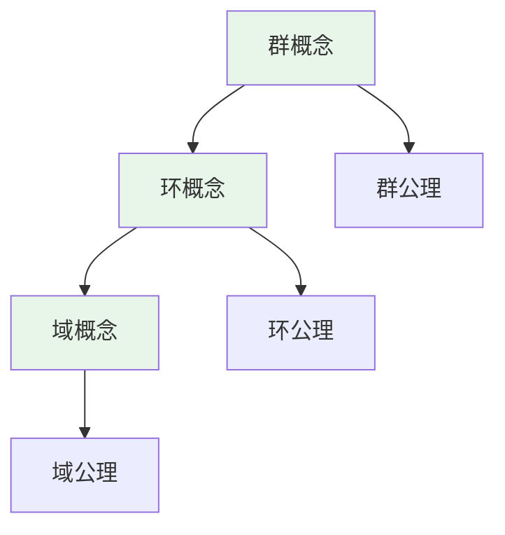
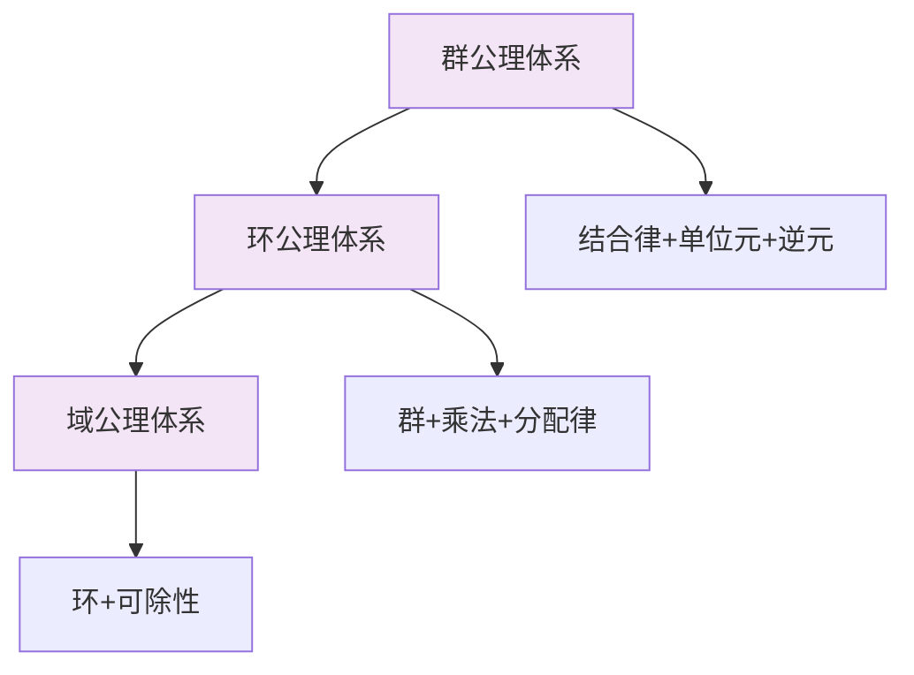
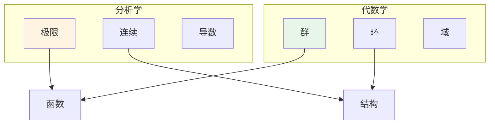
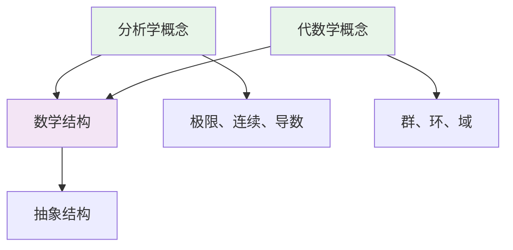

# 跨概念认知维度表征应用

**主题编号**: C.04.15
**创建日期**: 2025年11月21日
**最后更新**: 2025年11月21日

---

## 📋 概述

本文档提供跨概念的认知维度表征应用示例，展示如何将多个相关概念的认知维度表征整合使用，形成更完整的知识理解。

**目标**: 通过跨概念的认知维度表征，建立概念间的认知关联

---

## 🔗 一、分析学概念链的认知维度表征 (编号: C.04.15.01)

### 1.1 极限→连续→导数→积分的认知路径

#### 直观维度路径

**认知路径**:

1. **极限**: 理解"趋近值"的直观
2. **连续**: 理解"无跳跃"的直观
3. **导数**: 理解"变化率"的直观
4. **积分**: 理解"累积"的直观

#### 知性维度路径

**认知路径**:

1. **极限**: 建立极限的概念体系
2. **连续**: 基于极限定义连续性
3. **导数**: 基于极限定义导数
4. **积分**: 基于极限定义积分

#### 理性维度路径

**认知路径**:

1. **极限**: 建立ε-δ公理体系
2. **连续**: 基于极限建立连续性体系
3. **导数**: 基于极限建立微积分体系
4. **积分**: 基于极限建立积分体系

---

## 🔗 二、代数结构概念链的认知维度表征 (编号: C.04.15.02)

### 2.1 群→环→域的认知路径

#### 直观维度路径

**认知路径**:

1. **群**: 理解"对称操作"的直观
2. **环**: 理解"双运算"的直观
3. **域**: 理解"可除"的直观

#### 知性维度路径

**认知路径**:

1. **群**: 建立群的概念体系
2. **环**: 基于群添加乘法建立环
3. **域**: 基于环添加除法建立域

#### 理性维度路径

**认知路径**:

1. **群**: 建立群公理体系
2. **环**: 扩展群公理建立环公理
3. **域**: 扩展环公理建立域公理

---

## 🔄 三、跨分支概念关联的认知维度表征 (编号: C.04.15.03)

### 3.1 分析学与代数学的关联

#### 直观维度关联

**关联点**:

- **函数**: 分析学和代数学都研究函数
- **结构**: 都研究数学结构

#### 知性维度关联

**关联点**:

- **抽象结构**: 都研究抽象的数学结构
- **公理化方法**: 都使用公理化方法

---

## 📊 四、多维度整合矩阵 (编号: C.04.15.04)

### 4.1 分析学概念链的多维度矩阵

| 概念 | 直观维度 | 知性维度 | 理性维度 | 综合评分 |
|------|---------|---------|---------|---------|
| **极限** | ⭐⭐⭐⭐ | ⭐⭐⭐⭐⭐ | ⭐⭐⭐⭐⭐ | 4.7 |
| **连续** | ⭐⭐⭐⭐ | ⭐⭐⭐⭐⭐ | ⭐⭐⭐⭐ | 4.3 |
| **导数** | ⭐⭐⭐⭐⭐ | ⭐⭐⭐⭐⭐ | ⭐⭐⭐⭐ | 4.7 |
| **积分** | ⭐⭐⭐⭐⭐ | ⭐⭐⭐⭐⭐ | ⭐⭐⭐⭐ | 4.7 |
| **级数** | ⭐⭐⭐⭐ | ⭐⭐⭐⭐⭐ | ⭐⭐⭐⭐ | 4.3 |

### 4.2 代数结构概念链的多维度矩阵

| 概念 | 直观维度 | 知性维度 | 理性维度 | 综合评分 |
|------|---------|---------|---------|---------|
| **群** | ⭐⭐⭐⭐ | ⭐⭐⭐⭐⭐ | ⭐⭐⭐⭐⭐ | 4.7 |
| **环** | ⭐⭐⭐ | ⭐⭐⭐⭐⭐ | ⭐⭐⭐⭐ | 4.0 |
| **域** | ⭐⭐⭐ | ⭐⭐⭐⭐⭐ | ⭐⭐⭐⭐ | 4.0 |

---

## 🎯 五、应用示例 (编号: C.04.15.05)

### 示例1: 学习微积分概念链

#### 步骤1: 直观维度理解

1. **极限**: 通过"趋近值"理解
2. **连续**: 通过"无跳跃"理解
3. **导数**: 通过"变化率"理解
4. **积分**: 通过"累积"理解

#### 步骤2: 知性维度理解

1. **概念关系**: 理解概念间的依赖关系
2. **概念分类**: 理解每个概念的分类
3. **概念体系**: 建立完整的概念体系

#### 步骤3: 理性维度理解

1. **公理体系**: 理解每个概念的公理体系
2. **形式化定义**: 理解严格的形式化定义
3. **逻辑推理**: 理解概念间的逻辑关系

#### 步骤4: 综合整合

1. **多维度整合**: 整合三个维度
2. **图形转换**: 在不同图形表示间转换
3. **应用实践**: 应用到实际问题

---

### 示例2: 学习代数结构概念链

#### 步骤1: 直观维度理解

1. **群**: 通过"对称操作"理解
2. **环**: 通过"双运算"理解
3. **域**: 通过"可除"理解

#### 步骤2: 知性维度理解

1. **概念演进**: 理解从群到环到域的演进
2. **概念关系**: 理解概念间的包含关系
3. **概念应用**: 理解概念的应用

#### 步骤3: 理性维度理解

1. **公理演进**: 理解公理体系的演进
2. **形式化体系**: 理解形式化体系
3. **逻辑结构**: 理解逻辑结构

---

## 🔗 关联文档

- [认知方式表征综合 (C.04.07)](./07-认知方式表征综合.md)
- [认知方式表征应用案例 (C.04.10)](./10-认知方式表征应用案例.md)
- [认知方式表征整合指南 (C.04.11)](./11-认知方式表征整合指南.md)
- [核心概念认知维度表征模板 (C.04.12)](./12-核心概念认知维度表征模板.md)
- [极限 (C.CORE.013)](../核心概念/13-极限.md)
- [连续 (C.CORE.014)](../核心概念/14-连续.md)
- [导数 (C.CORE.015)](../核心概念/15-导数.md)
- [积分 (C.CORE.016)](../核心概念/16-积分.md)
- [级数 (C.CORE.017)](../核心概念/17-级数.md)
- [群 (C.CORE.008)](../核心概念/08-群.md)
- [环 (C.CORE.009)](../核心概念/09-环.md)
- [域 (C.CORE.010)](../核心概念/10-域.md)

---

**创建日期**: 2025年11月21日
**最后更新**: 2025年11月21日
**维护状态**: 持续更新中
