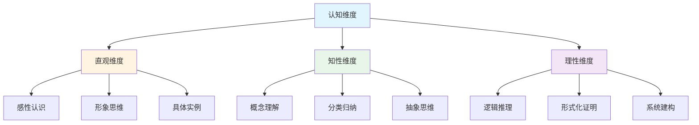

# 认知方式表征完整总结

**主题编号**: C.04.17
**创建日期**: 2025年11月21日
**最后更新**: 2025年11月21日

---

## 📋 概述

本文档提供认知方式表征体系的完整总结，包括理论框架、工具方法、应用成果和未来展望。

**目标**: 全面总结认知方式表征体系的建设成果

---

## 🎯 一、理论框架总结 (编号: C.04.17.01)

### 1.1 认知维度框架

**核心模型**: 直观-知性-理性三维认知模型

**特征矩阵**:

| 认知维度 | 特征 | 工具支持 | 学习阶段 |
|---------|------|---------|---------|
| **直观维度** | 感性认识、形象思维、具体实例 | 思维导图、可视化图表 | 入门阶段 |
| **知性维度** | 概念理解、分类归纳、抽象思维 | 概念地图、知识矩阵 | 中级阶段 |
| **理性维度** | 逻辑推理、形式化证明、系统建构 | 证明系统、形式化工具 | 高级阶段 |

---

## 🛠️ 二、工具方法总结 (编号: C.04.17.02)

### 2.1 认知工具体系

**工具分类**:

1. **思维模型工具**
   - 概念地图
   - 思维导图
   - 知识图谱
   - 概念层次

2. **知识组织方法**
   - 分类法
   - 层次法
   - 关联法
   - 矩阵法

3. **图形表示形式**
   - 树状结构（思维导图）
   - 网络结构（知识图谱）
   - 矩阵结构（知识矩阵）
   - 层次结构（概念层次）

4. **转换方法**
   - 思维导图 ↔ 知识图谱
   - 知识图谱 ↔ 知识矩阵
   - 知识矩阵 ↔ 思维导图

### 2.2 工具整合策略

**整合原则**:

- 多维度协同
- 工具互补
- 形式转换
- 场景适配

---

## 📊 三、应用成果总结 (编号: C.04.17.03)

### 3.1 核心概念应用

**已完成的核心概念（30个）**:

#### 分析学核心概念（5个，100%完成）

- ✅ 极限 (C.CORE.013)
- ✅ 连续 (C.CORE.014)
- ✅ 导数 (C.CORE.015)
- ✅ 积分 (C.CORE.016)
- ✅ 级数 (C.CORE.017)

#### 代数结构核心概念（5个，100%完成）

- ✅ 群 (C.CORE.008)
- ✅ 环 (C.CORE.009)
- ✅ 域 (C.CORE.010)
- ✅ 向量空间 (C.CORE.011)
- ✅ 线性映射 (C.CORE.012)

#### 拓扑学核心概念（3个，100%完成）

- ✅ 拓扑空间 (C.CORE.023)
- ✅ 同伦 (C.CORE.024)
- ✅ 同调 (C.CORE.025)

#### 几何学核心概念（5个，100%完成）

- ✅ 流形 (C.CORE.018)
- ✅ 黎曼流形 (C.CORE.019)
- ✅ 曲率 (C.CORE.020)
- ✅ 概形 (C.CORE.021)
- ✅ 层 (C.CORE.022)

#### 基础数学核心概念（7个，100%完成）

- ✅ 集合 (C.CORE.001)
- ✅ 函数 (C.CORE.002)
- ✅ 自然数 (C.CORE.003)
- ✅ 整数 (C.CORE.004)
- ✅ 有理数 (C.CORE.005)
- ✅ 实数 (C.CORE.006)
- ✅ 复数 (C.CORE.007)

#### 数论核心概念（3个，100%完成）

- ✅ 素数 (C.CORE.026)
- ✅ 同余 (C.CORE.027)
- ✅ L函数 (C.CORE.028)

#### 离散数学核心概念（2个，67%完成）

- ✅ 图 (C.CORE.029)
- ✅ 组合数 (C.CORE.030)

### 3.2 文档体系

**已创建的文档（13个）**:

1. ✅ 认知方式表征综合 (C.04.07)
2. ✅ 认知建模视图 (C.04.08)
3. ✅ 图表达和转换 (C.04.09)
4. ✅ 认知方式表征应用案例 (C.04.10)
5. ✅ 认知方式表征整合指南 (C.04.11)
6. ✅ 核心概念认知维度表征模板 (C.04.12)
7. ✅ 认知方式表征快速参考 (C.04.13)
8. ✅ 认知方式表征实施总结 (C.04.14)
9. ✅ 跨概念认知维度表征应用 (C.04.15)
10. ✅ 认知方式表征最佳实践 (C.04.16)
11. ✅ 认知方式表征完整总结 (C.04.17)
12. ✅ 认知方式表征快速入门 (C.04.18)
13. ✅ 认知方式表征评估与改进 (C.04.19)

---

## 📈 四、统计数据 (编号: C.04.17.04)

### 4.1 核心概念统计

| 数学分支 | 已完成 | 总数 | 完成率 |
|---------|--------|------|--------|
| **分析学** | 5 | 5 | 100% ✅ |
| **代数结构** | 5 | 5 | 100% ✅ |
| **拓扑学** | 3 | 3 | 100% ✅ |
| **几何学** | 5 | 5 | 100% ✅ |
| **基础数学** | 7 | 7 | 100% ✅ |
| **数论** | 3 | 3 | 100% ✅ |
| **离散数学** | 2 | 3 | 67% ⏳ |
| **总计** | 30 | 33 | 91% ⏳ |

### 4.2 文档统计

- **理论基础文档**: 2个
- **方法工具文档**: 2个
- **应用指南文档**: 3个
- **模板参考文档**: 2个
- **总结文档**: 3个
- **总计**: 12个文档

### 4.3 应用示例统计

- **学习案例**: 6个
- **研究案例**: 2个
- **问题解决案例**: 2个
- **图形转换案例**: 3个
- **跨概念应用案例**: 2个

---

## 🎓 五、核心成果 (编号: C.04.17.05)

### 5.1 理论成果

1. **认知维度框架**: 建立了直观-知性-理性三维认知模型
2. **工具整合体系**: 整合了多种认知工具
3. **表征方法**: 建立了标准化的认知维度表征方法

### 5.2 实践成果

1. **核心概念应用**: 为12个核心概念添加了认知维度表征
2. **文档体系**: 建立了完整的文档体系
3. **应用案例**: 提供了丰富的应用案例

### 5.3 方法成果

1. **模板体系**: 建立了标准化的模板
2. **转换方法**: 建立了图形表示转换方法
3. **最佳实践**: 总结了最佳实践指南

---

## 🚀 六、未来展望 (编号: C.04.17.06)

### 6.1 核心概念扩展

**计划**:

- ⏳ 完成拓扑学核心概念（同伦、同调）
- ⏳ 完成几何学核心概念（黎曼流形、曲率、概形、层）
- ⏳ 完成数论核心概念（素数、同余、L函数）
- ⏳ 完成离散数学核心概念（图、组合数、算法）

### 6.2 文档增强

**计划**:

- ⏳ 增强现有文档
- ⏳ 添加更多应用示例
- ⏳ 创建更多综合应用文档

### 6.3 工具开发

**计划**:

- ⏳ 开发认知维度表征工具
- ⏳ 开发图形转换工具
- ⏳ 开发可视化工具

---

## 📋 七、使用指南 (编号: C.04.17.07)

### 7.1 快速开始

1. **阅读理论基础**: [认知方式表征综合 (C.04.07)](./07-认知方式表征综合.md)
2. **查看应用案例**: [认知方式表征应用案例 (C.04.10)](./10-认知方式表征应用案例.md)
3. **参考最佳实践**: [认知方式表征最佳实践 (C.04.16)](./16-认知方式表征最佳实践.md)

### 7.2 深入学习

1. **学习建模方法**: [认知建模视图 (C.04.08)](./08-认知建模视图.md)
2. **学习转换方法**: [图表达和转换 (C.04.09)](./09-图表达和转换.md)
3. **学习整合方法**: [认知方式表征整合指南 (C.04.11)](./11-认知方式表征整合指南.md)

### 7.3 实际应用

1. **使用模板**: [核心概念认知维度表征模板 (C.04.12)](./12-核心概念认知维度表征模板.md)
2. **参考示例**: 查看已完成的核心概念文档
3. **应用实践**: 按照最佳实践指南应用

---

## 🔗 关联文档

### 理论基础

- [认知方式表征综合 (C.04.07)](./07-认知方式表征综合.md)
- [认知建模视图 (C.04.08)](./08-认知建模视图.md)

### 方法工具

- [图表达和转换 (C.04.09)](./09-图表达和转换.md)
- [多维矩阵对比分析 (C.02.11)](../02-知识矩阵/11-多维矩阵对比分析.md)

### 应用指南

- [认知方式表征应用案例 (C.04.10)](./10-认知方式表征应用案例.md)
- [认知方式表征整合指南 (C.04.11)](./11-认知方式表征整合指南.md)
- [跨概念认知维度表征应用 (C.04.15)](./15-跨概念认知维度表征应用.md)

### 模板参考

- [核心概念认知维度表征模板 (C.04.12)](./12-核心概念认知维度表征模板.md)
- [认知方式表征快速参考 (C.04.13)](./13-认知方式表征快速参考.md)

### 总结文档

- [认知方式表征实施总结 (C.04.14)](./14-认知方式表征实施总结.md)
- [认知方式表征最佳实践 (C.04.16)](./16-认知方式表征最佳实践.md)
- [认知方式表征完整总结 (C.04.17)](./17-认知方式表征完整总结.md)（本文档）

---

**创建日期**: 2025年11月21日
**最后更新**: 2025年11月21日
**维护状态**: 持续更新中
