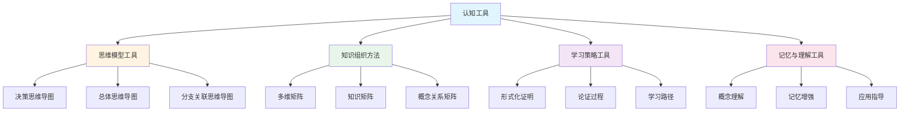

# 认知工具与新框架整合指南

**主题编号**: C.04.21
**创建日期**: 2025年1月
**最后更新**: 2025年1月
**状态**: 持续完善中

---

## 📋 概述

本文档提供FormalMath认知工具与新创建的多种思维表征方式框架的整合指南，展示如何将认知工具与决策思维导图、形式化证明、多维矩阵、论证过程等框架结合使用。

**目标**：

- 说明认知工具与新框架的关系
- 提供整合使用的具体方法
- 展示不同场景下的使用策略
- 建立完整的认知工具应用体系

**理论基础**：

- 直观-知性-理性三维认知模型
- 多种思维表征方式整合框架
- 决策思维导图体系
- 形式化证明系统

---

## 🎯 一、认知工具与新框架的关系 (编号: C.04.21.01)

### 1.1 关系图

### 1.2 关系说明

**认知工具**提供：

- 思维模型：概念地图、思维导图、知识图谱
- 组织方法：分类法、层次法、关联法、矩阵法
- 学习策略：渐进式、关联式、对比式、应用式
- 记忆工具：概念卡片、关系图、类比法、实例法

**新框架**提供：

- **决策思维导图**：学习、研究、应用、教学决策支持
- **形式化证明**：严格的理论基础
- **多维矩阵**：量化的关系分析
- **论证过程**：充分的理解桥梁

**整合价值**：

- 认知工具为新框架提供方法论支持
- 新框架为认知工具提供应用场景
- 两者结合形成完整的知识学习体系

---

## 📚 二、学习场景整合使用 (编号: C.04.21.02)

### 2.1 初学者学习场景

**目标**：理解核心概念

**整合使用流程**：

1. **使用决策思维导图**
   - 查看[学习决策思维导图](../01-总体思维导图/05-决策思维导图体系.md)
   - 确定学习目标和学习阶段
   - 选择学习路径

2. **使用认知工具：使用思维模型工具**
   - 使用概念地图建立概念关系
   - 使用思维导图建立总体框架
   - 使用知识图谱发现概念关联

3. **第三步：使用知识组织方法**
   - 使用分类法理解概念分类
   - 使用层次法理解概念层次
   - 使用矩阵法分析概念特征

4. **第四步：使用记忆与理解工具**
   - 使用概念卡片记忆核心概念
   - 使用类比法理解抽象概念
   - 使用实例法掌握应用

**示例：学习群概念**

1. 使用学习决策导图 → 确定学习路径：基础概念 → 群的定义 → 群的性质 → 群的应用
2. 使用概念地图 → 建立群与子群、同态、同构的关系
3. 使用多维矩阵 → 分析群的知识层次（L1中级层）、知识领域（D2代数）
4. 使用概念卡片 → 记忆群的定义和基本性质

### 2.2 中级学习者场景

**目标**：深入理解核心概念

**整合使用流程**：

1. **使用多维矩阵**
   - 查看[核心概念多维关系矩阵](../02-知识矩阵/10-核心概念多维关系矩阵.md)
   - 了解概念的多维度特征
   - 发现概念之间的关系

2. **使用认知工具：知识组织方法**
   - 使用关联法建立概念关联
   - 使用矩阵法深入分析
   - 使用层次法理解抽象层次

3. **使用形式化证明**
   - 参考[概念定义属性关系形式化论证证明系统](../00-概念定义属性关系形式化论证证明系统-2025年1月.md)
   - 理解概念的形式化定义
   - 学习重要定理的证明思路

4. **使用学习策略工具**
   - 使用渐进式学习深入理解
   - 使用对比式学习发现差异
   - 使用关联式学习建立联系

**示例：深入学习向量空间概念**

1. 使用多维矩阵 → 了解向量空间的知识层次（L1中级层）、知识领域（D2代数）
2. 使用关联法 → 建立向量空间与线性映射、矩阵的关系
3. 使用形式化证明 → 学习基的存在性定理的证明
4. 使用对比式学习 → 对比有限维和无限维向量空间

### 2.3 高级学习者场景

**目标**：研究核心概念

**整合使用流程**：

1. **使用研究决策导图**
   - 查看[研究决策思维导图](../01-总体思维导图/05-决策思维导图体系.md)
   - 确定研究方向和研究问题
   - 选择研究方法

2. **使用认知工具：问题解决工具**
   - 使用问题分析工具分析研究问题
   - 使用策略选择工具选择研究方法
   - 使用方法应用工具应用研究方法

3. **使用形式化证明系统**
   - 深入研读[概念定义属性关系形式化论证证明系统](../00-概念定义属性关系形式化论证证明系统-2025年1月.md)
   - 学习完整的形式化证明
   - 理解证明的逻辑结构

4. **使用知识关联网络**
   - 查看[概念级关联网络](../05-知识关联网络/01-概念级关联网络.md)
   - 发现概念之间的深层关联
   - 探索研究问题

**示例：研究群概念**

1. 使用研究决策导图 → 确定研究方向：群表示论
2. 使用问题分析工具 → 分析群表示论的研究问题
3. 使用形式化证明系统 → 学习Lagrange定理的完整形式化证明
4. 使用知识关联网络 → 发现群与向量空间、表示的关系

---

## 🔬 三、研究场景整合使用 (编号: C.04.21.03)

### 3.1 理论研究场景

**目标**：构建理论体系

**整合使用流程**：

1. **使用研究决策导图** → 确定理论研究方向
2. **使用认知工具：知识组织方法** → 使用矩阵法分析概念关系
3. **使用形式化证明系统** → 构建严格的理论基础
4. **使用知识关联网络** → 发现理论之间的关联

### 3.2 应用研究场景

**目标**：应用概念解决实际问题

**整合使用流程**：

1. **使用应用决策导图** → 确定应用场景
2. **使用认知工具：学习策略工具** → 使用应用式学习理解应用
3. **使用多维矩阵** → 分析应用场景矩阵
4. **使用论证过程** → 理解应用方法

---

## 💼 四、应用场景整合使用 (编号: C.04.21.04)

### 4.1 教学应用场景

**目标**：教授核心概念

**整合使用流程**：

1. **使用教学决策导图** → 确定教学内容和教学方法
2. **使用认知工具：思维模型工具** → 使用思维导图可视化知识结构
3. **使用认知工具：记忆与理解工具** → 使用类比法帮助学生理解
4. **使用论证过程** → 提供充分的理解桥梁

### 4.2 工程应用场景

**目标**：应用概念解决工程问题

**整合使用流程**：

1. **使用应用决策导图** → 确定工程应用场景
2. **使用认知工具：问题解决工具** → 使用问题分析工具分析问题
3. **使用多维矩阵** → 分析应用场景矩阵
4. **使用形式化证明** → 验证应用的正确性

---

## 🔄 五、整合使用最佳实践 (编号: C.04.21.05)

### 5.1 最佳实践原则

**原则1：目标导向**

- 根据学习/研究/应用目标选择工具和框架
- 整合使用服务于目标
- 评估使用效果

**原则2：层次递进**

- 从直观到形式化
- 从简单到复杂
- 从理解到应用

**原则3：互补整合**

- 利用不同工具和框架的优势
- 弥补不同工具和框架的不足
- 形成完整的知识体系

### 5.2 最佳实践示例

**示例：完整学习群概念**

**阶段1：入门理解**

1. 使用学习决策导图 → 确定学习路径
2. 使用概念地图 → 建立群的概念关系
3. 使用思维导图 → 建立总体框架
4. 使用概念卡片 → 记忆群的定义

**阶段2：深入分析**

1. 使用多维矩阵 → 分析群的多维度特征
2. 使用关联法 → 建立群与其他概念的关系
3. 使用形式化证明 → 学习Lagrange定理的证明
4. 使用对比式学习 → 对比不同类型的群

**阶段3：应用研究**

1. 使用研究决策导图 → 确定研究方向
2. 使用问题分析工具 → 分析研究问题
3. 使用形式化证明系统 → 构建理论体系
4. 使用知识关联网络 → 发现研究问题

---

## 📊 六、整合使用决策矩阵 (编号: C.04.21.06)

### 6.1 使用决策矩阵

| 目标类型 | 学习阶段 | 推荐认知工具 | 推荐新框架 | 整合方式 |
|---------|---------|------------|-----------|---------|
| **理解概念** | 入门 | 概念地图、思维导图 | 决策导图、思维导图 | 决策导图指导，概念地图建立关系 |
| **理解概念** | 中级 | 多维矩阵、关联法 | 多维矩阵、论证过程 | 多维矩阵分析，论证过程理解 |
| **理解概念** | 高级 | 形式化工具、问题解决 | 形式化证明、知识网络 | 形式化证明严格化，知识网络发现关联 |
| **应用概念** | 入门 | 实例法、类比法 | 决策导图、应用实例 | 决策导图指导，实例法理解应用 |
| **应用概念** | 中级 | 应用式学习、问题解决 | 多维矩阵、决策导图 | 多维矩阵分析应用，决策导图指导应用 |
| **研究概念** | 中级 | 问题分析、策略选择 | 多维矩阵、形式化证明 | 多维矩阵发现问题，形式化证明构建理论 |
| **研究概念** | 高级 | 问题解决、方法应用 | 形式化证明、知识网络 | 形式化证明严格化，知识网络探索问题 |
| **教学** | 中级 | 问题分析、策略选择 | 多维矩阵、形式化证明 | 多维矩阵发现研究问题，形式化证明构建理论 |
| **教学概念** | 入门 | 思维导图、类比法 | 教学决策导图、论证过程 | 教学决策导图指导，思维导图可视化 |
| **教学概念** | 中级 | 多维矩阵、对比学习 | 多维矩阵、论证过程 | 多维矩阵深入分析，论证过程充分理解 |

---

## 🔗 七、关联文档 (编号: C.04.21.07)

### 7.1 认知工具文档

- [认知工具总览](./00-认知工具总览.md)
- [认知工具应用指南](./03-认知工具应用指南.md)
- [认知方式表征综合](./07-认知方式表征综合.md)

### 7.2 新框架文档

- [概念体系全面梳理与推进计划](../00-概念体系全面梳理与推进计划-2025年1月.md)
- [决策思维导图体系](../01-总体思维导图/05-决策思维导图体系.md)
- [概念定义属性关系形式化论证证明系统](../00-概念定义属性关系形式化论证证明系统-2025年1月.md)
- [多种思维表征方式对比与整合](../00-多种思维表征方式对比与整合-2025年1月.md)
- [核心概念与新框架整合指南](../00-核心概念与新框架整合指南-2025年1月.md)

### 7.3 其他相关文档

- [核心概念索引](../核心概念/00-核心概念索引.md)
- [知识矩阵总览](../02-知识矩阵/00-知识矩阵总览.md)

---

## ✅ 八、总结 (编号: C.04.21.08)

本文档提供了认知工具与新框架的整合使用指南，帮助用户：

1. **理解关系**：理解认知工具与新框架的关系
2. **选择策略**：根据不同场景选择合适的工具和框架组合
3. **整合使用**：形成完整的学习和研究体系
4. **最佳实践**：遵循最佳实践原则和方法

**核心价值**：

- 提供系统化的学习路径
- 支持不同层次的学习需求
- 整合多种工具和框架
- 形成完整的知识体系

---

**创建日期**: 2025年1月
**最后更新**: 2025年1月
**维护状态**: 持续完善中
**负责人**: FormalMath项目组
