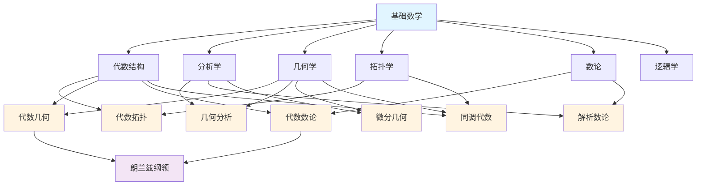
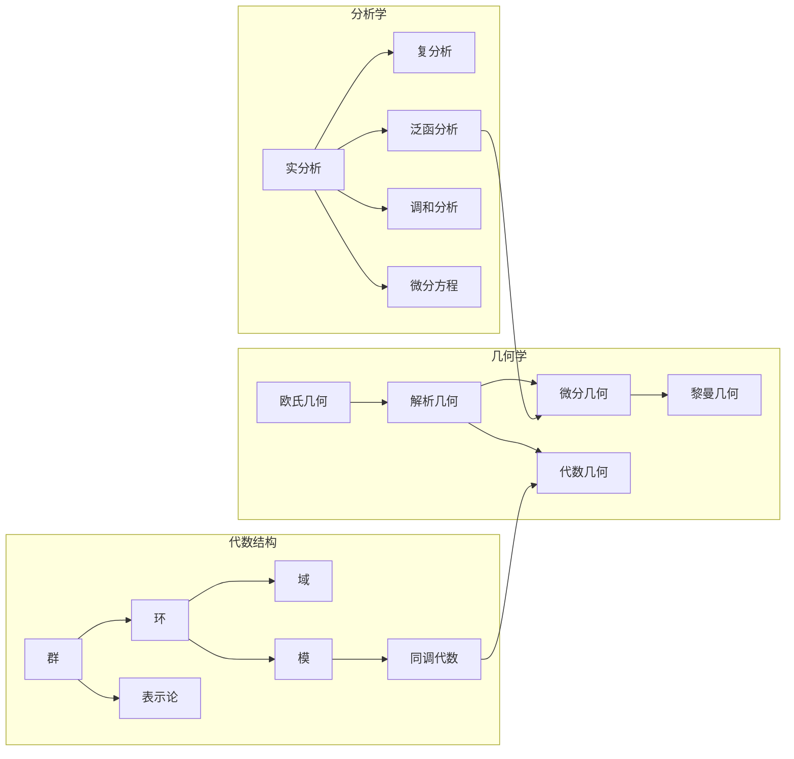
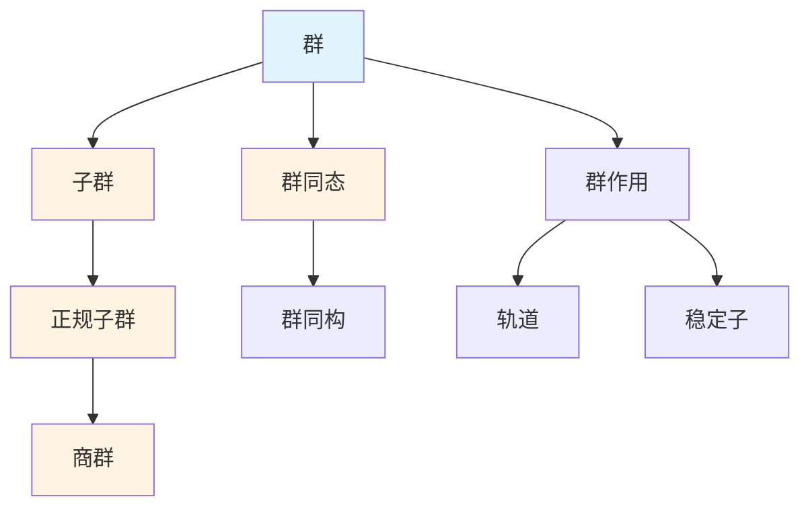

# 知识关联网络总览

**主题编号**: C.05.00
**创建日期**: 2025年11月21日
**最后更新**: 2025年11月21日

---

## 📋 目录 / Table of Contents

- [知识关联网络总览](#知识关联网络总览)
  - [📋 目录 / Table of Contents](#-目录--table-of-contents)
  - [📋 概述 (编号: C.05.00.01)](#-概述-编号-c050001)
  - [🗺️ 一、网络结构层次 (编号: C.05.00.02)](#️-一网络结构层次-编号-c050002)
    - [1.1 宏观网络（分支级）](#11-宏观网络分支级)
    - [1.2 中观网络（主题级）](#12-中观网络主题级)
    - [1.3 微观网络（概念级）](#13-微观网络概念级)
  - [🔗 二、关联类型分类 (编号: C.05.00.03)](#-二关联类型分类-编号-c050003)
    - [2.1 基础依赖关系](#21-基础依赖关系)
    - [2.2 应用关系](#22-应用关系)
    - [2.3 交叉融合关系](#23-交叉融合关系)
    - [2.4 推广关系](#24-推广关系)
  - [📊 三、关联强度分析 (编号: C.05.00.04)](#-三关联强度分析-编号-c050004)
    - [3.1 强关联（⭐⭐⭐⭐⭐）](#31-强关联)
    - [3.2 中等关联（⭐⭐⭐⭐）](#32-中等关联)
    - [3.3 弱关联（⭐⭐⭐）](#33-弱关联)
  - [🎯 四、知识发现路径 (编号: C.05.00.05)](#-四知识发现路径-编号-c050005)
    - [4.1 从基础到应用](#41-从基础到应用)
    - [4.2 从简单到复杂](#42-从简单到复杂)
    - [4.3 从局部到整体](#43-从局部到整体)
  - [📚 五、网络应用场景 (编号: C.05.00.06)](#-五网络应用场景-编号-c050006)
    - [5.1 学习路径规划](#51-学习路径规划)
    - [5.2 知识组织](#52-知识组织)
    - [5.3 研究指导](#53-研究指导)
  - [🔗 六、关联文档 (编号: C.05.00.07)](#-六关联文档-编号-c050007)
    - [知识关联网络文档](#知识关联网络文档)
    - [知识关联文档](#知识关联文档)
    - [思维导图文档](#思维导图文档)
  - [📝 更新日志](#-更新日志)
    - [2025年11月21日](#2025年11月21日)

---

## 📋 概述 (编号: C.05.00.01)

本文档提供FormalMath项目的知识关联网络总览，通过多层次的网络图谱展示数学概念之间的复杂关联关系。

**数据来源**: docs文件夹所有文档
**目标**: 建立完整的知识关联网络体系

---

## 🗺️ 一、网络结构层次 (编号: C.05.00.02)

### 1.1 宏观网络（分支级）

展示主要数学分支之间的关联关系

### 1.2 中观网络（主题级）

展示各分支内部主题之间的关联关系

### 1.3 微观网络（概念级）

展示具体概念之间的关联关系

---

## 🔗 二、关联类型分类 (编号: C.05.00.03)

### 2.1 基础依赖关系

- **基础 → 应用**: 基础数学是所有分支的基础
- **简单 → 复杂**: 从简单概念到复杂概念
- **具体 → 抽象**: 从具体实例到抽象理论

### 2.2 应用关系

- **理论 → 应用**: 理论在应用中的使用
- **工具 → 问题**: 工具在问题解决中的应用
- **方法 → 对象**: 方法在对象研究中的应用

### 2.3 交叉融合关系

- **分支交叉**: 不同分支的交叉融合
- **概念融合**: 不同概念的融合形成新概念
- **方法融合**: 不同方法的融合形成新方法

### 2.4 推广关系

- **特殊 → 一般**: 从特殊到一般的推广
- **有限 → 无限**: 从有限到无限的推广
- **局部 → 整体**: 从局部到整体的推广

---

## 📊 三、关联强度分析 (编号: C.05.00.04)

### 3.1 强关联（⭐⭐⭐⭐⭐）

- **基础数学 ↔ 所有分支**: 基础依赖关系
- **代数结构 ↔ 几何学**: 代数几何
- **分析学 ↔ 几何学**: 微分几何、几何分析
- **拓扑学 ↔ 几何学**: 拓扑几何

### 3.2 中等关联（⭐⭐⭐⭐）

- **代数结构 ↔ 分析学**: 泛函分析中的算子代数
- **代数结构 ↔ 拓扑学**: 代数拓扑
- **数论 ↔ 代数结构**: 代数数论

### 3.3 弱关联（⭐⭐⭐）

- **逻辑学 ↔ 分析学**: 模型论
- **拓扑学 ↔ 数论**: 算术几何中的拓扑方法

---

## 🎯 四、知识发现路径 (编号: C.05.00.05)

### 4.1 从基础到应用

### 4.2 从简单到复杂

### 4.3 从局部到整体

---

## 📚 五、网络应用场景 (编号: C.05.00.06)

### 5.1 学习路径规划

- **依赖分析**: 分析概念之间的依赖关系
- **路径优化**: 优化学习路径
- **知识发现**: 发现新的知识关联

### 5.2 知识组织

- **主题聚类**: 将相关概念聚类
- **层次构建**: 构建知识层次结构
- **关联挖掘**: 挖掘隐藏的关联关系

### 5.3 研究指导

- **问题定位**: 定位研究问题
- **方法选择**: 选择合适的研究方法
- **交叉探索**: 探索交叉领域

---

## 🔗 六、关联文档 (编号: C.05.00.07)

### 知识关联网络文档

- [概念级关联网络 (C.05.01)](./01-概念级关联网络.md) ⭐ 新增
- [定理级关联网络 (C.05.02)](./02-定理级关联网络.md) ⭐ 新增
- [方法级关联网络 (C.05.03)](./03-方法级关联网络.md) ⭐ 新增

### 知识关联文档

- [跨分支知识关联图谱](../../docs/跨分支知识关联图谱-2025年11月20日.md)
- [知识关联图谱系统](../../docs/知识关联图谱系统-2025年8月30日.md)
- [分支关联矩阵](../02-知识矩阵/01-分支关联矩阵.md)

### 思维导图文档

- [全面知识体系思维导图](../01-总体思维导图/04-全面知识体系思维导图.md)
- [分支关联思维导图](../01-总体思维导图/02-分支关联思维导图.md)

---

## 📝 更新日志

### 2025年11月21日

- ✅ 新增概念级关联网络 (C.05.01)
- ✅ 新增定理级关联网络 (C.05.02)
- ✅ 新增方法级关联网络 (C.05.03)

---

**创建日期**: 2025年11月21日
**最后更新**: 2025年11月21日
**维护状态**: 持续更新中
**版本**: v1.0
