# 概念级关联网络

**主题编号**: C.05.01
**创建日期**: 2025年11月21日
**最后更新**: 2025年11月28日（数学解释、论证、表征全面完成）

---

## 📋 目录 / Table of Contents

- [概念级关联网络](#概念级关联网络)
  - [📋 目录 / Table of Contents](#-目录--table-of-contents)
  - [📋 概述 (编号: C.05.01.01)](#-概述-编号-c050101)
  - [🔗 一、基础数学概念网络 (编号: C.05.01.02)](#-一基础数学概念网络-编号-c050102)
    - [1.1 集合论概念网络](#11-集合论概念网络)
      - [关系说明](#关系说明)
    - [1.2 数系概念网络](#12-数系概念网络)
  - [🔗 二、代数结构概念网络 (编号: C.05.01.03)](#-二代数结构概念网络-编号-c050103)
    - [2.1 群论概念网络](#21-群论概念网络)
      - [关系说明](#关系说明-1)
    - [2.2 环论概念网络](#22-环论概念网络)
      - [关系说明](#关系说明-2)
    - [2.3 域论概念网络](#23-域论概念网络)
      - [关系说明](#关系说明-3)
    - [2.4 线性代数概念网络 ⭐ 新增](#24-线性代数概念网络--新增)
      - [关系说明](#关系说明-4)
    - [2.5 序结构概念网络 ⭐ 新增](#25-序结构概念网络--新增)
      - [关系说明](#关系说明-5)
  - [🔗 三、分析学概念网络 (编号: C.05.01.04)](#-三分析学概念网络-编号-c050104)
    - [3.1 实分析概念网络](#31-实分析概念网络)
      - [关系说明（实分析概念网络）](#关系说明实分析概念网络)
      - [关系说明（实分析概念网络续）](#关系说明实分析概念网络续)
    - [3.2 复分析概念网络](#32-复分析概念网络)
      - [关系说明（复分析概念网络）](#关系说明复分析概念网络)
  - [🔗 四、几何学概念网络 (编号: C.05.01.05)](#-四几何学概念网络-编号-c050105)
    - [4.1 欧氏几何概念网络](#41-欧氏几何概念网络)
      - [关系说明（欧氏几何概念网络）](#关系说明欧氏几何概念网络)
    - [4.2 微分几何概念网络](#42-微分几何概念网络)
      - [关系说明（微分几何概念网络）](#关系说明微分几何概念网络)
  - [🔗 五、数论概念网络 (编号: C.05.01.05.5)](#-五数论概念网络-编号-c0501055)
    - [5.5 数论概念网络 ⭐ 新增](#55-数论概念网络--新增)
      - [关系说明（数论概念网络）](#关系说明数论概念网络)
  - [🔗 六、跨分支概念关联 (编号: C.05.01.06)](#-六跨分支概念关联-编号-c050106)
    - [5.1 图论概念网络 ⭐ 新增](#51-图论概念网络--新增)
      - [关系说明（图论概念网络）](#关系说明图论概念网络)
    - [5.2 组合数学概念网络 ⭐ 新增](#52-组合数学概念网络--新增)
      - [关系说明（组合数学概念网络）](#关系说明组合数学概念网络)
    - [5.3 计算理论概念网络 ⭐ 新增](#53-计算理论概念网络--新增)
      - [关系说明（计算理论概念网络）](#关系说明计算理论概念网络)
    - [6.1 代数-几何关联](#61-代数-几何关联)
      - [关系说明（代数-几何关联）](#关系说明代数-几何关联)
    - [6.2 分析-几何关联](#62-分析-几何关联)
      - [关系说明（分析-几何关联）](#关系说明分析-几何关联)
    - [6.3 拓扑-代数关联](#63-拓扑-代数关联)
      - [关系说明（拓扑-代数关联）](#关系说明拓扑-代数关联)
  - [📊 七、概念关联强度矩阵 (编号: C.05.01.07)](#-七概念关联强度矩阵-编号-c050107)
    - [6.1 基础数学概念关联强度](#61-基础数学概念关联强度)
    - [6.2 代数结构概念关联强度](#62-代数结构概念关联强度)
    - [6.3 离散数学概念关联强度 ⭐ 新增](#63-离散数学概念关联强度--新增)
    - [6.4 跨分支概念关联强度](#64-跨分支概念关联强度)
  - [🔗 关联文档 (编号: C.05.01.08)](#-关联文档-编号-c050108)
    - [知识关联网络文档](#知识关联网络文档)
    - [集合论与范畴论视角文档 ⭐ 新增](#集合论与范畴论视角文档--新增)
    - [相关文档](#相关文档)

---

## 📋 概述 (编号: C.05.01.01)

**核心概念三视角版本**: 本文档中涉及的所有33个核心概念已完成三视角转换，每个概念都包含认知学、教育学、数学家三个视角的深度分析。详见：[核心概念索引](../核心概念/00-核心概念索引.md) ⭐ - 所有33个核心概念的三视角版本

**集合论与范畴论视角**: 本文档中的概念关联网络可以从集合论和范畴论两个视角理解：

- **集合论视角**: 概念之间的关联关系可以用集合关系（包含、交集、并集等）描述，概念层次结构反映了基础概念的组合方式。概念网络中的节点对应概念集合，边对应概念之间的关系集合。详见：[集合论视角的概念层次结构分析](../00-集合论视角的概念层次结构分析.md) ⭐ - 集合论视角的详细分析

- **范畴论视角**: 从范畴论视角来看，每个概念之间的联系都可以被范畴论的概念把握。概念之间的关系（包含关系、推广关系、应用关系、等价关系）可以用范畴论的态射描述，概念之间的变换可以用函子描述，概念关系的动态变化可以用自然变换、极限、伴随等工具描述。概念网络中的节点对应范畴的对象，边对应范畴的态射。详见：[范畴论视角的概念关系动态表征](../00-范畴论视角的概念关系动态表征.md) ⭐ - 范畴论视角的详细分析

- **双视角整合**: 集合论视角描述概念的静态层次结构，范畴论视角描述概念的动态关系变换。两个视角互补，共同构成完整的概念关联网络理解。详见：[集合论与范畴论视角整合分析](../00-集合论与范畴论视角整合分析.md) ⭐ 新增

---

本文档提供FormalMath项目的概念级关联网络，展示具体数学概念之间的关联关系。

**目标**: 建立细粒度的概念关联网络体系

**哲学维度**: 概念之间的关联关系也反映了哲学思想的影响。逻辑主义强调逻辑关联，直觉主义强调构造性关联，结构主义强调结构关联，范畴论为结构关联提供了形式化工具。详见[数学哲学维度矩阵](../02-知识矩阵/09-数学哲学维度矩阵.md)。

---

## 🔗 一、基础数学概念网络 (编号: C.05.01.02)

### 1.1 集合论概念网络

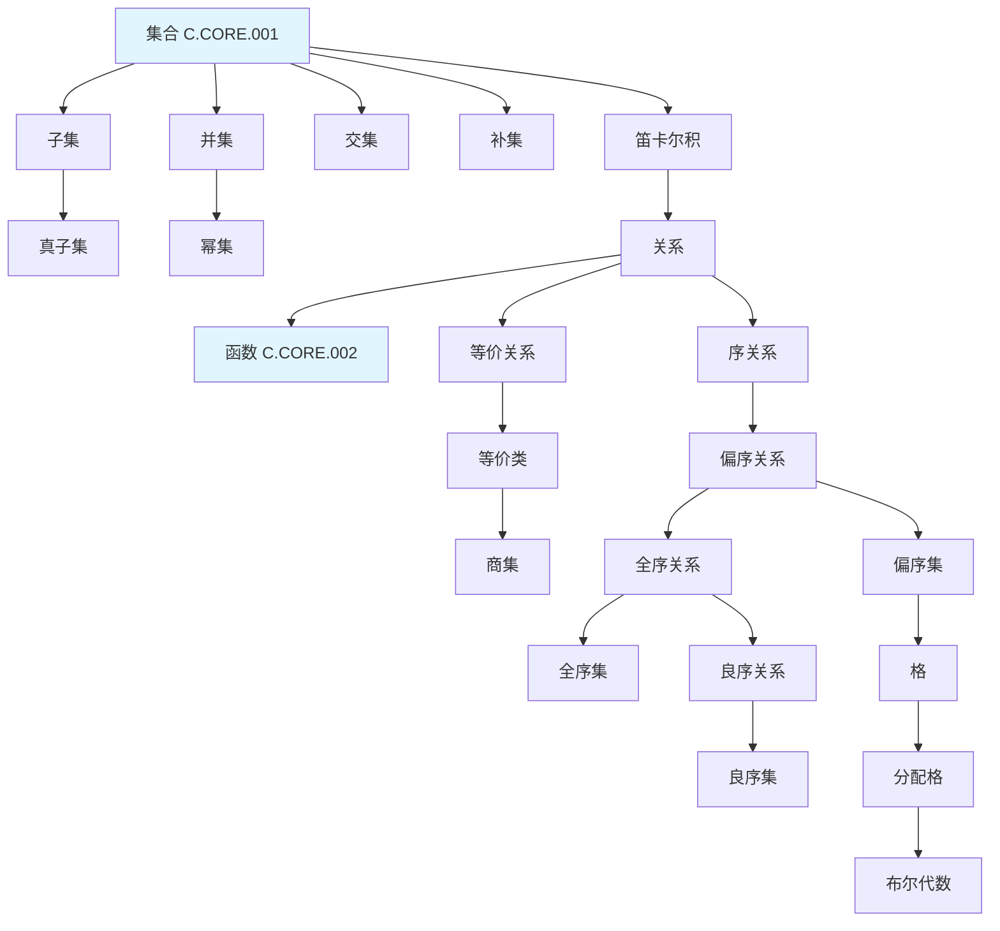
```mermaid
graph TD
    A[集合 C.CORE.001] --> B[子集]
    A --> C[并集]
    A --> D[交集]
    A --> E[补集]
    B --> F[真子集]
    C --> G[幂集]
    A --> H[笛卡尔积]
    H --> I[关系]
    I --> J[函数 C.CORE.002]
    I --> K[等价关系]
    I --> N[序关系]
    K --> L[等价类]
    L --> M[商集]
    N --> O[偏序关系]
    O --> P[偏序集]
    O --> Q[全序关系]
    Q --> R[全序集]
    Q --> S[良序关系]
    S --> T[良序集]
    P --> U[格]
    U --> V[分配格]
    V --> W[布尔代数]

    style A fill:#e1f5ff
    style J fill:#e1f5ff
```

#### 关系说明

- **集合 → 子集**: 子集是集合的特殊情况，$A \subseteq B$ 当且仅当 $\forall x (x \in A \Rightarrow x \in B)$
- **集合 → 并集/交集/补集**: 集合的基本运算，满足交换律、结合律、分配律、De Morgan律
- **集合 → 幂集**: 幂集 $\mathcal{P}(A)$ 是 $A$ 的所有子集构成的集合，$|\mathcal{P}(A)| = 2^{|A|}$
- **笛卡尔积 → 关系**: 关系 $R \subseteq A \times B$ 是笛卡尔积的子集
- **关系 → 函数**: 函数是满足单值性的关系：$\forall a \in A, \exists! b \in B, (a,b) \in f$
- **关系 → 等价关系**: 等价关系满足自反、对称、传递性
- **关系 → 序关系**: 序关系是满足自反、反对称、传递性的关系
- **等价关系 → 等价类**: 等价类 $[a] = \{x : (a,x) \in R\}$ 是等价关系下的元素分类
- **等价类 → 商集**: 商集 $A/R = \{[a] : a \in A\}$ 是等价类的集合，构成 $A$ 的划分
- **序关系 → 偏序关系**: 偏序关系满足自反性、反对称性、传递性；允许不可比较的元素
- **偏序关系 → 偏序集**: 偏序集 $(P, \\leq)$ 是配备偏序关系的集合；序理论的基本对象
- **偏序关系 → 全序关系**: 全序关系是任意两元素都可比较的偏序关系
- **全序关系 → 全序集**: 全序集 $(T, \\leq)$ 是配备全序关系的集合；所有元素都可比较
- **全序关系 → 良序关系**: 良序关系是每个非空子集都有最小元的全序关系
- **良序关系 → 良序集**: 良序集 $(W, \\leq)$ 是配备良序关系的集合；允许超限归纳法
- **偏序集 → 格**: 格是任意两元素都有上确界和下确界的偏序集；序结构和代数结构的结合
- **格 → 分配格**: 分配格是满足分配律的格；具有更好的结构性质
- **分配格 → 布尔代数**: 布尔代数是有补分配格；逻辑和集合论的代数化

### 1.2 数系概念网络

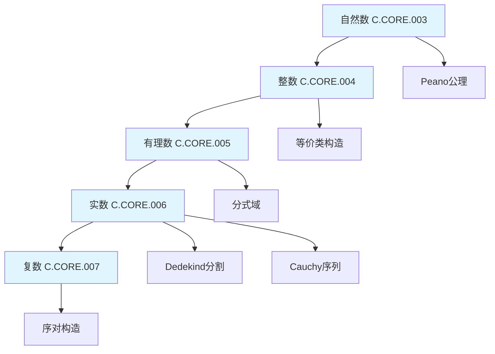
```mermaid
graph TD
    A[自然数 C.CORE.003] --> B[整数 C.CORE.004]
    B --> C[有理数 C.CORE.005]
    C --> D[实数 C.CORE.006]
    D --> E[复数 C.CORE.007]

    A --> F[Peano公理]
    B --> G[等价类构造]
    C --> H[分式域]
    D --> I[Dedekind分割]
    D --> J[Cauchy序列]
    E --> K[序对构造]

    style A fill:#e1f5ff
    style B fill:#e1f5ff
    style C fill:#e1f5ff
    style D fill:#e1f5ff
    style E fill:#e1f5ff
```

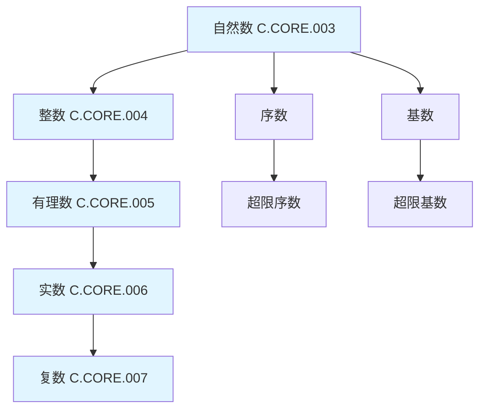
```mermaid
graph TD
    A[自然数 C.CORE.003] --> B[整数 C.CORE.004]
    B --> C[有理数 C.CORE.005]
    C --> D[实数 C.CORE.006]
    D --> E[复数 C.CORE.007]
    A --> F[序数]
    A --> G[基数]
    F --> H[超限序数]
    G --> I[超限基数]

    style A fill:#e1f5ff
    style B fill:#e1f5ff
    style C fill:#e1f5ff
    style D fill:#e1f5ff
    style E fill:#e1f5ff
```

---

## 🔗 二、代数结构概念网络 (编号: C.05.01.03)

### 2.1 群论概念网络

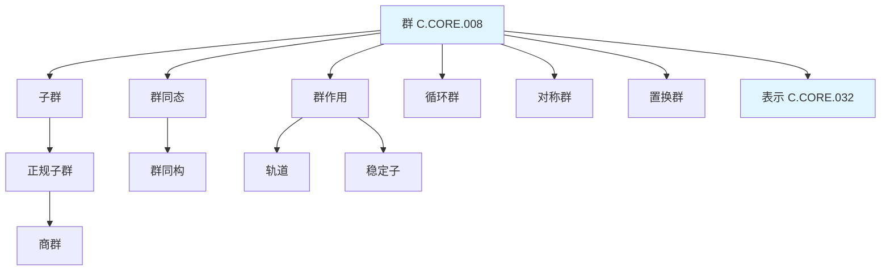
```mermaid
graph TD
    A[群 C.CORE.008] --> B[子群]
    A --> C[群同态]
    B --> D[正规子群]
    D --> E[商群]
    C --> F[群同构]
    A --> G[群作用]
    G --> H[轨道]
    G --> I[稳定子]
    A --> J[循环群]
    A --> K[对称群]
    A --> L[置换群]
    A --> M[表示 C.CORE.032]

    style A fill:#e1f5ff
    style M fill:#e1f5ff
```

#### 关系说明

- **群 → 子群**: 子群 $H \subseteq G$ 是群，满足封闭性和逆元封闭性；判定：$\forall a,b \in H, ab^{-1} \in H$
- **群 → 群同态**: 群同态 $\phi: G \to H$ 保持群运算：$\phi(ab) = \phi(a)\phi(b)$
- **子群 → 正规子群**: 正规子群 $H \trianglelefteq G$ 满足 $\forall g \in G, gHg^{-1} = H$，是构造商群的条件
- **正规子群 → 商群**: 商群 $G/H$ 的运算 $(g_1H)(g_2H) = (g_1g_2)H$ 需要正规性保证良定义
- **群同态 → 群同构**: 群同构是双射的群同态，表示两个群在代数上完全相同
- **群 → 群作用**: 群作用 $G \times X \to X$ 将群元素映射为集合上的变换
- **群作用 → 轨道**: 轨道 $G \cdot x = \{g \cdot x : g \in G\}$ 是 $x$ 在群作用下的像
- **群作用 → 稳定子**: 稳定子 $G_x = \{g \in G : g \cdot x = x\}$ 是保持 $x$ 不变的群元素
- **群 → 循环群**: 循环群由单个元素生成，$G = \langle a \rangle = \{a^n : n \in \mathbb{Z}\}$
- **群 → 对称群**: 对称群 $S_n$ 是 $n$ 个元素的集合上所有置换构成的群

### 2.2 环论概念网络

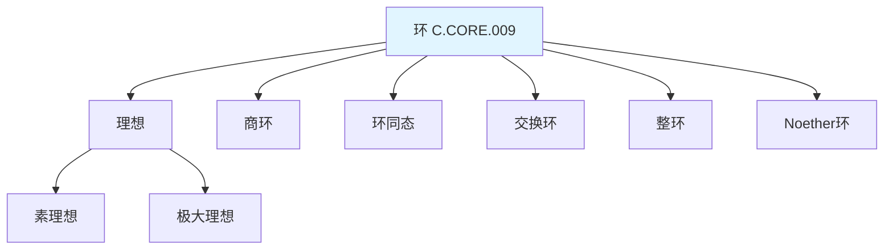
```mermaid
graph TD
    A[环 C.CORE.009] --> B[理想]
    A --> C[商环]
    A --> D[环同态]
    B --> E[素理想]
    B --> F[极大理想]
    A --> G[交换环]
    A --> H[整环]
    A --> I[Noether环]

    style A fill:#e1f5ff
```

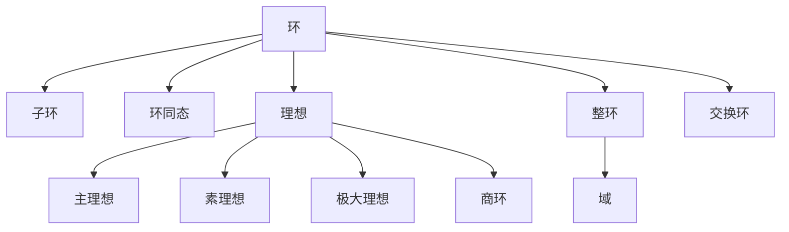
```mermaid
graph TD
    A[环] --> B[子环]
    A --> C[环同态]
    A --> D[理想]
    D --> E[主理想]
    D --> F[素理想]
    D --> G[极大理想]
    D --> H[商环]
    A --> I[整环]
    I --> J[域]
    A --> K[交换环]
```

#### 关系说明

- **环 → 子环**: 子环 $S \subseteq R$ 是环，满足封闭性和逆元封闭性；判定：$\forall a,b \in S, a-b, ab \in S$
- **环 → 环同态**: 环同态 $\phi: R \to S$ 保持环运算：$\phi(a+b) = \phi(a) + \phi(b)$，$\phi(ab) = \phi(a)\phi(b)$
- **环 → 理想**: 理想 $I \trianglelefteq R$ 是子环，满足 $\forall r \in R, a \in I, ra, ar \in I$；是构造商环的条件
- **理想 → 主理想**: 主理想 $(a) = \{ra : r \in R\}$ 由单个元素生成
- **理想 → 素理想**: 素理想 $P$ 满足：若 $ab \in P$，则 $a \in P$ 或 $b \in P$；对应整环
- **理想 → 极大理想**: 极大理想 $M$ 是极大真理想；$R/M$ 是域
- **理想 → 商环**: 商环 $R/I$ 的运算 $(a+I)(b+I) = ab+I$ 需要理想保证良定义
- **环 → 整环**: 整环是无零因子的交换环；$ab = 0 \Rightarrow a = 0$ 或 $b = 0$
- **整环 → 域**: 域是每个非零元素都有乘法逆元的整环；$R$ 是域当且仅当 $(0)$ 和 $R$ 是仅有的理想
- **环 → 交换环**: 交换环满足 $ab = ba$；大多数环论研究交换环

### 2.3 域论概念网络

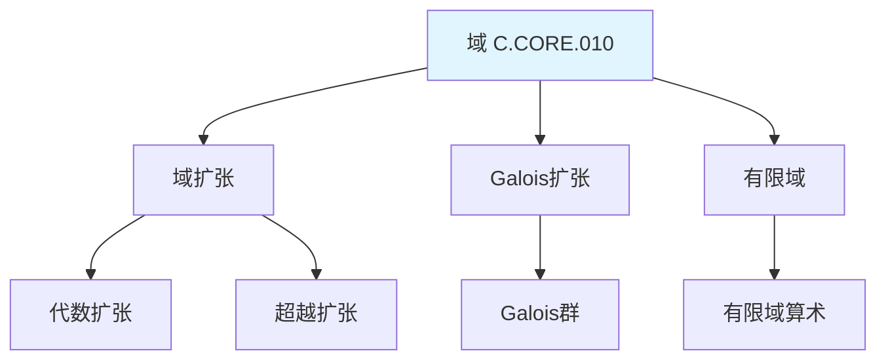
```mermaid
graph TD
    A[域 C.CORE.010] --> B[域扩张]
    A --> C[Galois扩张]
    A --> D[有限域]
    B --> E[代数扩张]
    B --> F[超越扩张]
    C --> G[Galois群]
    D --> H[有限域算术]

    style A fill:#e1f5ff
```

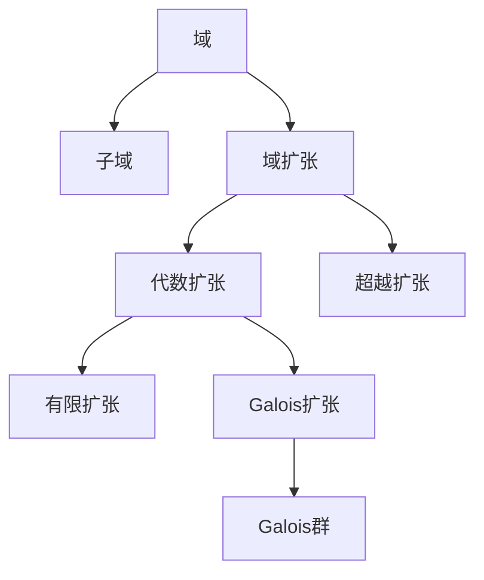
```mermaid
graph TD
    A[域] --> B[子域]
    A --> C[域扩张]
    C --> D[代数扩张]
    C --> E[超越扩张]
    D --> F[有限扩张]
    D --> G[Galois扩张]
    G --> H[Galois群]
```

#### 关系说明

- **域 → 子域**: 子域 $F \subseteq K$ 是域；$K$ 是 $F$ 的扩域
- **域 → 域扩张**: 域扩张 $K/F$ 是包含关系 $F \subseteq K$；$K$ 是 $F$ 上的向量空间
- **域扩张 → 代数扩张**: 代数扩张中每个元素都是代数元（是某个多项式的根）
- **域扩张 → 超越扩张**: 超越扩张中存在超越元（不是任何多项式的根）
- **代数扩张 → 有限扩张**: 有限扩张 $[K:F] < \infty$；有限扩张是代数扩张
- **代数扩张 → Galois扩张**: Galois扩张是正规且可分的有限扩张
- **Galois扩张 → Galois群**: Galois群 $\text{Gal}(K/F) = \{\sigma \in \text{Aut}(K) : \sigma|_F = \text{id}\}$ 是自同构群

### 2.4 线性代数概念网络 ⭐ 新增

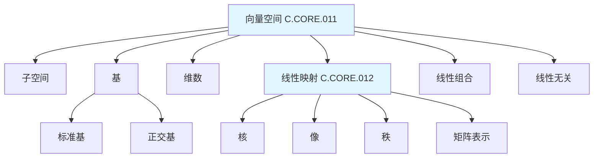
```mermaid
graph TD
    A[向量空间 C.CORE.011] --> B[子空间]
    A --> C[基]
    A --> D[维数]
    A --> E[线性映射 C.CORE.012]
    E --> F[核]
    E --> G[像]
    E --> H[秩]
    E --> I[矩阵表示]
    A --> J[线性组合]
    A --> K[线性无关]
    C --> L[标准基]
    C --> M[正交基]

    style A fill:#e1f5ff
    style E fill:#e1f5ff
```

#### 关系说明

- **向量空间 → 子空间**: 子空间 $W \subseteq V$ 是向量空间，满足封闭性；判定：$\forall u,v \in W, a \in F, u+v, au \in W$
- **向量空间 → 基**: 基是线性无关的生成集；所有基有相同的元素个数（维数）
- **向量空间 → 维数**: 维数 $\dim V$ 是基的元素个数；有限维向量空间的分类
- **向量空间 → 线性映射**: 线性映射 $T: V \to W$ 保持线性组合：$T(au+bv) = aT(u) + bT(v)$
- **线性映射 → 核**: 核 $\ker(T) = \{v \in V : T(v) = 0\}$ 是 $V$ 的子空间
- **线性映射 → 像**: 像 $\text{im}(T) = \{T(v) : v \in V\}$ 是 $W$ 的子空间
- **线性映射 → 秩**: 秩 $\text{rank}(T) = \dim \text{im}(T)$；秩-零度定理：$\dim V = \text{rank}(T) + \dim \ker(T)$
- **线性映射 → 矩阵表示**: 有限维向量空间的线性映射对应矩阵；矩阵乘法对应线性映射复合

### 2.5 序结构概念网络 ⭐ 新增

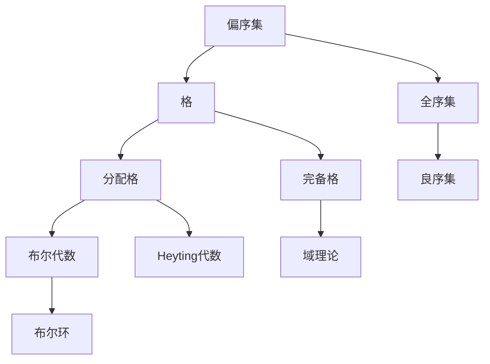
```mermaid
graph TD
    A[偏序集] --> B[格]
    A --> C[全序集]
    C --> D[良序集]
    B --> E[分配格]
    E --> F[布尔代数]
    B --> G[完备格]
    G --> H[域理论]
    F --> I[布尔环]
    E --> J[Heyting代数]
```

#### 关系说明

- **偏序集 → 格**: 格是任意两元素都有上确界和下确界的偏序集；序结构和代数结构的结合
- **偏序集 → 全序集**: 全序集是任意两元素都可比较的偏序集；所有元素都可比较
- **全序集 → 良序集**: 良序集是每个非空子集都有最小元的全序集；允许超限归纳法
- **格 → 分配格**: 分配格是满足分配律的格；具有更好的结构性质
- **分配格 → 布尔代数**: 布尔代数是有补分配格；逻辑和集合论的代数化
- **格 → 完备格**: 完备格是任意子集都有上确界和下确界的格；允许无限运算
- **完备格 → 域理论**: 域理论使用完备偏序集研究程序语义；连续函数、不动点理论
- **布尔代数 → 布尔环**: 布尔环与布尔代数一一对应；每个元素都是幂等元的环
- **分配格 → Heyting代数**: Heyting代数是分配格配备蕴含运算；对应直觉逻辑

---

## 🔗 三、分析学概念网络 (编号: C.05.01.04)

### 3.1 实分析概念网络

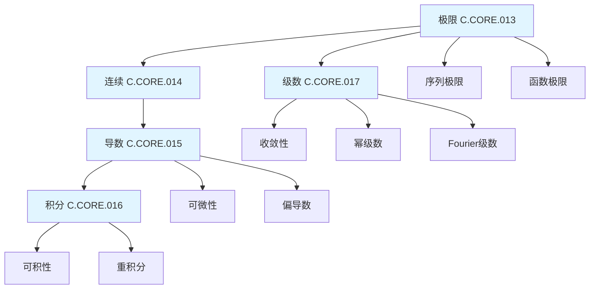
```mermaid
graph TD
    A[极限 C.CORE.013] --> B[连续 C.CORE.014]
    B --> C[导数 C.CORE.015]
    C --> D[积分 C.CORE.016]
    A --> E[级数 C.CORE.017]
    C --> F[可微性]
    D --> G[可积性]
    E --> H[收敛性]
    A --> I[序列极限]
    A --> J[函数极限]
    C --> K[偏导数]
    D --> L[重积分]
    E --> M[幂级数]
    E --> N[Fourier级数]

    style A fill:#e1f5ff
    style B fill:#e1f5ff
    style C fill:#e1f5ff
    style D fill:#e1f5ff
    style E fill:#e1f5ff
```

#### 关系说明（实分析概念网络）

- **极限 → 连续**: 函数在点 $a$ 连续当且仅当 $\lim_{x \to a} f(x) = f(a)$
- **连续 → 导数**: 可导性要求连续性（但连续性不保证可导性）
- **导数 → 积分**: 微积分基本定理连接导数和积分
- **极限 → 级数**: 级数是部分和序列的极限
- **导数 → 可微性**: 可微性是导数的存在性
- **积分 → 可积性**: 可积性是积分的存在性
- **级数 → 收敛性**: 级数收敛是部分和序列收敛

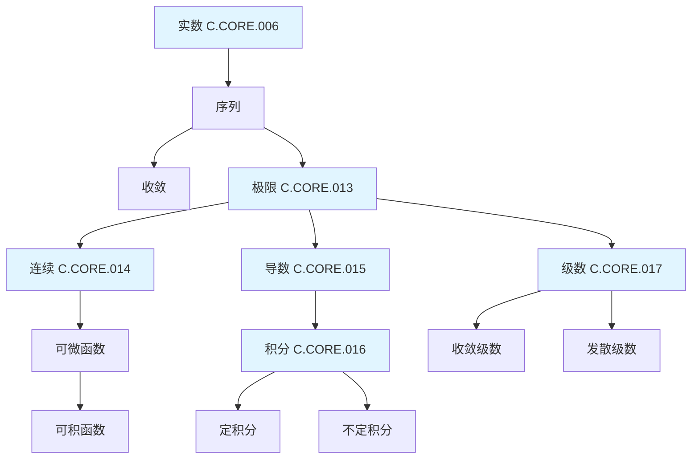
```mermaid
graph TD
    A[实数 C.CORE.006] --> B[序列]
    B --> C[收敛]
    B --> D[极限 C.CORE.013]
    D --> E[连续 C.CORE.014]
    E --> F[可微函数]
    F --> G[可积函数]
    D --> H[导数 C.CORE.015]
    H --> I[积分 C.CORE.016]
    I --> J[定积分]
    I --> K[不定积分]
    D --> L[级数 C.CORE.017]
    L --> M[收敛级数]
    L --> N[发散级数]

    style A fill:#e1f5ff
    style D fill:#e1f5ff
    style E fill:#e1f5ff
    style H fill:#e1f5ff
    style I fill:#e1f5ff
    style L fill:#e1f5ff
```

#### 关系说明（实分析概念网络续）

- **实数 → 序列**: 序列 $\{a_n\}$ 是函数 $f: \mathbb{N} \to \mathbb{R}$；实数序列是实分析的基础
- **序列 → 收敛**: 序列收敛到 $L$：$\lim_{n \to \infty} a_n = L$ 当且仅当 $\forall \varepsilon > 0, \exists N, n > N \Rightarrow |a_n - L| < \varepsilon$
- **序列 → 极限**: 极限是序列的极限值；收敛序列有唯一极限
- **极限 → 连续**: 函数 $f$ 在 $a$ 连续当且仅当 $\lim_{x \to a} f(x) = f(a)$
- **连续 → 可微函数**: 可微函数在每点有导数；可微 $\Rightarrow$ 连续
- **可微函数 → 可积函数**: 可积函数可以积分；连续函数可积
- **极限 → 导数**: 导数 $f'(a) = \lim_{h \to 0} \frac{f(a+h) - f(a)}{h}$ 是极限
- **导数 → 积分**: 微积分基本定理连接导数和积分：$\int_a^b f'(x) dx = f(b) - f(a)$
- **积分 → 定积分**: 定积分 $\int_a^b f(x) dx$ 是函数在区间上的积分
- **积分 → 不定积分**: 不定积分 $\int f(x) dx$ 是导数的反函数（原函数）
- **极限 → 级数**: 级数是部分和序列的极限：$\sum_{n=1}^\infty a_n = \lim_{N \to \infty} \sum_{n=1}^N a_n$
- **级数 → 收敛级数**: 若部分和序列收敛，则级数收敛
- **级数 → 发散级数**: 若部分和序列发散，则级数发散

### 3.2 复分析概念网络

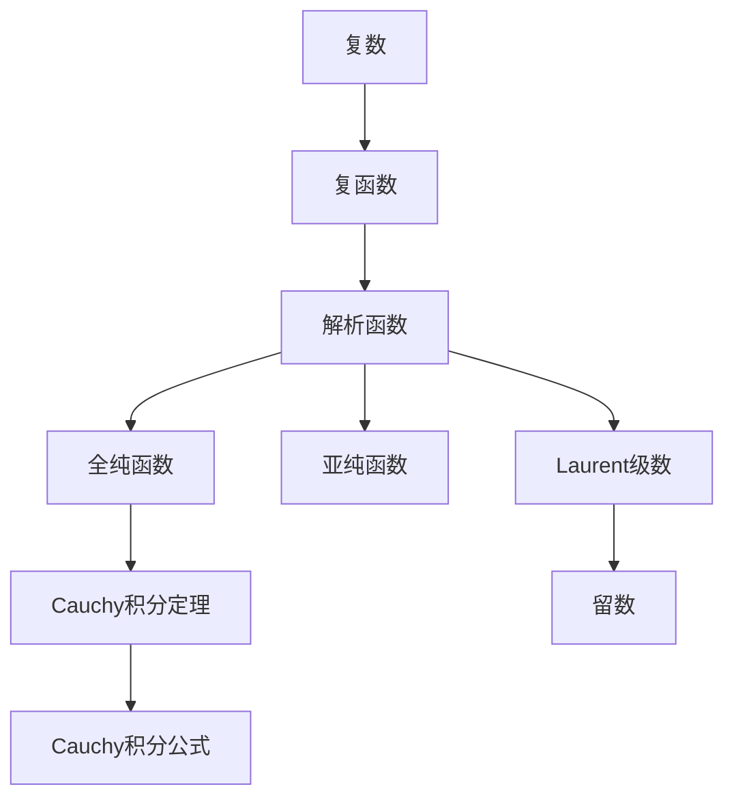
```mermaid
graph TD
    A[复数] --> B[复函数]
    B --> C[解析函数]
    C --> D[全纯函数]
    C --> E[亚纯函数]
    D --> F[Cauchy积分定理]
    F --> G[Cauchy积分公式]
    C --> H[Laurent级数]
    H --> I[留数]
```

#### 关系说明（复分析概念网络）

- **复数 → 复函数**: 复函数 $f: \mathbb{C} \to \mathbb{C}$ 是复变量的函数
- **复函数 → 解析函数**: 解析函数在每点可展为幂级数；解析 $\leftrightarrow$ 全纯
- **解析函数 → 全纯函数**: 全纯函数在每点可微（复可微）；全纯 $\Rightarrow$ 无限可微
- **解析函数 → 亚纯函数**: 亚纯函数除孤立奇点外全纯；是有理函数的推广
- **全纯函数 → Cauchy积分定理**: 全纯函数在单连通区域上的积分为零
- **Cauchy积分定理 → Cauchy积分公式**: 用边界值表示内部值；$f(z) = \frac{1}{2\pi i} \oint_\gamma \frac{f(\zeta)}{\zeta - z} d\zeta$
- **解析函数 → Laurent级数**: 在环域上可展为Laurent级数；$f(z) = \sum_{n=-\infty}^\infty a_n (z-a)^n$
- **Laurent级数 → 留数**: 留数 $\text{Res}(f,a) = a_{-1}$ 是Laurent级数的 $-1$ 次项系数；用于计算积分

---

## 🔗 四、几何学概念网络 (编号: C.05.01.05)

### 4.1 欧氏几何概念网络

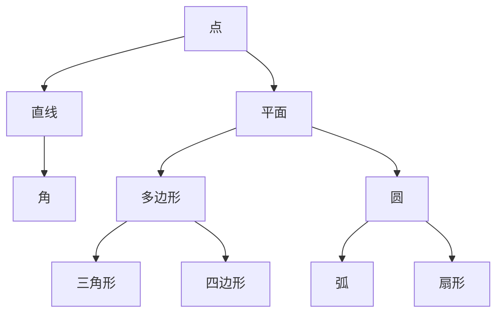
```mermaid
graph TD
    A[点] --> B[直线]
    A --> C[平面]
    B --> D[角]
    C --> E[多边形]
    E --> F[三角形]
    E --> G[四边形]
    C --> H[圆]
    H --> I[弧]
    H --> J[扇形]
```

#### 关系说明（欧氏几何概念网络）

- **点 → 直线**: 直线是点的集合，由两点确定；公理：两点确定唯一直线
- **点 → 平面**: 平面是点的集合，由不共线三点确定；公理：不共线三点确定唯一平面
- **直线 → 角**: 角是两条射线的夹角；由顶点和两条边确定
- **平面 → 多边形**: 多边形是平面上的封闭折线；由顶点和边组成
- **多边形 → 三角形**: 三角形是三边多边形；是最简单的多边形
- **多边形 → 四边形**: 四边形是四边多边形；包括平行四边形、矩形、正方形
- **平面 → 圆**: 圆是到定点距离等于定长的点的集合；由圆心和半径确定
- **圆 → 弧**: 弧是圆上两点间的部分；由圆心角和半径确定
- **圆 → 扇形**: 扇形是圆和两条半径围成的区域；面积与圆心角成正比

### 4.2 微分几何概念网络

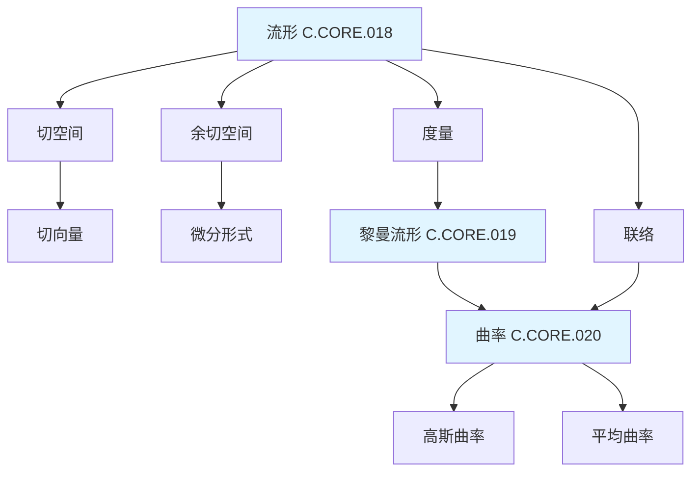
```mermaid
graph TD
    A[流形 C.CORE.018] --> B[切空间]
    B --> C[切向量]
    A --> D[余切空间]
    D --> E[微分形式]
    A --> F[度量]
    F --> G[黎曼流形 C.CORE.019]
    G --> H[曲率 C.CORE.020]
    H --> I[高斯曲率]
    H --> J[平均曲率]
    A --> K[联络]
    K --> H

    style A fill:#e1f5ff
    style G fill:#e1f5ff
    style H fill:#e1f5ff
```

#### 关系说明（微分几何概念网络）

- **流形 → 切空间**: 切空间 $T_p M$ 是流形 $M$ 在点 $p$ 的切向量空间；$\dim T_p M = \dim M$
- **切空间 → 切向量**: 切向量是切空间的元素；表示方向导数
- **流形 → 余切空间**: 余切空间 $T_p^* M$ 是切空间的对偶空间；$\dim T_p^* M = \dim T_p M$
- **余切空间 → 微分形式**: 微分形式是余切空间的元素；$k$-形式是 $k$ 个余切向量的外积
- **流形 → 度量**: 度量是在每点定义的内积；度量距离、角度、体积
- **度量 → 黎曼度量**: 黎曼度量是正定对称双线性形式；定义黎曼流形
- **流形 → 联络**: 联络是切空间的平行移动；定义协变导数
- **联络 → 曲率**: 曲率衡量流形偏离平坦空间的程度；由联络定义
- **曲率 → 高斯曲率**: 高斯曲率是2维流形的内蕴曲率；由第一基本形式确定
- **曲率 → 平均曲率**: 平均曲率是2维流形在外围空间中的弯曲程度；由第二基本形式确定

---

## 🔗 五、数论概念网络 (编号: C.05.01.05.5)

### 5.5 数论概念网络 ⭐ 新增

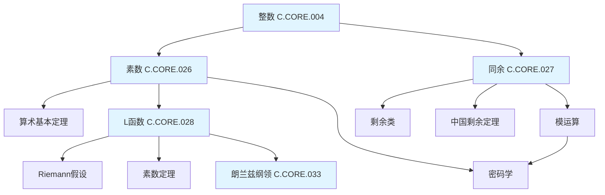
```mermaid
graph TD
    A[整数 C.CORE.004] --> B[素数 C.CORE.026]
    B --> C[算术基本定理]
    A --> D[同余 C.CORE.027]
    D --> E[剩余类]
    D --> F[中国剩余定理]
    B --> G[L函数 C.CORE.028]
    G --> H[Riemann假设]
    G --> I[素数定理]
    D --> J[模运算]
    J --> K[密码学]
    B --> K
    G --> L[朗兰兹纲领 C.CORE.033]

    style A fill:#e1f5ff
    style B fill:#e1f5ff
    style D fill:#e1f5ff
    style G fill:#e1f5ff
    style L fill:#e1f5ff
```

#### 关系说明（数论概念网络）

- **整数 → 素数**: 素数是大于1且只有1和自身两个正因子的整数；算术基本定理的基础
- **素数 → 算术基本定理**: 每个大于1的整数可以唯一分解为素数的乘积；数论的基础定理
- **整数 → 同余**: 同余 $a \equiv b \pmod{m}$ 表示 $m$ 整除 $a-b$；模运算的基础
- **同余 → 剩余类**: 剩余类 $[a]_m = \{b : b \equiv a \pmod{m}\}$ 是同余关系下的等价类
- **同余 → 中国剩余定理**: 若 $m_1, \ldots, m_n$ 两两互素，则同余方程组有唯一解模 $m_1 \cdots m_n$
- **素数 → L函数**: L函数是数论中的重要函数；$\zeta(s) = \sum_{n=1}^\infty \frac{1}{n^s}$ 是Riemann zeta函数
- **L函数 → Riemann假设**: Riemann假设是关于 $\zeta(s)$ 零点分布的猜想；Millennium Prize Problem
- **L函数 → 素数定理**: 素数定理 $\pi(x) \sim \frac{x}{\ln x}$ 通过 $\zeta(s)$ 的零点分布证明
- **同余 → 模运算**: 模运算是同余关系的运算；$a + b \pmod{m}$，$ab \pmod{m}$
- **模运算 → 密码学**: 模运算在密码学中广泛应用；RSA加密、椭圆曲线密码
- **素数 → 密码学**: 素数在密码学中至关重要；RSA加密基于大数分解的困难性
- **L函数 → 朗兰兹纲领**: L函数是朗兰兹纲领的核心；连接数论、代数几何和表示论

---

## 🔗 六、跨分支概念关联 (编号: C.05.01.06)

### 5.1 图论概念网络 ⭐ 新增

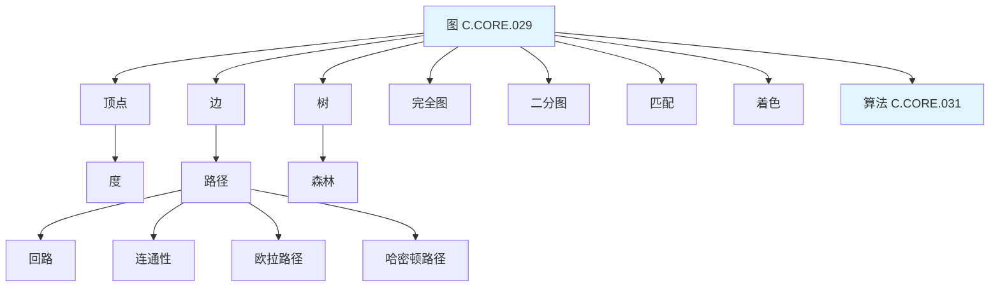
```mermaid
graph TD
    A[图 C.CORE.029] --> B[顶点]
    A --> C[边]
    B --> D[度]
    C --> E[路径]
    E --> F[回路]
    E --> G[连通性]
    A --> H[树]
    H --> I[森林]
    A --> J[完全图]
    A --> K[二分图]
    E --> L[欧拉路径]
    E --> M[哈密顿路径]
    A --> N[匹配]
    A --> O[着色]
    A --> P[算法 C.CORE.031]

    style A fill:#e1f5ff
    style P fill:#e1f5ff
```

#### 关系说明（图论概念网络）

- **图 → 顶点**: 顶点是图的基本元素；图 $G = (V, E)$ 由顶点集 $V$ 和边集 $E$ 组成
- **图 → 边**: 边连接两个顶点；边 $(u,v) \in E$ 表示顶点 $u$ 和 $v$ 相邻
- **顶点 → 度**: 度 $\deg(v)$ 是与顶点 $v$ 相邻的边数；握手引理：$\sum_{v \in V} \deg(v) = 2|E|$
- **边 → 路径**: 路径是边的序列 $(e_1, \ldots, e_k)$，使得相邻边共享顶点
- **路径 → 回路**: 回路是起点和终点相同的路径；回路是特殊的路径
- **路径 → 连通性**: 图连通当且仅当任意两点间有路径；连通性是图的基本性质
- **图 → 树**: 树是连通无环图；树有 $n$ 个顶点和 $n-1$ 条边
- **树 → 森林**: 森林是无环图（树的并）；森林的每个连通分量是树
- **图 → 完全图**: 完全图 $K_n$ 是每对顶点都相邻的图；$K_n$ 有 $\binom{n}{2}$ 条边
- **图 → 二分图**: 二分图的顶点可以分成两部分，边只连接不同部分的顶点
- **路径 → 欧拉路径**: 欧拉路径是经过每条边恰好一次的路径；存在性由度数的奇偶性决定
- **路径 → 哈密顿路径**: 哈密顿路径是经过每个顶点恰好一次的路径；存在性判定困难
- **图 → 匹配**: 匹配是边的集合，使得没有两条边共享顶点；最大匹配问题
- **图 → 着色**: 着色是将顶点或边着色，使得相邻元素颜色不同；四色定理

### 5.2 组合数学概念网络 ⭐ 新增

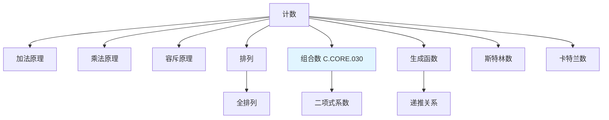
```mermaid
graph TD
    A[计数] --> B[加法原理]
    A --> C[乘法原理]
    A --> D[容斥原理]
    A --> E[排列]
    A --> F[组合数 C.CORE.030]
    E --> G[全排列]
    F --> H[二项式系数]
    A --> I[生成函数]
    I --> J[递推关系]
    A --> K[斯特林数]
    A --> L[卡特兰数]

    style F fill:#e1f5ff
```

#### 关系说明（组合数学概念网络）

- **计数 → 加法原理**: 互斥事件的计数；若 $A_1, \ldots, A_n$ 互斥，则 $|A_1 \cup \cdots \cup A_n| = \sum |A_i|$
- **计数 → 乘法原理**: 独立选择的计数；若选择 $A$ 有 $m$ 种方法，选择 $B$ 有 $n$ 种方法，则选择 $(A,B)$ 有 $mn$ 种方法
- **计数 → 容斥原理**: 并集的计数；$|A_1 \cup \cdots \cup A_n| = \sum |A_i| - \sum_{i<j} |A_i \cap A_j| + \cdots$
- **计数 → 排列**: 排列 $P(n,k) = \frac{n!}{(n-k)!}$ 是从 $n$ 个元素中选 $k$ 个的有序排列
- **计数 → 组合**: 组合 $C(n,k) = \binom{n}{k} = \frac{n!}{k!(n-k)!}$ 是从 $n$ 个元素中选 $k$ 个的无序选择
- **排列 → 全排列**: 全排列 $n!$ 是 $n$ 个元素的所有排列；$P(n,n) = n!$
- **组合 → 二项式系数**: 二项式系数 $\binom{n}{k}$ 是组合数；$(x+y)^n = \sum_{k=0}^n \binom{n}{k} x^k y^{n-k}$
- **计数 → 生成函数**: 生成函数 $G(x) = \sum_{n=0}^\infty a_n x^n$ 用级数表示序列
- **生成函数 → 递推关系**: 生成函数可以求解递推关系；通过生成函数的运算
- **计数 → 斯特林数**: 斯特林数推广排列和组合；第一类 $s(n,k)$ 和第二类 $S(n,k)$
- **计数 → 卡特兰数**: 卡特兰数 $C_n = \frac{1}{n+1}\binom{2n}{n}$ 计数特定结构；括号匹配、二叉树

### 5.3 计算理论概念网络 ⭐ 新增

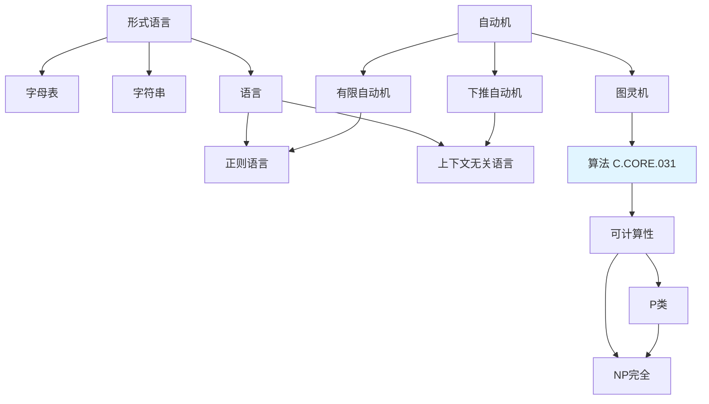
```mermaid
graph TD
    A[形式语言] --> B[字母表]
    A --> C[字符串]
    A --> D[语言]
    D --> E[正则语言]
    D --> F[上下文无关语言]
    G[自动机] --> H[有限自动机]
    G --> I[下推自动机]
    G --> J[图灵机]
    H --> E
    I --> F
    J --> K[算法 C.CORE.031]
    K --> L[可计算性]
    L --> M[P类]
    L --> N[NP类]

    style K fill:#e1f5ff
    M --> N[NP完全]
```

#### 关系说明（计算理论概念网络）

- **形式语言 → 字母表**: 字母表 $\Sigma$ 是符号的有限集合；形式语言的基础
- **形式语言 → 字符串**: 字符串是字母表上符号的有限序列；$\Sigma^*$ 是所有字符串的集合
- **形式语言 → 语言**: 语言 $L \subseteq \Sigma^*$ 是字符串的集合；形式语言研究的对象
- **语言 → 正则语言**: 正则语言可以用正则表达式描述；由有限自动机识别
- **语言 → 上下文无关语言**: 上下文无关语言可以用上下文无关文法生成；由下推自动机识别
- **自动机 → 有限自动机**: 有限自动机识别正则语言；状态有限，输入驱动
- **自动机 → 下推自动机**: 下推自动机识别上下文无关语言；有栈作为辅助存储
- **自动机 → 图灵机**: 图灵机是计算模型；识别递归可枚举语言，定义可计算性
- **有限自动机 → 正则语言**: 有限自动机识别的语言是正则语言；Kleene定理
- **下推自动机 → 上下文无关语言**: 下推自动机识别的语言是上下文无关语言
- **图灵机 → 可计算性**: 可计算函数是图灵机可计算的函数；Church-Turing论题
- **可计算性 → P类**: P类是多项式时间可判定的语言；$P = \bigcup_{k \\geq 0} \text{DTIME}(n^k)$
- **可计算性 → NP类**: NP类是非确定性多项式时间可判定的语言；$NP = \bigcup_{k \\geq 0} \text{NTIME}(n^k)$
- **NP类 → NP完全**: NP完全问题是NP中最难的问题；所有NP问题可以归约到它

### 6.1 代数-几何关联

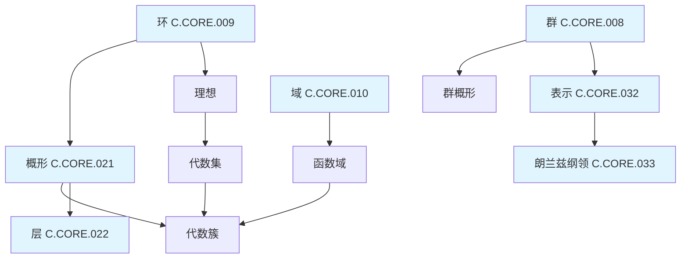
```mermaid
graph TD
    A[环 C.CORE.009] --> B[概形 C.CORE.021]
    B --> C[代数簇]
    B --> D[层 C.CORE.022]
    A --> E[理想]
    E --> F[代数集]
    F --> C
    G[群 C.CORE.008] --> H[群概形]
    I[域 C.CORE.010] --> J[函数域]
    J --> C
    G --> K[表示 C.CORE.032]
    K --> L[朗兰兹纲领 C.CORE.033]

    style A fill:#e1f5ff
    style B fill:#e1f5ff
    style D fill:#e1f5ff
    style G fill:#e1f5ff
    style I fill:#e1f5ff
    style K fill:#e1f5ff
    style L fill:#e1f5ff
```

#### 关系说明（代数-几何关联）

- **环 → 概形**: 概形 $\text{Spec}(R)$ 是环 $R$ 的素理想集合，配备Zariski拓扑和结构层；代数几何的基础
- **概形 → 代数簇**: 代数簇是概形的特殊情况；由多项式方程定义的几何对象
- **环 → 理想**: 理想对应概形的闭子集；$V(I) = \{p \in \text{Spec}(R) : I \subseteq p\}$
- **理想 → 代数集**: 代数集 $V(I)$ 是理想 $I$ 的零点集；Hilbert零点定理
- **代数集 → 代数簇**: 代数簇是不可约的代数集；代数几何的基本对象
- **群 → 群概形**: 群概形是概形上的群结构；群作用、群表示
- **域 → 函数域**: 函数域是代数簇上的有理函数域；代数几何的重要工具
- **函数域 → 代数簇**: 函数域描述代数簇的几何性质；维数、奇点

### 6.2 分析-几何关联

```mermaid
graph TD
    A[函数 C.CORE.002] --> B[流形上的函数]
    C[导数 C.CORE.015] --> D[切向量]
    E[积分 C.CORE.016] --> F[微分形式]
    G[级数 C.CORE.017] --> H[流形上的级数]
    I[复函数] --> J[复流形]
    K[流形 C.CORE.018] --> L[黎曼流形 C.CORE.019]
    L --> M[曲率 C.CORE.020]

    style A fill:#e1f5ff
    style C fill:#e1f5ff
    style E fill:#e1f5ff
    style G fill:#e1f5ff
    style K fill:#e1f5ff
    style L fill:#e1f5ff
    style M fill:#e1f5ff
```

#### 关系说明（分析-几何关联）

- **函数 → 流形上的函数**: 流形上的函数 $f: M \to \mathbb{R}$ 是光滑函数；定义在流形上
- **导数 → 切向量**: 切向量是方向导数；$v(f) = \sum v^i \frac{\partial f}{\partial x^i}$
- **积分 → 微分形式**: 微分形式是积分的被积函数；$\int_M \omega$ 是 $k$-形式在 $k$-流形上的积分
- **级数 → 流形上的级数**: 流形上的级数展开；Taylor级数、Fourier级数
- **复函数 → 复流形**: 复流形是复解析流形；复分析在几何中的应用

### 6.3 拓扑-代数关联

```mermaid
graph TD
    A[拓扑空间 C.CORE.023] --> B[连续函数]
    C[群 C.CORE.008] --> D[拓扑群]
    E[环 C.CORE.009] --> F[拓扑环]
    G[同调 C.CORE.025] --> H[同调代数]
    I[同伦 C.CORE.024] --> J[同伦论]
    A --> I
    A --> G

    style A fill:#e1f5ff
    style C fill:#e1f5ff
    style E fill:#e1f5ff
    style G fill:#e1f5ff
    style I fill:#e1f5ff
```

#### 关系说明（拓扑-代数关联）

- **拓扑空间 → 连续函数**: 连续函数保持拓扑结构；$f: X \to Y$ 连续当且仅当开集的原像是开集
- **群 → 拓扑群**: 拓扑群是配备拓扑的群，群运算连续；李群、紧群
- **环 → 拓扑环**: 拓扑环是配备拓扑的环，环运算连续；局部环、赋值环
- **同调群 → 同调代数**: 同调代数用代数方法研究同调；链复形、导出函子
- **同伦群 → 同伦论**: 同伦论研究同伦等价；基本群、高阶同伦群

---

## 📊 七、概念关联强度矩阵 (编号: C.05.01.07)

### 6.1 基础数学概念关联强度

| 概念1 | 概念2 | 关联类型 | 关联强度 | 说明 |
|------|------|---------|---------|------|
| **集合** | **子集** | 包含关系 | ⭐⭐⭐⭐⭐ | 直接包含 |
| **集合** | **函数** | 定义关系 | ⭐⭐⭐⭐⭐ | 函数定义在集合上 |
| **关系** | **等价关系** | 特殊化 | ⭐⭐⭐⭐⭐ | 特殊类型关系 |
| **自然数** | **整数** | 扩展关系 | ⭐⭐⭐⭐⭐ | 自然扩展 |
| **实数** | **复数** | 扩展关系 | ⭐⭐⭐⭐⭐ | 自然扩展 |

### 6.2 代数结构概念关联强度

| 概念1 | 概念2 | 关联类型 | 关联强度 | 说明 |
|------|------|---------|---------|------|
| **群** | **子群** | 包含关系 | ⭐⭐⭐⭐⭐ | 直接包含 |
| **群** | **群同态** | 映射关系 | ⭐⭐⭐⭐⭐ | 群之间的映射 |
| **群** | **正规子群** | 特殊化 | ⭐⭐⭐⭐⭐ | 特殊子群 |
| **环** | **理想** | 结构关系 | ⭐⭐⭐⭐⭐ | 环的子结构 |
| **环** | **域** | 特殊化 | ⭐⭐⭐⭐ | 特殊环 |
| **偏序集** | **格** | 特殊化 | ⭐⭐⭐⭐⭐ | 格是特殊的偏序集 |
| **格** | **分配格** | 特殊化 | ⭐⭐⭐⭐ | 分配格是特殊的格 |
| **分配格** | **布尔代数** | 特殊化 | ⭐⭐⭐⭐⭐ | 布尔代数是有补分配格 |
| **布尔代数** | **布尔环** | 对应关系 | ⭐⭐⭐⭐⭐ | 布尔代数与布尔环一一对应 |
| **格** | **完备格** | 推广关系 | ⭐⭐⭐⭐ | 完备格是格的推广 |
| **完备格** | **域理论** | 应用关系 | ⭐⭐⭐⭐ | 域理论使用完备格 |

### 6.3 离散数学概念关联强度 ⭐ 新增

| 概念1 | 概念2 | 关联类型 | 关联强度 | 说明 |
|------|------|---------|---------|------|
| **图** | **顶点** | 组成关系 | ⭐⭐⭐⭐⭐ | 图由顶点组成 |
| **图** | **边** | 组成关系 | ⭐⭐⭐⭐⭐ | 图由边组成 |
| **路径** | **回路** | 特殊化 | ⭐⭐⭐⭐⭐ | 回路是特殊路径 |
| **图** | **树** | 特殊化 | ⭐⭐⭐⭐⭐ | 树是连通无圈图 |
| **排列** | **组合** | 相关关系 | ⭐⭐⭐⭐ | 排列有序，组合无序 |
| **生成函数** | **递推关系** | 应用关系 | ⭐⭐⭐⭐ | 生成函数解递推 |
| **自动机** | **形式语言** | 识别关系 | ⭐⭐⭐⭐⭐ | 自动机识别语言 |
| **图灵机** | **可计算性** | 定义关系 | ⭐⭐⭐⭐⭐ | 图灵机定义可计算性 |

### 6.4 跨分支概念关联强度

| 概念1 | 概念2 | 关联类型 | 关联强度 | 说明 |
|------|------|---------|---------|------|
| **群** | **拓扑群** | 交叉融合 | ⭐⭐⭐⭐ | 群+拓扑 |
| **环** | **概形** | 交叉融合 | ⭐⭐⭐⭐⭐ | 代数几何核心 |
| **函数** | **流形上的函数** | 应用关系 | ⭐⭐⭐⭐ | 函数在流形上 |
| **同调群** | **同调代数** | 交叉融合 | ⭐⭐⭐⭐⭐ | 拓扑+代数 |

**关联强度图例**:

- ⭐⭐⭐⭐⭐ 极强关联（直接定义或包含关系）
- ⭐⭐⭐⭐ 强关联（重要应用或交叉关系）
- ⭐⭐⭐ 中等关联（部分应用关系）
- ⭐⭐ 弱关联（偶尔应用关系）
- ⭐ 很弱关联（极少应用关系）

---

## 🔗 关联文档 (编号: C.05.01.08)

### 知识关联网络文档

- [知识关联网络总览 (C.05.00)](./00-知识关联网络总览.md)
- [概念级关联网络 (C.05.01)](./01-概念级关联网络.md) - 本文档
- [定理级关联网络 (C.05.02)](./02-定理级关联网络.md)
- [方法级关联网络 (C.05.03)](./03-方法级关联网络.md)

### 集合论与范畴论视角文档 ⭐ 新增

- [集合论视角的概念层次结构分析](../00-集合论视角的概念层次结构分析.md) - 集合论视角分析
- [范畴论视角的概念关系动态表征](../00-范畴论视角的概念关系动态表征.md) - 范畴论视角分析
- [集合论与范畴论视角整合分析](../00-集合论与范畴论视角整合分析.md) - 双视角整合分析
- [集合论与范畴论视角-核心概念双视角索引](../00-集合论与范畴论视角-核心概念双视角索引.md) - 双视角索引
- [集合论与范畴论视角概念关系矩阵](../02-知识矩阵/12-集合论与范畴论视角概念关系矩阵.md) - 概念关系矩阵

### 相关文档

- [主题概念总览](../03-主题概念梳理/00-主题概念总览.md)
- [基础数学概念](../03-主题概念梳理/01-基础数学概念.md)
- [代数结构概念](../03-主题概念梳理/02-代数结构概念.md)
- [分支关联矩阵](../02-知识矩阵/01-分支关联矩阵.md)

---

**创建日期**: 2025年11月21日
**最后更新**: 2025年11月28日（数学解释、论证、表征全面完成）
**维护状态**: 持续更新中
**版本**: v2.0
