# 概念级关联网络

**主题编号**: C.05.01
**创建日期**: 2025年11月21日
**最后更新**: 2025年11月21日

---

## 📋 目录 / Table of Contents

- [概念级关联网络](#概念级关联网络)
  - [📋 目录 / Table of Contents](#-目录--table-of-contents)
  - [📋 概述 (编号: C.05.01.01)](#-概述-编号-c050101)
  - [🔗 一、基础数学概念网络 (编号: C.05.01.02)](#-一基础数学概念网络-编号-c050102)
    - [1.1 集合论概念网络](#11-集合论概念网络)
    - [1.2 数系概念网络](#12-数系概念网络)
  - [🔗 二、代数结构概念网络 (编号: C.05.01.03)](#-二代数结构概念网络-编号-c050103)
    - [2.1 群论概念网络](#21-群论概念网络)
    - [2.2 环论概念网络](#22-环论概念网络)
    - [2.3 域论概念网络](#23-域论概念网络)
  - [🔗 三、分析学概念网络 (编号: C.05.01.04)](#-三分析学概念网络-编号-c050104)
    - [3.1 实分析概念网络](#31-实分析概念网络)
    - [3.2 复分析概念网络](#32-复分析概念网络)
  - [🔗 四、几何学概念网络 (编号: C.05.01.05)](#-四几何学概念网络-编号-c050105)
    - [4.1 欧氏几何概念网络](#41-欧氏几何概念网络)
    - [4.2 微分几何概念网络](#42-微分几何概念网络)
  - [🔗 五、跨分支概念关联 (编号: C.05.01.06)](#-五跨分支概念关联-编号-c050106)
    - [5.1 代数-几何关联](#51-代数-几何关联)
    - [5.2 分析-几何关联](#52-分析-几何关联)
    - [5.3 拓扑-代数关联](#53-拓扑-代数关联)
  - [📊 六、概念关联强度矩阵 (编号: C.05.01.07)](#-六概念关联强度矩阵-编号-c050107)
    - [6.1 基础数学概念关联强度](#61-基础数学概念关联强度)
    - [6.2 代数结构概念关联强度](#62-代数结构概念关联强度)
    - [6.3 跨分支概念关联强度](#63-跨分支概念关联强度)
  - [🔗 关联文档 (编号: C.05.01.08)](#-关联文档-编号-c050108)
    - [知识关联网络文档](#知识关联网络文档)
    - [相关文档](#相关文档)

---

## 📋 概述 (编号: C.05.01.01)

本文档提供FormalMath项目的概念级关联网络，展示具体数学概念之间的关联关系。

**目标**: 建立细粒度的概念关联网络体系

---

## 🔗 一、基础数学概念网络 (编号: C.05.01.02)

### 1.1 集合论概念网络

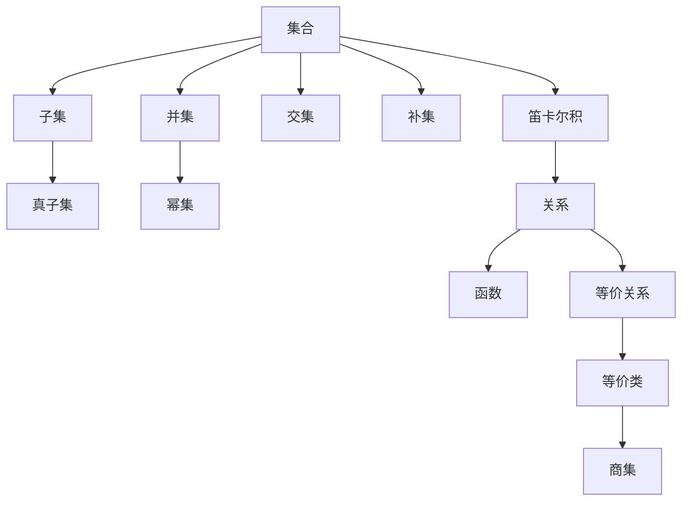

### 1.2 数系概念网络

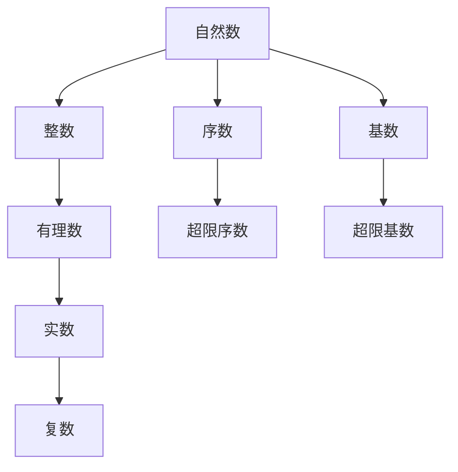

---

## 🔗 二、代数结构概念网络 (编号: C.05.01.03)

### 2.1 群论概念网络

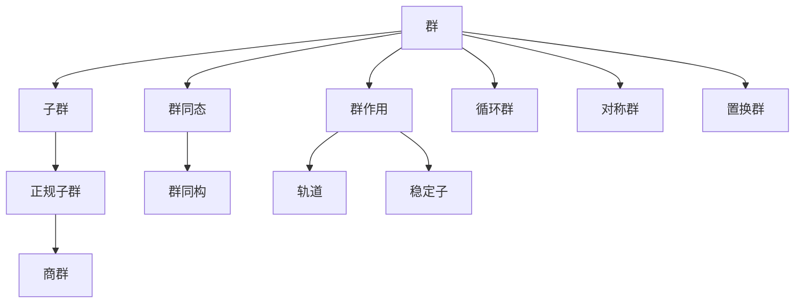

### 2.2 环论概念网络

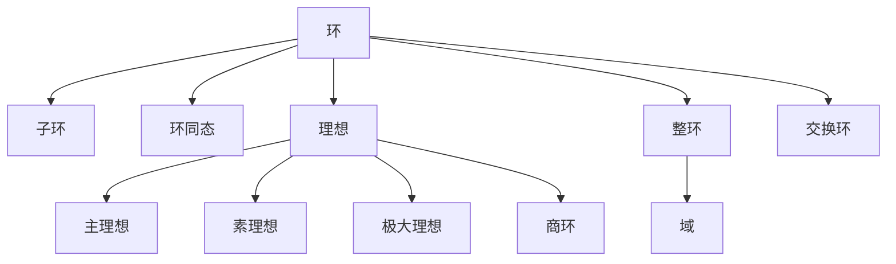

### 2.3 域论概念网络

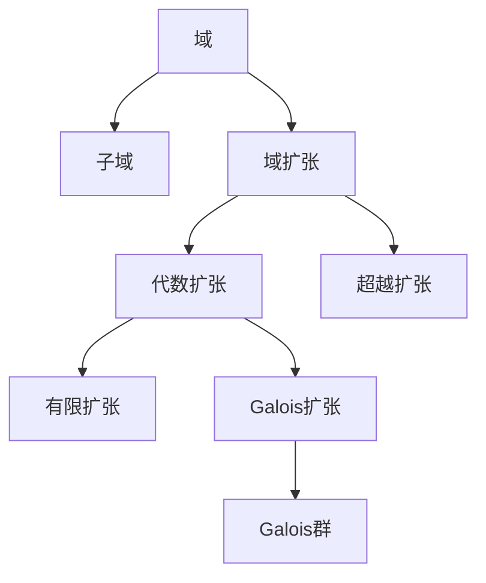

---

## 🔗 三、分析学概念网络 (编号: C.05.01.04)

### 3.1 实分析概念网络

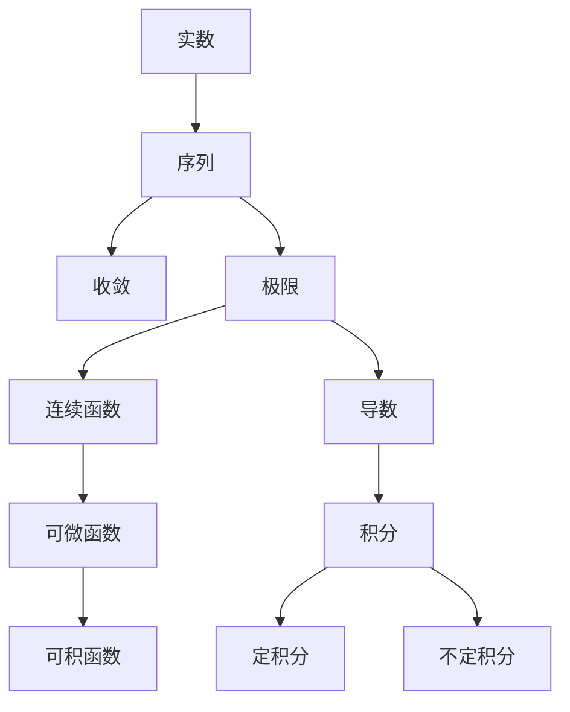

### 3.2 复分析概念网络

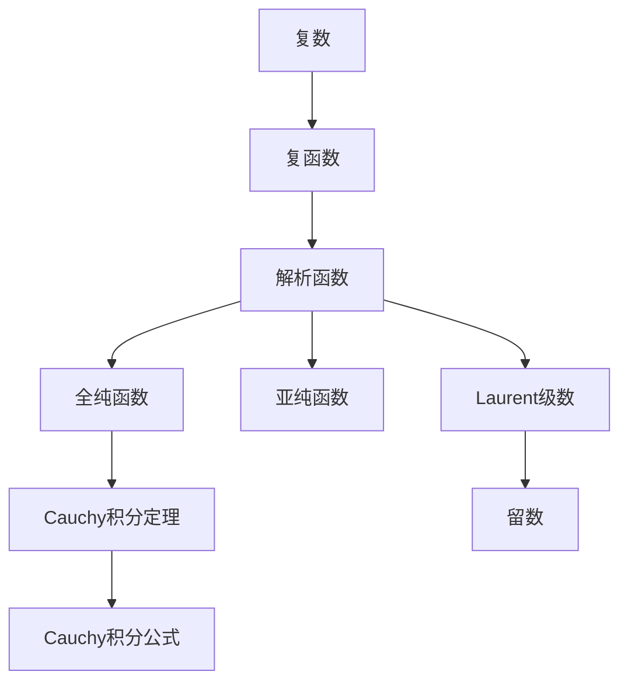

---

## 🔗 四、几何学概念网络 (编号: C.05.01.05)

### 4.1 欧氏几何概念网络

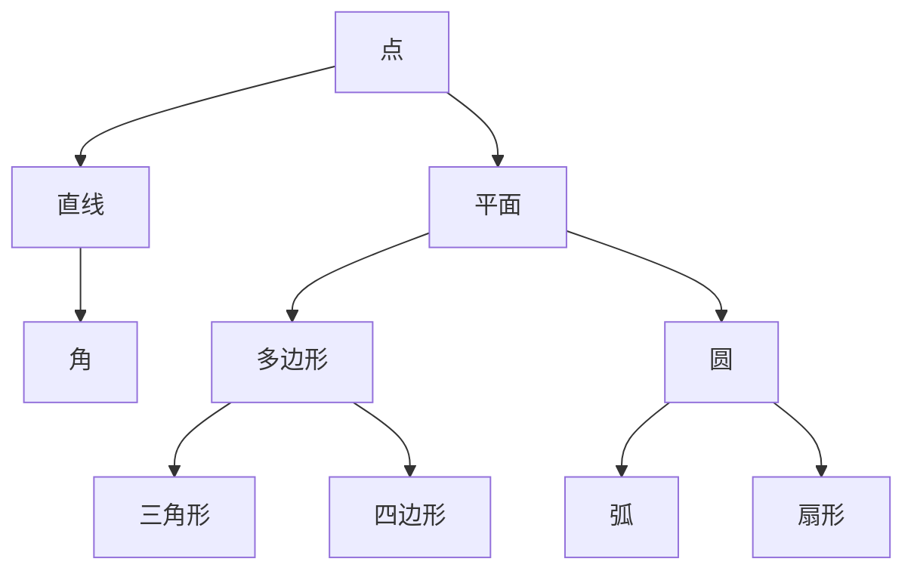

### 4.2 微分几何概念网络

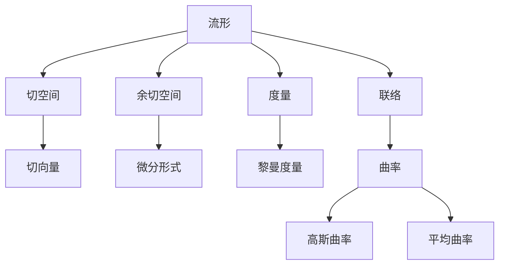

---

## 🔗 五、跨分支概念关联 (编号: C.05.01.06)

### 5.1 代数-几何关联

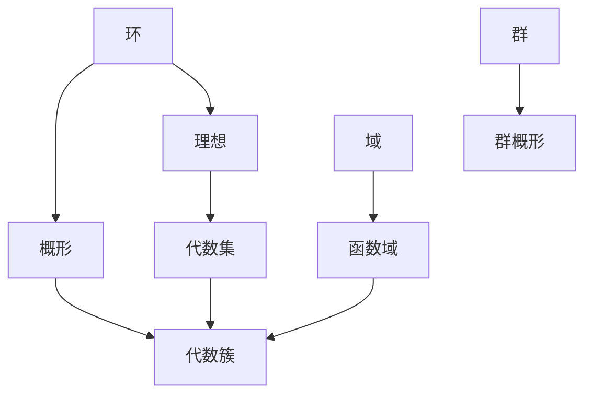

### 5.2 分析-几何关联

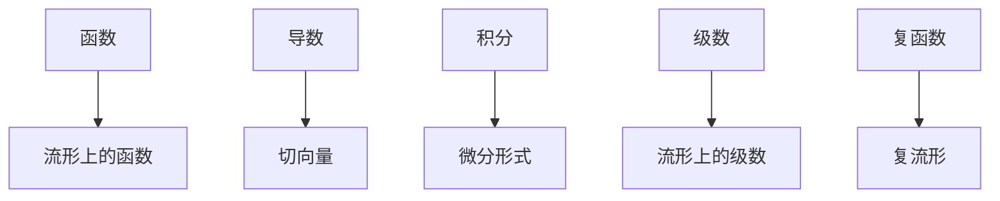

### 5.3 拓扑-代数关联

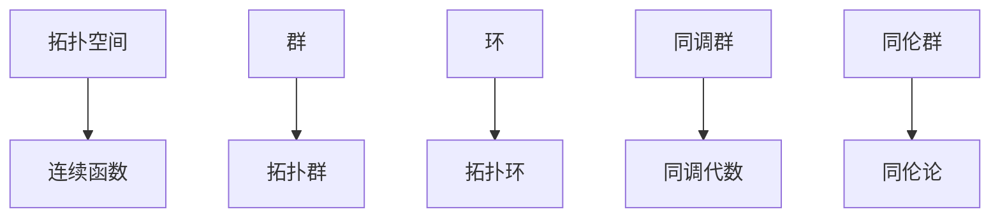

---

## 📊 六、概念关联强度矩阵 (编号: C.05.01.07)

### 6.1 基础数学概念关联强度

| 概念1 | 概念2 | 关联类型 | 关联强度 | 说明 |
|------|------|---------|---------|------|
| **集合** | **子集** | 包含关系 | ⭐⭐⭐⭐⭐ | 直接包含 |
| **集合** | **函数** | 定义关系 | ⭐⭐⭐⭐⭐ | 函数定义在集合上 |
| **关系** | **等价关系** | 特殊化 | ⭐⭐⭐⭐⭐ | 特殊类型关系 |
| **自然数** | **整数** | 扩展关系 | ⭐⭐⭐⭐⭐ | 自然扩展 |
| **实数** | **复数** | 扩展关系 | ⭐⭐⭐⭐⭐ | 自然扩展 |

### 6.2 代数结构概念关联强度

| 概念1 | 概念2 | 关联类型 | 关联强度 | 说明 |
|------|------|---------|---------|------|
| **群** | **子群** | 包含关系 | ⭐⭐⭐⭐⭐ | 直接包含 |
| **群** | **群同态** | 映射关系 | ⭐⭐⭐⭐⭐ | 群之间的映射 |
| **群** | **正规子群** | 特殊化 | ⭐⭐⭐⭐⭐ | 特殊子群 |
| **环** | **理想** | 结构关系 | ⭐⭐⭐⭐⭐ | 环的子结构 |
| **环** | **域** | 特殊化 | ⭐⭐⭐⭐ | 特殊环 |

### 6.3 跨分支概念关联强度

| 概念1 | 概念2 | 关联类型 | 关联强度 | 说明 |
|------|------|---------|---------|------|
| **群** | **拓扑群** | 交叉融合 | ⭐⭐⭐⭐ | 群+拓扑 |
| **环** | **概形** | 交叉融合 | ⭐⭐⭐⭐⭐ | 代数几何核心 |
| **函数** | **流形上的函数** | 应用关系 | ⭐⭐⭐⭐ | 函数在流形上 |
| **同调群** | **同调代数** | 交叉融合 | ⭐⭐⭐⭐⭐ | 拓扑+代数 |

**关联强度图例**:

- ⭐⭐⭐⭐⭐ 极强关联（直接定义或包含关系）
- ⭐⭐⭐⭐ 强关联（重要应用或交叉关系）
- ⭐⭐⭐ 中等关联（部分应用关系）
- ⭐⭐ 弱关联（偶尔应用关系）
- ⭐ 很弱关联（极少应用关系）

---

## 🔗 关联文档 (编号: C.05.01.08)

### 知识关联网络文档

- [知识关联网络总览 (C.05.00)](./00-知识关联网络总览.md)

### 相关文档

- [主题概念总览](../03-主题概念梳理/00-主题概念总览.md)
- [基础数学概念](../03-主题概念梳理/01-基础数学概念.md)
- [代数结构概念](../03-主题概念梳理/02-代数结构概念.md)
- [分支关联矩阵](../02-知识矩阵/01-分支关联矩阵.md)

---

**创建日期**: 2025年11月21日
**最后更新**: 2025年11月21日
**维护状态**: 持续更新中
**版本**: v1.0
