# 定理级关联网络

**主题编号**: C.05.02
**创建日期**: 2025年11月21日
**最后更新**: 2025年11月28日（数学解释、论证、表征全面完成）

---

## 📋 目录 / Table of Contents

- [定理级关联网络](#定理级关联网络)
  - [📋 目录 / Table of Contents](#-目录--table-of-contents)
  - [📋 概述 (编号: C.05.02.01)](#-概述-编号-c050201)
  - [📐 一、基础数学定理网络 (编号: C.05.02.02)](#-一基础数学定理网络-编号-c050202)
    - [1.1 集合论定理网络](#11-集合论定理网络)
      - [定理说明](#定理说明)
    - [1.2 数论基础定理网络](#12-数论基础定理网络)
      - [定理说明](#定理说明-1)
  - [📐 二、代数结构定理网络 (编号: C.05.02.03)](#-二代数结构定理网络-编号-c050203)
    - [2.1 群论定理网络](#21-群论定理网络)
      - [定理说明](#定理说明-2)
    - [2.2 环论定理网络](#22-环论定理网络)
      - [定理说明](#定理说明-3)
    - [2.3 域论定理网络](#23-域论定理网络)
      - [定理说明](#定理说明-4)
  - [📐 三、分析学定理网络 (编号: C.05.02.04)](#-三分析学定理网络-编号-c050204)
    - [3.1 实分析定理网络](#31-实分析定理网络)
      - [定理说明](#定理说明-5)
    - [3.2 复分析定理网络](#32-复分析定理网络)
      - [定理说明](#定理说明-6)
  - [📐 四、几何学定理网络 (编号: C.05.02.05)](#-四几何学定理网络-编号-c050205)
    - [4.1 欧氏几何定理网络](#41-欧氏几何定理网络)
      - [定理说明](#定理说明-7)
    - [4.2 微分几何定理网络](#42-微分几何定理网络)
      - [定理说明](#定理说明-8)
  - [📐 五、跨分支定理关联 (编号: C.05.02.06)](#-五跨分支定理关联-编号-c050206)
    - [5.1 代数-几何定理关联](#51-代数-几何定理关联)
    - [5.2 分析-几何定理关联](#52-分析-几何定理关联)
    - [5.3 拓扑-代数定理关联](#53-拓扑-代数定理关联)
    - [5.1 图论定理网络 ⭐ 新增](#51-图论定理网络--新增)
      - [定理说明](#定理说明-9)
    - [5.2 组合数学定理网络 ⭐ 新增](#52-组合数学定理网络--新增)
      - [定理说明](#定理说明-10)
    - [5.3 计算理论定理网络 ⭐ 新增](#53-计算理论定理网络--新增)
      - [定理说明](#定理说明-11)
  - [📊 七、定理依赖关系矩阵 (编号: C.05.02.07)](#-七定理依赖关系矩阵-编号-c050207)
    - [6.1 基础数学定理依赖](#61-基础数学定理依赖)
    - [6.2 代数结构定理依赖](#62-代数结构定理依赖)
    - [6.3 分析学定理依赖](#63-分析学定理依赖)
    - [6.4 离散数学定理依赖 ⭐ 新增](#64-离散数学定理依赖--新增)
    - [6.5 跨分支定理依赖](#65-跨分支定理依赖)
  - [🔗 关联文档 (编号: C.05.02.08)](#-关联文档-编号-c050208)
    - [知识关联网络文档](#知识关联网络文档)
    - [相关文档](#相关文档)

---

## 📋 概述 (编号: C.05.02.01)

本文档提供FormalMath项目的定理级关联网络，展示数学定理之间的依赖关系和应用关系。

**目标**: 建立定理级别的知识关联网络体系

**哲学维度**: 定理的证明方法和依赖关系也反映了哲学思想的影响。逻辑主义强调逻辑推理，形式主义强调形式证明，直觉主义强调构造性证明，建构主义强调可构造性。不同哲学流派对定理的证明有不同的要求。详见[数学哲学维度矩阵](../02-知识矩阵/09-数学哲学维度矩阵.md)。

---

## 📐 一、基础数学定理网络 (编号: C.05.02.02)

### 1.1 集合论定理网络

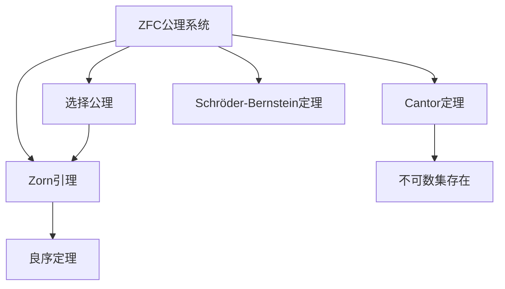

#### 定理说明

- **ZFC公理系统**: 集合论的公理化基础，包括外延、配对、并集、幂集、无穷、替换、选择公理
  - **作用**: 为所有数学提供基础，避免罗素悖论
  - **应用**: 所有数学分支的基础

- **选择公理 (AC)**: 对任意非空集合族，存在选择函数
  - **等价形式**: Zorn引理、良序定理
  - **争议**: 独立于其他公理，有非标准模型
  - **应用**: 证明存在性（如Hahn-Banach定理）

- **Zorn引理**: 若偏序集的每个链都有上界，则存在极大元
  - **证明思路**: 假设不存在极大元，构造严格递增链，与条件矛盾
  - **应用**: 证明基的存在（向量空间、理想）

- **良序定理**: 任意集合都可以良序化
  - **证明思路**: 使用Zorn引理，考虑所有良序子集
  - **应用**: 超限归纳、超限递归

- **Cantor定理**: 对任意集合 $A$，$|A| < |\mathcal{P}(A)|$
  - **证明思路**: 假设存在双射 $f: A \to \mathcal{P}(A)$，考虑 $B = \{x : x \notin f(x)\}$，导出矛盾
  - **应用**: 证明不可数集存在、连续统假设

- **Schröder-Bernstein定理**: 若 $|A| \leq |B|$ 且 $|B| \leq |A|$，则 $|A| = |B|$
  - **证明思路**: 构造双射，使用Cantor-Bernstein构造
  - **应用**: 证明集合等势

### 1.2 数论基础定理网络

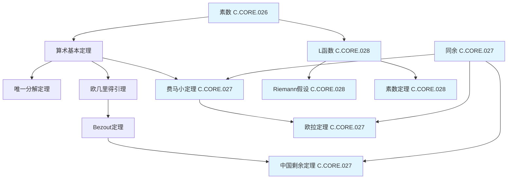

#### 定理说明

- **算术基本定理** (见[素数 C.CORE.026](../核心概念/26-素数.md)): 每个大于1的自然数都可以唯一地表示为素数的乘积
  - **内容**: $n = p_1^{e_1} p_2^{e_2} \cdots p_k^{e_k}$，其中 $p_i$ 是素数，$e_i$ 是正整数
  - **证明思路**: 存在性用归纳法，唯一性用欧几里得引理
  - **应用**: 数论基础、密码学、算法
  - **意义**: 数论的基础定理

- **唯一分解定理**: 算术基本定理的唯一性部分
  - **内容**: 素数分解的唯一性（不计顺序）
  - **证明思路**: 使用欧几里得引理，假设两种分解，证明相等
  - **应用**: 最大公因数、最小公倍数
  - **推广**: 唯一分解整环（UFD）

- **欧几里得引理**: 若素数 $p$ 整除 $ab$，则 $p$ 整除 $a$ 或 $p$ 整除 $b$
  - **内容**: $p \mid ab \Rightarrow p \mid a$ 或 $p \mid b$
  - **证明思路**: 使用Bezout定理，若 $p \nmid a$，则 $\gcd(p,a) = 1$，因此 $p \mid b$
  - **应用**: 证明唯一分解定理
  - **推广**: 素理想的性质

- **Bezout定理**: 对于整数 $a, b$，存在整数 $x, y$ 使得 $ax + by = \gcd(a,b)$
  - **内容**: $\gcd(a,b) = ax + by$ 有整数解
  - **证明思路**: 使用欧几里得算法，反向构造
  - **应用**: 扩展欧几里得算法、求解线性丢番图方程
  - **推广**: 主理想整环（PID）

- **中国剩余定理** (见[同余 C.CORE.027](../核心概念/27-同余.md)): 若 $m_1, \ldots, m_n$ 两两互素，则同余方程组有唯一解模 $m_1 \cdots m_n$
  - **内容**: 对于 $x \equiv a_i \pmod{m_i}$（$i=1,\ldots,n$），若 $\gcd(m_i, m_j) = 1$，则存在唯一解模 $M = m_1 \cdots m_n$
  - **证明思路**: 构造解，使用Bezout定理
  - **应用**: 密码学、编码理论、数论算法
  - **推广**: 环论中的中国剩余定理

- **费马小定理** (见[同余 C.CORE.027](../核心概念/27-同余.md)): 若 $p$ 是素数，$a$ 不被 $p$ 整除，则 $a^{p-1} \equiv 1 \pmod{p}$
  - **内容**: $p \nmid a \Rightarrow a^{p-1} \equiv 1 \pmod{p}$
  - **证明思路**: 使用群论（乘法群 $\mathbb{Z}_p^*$ 的阶为 $p-1$）或组合证明
  - **应用**: 素性测试、密码学（RSA）
  - **推广**: 欧拉定理

- **欧拉定理** (见[同余 C.CORE.027](../核心概念/27-同余.md)): 若 $\gcd(a,n) = 1$，则 $a^{\phi(n)} \equiv 1 \pmod{n}$，其中 $\phi$ 是欧拉函数
  - **内容**: $\gcd(a,n) = 1 \Rightarrow a^{\phi(n)} \equiv 1 \pmod{n}$
  - **证明思路**: 使用群论（乘法群 $\mathbb{Z}_n^*$ 的阶为 $\phi(n)$）
  - **应用**: 密码学、数论算法
  - **推广**: 费马小定理是 $n=p$ 时的特殊情况

---

## 📐 二、代数结构定理网络 (编号: C.05.02.03)

### 2.1 群论定理网络

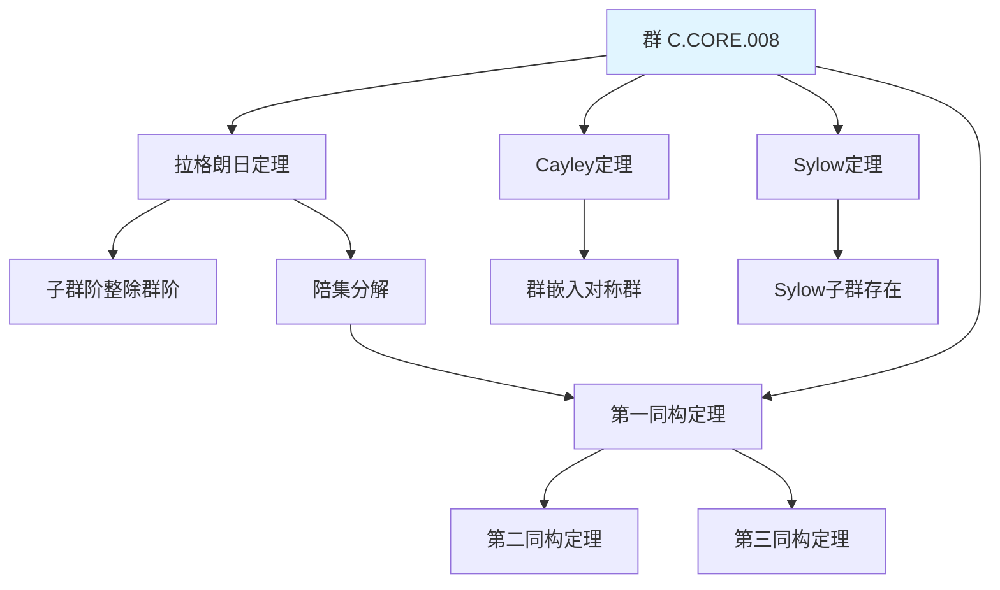

#### 定理说明

- **拉格朗日定理**: 有限群 $G$ 的子群 $H$ 的阶整除 $G$ 的阶：$|H| \mid |G|$
  - **证明思路**: 陪集构成 $G$ 的划分，所有陪集大小相等为 $|H|$
  - **应用**: 证明群论中的许多结果，如费马小定理、欧拉定理
  - **推论**: 群中元素的阶整除群的阶

- **第一同构定理**: 若 $\phi: G \to H$ 是群同态，则 $G/\ker(\phi) \cong \text{im}(\phi)$
  - **证明思路**: 构造同构 $\bar{\phi}: G/\ker(\phi) \to \text{im}(\phi)$，$\bar{\phi}(g\ker(\phi)) = \phi(g)$
  - **应用**: 分类群、构造同构

- **第二同构定理**: 若 $H \leq G$，$N \trianglelefteq G$，则 $HN/N \cong H/(H \cap N)$
  - **证明思路**: 应用第一同构定理到自然映射 $H \to HN/N$
  - **应用**: 分析子群结构

- **第三同构定理**: 若 $N \trianglelefteq G$，$K \trianglelefteq G$，$N \subseteq K$，则 $(G/N)/(K/N) \cong G/K$
  - **证明思路**: 应用第一同构定理
  - **应用**: 简化商群结构

- **Cayley定理**: 任意群 $G$ 同构于对称群 $S_n$ 的某个子群
  - **证明思路**: 构造群作用 $G \times G \to G$，得到嵌入 $G \hookrightarrow S_{|G|}$
  - **应用**: 证明群的表示、分类问题

- **Sylow定理**: 若 $|G| = p^a m$（$p$ 不整除 $m$），则存在 $p^a$ 阶子群（Sylow $p$-子群）
  - **证明思路**: 使用群作用和组合计数
  - **应用**: 分类有限群、证明非单群

### 2.2 环论定理网络

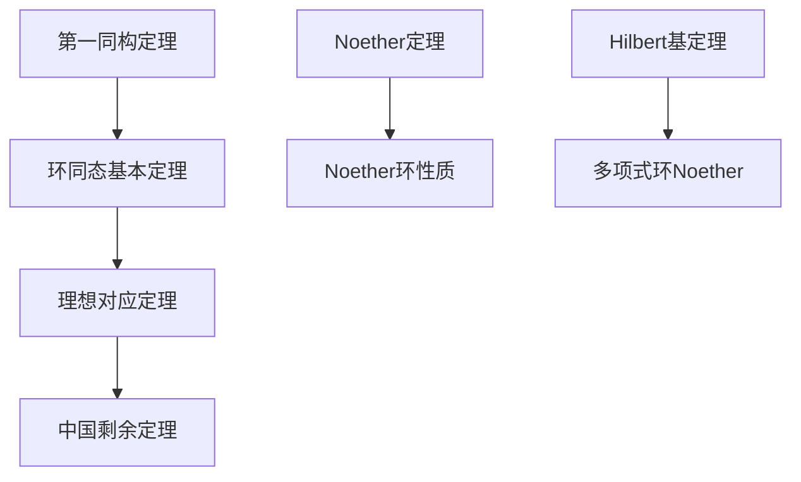

#### 定理说明

- **第一同构定理**: 若 $\phi: R \to S$ 是环同态，则 $R/\ker(\phi) \cong \text{im}(\phi)$
  - **证明思路**: 构造同构 $\bar{\phi}: R/\ker(\phi) \to \text{im}(\phi)$
  - **应用**: 分类环、构造同构
  - **推广**: 模的同构定理

- **理想对应定理**: 若 $I \trianglelefteq R$，则 $R$ 中包含 $I$ 的理想与 $R/I$ 的理想一一对应
  - **证明思路**: 建立对应关系，验证保持运算
  - **应用**: 分析理想结构、构造商环
  - **推广**: 子模对应定理

- **中国剩余定理**: 若 $I_1, \ldots, I_n$ 两两互素，则 $R/(I_1 \cap \cdots \cap I_n) \cong R/I_1 \times \cdots \times R/I_n$
  - **证明思路**: 构造同态，证明同构
  - **应用**: 数论、编码理论、插值
  - **推广**: 模的中国剩余定理

- **Noether定理**: 环 $R$ 是Noether环当且仅当每个理想都是有限生成的
  - **证明思路**: 使用升链条件
  - **应用**: 代数几何、交换代数
  - **推广**: Noether模

- **Hilbert基定理**: 若 $R$ 是Noether环，则 $R[x]$ 也是Noether环
  - **证明思路**: 使用归纳法，构造生成元
  - **应用**: 代数几何、多项式环
  - **推广**: 多元多项式环

### 2.3 域论定理网络

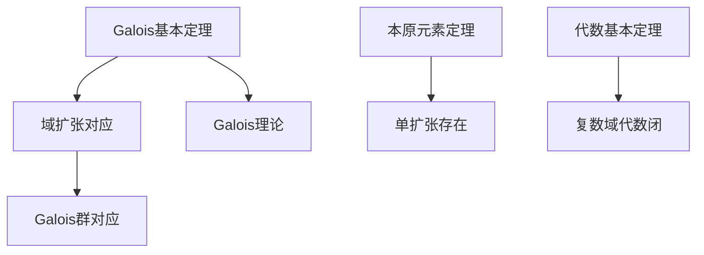

#### 定理说明

- **Galois基本定理**: Galois扩张的中间域与Galois群的子群一一对应
  - **内容**: 若 $K/F$ 是Galois扩张，则中间域 $E$ 对应子群 $\text{Gal}(K/E)$
  - **证明思路**: 建立对应关系，使用Galois对应
  - **应用**: 方程可解性、域构造
  - **意义**: 连接域论和群论

- **本原元素定理**: 有限可分扩张是单扩张
  - **内容**: 若 $K/F$ 是有限可分扩张，则存在 $\alpha$ 使得 $K = F(\alpha)$
  - **证明思路**: 使用线性无关性
  - **应用**: 简化域扩张、计算Galois群
  - **推广**: 无限维情况

- **代数基本定理**: 复数域是代数闭域
  - **内容**: 每个复系数多项式都有复根
  - **证明思路**: 使用分析（Liouville定理）或拓扑（同伦论）
  - **应用**: 多项式分解、代数几何
  - **意义**: 复数的基本性质

---

## 📐 三、分析学定理网络 (编号: C.05.02.04)

### 3.1 实分析定理网络

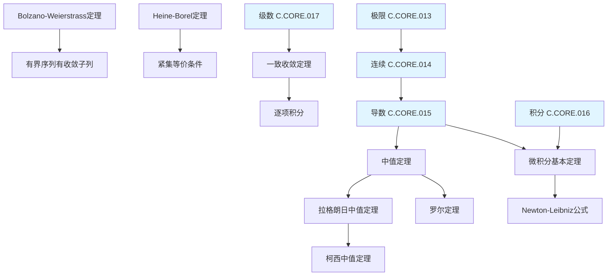

#### 定理说明

- **Bolzano-Weierstrass定理**: 有界序列有收敛子列
  - **内容**: 若 $\{x_n\}$ 有界，则存在收敛子列
  - **证明思路**: 使用二分法或紧性
  - **应用**: 证明紧性、极值存在
  - **推广**: 高维情况

- **Heine-Borel定理**: 紧集等价于有界闭集（$\mathbb{R}^n$）
  - **内容**: $K \subseteq \mathbb{R}^n$ 紧当且仅当 $K$ 有界且闭
  - **证明思路**: 使用开覆盖、Bolzano-Weierstrass
  - **应用**: 证明紧性、极值定理
  - **推广**: 度量空间

- **中值定理** (见[导数 C.CORE.015](../核心概念/15-导数.md)): 连接导数和函数值
  - **罗尔定理**: 若 $f(a) = f(b)$，则存在 $c$ 使得 $f'(c) = 0$
  - **拉格朗日中值定理**: $f(b) - f(a) = f'(c)(b-a)$
  - **柯西中值定理**: $\frac{f(b)-f(a)}{g(b)-g(a)} = \frac{f'(c)}{g'(c)}$
  - **应用**: 证明不等式、函数性质
  - **技巧**: 构造辅助函数

- **微积分基本定理** (见[积分 C.CORE.016](../核心概念/16-积分.md)): 连接导数和积分
  - **内容**: $\frac{d}{dx}\int_a^x f(t) dt = f(x)$，$\int_a^b f'(x) dx = f(b) - f(a)$
  - **证明思路**: 使用中值定理、Riemann和
  - **应用**: 计算积分、证明公式
  - **意义**: 微积分的核心

- **一致收敛定理**: 一致收敛保持连续性、可积性、可导性
  - **内容**: 若 $f_n \to f$ 一致收敛，则极限函数保持性质
  - **证明思路**: 使用一致收敛的定义
  - **应用**: 级数、函数序列
  - **技巧**: 使用Weierstrass M判别法

### 3.2 复分析定理网络

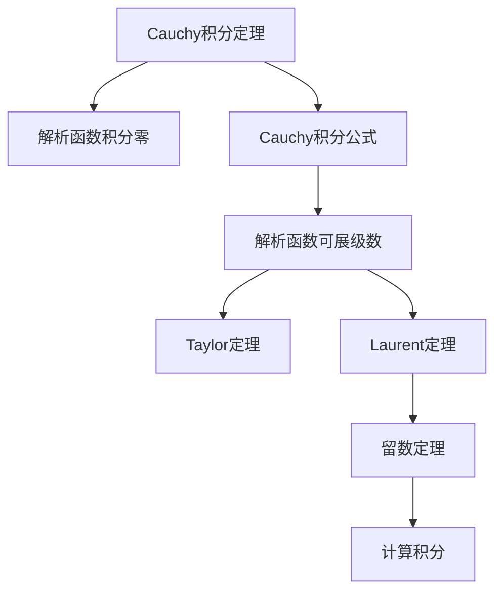

#### 定理说明

- **Cauchy积分定理**: 解析函数在单连通区域上的积分为零
  - **内容**: 若 $f$ 在单连通区域 $D$ 解析，则 $\oint_\gamma f(z) dz = 0$（$\gamma$ 是 $D$ 内的闭曲线）
  - **证明思路**: 使用Green定理或Goursat引理
  - **应用**: 证明解析性、计算积分
  - **推广**: 多连通区域

- **Cauchy积分公式**: 用边界值表示内部值
  - **内容**: $f(z) = \frac{1}{2\pi i} \oint_\gamma \frac{f(\zeta)}{\zeta - z} d\zeta$
  - **证明思路**: 使用Cauchy积分定理
  - **应用**: 证明解析性、计算积分
  - **推广**: 高阶导数公式

- **Taylor定理**: 解析函数可展为Taylor级数
  - **内容**: $f(z) = \sum_{n=0}^\infty \frac{f^{(n)}(a)}{n!}(z-a)^n$
  - **证明思路**: 使用Cauchy积分公式
  - **应用**: 函数展开、计算
  - **性质**: 收敛半径、唯一性

- **Laurent定理**: 在环域上可展为Laurent级数
  - **内容**: $f(z) = \sum_{n=-\infty}^\infty a_n (z-a)^n$
  - **证明思路**: 使用Cauchy积分公式
  - **应用**: 奇点分析、留数计算
  - **性质**: 主部、正则部

- **留数定理**: 用留数计算积分
  - **内容**: $\oint_\gamma f(z) dz = 2\pi i \sum \text{Res}(f, z_k)$
  - **证明思路**: 使用Laurent展开
  - **应用**: 计算实积分、级数求和
  - **技巧**: 计算留数、选择围道

---

## 📐 四、几何学定理网络 (编号: C.05.02.05)

### 4.1 欧氏几何定理网络

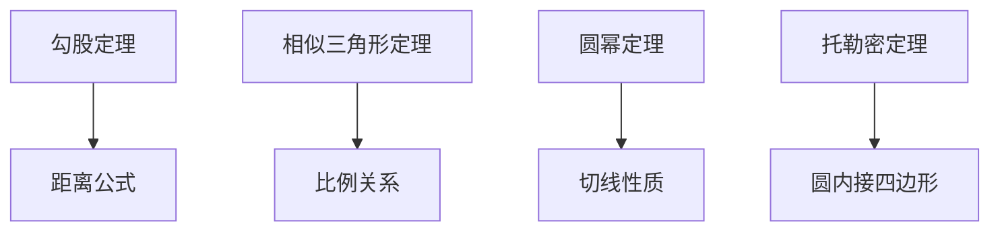

#### 定理说明

- **勾股定理**: 直角三角形斜边平方等于两直角边平方和
  - **内容**: $a^2 + b^2 = c^2$（$c$ 是斜边）
  - **证明思路**: 面积法、相似三角形、代数证明
  - **应用**: 距离计算、向量长度、内积
  - **推广**: 余弦定理、高维情况

- **相似三角形定理**: 对应角相等则对应边成比例
  - **内容**: 若 $\triangle ABC \sim \triangle DEF$，则 $\frac{AB}{DE} = \frac{BC}{EF} = \frac{CA}{FD}$
  - **证明思路**: 使用平行线、面积比
  - **应用**: 比例计算、几何证明
  - **推广**: 相似多边形

- **圆幂定理**: 从一点到圆的幂等于切线长的平方
  - **内容**: 若 $P$ 在圆外，$PT$ 是切线，$PAB$ 是割线，则 $PT^2 = PA \cdot PB$
  - **证明思路**: 使用相似三角形、弦切角
  - **应用**: 圆的性质、几何证明
  - **推广**: 球幂定理

- **托勒密定理**: 圆内接四边形对边乘积和等于对角线乘积
  - **内容**: 若 $ABCD$ 是圆内接四边形，则 $AB \cdot CD + BC \cdot AD = AC \cdot BD$
  - **证明思路**: 使用相似三角形、三角恒等式
  - **应用**: 几何证明、三角计算
  - **推广**: 一般四边形不等式

### 4.2 微分几何定理网络

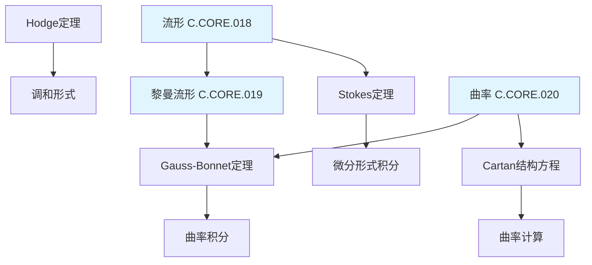

#### 定理说明

- **Gauss-Bonnet定理** (见[曲率 C.CORE.020](../核心概念/20-曲率.md), [黎曼流形 C.CORE.019](../核心概念/19-黎曼流形.md)): 曲率积分等于Euler示性数
  - **内容**: $\int_M K dA = 2\pi \chi(M)$（$K$ 是Gauss曲率，$\chi$ 是Euler示性数）
  - **证明思路**: 使用局部坐标、三角剖分
  - **应用**: 曲面分类、拓扑不变量
  - **推广**: 高维情况、带边流形

- **Stokes定理**: 微分形式在边界上的积分等于在内部的外微分积分
  - **内容**: $\int_{\partial M} \omega = \int_M d\omega$
  - **证明思路**: 使用局部坐标、单位分解
  - **应用**: 计算积分、证明恒等式
  - **推广**: 高维情况、链复形

- **Cartan结构方程**: 描述联络和曲率的关系
  - **内容**: $d\omega + \omega \wedge \omega = \Omega$（$\omega$ 是联络形式，$\Omega$ 是曲率形式）
  - **证明思路**: 使用外微分、结构常数
  - **应用**: 计算曲率、规范理论
  - **推广**: 主丛、向量丛

- **Hodge定理**: 调和形式与上同调类一一对应
  - **内容**: $H^k(M) \cong \mathcal{H}^k(M)$（$\mathcal{H}^k$ 是调和形式空间）
  - **证明思路**: 使用Hodge星算子、椭圆算子理论
  - **应用**: 上同调计算、代数几何
  - **推广**: 紧流形、Kähler流形

---

## 📐 五、跨分支定理关联 (编号: C.05.02.06)

### 5.1 代数-几何定理关联

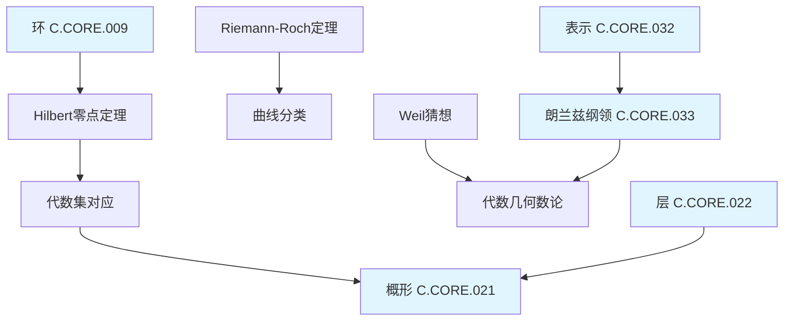

### 5.2 分析-几何定理关联

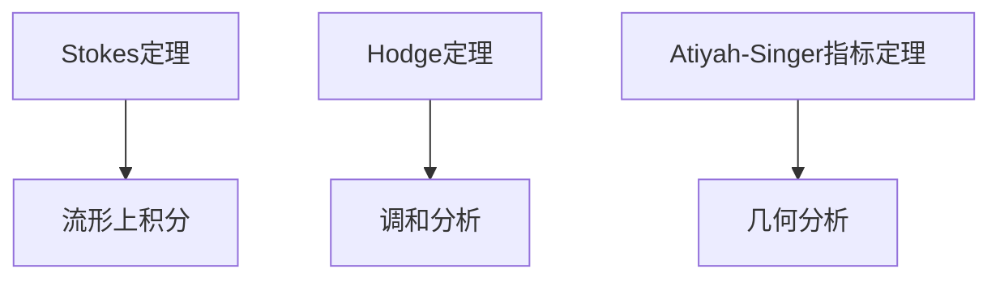

### 5.3 拓扑-代数定理关联

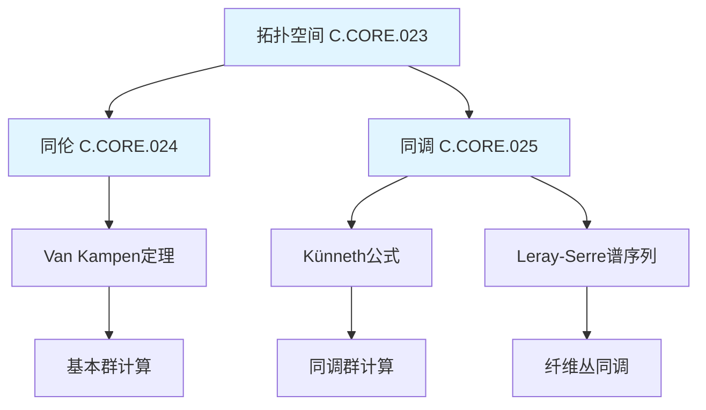

### 5.1 图论定理网络 ⭐ 新增

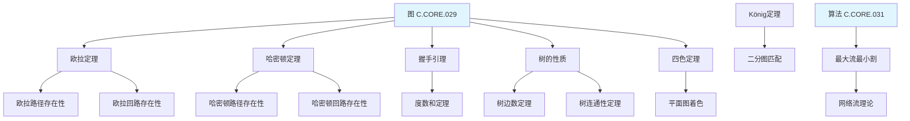

#### 定理说明

- **欧拉定理** (见[图 C.CORE.029](../核心概念/29-图.md)): 连通图有欧拉回路当且仅当所有顶点度数为偶数
  - **内容**: 图 $G$ 有欧拉回路当且仅当 $G$ 连通且所有顶点度数为偶数
  - **证明思路**: 必要性：回路经过每个顶点，进入和离开次数相等；充分性：构造算法
  - **应用**: 路径规划、网络设计
  - **推广**: 有向图、多重图

- **哈密顿定理**: 关于哈密顿回路存在的充分条件
  - **内容**: 若 $G$ 是 $n$ 阶图（$n \geq 3$），且对任意不相邻顶点 $u,v$ 有 $\deg(u) + \deg(v) \geq n$，则 $G$ 有哈密顿回路
  - **证明思路**: 反证法，假设不存在哈密顿回路，导出矛盾
  - **应用**: 旅行商问题、路径规划
  - **推广**: 其他充分条件

- **握手引理**: 图中所有顶点度数之和等于边数的两倍
  - **内容**: $\sum_{v \in V} \deg(v) = 2|E|$
  - **证明思路**: 每条边贡献2度
  - **应用**: 证明图的性质、计数
  - **推广**: 有向图、多重图

- **树的性质**: 树是连通无环图
  - **内容**: $G$ 是树当且仅当 $G$ 连通且 $|E| = |V| - 1$
  - **证明思路**: 使用归纳法、连通性
  - **应用**: 最小生成树、数据结构
  - **推广**: 森林、有根树

- **四色定理**: 平面图可以用4种颜色着色
  - **内容**: 每个平面图都是4-可着色的
  - **证明思路**: 使用计算机辅助证明（Appel-Haken）
  - **应用**: 地图着色、调度问题
  - **状态**: 已证明，但需要计算机验证

- **König定理**: 二分图的最大匹配等于最小顶点覆盖
  - **内容**: 在二分图中，$\nu(G) = \tau(G)$（$\nu$ 是匹配数，$\tau$ 是覆盖数）
  - **证明思路**: 使用增广路径、对偶性
  - **应用**: 匹配问题、网络流
  - **推广**: 一般图的匹配

- **最大流最小割定理**: 网络的最大流等于最小割的容量
  - **内容**: $\max \text{flow} = \min \text{cut}$
  - **证明思路**: 使用增广路径、对偶性
  - **应用**: 网络优化、匹配问题
  - **推广**: 多商品流

### 5.2 组合数学定理网络 ⭐ 新增

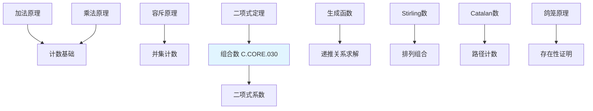

#### 定理说明

- **加法原理**: 互斥事件的计数
  - **内容**: 若 $A_1, \ldots, A_n$ 互斥，则 $|A_1 \cup \cdots \cup A_n| = |A_1| + \cdots + |A_n|$
  - **应用**: 分类计数
  - **推广**: 一般并集

- **乘法原理**: 独立选择的计数
  - **内容**: 若选择 $A$ 有 $m$ 种方法，选择 $B$ 有 $n$ 种方法，则选择 $(A,B)$ 有 $mn$ 种方法
  - **应用**: 排列、组合、计数
  - **推广**: 多个独立选择

- **容斥原理**: 计算并集的基数
  - **内容**: $|A_1 \cup \cdots \cup A_n| = \sum_i |A_i| - \sum_{i<j} |A_i \cap A_j| + \cdots + (-1)^{n+1} |A_1 \cap \cdots \cap A_n|$
  - **证明思路**: 使用归纳法、包含-排除
  - **应用**: 计数问题、概率
  - **推广**: 一般容斥原理

- **二项式定理** (见[组合数 C.CORE.030](../核心概念/30-组合数.md)): 展开 $(x+y)^n$
  - **内容**: $(x+y)^n = \sum_{k=0}^n \binom{n}{k} x^k y^{n-k}$
  - **证明思路**: 组合证明、归纳法
  - **应用**: 组合恒等式、概率
  - **推广**: 多项式定理

- **生成函数**: 用级数表示序列
  - **定义**: $G(x) = \sum_{n=0}^\infty a_n x^n$
  - **方法**: 普通生成函数、指数生成函数
  - **应用**: 递推关系、组合计数
  - **技巧**: 识别生成函数形式

- **Stirling数**: 排列和组合的推广
  - **第一类Stirling数**: $s(n,k)$ 表示 $n$ 个元素分成 $k$ 个循环的排列数
  - **第二类Stirling数**: $S(n,k)$ 表示 $n$ 个元素分成 $k$ 个非空子集的方法数
  - **应用**: 组合计数、递推关系
  - **性质**: 递推关系、生成函数

- **Catalan数**: 计数特定路径和结构
  - **定义**: $C_n = \frac{1}{n+1}\binom{2n}{n}$
  - **应用**: 括号匹配、二叉树、路径计数
  - **性质**: 递推关系、生成函数
  - **推广**: 广义Catalan数

- **鸽笼原理**: 存在性证明的基本工具
  - **内容**: 若 $n+1$ 个物体放入 $n$ 个盒子，则至少一个盒子包含至少2个物体
  - **应用**: 存在性证明、Ramsey理论
  - **推广**: 一般化形式

### 5.3 计算理论定理网络 ⭐ 新增

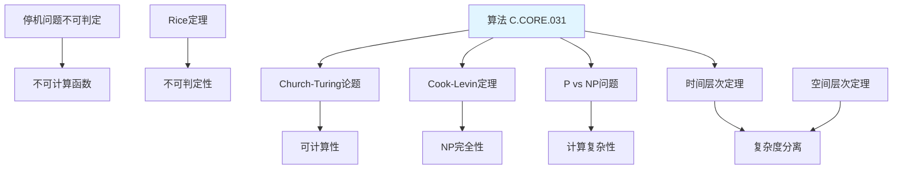

#### 定理说明

- **Church-Turing论题** (见[算法 C.CORE.031](../核心概念/31-算法.md)): 可计算函数的定义
  - **内容**: 所有可计算函数都可以用图灵机计算
  - **意义**: 定义了可计算性的概念
  - **应用**: 计算理论的基础
  - **状态**: 无法证明，但被广泛接受

- **停机问题不可判定**: 不存在算法判断图灵机是否停机
  - **内容**: 停机问题 $H = \{(M,w) : M \text{ 在输入 } w \text{ 上停机}\}$ 不可判定
  - **证明思路**: 对角线法、自指
  - **应用**: 证明其他问题不可判定
  - **意义**: 计算的根本限制

- **Rice定理**: 非平凡性质不可判定
  - **内容**: 若 $P$ 是递归可枚举语言的非平凡性质，则 $P$ 不可判定
  - **证明思路**: 归约到停机问题
  - **应用**: 证明不可判定性
  - **推广**: 一般形式

- **Cook-Levin定理**: SAT是NP完全的
  - **内容**: 布尔可满足性问题（SAT）是NP完全的
  - **证明思路**: 构造归约，将任意NP问题归约到SAT
  - **应用**: 证明其他问题NP完全
  - **意义**: NP完全性理论的基础

- **P vs NP问题**: 计算复杂性的核心问题
  - **内容**: P类是否等于NP类
  - **状态**: 未解决，千禧年难题之一
  - **意义**: 计算复杂性的核心
  - **应用**: 密码学、优化问题

- **时间层次定理**: 不同时间复杂度的分离
  - **内容**: 若 $f(n) = o(g(n))$，则 $\text{DTIME}(f(n)) \subset \text{DTIME}(g(n))$
  - **证明思路**: 对角线法、时间限制
  - **应用**: 证明复杂度分离
  - **推广**: 空间层次定理

- **空间层次定理**: 不同空间复杂度的分离
  - **内容**: 若 $f(n) = o(g(n))$，则 $\text{DSPACE}(f(n)) \subset \text{DSPACE}(g(n))$
  - **证明思路**: 类似时间层次定理
  - **应用**: 证明复杂度分离
  - **推广**: 非确定性空间

---

## 📊 七、定理依赖关系矩阵 (编号: C.05.02.07)

### 6.1 基础数学定理依赖

| 定理 | 依赖定理 | 依赖强度 | 说明 |
|-----|---------|---------|------|
| **Zorn引理** | 选择公理 | ⭐⭐⭐⭐⭐ | 等价关系 |
| **良序定理** | Zorn引理 | ⭐⭐⭐⭐⭐ | 直接依赖 |
| **Cantor定理** | ZFC公理 | ⭐⭐⭐⭐ | 基础依赖 |
| **Bezout定理** | 欧几里得引理 | ⭐⭐⭐⭐⭐ | 直接依赖 |
| **中国剩余定理** | Bezout定理 | ⭐⭐⭐⭐ | 应用依赖 |

### 6.2 代数结构定理依赖

| 定理 | 依赖定理 | 依赖强度 | 说明 |
|-----|---------|---------|------|
| **拉格朗日定理** | 群定义 | ⭐⭐⭐⭐⭐ | 基础依赖 |
| **第一同构定理** | 拉格朗日定理 | ⭐⭐⭐⭐ | 应用依赖 |
| **Galois基本定理** | Galois群理论 | ⭐⭐⭐⭐⭐ | 核心依赖 |
| **Noether定理** | 理想理论 | ⭐⭐⭐⭐⭐ | 核心依赖 |
| **Hilbert基定理** | Noether定理 | ⭐⭐⭐⭐ | 应用依赖 |

### 6.3 分析学定理依赖

| 定理 | 依赖定理 | 依赖强度 | 说明 |
|-----|---------|---------|------|
| **中值定理** | 连续函数性质 | ⭐⭐⭐⭐⭐ | 基础依赖 |
| **微积分基本定理** | 中值定理 | ⭐⭐⭐⭐⭐ | 核心依赖 |
| **Cauchy积分定理** | 解析函数性质 | ⭐⭐⭐⭐⭐ | 核心依赖 |
| **留数定理** | Cauchy积分公式 | ⭐⭐⭐⭐⭐ | 直接依赖 |

### 6.4 离散数学定理依赖 ⭐ 新增

| 定理 | 依赖定理 | 依赖强度 | 说明 |
|-----|---------|---------|------|
| **欧拉路径定理** | 图论基础 | ⭐⭐⭐⭐⭐ | 基础依赖 |
| **哈密顿路径定理** | 图论基础 | ⭐⭐⭐⭐⭐ | 基础依赖 |
| **握手引理** | 图论基础 | ⭐⭐⭐⭐⭐ | 基础依赖 |
| **树的性质定理** | 图论基础 | ⭐⭐⭐⭐⭐ | 基础依赖 |
| **四色定理** | 平面图理论 | ⭐⭐⭐⭐⭐ | 核心依赖 |
| **二项式定理** | 组合数学基础 | ⭐⭐⭐⭐⭐ | 基础依赖 |
| **生成函数定理** | 级数理论 | ⭐⭐⭐⭐ | 应用依赖 |
| **Cook-Levin定理** | 计算理论 | ⭐⭐⭐⭐⭐ | 核心依赖 |
| **停机问题不可判定** | 图灵机理论 | ⭐⭐⭐⭐⭐ | 核心依赖 |
| **P vs NP问题** | 计算复杂性 | ⭐⭐⭐⭐⭐ | 核心依赖 |

### 6.5 跨分支定理依赖

| 定理 | 依赖定理 | 依赖强度 | 说明 |
|-----|---------|---------|------|
| **Hilbert零点定理** | 理想理论+几何 | ⭐⭐⭐⭐⭐ | 交叉依赖 |
| **Riemann-Roch定理** | 代数几何+分析 | ⭐⭐⭐⭐⭐ | 交叉依赖 |
| **Atiyah-Singer定理** | 拓扑+分析+几何 | ⭐⭐⭐⭐⭐ | 交叉依赖 |
| **Weil猜想** | 代数几何+数论 | ⭐⭐⭐⭐⭐ | 交叉依赖 |

**依赖强度图例**:

- ⭐⭐⭐⭐⭐ 极强依赖（直接等价或核心依赖）
- ⭐⭐⭐⭐ 强依赖（重要应用依赖）
- ⭐⭐⭐ 中等依赖（部分应用依赖）
- ⭐⭐ 弱依赖（偶尔应用依赖）
- ⭐ 很弱依赖（极少应用依赖）

---

## 🔗 关联文档 (编号: C.05.02.08)

### 知识关联网络文档

- [知识关联网络总览 (C.05.00)](./00-知识关联网络总览.md)
- [概念级关联网络 (C.05.01)](./01-概念级关联网络.md)

### 相关文档

- [分支关联矩阵](../02-知识矩阵/01-分支关联矩阵.md)
- [历史发展矩阵](../02-知识矩阵/06-历史发展矩阵.md)

---

**创建日期**: 2025年11月21日
**最后更新**: 2025年11月28日（数学解释、论证、表征全面完成）
**维护状态**: 持续更新中
**版本**: v2.0
