# 定理级关联网络

**主题编号**: C.05.02
**创建日期**: 2025年11月21日
**最后更新**: 2025年11月21日

---

## 📋 目录 / Table of Contents

- [定理级关联网络](#定理级关联网络)
  - [📋 目录 / Table of Contents](#-目录--table-of-contents)
  - [📋 概述 (编号: C.05.02.01)](#-概述-编号-c050201)
  - [📐 一、基础数学定理网络 (编号: C.05.02.02)](#-一基础数学定理网络-编号-c050202)
    - [1.1 集合论定理网络](#11-集合论定理网络)
    - [1.2 数论基础定理网络](#12-数论基础定理网络)
  - [📐 二、代数结构定理网络 (编号: C.05.02.03)](#-二代数结构定理网络-编号-c050203)
    - [2.1 群论定理网络](#21-群论定理网络)
    - [2.2 环论定理网络](#22-环论定理网络)
    - [2.3 域论定理网络](#23-域论定理网络)
  - [📐 三、分析学定理网络 (编号: C.05.02.04)](#-三分析学定理网络-编号-c050204)
    - [3.1 实分析定理网络](#31-实分析定理网络)
    - [3.2 复分析定理网络](#32-复分析定理网络)
  - [📐 四、几何学定理网络 (编号: C.05.02.05)](#-四几何学定理网络-编号-c050205)
    - [4.1 欧氏几何定理网络](#41-欧氏几何定理网络)
    - [4.2 微分几何定理网络](#42-微分几何定理网络)
  - [📐 五、跨分支定理关联 (编号: C.05.02.06)](#-五跨分支定理关联-编号-c050206)
    - [5.1 代数-几何定理关联](#51-代数-几何定理关联)
    - [5.2 分析-几何定理关联](#52-分析-几何定理关联)
    - [5.3 拓扑-代数定理关联](#53-拓扑-代数定理关联)
    - [5.1 图论定理网络 ⭐ 新增](#51-图论定理网络--新增)
    - [5.2 组合数学定理网络 ⭐ 新增](#52-组合数学定理网络--新增)
    - [5.3 计算理论定理网络 ⭐ 新增](#53-计算理论定理网络--新增)
  - [📊 七、定理依赖关系矩阵 (编号: C.05.02.07)](#-七定理依赖关系矩阵-编号-c050207)
    - [6.1 基础数学定理依赖](#61-基础数学定理依赖)
    - [6.2 代数结构定理依赖](#62-代数结构定理依赖)
    - [6.3 分析学定理依赖](#63-分析学定理依赖)
    - [6.4 离散数学定理依赖 ⭐ 新增](#64-离散数学定理依赖--新增)
    - [6.5 跨分支定理依赖](#65-跨分支定理依赖)
  - [🔗 关联文档 (编号: C.05.02.08)](#-关联文档-编号-c050208)
    - [知识关联网络文档](#知识关联网络文档)
    - [相关文档](#相关文档)

---

## 📋 概述 (编号: C.05.02.01)

本文档提供FormalMath项目的定理级关联网络，展示数学定理之间的依赖关系和应用关系。

**目标**: 建立定理级别的知识关联网络体系

---

## 📐 一、基础数学定理网络 (编号: C.05.02.02)

### 1.1 集合论定理网络

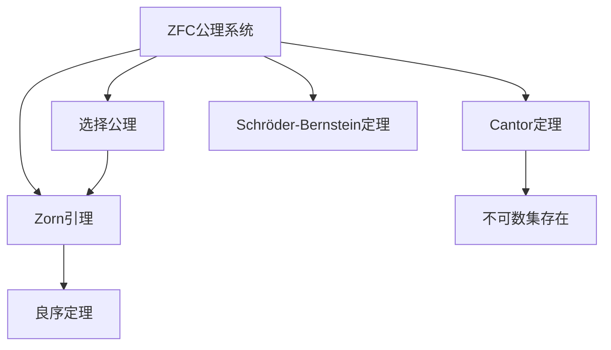

#### 定理说明

- **ZFC公理系统**: 集合论的公理化基础，包括外延、配对、并集、幂集、无穷、替换、选择公理
  - **作用**: 为所有数学提供基础，避免罗素悖论
  - **应用**: 所有数学分支的基础

- **选择公理 (AC)**: 对任意非空集合族，存在选择函数
  - **等价形式**: Zorn引理、良序定理
  - **争议**: 独立于其他公理，有非标准模型
  - **应用**: 证明存在性（如Hahn-Banach定理）

- **Zorn引理**: 若偏序集的每个链都有上界，则存在极大元
  - **证明思路**: 假设不存在极大元，构造严格递增链，与条件矛盾
  - **应用**: 证明基的存在（向量空间、理想）

- **良序定理**: 任意集合都可以良序化
  - **证明思路**: 使用Zorn引理，考虑所有良序子集
  - **应用**: 超限归纳、超限递归

- **Cantor定理**: 对任意集合 $A$，$|A| < |\mathcal{P}(A)|$
  - **证明思路**: 假设存在双射 $f: A \to \mathcal{P}(A)$，考虑 $B = \{x : x \notin f(x)\}$，导出矛盾
  - **应用**: 证明不可数集存在、连续统假设

- **Schröder-Bernstein定理**: 若 $|A| \leq |B|$ 且 $|B| \leq |A|$，则 $|A| = |B|$
  - **证明思路**: 构造双射，使用Cantor-Bernstein构造
  - **应用**: 证明集合等势

### 1.2 数论基础定理网络

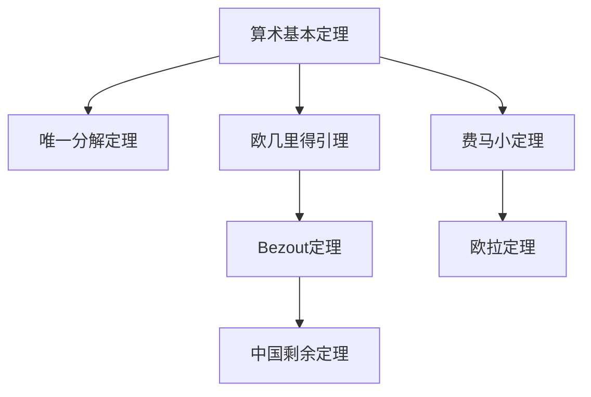

---

## 📐 二、代数结构定理网络 (编号: C.05.02.03)

### 2.1 群论定理网络

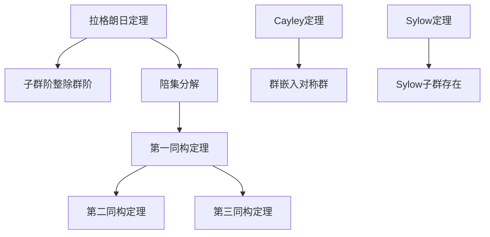

#### 定理说明

- **拉格朗日定理**: 有限群 $G$ 的子群 $H$ 的阶整除 $G$ 的阶：$|H| \mid |G|$
  - **证明思路**: 陪集构成 $G$ 的划分，所有陪集大小相等为 $|H|$
  - **应用**: 证明群论中的许多结果，如费马小定理、欧拉定理
  - **推论**: 群中元素的阶整除群的阶

- **第一同构定理**: 若 $\phi: G \to H$ 是群同态，则 $G/\ker(\phi) \cong \text{im}(\phi)$
  - **证明思路**: 构造同构 $\bar{\phi}: G/\ker(\phi) \to \text{im}(\phi)$，$\bar{\phi}(g\ker(\phi)) = \phi(g)$
  - **应用**: 分类群、构造同构

- **第二同构定理**: 若 $H \leq G$，$N \trianglelefteq G$，则 $HN/N \cong H/(H \cap N)$
  - **证明思路**: 应用第一同构定理到自然映射 $H \to HN/N$
  - **应用**: 分析子群结构

- **第三同构定理**: 若 $N \trianglelefteq G$，$K \trianglelefteq G$，$N \subseteq K$，则 $(G/N)/(K/N) \cong G/K$
  - **证明思路**: 应用第一同构定理
  - **应用**: 简化商群结构

- **Cayley定理**: 任意群 $G$ 同构于对称群 $S_n$ 的某个子群
  - **证明思路**: 构造群作用 $G \times G \to G$，得到嵌入 $G \hookrightarrow S_{|G|}$
  - **应用**: 证明群的表示、分类问题

- **Sylow定理**: 若 $|G| = p^a m$（$p$ 不整除 $m$），则存在 $p^a$ 阶子群（Sylow $p$-子群）
  - **证明思路**: 使用群作用和组合计数
  - **应用**: 分类有限群、证明非单群

### 2.2 环论定理网络

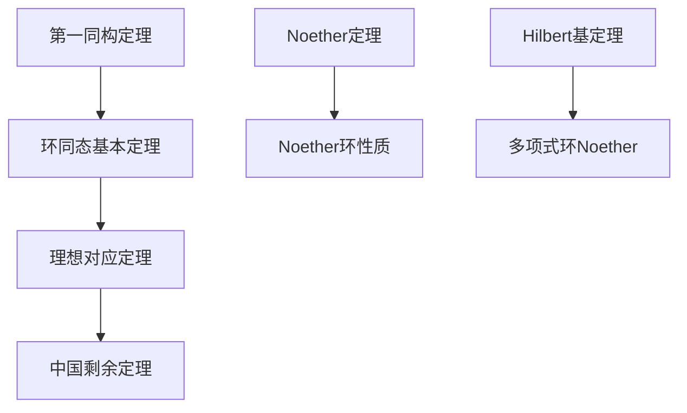

### 2.3 域论定理网络

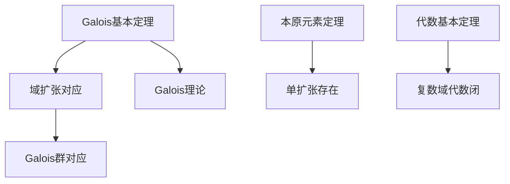

---

## 📐 三、分析学定理网络 (编号: C.05.02.04)

### 3.1 实分析定理网络

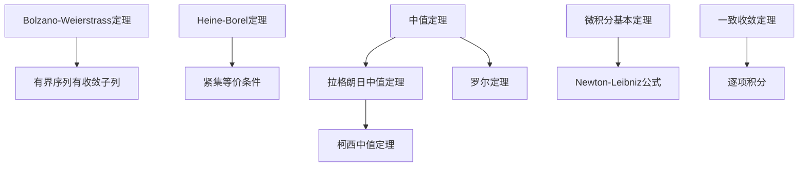

### 3.2 复分析定理网络

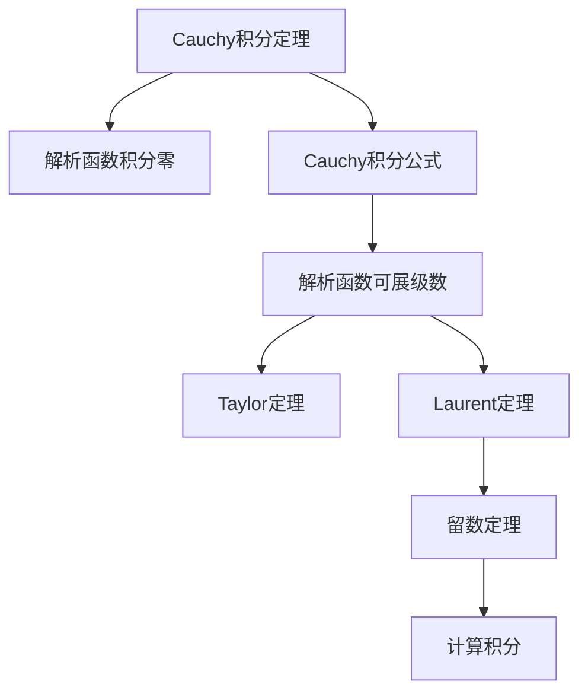

---

## 📐 四、几何学定理网络 (编号: C.05.02.05)

### 4.1 欧氏几何定理网络

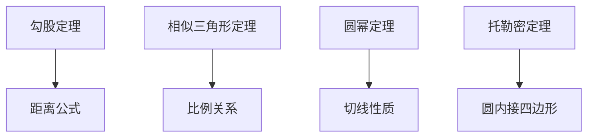

### 4.2 微分几何定理网络

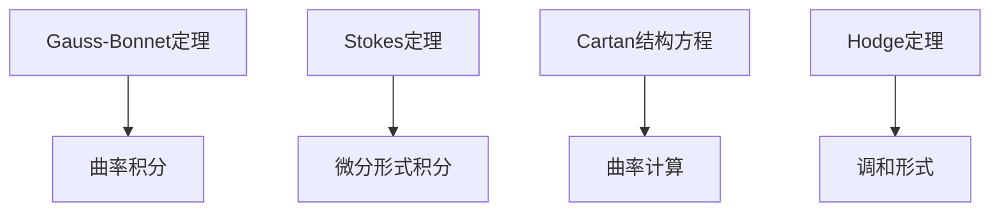

---

## 📐 五、跨分支定理关联 (编号: C.05.02.06)

### 5.1 代数-几何定理关联

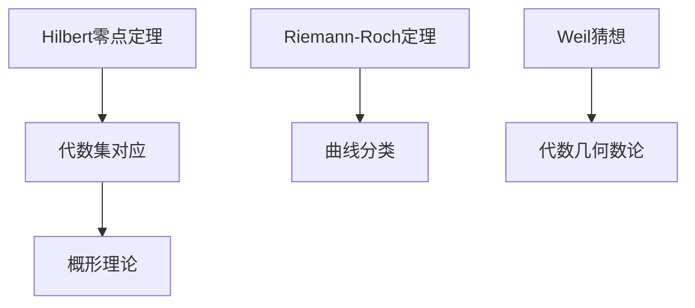

### 5.2 分析-几何定理关联

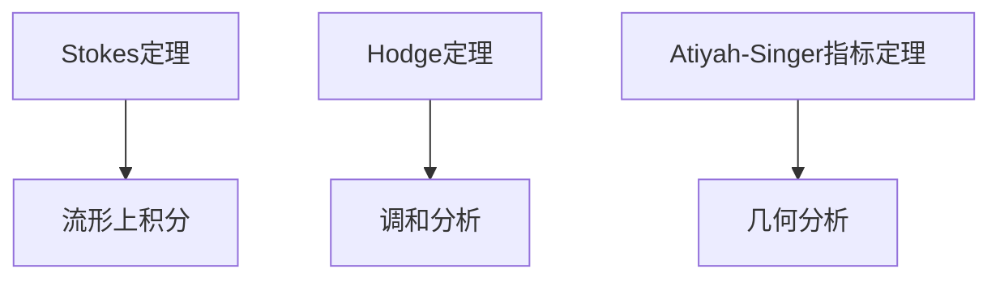

### 5.3 拓扑-代数定理关联

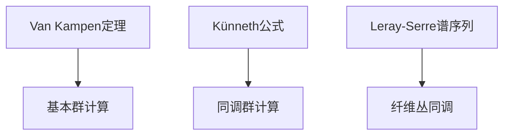

### 5.1 图论定理网络 ⭐ 新增

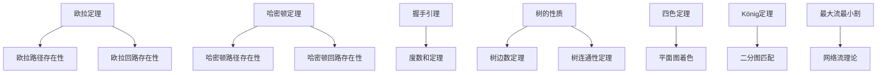

### 5.2 组合数学定理网络 ⭐ 新增

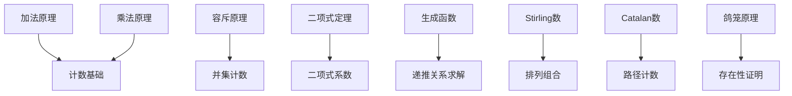

### 5.3 计算理论定理网络 ⭐ 新增

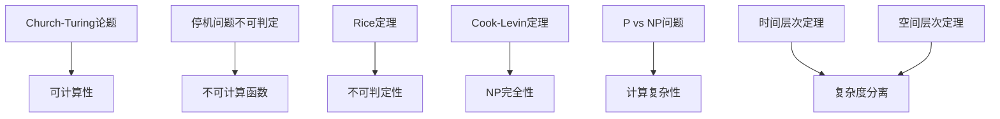

---

## 📊 七、定理依赖关系矩阵 (编号: C.05.02.07)

### 6.1 基础数学定理依赖

| 定理 | 依赖定理 | 依赖强度 | 说明 |
|-----|---------|---------|------|
| **Zorn引理** | 选择公理 | ⭐⭐⭐⭐⭐ | 等价关系 |
| **良序定理** | Zorn引理 | ⭐⭐⭐⭐⭐ | 直接依赖 |
| **Cantor定理** | ZFC公理 | ⭐⭐⭐⭐ | 基础依赖 |
| **Bezout定理** | 欧几里得引理 | ⭐⭐⭐⭐⭐ | 直接依赖 |
| **中国剩余定理** | Bezout定理 | ⭐⭐⭐⭐ | 应用依赖 |

### 6.2 代数结构定理依赖

| 定理 | 依赖定理 | 依赖强度 | 说明 |
|-----|---------|---------|------|
| **拉格朗日定理** | 群定义 | ⭐⭐⭐⭐⭐ | 基础依赖 |
| **第一同构定理** | 拉格朗日定理 | ⭐⭐⭐⭐ | 应用依赖 |
| **Galois基本定理** | Galois群理论 | ⭐⭐⭐⭐⭐ | 核心依赖 |
| **Noether定理** | 理想理论 | ⭐⭐⭐⭐⭐ | 核心依赖 |
| **Hilbert基定理** | Noether定理 | ⭐⭐⭐⭐ | 应用依赖 |

### 6.3 分析学定理依赖

| 定理 | 依赖定理 | 依赖强度 | 说明 |
|-----|---------|---------|------|
| **中值定理** | 连续函数性质 | ⭐⭐⭐⭐⭐ | 基础依赖 |
| **微积分基本定理** | 中值定理 | ⭐⭐⭐⭐⭐ | 核心依赖 |
| **Cauchy积分定理** | 解析函数性质 | ⭐⭐⭐⭐⭐ | 核心依赖 |
| **留数定理** | Cauchy积分公式 | ⭐⭐⭐⭐⭐ | 直接依赖 |

### 6.4 离散数学定理依赖 ⭐ 新增

| 定理 | 依赖定理 | 依赖强度 | 说明 |
|-----|---------|---------|------|
| **欧拉路径定理** | 图论基础 | ⭐⭐⭐⭐⭐ | 基础依赖 |
| **哈密顿路径定理** | 图论基础 | ⭐⭐⭐⭐⭐ | 基础依赖 |
| **握手引理** | 图论基础 | ⭐⭐⭐⭐⭐ | 基础依赖 |
| **树的性质定理** | 图论基础 | ⭐⭐⭐⭐⭐ | 基础依赖 |
| **四色定理** | 平面图理论 | ⭐⭐⭐⭐⭐ | 核心依赖 |
| **二项式定理** | 组合数学基础 | ⭐⭐⭐⭐⭐ | 基础依赖 |
| **生成函数定理** | 级数理论 | ⭐⭐⭐⭐ | 应用依赖 |
| **Cook-Levin定理** | 计算理论 | ⭐⭐⭐⭐⭐ | 核心依赖 |
| **停机问题不可判定** | 图灵机理论 | ⭐⭐⭐⭐⭐ | 核心依赖 |
| **P vs NP问题** | 计算复杂性 | ⭐⭐⭐⭐⭐ | 核心依赖 |

### 6.5 跨分支定理依赖

| 定理 | 依赖定理 | 依赖强度 | 说明 |
|-----|---------|---------|------|
| **Hilbert零点定理** | 理想理论+几何 | ⭐⭐⭐⭐⭐ | 交叉依赖 |
| **Riemann-Roch定理** | 代数几何+分析 | ⭐⭐⭐⭐⭐ | 交叉依赖 |
| **Atiyah-Singer定理** | 拓扑+分析+几何 | ⭐⭐⭐⭐⭐ | 交叉依赖 |
| **Weil猜想** | 代数几何+数论 | ⭐⭐⭐⭐⭐ | 交叉依赖 |

**依赖强度图例**:

- ⭐⭐⭐⭐⭐ 极强依赖（直接等价或核心依赖）
- ⭐⭐⭐⭐ 强依赖（重要应用依赖）
- ⭐⭐⭐ 中等依赖（部分应用依赖）
- ⭐⭐ 弱依赖（偶尔应用依赖）
- ⭐ 很弱依赖（极少应用依赖）

---

## 🔗 关联文档 (编号: C.05.02.08)

### 知识关联网络文档

- [知识关联网络总览 (C.05.00)](./00-知识关联网络总览.md)
- [概念级关联网络 (C.05.01)](./01-概念级关联网络.md)

### 相关文档

- [分支关联矩阵](../02-知识矩阵/01-分支关联矩阵.md)
- [历史发展矩阵](../02-知识矩阵/06-历史发展矩阵.md)

---

**创建日期**: 2025年11月21日
**最后更新**: 2025年11月21日
**维护状态**: 持续更新中
**版本**: v1.0
