# 方法级关联网络

**主题编号**: C.05.03
**创建日期**: 2025年11月21日
**最后更新**: 2025年11月21日

---

## 📋 目录 / Table of Contents

- [方法级关联网络](#方法级关联网络)
  - [📋 目录 / Table of Contents](#-目录--table-of-contents)
  - [📋 概述 (编号: C.05.03.01)](#-概述-编号-c050301)
  - [🔧 一、证明方法网络 (编号: C.05.03.02)](#-一证明方法网络-编号-c050302)
    - [1.1 基本证明方法](#11-基本证明方法)
    - [1.2 高级证明方法](#12-高级证明方法)
  - [🔧 二、计算方法网络 (编号: C.05.03.03)](#-二计算方法网络-编号-c050303)
    - [2.1 代数计算方法](#21-代数计算方法)
    - [2.2 分析方法](#22-分析方法)
  - [🔧 三、构造方法网络 (编号: C.05.03.04)](#-三构造方法网络-编号-c050304)
    - [3.1 代数构造方法](#31-代数构造方法)
    - [3.2 几何构造方法](#32-几何构造方法)
  - [🔧 四、分析方法网络 (编号: C.05.03.05)](#-四分析方法网络-编号-c050305)
    - [4.1 定性分析方法](#41-定性分析方法)
    - [4.2 定量分析方法](#42-定量分析方法)
  - [🔧 五、跨分支方法关联 (编号: C.05.03.06)](#-五跨分支方法关联-编号-c050306)
    - [5.1 代数-几何方法关联](#51-代数-几何方法关联)
    - [5.2 分析-几何方法关联](#52-分析-几何方法关联)
    - [5.3 拓扑-代数方法关联](#53-拓扑-代数方法关联)
  - [📊 六、方法应用矩阵 (编号: C.05.03.07)](#-六方法应用矩阵-编号-c050307)
    - [6.1 按问题类型选择方法](#61-按问题类型选择方法)
    - [6.2 按分支选择方法](#62-按分支选择方法)
    - [6.3 按难度选择方法](#63-按难度选择方法)
    - [6.4 方法关联强度](#64-方法关联强度)
  - [🔗 关联文档 (编号: C.05.03.08)](#-关联文档-编号-c050308)
    - [知识关联网络文档](#知识关联网络文档)
    - [相关文档](#相关文档)

---

## 📋 概述 (编号: C.05.03.01)

本文档提供FormalMath项目的方法级关联网络，展示数学方法之间的关联关系和应用场景。

**目标**: 建立方法级别的知识关联网络体系

---

## 🔧 一、证明方法网络 (编号: C.05.03.02)

### 1.1 基本证明方法

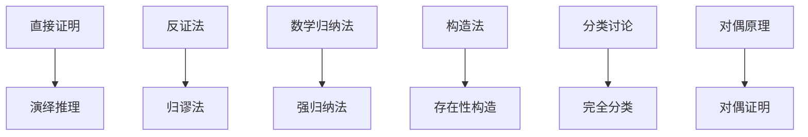

### 1.2 高级证明方法

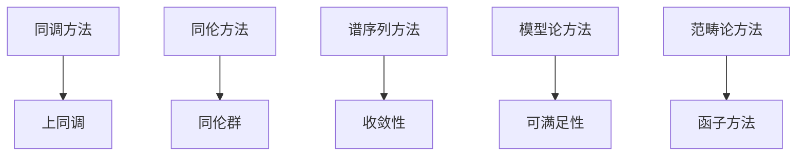

---

## 🔧 二、计算方法网络 (编号: C.05.03.03)

### 2.1 代数计算方法

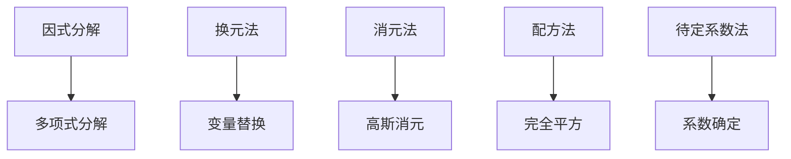

### 2.2 分析方法

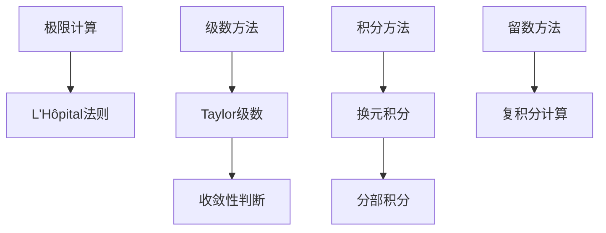

---

## 🔧 三、构造方法网络 (编号: C.05.03.04)

### 3.1 代数构造方法

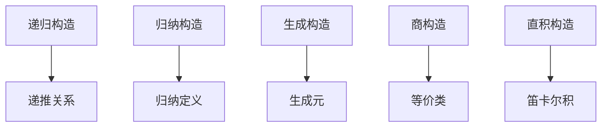

### 3.2 几何构造方法

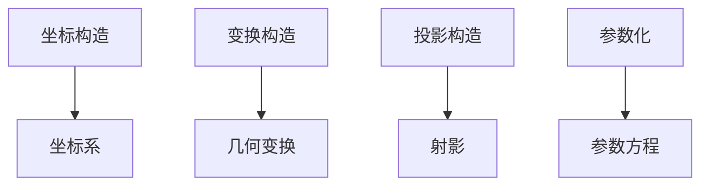

---

## 🔧 四、分析方法网络 (编号: C.05.03.05)

### 4.1 定性分析方法

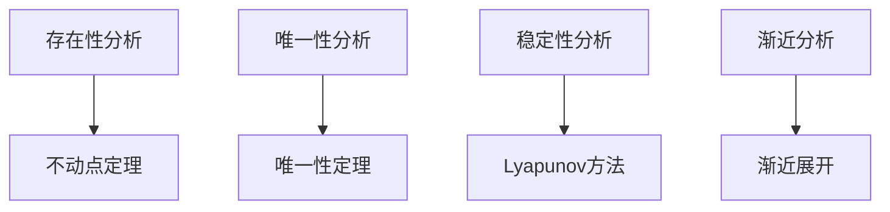

### 4.2 定量分析方法

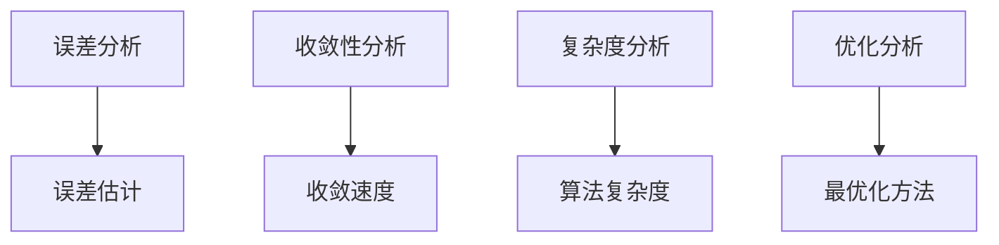

---

## 🔧 五、跨分支方法关联 (编号: C.05.03.06)

### 5.1 代数-几何方法关联

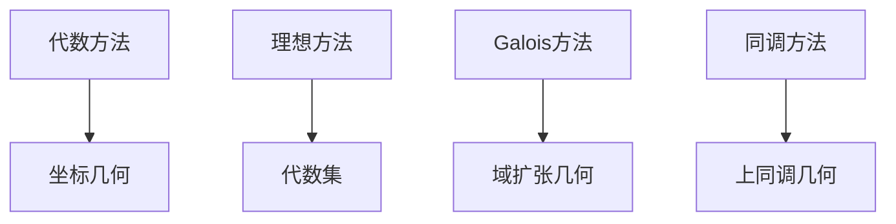

### 5.2 分析-几何方法关联

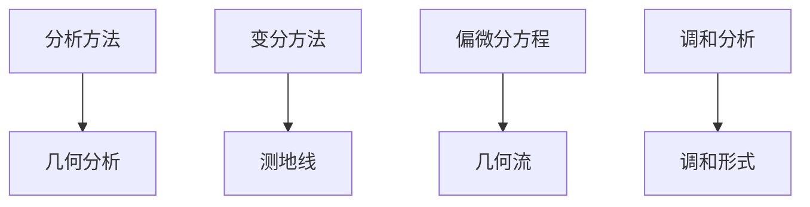

### 5.3 拓扑-代数方法关联

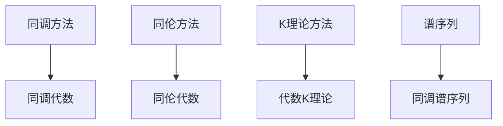

---

## 📊 六、方法应用矩阵 (编号: C.05.03.07)

### 6.1 按问题类型选择方法

| 问题类型 | 推荐方法 | 优先级 | 说明 |
|---------|---------|--------|------|
| **存在性证明** | 构造法 | ⭐⭐⭐⭐⭐ | 直接构造 |
| **唯一性证明** | 反证法 | ⭐⭐⭐⭐ | 假设不唯一 |
| **性质证明** | 直接证明 | ⭐⭐⭐⭐⭐ | 从定义出发 |
| **计算问题** | 计算方法 | ⭐⭐⭐⭐⭐ | 直接计算 |
| **优化问题** | 优化方法 | ⭐⭐⭐⭐⭐ | 最优化理论 |

### 6.2 按分支选择方法

| 分支 | 常用方法 | 典型应用 | 方法选择 |
|-----|---------|---------|---------|
| **代数结构** | 同态方法、理想方法 | 证明同构 | 同态方法+构造法 |
| **分析学** | 极限方法、级数方法 | 计算极限 | 极限方法+级数方法 |
| **几何学** | 坐标方法、变换方法 | 证明性质 | 坐标方法+直接证明 |
| **拓扑学** | 同调方法、同伦方法 | 分类空间 | 同调方法+构造法 |

### 6.3 按难度选择方法

| 难度 | 推荐方法 | 说明 |
|-----|---------|------|
| **简单** | 直接方法 | 直接应用基本方法 |
| **中等** | 组合方法 | 组合多种方法 |
| **困难** | 高级方法 | 需要高级理论方法 |
| **极难** | 创新方法 | 需要创新思路 |

### 6.4 方法关联强度

| 方法1 | 方法2 | 关联类型 | 关联强度 | 说明 |
|------|------|---------|---------|------|
| **直接证明** | **反证法** | 互补关系 | ⭐⭐⭐⭐ | 可互相替代 |
| **数学归纳法** | **强归纳法** | 推广关系 | ⭐⭐⭐⭐⭐ | 强归纳法推广 |
| **极限方法** | **级数方法** | 应用关系 | ⭐⭐⭐⭐ | 级数用极限 |
| **同调方法** | **上同调方法** | 对偶关系 | ⭐⭐⭐⭐⭐ | 对偶方法 |
| **代数方法** | **几何方法** | 交叉关系 | ⭐⭐⭐⭐ | 交叉应用 |

**关联强度图例**:

- ⭐⭐⭐⭐⭐ 极强关联（直接推广或对偶关系）
- ⭐⭐⭐⭐ 强关联（重要应用或互补关系）
- ⭐⭐⭐ 中等关联（部分应用关系）
- ⭐⭐ 弱关联（偶尔应用关系）
- ⭐ 很弱关联（极少应用关系）

---

## 🔗 关联文档 (编号: C.05.03.08)

### 知识关联网络文档

- [知识关联网络总览 (C.05.00)](./00-知识关联网络总览.md)
- [概念级关联网络 (C.05.01)](./01-概念级关联网络.md)
- [定理级关联网络 (C.05.02)](./02-定理级关联网络.md)

### 相关文档

- [问题解决工具](../04-认知工具/06-问题解决工具.md)
- [应用场景矩阵](../02-知识矩阵/04-应用场景矩阵.md)

---

**创建日期**: 2025年11月21日
**最后更新**: 2025年11月21日
**维护状态**: 持续更新中
**版本**: v1.0
