# 方法级关联网络

**主题编号**: C.05.03
**创建日期**: 2025年11月21日
**最后更新**: 2025年11月28日（数学解释、论证、表征全面完成）

---

## 📋 目录 / Table of Contents

- [方法级关联网络](#方法级关联网络)
  - [📋 目录 / Table of Contents](#-目录--table-of-contents)
  - [📋 概述 (编号: C.05.03.01)](#-概述-编号-c050301)
  - [🔧 一、证明方法网络 (编号: C.05.03.02)](#-一证明方法网络-编号-c050302)
    - [1.1 基本证明方法](#11-基本证明方法)
      - [方法说明](#方法说明)
    - [1.2 高级证明方法](#12-高级证明方法)
      - [方法说明](#方法说明-1)
  - [🔧 二、计算方法网络 (编号: C.05.03.03)](#-二计算方法网络-编号-c050303)
    - [2.1 代数计算方法](#21-代数计算方法)
      - [方法说明](#方法说明-2)
    - [2.2 分析方法](#22-分析方法)
      - [方法说明](#方法说明-3)
  - [🔧 三、构造方法网络 (编号: C.05.03.04)](#-三构造方法网络-编号-c050304)
    - [3.1 代数构造方法](#31-代数构造方法)
      - [方法说明](#方法说明-4)
    - [3.2 几何构造方法](#32-几何构造方法)
      - [方法说明](#方法说明-5)
  - [🔧 四、分析方法网络 (编号: C.05.03.05)](#-四分析方法网络-编号-c050305)
    - [4.1 定性分析方法](#41-定性分析方法)
      - [方法说明](#方法说明-6)
    - [4.2 定量分析方法](#42-定量分析方法)
      - [方法说明](#方法说明-7)
    - [4.3 离散数学方法 ⭐ 新增](#43-离散数学方法--新增)
      - [方法说明](#方法说明-8)
  - [🔧 五、跨分支方法关联 (编号: C.05.03.06)](#-五跨分支方法关联-编号-c050306)
    - [5.1 代数-几何方法关联](#51-代数-几何方法关联)
      - [方法说明](#方法说明-9)
    - [5.2 分析-几何方法关联](#52-分析-几何方法关联)
      - [方法说明](#方法说明-10)
    - [5.3 拓扑-代数方法关联](#53-拓扑-代数方法关联)
      - [方法说明](#方法说明-11)
    - [5.4 离散数学方法网络 ⭐ 新增](#54-离散数学方法网络--新增)
      - [方法说明](#方法说明-12)
  - [📊 六、方法应用矩阵 (编号: C.05.03.07)](#-六方法应用矩阵-编号-c050307)
    - [6.1 按问题类型选择方法](#61-按问题类型选择方法)
    - [6.2 按分支选择方法](#62-按分支选择方法)
    - [6.3 按难度选择方法](#63-按难度选择方法)
    - [6.4 方法关联强度](#64-方法关联强度)
  - [🔗 关联文档 (编号: C.05.03.08)](#-关联文档-编号-c050308)
    - [知识关联网络文档](#知识关联网络文档)
    - [相关文档](#相关文档)

---

## 📋 概述 (编号: C.05.03.01)

本文档提供FormalMath项目的方法级关联网络，展示数学方法之间的关联关系和应用场景。

**目标**: 建立方法级别的知识关联网络体系

**哲学维度**: 数学方法的选择和应用也反映了哲学思想的影响。逻辑主义强调逻辑方法，形式主义强调形式化方法，直觉主义强调构造性方法，建构主义强调可计算方法。不同哲学流派对方法有不同的偏好。详见[数学哲学维度矩阵](../02-知识矩阵/09-数学哲学维度矩阵.md)。

---

## 🔧 一、证明方法网络 (编号: C.05.03.02)

### 1.1 基本证明方法

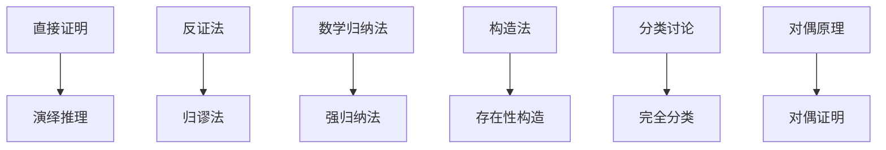

#### 方法说明

- **直接证明**: 从已知条件和定义出发，通过逻辑推理直接得出结论
  - **步骤**: 假设前提 → 应用定义/定理 → 逻辑推理 → 得出结论
  - **应用**: 大多数定理的证明，如"若 $f$ 可导则 $f$ 连续"
  - **技巧**: 选择合适的中间步骤，使用已知定理

- **反证法**: 假设结论不成立，导出矛盾
  - **步骤**: 假设 $\neg P$ → 逻辑推理 → 矛盾 → 因此 $P$ 成立
  - **应用**: 唯一性证明、存在性证明（如"$\sqrt{2}$ 是无理数"）
  - **技巧**: 寻找与已知事实的矛盾

- **数学归纳法** (见[自然数 C.CORE.003](../核心概念/03-自然数.md)): 证明对所有自然数成立的性质
  - **步骤**: 基础步骤 $P(0)$ + 归纳步骤 $P(n) \Rightarrow P(n+1)$ → $\forall n P(n)$
  - **应用**: 序列性质、组合恒等式、算法正确性
  - **技巧**: 强归纳法（假设 $P(0), \ldots, P(n)$ 都成立）

- **构造法**: 直接构造满足条件的对象
  - **步骤**: 明确构造目标 → 设计构造方法 → 验证满足条件
  - **应用**: 存在性证明、算法设计
  - **技巧**: 递归构造、归纳构造

- **分类讨论**: 将所有情况分类，分别证明
  - **步骤**: 完全分类 → 每类分别证明 → 综合结论
  - **应用**: 绝对值、模运算、分段函数
  - **技巧**: 确保分类完全且互斥

### 1.2 高级证明方法

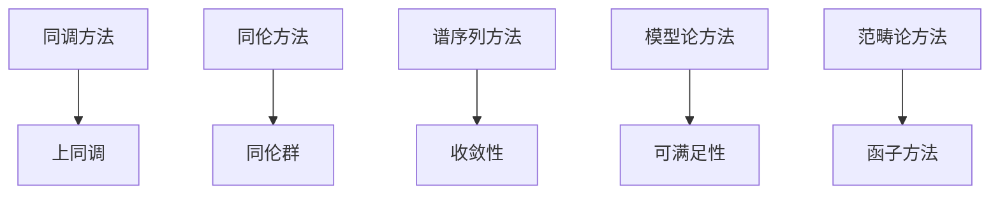

#### 方法说明

- **同调方法**: 使用同调群研究拓扑空间和代数对象
  - **定义**: 通过链复形计算同调群 $H_n(X) = \ker(\partial_n) / \text{im}(\partial_{n+1})$
  - **性质**: 同伦不变量，长正合列，Mayer-Vietoris序列
  - **应用**: 分类拓扑空间、计算Betti数、代数几何
  - **技巧**: 选择合适的链复形，使用谱序列

- **同伦方法**: 使用同伦群研究拓扑空间
  - **定义**: 通过同伦类 $\pi_n(X) = \{[f] : f: S^n \to X\}$ 分类映射
  - **性质**: 同伦不变量，长正合列（纤维化）
  - **应用**: 分类高维流形、稳定同伦理论
  - **技巧**: 使用纤维化、覆盖空间

- **谱序列方法**: 使用谱序列逐步计算同调
  - **定义**: 通过过滤构造谱序列，逐步逼近同调
  - **性质**: 收敛性、函子性、微分
  - **应用**: Leray谱序列、Serre谱序列、Hochschild-Serre谱序列
  - **技巧**: 选择合适的过滤，计算微分

- **模型论方法**: 使用模型论研究数学结构
  - **定义**: 通过可满足性、完全性等模型论概念研究结构
  - **性质**: 紧致性定理、Löwenheim-Skolem定理
  - **应用**: 非标准分析、代数闭域、实数理论
  - **技巧**: 使用超积、超幂

- **范畴论方法**: 使用范畴论统一数学结构
  - **定义**: 通过函子、自然变换等范畴论工具研究结构
  - **性质**: 函子性、自然性、泛性质
  - **应用**: 代数几何、拓扑学、逻辑学
  - **技巧**: 使用极限、余极限、伴随函子

---

## 🔧 二、计算方法网络 (编号: C.05.03.03)

### 2.1 代数计算方法

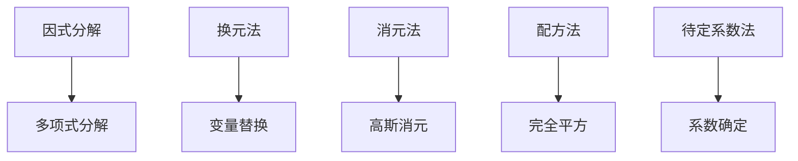

#### 方法说明

- **因式分解**: 将多项式分解为不可约因子的乘积
  - **定义**: $f(x) = \prod_{i=1}^n p_i(x)^{e_i}$，其中 $p_i$ 不可约
  - **方法**: 试除法、分组法、公式法、有理根定理
  - **应用**: 求根、简化计算、解方程
  - **技巧**: 寻找特殊形式、使用对称性

- **换元法**: 通过变量替换简化问题
  - **定义**: 设 $u = g(x)$，将 $f(x)$ 转化为 $f(g^{-1}(u))$
  - **方法**: 三角换元、双曲换元、代数换元
  - **应用**: 积分计算、方程求解、不等式证明
  - **技巧**: 选择合适的换元，保持可逆性

- **消元法**: 通过消元求解方程组
  - **定义**: 使用初等行变换将矩阵化为行阶梯形
  - **方法**: 高斯消元、Gauss-Jordan消元
  - **应用**: 线性方程组、矩阵求逆、行列式计算
  - **技巧**: 主元选择、数值稳定性

- **配方法**: 将二次型配成完全平方
  - **定义**: $ax^2 + bx + c = a(x + \frac{b}{2a})^2 + (c - \frac{b^2}{4a})$
  - **方法**: 完全平方、平方差
  - **应用**: 二次方程、二次型、优化问题
  - **技巧**: 识别完全平方形式

- **待定系数法**: 通过比较系数确定未知参数
  - **定义**: 假设形式，通过比较系数确定参数
  - **方法**: 部分分式、幂级数、微分方程
  - **应用**: 积分计算、级数展开、方程求解
  - **技巧**: 选择合适的假设形式

### 2.2 分析方法

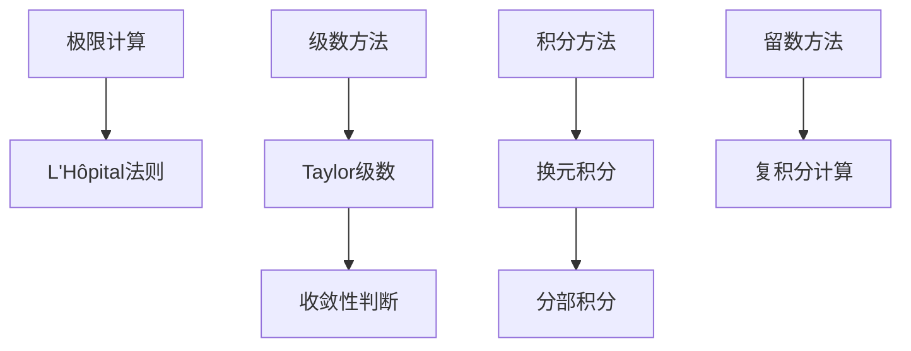

#### 方法说明

- **极限计算**: 计算函数极限
  - **方法**: L'Hôpital法则、Taylor展开、夹逼定理、单调有界
  - **应用**: 连续性、可导性、渐近分析
  - **技巧**: 识别不定型、使用等价无穷小

- **级数方法**: 使用级数展开和求和
  - **方法**: Taylor级数、Fourier级数、幂级数
  - **应用**: 函数近似、数值计算、解析延拓
  - **技巧**: 收敛域、逐项求导/积分

- **积分方法**: 计算定积分和不定积分
  - **方法**: 换元积分、分部积分、有理函数积分
  - **应用**: 面积、体积、物理应用
  - **技巧**: 识别积分形式、使用对称性

- **留数方法**: 使用留数定理计算复积分
  - **定义**: $\oint_C f(z) dz = 2\pi i \sum \text{Res}(f, z_k)$
  - **方法**: 计算留数、选择围道
  - **应用**: 实积分、级数求和
  - **技巧**: 选择合适的围道、计算留数

---

## 🔧 三、构造方法网络 (编号: C.05.03.04)

### 3.1 代数构造方法

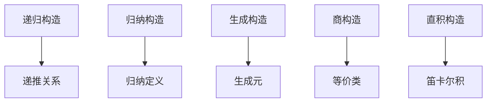

#### 方法说明

- **递归构造**: 通过递归关系构造对象
  - **定义**: $a_{n+1} = f(a_n, \ldots, a_0)$，给定初始值
  - **方法**: 线性递推、非线性递推、生成函数
  - **应用**: 序列、算法、数据结构
  - **技巧**: 寻找递推关系、求解递推方程

- **归纳构造**: 通过归纳定义构造对象
  - **定义**: 基础情况 + 归纳规则
  - **方法**: 结构归纳、良基归纳
  - **应用**: 形式语言、数据结构、证明
  - **技巧**: 选择合适的归纳基础

- **生成构造**: 通过生成元构造代数结构
  - **定义**: 从生成元出发，通过运算生成整个结构
  - **方法**: 自由群、自由环、张量积
  - **应用**: 群、环、模的构造
  - **技巧**: 确定生成元和关系

- **商构造**: 通过等价关系构造商结构
  - **定义**: $A/\sim = \{[a] : a \in A\}$，配备诱导运算
  - **方法**: 商群、商环、商空间
  - **应用**: 同态像、同构构造
  - **技巧**: 选择合适的等价关系

- **直积构造**: 通过直积构造新结构
  - **定义**: $A \times B = \{(a,b) : a \in A, b \in B\}$，配备分量运算
  - **方法**: 直积、直和、纤维积
  - **应用**: 分解结构、构造反例
  - **技巧**: 利用泛性质

### 3.2 几何构造方法

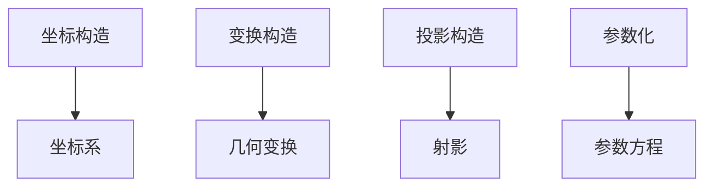

#### 方法说明

- **坐标构造**: 使用坐标系表示几何对象
  - **定义**: 将几何对象映射到坐标空间
  - **方法**: 笛卡尔坐标、极坐标、球坐标
  - **应用**: 曲线、曲面、几何计算
  - **技巧**: 选择合适的坐标系

- **变换构造**: 使用几何变换构造对象
  - **定义**: 通过平移、旋转、缩放等变换
  - **方法**: 仿射变换、射影变换、等距变换
  - **应用**: 几何证明、图形设计
  - **技巧**: 保持不变量

- **投影构造**: 使用投影构造对象
  - **定义**: 通过投影映射构造对象
  - **方法**: 正交投影、透视投影、射影
  - **应用**: 几何证明、计算机图形
  - **技巧**: 利用投影性质

- **参数化**: 使用参数方程表示几何对象
  - **定义**: $x = f(t), y = g(t), z = h(t)$
  - **方法**: 参数曲线、参数曲面
  - **应用**: 曲线积分、曲面积分、几何计算
  - **技巧**: 选择合适的参数

---

## 🔧 四、分析方法网络 (编号: C.05.03.05)

### 4.1 定性分析方法

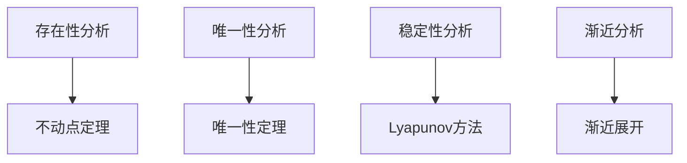

#### 方法说明

- **存在性分析**: 证明对象的存在性
  - **方法**: 不动点定理、压缩映射、Brouwer不动点
  - **应用**: 微分方程、优化问题、博弈论
  - **技巧**: 构造压缩映射、使用紧性

- **唯一性分析**: 证明对象的唯一性
  - **方法**: 唯一性定理、反证法、能量方法
  - **应用**: 微分方程、优化问题
  - **技巧**: 使用单调性、能量泛函

- **稳定性分析**: 分析系统的稳定性
  - **方法**: Lyapunov方法、特征值分析、相空间分析
  - **应用**: 动力系统、控制理论
  - **技巧**: 构造Lyapunov函数

- **渐近分析**: 分析渐近行为
  - **方法**: 渐近展开、主项分析、Stirling公式
  - **应用**: 算法分析、物理问题
  - **技巧**: 选择合适的渐近序列

### 4.2 定量分析方法

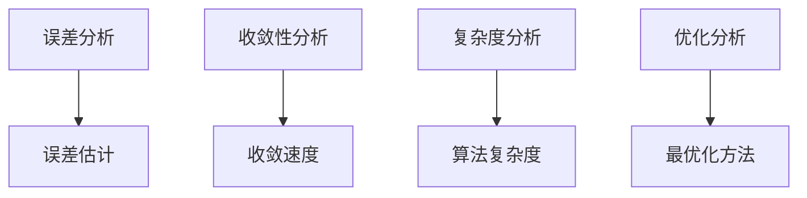

#### 方法说明

- **误差分析**: 估计计算误差
  - **方法**: 截断误差、舍入误差、条件数
  - **应用**: 数值计算、科学计算
  - **技巧**: 使用Taylor展开、条件数分析

- **收敛性分析**: 分析序列的收敛性
  - **方法**: 单调有界、Cauchy准则、压缩映射
  - **应用**: 迭代方法、级数、算法
  - **技巧**: 估计收敛速度

- **复杂度分析**: 分析算法复杂度
  - **方法**: 时间复杂度、空间复杂度、渐近分析
  - **应用**: 算法设计、数据结构
  - **技巧**: 大O记号、主定理

- **优化分析**: 分析优化问题
  - **方法**: 梯度方法、Newton方法、对偶方法
  - **应用**: 最优化、机器学习
  - **技巧**: 凸优化、KKT条件

### 4.3 离散数学方法 ⭐ 新增

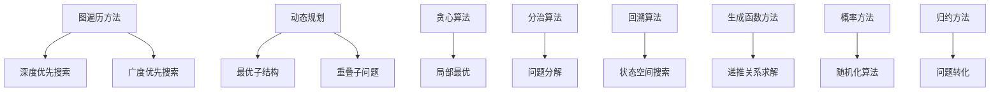

#### 方法说明

- **图遍历方法** (见[图 C.CORE.029](../核心概念/29-图.md), [算法 C.CORE.031](../核心概念/31-算法.md)): 遍历图中的所有节点
  - **方法**: 深度优先搜索（DFS）、广度优先搜索（BFS）
  - **应用**: 图算法、搜索问题
  - **技巧**: 使用栈（DFS）或队列（BFS）、标记访问

- **动态规划** (见[算法 C.CORE.031](../核心概念/31-算法.md)): 通过子问题的最优解构造整体最优解
  - **定义**: 最优子结构 + 重叠子问题
  - **方法**: 自底向上、记忆化递归
  - **应用**: 优化问题、序列问题
  - **技巧**: 识别子问题、设计状态转移

- **贪心算法** (见[算法 C.CORE.031](../核心概念/31-算法.md)): 每步选择局部最优
  - **定义**: 贪心选择性质 + 最优子结构
  - **方法**: 活动选择、最小生成树、最短路径
  - **应用**: 优化问题、调度问题
  - **技巧**: 证明贪心选择性质

- **分治算法** (见[算法 C.CORE.031](../核心概念/31-算法.md)): 将问题分解为子问题
  - **定义**: 分解 + 解决 + 合并
  - **方法**: 归并排序、快速排序、二分查找
  - **应用**: 排序、搜索、计算
  - **技巧**: 平衡分解、减少合并成本

- **回溯算法** (见[算法 C.CORE.031](../核心概念/31-算法.md)): 通过试错搜索解空间
  - **定义**: 深度优先搜索 + 剪枝
  - **方法**: N皇后、子集生成、排列生成
  - **应用**: 组合问题、约束满足
  - **技巧**: 剪枝策略、状态表示

- **生成函数方法** (见[组合数 C.CORE.030](../核心概念/30-组合数.md)): 使用生成函数求解递推关系
  - **定义**: $G(x) = \sum_{n=0}^\infty a_n x^n$
  - **方法**: 普通生成函数、指数生成函数
  - **应用**: 组合计数、递推关系
  - **技巧**: 识别生成函数形式、提取系数

- **概率方法**: 使用概率证明存在性
  - **定义**: 证明概率 > 0 则存在
  - **方法**: 期望方法、Lovász局部引理
  - **应用**: 组合问题、图论
  - **技巧**: 构造概率空间、计算期望

- **归约方法**: 将问题转化为已知问题
  - **定义**: 问题 $A$ 归约到问题 $B$：$A \leq_p B$
  - **方法**: 多项式时间归约、图灵归约
  - **应用**: 复杂度分析、NP完全性
  - **技巧**: 保持难度、构造归约

---

## 🔧 五、跨分支方法关联 (编号: C.05.03.06)

### 5.1 代数-几何方法关联

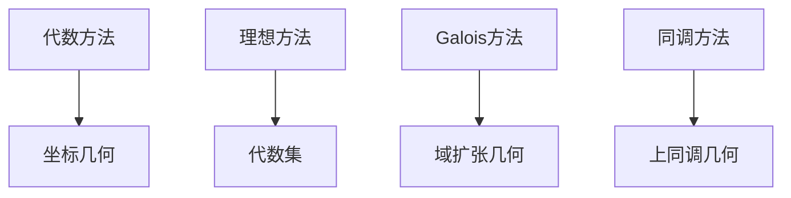

#### 方法说明

- **代数方法 → 坐标几何**: 使用坐标系统将几何问题转化为代数问题；Descartes的贡献
- **理想方法 → 代数集**: 使用理想描述代数集；$V(I) = \{x : f(x) = 0, \forall f \in I\}$
- **Galois方法 → 域扩张几何**: 使用Galois理论研究域扩张的几何；Galois群对应
- **同调方法 → 上同调几何**: 使用上同调研究几何对象；层上同调、代数几何

### 5.2 分析-几何方法关联

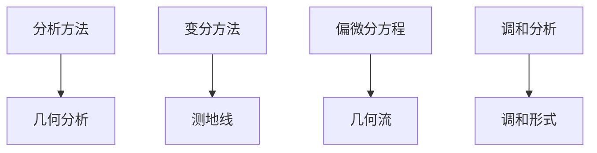

#### 方法说明

- **分析方法 → 几何分析**: 使用分析方法研究几何问题；PDE、变分法
- **变分方法 → 测地线**: 使用变分法求测地线；能量泛函的临界点
- **偏微分方程 → 几何流**: 使用PDE研究几何演化；里奇流、平均曲率流
- **调和分析 → 调和形式**: 使用调和分析研究调和形式；Hodge理论

### 5.3 拓扑-代数方法关联

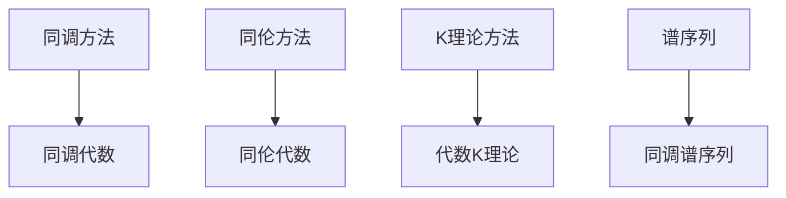

#### 方法说明

- **同调方法 → 同调代数**: 使用同调方法研究代数对象；链复形、导出函子
- **同伦方法 → 同伦代数**: 使用同伦方法研究代数结构；模型范畴、无穷范畴
- **K理论方法 → 代数K理论**: 使用K理论研究代数结构；向量丛、模
- **谱序列 → 同调谱序列**: 使用谱序列计算同调；Leray谱序列、Serre谱序列

### 5.4 离散数学方法网络 ⭐ 新增

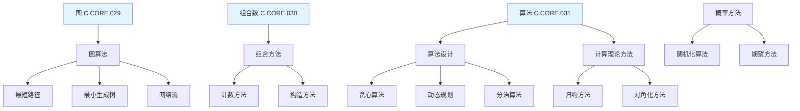

#### 方法说明

- **图算法 → 最短路径**: 使用图算法求最短路径；Dijkstra算法、Floyd-Warshall算法
- **图算法 → 最小生成树**: 使用图算法求最小生成树；Kruskal算法、Prim算法
- **图算法 → 网络流**: 使用图算法解决网络流问题；Ford-Fulkerson算法、最大流最小割
- **组合方法 → 计数方法**: 使用组合方法计数；生成函数、递推关系
- **组合方法 → 构造方法**: 使用组合方法构造对象；递归构造、归纳构造
- **算法设计 → 贪心算法**: 使用贪心策略设计算法；局部最优选择
- **算法设计 → 动态规划**: 使用动态规划设计算法；最优子结构、重叠子问题
- **算法设计 → 分治算法**: 使用分治策略设计算法；分解、解决、合并
- **计算理论方法 → 归约方法**: 使用归约证明复杂度；多项式时间归约
- **计算理论方法 → 对角化方法**: 使用对角化证明不可判定性；停机问题
- **概率方法 → 随机化算法**: 使用概率设计算法；随机化、期望分析
- **概率方法 → 期望方法**: 使用期望证明存在性；概率方法

## 📊 六、方法应用矩阵 (编号: C.05.03.07)

### 6.1 按问题类型选择方法

| 问题类型 | 推荐方法 | 优先级 | 说明 |
|---------|---------|--------|------|
| **存在性证明** | 构造法 | ⭐⭐⭐⭐⭐ | 直接构造 |
| **唯一性证明** | 反证法 | ⭐⭐⭐⭐ | 假设不唯一 |
| **性质证明** | 直接证明 | ⭐⭐⭐⭐⭐ | 从定义出发 |
| **计算问题** | 计算方法 | ⭐⭐⭐⭐⭐ | 直接计算 |
| **优化问题** | 优化方法 | ⭐⭐⭐⭐⭐ | 最优化理论 |

### 6.2 按分支选择方法

| 分支 | 常用方法 | 典型应用 | 方法选择 |
|-----|---------|---------|---------|
| **代数结构** | 同态方法、理想方法 | 证明同构 | 同态方法+构造法 |
| **分析学** | 极限方法、级数方法 | 计算极限 | 极限方法+级数方法 |
| **几何学** | 坐标方法、变换方法 | 证明性质 | 坐标方法+直接证明 |
| **拓扑学** | 同调方法、同伦方法 | 分类空间 | 同调方法+构造法 |
| **离散数学** | 图算法、动态规划、贪心算法 | 优化问题、搜索问题 | 图算法+动态规划 |

### 6.3 按难度选择方法

| 难度 | 推荐方法 | 说明 |
|-----|---------|------|
| **简单** | 直接方法 | 直接应用基本方法 |
| **中等** | 组合方法 | 组合多种方法 |
| **困难** | 高级方法 | 需要高级理论方法 |
| **极难** | 创新方法 | 需要创新思路 |

### 6.4 方法关联强度

| 方法1 | 方法2 | 关联类型 | 关联强度 | 说明 |
|------|------|---------|---------|------|
| **直接证明** | **反证法** | 互补关系 | ⭐⭐⭐⭐ | 可互相替代 |
| **数学归纳法** | **强归纳法** | 推广关系 | ⭐⭐⭐⭐⭐ | 强归纳法推广 |
| **极限方法** | **级数方法** | 应用关系 | ⭐⭐⭐⭐ | 级数用极限 |
| **同调方法** | **上同调方法** | 对偶关系 | ⭐⭐⭐⭐⭐ | 对偶方法 |
| **代数方法** | **几何方法** | 交叉关系 | ⭐⭐⭐⭐ | 交叉应用 |
| **动态规划** | **贪心算法** | 互补关系 | ⭐⭐⭐⭐ | 可互相替代 |
| **图算法** | **组合方法** | 应用关系 | ⭐⭐⭐⭐ | 图论用组合 |
| **归约方法** | **对角化方法** | 应用关系 | ⭐⭐⭐⭐ | 归约用对角化 |

**关联强度图例**:

- ⭐⭐⭐⭐⭐ 极强关联（直接推广或对偶关系）
- ⭐⭐⭐⭐ 强关联（重要应用或互补关系）
- ⭐⭐⭐ 中等关联（部分应用关系）
- ⭐⭐ 弱关联（偶尔应用关系）
- ⭐ 很弱关联（极少应用关系）

---

## 🔗 关联文档 (编号: C.05.03.08)

### 知识关联网络文档

- [知识关联网络总览 (C.05.00)](./00-知识关联网络总览.md)
- [概念级关联网络 (C.05.01)](./01-概念级关联网络.md)
- [定理级关联网络 (C.05.02)](./02-定理级关联网络.md)

### 相关文档

- [问题解决工具](../04-认知工具/06-问题解决工具.md)
- [应用场景矩阵](../02-知识矩阵/04-应用场景矩阵.md)

---

**创建日期**: 2025年11月21日
**最后更新**: 2025年11月28日（数学解释、论证、表征全面完成）
**维护状态**: 持续更新中
**版本**: v2.0
