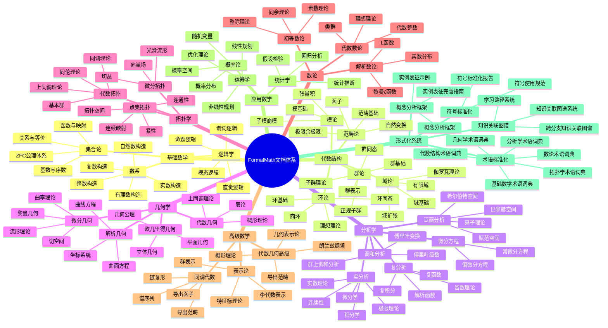
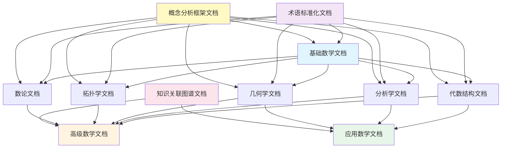
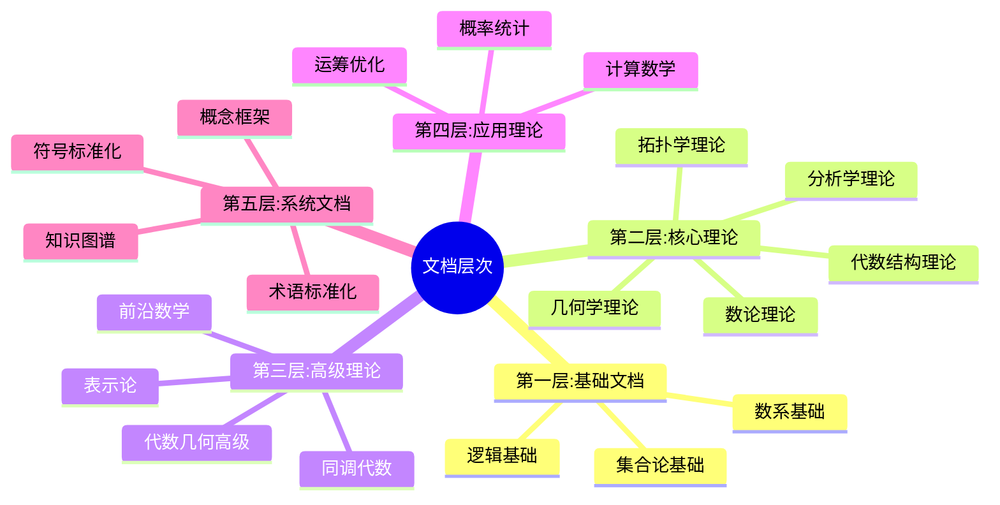
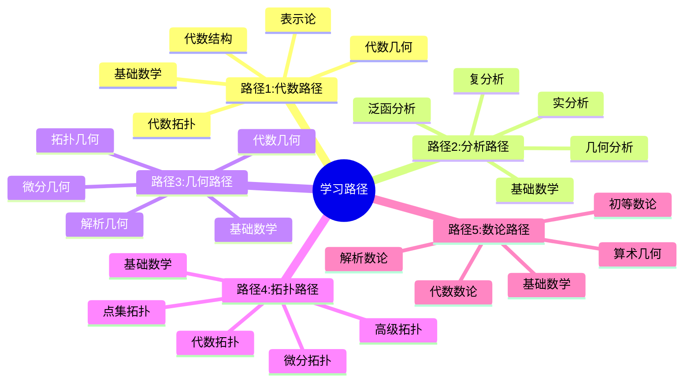
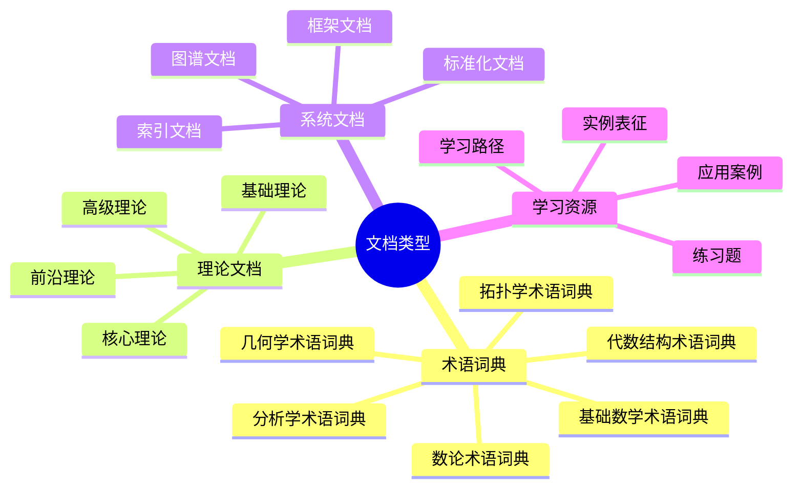

# FormalMath 文档主题思维导图

**主题编号**: C.06.01
**创建日期**: 2025年11月21日
**最后更新**: 2025年11月21日

---

## 📋 概述

本文档通过思维导图形式全面展示FormalMath项目中所有文档的主题结构和关联关系。

**创建日期**: 2025年11月21日

---

## 🗺️ 完整文档主题思维导图

---

## 🔗 文档关联思维导图

---

## 📊 文档层次结构思维导图

---

## 🎯 学习路径思维导图

---

## 📈 文档类型分布思维导图

---

**创建日期**: 2025年11月21日
**维护状态**: 持续更新中
