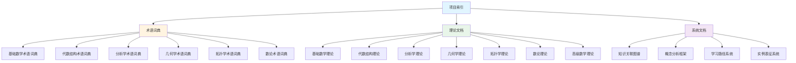

# FormalMath 文档导航系统

## 📋 概述

本文档提供FormalMath项目docs文件夹的完整导航系统，帮助用户快速找到所需文档。

**创建日期**: 2025年11月21日

---

## 🗺️ 快速导航

### 按数学分支导航

#### 01. 基础数学

- [术语词典](../docs/FormalMath术语词典-基础数学.md)
- [集合论文档](../docs/01-基础数学/集合论/)
- [数系文档](../docs/01-基础数学/集合论/02-数系与运算.md)
- [逻辑学文档](../docs/07-逻辑学/)

#### 02. 代数结构

- [术语词典](../docs/FormalMath术语词典-代数结构.md)
- [群论文档](../docs/02-代数结构/02-核心理论/群论/)
- [环论文档](../docs/02-代数结构/02-核心理论/环论/)
- [域论文档](../docs/02-代数结构/02-核心理论/域论/)
- [范畴论文档](../docs/02-代数结构/02-核心理论/范畴论/)

#### 03. 分析学

- [术语词典](../docs/FormalMath术语词典-分析学.md)
- [实分析文档](../docs/03-分析学/01-实分析/)
- [复分析文档](../docs/03-分析学/02-复分析/)
- [泛函分析文档](../docs/03-分析学/03-泛函分析/)

#### 04. 几何学

- [术语词典](../docs/FormalMath术语词典-几何学.md)
- [欧几里得几何](../docs/04-几何学/01-欧几里得几何.md)
- [解析几何](../docs/04-几何学/02-解析几何.md)
- [微分几何](../docs/04-几何学/03-微分几何.md)
- [代数几何](../docs/13-代数几何/)

#### 05. 拓扑学

- [术语词典](../docs/FormalMath术语词典-拓扑学.md)
- [点集拓扑](../docs/05-拓扑学/01-点集拓扑.md)
- [代数拓扑](../docs/05-拓扑学/02-代数拓扑.md)

#### 06. 数论

- [术语词典](../docs/FormalMath术语词典-数论.md)
- [初等数论](../docs/06-数论/01-初等数论.md)
- [代数数论](../docs/06-数论/02-代数数论.md)
- [解析数论](../docs/06-数论/03-解析数论.md)

---

### 按文档类型导航

#### 术语词典

- [基础数学术语词典](../docs/FormalMath术语词典-基础数学.md)
- [代数结构术语词典](../docs/FormalMath术语词典-代数结构.md)
- [分析学术语词典](../docs/FormalMath术语词典-分析学.md)
- [几何学术语词典](../docs/FormalMath术语词典-几何学.md)
- [拓扑学术语词典](../docs/FormalMath术语词典-拓扑学.md)
- [数论术语词典](../docs/FormalMath术语词典-数论.md)
- [术语词典总索引](../docs/FormalMath术语词典总索引.md)

#### 系统文档

- [项目索引](../docs/项目索引.md)
- [知识关联图谱系统](../docs/知识关联图谱系统-2025年8月30日.md)
- [跨分支知识关联图谱](../docs/跨分支知识关联图谱-2025年11月20日.md)
- [概念分析框架](../docs/FormalMath概念分析框架-示例与模板-2025年11月12日.md)

#### 学习资源

- [学习路径样例-代数几何](../docs/学习路径样例-代数几何.md)
- [学习路径样例-同调代数](../docs/学习路径样例-同调代数.md)
- [学习路径样例-微分几何](../docs/学习路径样例-微分几何.md)
- [学习路径样例-表示论](../docs/学习路径样例-表示论.md)
- [实例表征完善指南](../docs/实例表征完善指南.md)

---

### 按学习阶段导航

#### 初学者

1. [基础数学术语词典](../docs/FormalMath术语词典-基础数学.md)
2. [集合论基础](../docs/01-基础数学/集合论/01-集合论基础.md)
3. [数系与运算](../docs/01-基础数学/集合论/02-数系与运算.md)
4. [群论基础](../docs/02-代数结构/02-核心理论/群论/01-群论.md)
5. [实分析基础](../docs/03-分析学/01-实分析/01-实分析.md)

#### 中级学习者

1. [代数结构术语词典](../docs/FormalMath术语词典-代数结构.md)
2. [环论与域论](../docs/02-代数结构/02-核心理论/)
3. [泛函分析](../docs/03-分析学/03-泛函分析/)
4. [微分几何](../docs/04-几何学/03-微分几何.md)
5. [代数拓扑](../docs/05-拓扑学/02-代数拓扑.md)

#### 高级学习者

1. [代数几何](../docs/13-代数几何/)
2. [同调代数](../docs/15-同调代数/)
3. [朗兰兹纲领](../docs/11-高级数学/10-朗兰兹纲领.md)
4. [导出范畴理论](../docs/FormalMath现代数学前沿内容框架-2025年1月.md)

---

## 🔍 搜索指南

### 按关键词搜索

#### 核心概念

- **集合**: 集合论文档
- **群**: 群论文档
- **环**: 环论文档
- **流形**: 微分几何文档
- **拓扑**: 拓扑学文档
- **概形**: 代数几何文档

#### 理论方法

- **上同调**: 同调代数、代数拓扑
- **表示**: 表示论文档
- **范畴**: 范畴论文档
- **形式化**: 形式化实现文档

---

## 📊 文档关系图

---

## 🎯 使用建议

### 首次访问

1. 查看[项目索引](../docs/项目索引.md)了解整体结构
2. 查看[术语词典总索引](../docs/FormalMath术语词典总索引.md)了解术语体系
3. 根据学习阶段选择相应文档

### 深入学习

1. 选择感兴趣的数学分支
2. 查看对应的术语词典
3. 阅读理论文档
4. 参考学习路径和实例表征

### 研究应用

1. 查看知识关联图谱了解概念关系
2. 使用概念分析框架深入理解概念
3. 参考高级数学文档了解前沿理论

---

**创建日期**: 2025年11月21日
**维护状态**: 持续更新中
