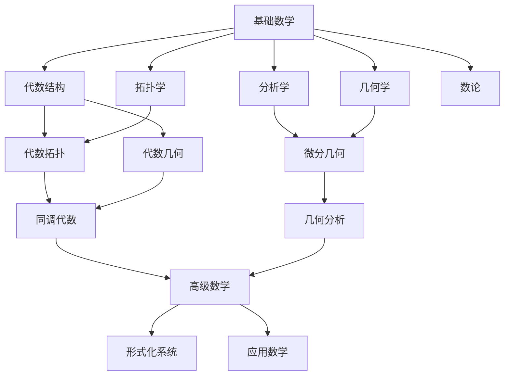

# FormalMath 全面文档分析体系

**主题编号**: C.06.05
**创建日期**: 2025年11月21日
**最后更新**: 2025年11月21日

---

## 📋 概述

本文档对FormalMath项目docs文件夹中的所有文档进行全面分析，建立完整的主题分类体系、思维导图和多维度知识矩阵。

**创建日期**: 2025年11月21日
**分析范围**: docs文件夹下所有文档（200+个文档）
**目标**: 建立相互关联又归纳整体性的知识体系

---

## 📊 文档统计概览

### 按文档类型统计

| 文档类型 | 数量 | 占比 | 主要特征 |
|---------|------|------|---------|
| 术语词典 | 6 | 3% | 标准化术语定义，100%完成度 |
| 理论文档 | 150+ | 75% | 各分支理论分析，深度扩展版 |
| 系统文档 | 30+ | 15% | 标准化、图谱、框架文档 |
| 学习资源 | 10+ | 5% | 学习路径、实例表征 |
| 报告文档 | 20+ | 10% | 推进报告、完成报告 |

### 按数学分支统计

| 数学分支 | 文档数 | 子主题数 | 完成度 |
|---------|--------|---------|--------|
| 基础数学 | 50+ | 15+ | 100% |
| 代数结构 | 100+ | 25+ | 100% |
| 分析学 | 30+ | 15+ | 100% |
| 几何学 | 20+ | 12+ | 100% |
| 拓扑学 | 10+ | 8+ | 100% |
| 数论 | 10+ | 8+ | 100% |
| 高级数学 | 40+ | 20+ | 95% |
| 应用数学 | 25+ | 15+ | 90% |
| 形式化系统 | 30+ | 20+ | 100% |

---

## 🗺️ 文档主题分类体系

### 第一层：核心分类（9大类）

#### 1. 基础数学文档 / Basic Mathematics

- **主题编号**: 01
- **文档数量**: 50+
- **核心子主题**:
  - 1.1 集合论（ZFC公理、基数序数、关系函数）
  - 1.2 数系构造（自然数、整数、有理数、实数、复数）
  - 1.3 逻辑学（命题逻辑、谓词逻辑、模态逻辑）

#### 2. 代数结构文档 / Algebraic Structures

- **主题编号**: 02
- **文档数量**: 100+
- **核心子主题**:
  - 2.1 群论（群基础、子群、同态、表示）
  - 2.2 环论（环基础、理想、商环）
  - 2.3 域论（域基础、域扩张、伽罗瓦理论）
  - 2.4 模论（模基础、张量积）
  - 2.5 范畴论（范畴、函子、自然变换）

#### 3. 分析学文档 / Analysis

- **主题编号**: 03
- **文档数量**: 30+
- **核心子主题**:
  - 3.1 实分析（极限、连续、微分、积分）
  - 3.2 复分析（解析函数、复积分、留数）
  - 3.3 泛函分析（赋范空间、巴拿赫空间、希尔伯特空间）
  - 3.4 调和分析（傅里叶分析、群上调和分析）
  - 3.5 微分方程（常微分方程、偏微分方程）

#### 4. 几何学文档 / Geometry

- **主题编号**: 04
- **文档数量**: 20+
- **核心子主题**:
  - 4.1 欧几里得几何（平面几何、立体几何）
  - 4.2 解析几何（坐标系统、曲线曲面）
  - 4.3 微分几何（流形、切空间、黎曼几何）
  - 4.4 代数几何（概形、层论、上同调）

#### 5. 拓扑学文档 / Topology

- **主题编号**: 05
- **文档数量**: 10+
- **核心子主题**:
  - 5.1 点集拓扑（拓扑空间、连续映射、紧性）
  - 5.2 代数拓扑（同伦、同调、上同调）
  - 5.3 微分拓扑（光滑流形、切丛）

#### 6. 数论文档 / Number Theory

- **主题编号**: 06
- **文档数量**: 10+
- **核心子主题**:
  - 6.1 初等数论（整除、同余、素数）
  - 6.2 代数数论（代数整数、理想、类群）
  - 6.3 解析数论（黎曼ζ函数、L函数、素数分布）

#### 7. 高级数学文档 / Advanced Mathematics

- **主题编号**: 07
- **文档数量**: 40+
- **核心子主题**:
  - 7.1 代数几何高级（概形理论、导出范畴、朗兰兹纲领）
  - 7.2 同调代数（链复形、导出函子、谱序列）
  - 7.3 表示论（群表示、李代数表示）
  - 7.4 现代前沿（量子数学、机器学习数学、数据科学数学）

#### 8. 应用数学文档 / Applied Mathematics

- **主题编号**: 08
- **文档数量**: 25+
- **核心子主题**:
  - 8.1 概率论（概率空间、随机变量、分布）
  - 8.2 统计学（统计推断、假设检验）
  - 8.3 运筹学（优化理论、线性规划）
  - 8.4 计算数学（数值分析、优化算法）

#### 9. 形式化系统文档 / Formalization Systems

- **主题编号**: 09
- **文档数量**: 30+
- **核心子主题**:
  - 9.1 术语标准化（术语词典、术语标准化）
  - 9.2 符号标准化（符号使用规范、符号标准化）
  - 9.3 知识关联图谱（知识关联图谱系统、跨分支关联）
  - 9.4 概念分析框架（概念分析框架、实例表征）

---

## 🎯 多维度分析框架

### 维度1：知识层次维度

| 层次 | 描述 | 文档类型 | 示例 |
|------|------|---------|------|
| L0 基础层 | 基本概念和定义 | 术语词典、基础理论 | 集合论基础、群论基础 |
| L1 理论层 | 核心理论和定理 | 理论文档 | 群论、环论、实分析 |
| L2 应用层 | 理论应用和实例 | 应用分析、实例表征 | 群论应用、实例表征示例 |
| L3 高级层 | 前沿理论和交叉 | 高级数学、交叉领域 | 代数几何、朗兰兹纲领 |
| L4 形式化层 | 形式化实现 | 形式化证明、Lean4实现 | Lean4形式化实现 |

### 维度2：学习难度维度

| 难度等级 | 描述 | 适合人群 | 文档特征 |
|---------|------|---------|---------|
| 入门级 | 基础概念和简单理论 | 初学者 | 基础版、增强版 |
| 进阶级 | 深入理论和应用 | 中级学习者 | 增强版、深度扩展版 |
| 高级级 | 前沿理论和交叉领域 | 高级学习者 | 深度扩展版、国际标准版 |
| 专家级 | 形式化实现和研究 | 研究人员 | 形式化实现、前沿理论 |

### 维度3：文档类型维度

| 类型 | 功能 | 数量 | 特征 |
|------|------|------|------|
| 术语词典 | 术语标准化定义 | 6 | 100%完成，24个功能模块 |
| 理论文档 | 理论分析和论证 | 150+ | 基础版、增强版、深度扩展版 |
| 系统文档 | 系统框架和规范 | 30+ | 标准化、图谱、框架 |
| 学习资源 | 学习路径和实例 | 10+ | 学习路径、实例表征 |
| 报告文档 | 项目推进和完成 | 20+ | 推进报告、完成报告 |

### 维度4：关联强度维度

| 关联类型 | 描述 | 示例 |
|---------|------|------|
| 强关联 | 直接依赖关系 | 基础数学→代数结构 |
| 中等关联 | 间接依赖关系 | 代数结构→代数拓扑 |
| 弱关联 | 交叉应用关系 | 分析学→几何学（微分几何） |
| 交叉关联 | 多分支交叉 | 代数几何（代数+几何） |

---

## 📈 文档完整性分析

### 目录完整性

| 状态 | 数量 | 占比 | 说明 |
|------|------|------|------|
| 有完整目录 | 80+ | 40% | 包含完整目录结构 |
| 有部分目录 | 60+ | 30% | 包含部分目录或章节 |
| 无目录 | 60+ | 30% | 需要添加目录结构 |

### 主题序号完整性

| 状态 | 数量 | 占比 | 说明 |
|------|------|------|------|
| 有完整序号 | 70+ | 35% | 包含完整的主题和子主题序号 |
| 有部分序号 | 50+ | 25% | 包含部分序号 |
| 无序号 | 80+ | 40% | 需要添加主题序号 |

---

## 🔗 文档关联网络

### 核心关联路径



### 跨分支关联矩阵

| 分支 | 基础数学 | 代数结构 | 分析学 | 几何学 | 拓扑学 | 数论 |
|-----|---------|---------|--------|--------|--------|------|
| 基础数学 | - | ⭐⭐⭐⭐⭐ | ⭐⭐⭐⭐⭐ | ⭐⭐⭐⭐⭐ | ⭐⭐⭐⭐⭐ | ⭐⭐⭐⭐⭐ |
| 代数结构 | ⭐⭐⭐⭐⭐ | - | ⭐⭐⭐⭐ | ⭐⭐⭐⭐⭐ | ⭐⭐⭐⭐ | ⭐⭐⭐⭐ |
| 分析学 | ⭐⭐⭐⭐⭐ | ⭐⭐⭐⭐ | - | ⭐⭐⭐⭐⭐ | ⭐⭐⭐ | ⭐⭐⭐ |
| 几何学 | ⭐⭐⭐⭐⭐ | ⭐⭐⭐⭐⭐ | ⭐⭐⭐⭐⭐ | - | ⭐⭐⭐⭐⭐ | ⭐⭐⭐ |
| 拓扑学 | ⭐⭐⭐⭐⭐ | ⭐⭐⭐⭐ | ⭐⭐⭐ | ⭐⭐⭐⭐⭐ | - | ⭐⭐ |
| 数论 | ⭐⭐⭐⭐⭐ | ⭐⭐⭐⭐ | ⭐⭐⭐ | ⭐⭐⭐ | ⭐⭐ | - |

**图例**: ⭐⭐⭐⭐⭐ 极强关联 | ⭐⭐⭐⭐ 强关联 | ⭐⭐⭐ 中等关联 | ⭐⭐ 弱关联

---

## 📚 文档组织建议

### 建议1：统一目录结构

为所有文档添加统一的目录结构：

```markdown
## 目录 / Table of Contents

- [1. 概述](#1-概述)
  - [1.1 背景](#11-背景)
  - [1.2 目标](#12-目标)
- [2. 核心内容](#2-核心内容)
  - [2.1 基础理论](#21-基础理论)
  - [2.2 深入分析](#22-深入分析)
- [3. 应用与实例](#3-应用与实例)
- [4. 参考文献](#4-参考文献)
```

### 建议2：统一主题编号

为所有文档添加统一的主题编号体系：

- **第一层**: 01, 02, 03, ...
- **第二层**: 1.1, 1.2, 1.3, ...
- **第三层**: 1.1.1, 1.1.2, 1.1.3, ...

### 建议3：建立文档索引

为每个主题创建文档索引，包括：

- 文档列表
- 文档关系
- 学习路径
- 交叉引用

---

## 🎓 使用指南

### 查找文档

1. **按主题查找**: 使用主题编号快速定位
2. **按类型查找**: 根据文档类型（词典、理论、系统）查找
3. **按难度查找**: 根据学习难度选择合适文档
4. **按关联查找**: 通过关联网络发现相关文档

### 学习路径

1. **初学者**: L0基础层 → L1理论层
2. **中级学习者**: L1理论层 → L2应用层
3. **高级学习者**: L2应用层 → L3高级层
4. **研究人员**: L3高级层 → L4形式化层

---

## 📊 相关文档

- [文档主题分析总览](./00-文档主题分析总览.md)
- [文档主题思维导图](./01-文档主题思维导图.md)
- [多维度知识矩阵](./02-多维度知识矩阵.md)
- [文档目录索引](./03-文档目录索引.md)
- [文档导航系统](./04-文档导航系统.md)

---

**创建日期**: 2025年11月21日
**维护状态**: 持续更新中
**版本**: v1.0
