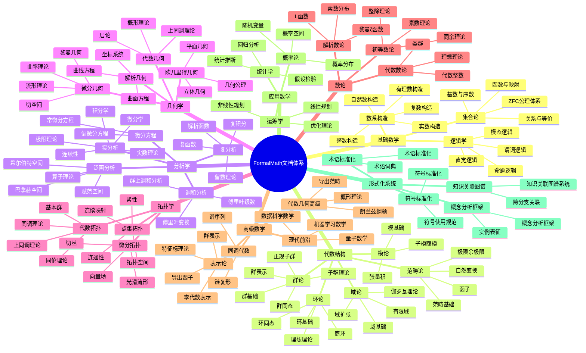
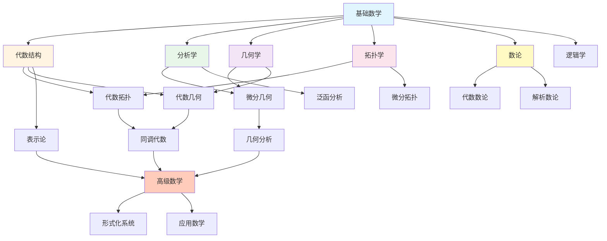
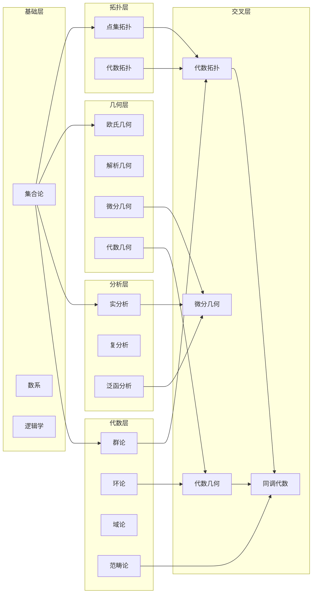
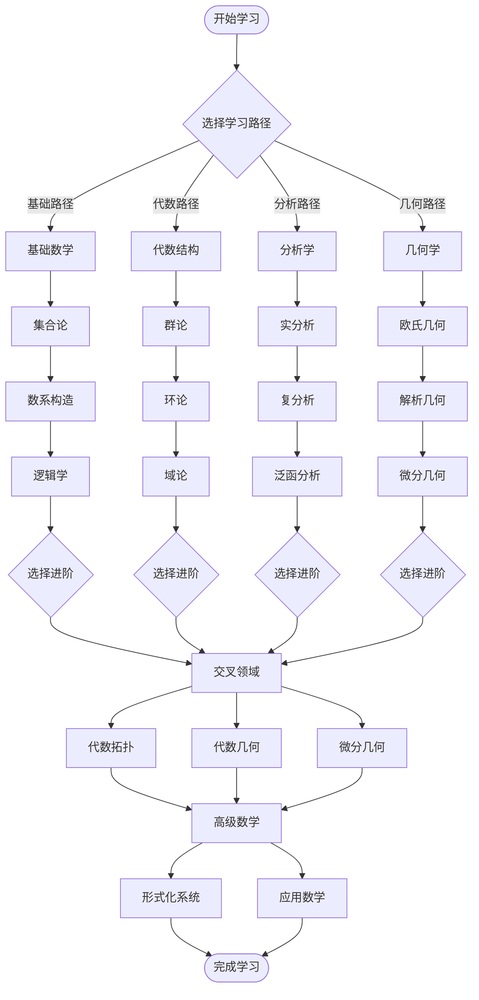
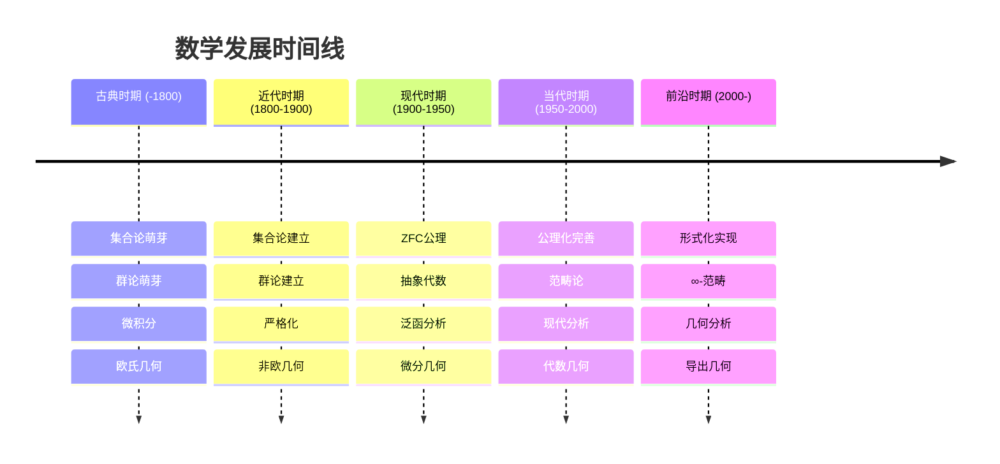
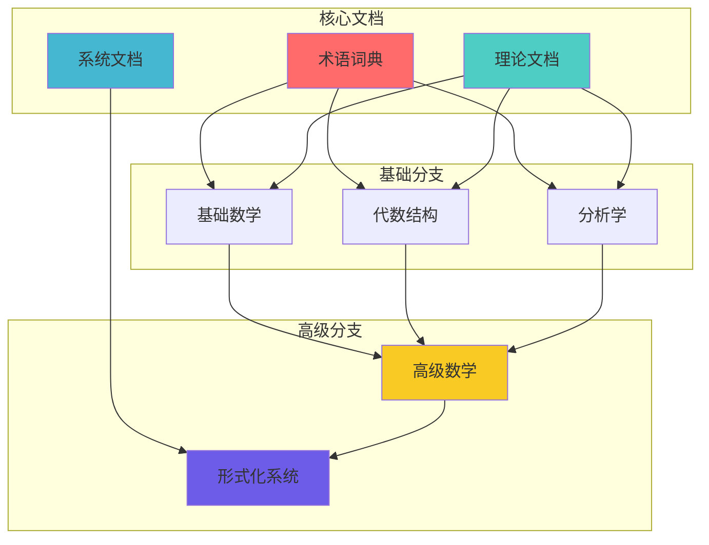

# FormalMath 多种形式思维导图

## 📋 概述

本文档通过多种形式的思维导图全面展示FormalMath项目中所有文档的主题结构、关联关系和学习路径。

**创建日期**: 2025年11月21日
**目标**: 使用多种思维导图表征方式，构建相互关联又归纳整体性的知识体系

---

## 🗺️ 1. Mermaid Mindmap 思维导图

### 1.1 完整文档体系思维导图



---

## 🔗 2. Mermaid Graph 关联图

### 2.1 文档依赖关系图



### 2.2 跨分支关联网络图



---

## 📊 3. 文本层级思维导图

### 3.1 文档主题层级结构

```
FormalMath 文档体系
│
├── 01. 基础数学
│   ├── 1.1 集合论
│   │   ├── 1.1.1 ZFC公理体系
│   │   ├── 1.1.2 基数与序数
│   │   ├── 1.1.3 关系与等价
│   │   └── 1.1.4 函数与映射
│   ├── 1.2 数系构造
│   │   ├── 1.2.1 自然数构造
│   │   ├── 1.2.2 整数构造
│   │   ├── 1.2.3 有理数构造
│   │   ├── 1.2.4 实数构造
│   │   └── 1.2.5 复数构造
│   └── 1.3 逻辑学
│       ├── 1.3.1 命题逻辑
│       ├── 1.3.2 谓词逻辑
│       └── 1.3.3 模态逻辑
│
├── 02. 代数结构
│   ├── 2.1 群论
│   │   ├── 2.1.1 群基础
│   │   ├── 2.1.2 子群理论
│   │   ├── 2.1.3 群同态
│   │   └── 2.1.4 群表示
│   ├── 2.2 环论
│   │   ├── 2.2.1 环基础
│   │   ├── 2.2.2 理想理论
│   │   └── 2.2.3 商环
│   ├── 2.3 域论
│   │   ├── 2.3.1 域基础
│   │   ├── 2.3.2 域扩张
│   │   └── 2.3.3 伽罗瓦理论
│   ├── 2.4 模论
│   │   ├── 2.4.1 模基础
│   │   └── 2.4.2 张量积
│   └── 2.5 范畴论
│       ├── 2.5.1 范畴基础
│       ├── 2.5.2 函子
│       └── 2.5.3 自然变换
│
├── 03. 分析学
│   ├── 3.1 实分析
│   │   ├── 3.1.1 实数理论
│   │   ├── 3.1.2 极限理论
│   │   ├── 3.1.3 连续性
│   │   ├── 3.1.4 微分学
│   │   └── 3.1.5 积分学
│   ├── 3.2 复分析
│   │   ├── 3.2.1 复函数
│   │   ├── 3.2.2 解析函数
│   │   └── 3.2.3 复积分
│   ├── 3.3 泛函分析
│   │   ├── 3.3.1 赋范空间
│   │   ├── 3.3.2 巴拿赫空间
│   │   └── 3.3.3 希尔伯特空间
│   ├── 3.4 调和分析
│   │   ├── 3.4.1 傅里叶级数
│   │   └── 3.4.2 傅里叶变换
│   └── 3.5 微分方程
│       ├── 3.5.1 常微分方程
│       └── 3.5.2 偏微分方程
│
├── 04. 几何学
│   ├── 4.1 欧几里得几何
│   │   ├── 4.1.1 平面几何
│   │   └── 4.1.2 立体几何
│   ├── 4.2 解析几何
│   │   ├── 4.2.1 坐标系统
│   │   └── 4.2.2 曲线方程
│   ├── 4.3 微分几何
│   │   ├── 4.3.1 流形理论
│   │   ├── 4.3.2 切空间
│   │   └── 4.3.3 黎曼几何
│   └── 4.4 代数几何
│       ├── 4.4.1 概形理论
│       ├── 4.4.2 层论
│       └── 4.4.3 上同调理论
│
├── 05. 拓扑学
│   ├── 5.1 点集拓扑
│   │   ├── 5.1.1 拓扑空间
│   │   ├── 5.1.2 连续映射
│   │   └── 5.1.3 紧性
│   ├── 5.2 代数拓扑
│   │   ├── 5.2.1 同伦理论
│   │   ├── 5.2.2 同调理论
│   │   └── 5.2.3 上同调理论
│   └── 5.3 微分拓扑
│       ├── 5.3.1 光滑流形
│       └── 5.3.2 切丛
│
├── 06. 数论
│   ├── 6.1 初等数论
│   │   ├── 6.1.1 整除理论
│   │   ├── 6.1.2 同余理论
│   │   └── 6.1.3 素数理论
│   ├── 6.2 代数数论
│   │   ├── 6.2.1 代数整数
│   │   └── 6.2.2 理想理论
│   └── 6.3 解析数论
│       ├── 6.3.1 黎曼ζ函数
│       └── 6.3.2 L函数
│
├── 07. 高级数学
│   ├── 7.1 代数几何高级
│   │   ├── 7.1.1 概形理论
│   │   ├── 7.1.2 导出范畴
│   │   └── 7.1.3 朗兰兹纲领
│   ├── 7.2 同调代数
│   │   ├── 7.2.1 链复形
│   │   ├── 7.2.2 导出函子
│   │   └── 7.2.3 谱序列
│   └── 7.3 现代前沿
│       ├── 7.3.1 量子数学
│       ├── 7.3.2 机器学习数学
│       └── 7.3.3 数据科学数学
│
├── 08. 应用数学
│   ├── 8.1 概率论
│   │   ├── 8.1.1 概率空间
│   │   └── 8.1.2 随机变量
│   ├── 8.2 统计学
│   │   ├── 8.2.1 统计推断
│   │   └── 8.2.2 假设检验
│   └── 8.3 运筹学
│       ├── 8.3.1 优化理论
│       └── 8.3.2 线性规划
│
└── 09. 形式化系统
    ├── 9.1 术语标准化
    │   ├── 9.1.1 术语词典
    │   └── 9.1.2 术语标准化
    ├── 9.2 符号标准化
    │   ├── 9.2.1 符号使用规范
    │   └── 9.2.2 符号标准化
    ├── 9.3 知识关联图谱
    │   ├── 9.3.1 知识关联图谱系统
    │   └── 9.3.2 跨分支关联
    └── 9.4 概念分析框架
        ├── 9.4.1 概念分析框架
        └── 9.4.2 实例表征
```

---

## 🔄 4. 流程图思维导图

### 4.1 学习路径流程图



---

## 📈 5. 时间线思维导图

### 5.1 数学发展时间线



---

## 🎯 6. 象限图思维导图

### 6.1 文档重要性-难度象限

```
                   高重要性
                       │
                       │
         ┌─────────────┼─────────────┐
         │             │             │
         │   基础数学   │   代数结构   │
         │   分析学     │   几何学     │
         │             │             │
   低难度│─────────────┼─────────────│高难度
         │             │             │
         │   拓扑学     │   高级数学   │
         │   数论       │   形式化系统 │
         │             │             │
         └─────────────┼─────────────┘
                       │
                   低重要性
```

### 6.2 文档完整性-关联度象限

```
                   高关联度
                       │
                       │
         ┌─────────────┼─────────────┐
         │             │             │
         │   代数结构   │   基础数学   │
         │   分析学     │   几何学     │
         │             │             │
   低完整性│─────────────┼─────────────│高完整性
         │             │             │
         │   应用数学   │   高级数学   │
         │   形式化系统 │   拓扑学     │
         │             │             │
         └─────────────┼─────────────┘
                       │
                   低关联度
```

---

## 🔗 7. 网络图思维导图

### 7.1 文档关联网络



---

## 📊 8. 矩阵思维导图

### 8.1 文档主题-类型矩阵

| 主题 | 术语词典 | 理论文档 | 系统文档 | 学习资源 | 应用案例 |
|------|---------|---------|---------|---------|---------|
| **基础数学** | ✅ | ✅ | ✅ | ✅ | ⚪ |
| **代数结构** | ✅ | ✅ | ✅ | ✅ | ✅ |
| **分析学** | ✅ | ✅ | ⚪ | ✅ | ⚪ |
| **几何学** | ✅ | ✅ | ⚪ | ✅ | ✅ |
| **拓扑学** | ✅ | ✅ | ⚪ | ⚪ | ⚪ |
| **数论** | ✅ | ✅ | ⚪ | ⚪ | ⚪ |
| **高级数学** | ⚪ | ✅ | ✅ | ✅ | ⚪ |
| **应用数学** | ⚪ | ✅ | ⚪ | ⚪ | ✅ |
| **形式化系统** | ✅ | ⚪ | ✅ | ⚪ | ⚪ |

**图例**: ✅ 有 | ⚪ 无

---

## 🎨 9. 树状图思维导图

### 9.1 文档分类树

```
FormalMath 文档体系
│
├─ 术语词典 (6个)
│  ├─ 基础数学术语词典
│  ├─ 代数结构术语词典
│  ├─ 分析学术语词典
│  ├─ 几何学术语词典
│  ├─ 拓扑学术语词典
│  └─ 数论术语词典
│
├─ 理论文档 (150+个)
│  ├─ 基础数学理论
│  ├─ 代数结构理论
│  ├─ 分析学理论
│  ├─ 几何学理论
│  ├─ 拓扑学理论
│  ├─ 数论理论
│  └─ 高级数学理论
│
├─ 系统文档 (30+个)
│  ├─ 术语标准化
│  ├─ 符号标准化
│  ├─ 知识关联图谱
│  └─ 概念分析框架
│
├─ 学习资源 (10+个)
│  ├─ 学习路径
│  ├─ 实例表征
│  └─ 应用案例
│
└─ 报告文档 (20+个)
   ├─ 推进报告
   └─ 完成报告
```

---

## 📚 相关文档

- [文档主题分析总览](./00-文档主题分析总览.md)
- [多维度知识矩阵](./02-多维度知识矩阵.md)
- [全面文档分析体系](./05-全面文档分析体系-2025年11月21日.md)
- [文档目录索引](./03-文档目录索引.md)
- [文档导航系统](./04-文档导航系统.md)

---

**创建日期**: 2025年11月21日
**维护状态**: 持续更新中
**版本**: v1.0
