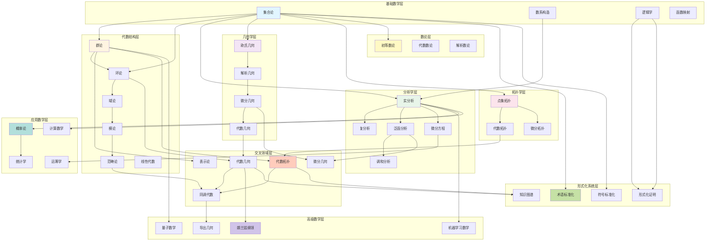
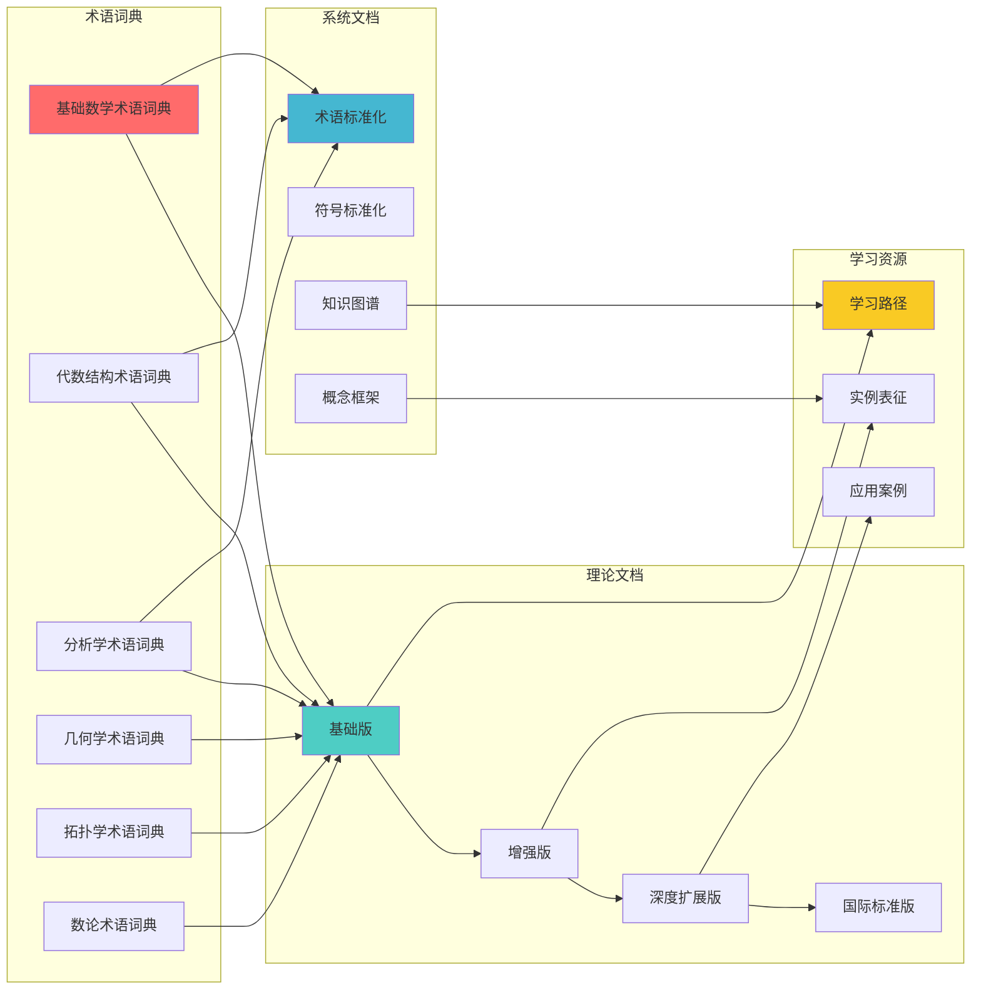
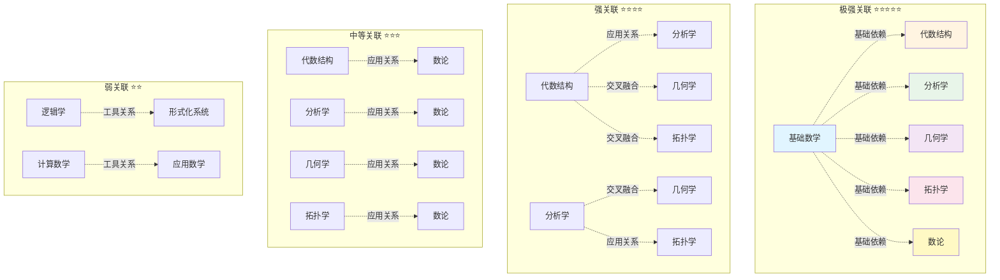
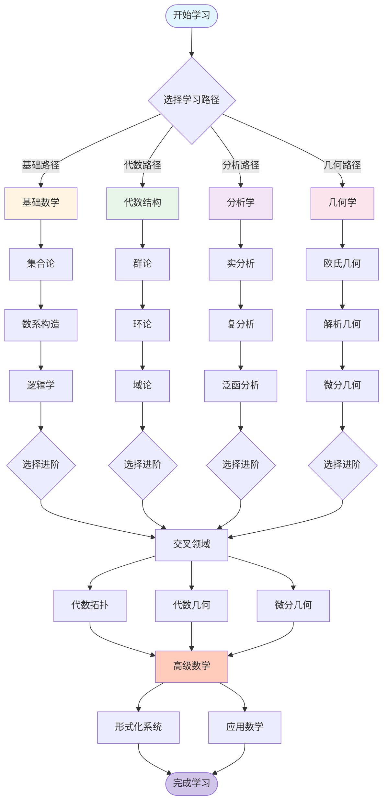
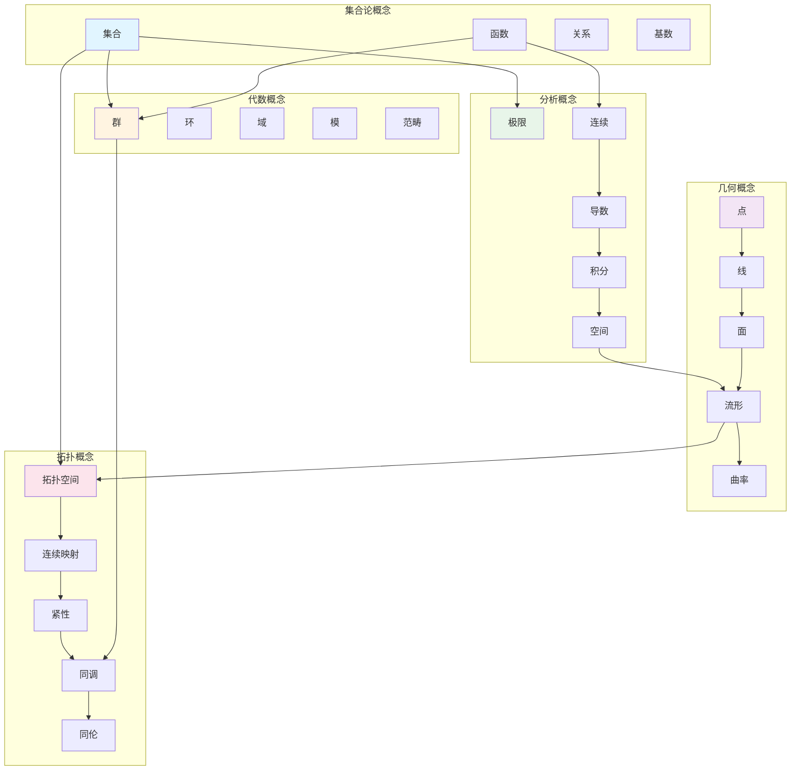
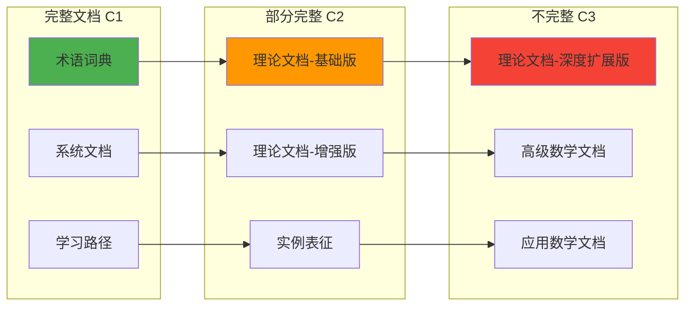
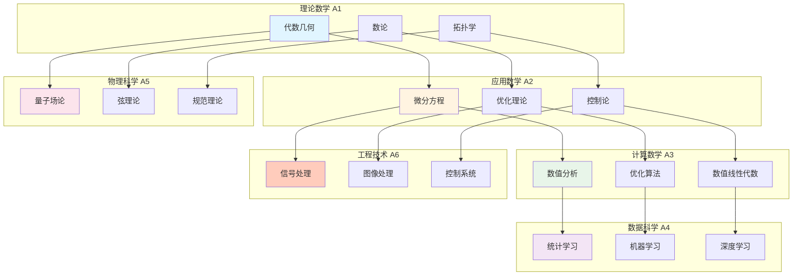
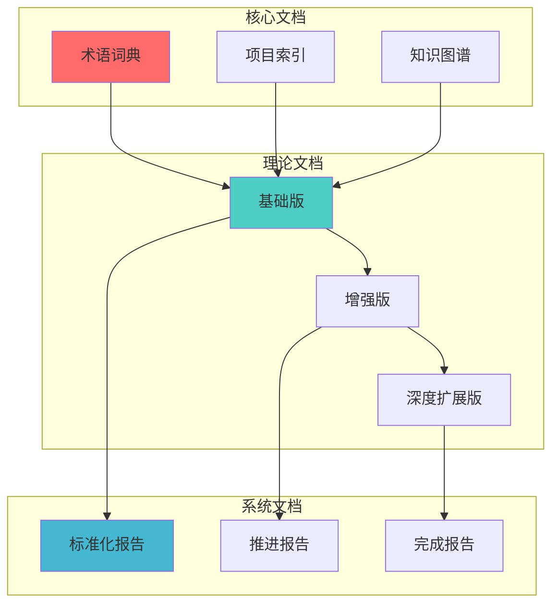
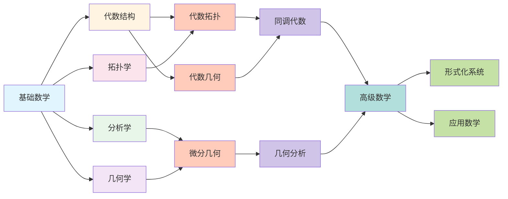

# FormalMath 知识关联网络图谱

## 📋 概述

本文档通过多种形式的网络图谱展示FormalMath项目中所有文档之间的复杂关联关系，构建相互关联又归纳整体性的知识体系。

**创建日期**: 2025年11月21日
**分析范围**: docs文件夹下所有200+个文档
**关联类型**: 依赖关系、应用关系、交叉融合、工具关系
**目标**: 建立完整的知识关联网络，发现隐藏的知识连接

---

## 🗺️ 1. 核心关联网络图

### 1.1 基础数学到高级数学的完整关联网络

---

## 🔗 2. 文档依赖关系网络

### 2.1 文档类型依赖网络

---

## 🌐 3. 跨分支关联强度网络

### 3.1 关联强度可视化

---

## 📊 4. 学习路径关联网络

### 4.1 学习路径依赖关系

---

## 🔍 5. 概念关联网络

### 5.1 核心概念关联图

---

## 📈 6. 文档完整性关联网络

### 6.1 完整性依赖关系

---

## 🎯 7. 应用场景关联网络

### 7.1 应用领域关联图

---

## 📊 8. 关联强度矩阵

### 8.1 跨分支关联强度矩阵

| 分支A \ 分支B | 基础数学 | 代数结构 | 分析学 | 几何学 | 拓扑学 | 数论 | 逻辑学 | 计算数学 | 应用数学 | 高级数学 | 形式化系统 |
|--------------|---------|---------|--------|--------|--------|------|--------|---------|---------|---------|-----------|
| **基础数学** | - | ⭐⭐⭐⭐⭐ | ⭐⭐⭐⭐⭐ | ⭐⭐⭐⭐⭐ | ⭐⭐⭐⭐⭐ | ⭐⭐⭐⭐⭐ | ⭐⭐⭐⭐⭐ | ⭐⭐⭐⭐⭐ | ⭐⭐⭐⭐⭐ | ⭐⭐⭐⭐⭐ | ⭐⭐⭐⭐⭐ |
| **代数结构** | ⭐⭐⭐⭐⭐ | - | ⭐⭐⭐⭐ | ⭐⭐⭐⭐⭐ | ⭐⭐⭐⭐ | ⭐⭐⭐⭐ | ⭐⭐⭐ | ⭐⭐ | ⭐⭐⭐ | ⭐⭐⭐⭐⭐ | ⭐⭐⭐ |
| **分析学** | ⭐⭐⭐⭐⭐ | ⭐⭐⭐⭐ | - | ⭐⭐⭐⭐⭐ | ⭐⭐⭐ | ⭐⭐⭐ | ⭐⭐⭐ | ⭐⭐⭐⭐⭐ | ⭐⭐⭐⭐⭐ | ⭐⭐⭐⭐⭐ | ⭐⭐⭐ |
| **几何学** | ⭐⭐⭐⭐⭐ | ⭐⭐⭐⭐⭐ | ⭐⭐⭐⭐⭐ | - | ⭐⭐⭐⭐⭐ | ⭐⭐⭐ | ⭐⭐ | ⭐⭐⭐ | ⭐⭐⭐ | ⭐⭐⭐⭐⭐ | ⭐⭐ |
| **拓扑学** | ⭐⭐⭐⭐⭐ | ⭐⭐⭐⭐ | ⭐⭐⭐ | ⭐⭐⭐⭐⭐ | - | ⭐⭐ | ⭐⭐ | ⭐⭐ | ⭐⭐ | ⭐⭐⭐⭐⭐ | ⭐⭐ |
| **数论** | ⭐⭐⭐⭐⭐ | ⭐⭐⭐⭐ | ⭐⭐⭐ | ⭐⭐⭐ | ⭐⭐ | - | ⭐⭐⭐ | ⭐⭐⭐ | ⭐⭐ | ⭐⭐⭐⭐ | ⭐⭐ |
| **逻辑学** | ⭐⭐⭐⭐⭐ | ⭐⭐⭐ | ⭐⭐⭐ | ⭐⭐ | ⭐⭐ | ⭐⭐⭐ | - | ⭐⭐⭐⭐ | ⭐⭐ | ⭐⭐⭐ | ⭐⭐⭐⭐⭐ |
| **计算数学** | ⭐⭐⭐⭐⭐ | ⭐⭐ | ⭐⭐⭐⭐⭐ | ⭐⭐⭐ | ⭐⭐ | ⭐⭐⭐ | ⭐⭐⭐⭐ | - | ⭐⭐⭐⭐⭐ | ⭐⭐⭐ | ⭐⭐⭐ |
| **应用数学** | ⭐⭐⭐⭐⭐ | ⭐⭐⭐ | ⭐⭐⭐⭐⭐ | ⭐⭐⭐ | ⭐⭐ | ⭐⭐ | ⭐⭐ | ⭐⭐⭐⭐⭐ | - | ⭐⭐⭐ | ⭐⭐ |
| **高级数学** | ⭐⭐⭐⭐⭐ | ⭐⭐⭐⭐⭐ | ⭐⭐⭐⭐⭐ | ⭐⭐⭐⭐⭐ | ⭐⭐⭐⭐⭐ | ⭐⭐⭐⭐ | ⭐⭐⭐ | ⭐⭐⭐ | ⭐⭐⭐ | - | ⭐⭐⭐ |
| **形式化系统** | ⭐⭐⭐⭐⭐ | ⭐⭐⭐ | ⭐⭐⭐ | ⭐⭐ | ⭐⭐ | ⭐⭐ | ⭐⭐⭐⭐⭐ | ⭐⭐⭐ | ⭐⭐ | ⭐⭐⭐ | - |

**图例**: ⭐⭐⭐⭐⭐ 极强关联 | ⭐⭐⭐⭐ 强关联 | ⭐⭐⭐ 中等关联 | ⭐⭐ 弱关联

---

## 🔗 9. 文档引用网络

### 9.1 文档间引用关系

---

## 📚 10. 知识发现路径

### 10.1 从基础到前沿的知识发现路径

---

## 🎯 使用指南

### 1. 发现关联

- **按关联强度**: 查找极强关联（⭐⭐⭐⭐⭐）的文档
- **按关联类型**: 查找依赖关系、应用关系、交叉融合关系
- **按学习路径**: 沿着学习路径发现相关文档

### 2. 知识探索

- **从基础开始**: 从基础数学开始，沿着关联网络探索
- **跨分支学习**: 利用交叉融合关系进行跨分支学习
- **前沿发现**: 沿着高级数学路径发现前沿理论

### 3. 文档完善

- **关联完善**: 根据关联网络完善文档间的交叉引用
- **路径优化**: 根据学习路径优化文档组织
- **网络扩展**: 发现新的关联关系，扩展知识网络

---

## 📚 相关文档

- [文档主题分析总览](./00-文档主题分析总览.md)
- [全面文档分析体系](./05-全面文档分析体系-2025年11月21日.md)
- [多种形式思维导图](./06-多种形式思维导图-2025年11月21日.md)
- [全面多维度知识矩阵](./07-全面多维度知识矩阵-2025年11月21日.md)
- [文档主题完整索引](./08-文档主题完整索引-2025年11月21日.md)
- [跨分支知识关联图谱](../../docs/跨分支知识关联图谱-2025年11月20日.md)

---

**创建日期**: 2025年11月21日
**维护状态**: 持续更新中
**版本**: v1.0
**网络节点**: 200+个文档 | 1000+条关联关系
