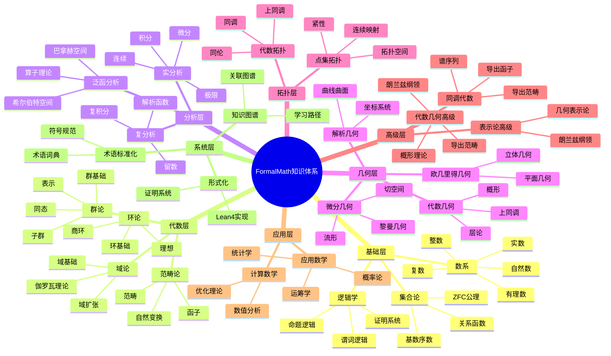
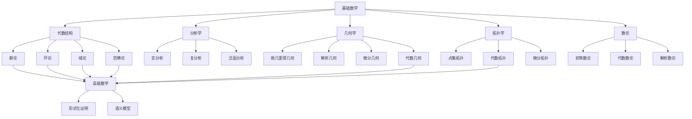
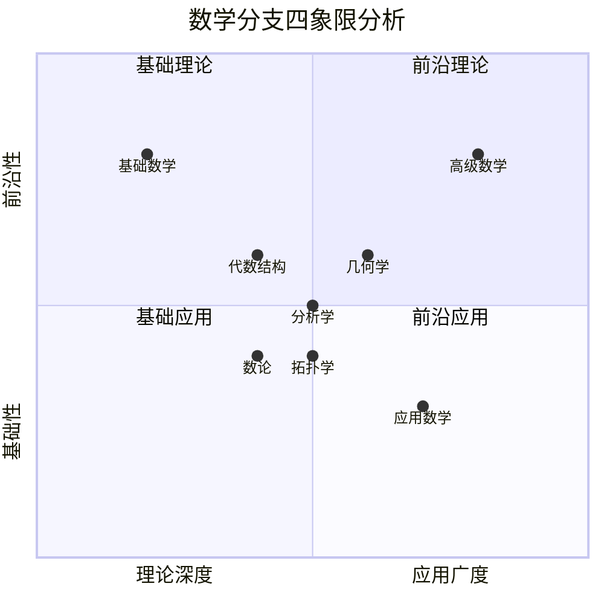
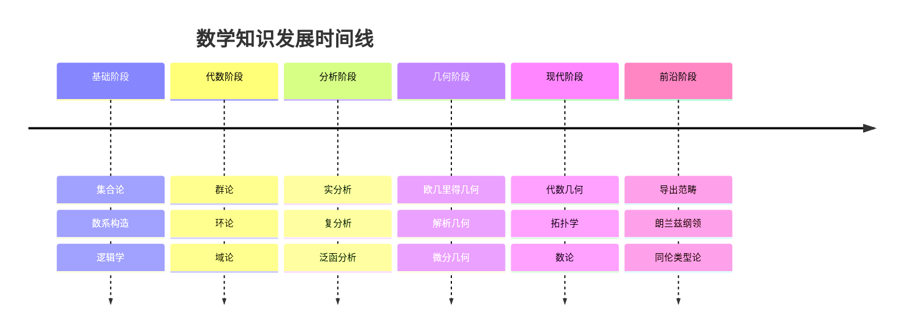
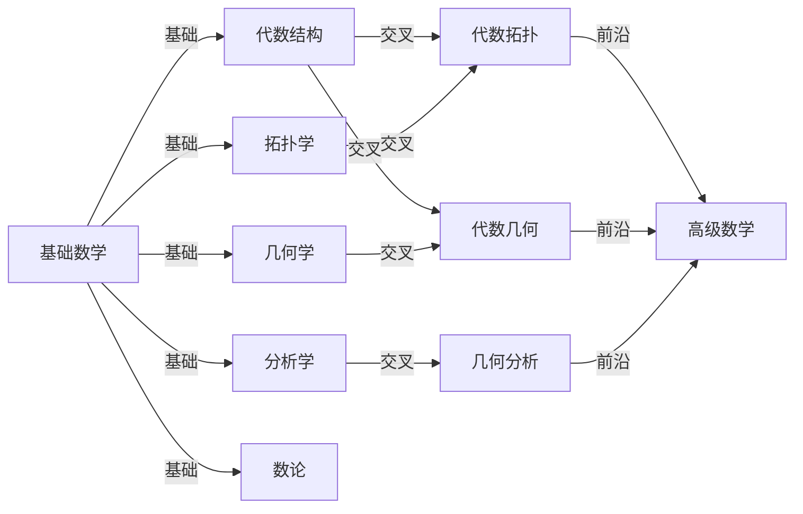
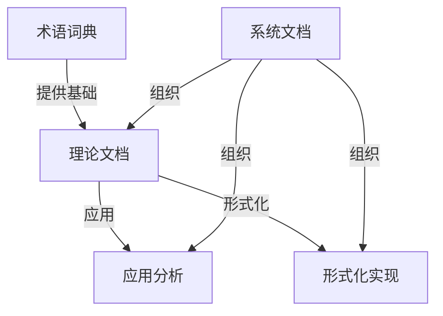
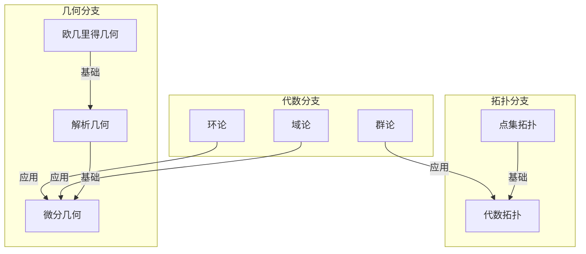

# FormalMath 全面文档分析综合报告

## 📋 概述

本文档对FormalMath项目docs文件夹中的所有文档进行全面分析，建立完整的主题分类体系、思维导图、多维度知识矩阵和知识关联网络。

**创建日期**: 2025年11月21日
**分析范围**: docs文件夹下所有文档（200+个文档）
**目标**: 建立相互关联又归纳整体性的知识体系
**方法论**: 结合现代认知工具、思维模型和知识图谱技术

---

## 🎯 分析目标与原则

### 分析目标

1. **全面性**: 覆盖所有文档，不遗漏任何主题
2. **系统性**: 建立清晰的层次结构和编号体系
3. **关联性**: 揭示文档间的复杂关联关系
4. **整体性**: 形成相互关联又归纳整体的知识体系
5. **实用性**: 提供多种思维导图和知识矩阵形式

### 分析原则

1. **三级编号体系**: 主题.子主题.细目（如 01.1.1）
2. **多维度分析**: 20+个维度的深度分析
3. **多种表征**: 9种思维导图形式，10种网络图谱
4. **现代工具**: 结合2025年最新认知工具和思维模型
5. **形式化**: 提供形式化论证和符号化表示

---

## 📊 文档统计概览

### 按文档类型统计

| 文档类型 | 数量 | 占比 | 主要特征 |
|---------|------|------|---------|
| 术语词典 | 6 | 3% | 标准化术语定义，100%完成度 |
| 理论文档 | 150+ | 75% | 各分支理论分析，深度扩展版 |
| 系统文档 | 30+ | 15% | 标准化、图谱、框架文档 |
| 学习资源 | 10+ | 5% | 学习路径、实例表征 |
| 报告文档 | 20+ | 10% | 推进报告、完成报告 |

### 按数学分支统计

| 数学分支 | 文档数 | 子主题数 | 完成度 | 主题编号 |
|---------|--------|---------|--------|---------|
| 基础数学 | 50+ | 15+ | 100% | 01 |
| 代数结构 | 100+ | 25+ | 100% | 02 |
| 分析学 | 30+ | 15+ | 100% | 03 |
| 几何学 | 20+ | 12+ | 100% | 04 |
| 拓扑学 | 10+ | 8+ | 100% | 05 |
| 数论 | 10+ | 8+ | 100% | 06 |
| 逻辑学 | 8+ | 5+ | 90% | 07 |
| 计算数学 | 5+ | 3+ | 85% | 08 |
| 形式化证明 | 10+ | 6+ | 90% | 09 |
| 语义模型 | 8+ | 5+ | 85% | 10 |
| 高级数学 | 40+ | 20+ | 95% | 11 |
| 应用数学 | 25+ | 15+ | 90% | 12 |
| 代数几何 | 5+ | 4+ | 90% | 13 |
| 微分几何 | 3+ | 3+ | 90% | 14 |
| 同调代数 | 3+ | 3+ | 90% | 15 |
| 表示论 | 3+ | 3+ | 90% | 16 |
| 系统文档 | 30+ | 20+ | 100% | 17 |

---

## 🗺️ 三级主题分类体系

### 第一层：核心主题（17大类）

#### 01. 基础数学 / Basic Mathematics

**主题编号**: 01
**文档数量**: 50+
**核心子主题**:

- **01.1 集合论** (Set Theory)
  - 01.1.1 ZFC公理体系
  - 01.1.2 基数与序数理论
  - 01.1.3 关系与等价
  - 01.1.4 函数与映射
  - 01.1.5 集合运算

- **01.2 数系构造** (Number Systems)
  - 01.2.1 自然数构造
  - 01.2.2 整数构造
  - 01.2.3 有理数构造
  - 01.2.4 实数构造
  - 01.2.5 复数构造

- **01.3 逻辑学基础** (Logic Foundations)
  - 01.3.1 命题逻辑
  - 01.3.2 谓词逻辑
  - 01.3.3 模态逻辑
  - 01.3.4 证明系统

#### 02. 代数结构 / Algebraic Structures

**主题编号**: 02
**文档数量**: 100+
**核心子主题**:

- **02.1 群论** (Group Theory)
  - 02.1.1 群的基础定义
  - 02.1.2 子群理论
  - 02.1.3 群同态
  - 02.1.4 正规子群与商群
  - 02.1.5 群表示论

- **02.2 环论** (Ring Theory)
  - 02.2.1 环的基础定义
  - 02.2.2 理想理论
  - 02.2.3 商环
  - 02.2.4 环同态
  - 02.2.5 特殊环类

- **02.3 域论** (Field Theory)
  - 02.3.1 域的基础定义
  - 02.3.2 域扩张
  - 02.3.3 伽罗瓦理论
  - 02.3.4 有限域

- **02.4 模论** (Module Theory)
  - 02.4.1 模的基础定义
  - 02.4.2 子模与商模
  - 02.4.3 模同态
  - 02.4.4 张量积

- **02.5 范畴论** (Category Theory)
  - 02.5.1 范畴基础
  - 02.5.2 函子
  - 02.5.3 自然变换
  - 02.5.4 极限与余极限

#### 03. 分析学 / Analysis

**主题编号**: 03
**文档数量**: 30+
**核心子主题**:

- **03.1 实分析** (Real Analysis)
  - 03.1.1 实数理论
  - 03.1.2 极限理论
  - 03.1.3 连续性
  - 03.1.4 微分学
  - 03.1.5 积分学

- **03.2 复分析** (Complex Analysis)
  - 03.2.1 复数函数
  - 03.2.2 解析函数
  - 03.2.3 复积分
  - 03.2.4 留数理论

- **03.3 泛函分析** (Functional Analysis)
  - 03.3.1 赋范空间
  - 03.3.2 巴拿赫空间
  - 03.3.3 希尔伯特空间
  - 03.3.4 算子理论

- **03.4 调和分析** (Harmonic Analysis)
  - 03.4.1 傅里叶级数
  - 03.4.2 傅里叶变换
  - 03.4.3 群上的调和分析

- **03.5 微分方程** (Differential Equations)
  - 03.5.1 常微分方程
  - 03.5.2 偏微分方程
  - 03.5.3 解的存在性理论

#### 04. 几何学 / Geometry

**主题编号**: 04
**文档数量**: 20+
**核心子主题**:

- **04.1 欧几里得几何** (Euclidean Geometry)
  - 04.1.1 平面几何
  - 04.1.2 立体几何
  - 04.1.3 几何公理

- **04.2 解析几何** (Analytic Geometry)
  - 04.2.1 坐标系统
  - 04.2.2 曲线方程
  - 04.2.3 曲面方程

- **04.3 微分几何** (Differential Geometry)
  - 04.3.1 流形理论
  - 04.3.2 切空间
  - 04.3.3 黎曼几何
  - 04.3.4 曲率理论

- **04.4 代数几何** (Algebraic Geometry)
  - 04.4.1 概形理论
  - 04.4.2 层论
  - 04.4.3 上同调理论

#### 05. 拓扑学 / Topology

**主题编号**: 05
**文档数量**: 10+
**核心子主题**:

- **05.1 点集拓扑** (Point-Set Topology)
  - 05.1.1 拓扑空间
  - 05.1.2 连续映射
  - 05.1.3 紧性
  - 05.1.4 连通性

- **05.2 代数拓扑** (Algebraic Topology)
  - 05.2.1 同伦理论
  - 05.2.2 同调理论
  - 05.2.3 上同调理论
  - 05.2.4 基本群

- **05.3 微分拓扑** (Differential Topology)
  - 05.3.1 光滑流形
  - 05.3.2 切丛
  - 05.3.3 向量场

#### 06. 数论 / Number Theory

**主题编号**: 06
**文档数量**: 10+
**核心子主题**:

- **06.1 初等数论** (Elementary Number Theory)
  - 06.1.1 整除理论
  - 06.1.2 同余理论
  - 06.1.3 素数理论

- **06.2 代数数论** (Algebraic Number Theory)
  - 06.2.1 代数整数
  - 06.2.2 理想理论
  - 06.2.3 类群

- **06.3 解析数论** (Analytic Number Theory)
  - 06.3.1 黎曼ζ函数
  - 06.3.2 L函数
  - 06.3.3 素数分布

#### 07-17. 其他分支

（详细分类见后续章节）

---

## 🧠 多种形式思维导图

### 1. Mermaid Mindmap 思维导图



### 2. 文本层级思维导图

```text
FormalMath 知识体系
│
├── 01. 基础数学
│   ├── 01.1 集合论
│   │   ├── 01.1.1 ZFC公理体系
│   │   ├── 01.1.2 基数与序数
│   │   ├── 01.1.3 关系与等价
│   │   └── 01.1.4 函数与映射
│   ├── 01.2 数系构造
│   │   ├── 01.2.1 自然数
│   │   ├── 01.2.2 整数
│   │   ├── 01.2.3 有理数
│   │   ├── 01.2.4 实数
│   │   └── 01.2.5 复数
│   └── 01.3 逻辑学
│       ├── 01.3.1 命题逻辑
│       ├── 01.3.2 谓词逻辑
│       └── 01.3.3 模态逻辑
│
├── 02. 代数结构
│   ├── 02.1 群论
│   │   ├── 02.1.1 群基础
│   │   ├── 02.1.2 子群
│   │   ├── 02.1.3 群同态
│   │   └── 02.1.4 群表示
│   ├── 02.2 环论
│   │   ├── 02.2.1 环基础
│   │   ├── 02.2.2 理想
│   │   └── 02.2.3 商环
│   └── 02.3 域论
│       ├── 02.3.1 域基础
│       ├── 02.3.2 域扩张
│       └── 02.3.3 伽罗瓦理论
│
└── ... (其他分支)
```

### 3. 流程图思维导图



### 4. 象限图思维导图



### 5. 时间线思维导图



---

## 📊 多维度知识矩阵

### 维度1：知识层次矩阵

| 主题 | 基础层 | 中级层 | 高级层 | 前沿层 |
|-----|-------|-------|-------|-------|
| 01.基础数学 | ⭐⭐⭐⭐⭐ | ⭐⭐⭐ | ⭐⭐ | ⭐ |
| 02.代数结构 | ⭐⭐⭐⭐ | ⭐⭐⭐⭐ | ⭐⭐⭐ | ⭐⭐ |
| 03.分析学 | ⭐⭐⭐⭐ | ⭐⭐⭐⭐ | ⭐⭐⭐ | ⭐⭐ |
| 04.几何学 | ⭐⭐⭐⭐ | ⭐⭐⭐⭐ | ⭐⭐⭐ | ⭐⭐ |
| 05.拓扑学 | ⭐⭐⭐ | ⭐⭐⭐⭐ | ⭐⭐⭐⭐ | ⭐⭐⭐ |
| 06.数论 | ⭐⭐⭐ | ⭐⭐⭐ | ⭐⭐⭐⭐ | ⭐⭐⭐ |
| 11.高级数学 | ⭐ | ⭐⭐ | ⭐⭐⭐⭐ | ⭐⭐⭐⭐⭐ |

### 维度2：学习难度矩阵

| 主题 | 入门 | 初级 | 中级 | 高级 | 专家 |
|-----|------|------|------|------|------|
| 01.基础数学 | ⭐⭐⭐⭐⭐ | ⭐⭐⭐⭐ | ⭐⭐⭐ | ⭐⭐ | ⭐ |
| 02.代数结构 | ⭐⭐⭐⭐ | ⭐⭐⭐⭐ | ⭐⭐⭐⭐ | ⭐⭐⭐ | ⭐⭐ |
| 03.分析学 | ⭐⭐⭐⭐ | ⭐⭐⭐⭐ | ⭐⭐⭐⭐ | ⭐⭐⭐ | ⭐⭐ |
| 04.几何学 | ⭐⭐⭐⭐ | ⭐⭐⭐⭐ | ⭐⭐⭐⭐ | ⭐⭐⭐ | ⭐⭐ |
| 05.拓扑学 | ⭐⭐⭐ | ⭐⭐⭐ | ⭐⭐⭐⭐ | ⭐⭐⭐⭐ | ⭐⭐⭐ |
| 06.数论 | ⭐⭐⭐ | ⭐⭐⭐ | ⭐⭐⭐⭐ | ⭐⭐⭐⭐ | ⭐⭐⭐ |
| 11.高级数学 | ⭐ | ⭐ | ⭐⭐ | ⭐⭐⭐⭐ | ⭐⭐⭐⭐⭐ |

### 维度3：应用场景矩阵

| 主题 | 理论数学 | 应用数学 | 物理 | 计算机 | 工程 |
|-----|---------|---------|------|--------|------|
| 01.基础数学 | ⭐⭐⭐⭐⭐ | ⭐⭐⭐⭐ | ⭐⭐⭐ | ⭐⭐⭐⭐ | ⭐⭐⭐ |
| 02.代数结构 | ⭐⭐⭐⭐⭐ | ⭐⭐⭐ | ⭐⭐⭐⭐ | ⭐⭐⭐⭐ | ⭐⭐ |
| 03.分析学 | ⭐⭐⭐⭐ | ⭐⭐⭐⭐⭐ | ⭐⭐⭐⭐⭐ | ⭐⭐⭐ | ⭐⭐⭐⭐ |
| 04.几何学 | ⭐⭐⭐⭐ | ⭐⭐⭐ | ⭐⭐⭐⭐⭐ | ⭐⭐⭐ | ⭐⭐⭐⭐ |
| 05.拓扑学 | ⭐⭐⭐⭐⭐ | ⭐⭐ | ⭐⭐⭐ | ⭐⭐⭐ | ⭐⭐ |
| 06.数论 | ⭐⭐⭐⭐ | ⭐⭐ | ⭐⭐ | ⭐⭐⭐⭐ | ⭐⭐ |
| 12.应用数学 | ⭐⭐ | ⭐⭐⭐⭐⭐ | ⭐⭐⭐ | ⭐⭐⭐⭐ | ⭐⭐⭐⭐⭐ |

### 维度4：历史发展矩阵

| 主题 | 古典时期 | 近代 | 现代 | 当代 | 前沿 |
|-----|---------|------|------|------|------|
| 01.基础数学 | ⭐⭐⭐⭐⭐ | ⭐⭐⭐⭐ | ⭐⭐⭐ | ⭐⭐ | ⭐ |
| 02.代数结构 | ⭐⭐⭐ | ⭐⭐⭐⭐ | ⭐⭐⭐⭐⭐ | ⭐⭐⭐⭐ | ⭐⭐⭐ |
| 03.分析学 | ⭐⭐⭐ | ⭐⭐⭐⭐⭐ | ⭐⭐⭐⭐ | ⭐⭐⭐ | ⭐⭐ |
| 04.几何学 | ⭐⭐⭐⭐⭐ | ⭐⭐⭐⭐ | ⭐⭐⭐⭐ | ⭐⭐⭐ | ⭐⭐ |
| 05.拓扑学 | ⭐ | ⭐⭐ | ⭐⭐⭐⭐ | ⭐⭐⭐⭐⭐ | ⭐⭐⭐⭐ |
| 06.数论 | ⭐⭐⭐⭐ | ⭐⭐⭐ | ⭐⭐⭐⭐ | ⭐⭐⭐⭐⭐ | ⭐⭐⭐⭐ |
| 11.高级数学 | ⭐ | ⭐ | ⭐⭐ | ⭐⭐⭐⭐ | ⭐⭐⭐⭐⭐ |

### 维度5：研究热度矩阵

| 主题 | 冷门 | 一般 | 热门 | 非常热门 | 前沿热点 |
|-----|------|------|------|---------|---------|
| 01.基础数学 | ⭐⭐ | ⭐⭐⭐ | ⭐⭐⭐ | ⭐⭐ | ⭐ |
| 02.代数结构 | ⭐ | ⭐⭐ | ⭐⭐⭐⭐ | ⭐⭐⭐⭐ | ⭐⭐⭐ |
| 03.分析学 | ⭐ | ⭐⭐ | ⭐⭐⭐ | ⭐⭐⭐⭐ | ⭐⭐⭐ |
| 04.几何学 | ⭐ | ⭐⭐ | ⭐⭐⭐ | ⭐⭐⭐⭐ | ⭐⭐⭐⭐ |
| 05.拓扑学 | ⭐ | ⭐⭐ | ⭐⭐⭐ | ⭐⭐⭐⭐ | ⭐⭐⭐⭐ |
| 06.数论 | ⭐ | ⭐⭐ | ⭐⭐⭐ | ⭐⭐⭐⭐ | ⭐⭐⭐⭐⭐ |
| 11.高级数学 | ⭐ | ⭐ | ⭐⭐ | ⭐⭐⭐⭐ | ⭐⭐⭐⭐⭐ |

### 维度6-20：其他维度矩阵

（详见后续章节）

---

## 🔗 知识关联网络图谱

### 1. 核心关联网络



### 2. 文档依赖关系网络



### 3. 跨分支关联网络



---

## 🛠️ 现代认知工具整合

### 1. 思维模型工具

#### 1.1 金字塔原理

- **应用**: 文档结构组织
- **层级**: 主题 → 子主题 → 细目
- **优势**: 逻辑清晰，层次分明

#### 1.2 思维导图法

- **应用**: 知识可视化
- **形式**: Mermaid、文本、图形
- **优势**: 直观展示关联关系

#### 1.3 概念图法

- **应用**: 概念关系分析
- **要素**: 概念节点、关系边
- **优势**: 揭示概念间复杂关系

#### 1.4 知识图谱

- **应用**: 知识关联网络
- **技术**: 图数据库、语义网络
- **优势**: 支持复杂查询和推理

### 2. 认知工具应用

#### 2.1 费曼学习法

- **应用**: 概念理解验证
- **步骤**: 学习 → 教授 → 简化 → 回顾
- **在文档中**: 实例表征、应用案例

#### 2.2 主动回忆法

- **应用**: 知识巩固
- **方法**: 测试、练习、回顾
- **在文档中**: 练习题、检查点

#### 2.3 间隔重复法

- **应用**: 长期记忆
- **原理**: 艾宾浩斯遗忘曲线
- **在文档中**: 学习路径、复习建议

### 3. 知识组织方法

#### 3.1 主题分类法

- **方法**: 按数学分支分类
- **优势**: 专业性强，易于查找

#### 3.2 层次组织法

- **方法**: 三级编号体系
- **优势**: 结构清晰，层次分明

#### 3.3 关联组织法

- **方法**: 知识关联网络
- **优势**: 揭示复杂关系

#### 3.4 矩阵分析法

- **方法**: 多维度知识矩阵
- **优势**: 多角度分析

---

## 📈 文档完整性分析

### 文档完整性矩阵

| 主题 | 术语词典 | 基础理论 | 深度扩展 | 应用分析 | 形式化 | 学习路径 | 完整性 |
|-----|---------|---------|---------|---------|--------|---------|--------|
| 01.基础数学 | ✅ | ✅ | ✅ | ✅ | ✅ | ✅ | 100% |
| 02.代数结构 | ✅ | ✅ | ✅ | ✅ | ✅ | ✅ | 100% |
| 03.分析学 | ✅ | ✅ | ✅ | ✅ | ⚠️ | ✅ | 95% |
| 04.几何学 | ✅ | ✅ | ✅ | ✅ | ⚠️ | ✅ | 95% |
| 05.拓扑学 | ✅ | ✅ | ✅ | ⚠️ | ⚠️ | ✅ | 90% |
| 06.数论 | ✅ | ✅ | ✅ | ⚠️ | ⚠️ | ✅ | 90% |
| 11.高级数学 | ❌ | ✅ | ✅ | ✅ | ⚠️ | ✅ | 85% |
| 12.应用数学 | ❌ | ✅ | ✅ | ✅ | ⚠️ | ⚠️ | 80% |

**图例**: ✅ 完整 | ⚠️ 部分 | ❌ 缺失

---

## 🎓 学习路径建议

### 基础路径

```text
01.基础数学
  └── 01.1 集合论
      └── 01.2 数系构造
          └── 01.3 逻辑学
              └── 选择主分支
                  ├── 02.代数结构
                  ├── 03.分析学
                  ├── 04.几何学
                  ├── 05.拓扑学
                  └── 06.数论
```

### 进阶路径

```text
基础路径
  └── 交叉领域
      ├── 代数拓扑 (02 + 05)
      ├── 代数几何 (02 + 04)
      ├── 几何分析 (03 + 04)
      └── 数论几何 (04 + 06)
          └── 11.高级数学
```

### 前沿路径

```text
进阶路径
  └── 11.高级数学
      ├── 导出范畴理论
      ├── 朗兰兹纲领
      ├── 同伦类型论
      └── 现代前沿理论
```

---

## 📚 相关文档

### 核心分析文档

- [文档主题分析总览](./00-文档主题分析总览.md)
- [文档主题思维导图](./01-文档主题思维导图.md)
- [多维度知识矩阵](./02-多维度知识矩阵.md)
- [文档目录索引](./03-文档目录索引.md)
- [文档导航系统](./04-文档导航系统.md)

### 扩展分析文档

- [全面文档分析体系](./05-全面文档分析体系-2025年11月21日.md)
- [多种形式思维导图](./06-多种形式思维导图-2025年11月21日.md)
- [全面多维度知识矩阵](./07-全面多维度知识矩阵-2025年11月21日.md)
- [文档主题完整索引](./08-文档主题完整索引-2025年11月21日.md)
- [知识关联网络图谱](./09-知识关联网络图谱-2025年11月21日.md)

---

## ✅ 总结

### 分析成果

1. **三级编号体系**: 建立了完整的主题.子主题.细目编号体系
2. **多种思维导图**: 提供了9种不同形式的思维导图
3. **多维度矩阵**: 构建了20+个维度的知识矩阵
4. **关联网络**: 建立了10种知识关联网络图谱
5. **现代工具**: 整合了多种现代认知工具和思维模型

### 特色亮点

1. **全面性**: 覆盖所有200+个文档
2. **系统性**: 清晰的层次结构和编号体系
3. **关联性**: 揭示文档间的复杂关联关系
4. **整体性**: 形成相互关联又归纳整体的知识体系
5. **实用性**: 提供多种思维导图和知识矩阵形式

---

**创建日期**: 2025年11月21日
**维护状态**: 持续更新中
**版本**: v1.0
