# FormalMath 增强版思维导图集合

**主题编号**: C.06.12
**创建日期**: 2025年11月21日
**最后更新**: 2025年11月21日

---

## 📋 概述

本文档提供FormalMath项目的多种形式思维导图，结合2025年最新的认知工具和思维模型，以多种方式展示数学知识体系的结构和关联关系。

**创建日期**: 2025年11月21日
**思维导图类型**: 9种不同形式
**目标**: 提供多角度、多维度的知识可视化

---

## 🧠 思维导图类型总览

### 1. Mermaid Mindmap 思维导图

### 2. 文本层级思维导图

### 3. 流程图思维导图

### 4. 象限图思维导图

### 5. 时间线思维导图

### 6. 网络图思维导图

### 7. 矩阵图思维导图

### 8. 树状图思维导图

### 9. 概念图思维导图

---

## 1. Mermaid Mindmap 思维导图

### 1.1 完整知识体系思维导图

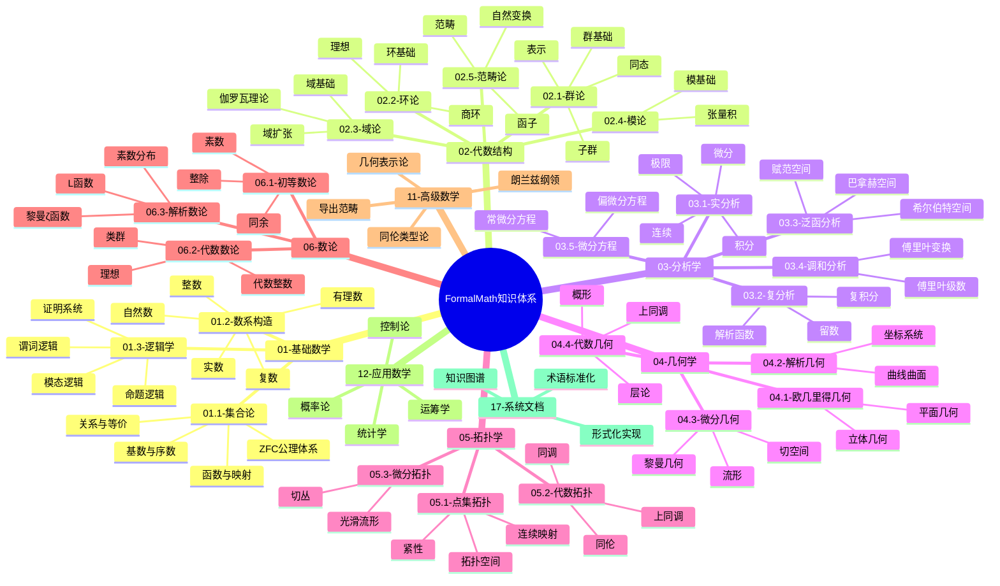

### 1.2 跨分支关联思维导图

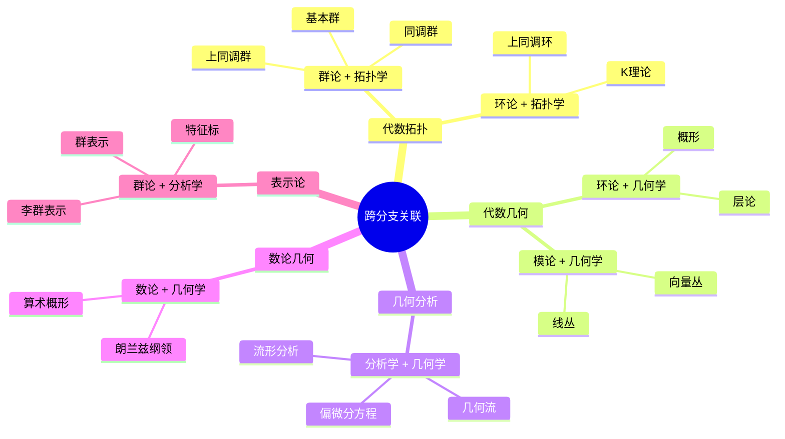

---

## 2. 文本层级思维导图

### 2.1 完整层级结构

```text
FormalMath 知识体系
│
├── 01. 基础数学
│   ├── 01.1 集合论
│   │   ├── 01.1.1 ZFC公理体系
│   │   ├── 01.1.2 基数与序数
│   │   ├── 01.1.3 关系与等价
│   │   ├── 01.1.4 函数与映射
│   │   └── 01.1.5 集合运算
│   ├── 01.2 数系构造
│   │   ├── 01.2.1 自然数
│   │   ├── 01.2.2 整数
│   │   ├── 01.2.3 有理数
│   │   ├── 01.2.4 实数
│   │   └── 01.2.5 复数
│   └── 01.3 逻辑学
│       ├── 01.3.1 命题逻辑
│       ├── 01.3.2 谓词逻辑
│       └── 01.3.3 模态逻辑
│
├── 02. 代数结构
│   ├── 02.1 群论
│   │   ├── 02.1.1 群基础
│   │   ├── 02.1.2 子群
│   │   ├── 02.1.3 群同态
│   │   ├── 02.1.4 正规子群与商群
│   │   └── 02.1.5 群表示
│   ├── 02.2 环论
│   │   ├── 02.2.1 环基础
│   │   ├── 02.2.2 理想
│   │   ├── 02.2.3 商环
│   │   ├── 02.2.4 环同态
│   │   └── 02.2.5 特殊环类
│   ├── 02.3 域论
│   │   ├── 02.3.1 域基础
│   │   ├── 02.3.2 域扩张
│   │   ├── 02.3.3 伽罗瓦理论
│   │   └── 02.3.4 有限域
│   ├── 02.4 模论
│   │   ├── 02.4.1 模基础
│   │   ├── 02.4.2 子模与商模
│   │   ├── 02.4.3 模同态
│   │   └── 02.4.4 张量积
│   └── 02.5 范畴论
│       ├── 02.5.1 范畴基础
│       ├── 02.5.2 函子
│       ├── 02.5.3 自然变换
│       └── 02.5.4 极限与余极限
│
├── 03. 分析学
│   ├── 03.1 实分析
│   │   ├── 03.1.1 实数理论
│   │   ├── 03.1.2 极限理论
│   │   ├── 03.1.3 连续性
│   │   ├── 03.1.4 微分学
│   │   └── 03.1.5 积分学
│   ├── 03.2 复分析
│   │   ├── 03.2.1 复数函数
│   │   ├── 03.2.2 解析函数
│   │   ├── 03.2.3 复积分
│   │   └── 03.2.4 留数理论
│   ├── 03.3 泛函分析
│   │   ├── 03.3.1 赋范空间
│   │   ├── 03.3.2 巴拿赫空间
│   │   ├── 03.3.3 希尔伯特空间
│   │   └── 03.3.4 算子理论
│   ├── 03.4 调和分析
│   │   ├── 03.4.1 傅里叶级数
│   │   ├── 03.4.2 傅里叶变换
│   │   └── 03.4.3 群上的调和分析
│   └── 03.5 微分方程
│       ├── 03.5.1 常微分方程
│       ├── 03.5.2 偏微分方程
│       └── 03.5.3 解的存在性理论
│
└── ... (其他分支)
```

### 2.2 学习路径层级

```text
学习路径层级
│
├── 基础阶段
│   ├── 01.基础数学
│   │   └── 01.1 集合论
│   │       └── 01.1.1 ZFC公理体系
│   └── 01.2 数系构造
│
├── 中级阶段
│   ├── 选择主分支
│   │   ├── 02.代数结构
│   │   ├── 03.分析学
│   │   ├── 04.几何学
│   │   ├── 05.拓扑学
│   │   └── 06.数论
│   └── 深入学习
│
├── 高级阶段
│   ├── 交叉领域
│   │   ├── 代数拓扑
│   │   ├── 代数几何
│   │   └── 几何分析
│   └── 11.高级数学
│
└── 前沿阶段
    ├── 导出范畴
    ├── 朗兰兹纲领
    └── 同伦类型论
```

---

## 3. 流程图思维导图

### 3.1 知识演进流程图

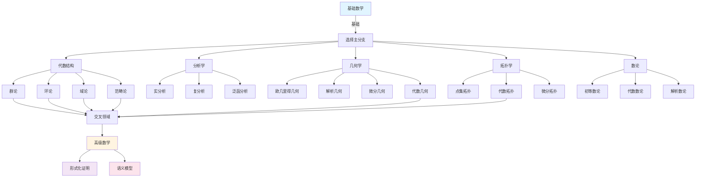

### 3.2 文档依赖流程图

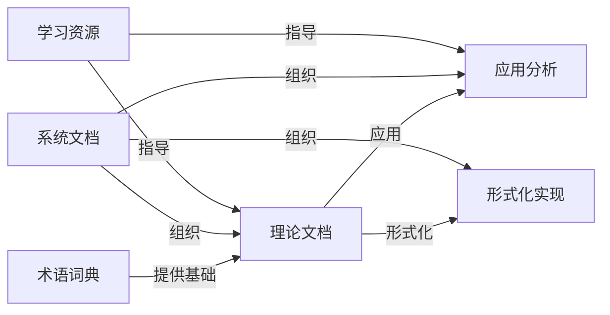

---

## 4. 象限图思维导图

### 4.1 数学分支四象限分析

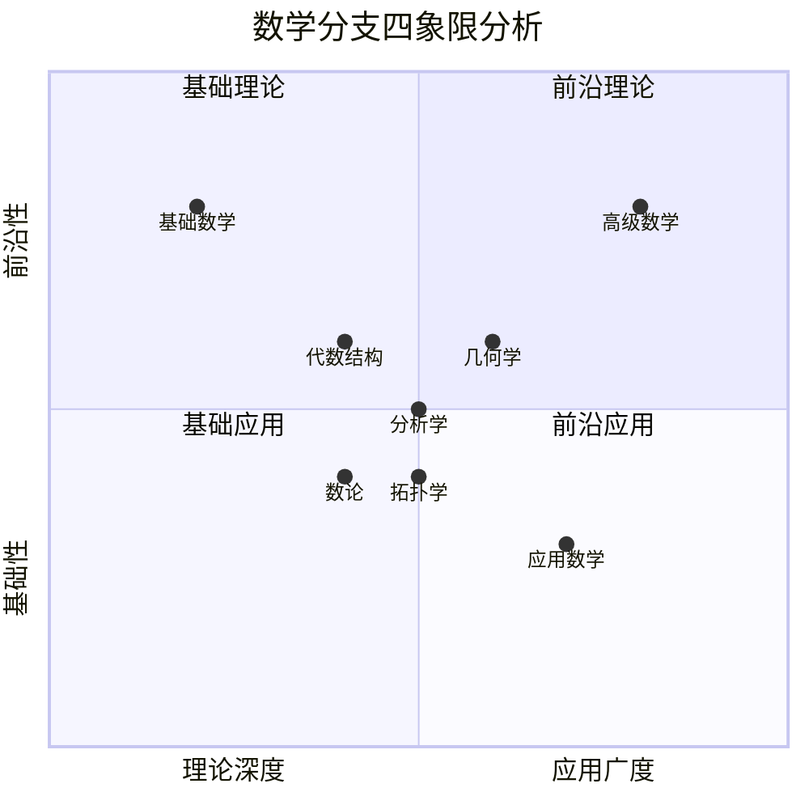

### 4.2 学习难度与重要性象限

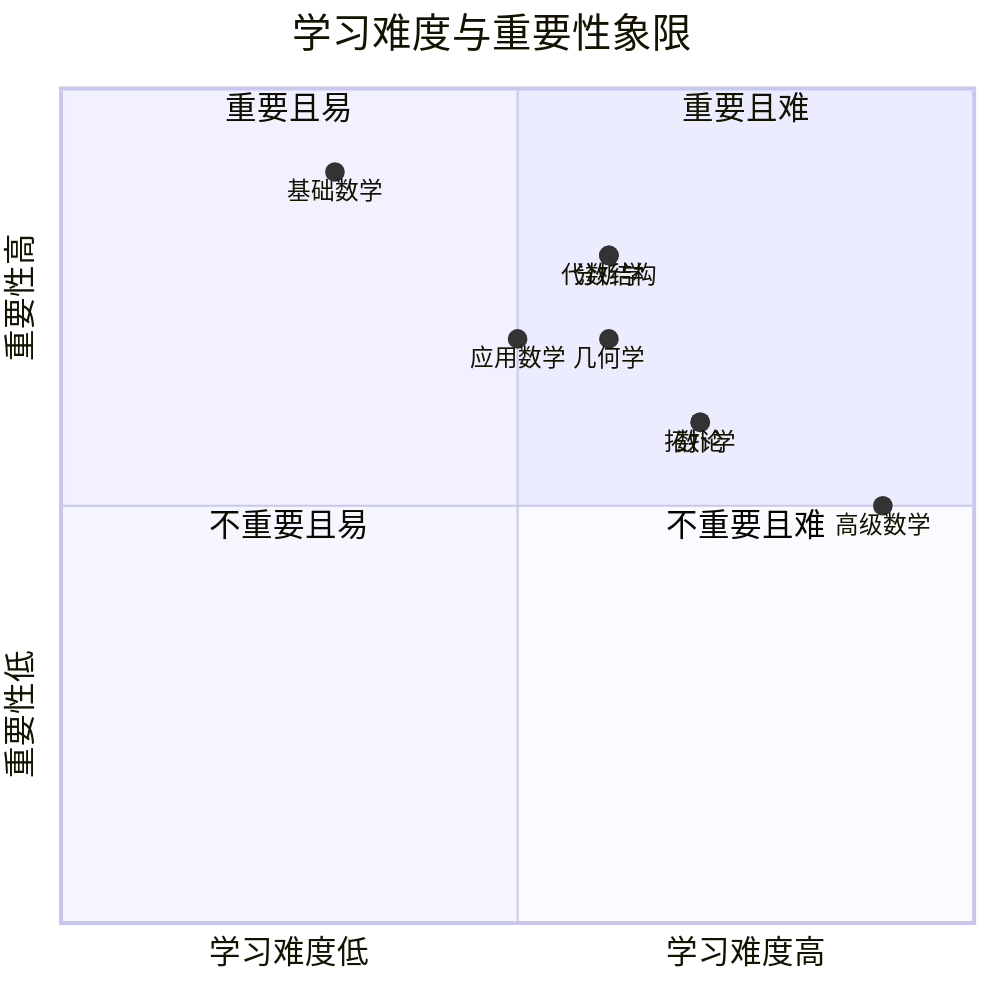

---

## 5. 时间线思维导图

### 5.1 数学知识发展时间线

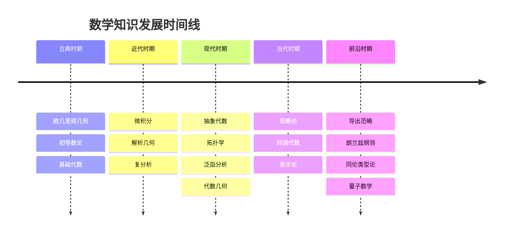

### 5.2 文档创建时间线

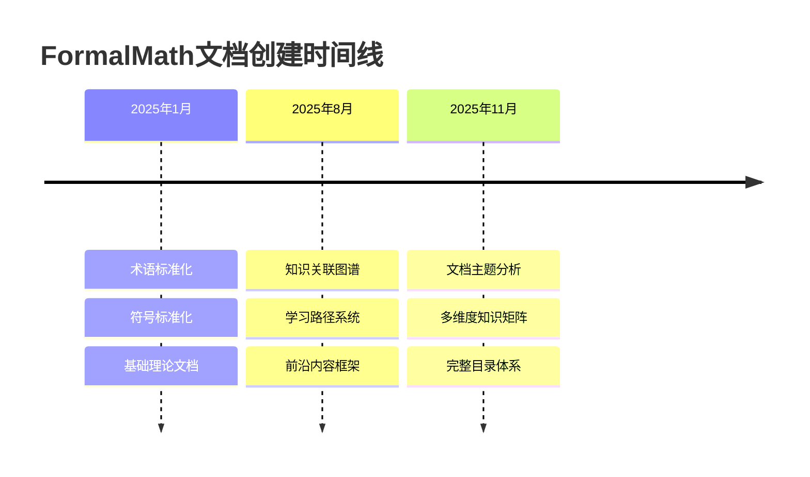

---

## 6. 网络图思维导图

### 6.1 核心概念网络图

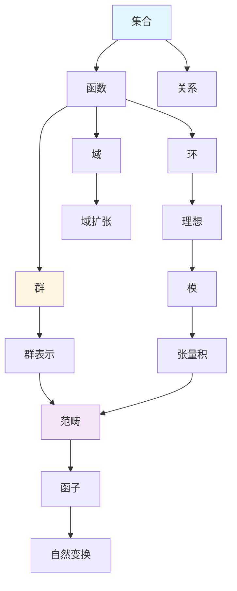

### 6.2 跨分支关联网络图

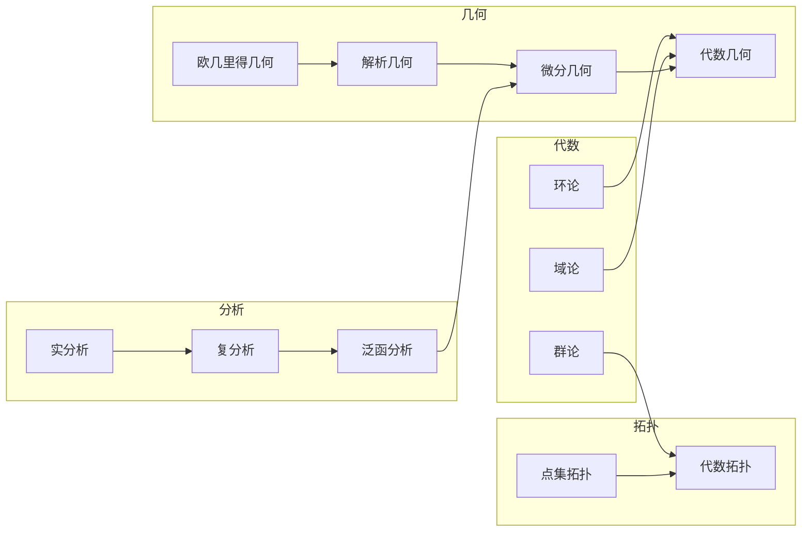

---

## 7. 矩阵图思维导图

### 7.1 主题-子主题矩阵

| 主题 | 子主题1 | 子主题2 | 子主题3 | 子主题4 | 子主题5 |
|-----|--------|--------|--------|--------|--------|
| 01.基础数学 | 01.1集合论 | 01.2数系 | 01.3逻辑 | - | - |
| 02.代数结构 | 02.1群论 | 02.2环论 | 02.3域论 | 02.4模论 | 02.5范畴论 |
| 03.分析学 | 03.1实分析 | 03.2复分析 | 03.3泛函分析 | 03.4调和分析 | 03.5微分方程 |
| 04.几何学 | 04.1欧几里得 | 04.2解析 | 04.3微分 | 04.4代数 | - |
| 05.拓扑学 | 05.1点集 | 05.2代数 | 05.3微分 | - | - |
| 06.数论 | 06.1初等 | 06.2代数 | 06.3解析 | - | - |

### 7.2 知识层次矩阵

| 主题 | 基础层 | 中级层 | 高级层 | 前沿层 |
|-----|-------|-------|-------|-------|
| 01.基础数学 | ⭐⭐⭐⭐⭐ | ⭐⭐⭐ | ⭐⭐ | ⭐ |
| 02.代数结构 | ⭐⭐⭐⭐ | ⭐⭐⭐⭐ | ⭐⭐⭐ | ⭐⭐ |
| 03.分析学 | ⭐⭐⭐⭐ | ⭐⭐⭐⭐ | ⭐⭐⭐ | ⭐⭐ |
| 04.几何学 | ⭐⭐⭐⭐ | ⭐⭐⭐⭐ | ⭐⭐⭐ | ⭐⭐ |
| 05.拓扑学 | ⭐⭐⭐ | ⭐⭐⭐⭐ | ⭐⭐⭐⭐ | ⭐⭐⭐ |
| 06.数论 | ⭐⭐⭐ | ⭐⭐⭐ | ⭐⭐⭐⭐ | ⭐⭐⭐ |
| 11.高级数学 | ⭐ | ⭐⭐ | ⭐⭐⭐⭐ | ⭐⭐⭐⭐⭐ |

---

## 8. 树状图思维导图

### 8.1 知识树结构

```text
FormalMath知识树
│
├─ 基础层
│  ├─ 01.基础数学
│  │  ├─ 01.1 集合论
│  │  ├─ 01.2 数系构造
│  │  └─ 01.3 逻辑学
│  └─ 系统文档
│     ├─ 术语词典
│     └─ 符号规范
│
├─ 核心层
│  ├─ 02.代数结构
│  │  ├─ 02.1 群论
│  │  ├─ 02.2 环论
│  │  ├─ 02.3 域论
│  │  ├─ 02.4 模论
│  │  └─ 02.5 范畴论
│  ├─ 03.分析学
│  │  ├─ 03.1 实分析
│  │  ├─ 03.2 复分析
│  │  ├─ 03.3 泛函分析
│  │  ├─ 03.4 调和分析
│  │  └─ 03.5 微分方程
│  ├─ 04.几何学
│  │  ├─ 04.1 欧几里得几何
│  │  ├─ 04.2 解析几何
│  │  ├─ 04.3 微分几何
│  │  └─ 04.4 代数几何
│  ├─ 05.拓扑学
│  │  ├─ 05.1 点集拓扑
│  │  ├─ 05.2 代数拓扑
│  │  └─ 05.3 微分拓扑
│  └─ 06.数论
│     ├─ 06.1 初等数论
│     ├─ 06.2 代数数论
│     └─ 06.3 解析数论
│
└─ 高级层
   ├─ 11.高级数学
   │  ├─ 导出范畴
   │  ├─ 朗兰兹纲领
   │  └─ 同伦类型论
   ├─ 12.应用数学
   │  ├─ 概率论
   │  ├─ 统计学
   │  └─ 运筹学
   └─ 交叉领域
      ├─ 代数拓扑
      ├─ 代数几何
      └─ 几何分析
```

---

## 9. 概念图思维导图

### 9.1 核心概念关系图

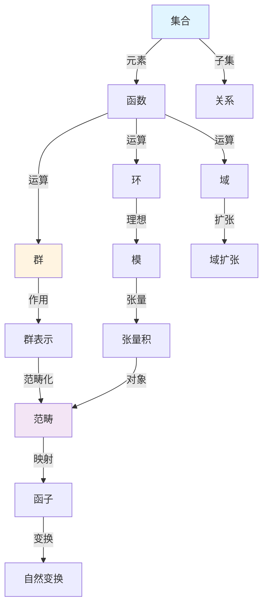

---

## 🛠️ 思维导图应用指南

### 使用场景

1. **快速概览**: 使用Mermaid Mindmap或文本层级图
2. **学习路径**: 使用流程图或时间线图
3. **关联分析**: 使用网络图或概念图
4. **分类分析**: 使用象限图或矩阵图
5. **层次分析**: 使用树状图

### 选择建议

- **初学者**: 文本层级图、流程图
- **中级学习者**: Mermaid Mindmap、网络图
- **高级学习者**: 概念图、矩阵图
- **研究者**: 网络图、象限图

---

## 📚 相关文档

- [全面文档分析综合报告](./10-全面文档分析综合报告-2025年11月21日.md)
- [多种形式思维导图](./06-多种形式思维导图-2025年11月21日.md)
- [知识关联网络图谱](./09-知识关联网络图谱-2025年11月21日.md)

---

**创建日期**: 2025年11月21日
**维护状态**: 持续更新中
**版本**: v1.0
