# FormalMath增强知识关联网络图谱

**创建日期**: 2025年11月21日
**目标**: 构建全面的知识关联网络,展示文档间、概念间、分支间的复杂关联关系

---

## 📋 目录

- [FormalMath增强知识关联网络图谱](#formalmath增强知识关联网络图谱)
  - [📋 目录](#-目录)
  - [1. 网络图谱概述](#1-网络图谱概述)
    - [1.1 网络类型](#11-网络类型)
    - [1.2 关联类型](#12-关联类型)
    - [1.3 网络属性](#13-网络属性)
  - [2. 核心概念关联网络](#2-核心概念关联网络)
    - [2.1 基础概念网络](#21-基础概念网络)
    - [2.2 代数结构概念网络](#22-代数结构概念网络)
    - [2.3 分析学概念网络](#23-分析学概念网络)
    - [2.4 几何拓扑概念网络](#24-几何拓扑概念网络)
  - [3. 文档关联网络](#3-文档关联网络)
    - [3.1 术语词典关联网络](#31-术语词典关联网络)
    - [3.2 学科理论文档关联网络](#32-学科理论文档关联网络)
    - [3.3 系统文档关联网络](#33-系统文档关联网络)
  - [4. 分支关联网络](#4-分支关联网络)
    - [4.1 核心分支关联](#41-核心分支关联)
    - [4.2 交叉领域网络](#42-交叉领域网络)
    - [4.3 高级数学关联网络](#43-高级数学关联网络)
  - [5. 学习路径网络](#5-学习路径网络)
    - [5.1 基础学习路径网络](#51-基础学习路径网络)
    - [5.2 进阶学习路径网络](#52-进阶学习路径网络)
    - [5.3 高级学习路径网络](#53-高级学习路径网络)
  - [6. 应用场景网络](#6-应用场景网络)
    - [6.1 理论应用网络](#61-理论应用网络)
    - [6.2 计算应用网络](#62-计算应用网络)
    - [6.3 实际应用网络](#63-实际应用网络)
  - [7. 形式化关联网络](#7-形式化关联网络)
    - [7.1 形式化实现网络](#71-形式化实现网络)
    - [7.2 形式化工具网络](#72-形式化工具网络)
  - [8. 认知工具网络](#8-认知工具网络)
    - [8.1 工具应用网络](#81-工具应用网络)
    - [8.2 工具组合网络](#82-工具组合网络)
  - [9. 网络分析工具](#9-网络分析工具)
    - [9.1 网络指标](#91-网络指标)
    - [9.2 网络分析应用](#92-网络分析应用)
  - [10. 网络可视化](#10-网络可视化)
    - [10.1 可视化工具](#101-可视化工具)
    - [10.2 可视化类型](#102-可视化类型)
    - [10.3 交互式可视化](#103-交互式可视化)
  - [📊 网络应用指南](#-网络应用指南)
    - [使用场景](#使用场景)
    - [网络更新](#网络更新)

---

## 1. 网络图谱概述

### 1.1 网络类型

1. **概念关联网络**: 数学概念之间的关联关系
2. **文档关联网络**: 文档之间的引用和关联关系
3. **分支关联网络**: 数学分支之间的交叉关系
4. **学习路径网络**: 学习路径的依赖关系
5. **应用场景网络**: 应用场景的关联关系

### 1.2 关联类型

- **强关联**: 直接依赖、包含关系
- **中等关联**: 间接依赖、交叉应用
- **弱关联**: 概念相似、方法相关

### 1.3 网络属性

- **节点**: 概念、文档、分支、主题
- **边**: 关联关系、依赖关系、应用关系
- **权重**: 关联强度、依赖程度、应用频率

---

## 2. 核心概念关联网络

### 2.1 基础概念网络

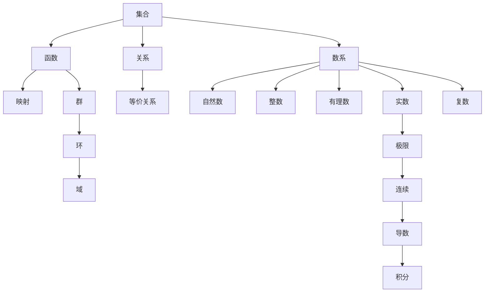
```mermaid
graph TD
    A[集合] --> B[函数]
    A --> C[关系]
    B --> D[映射]
    C --> E[等价关系]
    A --> F[数系]
    F --> G[自然数]
    F --> H[整数]
    F --> I[有理数]
    F --> J[实数]
    F --> K[复数]
    B --> L[群]
    L --> M[环]
    M --> N[域]
    J --> O[极限]
    O --> P[连续]
    P --> Q[导数]
    Q --> R[积分]
```

### 2.2 代数结构概念网络

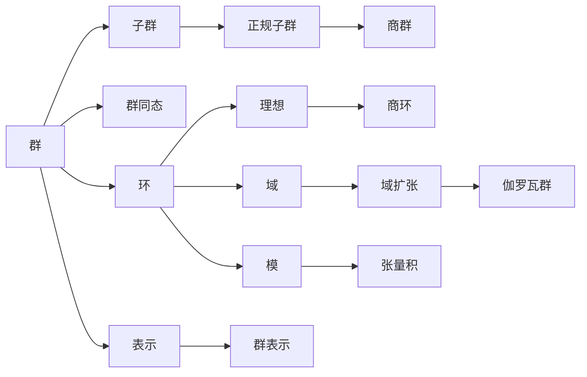
```mermaid
graph LR
    A[群] --> B[子群]
    A --> C[群同态]
    B --> D[正规子群]
    D --> E[商群]
    A --> F[环]
    F --> G[理想]
    G --> H[商环]
    F --> I[域]
    I --> J[域扩张]
    J --> K[伽罗瓦群]
    F --> L[模]
    L --> M[张量积]
    A --> N[表示]
    N --> O[群表示]
```

### 2.3 分析学概念网络

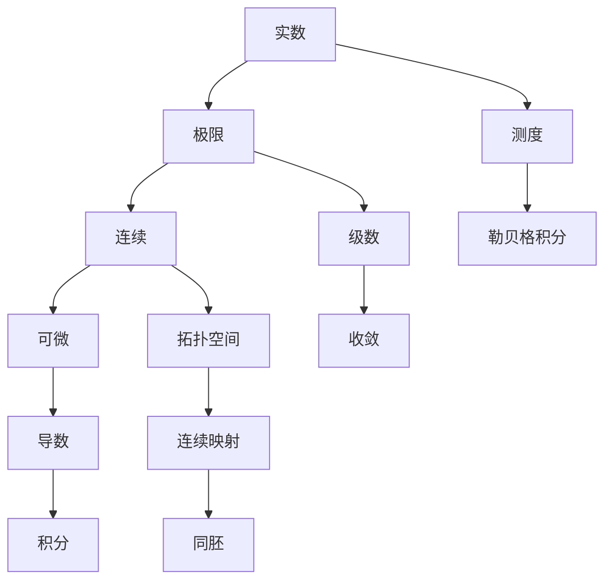
```mermaid
graph TD
    A[实数] --> B[极限]
    B --> C[连续]
    C --> D[可微]
    D --> E[导数]
    E --> F[积分]
    B --> G[级数]
    G --> H[收敛]
    A --> I[测度]
    I --> J[勒贝格积分]
    C --> K[拓扑空间]
    K --> L[连续映射]
    L --> M[同胚]
```

### 2.4 几何拓扑概念网络

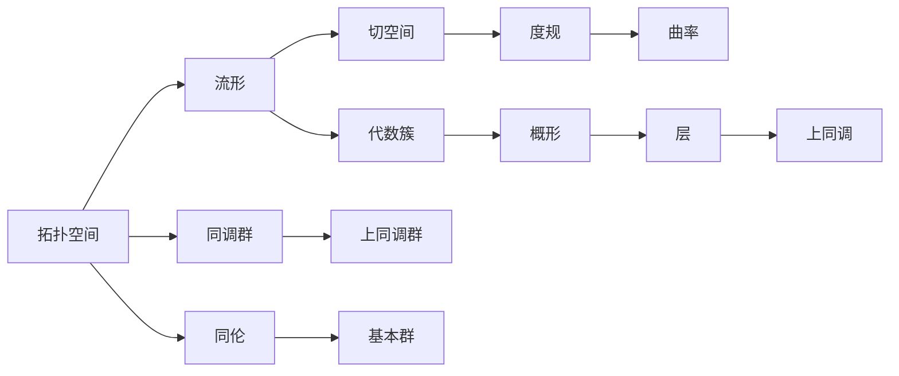
```mermaid
graph LR
    A[拓扑空间] --> B[流形]
    B --> C[切空间]
    C --> D[度规]
    D --> E[曲率]
    A --> F[同调群]
    F --> G[上同调群]
    A --> H[同伦]
    H --> I[基本群]
    B --> J[代数簇]
    J --> K[概形]
    K --> L[层]
    L --> M[上同调]
```

---

## 3. 文档关联网络

### 3.1 术语词典关联网络

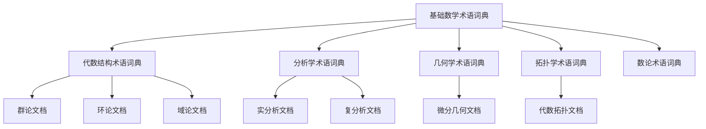
```mermaid
graph TD
    A[基础数学术语词典] --> B[代数结构术语词典]
    A --> C[分析学术语词典]
    A --> D[几何学术语词典]
    A --> E[拓扑学术语词典]
    A --> F[数论术语词典]
    B --> G[群论文档]
    B --> H[环论文档]
    B --> I[域论文档]
    C --> J[实分析文档]
    C --> K[复分析文档]
    D --> L[微分几何文档]
    E --> M[代数拓扑文档]
```

### 3.2 学科理论文档关联网络

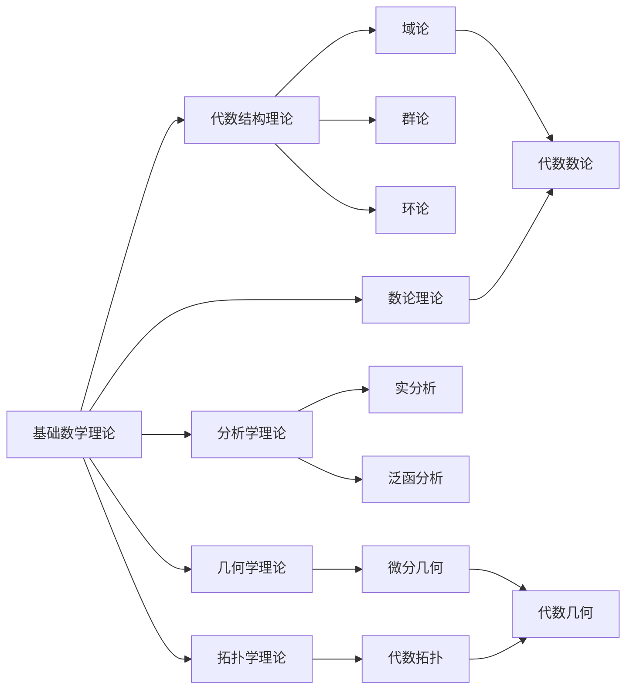
```mermaid
graph LR
    A[基础数学理论] --> B[代数结构理论]
    A --> C[分析学理论]
    A --> D[几何学理论]
    A --> E[拓扑学理论]
    A --> F[数论理论]
    B --> G[群论]
    B --> H[环论]
    B --> I[域论]
    C --> J[实分析]
    C --> K[泛函分析]
    D --> L[微分几何]
    E --> M[代数拓扑]
    L --> N[代数几何]
    M --> N
    I --> O[代数数论]
    F --> O
```

### 3.3 系统文档关联网络

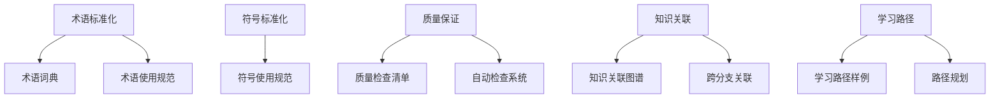
```mermaid
graph TD
    A[术语标准化] --> B[术语词典]
    A --> C[术语使用规范]
    D[符号标准化] --> E[符号使用规范]
    F[质量保证] --> G[质量检查清单]
    F --> H[自动检查系统]
    I[知识关联] --> J[知识关联图谱]
    I --> K[跨分支关联]
    L[学习路径] --> M[学习路径样例]
    L --> N[路径规划]
```

---

## 4. 分支关联网络

### 4.1 核心分支关联

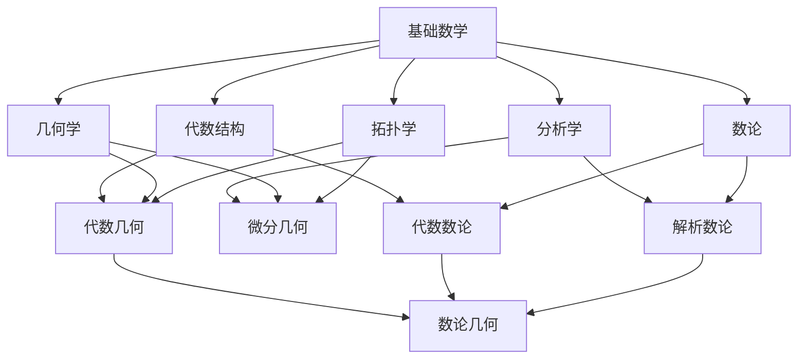
```mermaid
graph TD
    A[基础数学] --> B[代数结构]
    A --> C[分析学]
    A --> D[几何学]
    A --> E[拓扑学]
    A --> F[数论]
    B --> G[代数几何]
    C --> H[微分几何]
    D --> G
    D --> H
    E --> G
    E --> H
    B --> I[代数数论]
    F --> I
    C --> J[解析数论]
    F --> J
    G --> K[数论几何]
    I --> K
    J --> K
```

### 4.2 交叉领域网络

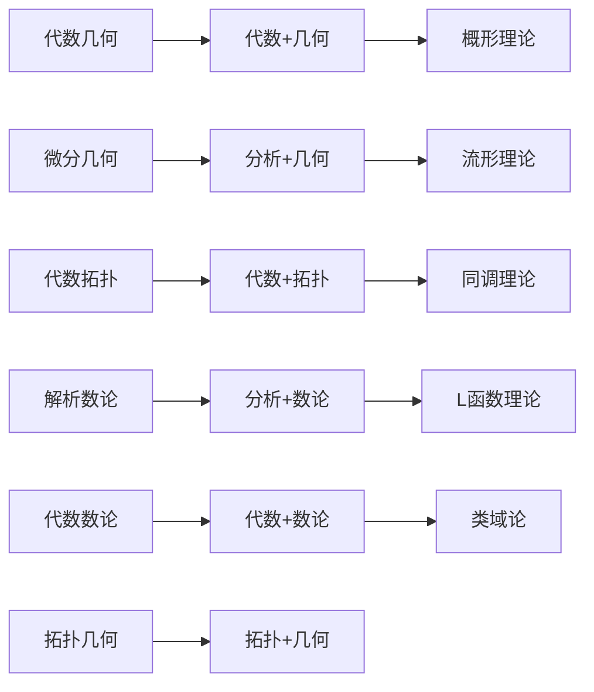
```mermaid
graph LR
    A[代数几何] --> B[代数+几何]
    C[微分几何] --> D[分析+几何]
    E[代数拓扑] --> F[代数+拓扑]
    G[解析数论] --> H[分析+数论]
    I[代数数论] --> J[代数+数论]
    K[拓扑几何] --> L[拓扑+几何]
    B --> M[概形理论]
    D --> N[流形理论]
    F --> O[同调理论]
    H --> P[L函数理论]
    J --> Q[类域论]
```

### 4.3 高级数学关联网络

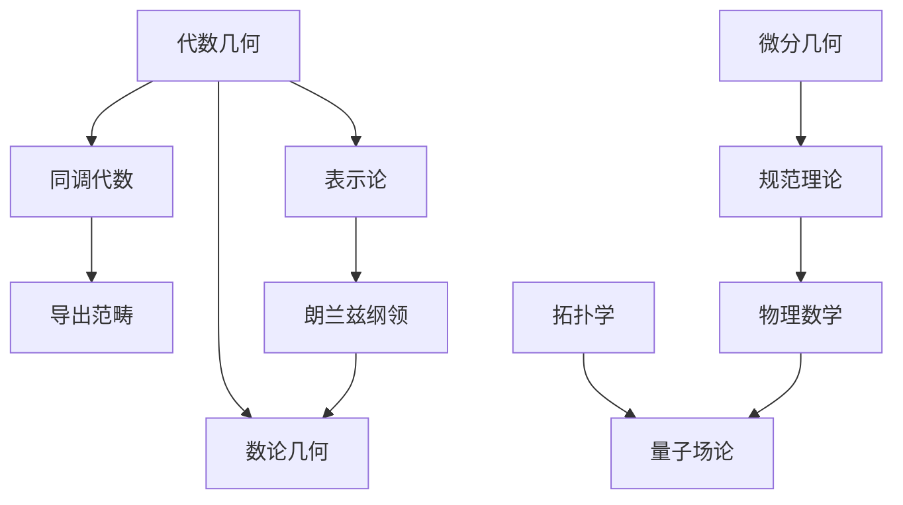
```mermaid
graph TD
    A[代数几何] --> B[同调代数]
    A --> C[表示论]
    B --> D[导出范畴]
    C --> E[朗兰兹纲领]
    A --> F[数论几何]
    E --> F
    G[微分几何] --> H[规范理论]
    H --> I[物理数学]
    J[拓扑学] --> K[量子场论]
    I --> K
```

---

## 5. 学习路径网络

### 5.1 基础学习路径网络

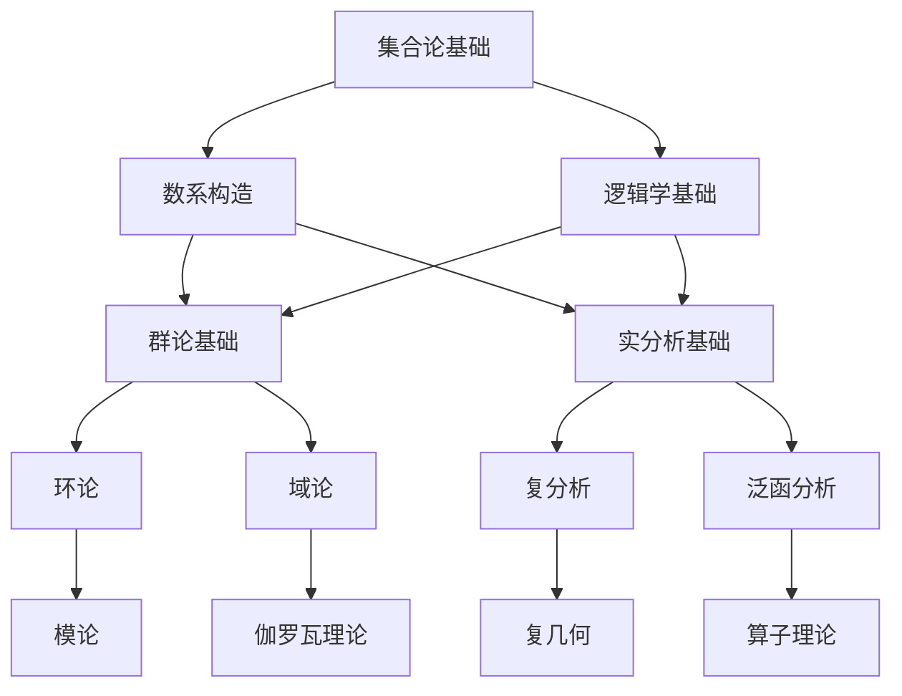
```mermaid
graph TD
    A[集合论基础] --> B[数系构造]
    A --> C[逻辑学基础]
    B --> D[群论基础]
    B --> E[实分析基础]
    C --> D
    C --> E
    D --> F[环论]
    D --> G[域论]
    E --> H[复分析]
    E --> I[泛函分析]
    F --> J[模论]
    G --> K[伽罗瓦理论]
    H --> L[复几何]
    I --> M[算子理论]
```

### 5.2 进阶学习路径网络

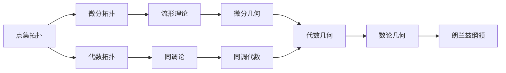
```mermaid
graph LR
    A[点集拓扑] --> B[代数拓扑]
    A --> C[微分拓扑]
    B --> D[同调论]
    C --> E[流形理论]
    E --> F[微分几何]
    D --> G[同调代数]
    F --> H[代数几何]
    G --> H
    H --> I[数论几何]
    I --> J[朗兰兹纲领]
```

### 5.3 高级学习路径网络

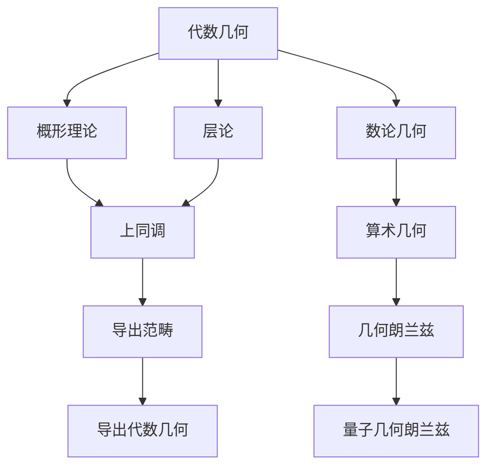
```mermaid
graph TD
    A[代数几何] --> B[概形理论]
    A --> C[层论]
    B --> D[上同调]
    C --> D
    D --> E[导出范畴]
    E --> F[导出代数几何]
    A --> G[数论几何]
    G --> H[算术几何]
    H --> I[几何朗兰兹]
    I --> J[量子几何朗兰兹]
```

---

## 6. 应用场景网络

### 6.1 理论应用网络

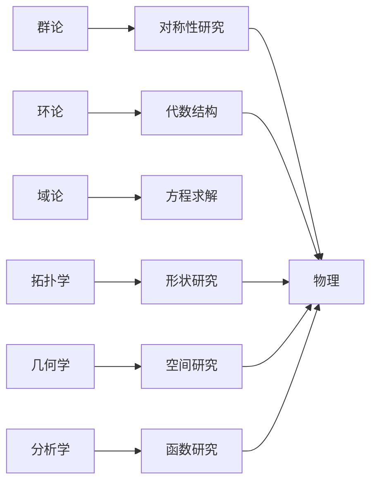
```mermaid
graph LR
    A[群论] --> B[对称性研究]
    C[环论] --> D[代数结构]
    E[域论] --> F[方程求解]
    G[拓扑学] --> H[形状研究]
    I[几何学] --> J[空间研究]
    K[分析学] --> L[函数研究]
    B --> M[物理]
    D --> M
    H --> M
    J --> M
    L --> M
```

### 6.2 计算应用网络

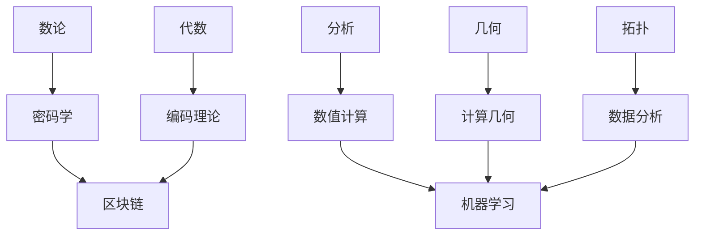
```mermaid
graph TD
    A[数论] --> B[密码学]
    C[代数] --> D[编码理论]
    E[分析] --> F[数值计算]
    G[几何] --> H[计算几何]
    I[拓扑] --> J[数据分析]
    B --> K[区块链]
    D --> K
    F --> L[机器学习]
    H --> L
    J --> L
```

### 6.3 实际应用网络

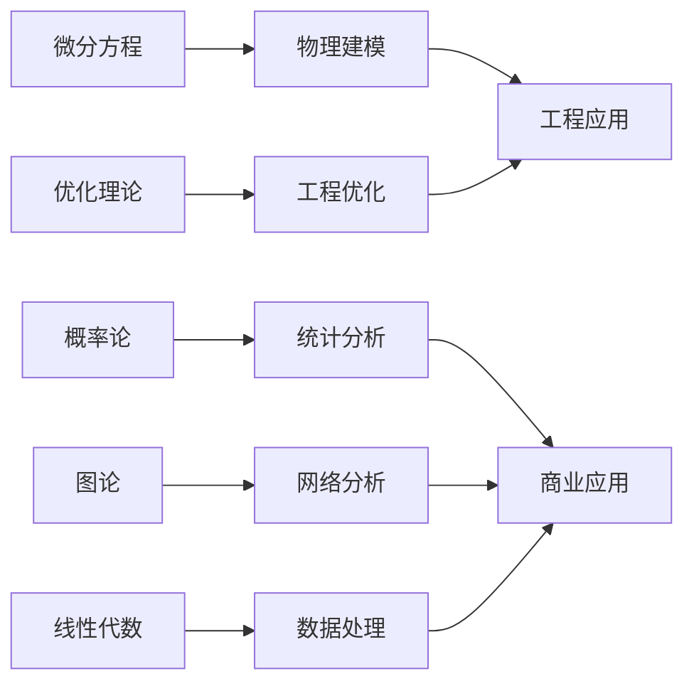
```mermaid
graph LR
    A[微分方程] --> B[物理建模]
    C[优化理论] --> D[工程优化]
    E[概率论] --> F[统计分析]
    G[图论] --> H[网络分析]
    I[线性代数] --> J[数据处理]
    B --> K[工程应用]
    D --> K
    F --> L[商业应用]
    H --> L
    J --> L
```

---

## 7. 形式化关联网络

### 7.1 形式化实现网络

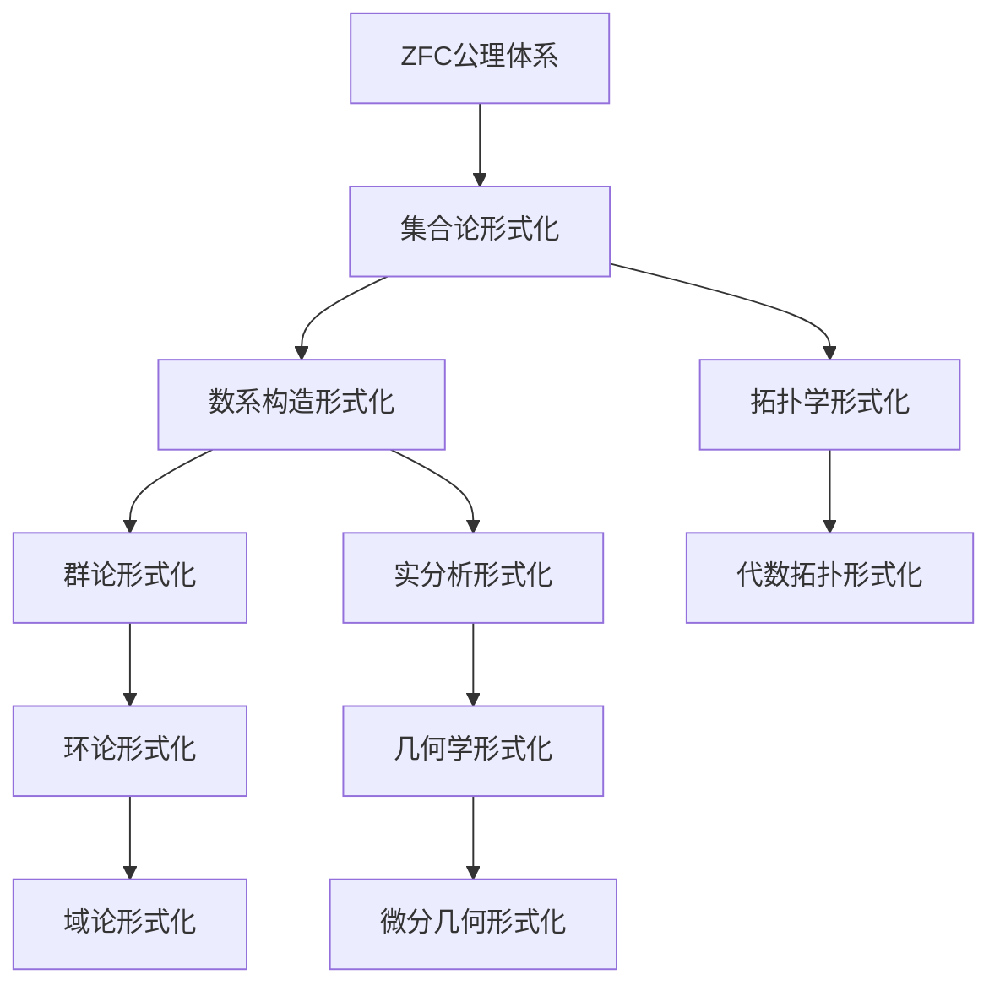
```mermaid
graph TD
    A[ZFC公理体系] --> B[集合论形式化]
    B --> C[数系构造形式化]
    C --> D[群论形式化]
    C --> E[实分析形式化]
    B --> F[拓扑学形式化]
    D --> G[环论形式化]
    E --> H[几何学形式化]
    F --> I[代数拓扑形式化]
    G --> J[域论形式化]
    H --> K[微分几何形式化]
```

### 7.2 形式化工具网络

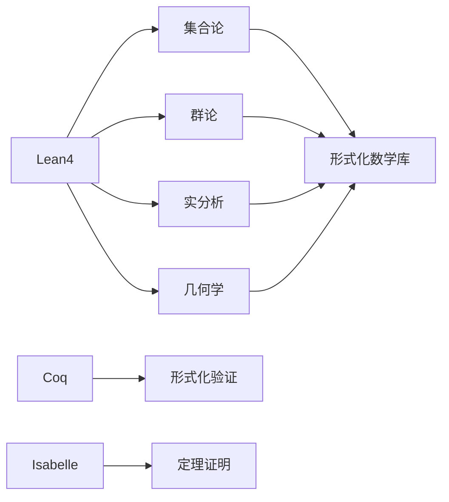
```mermaid
graph LR
    A[Lean4] --> B[集合论]
    A --> C[群论]
    A --> D[实分析]
    A --> E[几何学]
    F[Coq] --> G[形式化验证]
    H[Isabelle] --> I[定理证明]
    B --> J[形式化数学库]
    C --> J
    D --> J
    E --> J
```

---

## 8. 认知工具网络

### 8.1 工具应用网络

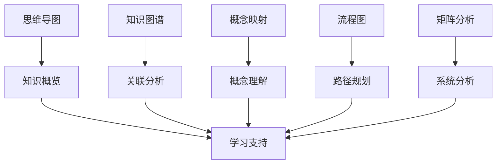
```mermaid
graph TD
    A[思维导图] --> B[知识概览]
    C[知识图谱] --> D[关联分析]
    E[概念映射] --> F[概念理解]
    G[流程图] --> H[路径规划]
    I[矩阵分析] --> J[系统分析]
    B --> K[学习支持]
    D --> K
    F --> K
    H --> K
    J --> K
```

### 8.2 工具组合网络

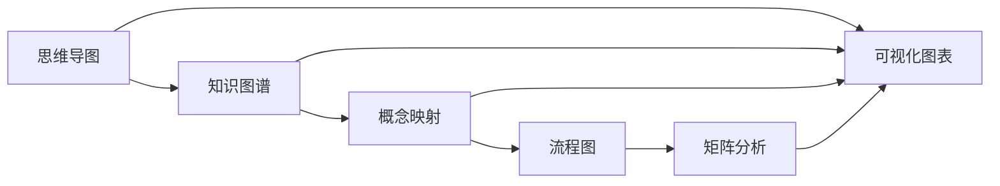
```mermaid
graph LR
    A[思维导图] --> B[知识图谱]
    B --> C[概念映射]
    C --> D[流程图]
    D --> E[矩阵分析]
    A --> F[可视化图表]
    B --> F
    C --> F
    E --> F
```

---

## 9. 网络分析工具

### 9.1 网络指标

| 指标 | 说明 | 应用 |
|------|------|------|
| 度中心性 | 节点的连接数 | 识别核心概念 |
| 介数中心性 | 节点在路径中的重要性 | 识别关键节点 |
| 接近中心性 | 节点到其他节点的平均距离 | 识别中心节点 |
| 聚类系数 | 节点的邻居之间的连接密度 | 识别紧密关联 |
| 路径长度 | 节点间的最短路径 | 分析关联强度 |

### 9.2 网络分析应用

1. **核心概念识别**: 使用度中心性识别核心概念
2. **关键路径分析**: 使用介数中心性识别关键路径
3. **社区发现**: 使用聚类系数发现概念社区
4. **关联强度分析**: 使用路径长度分析关联强度

---

## 10. 网络可视化

### 10.1 可视化工具

1. **Mermaid**: 用于文档中的网络图
2. **Graphviz**: 用于复杂网络可视化
3. **D3.js**: 用于交互式网络可视化
4. **Gephi**: 用于网络分析和可视化

### 10.2 可视化类型

- **节点链接图**: 展示节点和边的连接关系
- **力导向图**: 展示节点的空间分布
- **层次图**: 展示层次结构
- **矩阵图**: 展示关联矩阵

### 10.3 交互式可视化

- **节点筛选**: 按类型、属性筛选节点
- **边筛选**: 按关联类型、强度筛选边
- **路径高亮**: 高亮特定路径
- **动态布局**: 动态调整布局

---

## 📊 网络应用指南

### 使用场景

1. **知识发现**: 通过关联网络发现新的知识关联
2. **学习规划**: 通过路径网络规划学习路径
3. **研究指导**: 通过交叉网络发现研究方向
4. **系统理解**: 通过整体网络理解知识体系

### 网络更新

- **更新频率**: 每月更新一次
- **更新内容**: 新增关联、更新权重、优化布局
- **版本管理**: 使用日期版本号(YYYY-MM-DD)

---

**文档版本**: v1.0
**最后更新**: 2025年11月21日
**维护状态**: 持续更新中
