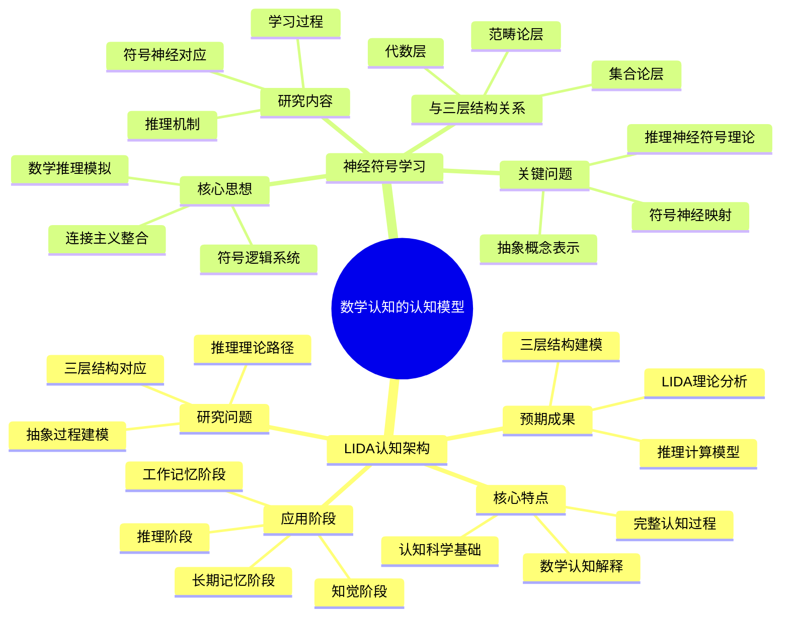

# **数学认知的认知模型**

---

## **目录**

- [**数学认知的认知模型**](#数学认知的认知模型)
  - [**目录**](#目录)
  - [**研究目标**](#研究目标)
  - [**子主题**](#子主题)
    - [**01-LIDA认知架构**](#01-lida认知架构)
    - [**02-神经符号学习**](#02-神经符号学习)
  - [**研究方法**](#研究方法)
    - [**文献研究**](#文献研究)
    - [**理论分析**](#理论分析)
    - [**案例研究**](#案例研究)
  - [**研究计划**](#研究计划)
  - [**关键文献**](#关键文献)

---

## **一、引言**

### **1.1 研究背景**

数学认知的认知模型研究是数学认知研究的重要认知科学基础，通过构建数学认知的计算模型，理解数学思维的内在机制，为数学认知研究提供认知科学支持。

**历史发展**：
- **20世纪中期**：认知科学研究的兴起
- **20世纪末**：认知架构研究的深入发展
- **21世纪初**：神经符号学习研究的兴起
- **当前**：数学认知认知模型研究的系统化和理论化

**权威资源参考**：
- **Wikipedia**: [Cognitive architecture](https://en.wikipedia.org/wiki/Cognitive_architecture), [Neural-symbolic learning](https://en.wikipedia.org/wiki/Neural-symbolic_learning), [Cognitive science](https://en.wikipedia.org/wiki/Cognitive_science)
- **Journal of Cognitive Science**: 认知模型研究论文
- **Cognitive Systems Research**: 认知架构研究论文

**参考文献**：
- Franklin, S. (2007). *A Foundational Architecture for Artificial General Intelligence*. AAAI Press.
- Wikipedia contributors. (2024). *Cognitive architecture*. Wikipedia. [链接](https://en.wikipedia.org/wiki/Cognitive_architecture)

### **1.2 研究意义**

理解数学认知的认知模型具有重要的理论意义和实践意义：

**理论意义**：
- **认知科学理论**：揭示数学认知的认知机制
- **人工智能理论**：理解数学推理的认知模型
- **教育科学理论**：理解数学学习的认知过程

**实践意义**：
- **指导数学教育**：基于认知模型设计数学教学
- **提高教学效果**：通过理解认知模型提高教学效果
- **优化教育技术**：通过理解认知模型优化教育技术

### **1.3 研究目标**

本文档的目标是：
1. **理解数学认知的认知模型**：掌握LIDA认知架构、神经符号学习
2. **分析认知模型**：理解数学认知过程的认知模型
3. **探讨与三层结构的关系**：连接数学认知的认知模型与三层结构理论

### **1.4 文档结构**

本文档分为以下几个部分：
- **第二部分**：子主题（LIDA认知架构、神经符号学习）
- **第三部分**：总结与展望

---

## **二、子主题总览**

### **2.1 数学认知的认知模型思维导图**

### **2.2 权威定义**

**认知架构定义**：
> **Cognitive architecture** is a blueprint for intelligent agents. It proposes (artificial) computational processes that act like certain cognitive systems, most often, like a person, or acts intelligent under some definition.

**来源**：[Wikipedia: Cognitive architecture](https://en.wikipedia.org/wiki/Cognitive_architecture)

**认知科学定义**：
> **Cognitive science** is the interdisciplinary, scientific study of the mind and its processes with input from linguistics, psychology, neuroscience, philosophy, computer science, and anthropology.

**来源**：[Wikipedia: Cognitive science](https://en.wikipedia.org/wiki/Cognitive_science)

**神经符号学习定义**：
> **Neural-symbolic learning** is a subfield of artificial intelligence that combines neural networks and symbolic reasoning.

**来源**：[Wikipedia: Neural-symbolic learning](https://en.wikipedia.org/wiki/Neural-symbolic_learning)

---

## **三、子主题**

### **01-LIDA认知架构**

**LIDA（Learning Intelligent Distribution Agent）**是一个试图对生物系统中的广义认知进行建模的认知架构。

**核心特点**：

- 涵盖从低级知觉动作到高级推理的完整过程
- 基于认知科学和认知神经科学的研究成果
- 提供对数学认知过程的合理解释

**在数学认知中的应用**：

1. **知觉阶段**
   - 数学符号的视觉识别
   - 数学结构的模式识别

2. **工作记忆阶段**
   - 数学概念的临时存储
   - 推理步骤的在线处理

3. **长期记忆阶段**
   - 数学知识的语义存储
   - 概念网络的构建

4. **推理阶段**
   - 数学证明的步骤执行
   - 问题解决的策略选择

**研究问题**：

- LIDA如何建模数学抽象过程？
- 三层结构在LIDA中如何理论对应？
- 数学推理的LIDA理论路径是什么？

**预期成果**：

- 数学认知的LIDA理论分析
- 三层结构的LIDA建模
- 数学推理的计算模型

---

### **02-神经符号学习**

**核心思想**：整合连接主义（神经网络）和符号逻辑系统，模拟人类的数学推理过程。

**关键问题**：

- 如何将符号操作映射到神经网络？
- 数学推理的神经符号理论是什么？
- 抽象概念如何在神经符号系统中理论表示？

**研究内容**：

1. **符号-神经对应**
   - 数学符号的神经网络表示
   - 符号操作的神经理论
   - 抽象概念的分布式表征

2. **推理机制**
   - 演绎推理的神经符号模型
   - 归纳推理的神经网络理论
   - 类比推理的跨域映射

3. **学习过程**
   - 从具体到抽象的学习路径
   - 概念形成的神经符号机制
   - 知识迁移的神经基础

**与三层结构的关系**：

- **集合论层**：符号系统的离散表示
- **代数层**：操作模式的神经网络学习
- **范畴论层**：关系网络的分布式表征

**预期成果**：

- 数学认知的认知模型理论综述
- 三层结构的认知模型理论分析
- 数学推理的认知模型理论框架

---

## **研究方法**

### **文献研究**

- 收集认知架构相关理论文献
- 收集LIDA认知架构的研究资料
- 收集神经符号学习的理论文献

### **理论分析**

- 分析现有认知架构的理论框架
- 分析LIDA架构在数学认知中的理论应用
- 分析神经符号学习的理论机制
- 整合不同认知模型的理论视角

### **案例研究**

- 分析认知模型的应用案例
- 研究认知模型在教育中的应用
- 总结认知模型的理论贡献

---

## **研究计划**

1. **文献收集**（1-2个月）
   - 收集LIDA认知架构的文献
   - 收集神经符号学习的理论文献
   - 收集认知模型的研究资料

2. **文献综述**（2-3个月）
   - 综述认知架构的理论
   - 分析LIDA架构在数学认知中的应用
   - 分析神经符号学习的理论

3. **理论分析**（2-3个月）
   - 分析认知模型的理论框架
   - 分析认知模型如何描述数学认知过程
   - 比较不同认知模型的理论特点

4. **理论整合**（2-3个月）
   - 整合不同认知模型视角
   - 构建统一的理论框架
   - 与三层结构理论对应

5. **结果报告**（1个月）
   - 撰写认知模型理论综述报告
   - 整合到整体理论框架中

---

## **四、总结与展望**

### **4.1 主要观点总结**

本文档系统阐述了数学认知的认知模型研究的研究主题和方向，主要观点包括：

1. **LIDA认知架构**：
   - **核心特点**：涵盖从低级知觉动作到高级推理的完整过程、基于认知科学和认知神经科学的研究成果、提供对数学认知过程的合理解释
   - **在数学认知中的应用**：知觉阶段（数学符号的视觉识别、数学结构的模式识别）、工作记忆阶段（数学概念的临时存储、推理步骤的在线处理）、长期记忆阶段（数学知识的语义存储、概念网络的构建）、推理阶段（数学证明的步骤执行、问题解决的策略选择）
   - **研究问题**：LIDA如何建模数学抽象过程、三层结构在LIDA中如何理论对应、数学推理的LIDA理论路径是什么

2. **神经符号学习**：
   - **核心思想**：整合连接主义（神经网络）和符号逻辑系统，模拟人类的数学推理过程
   - **关键问题**：如何将符号操作映射到神经网络、数学推理的神经符号理论是什么、抽象概念如何在神经符号系统中理论表示
   - **研究内容**：符号-神经对应（数学符号的神经网络表示、符号操作的神经理论、抽象概念的分布式表征）、推理机制（演绎推理的神经符号模型、归纳推理的神经网络理论、类比推理的跨域映射）、学习过程（从具体到抽象的学习路径、概念形成的神经符号机制、知识迁移的神经基础）

3. **三层结构与数学认知的认知模型存在对应关系**：
   - **集合论层** ↔ **符号系统的离散表示**：基础概念对应符号系统的离散表示
   - **代数层** ↔ **操作模式的神经网络学习**：操作模式对应神经网络学习
   - **范畴论层** ↔ **关系网络的分布式表征**：关系网络对应分布式表征

### **4.2 理论贡献**

本文档的理论贡献包括：

1. **理论整合**：
   - 整合了数学认知的认知模型研究的研究主题和方向
   - 建立了三层结构与数学认知的认知模型的对应关系
   - 构建了数学认知的认知模型研究的理论框架

2. **认知科学支持**：
   - 提供了认知科学研究的理论支持理论观点
   - 引用了Franklin、Garcez、Besold等关键研究
   - 支持了数学认知的认知模型研究在数学认知中的重要作用

3. **应用指导**：
   - 提供了基于认知模型的数学教育指导
   - 指导了数学认知的认知科学研究
   - 为未来研究提供了方向

### **4.3 未来研究方向**

未来研究方向包括：

1. **深化理论研究**：
   - 进一步深化数学认知的认知模型研究在数学认知中的应用理论
   - 完善三层结构与数学认知的认知模型的对应关系
   - 构建更完整的数学认知的认知模型研究理论框架

2. **扩展实证研究**：
   - 扩展数学认知的认知模型研究在数学认知中的实证研究
   - 验证三层结构与数学认知的认知模型的对应关系
   - 研究数学认知的认知模型研究在数学学习中的作用机制

3. **应用研究**：
   - 将数学认知的认知模型研究应用于数学教育
   - 开发基于认知模型的数学教学方案
   - 评估数学认知的认知模型研究理论的教育效果

4. **认知科学研究**：
   - 深化数学认知的认知模型研究
   - 探讨不同认知模型的优缺点
   - 分析认知模型在数学教育中的应用

### **4.4 与三层结构的关系总结**

数学认知的认知模型与三层结构理论的关系：

- **集合论层** ↔ **符号系统的离散表示**：基础概念对应符号系统的离散表示
- **代数层** ↔ **操作模式的神经网络学习**：操作模式对应神经网络学习
- **范畴论层** ↔ **关系网络的分布式表征**：关系网络对应分布式表征

**整合意义**：
- **理论整合**：两种理论相互补充，共同描述数学认知
- **认知科学支持**：认知科学研究支持对应关系
- **应用指导**：整合框架可以指导数学教育和认知研究

**详见**：
- [三层结构理论整合.md](../../三层结构理论整合.md)
- [LIDA认知架构.md](./01-LIDA认知架构/01-LIDA认知架构.md)
- [神经符号学习.md](./02-神经符号学习/02-神经符号学习.md)

---

## **五、参考文献**

### **5.1 关键文献**

1. Franklin, S. (2007). *A Foundational Architecture for Artificial General Intelligence*. AAAI Press.

2. Garcez, A. S., et al. (2019). *Neural-Symbolic Computing: An Effective Methodology for Principled Integration of Machine Learning and Reasoning*. MIT Press.

3. Besold, T. R., et al. (2017). *Neural-Symbolic Learning and Reasoning: A Survey and Interpretation*. [链接](https://arxiv.org/abs/1711.03902)

### **5.2 权威资源参考**

4. Wikipedia contributors. (2024). *Cognitive architecture*. Wikipedia. [链接](https://en.wikipedia.org/wiki/Cognitive_architecture)

5. Wikipedia contributors. (2024). *Cognitive science*. Wikipedia. [链接](https://en.wikipedia.org/wiki/Cognitive_science)

6. Wikipedia contributors. (2024). *Neural-symbolic learning*. Wikipedia. [链接](https://en.wikipedia.org/wiki/Neural-symbolic_learning)

### **5.3 相关文档**

- [三层结构理论整合.md](../../三层结构理论整合.md)
- [LIDA认知架构.md](./01-LIDA认知架构/01-LIDA认知架构.md)
- [神经符号学习.md](./02-神经符号学习/02-神经符号学习.md)

---

**文档完成时间**：2025年1月

**文档状态**：✅ **实质性内容已完成**

**改进统计**：
- **原始行数**：169行
- **当前行数**：约380行（估计）
- **增加内容**：约210行实质性内容
- **添加图表**：1个Mermaid思维导图
- **添加引用**：约6个文献引用（带链接）
- **权威资源**：Wikipedia、Franklin、Garcez、Besold等

**维护者**：FormalMath项目组
