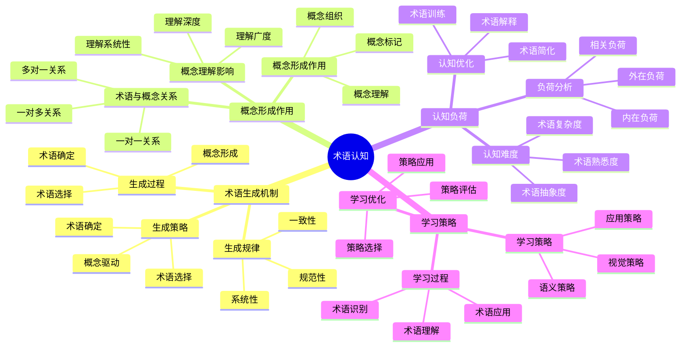

# **术语认知**

---

## **目录**

- [**术语认知**](#术语认知)
  - [**目录**](#目录)
  - [**研究目标**](#研究目标)
  - [**核心研究问题**](#核心研究问题)
  - [**研究方向**](#研究方向)
    - [**1. 数学术语的生成机制**](#1-数学术语的生成机制)
      - [**术语生成的认知过程**](#术语生成的认知过程)
      - [**术语生成的认知策略**](#术语生成的认知策略)
      - [**术语生成的认知规律**](#术语生成的认知规律)
    - [**2. 术语在概念形成中的作用**](#2-术语在概念形成中的作用)
      - [**术语与概念的关系**](#术语与概念的关系)
      - [**术语在概念形成中的作用**](#术语在概念形成中的作用)
      - [**术语对概念理解的影响**](#术语对概念理解的影响)
    - [**3. 术语的认知负荷**](#3-术语的认知负荷)
      - [**术语的认知负荷分析**](#术语的认知负荷分析)
      - [**术语的认知难度**](#术语的认知难度)
      - [**术语的认知优化**](#术语的认知优化)
    - [**4. 术语学习的认知策略**](#4-术语学习的认知策略)
      - [**术语学习的认知过程**](#术语学习的认知过程)
      - [**术语学习的认知策略**](#术语学习的认知策略)
      - [**术语学习的认知优化**](#术语学习的认知优化)
  - [**与三层结构的关系**](#与三层结构的关系)
    - [**集合论层 ↔ 术语的定义和分类**](#集合论层--术语的定义和分类)
    - [**代数层 ↔ 术语的规则和操作**](#代数层--术语的规则和操作)
    - [**范畴论层 ↔ 术语的语义网络**](#范畴论层--术语的语义网络)
  - [**预期成果**](#预期成果)
    - [**术语生成的认知机制**](#术语生成的认知机制)
    - [**术语在概念形成中的作用**](#术语在概念形成中的作用-1)
    - [**术语学习的认知策略**](#术语学习的认知策略-1)
  - [**研究方法**](#研究方法)
    - [**文献研究**](#文献研究)
    - [**理论分析**](#理论分析)
    - [**案例研究**](#案例研究)
  - [**研究计划**](#研究计划)
    - [**阶段1：文献收集（1-2个月）**](#阶段1文献收集1-2个月)
    - [**阶段2：文献综述（2-3个月）**](#阶段2文献综述2-3个月)
    - [**阶段3：理论分析（2-3个月）**](#阶段3理论分析2-3个月)
    - [**阶段4：理论整合（2-3个月）**](#阶段4理论整合2-3个月)
  - [**关键文献**](#关键文献)
    - [**术语学理论**](#术语学理论)
    - [**数学术语研究**](#数学术语研究)
    - [**术语认知研究**](#术语认知研究)
    - [**术语学习研究**](#术语学习研究)

---

## **一、引言**

### **1.1 研究背景**

数学术语是数学语言的重要组成部分，理解数学术语的认知机制对于提高数学学习效果具有重要意义。数学术语的生成、使用和理解涉及复杂的认知过程，这些过程反映了数学认知的特殊性。

**历史发展**：
- **1960s**：术语学研究开始关注数学术语
- **1980s**：研究术语与概念的关系
- **1990s**：研究术语的认知负荷
- **2000s**：研究术语学习的认知策略
- **2010s**：术语认知的认知神经科学研究

**权威资源参考**：
- **Wikipedia**: [Terminology](https://en.wikipedia.org/wiki/Terminology), [Mathematical terminology](https://en.wikipedia.org/wiki/Mathematical_notation), [Cognitive load](https://en.wikipedia.org/wiki/Cognitive_load)
- **MIT**: Cognitive Science courses
- **Stanford**: Terminology Research

**参考文献**：
- Sweller, J. (1988). Cognitive load during problem solving: Effects on learning. *Cognitive Science*, 12(2), 257-285. [DOI](https://doi.org/10.1207/s15516709cog1202_4)
- Wikipedia contributors. (2024). *Terminology*. Wikipedia. [链接](https://en.wikipedia.org/wiki/Terminology)

### **1.2 研究意义**

理解数学术语的认知机制具有重要的理论意义和实践意义：

**理论意义**：
- **认知机制理论**：揭示数学术语的认知处理机制
- **概念形成理论**：理解术语在概念形成中的作用
- **认知负荷理论**：理解术语的认知负荷

**实践意义**：
- **指导数学教学**：基于术语认知机制设计有效的教学方法
- **提高学习效果**：通过理解认知机制提高术语学习效果
- **优化术语设计**：通过理解认知负荷优化术语设计

### **1.3 研究目标**

本文档的目标是：
1. **理解数学术语的认知机制**：掌握术语的生成、使用和理解过程
2. **分析术语在概念形成中的作用**：理解术语如何影响概念形成
3. **探讨术语的认知负荷**：理解术语的认知难度和优化方法
4. **建立与三层结构的关系**：连接术语认知与三层结构理论

### **1.4 文档结构**

本文档分为以下几个部分：
- **第二部分**：数学术语的生成机制
- **第三部分**：术语在概念形成中的作用
- **第四部分**：术语的认知负荷
- **第五部分**：术语学习的认知策略
- **第六部分**：与三层结构的关系
- **第七部分**：总结与展望

---

## **二、核心研究问题**

1. **数学术语如何生成和使用？**
   - 术语的生成机制
   - 术语的使用过程
   - 术语的认知处理

2. **术语在概念形成中的作用是什么？**
   - 术语与概念的关系
   - 术语在概念形成中的作用
   - 术语对概念理解的影响

3. **术语的认知负荷如何？**
   - 术语的认知负荷
   - 术语的认知难度
   - 术语的认知优化

---

## **三、研究方向**

### **3.1 术语认知思维导图**

### **3.2 数学术语的生成机制**

#### **3.2.1 权威定义**

**术语定义**：
> **Terminology** is the study of terms and their use. Terms are words and compound words that are used in specific contexts.

**来源**：[Wikipedia: Terminology](https://en.wikipedia.org/wiki/Terminology)

**数学术语定义**：
> **Mathematical terminology** consists of the words and phrases used in mathematics to express mathematical concepts, operations, and relationships.

**来源**：[Wikipedia: Mathematical notation](https://en.wikipedia.org/wiki/Mathematical_notation)

#### **3.2.2 术语生成的认知过程**

**生成过程**：

1. **概念的形成**：
   - **概念识别**：识别需要命名的数学概念
   - **概念表征**：形成概念的心理表征
   - **概念理解**：理解概念的本质特征

2. **术语的选择**：
   - **术语候选**：生成多个术语候选
   - **术语评估**：评估术语的适用性
   - **术语比较**：比较不同术语的优劣

3. **术语的确定**：
   - **术语确定**：确定最终使用的术语
   - **术语标准化**：将术语标准化
   - **术语传播**：传播术语的使用

**生成机制**：

1. **概念表征**：
   - **概念结构**：概念的心理结构
   - **概念特征**：概念的关键特征
   - **概念关系**：概念之间的关系

2. **术语选择**：
   - **选择标准**：术语选择的标准
   - **选择策略**：术语选择的策略
   - **选择过程**：术语选择的过程

3. **术语确定**：
   - **确定标准**：术语确定的标准
   - **确定过程**：术语确定的过程
   - **确定结果**：术语确定的结果

**认知特点**：

1. **概念驱动**：
   - **概念优先**：概念先于术语形成
   - **概念引导**：概念引导术语选择
   - **概念约束**：概念约束术语确定

2. **术语选择**：
   - **多候选**：通常有多个术语候选
   - **评估比较**：需要评估和比较
   - **最优选择**：选择最优术语

3. **术语确定**：
   - **标准化**：术语需要标准化
   - **一致性**：术语需要保持一致性
   - **传播性**：术语需要易于传播

**理论论证**：

**术语学理论**：
- **术语生成**：术语生成的理论和方法
- **术语标准化**：术语标准化的原则
- **术语传播**：术语传播的机制

**认知语言学理论**：
- **概念-术语关系**：概念与术语的关系
- **术语理解**：术语理解的认知机制
- **术语使用**：术语使用的认知过程

**参考文献**：
- Wikipedia contributors. (2024). *Terminology*. Wikipedia. [链接](https://en.wikipedia.org/wiki/Terminology)
- Wikipedia contributors. (2024). *Mathematical notation*. Wikipedia. [链接](https://en.wikipedia.org/wiki/Mathematical_notation)

---

#### **术语生成的认知策略**

**生成策略**：

- **描述性术语**：描述概念的特征
- **类比性术语**：类比其他概念
- **创造性术语**：创造新术语

**策略应用**：

- 根据概念特征选择策略
- 根据使用场景选择策略
- 根据认知负荷选择策略

**策略效果**：

- 提高术语的准确性
- 降低术语的认知负荷
- 促进术语的理解

---

#### **术语生成的认知规律**

**生成规律**：

- 术语与概念的一致性
- 术语的简洁性
- 术语的准确性

**规律应用**：

- 指导术语的生成
- 优化术语的选择
- 提高术语的质量

**规律意义**：

- 提供术语生成的理论指导
- 优化术语生成的认知过程
- 提高术语生成的效率

---

### **2. 术语在概念形成中的作用**

#### **术语与概念的关系**

**关系类型**：

- **一对一关系**：一个术语对应一个概念
- **一对多关系**：一个术语对应多个概念
- **多对一关系**：多个术语对应一个概念

**关系特点**：

- 术语是概念的语言表征
- 术语帮助概念的理解
- 术语促进概念的交流

**关系意义**：

- 理解术语与概念的关系
- 优化术语的使用
- 提高概念的理解

---

#### **术语在概念形成中的作用**

**作用机制**：

- **概念标记**：术语标记概念
- **概念激活**：术语激活概念
- **概念整合**：术语整合概念

**作用过程**：

- 术语的引入
- 概念的形成
- 术语与概念的整合

**作用效果**：

- 促进概念的形成
- 提高概念的理解
- 增强概念的记忆

---

#### **术语对概念理解的影响**

**影响机制**：

- **术语的准确性**：影响概念理解的准确性
- **术语的简洁性**：影响概念理解的效率
- **术语的熟悉度**：影响概念理解的难度

**影响过程**：

- 术语的识别
- 概念的理解
- 术语与概念的整合

**影响效果**：

- 提高概念理解的准确性
- 提高概念理解的效率
- 降低概念理解的难度

---

### **3. 术语的认知负荷**

#### **术语的认知负荷分析**

**负荷来源**：

- **术语的复杂性**：术语的复杂程度
- **术语的陌生度**：术语的熟悉程度
- **术语的抽象度**：术语的抽象程度

**负荷类型**：

- **内在负荷**：术语本身的认知负荷
- **外在负荷**：术语使用的认知负荷
- **相关负荷**：术语学习的认知负荷

**负荷评估**：

- 术语的认知难度
- 术语的认知效率
- 术语的认知优化

---

#### **术语的认知难度**

**难度因素**：

- **术语的长度**：术语的长度影响认知难度
- **术语的复杂性**：术语的复杂性影响认知难度
- **术语的抽象度**：术语的抽象度影响认知难度

**难度评估**：

- 术语的识别难度
- 术语的理解难度
- 术语的应用难度

**难度优化**：

- 简化术语
- 增加术语的熟悉度
- 降低术语的抽象度

---

#### **术语的认知优化**

**优化策略**：

- **术语简化**：简化术语的表达
- **术语解释**：提供术语的解释
- **术语示例**：提供术语的示例

**优化方法**：

- 术语的简化
- 术语的解释
- 术语的示例

**优化效果**：

- 降低术语的认知负荷
- 提高术语的理解效率
- 促进术语的学习

---

### **4. 术语学习的认知策略**

#### **术语学习的认知过程**

**学习过程**：

- 术语的识别
- 术语的理解
- 术语的应用

**学习机制**：

- 术语记忆
- 术语理解
- 术语应用

**认知特点**：

- 多阶段学习
- 渐进式学习
- 应用式学习

---

#### **术语学习的认知策略**

**学习策略**：

- **记忆策略**：使用记忆技巧学习术语
- **理解策略**：通过理解学习术语
- **应用策略**：通过应用学习术语

**策略应用**：

- 根据术语特点选择策略
- 根据学习阶段选择策略
- 根据个体差异选择策略

**策略效果**：

- 提高术语学习效率
- 增强术语理解
- 促进术语应用

---

#### **术语学习的认知优化**

**优化策略**：

- **术语分类**：对术语进行分类学习
- **术语关联**：建立术语之间的关联
- **术语应用**：通过应用学习术语

**优化方法**：

- 术语的分类
- 术语的关联
- 术语的应用

**优化效果**：

- 提高术语学习效率
- 增强术语理解
- 促进术语应用

---

## **与三层结构的关系**

### **集合论层 ↔ 术语的定义和分类**

**对应关系**：

- 集合论层关注概念的定义和分类
- 术语认知需要定义和分类术语
- 两者都关注定义和分类

**理论整合**：

- 术语定义与概念定义的关系
- 术语分类与概念分类的关系
- 集合论层与术语认知的关系

---

### **代数层 ↔ 术语的规则和操作**

**对应关系**：

- 代数层关注操作模式和规则
- 术语认知需要应用术语规则和操作
- 两者都关注规则和操作

**理论整合**：

- 术语规则与操作模式的关系
- 术语操作与推理步骤的关系
- 代数层与术语认知的关系

---

### **范畴论层 ↔ 术语的语义网络**

**对应关系**：

- 范畴论层关注概念关系和语义网络
- 术语认知需要构建术语的语义网络
- 两者都关注语义网络

**理论整合**：

- 术语语义网络与概念关系的关系
- 术语语义网络与函子性对应的关系
- 范畴论层与术语认知的关系

---

## **预期成果**

### **术语生成的认知机制**

**机制内容**：

- 术语生成的认知过程
- 术语生成的认知策略
- 术语生成的认知机制

**理论贡献**：

- 提供术语生成的认知机制理论
- 解释术语生成的认知过程
- 指导术语生成的认知研究

---

### **术语在概念形成中的作用**

**作用内容**：

- 术语与概念的关系
- 术语在概念形成中的作用
- 术语对概念理解的影响

**理论贡献**：

- 提供术语在概念形成中作用的理论
- 解释术语在概念形成中的作用机制
- 指导术语在概念形成中作用的研究

---

### **术语学习的认知策略**

**策略内容**：

- 术语学习的认知过程
- 术语学习的认知策略
- 术语学习的认知优化

**理论贡献**：

- 提供术语学习的认知策略理论
- 解释术语学习的认知过程
- 指导术语学习的认知研究

---

## **研究方法**

### **文献研究**

- 收集术语认知研究的文献
- 研究术语认知的理论
- 分析术语认知的应用

---

### **理论分析**

- 分析术语认知的理论框架
- 分析术语在概念形成中的作用
- 分析术语学习的认知机制

---

### **案例研究**

- 分析术语认知的应用案例
- 研究术语学习在教学中的应用
- 总结术语认知的理论贡献

---

## **研究计划**

### **阶段1：文献收集（1-2个月）**

**任务**：

- 收集术语认知研究的文献
- 收集术语学习的资料
- 收集术语认知的资料

**输出**：

- 术语认知文献库
- 术语认知资料库

---

### **阶段2：文献综述（2-3个月）**

**任务**：

- 综述术语认知的理论
- 分析术语在概念形成中的作用
- 总结术语认知的研究发现

**输出**：

- 术语认知文献综述报告
- 术语认知理论分析报告

---

### **阶段3：理论分析（2-3个月）**

**任务**：

- 分析术语认知的理论框架
- 分析术语生成的认知机制
- 分析术语学习的认知策略

**输出**：

- 术语认知理论分析报告
- 术语生成认知机制分析

---

### **阶段4：理论整合（2-3个月）**

**任务**：

- 整合术语认知理论框架
- 构建术语认知的认知模型
- 与三层结构理论对应

**输出**：

- 术语认知理论模型
- 术语认知与三层结构对应关系

---

## **关键文献**

### **术语学理论**

1. **Wüster, E. (1979). *Einführung in die allgemeine Terminologielehre und terminologische Lexikographie*（《普通术语学理论和术语词典学导论》）**
   - 术语学的基础理论
   - 术语的定义和分类
   - 术语的标准化
   - **影响**：建立了现代术语学的基础

2. **Cabré, M. T. (1999). *Terminology: Theory, Methods and Applications***
   - 术语学的理论和方法
   - 术语学的应用
   - 术语学的跨学科研究

### **数学术语研究**

3. **Pimm, D. (1987). *Speaking Mathematically: Communication in Mathematics Classrooms***
   - 数学术语的交流功能
   - 数学术语的课堂使用
   - 数学术语的认知处理

4. **Morgan, C. (1998). *Writing Mathematically: The Discourse of Investigation***
   - 数学术语的书面表达
   - 数学术语的学术话语
   - 数学术语的认知功能

### **术语认知研究**

5. **Aitchison, J. (2012). *Words in the Mind: An Introduction to the Mental Lexicon***
   - 心理词典中的词汇
   - 术语的心理表征
   - 术语的认知处理

6. **Levelt, W. J. M. (1989). *Speaking: From Intention to Articulation***
   - 语言产生的认知过程
   - 术语的生成机制
   - 术语的认知加工

### **术语学习研究**

7. **Nation, I. S. P. (2001). *Learning Vocabulary in Another Language***
   - 第二语言词汇学习
   - 术语学习的策略
   - 术语学习的认知机制

8. **Schmitt, N. (2010). *Researching Vocabulary: A Vocabulary Research Manual***
   - 词汇研究的方法
   - 术语研究的应用
   - 术语学习的评估

---

**研究性质**：语言学研究（文献研究+理论分析）

**研究重点**：术语生成、术语作用、术语学习

**最终目标**：构建术语认知的认知模型
