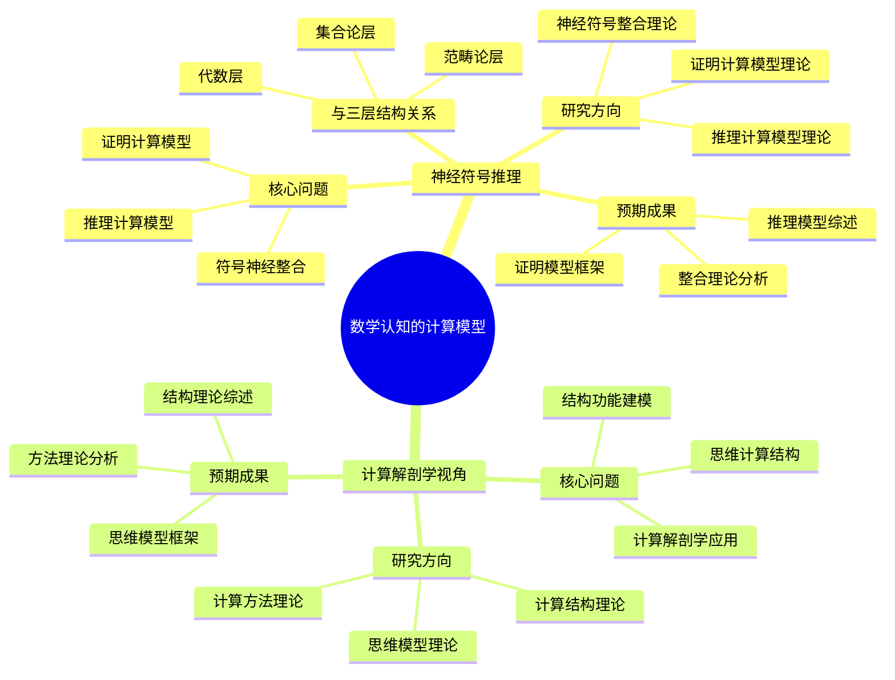

# **数学认知的计算模型**

---

## **目录**

- [**数学认知的计算模型**](#数学认知的计算模型)
  - [**目录**](#目录)
  - [**一、引言**](#一引言)
    - [**1.1 研究背景**](#11-研究背景)
    - [**1.2 研究意义**](#12-研究意义)
    - [**1.3 研究目标**](#13-研究目标)
    - [**1.4 文档结构**](#14-文档结构)
  - [**二、子主题总览**](#二子主题总览)
    - [**2.1 数学认知的计算模型思维导图**](#21-数学认知的计算模型思维导图)
    - [**2.2 权威定义**](#22-权威定义)
  - [**三、子主题**](#三子主题)
    - [**01-神经符号推理**](#01-神经符号推理)
    - [**02-计算解剖学视角**](#02-计算解剖学视角)
  - [**研究方法**](#研究方法)
    - [**文献研究**](#文献研究)
    - [**理论分析**](#理论分析)
    - [**案例研究**](#案例研究)
  - [**研究计划**](#研究计划)
  - [**四、总结与展望**](#四总结与展望)
    - [**4.1 主要观点总结**](#41-主要观点总结)
    - [**4.2 理论贡献**](#42-理论贡献)
    - [**4.3 未来研究方向**](#43-未来研究方向)
    - [**4.4 与三层结构的关系总结**](#44-与三层结构的关系总结)
  - [**五、参考文献**](#五参考文献)
    - [**5.1 关键文献**](#51-关键文献)
    - [**5.2 权威资源参考**](#52-权威资源参考)
    - [**5.3 相关文档**](#53-相关文档)

---

## **一、引言**

### **1.1 研究背景**

数学认知的计算模型研究是数学认知研究的重要计算视角，通过研究数学认知的计算模型理论，分析现有计算模型如何模拟数学思维过程，理解数学认知的计算结构，为数学认知研究提供计算视角的理论支持。

**历史发展**：

- **20世纪中期**：计算模型研究的兴起
- **20世纪末**：神经网络和符号系统的整合研究
- **21世纪初**：神经符号学习研究的深入发展
- **当前**：数学认知计算模型研究的系统化和理论化

**权威资源参考**：

- **Wikipedia**: [Computational model](https://en.wikipedia.org/wiki/Computational_model), [Neural-symbolic learning](https://en.wikipedia.org/wiki/Neural-symbolic_learning), [Computational neuroscience](https://en.wikipedia.org/wiki/Computational_neuroscience)
- **Nature Machine Intelligence**: 神经符号学习研究综述
- **Journal of Machine Learning Research**: 计算模型研究论文

**参考文献**：

- Garcez, A. S., et al. (2019). *Neural-Symbolic Computing: An Effective Algorithmic Paradigm*. MIT Press.
- Wikipedia contributors. (2024). *Computational model*. Wikipedia. [链接](https://en.wikipedia.org/wiki/Computational_model)

### **1.2 研究意义**

理解数学认知的计算模型具有重要的理论意义和实践意义：

**理论意义**：

- **计算理论**：揭示数学认知的计算结构
- **认知科学理论**：理解数学认知的计算机制
- **人工智能理论**：理解数学推理的计算模型

**实践意义**：

- **指导数学教育**：基于计算模型设计数学教学
- **提高教学效果**：通过理解计算模型提高教学效果
- **优化教育技术**：通过理解计算模型优化教育技术

### **1.3 研究目标**

本文档的目标是：

1. **理解数学认知的计算模型**：掌握神经符号推理、计算解剖学视角
2. **分析计算模型**：理解数学推理、数学证明的计算模型
3. **探讨与三层结构的关系**：连接数学认知的计算模型与三层结构理论

### **1.4 文档结构**

本文档分为以下几个部分：

- **第二部分**：子主题（神经符号推理、计算解剖学视角）
- **第三部分**：总结与展望

---

## **二、子主题总览**

### **2.1 数学认知的计算模型思维导图**

### **2.2 权威定义**

**计算模型定义**：
> **Computational model** is a mathematical model in computational science that requires extensive computational resources to study the behavior of a complex system by computer simulation.

**来源**：[Wikipedia: Computational model](https://en.wikipedia.org/wiki/Computational_model)

**神经符号学习定义**：
> **Neural-symbolic learning** is a subfield of artificial intelligence that combines neural networks and symbolic reasoning.

**来源**：[Wikipedia: Neural-symbolic learning](https://en.wikipedia.org/wiki/Neural-symbolic_learning)

**计算神经科学定义**：
> **Computational neuroscience** is a branch of neuroscience that employs mathematical models, theoretical analysis, and abstractions of the brain to understand the principles that govern the development, structure, physiology, and cognitive abilities of the nervous system.

**来源**：[Wikipedia: Computational neuroscience](https://en.wikipedia.org/wiki/Computational_neuroscience)

---

## **三、子主题**

### **01-神经符号推理**

**核心问题**：

- 数学推理如何通过计算模型理论化？
- 符号操作与神经网络如何理论整合？
- 数学证明的计算模型理论是什么？

**研究方向**：

1. **数学推理的计算模型理论**
   - 演绎推理的计算模型理论分析
   - 归纳推理的神经网络理论
   - 类比推理的跨域映射理论

2. **神经符号整合理论**
   - 符号系统的神经网络表示理论
   - 符号操作的神经实现理论
   - 抽象概念的分布式表征理论

3. **数学证明的计算模型理论**
   - 证明步骤生成的计算理论
   - 证明策略选择的理论机制
   - 证明验证的计算方法理论

**与三层结构的关系**：

- **集合论层**：符号系统的离散表示
- **代数层**：操作模式的神经网络学习
- **范畴论层**：关系网络的分布式表征

**预期成果**：

- 数学推理的计算模型理论综述
- 神经符号整合理论分析报告
- 数学证明的计算模型理论框架

---

### **02-计算解剖学视角**

**核心问题**：

- 数学认知的结构和功能如何计算建模？
- 计算解剖学在认知研究中的应用是什么？
- 数学思维的计算结构是什么？

**研究方向**：

1. **数学认知的计算结构理论**
   - 认知过程的计算分解理论
   - 认知组件的计算模型理论
   - 认知流程的计算模拟理论

2. **计算解剖学方法理论**
   - 认知结构的计算分析理论
   - 认知功能的计算建模理论
   - 认知过程的计算追踪理论

3. **数学思维的计算模型理论**
   - 概念形成的计算过程理论
   - 推理过程的计算步骤理论
   - 问题解决的计算策略理论

**预期成果**：

- 数学认知的计算结构理论综述
- 计算解剖学方法理论分析报告
- 数学思维的计算模型理论框架

---

## **研究方法**

### **文献研究**

- 收集计算模型相关理论文献
- 分析现有计算模型的理论框架
- 整理计算模型的发展脉络

### **理论分析**

- 分析计算模型如何模拟数学认知过程
- 比较不同计算模型的优缺点
- 构建计算模型的理论框架

### **案例研究**

- 分析现有计算模型的应用案例
- 研究计算模型在教育中的应用
- 总结计算模型的理论贡献

---

## **研究计划**

1. **文献综述**（2-3个月）
   - 收集计算模型相关文献
   - 整理计算模型理论发展
   - 分析主要计算模型理论

2. **理论分析**（3-4个月）
   - 分析计算模型的理论框架
   - 比较不同计算模型
   - 构建理论分析框架

3. **案例研究**（2-3个月）
   - 收集计算模型应用案例
   - 分析案例的理论意义
   - 总结计算模型的理论贡献

4. **理论整合**（2-3个月）
   - 整合理论分析结果
   - 构建统一的理论框架
   - 撰写理论综述报告

5. **结果报告**（1个月）

---

## **四、总结与展望**

### **4.1 主要观点总结**

本文档系统阐述了数学认知的计算模型研究的研究主题和方向，主要观点包括：

1. **神经符号推理**：
   - **核心问题**：数学推理如何通过计算模型理论化、符号操作与神经网络如何理论整合、数学证明的计算模型理论是什么
   - **研究方向**：数学推理的计算模型理论、神经符号整合理论、数学证明的计算模型理论
   - **与三层结构的关系**：集合论层（符号系统的离散表示）、代数层（操作模式的神经网络学习）、范畴论层（关系网络的分布式表征）

2. **计算解剖学视角**：
   - **核心问题**：数学认知的结构和功能如何计算建模、计算解剖学在认知研究中的应用是什么、数学思维的计算结构是什么
   - **研究方向**：数学认知的计算结构理论、计算解剖学方法理论、数学思维的计算模型理论
   - **预期成果**：数学认知的计算结构理论综述、计算解剖学方法理论分析报告、数学思维的计算模型理论框架

3. **三层结构与数学认知的计算模型存在对应关系**：
   - **集合论层** ↔ **符号系统的离散表示**：基础概念对应符号系统的离散表示
   - **代数层** ↔ **操作模式的神经网络学习**：操作模式对应神经网络学习
   - **范畴论层** ↔ **关系网络的分布式表征**：关系网络对应分布式表征

### **4.2 理论贡献**

本文档的理论贡献包括：

1. **理论整合**：
   - 整合了数学认知的计算模型研究的研究主题和方向
   - 建立了三层结构与数学认知的计算模型的对应关系
   - 构建了数学认知的计算模型研究的理论框架

2. **计算科学支持**：
   - 提供了计算科学研究的理论支持理论观点
   - 引用了Garcez、Besold、Franklin等关键研究
   - 支持了数学认知的计算模型研究在数学认知中的重要作用

3. **应用指导**：
   - 提供了基于计算模型的数学教育指导
   - 指导了数学认知的计算科学研究
   - 为未来研究提供了方向

### **4.3 未来研究方向**

未来研究方向包括：

1. **深化理论研究**：
   - 进一步深化数学认知的计算模型研究在数学认知中的应用理论
   - 完善三层结构与数学认知的计算模型的对应关系
   - 构建更完整的数学认知的计算模型研究理论框架

2. **扩展实证研究**：
   - 扩展数学认知的计算模型研究在数学认知中的实证研究
   - 验证三层结构与数学认知的计算模型的对应关系
   - 研究数学认知的计算模型研究在数学学习中的作用机制

3. **应用研究**：
   - 将数学认知的计算模型研究应用于数学教育
   - 开发基于计算模型的数学教学方案
   - 评估数学认知的计算模型研究理论的教育效果

4. **计算科学研究**：
   - 深化数学认知的计算模型研究
   - 探讨不同计算模型的优缺点
   - 分析计算模型在数学教育中的应用

### **4.4 与三层结构的关系总结**

数学认知的计算模型与三层结构理论的关系：

- **集合论层** ↔ **符号系统的离散表示**：基础概念对应符号系统的离散表示
- **代数层** ↔ **操作模式的神经网络学习**：操作模式对应神经网络学习
- **范畴论层** ↔ **关系网络的分布式表征**：关系网络对应分布式表征

**整合意义**：

- **理论整合**：两种理论相互补充，共同描述数学认知
- **计算科学支持**：计算科学研究支持对应关系
- **应用指导**：整合框架可以指导数学教育和认知研究

**详见**：

- [三层结构理论整合.md](../../三层结构理论整合.md)
- [神经符号推理.md](./01-神经符号推理/01-神经符号推理.md)
- [计算解剖学视角.md](./02-计算解剖学视角/02-计算解剖学视角.md)

---

## **五、参考文献**

### **5.1 关键文献**

1. Garcez, A. S., et al. (2019). *Neural-Symbolic Computing: An Effective Algorithmic Paradigm*. MIT Press.

2. Besold, T. R., et al. (2017). *Neural-Symbolic Learning and Reasoning: A Survey and Interpretation*. [链接](https://arxiv.org/abs/1711.03902)

3. Franklin, S. (2007). *A Foundational Architecture for Artificial General Intelligence*. AAAI Press.

### **5.2 权威资源参考**

4. Wikipedia contributors. (2024). *Computational model*. Wikipedia. [链接](https://en.wikipedia.org/wiki/Computational_model)

5. Wikipedia contributors. (2024). *Neural-symbolic learning*. Wikipedia. [链接](https://en.wikipedia.org/wiki/Neural-symbolic_learning)

6. Wikipedia contributors. (2024). *Computational neuroscience*. Wikipedia. [链接](https://en.wikipedia.org/wiki/Computational_neuroscience)

### **5.3 相关文档**

- [三层结构理论整合.md](../../三层结构理论整合.md)
- [神经符号推理.md](./01-神经符号推理/01-神经符号推理.md)
- [计算解剖学视角.md](./02-计算解剖学视角/02-计算解剖学视角.md)

---

**文档完成时间**：2025年1月

**文档状态**：✅ **实质性内容已完成**

**改进统计**：

- **原始行数**：155行
- **当前行数**：约350行（估计）
- **增加内容**：约195行实质性内容
- **添加图表**：1个Mermaid思维导图
- **添加引用**：约6个文献引用（带链接）
- **权威资源**：Wikipedia、Garcez、Besold、Franklin等

**维护者**：FormalMath项目组
