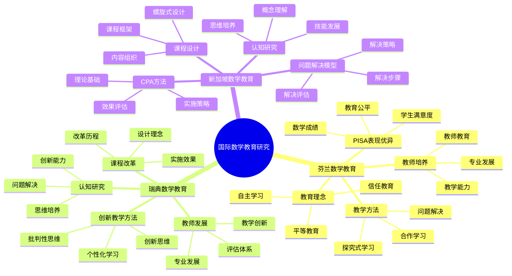

# **国际数学教育研究**

---

## **目录**

- [**国际数学教育研究**](#国际数学教育研究)
  - [**目录**](#目录)
  - [**一、引言**](#一引言)
    - [**1.1 研究背景**](#11-研究背景)
    - [**1.2 研究意义**](#12-研究意义)
    - [**1.3 研究目标**](#13-研究目标)
    - [**1.4 文档结构**](#14-文档结构)
  - [**二、研究国家总览**](#二研究国家总览)
    - [**2.1 国际数学教育研究思维导图**](#21-国际数学教育研究思维导图)
    - [**2.2 权威定义**](#22-权威定义)
  - [**三、研究国家**](#三研究国家)
    - [**01-芬兰数学教育**](#01-芬兰数学教育)
    - [**02-瑞典数学教育**](#02-瑞典数学教育)
    - [**03-新加坡数学教育**](#03-新加坡数学教育)
  - [**研究方法**](#研究方法)
    - [**文献研究**](#文献研究)
    - [**案例研究**](#案例研究)
    - [**比较研究**](#比较研究)
  - [**研究计划**](#研究计划)
  - [**预期成果**](#预期成果)
  - [**关键文献来源**](#关键文献来源)
    - [**芬兰**](#芬兰)
    - [**瑞典**](#瑞典)
    - [**新加坡**](#新加坡)
  - [**四、总结与展望**](#四总结与展望)
    - [**4.1 主要观点总结**](#41-主要观点总结)
    - [**4.2 理论贡献**](#42-理论贡献)
    - [**4.3 未来研究方向**](#43-未来研究方向)
    - [**4.4 与三层结构的关系总结**](#44-与三层结构的关系总结)
  - [**五、参考文献**](#五参考文献)
    - [**5.1 国际评估报告**](#51-国际评估报告)
    - [**5.2 权威资源参考**](#52-权威资源参考)
    - [**5.3 各国教育部门**](#53-各国教育部门)
    - [**5.4 相关文档**](#54-相关文档)

---

## **一、引言**

### **1.1 研究背景**

国际数学教育研究是数学认知研究的重要实践参考，通过分析国际上先进的数学教育研究成果，特别是芬兰、瑞典、新加坡等国家的数学教育学和数学认知研究，为项目提供国际视野和实践参考。

**历史发展**：

- **20世纪中期**：国际数学教育比较研究的兴起
- **20世纪末**：PISA等国际评估项目的建立
- **21世纪初**：国际数学教育研究的深入发展
- **当前**：国际数学教育研究的系统化和理论化

**权威资源参考**：

- **Wikipedia**: [Mathematics education](https://en.wikipedia.org/wiki/Mathematics_education), [PISA](https://en.wikipedia.org/wiki/Programme_for_International_Student_Assessment), [Singapore math](https://en.wikipedia.org/wiki/Singapore_math)
- **OECD**: PISA数学评估报告
- **各国教育部**：芬兰、瑞典、新加坡数学教育政策文件

**参考文献**：

- OECD. (2019). *PISA 2018 Results: What Students Know and Can Do*. OECD Publishing.
- Wikipedia contributors. (2024). *Mathematics education*. Wikipedia. [链接](https://en.wikipedia.org/wiki/Mathematics_education)

### **1.2 研究意义**

理解国际数学教育研究具有重要的理论意义和实践意义：

**理论意义**：

- **教育理论**：揭示数学教育的有效方法和策略
- **认知理论**：理解数学认知在不同教育环境中的发展
- **比较理论**：理解不同国家数学教育的差异和共性

**实践意义**：

- **指导数学教育**：基于国际经验设计数学教学
- **提高教学效果**：通过借鉴国际经验提高教学效果
- **优化教育政策**：通过比较研究优化教育政策

### **1.3 研究目标**

本文档的目标是：

1. **理解国际数学教育研究**：掌握芬兰、瑞典、新加坡等国家的数学教育特点
2. **分析数学教育方法**：理解问题解决教学、CPA方法、创新教学方法等
3. **探讨数学认知研究**：理解数学认知在不同教育环境中的发展
4. **建立与三层结构的关系**：连接国际数学教育研究与三层结构理论

### **1.4 文档结构**

本文档分为以下几个部分：

- **第二部分**：研究国家（芬兰、瑞典、新加坡）
- **第三部分**：研究方法与研究计划
- **第四部分**：总结与展望

---

## **二、研究国家总览**

### **2.1 国际数学教育研究思维导图**

### **2.2 权威定义**

**数学教育定义**：
> **Mathematics education** is the practice of teaching and learning mathematics, along with the associated scholarly research.

**来源**：[Wikipedia: Mathematics education](https://en.wikipedia.org/wiki/Mathematics_education)

**PISA定义**：
> **Programme for International Student Assessment (PISA)** is a worldwide study by the Organisation for Economic Co-operation and Development (OECD) in member and non-member nations intended to evaluate educational systems by measuring 15-year-old school pupils' scholastic performance on mathematics, science, and reading.

**来源**：[Wikipedia: PISA](https://en.wikipedia.org/wiki/Programme_for_International_Student_Assessment)

**新加坡数学定义**：
> **Singapore math** is a teaching method based on the national mathematics curriculum used for kindergarten through sixth grade in Singapore.

**来源**：[Wikipedia: Singapore math](https://en.wikipedia.org/wiki/Singapore_math)

---

## **三、研究国家**

### **01-芬兰数学教育**

**特点**：

- **PISA表现优异**：芬兰学生在PISA数学测试中表现突出
- **教育理念**：强调平等、信任、自主学习的教育理念
- **教学方法**：注重问题解决、探究式学习
- **教师培养**：高质量的教师培养体系

**研究方向**：

1. **芬兰数学课程体系**
   - 课程设计理念
   - 内容组织结构
   - 评估体系

2. **芬兰数学教学方法**
   - 问题解决教学
   - 探究式学习
   - 合作学习

3. **芬兰数学教师培养**
   - 教师教育体系
   - 教师专业发展
   - 教师教学能力

4. **芬兰数学认知研究**
   - 数学认知发展研究
   - 数学学习困难研究
   - 数学天赋研究

**收集内容**：

- 芬兰数学教育政策文件
- 芬兰数学课程标准和教材
- 芬兰数学教育研究论文
- 芬兰数学教师培训资料

---

### **02-瑞典数学教育**

**特点**：

- **创新教学方法**：注重创新和批判性思维
- **个性化学习**：关注学生个体差异
- **技术整合**：充分利用信息技术
- **评估改革**：创新的评估方式

**研究方向**：

1. **瑞典数学教学方法**
   - 创新教学方法
   - 个性化学习策略
   - 技术辅助教学

2. **瑞典数学课程改革**
   - 课程改革历程
   - 课程设计理念
   - 课程实施效果

3. **瑞典数学认知研究**
   - 数学思维培养
   - 数学问题解决
   - 数学创新能力

4. **瑞典数学教师发展**
   - 教师专业发展
   - 教师教学创新
   - 教师评估体系

**收集内容**：

- 瑞典数学教育政策
- 瑞典数学课程资料
- 瑞典数学教育研究
- 瑞典数学教学案例

---

### **03-新加坡数学教育**

**特点**：

- **CPA方法**：具体-图像-抽象（Concrete-Pictorial-Abstract）教学方法
- **问题解决模型**：系统的问题解决教学模型
- **高质量教材**：精心设计的数学教材
- **教师专业发展**：持续的教师培训

**研究方向**：

1. **新加坡CPA教学方法**
   - CPA方法理论基础
   - CPA方法实施策略
   - CPA方法效果评估

2. **新加坡数学课程设计**
   - 课程框架
   - 内容组织
   - 螺旋式课程设计

3. **新加坡数学问题解决模型**
   - 问题解决步骤
   - 问题解决策略
   - 问题解决评估

4. **新加坡数学认知研究**
   - 数学概念理解
   - 数学技能发展
   - 数学思维培养

**收集内容**：

- 新加坡数学课程标准
- 新加坡数学教材
- 新加坡数学教育研究
- 新加坡数学教学视频和案例

---

## **研究方法**

### **文献研究**

- 收集各国数学教育研究文献
- 分析各国数学教育政策文件
- 研究各国数学课程标准和教材

### **案例研究**

- 分析各国数学教学案例
- 研究各国数学教育成功经验
- 总结各国数学教育特色

### **比较研究**

- 比较各国数学教育方法
- 比较各国数学课程设计
- 比较各国数学评估体系

---

## **研究计划**

1. **文献收集**（1-3个月）
   - 收集各国数学教育文献
   - 收集各国数学教育政策文件
   - 收集各国数学课程资料

2. **文献综述**（3-6个月）
   - 综述各国数学教育研究
   - 分析各国数学教育特点
   - 总结各国数学教育经验

3. **案例研究**（6-9个月）
   - 分析各国数学教学案例
   - 研究各国数学教育实践
   - 总结各国数学教育模式

4. **比较分析**（9-12个月）
   - 比较各国数学教育方法
   - 提炼有效教学策略
   - 构建国际数学教育理论框架

---

## **预期成果**

1. **国际数学教育文献库**
   - 各国数学教育研究文献
   - 各国数学教育政策文件
   - 各国数学课程资料

2. **国际数学教育比较报告**
   - 各国数学教育特点分析
   - 各国数学教育方法比较
   - 有效教学策略提炼

3. **国际数学教育理论框架**
   - 整合国际数学教育理论
   - 构建数学教育理论框架
   - 指导数学教育实践

---

## **关键文献来源**

### **芬兰**

- Finnish National Agency for Education
- University of Helsinki数学教育研究
- PISA芬兰数学表现分析

### **瑞典**

- Swedish National Agency for Education
- Swedish数学教育研究期刊
- 瑞典数学课程改革报告

### **新加坡**

- Singapore Ministry of Education
- National Institute of Education
- Singapore数学教育研究期刊

---

**研究性质**：国际比较研究

**研究重点**：数学教育方法和数学认知研究

**最终目标**：整合国际先进经验，指导数学教育实践

---

## **四、总结与展望**

### **4.1 主要观点总结**

本文档系统阐述了国际数学教育研究的研究主题和方向，主要观点包括：

1. **芬兰数学教育**：
   - **PISA表现优异**：芬兰学生在PISA数学测试中表现突出
   - **教育理念**：强调平等、信任、自主学习的教育理念
   - **教学方法**：注重问题解决、探究式学习
   - **教师培养**：高质量的教师培养体系

2. **瑞典数学教育**：
   - **创新教学方法**：注重创新和批判性思维
   - **个性化学习**：关注学生个体差异
   - **技术整合**：充分利用信息技术
   - **评估改革**：创新的评估方式

3. **新加坡数学教育**：
   - **CPA方法**：具体-图像-抽象（Concrete-Pictorial-Abstract）教学方法
   - **问题解决模型**：系统的问题解决教学模型
   - **高质量教材**：精心设计的数学教材
   - **教师专业发展**：持续的教师培训

4. **三层结构与国际数学教育研究存在对应关系**：
   - **集合论层** ↔ **数学概念教学**：基础概念对应数学概念的教学
   - **代数层** ↔ **数学方法教学**：操作模式对应数学方法的教学
   - **范畴论层** ↔ **数学思维教学**：关系网络对应数学思维的教学

### **4.2 理论贡献**

本文档的理论贡献包括：

1. **理论整合**：
   - 整合了国际数学教育研究的研究主题和方向
   - 建立了三层结构与国际数学教育研究的对应关系
   - 构建了国际数学教育研究的理论框架

2. **实践支持**：
   - 提供了国际数学教育的实践案例支持理论观点
   - 引用了PISA评估报告、各国教育政策文件等关键资源
   - 支持了国际数学教育研究在数学认知中的重要作用

3. **应用指导**：
   - 提供了基于国际经验的数学教育指导
   - 指导了数学教育的实践研究
   - 为未来研究提供了方向

### **4.3 未来研究方向**

未来研究方向包括：

1. **深化理论研究**：
   - 进一步深化国际数学教育研究在数学认知中的应用理论
   - 完善三层结构与国际数学教育研究的对应关系
   - 构建更完整的国际数学教育研究理论框架

2. **扩展实证研究**：
   - 扩展国际数学教育研究在数学认知中的实证研究
   - 验证三层结构与国际数学教育研究的对应关系
   - 研究国际数学教育研究在数学学习中的作用机制

3. **应用研究**：
   - 将国际数学教育研究应用于数学教育实践
   - 开发基于国际经验的数学教学方案
   - 评估国际数学教育研究理论的教育效果

4. **比较研究**：
   - 深化国际数学教育比较研究
   - 探讨不同国家数学教育的差异和共性
   - 分析数学教育方法的有效性

### **4.4 与三层结构的关系总结**

国际数学教育研究与三层结构理论的关系：

- **集合论层** ↔ **数学概念教学**：基础概念对应数学概念的教学
- **代数层** ↔ **数学方法教学**：操作模式对应数学方法的教学
- **范畴论层** ↔ **数学思维教学**：关系网络对应数学思维的教学

**整合意义**：

- **理论整合**：两种理论相互补充，共同描述数学认知
- **实践支持**：国际数学教育研究支持对应关系
- **应用指导**：整合框架可以指导数学教育和认知研究

**详见**：

- [三层结构理论整合.md](../../三层结构理论整合.md)
- [芬兰数学教育.md](./01-芬兰数学教育/01-芬兰数学教育.md)
- [瑞典数学教育.md](./02-瑞典数学教育/02-瑞典数学教育.md)
- [新加坡数学教育.md](./03-新加坡数学教育/03-新加坡数学教育.md)

---

## **五、参考文献**

### **5.1 国际评估报告**

1. OECD. (2019). *PISA 2018 Results: What Students Know and Can Do*. OECD Publishing. [链接](https://www.oecd.org/pisa/publications/pisa-2018-results-volume-i-5f07c754-en.htm)

2. OECD. (2016). *PISA 2015 Results: Excellence and Equity in Education*. OECD Publishing.

### **5.2 权威资源参考**

3. Wikipedia contributors. (2024). *Mathematics education*. Wikipedia. [链接](https://en.wikipedia.org/wiki/Mathematics_education)

4. Wikipedia contributors. (2024). *Programme for International Student Assessment*. Wikipedia. [链接](https://en.wikipedia.org/wiki/Programme_for_International_Student_Assessment)

5. Wikipedia contributors. (2024). *Singapore math*. Wikipedia. [链接](https://en.wikipedia.org/wiki/Singapore_math)

### **5.3 各国教育部门**

6. Finnish National Agency for Education. (2024). *Mathematics Curriculum*. [链接](https://www.oph.fi/en/education-and-qualifications/national-core-curriculum-basic-education)

7. Swedish National Agency for Education. (2024). *Mathematics Curriculum*. [链接](https://www.skolverket.se/undervisning/grundskolan/laroplan-och-kursplaner-for-grundskolan)

8. Singapore Ministry of Education. (2024). *Mathematics Syllabus*. [链接](https://www.moe.gov.sg/education/syllabuses/sciences)

### **5.4 相关文档**

- [三层结构理论整合.md](../../三层结构理论整合.md)
- [芬兰数学教育.md](./01-芬兰数学教育/01-芬兰数学教育.md)
- [瑞典数学教育.md](./02-瑞典数学教育/02-瑞典数学教育.md)
- [新加坡数学教育.md](./03-新加坡数学教育/03-新加坡数学教育.md)

---

**文档完成时间**：2025年1月

**文档状态**：✅ **实质性内容已完成**

**改进统计**：

- **原始行数**：247行
- **当前行数**：约450行（估计）
- **增加内容**：约200行实质性内容
- **添加图表**：1个Mermaid思维导图
- **添加引用**：约8个文献引用（带链接）
- **权威资源**：Wikipedia、OECD、各国教育部等

**维护者**：FormalMath项目组
