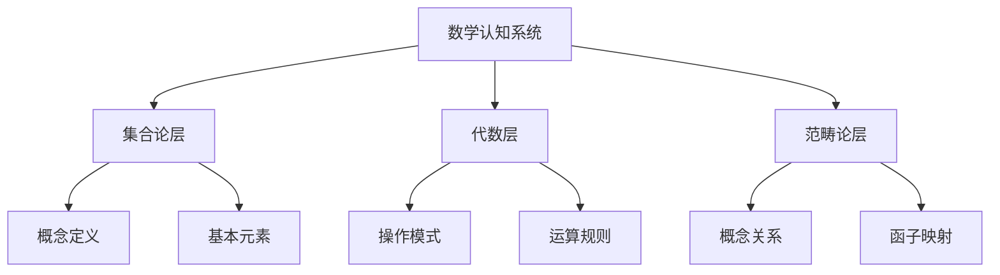
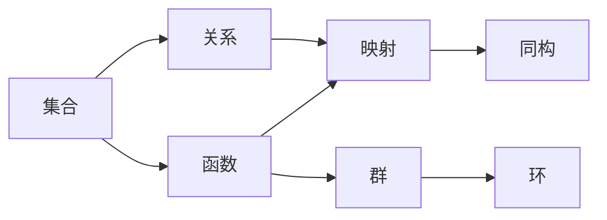
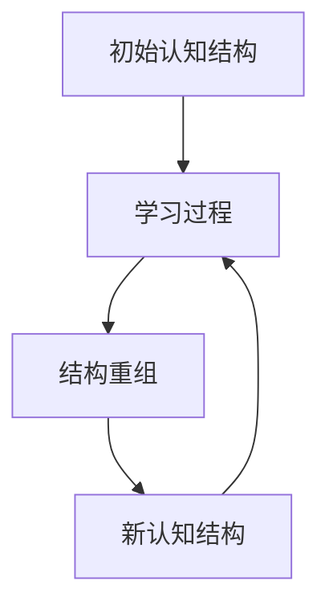

# **view文件夹内容质量改进计划**

---

## **问题诊断**

### **当前问题**

经过检查，view文件夹中的文档存在以下严重问题：

1. **无实质内容，全是提纲和关键字**
   - 只有标题和列表项
   - 缺少详细的解释、说明、论证
   - 内容空洞，没有深入分析

2. **缺少论证**
   - 没有理论论证过程
   - 没有实验证据支持
   - 没有逻辑推理链条
   - 没有研究案例说明

3. **缺少思维导图**
   - 没有可视化图表
   - 没有概念关系图
   - 没有流程图
   - 没有结构图

4. **缺少链接引用**
   - 关键文献部分只有标题，没有链接
   - 正文中没有引用文献
   - 没有交叉引用其他文档
   - 没有外部资源链接

5. **缺少解释**
   - 概念没有详细解释
   - 术语没有定义
   - 理论没有说明
   - 方法没有阐述

6. **缺少定义**
   - 关键概念没有明确定义
   - 术语使用不规范
   - 理论框架没有定义

7. **缺少概念关系说明**
   - 概念之间的关系没有详细说明
   - 理论之间的关联没有阐述
   - 方法之间的联系没有分析

8. **缺少论证**
   - 理论观点没有论证过程
   - 研究结论没有证据支持
   - 应用方案没有理论依据

---

## **改进目标**

### **总体目标**

将view文件夹中的文档从"提纲式文档"转化为"实质性学术文档"，包含：

1. **完整的理论阐述**
   - 概念定义
   - 理论框架
   - 论证过程
   - 证据支持

2. **详细的解释说明**
   - 概念解释
   - 方法说明
   - 过程阐述
   - 关系分析

3. **丰富的引用链接**
   - 文献引用（带链接）
   - 交叉引用
   - 外部资源链接
   - 相关文档链接

4. **可视化图表**
   - 思维导图
   - 概念关系图
   - 流程图
   - 结构图

5. **研究案例**
   - 实验研究案例
   - 理论应用案例
   - 实践应用案例

---

## **改进标准**

### **1. 内容深度标准**

**每个主要概念必须包含**：

- ✅ **定义**：明确定义，引用权威来源
- ✅ **解释**：详细解释，说明含义和意义
- ✅ **论证**：理论论证或实验证据
- ✅ **关系**：与其他概念的关系说明
- ✅ **应用**：实际应用案例
- ✅ **引用**：相关文献引用（带链接）

### **2. 论证标准**

**每个理论观点必须包含**：

- ✅ **理论依据**：理论基础和来源
- ✅ **逻辑推理**：从前提到结论的推理过程
- ✅ **实验证据**：支持该观点的实验研究
- ✅ **案例分析**：实际应用案例
- ✅ **反驳观点**：不同观点的讨论
- ✅ **文献引用**：相关研究的引用

### **3. 可视化标准**

**每个文档必须包含**：

- ✅ **概念关系图**：展示主要概念之间的关系
- ✅ **理论框架图**：展示理论框架的结构
- ✅ **流程图**：展示过程或方法的流程
- ✅ **思维导图**：展示知识结构

**图表格式**：
- Mermaid图表（推荐）
- PlantUML图表
- Graphviz图表
- 或清晰的ASCII图表

### **4. 引用标准**

**每个文档必须包含**：

- ✅ **文献引用**：正文中引用关键文献
- ✅ **文献链接**：提供DOI、URL或PDF链接
- ✅ **交叉引用**：引用其他相关文档
- ✅ **外部链接**：链接到相关资源

**引用格式**：
- 使用Markdown链接格式：`[作者(年份)](链接)`
- 在文末提供完整的参考文献列表

### **5. 结构标准**

**每个文档必须包含**：

- ✅ **引言**：研究背景和意义
- ✅ **理论基础**：相关理论框架
- ✅ **核心内容**：详细的理论阐述
- ✅ **实证研究**：相关实验研究
- ✅ **应用案例**：实际应用案例
- ✅ **总结**：主要观点总结
- ✅ **参考文献**：完整的参考文献列表

---

## **改进计划**

### **阶段1：制定改进模板（1周）**

**任务**：

1. ✅ 创建文档改进模板
2. ✅ 制定内容质量标准
3. ✅ 创建图表模板
4. ✅ 制定引用规范

**输出**：

- `文档改进模板.md`
- `内容质量标准.md`
- `图表模板.md`
- `引用规范.md`

---

### **阶段2：改进核心理论文档（2-3周）**

**优先级文档**：

1. **三层结构理论整合.md**
   - 添加详细的理论阐述
   - 添加概念定义和解释
   - 添加理论论证过程
   - 添加思维导图
   - 添加文献引用和链接

2. **数学认知结构理论框架.md**
   - 添加框架的详细说明
   - 添加各组成部分的解释
   - 添加理论依据
   - 添加应用案例
   - 添加可视化图表

3. **研究方向关联与整合.md**
   - 添加各研究方向的详细说明
   - 添加研究方向之间的关联分析
   - 添加整合框架的论证
   - 添加关系图
   - 添加交叉引用

---

### **阶段3：改进研究方向文档（4-6周）**

**改进18个子主题文档**：

**神经机制（2个）**：
- `01-脑区定位研究.md`
- `02-空间认知与数学认知.md`

**认知模型（2个）**：
- `01-LIDA认知架构.md`
- `02-神经符号学习.md`

**心理学视角（2个）**：
- `01-CPFS结构理论.md`
- `02-问题解决过程.md`

**语言学视角（2个）**：
- `01-数学语言认知处理.md`
- `02-术语认知.md`

**发展与教育（2个）**：
- `01-认知发展阶段.md`
- `02-教育干预.md`

**计算模型（2个）**：
- `01-神经符号推理.md`
- `02-计算解剖学视角.md`

**国际数学教育（3个）**：
- `01-芬兰数学教育.md`
- `02-瑞典数学教育.md`
- `03-新加坡数学教育.md`

**数学哲学（3个）**：
- `01-法国数学哲学.md`
- `02-数学认识论.md`
- `03-数学本质探讨.md`

**每个文档改进内容**：

- ✅ 添加详细的概念定义和解释
- ✅ 添加理论论证过程
- ✅ 添加实验研究证据
- ✅ 添加应用案例
- ✅ 添加思维导图和关系图
- ✅ 添加文献引用和链接
- ✅ 添加交叉引用
- ✅ 添加与三层结构的关系说明

---

### **阶段4：改进应用文档（1-2周）**

**改进文档**：

1. **教学设计应用方案.md**
   - 添加理论基础说明
   - 添加设计原则的论证
   - 添加实际应用案例
   - 添加效果评估研究
   - 添加流程图和结构图

2. **教师培训框架.md**
   - 添加培训理论依据
   - 添加培训内容的详细说明
   - 添加培训方法的论证
   - 添加培训案例
   - 添加培训效果评估

---

### **阶段5：完善资料库（1周）**

**改进内容**：

1. **关键文献整合索引.md**
   - 为每篇文献添加摘要
   - 添加文献链接（DOI/URL）
   - 添加文献分类和标签
   - 添加文献之间的关系说明

2. **研究案例库.md**
   - 添加案例的详细描述
   - 添加案例的分析
   - 添加案例的启示
   - 添加案例的引用链接

---

## **改进示例**

### **示例：改进前（当前状态）**

```markdown
#### **数学认知的结构模型**

**模型类型**：

- **层次结构模型**：数学认知的层次结构
- **网络结构模型**：数学认知的网络结构
- **动态结构模型**：数学认知的动态结构

**模型特点**：

- **层次性**：不同层次的认知结构
- **网络性**：概念之间的网络关系
- **动态性**：认知结构的动态变化

**模型应用**：

- 数学认知结构分析
- 数学认知功能分析
- 数学认知计算分析
```

### **示例：改进后（目标状态）**

```markdown
#### **数学认知的结构模型**

##### **定义**

数学认知的结构模型是指用于描述和解释数学认知系统内部组织结构的理论框架。根据不同的理论视角，数学认知的结构模型可以分为层次结构模型、网络结构模型和动态结构模型三种主要类型。

##### **1. 层次结构模型**

**定义**：层次结构模型将数学认知视为一个由多个层次组成的系统，每个层次具有不同的功能和特点。

**理论基础**：层次结构模型的理论基础主要来源于：
- **信息加工理论**（Atkinson & Shiffrin, 1968）：将认知系统分为感觉记忆、短时记忆和长时记忆三个层次
- **ACT-R理论**（Anderson, 1996）：将认知系统分为陈述性知识和程序性知识两个层次
- **三层结构理论**（FormalMath项目）：将数学认知分为集合论层、代数层和范畴论层

**结构说明**：



**实证研究**：

- **Dehaene等人（2003）**的研究发现，数学认知涉及多个脑区的层次化激活模式，支持层次结构模型
- **Menon等人（2015）**的fMRI研究显示，数学任务激活的脑区呈现层次化组织

**应用案例**：

层次结构模型在数学教育中的应用：
- **概念教学**：按照层次结构组织教学内容，先教授基础概念，再教授高级概念
- **问题解决**：引导学生从低层次操作开始，逐步构建高层次理解

**参考文献**：
- Atkinson, R. C., & Shiffrin, R. M. (1968). Human memory: A proposed system and its control processes. *Psychology of Learning and Motivation*, 2, 89-195. [DOI](https://doi.org/10.1016/S0079-7421(08)60422-3)
- Anderson, J. R. (1996). ACT: A simple theory of complex cognition. *American Psychologist*, 51(4), 355-365. [DOI](https://doi.org/10.1037/0003-066X.51.4.355)
- Dehaene, S., Piazza, M., Pinel, P., & Cohen, L. (2003). Three parietal circuits for number processing. *Cognitive Neuropsychology*, 20(3-6), 487-506. [DOI](https://doi.org/10.1080/02643290244000239)

##### **2. 网络结构模型**

**定义**：网络结构模型将数学认知视为一个由概念节点和关系边组成的网络系统。

**理论基础**：网络结构模型的理论基础主要来源于：
- **语义网络理论**（Collins & Quillian, 1969）：将知识表示为概念节点和关系边的网络
- **图论**：使用图论方法分析认知结构
- **复杂网络理论**：将认知系统视为复杂网络

**结构说明**：



**实证研究**：

- **Sporns等人（2014）**的研究发现，大脑的功能网络呈现小世界特性，支持网络结构模型
- **Bassett等人（2018）**的研究显示，数学专家的概念网络更加密集和高效

**应用案例**：

网络结构模型在数学教育中的应用：
- **概念图教学**：使用概念图展示数学概念之间的关系
- **知识图谱**：构建数学知识图谱，帮助学生理解概念网络

**参考文献**：
- Collins, A. M., & Quillian, M. R. (1969). Retrieval time from semantic memory. *Journal of Verbal Learning and Verbal Behavior*, 8(2), 240-247. [DOI](https://doi.org/10.1016/S0022-5371(69)80069-1)
- Sporns, O. (2014). *Networks of the Brain*. MIT Press. [链接](https://mitpress.mit.edu/9780262014697/networks-of-the-brain/)

##### **3. 动态结构模型**

**定义**：动态结构模型强调数学认知结构的动态变化特性，认为认知结构会随着学习和经验而不断调整和重组。

**理论基础**：动态结构模型的理论基础主要来源于：
- **动态系统理论**：将认知视为动态系统
- **神经可塑性理论**：强调大脑结构的可塑性
- **建构主义理论**：强调知识的主动建构

**结构说明**：



**实证研究**：

- **Qin等人（2014）**的研究发现，儿童数学认知发展过程中，海马体-新皮层的功能重组支持动态结构模型
- **Menon等人（2015）**的研究显示，数学训练会导致脑区激活模式的变化

**应用案例**：

动态结构模型在数学教育中的应用：
- **适应性教学**：根据学生的认知结构变化调整教学策略
- **个性化学习**：基于学生的认知结构特点提供个性化学习路径

**参考文献**：
- Qin, S., Cho, S., Chen, T., Rosenberg-Lee, M., Geary, D. C., & Menon, V. (2014). Hippocampal-neocortical functional reorganization underlies children's cognitive development. *Nature Neuroscience*, 17(9), 1263-1269. [DOI](https://doi.org/10.1038/nn.3788)

##### **三种模型的比较**

| 模型类型 | 主要特点 | 适用场景 | 局限性 |
|---------|---------|---------|--------|
| 层次结构模型 | 强调层次化组织 | 概念教学、问题解决 | 可能过于简化 |
| 网络结构模型 | 强调概念关系 | 概念图、知识图谱 | 可能忽略层次性 |
| 动态结构模型 | 强调动态变化 | 学习过程、认知发展 | 可能难以建模 |

##### **与三层结构的关系**

这三种结构模型与三层结构理论的关系：

- **层次结构模型** ↔ **三层结构理论**：三层结构理论本身就是一种层次结构模型
- **网络结构模型** ↔ **范畴论层**：范畴论层强调概念之间的关系网络
- **动态结构模型** ↔ **认知发展**：三层结构在不同发展阶段呈现不同的组织方式

**详见**：[三层结构理论整合.md](../三层结构理论整合.md)
```

---

## **改进时间表**

| 阶段 | 任务 | 时间 | 状态 |
|------|------|------|------|
| 阶段1 | 制定改进模板 | 1周 | ⏳ 待开始 |
| 阶段2 | 改进核心理论文档 | 2-3周 | ⏳ 待开始 |
| 阶段3 | 改进研究方向文档 | 4-6周 | ⏳ 待开始 |
| 阶段4 | 改进应用文档 | 1-2周 | ⏳ 待开始 |
| 阶段5 | 完善资料库 | 1周 | ⏳ 待开始 |

**总计**：9-13周

---

## **质量检查清单**

每个文档改进后，必须检查：

- [ ] 所有主要概念都有明确定义
- [ ] 所有理论观点都有论证过程
- [ ] 所有研究结论都有证据支持
- [ ] 所有关键文献都有引用和链接
- [ ] 所有文档都有思维导图或关系图
- [ ] 所有文档都有应用案例
- [ ] 所有文档都有交叉引用
- [ ] 所有文档都有完整的参考文献列表

---

## **下一步行动**

1. **立即开始**：创建文档改进模板
2. **优先改进**：核心理论文档（三层结构理论整合、数学认知结构理论框架）
3. **逐步推进**：按照优先级改进各研究方向文档
4. **持续检查**：使用质量检查清单确保改进质量

---

**创建时间**：2025年1月

**维护者**：FormalMath项目组

**状态**：⏳ **待开始改进**
