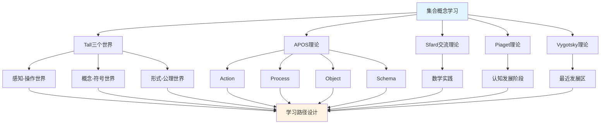

# 集合概念的多理论分析示例

**主题编号**: C.CORE.001.MULTI
**创建日期**: 2025年1月
**最后更新**: 2025年1月
**关联概念**: [集合](./01-集合.md) | [集合-三视角版](./01-集合-三视角版.md)

---

## 📋 概述

本文档为"集合"概念提供多理论分析示例，展示如何运用国际主流数学认知理论（Tall三个世界理论、Dubinsky APOS理论、Sfard交流理论、Piaget认知发展理论、Vygotsky社会文化理论）来分析数学概念，为FormalMath概念体系的理论整合提供模板。

**分析目标**：
- 展示多理论分析的方法和框架
- 为其他32个核心概念提供分析模板
- 建立理论整合的应用示例

---

## 🎯 一、Tall三个世界理论分析 (编号: C.CORE.001.MULTI.01)

### 1.1 感知-操作世界（Embodied World）

**集合在感知-操作世界的理解**：

- **具体经验**：
  - 通过观察和操作具体物体集合理解集合概念
  - 例如：一篮子苹果、一盒铅笔、一群学生
  - 通过分类活动理解集合的包含关系

- **身体动作**：
  - 通过数数、分类、比较等动作理解集合
  - 通过画圈、标记等操作表示集合
  - 通过集合运算（并、交、差）的具体操作理解

- **直观理解**：
  - 集合是"一些东西的集合"
  - 集合有大小（元素个数）
  - 集合之间有关系（包含、相等、相交等）

**教学建议**：
- 使用具体物体（如积木、卡片）进行集合操作
- 通过游戏和活动理解集合概念
- 使用图形和图表可视化集合

### 1.2 概念-符号世界（Symbolic World）

**集合在概念-符号世界的理解**：

- **符号表示**：
  - 使用集合符号：$\{1, 2, 3\}$、$\emptyset$、$\mathbb{N}$、$\mathbb{R}$
  - 使用集合运算符号：$\cup$（并）、$\cap$（交）、$\setminus$（差）、$\subseteq$（包含）
  - 使用逻辑符号：$\in$（属于）、$\notin$（不属于）

- **概念理解**：
  - 集合是满足某种性质的对象的全体
  - 集合的元素具有确定性、互异性、无序性
  - 集合运算遵循特定规律（交换律、结合律、分配律等）

- **抽象操作**：
  - 通过符号操作进行集合运算
  - 通过逻辑推理证明集合关系
  - 通过集合论语言表达数学概念

**教学建议**：
- 逐步引入集合符号
- 通过符号操作练习集合运算
- 使用集合论语言表达数学概念

### 1.3 形式-公理世界（Formal World）

**集合在形式-公理世界的理解**：

- **公理系统**：
  - ZFC公理系统（Zermelo-Fraenkel集合论）
  - 空集公理、配对公理、并集公理、幂集公理等
  - 通过公理严格定义集合

- **形式化定义**：
  - 集合的形式化定义：$x \in A$ 或 $x \notin A$
  - 集合运算的形式化定义
  - 集合关系的严格证明

- **逻辑推理**：
  - 通过逻辑推理证明集合性质
  - 通过形式化方法研究集合论
  - 通过公理系统建立数学基础

**教学建议**：
- 介绍ZFC公理系统
- 通过形式化证明理解集合性质
- 研究集合论在数学基础中的作用

---

## 🔬 二、Dubinsky APOS理论分析 (编号: C.CORE.001.MULTI.02)

### 2.1 Action（动作）

**集合的Action阶段**：

- **具体操作**：
  - 列出集合的元素：$\{1, 2, 3, 4\}$`
  - 判断元素是否属于集合：$2 \in \{1, 2, 3\}$？
  - 进行集合运算：$\{1, 2\} \cup \{2, 3\} = ?$

- **操作特点**：
  - 需要外部指导（教师、教材）
  - 操作是具体的、机械的
  - 需要逐步执行

- **学习活动**：
  - 练习列出集合元素
  - 练习判断元素归属
  - 练习基本集合运算

**教学建议**：
- 提供大量练习机会
- 给予及时反馈
- 逐步增加操作复杂度

### 2.2 Process（过程）

**集合的Process阶段**：

- **内化过程**：
  - 将集合操作内化为心理过程
  - 理解集合运算的内在逻辑
  - 能够独立完成集合运算

- **过程理解**：
  - 理解"并集"是"所有元素的集合"
  - 理解"交集"是"共同元素的集合"
  - 理解"差集"是"属于A但不属于B的元素"

- **灵活应用**：
  - 能够灵活应用集合运算
  - 能够处理复杂的集合问题
  - 能够理解集合运算的性质

**教学建议**：
- 引导学生内化操作过程
- 通过变式练习加深理解
- 鼓励学生独立思考和解决问题

### 2.3 Object（对象）

**集合的Object阶段**：

- **对象化理解**：
  - 将集合视为独立的对象
  - 可以对集合进行操作
  - 可以将集合作为其他概念的基础

- **对象操作**：
  - 集合的集合（幂集）
  - 集合的运算结果仍是集合
  - 集合可以作为函数的定义域和值域

- **抽象理解**：
  - 理解集合的抽象性质
  - 理解集合在数学中的基础地位
  - 理解集合论作为数学基础的作用

**教学建议**：
- 引导学生将集合视为对象
- 研究集合的集合（幂集）
- 探索集合在数学中的广泛应用

### 2.4 Schema（图式）

**集合的Schema阶段**：

- **完整图式**：
  - 整合集合的定义、运算、性质
  - 形成完整的集合概念图式
  - 理解集合与其他数学概念的关系

- **图式应用**：
  - 能够灵活应用集合概念
  - 能够解决复杂的集合问题
  - 能够理解集合论在数学中的作用

- **图式扩展**：
  - 理解集合论的推广（范畴论）
  - 理解集合论在数学基础中的作用
  - 理解集合论与其他数学分支的关系

**教学建议**：
- 帮助学生建立完整的集合概念图式
- 探索集合论与其他数学分支的关系
- 研究集合论在数学基础中的作用

---

## 💬 三、Sfard交流理论分析 (编号: C.CORE.001.MULTI.03)

### 3.1 集合作为交流工具

**集合的交流功能**：

- **数学交流**：
  - 集合用于表达数学概念：自然数集$\mathbb{N}$、实数集$\mathbb{R}$
  - 集合用于描述数学结构：群、环、域的定义都基于集合
  - 集合用于表达数学关系：函数、映射、关系都基于集合

- **概念表达**：
  - 通过集合表达"所有满足某种性质的对象"
  - 通过集合运算表达"并"、"交"、"差"等概念
  - 通过集合关系表达"包含"、"相等"等概念

- **问题解决**：
  - 使用集合语言表达问题
  - 使用集合运算解决问题
  - 使用集合论方法证明定理

### 3.2 集合学习的实践参与

**通过参与数学实践学习集合**：

- **实践场景**：
  - 通过分类活动学习集合
- 通过数据分析学习集合运算
  - 通过逻辑推理学习集合关系
  - 通过数学证明学习集合论方法

- **实践方式**：
  - 参与数学讨论，使用集合语言
  - 解决数学问题，应用集合方法
  - 研究数学理论，理解集合论作用

- **学习效果**：
  - 通过实践理解集合概念
  - 通过应用掌握集合方法
  - 通过参与形成数学思维

**教学建议**：
- 设计数学实践活动
- 鼓励学生参与数学讨论
- 提供实际问题解决机会

---

## 🧠 四、Piaget认知发展理论分析 (编号: C.CORE.001.MULTI.04)

### 4.1 具体运算阶段（7-12岁）

**集合在具体运算阶段的理解**：

- **具体对象**：
  - 通过具体物体理解集合
  - 例如：一篮子苹果、一盒铅笔
  - 需要具体对象支持理解

- **逻辑思维**：
  - 能够理解集合的包含关系
  - 能够进行简单的集合运算
  - 但需要具体对象支持

- **教学建议**：
  - 使用具体物体和图形
  - 通过游戏和活动学习
  - 逐步引入抽象概念

### 4.2 形式运算阶段（12+岁）

**集合在形式运算阶段的理解**：

- **抽象思维**：
  - 能够理解抽象的集合概念
  - 能够进行符号操作
  - 能够进行逻辑推理

- **形式推理**：
  - 能够证明集合性质
  - 能够理解集合论公理
  - 能够研究集合论理论

- **教学建议**：
  - 引入抽象概念和符号
  - 进行逻辑推理训练
  - 研究集合论理论

---

## 🌍 五、Vygotsky社会文化理论分析 (编号: C.CORE.001.MULTI.05)

### 5.1 最近发展区（ZPD）

**集合学习的最近发展区**：

- **独立水平**：
  - 学生可以独立理解集合的基本概念
  - 学生可以独立进行基本集合运算
  - 学生可以独立解决简单集合问题

- **最近发展区**：
  - 需要指导才能理解集合的抽象性质
  - 需要指导才能掌握复杂集合运算
  - 需要指导才能解决复杂集合问题

- **潜在水平**：
  - 未来可能理解集合论公理系统
  - 未来可能掌握集合论方法
  - 未来可能研究集合论理论

### 5.2 社会文化工具

**集合作为社会文化工具**：

- **数学符号**：
  - 集合符号是数学交流的工具
  - 通过社会文化实践学习集合符号
  - 通过数学实践掌握集合方法

- **数学语言**：
  - 集合论语言是数学表达的工具
  - 通过参与数学实践学习集合语言
  - 通过数学交流掌握集合表达

**教学建议**：
- 提供适当的学习支持
- 设计最近发展区的学习活动
- 鼓励学生参与数学实践和交流

---

## 🔄 六、多理论整合分析 (编号: C.CORE.001.MULTI.06)

### 6.1 理论共同点

**各理论在集合概念分析中的共同点**：

1. **多层次理解**：
   - 都强调从具体到抽象的发展
   - Tall的三个世界、APOS的四个阶段、Piaget的发展阶段都体现这一点

2. **实践重要性**：
   - 都强调实践在学习中的作用
   - Sfard的交流理论、Vygotsky的社会文化理论都强调这一点

3. **认知发展**：
   - 都关注认知发展的过程
   - 各理论都描述了从简单到复杂的发展

### 6.2 理论互补性

**各理论在集合概念分析中的互补性**：

1. **Tall三个世界**：
   - 适用于理解集合概念的不同层次
   - 从感知操作到形式公理的发展

2. **APOS理论**：
   - 适用于分析集合概念的学习过程
   - 从动作到图式的发展

3. **Sfard交流理论**：
   - 适用于设计集合概念的实践活动
   - 通过数学实践学习集合

4. **Piaget理论**：
   - 适用于理解集合概念的认知发展阶段
   - 从具体运算到形式运算的发展

5. **Vygotsky理论**：
   - 适用于设计集合概念的学习支持
   - 通过最近发展区促进学习

### 6.3 整合应用框架

**多理论整合应用**：

---

## 📊 七、集合概念的多理论学习路径 (编号: C.CORE.001.MULTI.07)

### 7.1 入门阶段（Tall感知-操作世界 + APOS Action）

**学习目标**：
- 通过具体物体理解集合概念
- 掌握基本集合操作

**学习活动**：
- 使用具体物体（积木、卡片）进行集合操作
- 练习列出集合元素
- 练习判断元素归属
- 练习基本集合运算

**评估标准**：
- 能够独立完成基本集合操作
- 能够理解集合的基本概念

### 7.2 中级阶段（Tall概念-符号世界 + APOS Process/Object）

**学习目标**：
- 理解集合的符号表示
- 掌握集合运算的内在逻辑
- 将集合视为对象

**学习活动**：
- 学习集合符号和运算符号
- 通过符号操作进行集合运算
- 理解集合运算的性质
- 研究集合的集合（幂集）

**评估标准**：
- 能够灵活应用集合符号
- 能够理解集合运算的内在逻辑
- 能够将集合视为对象进行操作

### 7.3 高级阶段（Tall形式-公理世界 + APOS Schema + Sfard实践）

**学习目标**：
- 理解集合论公理系统
- 形成完整的集合概念图式
- 通过数学实践应用集合论

**学习活动**：
- 学习ZFC公理系统
- 通过形式化证明理解集合性质
- 研究集合论在数学基础中的作用
- 参与数学实践，应用集合论方法

**评估标准**：
- 能够理解集合论公理系统
- 能够形成完整的集合概念图式
- 能够通过数学实践应用集合论

---

## 🎓 八、教学建议 (编号: C.CORE.001.MULTI.08)

### 8.1 基于多理论的教学设计

**教学设计原则**：

1. **多层次设计**：
   - 从感知操作到形式公理
   - 从动作到图式
   - 从具体运算到形式运算

2. **实践导向**：
   - 设计数学实践活动
   - 鼓励学生参与数学交流
   - 提供实际问题解决机会

3. **学习支持**：
   - 提供适当的学习支持
   - 设计最近发展区的学习活动
   - 给予及时反馈

### 8.2 具体教学策略

**入门阶段策略**：
- 使用具体物体和图形
- 通过游戏和活动学习
- 提供大量练习机会

**中级阶段策略**：
- 逐步引入抽象概念和符号
- 通过变式练习加深理解
- 鼓励学生独立思考和解决问题

**高级阶段策略**：
- 引入公理系统和形式化方法
- 研究集合论理论
- 参与数学实践和研究

---

## 🔗 九、关联文档 (编号: C.CORE.001.MULTI.09)

### 9.1 核心概念文档

- [集合](./01-集合.md)
- [集合-三视角版](./01-集合-三视角版.md)
- [集合-决策导图示例](./01-集合-决策导图示例-2025年1月.md)

### 9.2 理论框架文档

- [国际主流数学认知理论整合框架](../00-国际主流数学认知理论整合框架-2025年1月.md)
- [概念体系深度改进计划](../00-概念体系深度改进计划-2025年1月.md)

---

## ✅ 十、总结 (编号: C.CORE.001.MULTI.10)

### 10.1 多理论分析的价值

**多理论分析的优势**：

1. **全面理解**：
   - 从多个角度理解集合概念
   - 理解集合概念的不同层次
   - 理解集合概念的学习过程

2. **教学设计**：
   - 基于多理论设计教学
   - 提供多层次学习支持
   - 设计实践活动

3. **学习路径**：
   - 设计基于多理论的学习路径
   - 支持不同认知发展阶段的学习
   - 促进概念理解的发展

### 10.2 应用推广

**为其他32个核心概念建立多理论分析**：

- 使用本文档作为模板
- 为每个概念建立多理论分析
- 建立33个核心概念的多理论分析体系

---

**创建日期**: 2025年1月
**最后更新**: 2025年1月
**维护状态**: 持续更新中
**状态**: ✅ 示例完成
