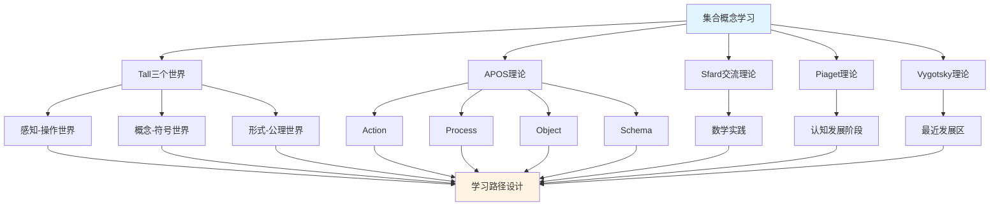

# 集合概念的多理论分析示例 / Multi-Theory Analysis Example: Set Concept

**主题编号 / Topic ID**: C.CORE.001.MULTI
**创建日期 / Created**: 2025年1月 / January 2025
**最后更新 / Last Updated**: 2025年1月 / January 2025
**关联概念 / Related Concepts**: [集合 / Set](./01-集合.md) | [集合-三视角版 / Set-Three Perspectives](./01-集合-三视角版.md)

---

## 📋 概述 / Overview

本文档为"集合"概念提供多理论分析示例，展示如何运用国际主流数学认知理论（Tall三个世界理论、Dubinsky APOS理论、Sfard交流理论、Piaget认知发展理论、Vygotsky社会文化理论）来分析数学概念，为FormalMath概念体系的理论整合提供模板。

This document provides a multi-theory analysis example for the "Set" concept, demonstrating how to apply international mainstream mathematical cognitive theories (Tall's Three Worlds Theory, Dubinsky APOS Theory, Sfard's Commognitive Theory, Piaget's Cognitive Development Theory, Vygotsky's Sociocultural Theory) to analyze mathematical concepts, providing a template for theoretical integration of the FormalMath concept system.

**分析目标 / Analysis Objectives**：

- 展示多理论分析的方法和框架 / Demonstrate methods and frameworks for multi-theory analysis
- 为其他32个核心概念提供分析模板 / Provide analysis templates for other 32 core concepts
- 建立理论整合的应用示例 / Establish application examples of theoretical integration

---

## 🎯 一、Tall三个世界理论分析 / Tall's Three Worlds Theory Analysis (编号: C.CORE.001.MULTI.01)

### 1.1 感知-操作世界（Embodied World）

**集合在感知-操作世界中的理解 / Understanding Sets in the Embodied World**：

- **具体经验 / Concrete Experience**：
  - 通过观察和操作具体物体集合理解集合概念 / Understanding set concepts through observing and manipulating concrete object collections
  - 例如：一篮子苹果、一盒铅笔、一群学生 / Examples: a basket of apples, a box of pencils, a group of students
  - 通过分类活动理解集合的包含关系 / Understanding set inclusion relationships through classification activities

- **身体动作 / Bodily Actions**：
  - 通过数数、分类、比较等动作理解集合 / Understanding sets through actions such as counting, classifying, and comparing
  - 通过画圈、标记等操作表示集合 / Representing sets through operations such as drawing circles and marking
  - 通过集合运算（并、交、差）的具体操作理解 / Understanding through concrete operations of set operations (union, intersection, difference)

- **直观理解 / Intuitive Understanding**：
  - 集合是"一些东西的集合" / A set is a "collection of things"
  - 集合有大小（元素个数） / Sets have size (number of elements)
  - 集合之间有关系（包含、相等、相交等） / Sets have relationships (inclusion, equality, intersection, etc.)

**教学建议 / Teaching Suggestions**：

- 使用具体物体（如积木、卡片）进行集合操作 / Use concrete objects (such as blocks, cards) for set operations
- 通过游戏和活动理解集合概念 / Understand set concepts through games and activities
- 使用图形和图表可视化集合 / Use graphics and diagrams to visualize sets

### 1.2 概念-符号世界（Symbolic World）

**集合在概念-符号世界的理解 / Understanding Sets in the Symbolic World**：

- **符号表示 / Symbolic Representation**：
  - 使用集合符号：$\{1, 2, 3\}$、$\emptyset$、$\mathbb{N}$、$\mathbb{R}$ / Using set notation: $\{1, 2, 3\}$, $\emptyset$, $\mathbb{N}$, $\mathbb{R}$
  - 使用集合运算符号：$\cup$（并）、$\cap$（交）、$\setminus$（差）、$\subseteq$（包含） / Using set operation symbols: $\cup$ (union), $\cap$ (intersection), $\setminus$ (difference), $\subseteq$ (subset)
  - 使用逻辑符号：$\in$（属于）、$\notin$（不属于） / Using logical symbols: $\in$ (element of), $\notin$ (not element of)

- **概念理解 / Conceptual Understanding**：
  - 集合是满足某种性质的对象的全体 / A set is the collection of all objects satisfying a certain property
  - 集合的元素具有确定性、互异性、无序性 / Set elements have determinacy, distinctness, and unorderedness
  - 集合运算遵循特定规律（交换律、结合律、分配律等） / Set operations follow specific laws (commutative, associative, distributive, etc.)

- **抽象操作 / Abstract Operations**：
  - 通过符号操作进行集合运算 / Performing set operations through symbolic operations
  - 通过逻辑推理证明集合关系 / Proving set relationships through logical reasoning
  - 通过集合论语言表达数学概念 / Expressing mathematical concepts through set-theoretic language

**教学建议 / Teaching Suggestions**：

- 逐步引入集合符号 / Gradually introduce set notation
- 通过符号操作练习集合运算 / Practice set operations through symbolic operations
- 使用集合论语言表达数学概念 / Use set-theoretic language to express mathematical concepts

### 1.3 形式-公理世界（Formal World）

**集合在形式-公理世界的理解 / Understanding Sets in the Formal World**：

- **公理系统 / Axiomatic System**：
  - ZFC公理系统（Zermelo-Fraenkel集合论） / ZFC axiom system (Zermelo-Fraenkel set theory)
  - 空集公理、配对公理、并集公理、幂集公理等 / Empty set axiom, pairing axiom, union axiom, power set axiom, etc.
  - 通过公理严格定义集合 / Strictly defining sets through axioms

- **形式化定义 / Formal Definition**：
  - 集合的形式化定义：$x \in A$ 或 $x \notin A$ / Formal definition of set: $x \in A$ or $x \notin A$
  - 集合运算的形式化定义 / Formal definition of set operations
  - 集合关系的严格证明 / Strict proof of set relationships

- **逻辑推理 / Logical Reasoning**：
  - 通过逻辑推理证明集合性质 / Proving set properties through logical reasoning
  - 通过形式化方法研究集合论 / Studying set theory through formal methods
  - 通过公理系统建立数学基础 / Establishing mathematical foundations through axiom systems

**教学建议 / Teaching Suggestions**：

- 介绍ZFC公理系统 / Introduce ZFC axiom system
- 通过形式化证明理解集合性质 / Understand set properties through formal proofs
- 研究集合论在数学基础中的作用 / Study the role of set theory in mathematical foundations

---

## 🔬 二、Dubinsky APOS理论分析 (编号: C.CORE.001.MULTI.02)

### 2.1 Action（动作）

**集合的Action阶段**：

- **具体操作**：
  - 列出集合的元素：$\{1, 2, 3, 4\}$`
  - 判断元素是否属于集合：$2 \in \{1, 2, 3\}$？
  - 进行集合运算：$\{1, 2\} \cup \{2, 3\} = ?$

- **操作特点**：
  - 需要外部指导（教师、教材）
  - 操作是具体的、机械的
  - 需要逐步执行

- **学习活动**：
  - 练习列出集合元素
  - 练习判断元素归属
  - 练习基本集合运算

**教学建议**：

- 提供大量练习机会
- 给予及时反馈
- 逐步增加操作复杂度

### 2.2 Process（过程）

**集合的Process阶段 / Process Stage of Set**：

- **内化过程 / Internalization Process**：
  - 将集合操作内化为心理过程 / Internalizing set operations as a mental process
  - 理解集合运算的内在逻辑 / Understanding the internal logic of set operations
  - 能够独立完成集合运算 / Being able to perform set operations independently

- **过程理解 / Process Understanding**：
  - 理解"并集"是"所有元素的集合" / Understanding that "union" is "the set of all elements"
  - 理解"交集"是"共同元素的集合" / Understanding that "intersection" is "the set of common elements"
  - 理解"差集"是"属于A但不属于B的元素" / Understanding that "difference" is "elements that belong to A but not to B"

- **灵活应用 / Flexible Application**：
  - 能够灵活应用集合运算 / Being able to flexibly apply set operations
  - 能够处理复杂的集合问题 / Being able to handle complex set problems
  - 能够理解集合运算的性质 / Being able to understand properties of set operations

**教学建议 / Teaching Suggestions**：

- 引导学生内化操作过程 / Guide students to internalize operation processes
- 通过变式练习加深理解 / Deepen understanding through variant exercises
- 鼓励学生独立思考和解决问题 / Encourage students to think independently and solve problems

### 2.3 Object（对象）

**集合的Object阶段**：

- **对象化理解**：
  - 将集合视为独立的对象
  - 可以对集合进行操作
  - 可以将集合作为其他概念的基础

- **对象操作**：
  - 集合的集合（幂集）
  - 集合的运算结果仍是集合
  - 集合可以作为函数的定义域和值域

- **抽象理解**：
  - 理解集合的抽象性质
  - 理解集合在数学中的基础地位
  - 理解集合论作为数学基础的作用

**教学建议**：

- 引导学生将集合视为对象
- 研究集合的集合（幂集）
- 探索集合在数学中的广泛应用

### 2.4 Schema（图式）

**集合的Schema阶段**：

- **完整图式**：
  - 整合集合的定义、运算、性质
  - 形成完整的集合概念图式
  - 理解集合与其他数学概念的关系

- **图式应用**：
  - 能够灵活应用集合概念
  - 能够解决复杂的集合问题
  - 能够理解集合论在数学中的作用

- **图式扩展**：
  - 理解集合论的推广（范畴论）
  - 理解集合论在数学基础中的作用
  - 理解集合论与其他数学分支的关系

**教学建议**：

- 帮助学生建立完整的集合概念图式
- 探索集合论与其他数学分支的关系
- 研究集合论在数学基础中的作用

---

## 💬 三、Sfard交流理论分析 / Sfard's Commognitive Theory Analysis (编号: C.CORE.001.MULTI.03)

### 3.1 集合作为交流工具 / Set as a Communication Tool

**集合的交流功能 / Communicative Function of Sets**：

- **数学交流 / Mathematical Communication**：
  - 集合用于表达数学概念：自然数集$\mathbb{N}$、实数集$\mathbb{R}$ / Sets are used to express mathematical concepts: natural number set $\mathbb{N}$, real number set $\mathbb{R}$
  - 集合用于描述数学结构：群、环、域的定义都基于集合 / Sets are used to describe mathematical structures: definitions of groups, rings, and fields are all based on sets
  - 集合用于表达数学关系：函数、映射、关系都基于集合 / Sets are used to express mathematical relationships: functions, mappings, and relations are all based on sets

- **概念表达 / Conceptual Expression**：
  - 通过集合表达"所有满足某种性质的对象" / Expressing "all objects satisfying a certain property" through sets
  - 通过集合运算表达"并"、"交"、"差"等概念 / Expressing concepts such as "union", "intersection", "difference" through set operations
  - 通过集合关系表达"包含"、"相等"等概念 / Expressing concepts such as "inclusion" and "equality" through set relationships

- **问题解决 / Problem Solving**：
  - 使用集合语言表达问题 / Using set language to express problems
  - 使用集合运算解决问题 / Using set operations to solve problems
  - 使用集合论方法证明定理 / Using set theory methods to prove theorems

### 3.2 集合学习的实践参与 / Practice Participation in Set Learning

**通过参与数学实践学习集合 / Learning Sets through Participation in Mathematical Practice**：

- **实践场景 / Practice Scenarios**：
  - 通过分类活动学习集合 / Learning sets through classification activities
  - 通过数据分析学习集合运算 / Learning set operations through data analysis
  - 通过逻辑推理学习集合关系 / Learning set relationships through logical reasoning
  - 通过数学证明学习集合论方法 / Learning set theory methods through mathematical proofs

- **实践方式 / Practice Methods**：
  - 参与数学讨论，使用集合语言 / Participating in mathematical discussions, using set language
  - 解决数学问题，应用集合方法 / Solving mathematical problems, applying set methods
  - 研究数学理论，理解集合论作用 / Studying mathematical theory, understanding the role of set theory

- **学习效果 / Learning Outcomes**：
  - 通过实践理解集合概念 / Understanding set concepts through practice
  - 通过应用掌握集合方法 / Mastering set methods through application
  - 通过参与形成数学思维 / Forming mathematical thinking through participation

**教学建议 / Teaching Suggestions**：

- 设计数学实践活动 / Design mathematical practice activities
- 鼓励学生参与数学讨论 / Encourage students to participate in mathematical discussions
- 提供实际问题解决机会 / Provide opportunities for solving real-world problems

---

## 🧠 四、Piaget认知发展理论分析 / Piaget's Cognitive Development Theory Analysis (编号: C.CORE.001.MULTI.04)

### 4.1 具体运算阶段（7-12岁）/ Concrete Operational Stage (7-12 years)

**集合在具体运算阶段的理解 / Understanding Sets in the Concrete Operational Stage**：

- **具体对象 / Concrete Objects**：
  - 通过具体物体理解集合 / Understanding sets through concrete objects
  - 例如：一篮子苹果、一盒铅笔 / Examples: a basket of apples, a box of pencils
  - 需要具体对象支持理解 / Requires concrete object support for understanding

- **逻辑思维 / Logical Thinking**：
  - 能够理解集合的包含关系 / Being able to understand set inclusion relationships
  - 能够进行简单的集合运算 / Being able to perform simple set operations
  - 但需要具体对象支持 / But requires concrete object support

- **教学建议 / Teaching Suggestions**：
  - 使用具体物体和图形 / Use concrete objects and graphics
  - 通过游戏和活动学习 / Learn through games and activities
  - 逐步引入抽象概念 / Gradually introduce abstract concepts

### 4.2 形式运算阶段（12+岁）/ Formal Operational Stage (12+ years)

**集合在形式运算阶段的理解 / Understanding Sets in the Formal Operational Stage**：

- **抽象思维 / Abstract Thinking**：
  - 能够理解抽象的集合概念 / Being able to understand abstract set concepts
  - 能够进行符号操作 / Being able to perform symbolic operations
  - 能够进行逻辑推理 / Being able to perform logical reasoning

- **形式推理 / Formal Reasoning**：
  - 能够证明集合性质 / Being able to prove set properties
  - 能够理解集合论公理 / Being able to understand set theory axioms
  - 能够研究集合论理论 / Being able to study set theory

- **教学建议 / Teaching Suggestions**：
  - 引入抽象概念和符号 / Introduce abstract concepts and symbols
  - 进行逻辑推理训练 / Conduct logical reasoning training
  - 研究集合论理论 / Study set theory

---

## 🌍 五、Vygotsky社会文化理论分析 / Vygotsky's Sociocultural Theory Analysis (编号: C.CORE.001.MULTI.05)

### 5.1 最近发展区（ZPD）/ Zone of Proximal Development (ZPD)

**集合学习的最近发展区 / Zone of Proximal Development in Set Learning**：

- **独立水平 / Independent Level**：
  - 学生可以独立理解集合的基本概念 / Students can independently understand basic set concepts
  - 学生可以独立进行基本集合运算 / Students can independently perform basic set operations
  - 学生可以独立解决简单集合问题 / Students can independently solve simple set problems

- **最近发展区 / Zone of Proximal Development**：
  - 需要指导才能理解集合的抽象性质 / Requires guidance to understand abstract properties of sets
  - 需要指导才能掌握复杂集合运算 / Requires guidance to master complex set operations
  - 需要指导才能解决复杂集合问题 / Requires guidance to solve complex set problems

- **潜在水平 / Potential Level**：
  - 未来可能理解集合论公理系统 / May understand set theory axiom systems in the future
  - 未来可能掌握集合论方法 / May master set theory methods in the future
  - 未来可能研究集合论理论 / May study set theory in the future

### 5.2 社会文化工具 / Sociocultural Tools

**集合作为社会文化工具 / Sets as Sociocultural Tools**：

- **数学符号 / Mathematical Symbols**：
  - 集合符号是数学交流的工具 / Set symbols are tools for mathematical communication
  - 通过社会文化实践学习集合符号 / Learning set symbols through sociocultural practice
  - 通过数学实践掌握集合方法 / Mastering set methods through mathematical practice

- **数学语言 / Mathematical Language**：
  - 集合论语言是数学表达的工具 / Set-theoretic language is a tool for mathematical expression
  - 通过参与数学实践学习集合语言 / Learning set language through participation in mathematical practice
  - 通过数学交流掌握集合表达 / Mastering set expression through mathematical communication

**教学建议 / Teaching Suggestions**：

- 提供适当的学习支持 / Provide appropriate learning support
- 设计最近发展区的学习活动 / Design learning activities in the zone of proximal development
- 鼓励学生参与数学实践和交流 / Encourage students to participate in mathematical practice and communication

---

## 🔄 六、多理论整合分析 / Multi-Theory Integration Analysis (编号: C.CORE.001.MULTI.06)

### 6.1 理论共同点 / Theoretical Commonalities

**各理论在集合概念分析中的共同点 / Commonalities of Theories in Set Concept Analysis**：

1. **多层次理解 / Multi-Level Understanding**：
   - 都强调从具体到抽象的发展 / All emphasize development from concrete to abstract
   - Tall的三个世界、APOS的四个阶段、Piaget的发展阶段都体现这一点 / Tall's three worlds, APOS's four stages, and Piaget's developmental stages all reflect this

2. **实践重要性 / Importance of Practice**：
   - 都强调实践在学习中的作用 / All emphasize the role of practice in learning
   - Sfard的交流理论、Vygotsky的社会文化理论都强调这一点 / Sfard's communication theory and Vygotsky's sociocultural theory both emphasize this

3. **认知发展 / Cognitive Development**：
   - 都关注认知发展的过程 / All focus on the process of cognitive development
   - 各理论都描述了从简单到复杂的发展 / Each theory describes development from simple to complex

### 6.2 理论互补性 / Theoretical Complementarity

**各理论在集合概念分析中的互补性 / Complementarity of Theories in Set Concept Analysis**：

1. **Tall三个世界 / Tall's Three Worlds**：
   - 适用于理解集合概念的不同层次 / Applicable to understanding different levels of set concepts
   - 从感知操作到形式公理的发展 / Development from embodied operations to formal axioms

2. **APOS理论 / APOS Theory**：
   - 适用于分析集合概念的学习过程 / Applicable to analyzing the learning process of set concepts
   - 从动作到图式的发展 / Development from action to schema

3. **Sfard交流理论 / Sfard's Communication Theory**：
   - 适用于设计集合概念的实践活动 / Applicable to designing practice activities for set concepts
   - 通过数学实践学习集合 / Learning sets through mathematical practice

4. **Piaget理论 / Piaget's Theory**：
   - 适用于理解集合概念的认知发展阶段 / Applicable to understanding cognitive development stages of set concepts
   - 从具体运算到形式运算的发展 / Development from concrete operations to formal operations

5. **Vygotsky理论 / Vygotsky's Theory**：
   - 适用于设计集合概念的学习支持 / Applicable to designing learning support for set concepts
   - 通过最近发展区促进学习 / Promoting learning through the zone of proximal development

### 6.3 整合应用框架

**多理论整合应用**：

---

## 📊 七、集合概念的多理论学习路径 (编号: C.CORE.001.MULTI.07)

### 7.1 入门阶段（Tall感知-操作世界 + APOS Action）

**学习目标**：

- 通过具体物体理解集合概念
- 掌握基本集合操作

**学习活动**：

- 使用具体物体（积木、卡片）进行集合操作
- 练习列出集合元素
- 练习判断元素归属
- 练习基本集合运算

**评估标准**：

- 能够独立完成基本集合操作
- 能够理解集合的基本概念

### 7.2 中级阶段（Tall概念-符号世界 + APOS Process/Object）

**学习目标**：

- 理解集合的符号表示
- 掌握集合运算的内在逻辑
- 将集合视为对象

**学习活动**：

- 学习集合符号和运算符号
- 通过符号操作进行集合运算
- 理解集合运算的性质
- 研究集合的集合（幂集）

**评估标准**：

- 能够灵活应用集合符号
- 能够理解集合运算的内在逻辑
- 能够将集合视为对象进行操作

### 7.3 高级阶段（Tall形式-公理世界 + APOS Schema + Sfard实践）

**学习目标**：

- 理解集合论公理系统
- 形成完整的集合概念图式
- 通过数学实践应用集合论

**学习活动**：

- 学习ZFC公理系统
- 通过形式化证明理解集合性质
- 研究集合论在数学基础中的作用
- 参与数学实践，应用集合论方法

**评估标准**：

- 能够理解集合论公理系统
- 能够形成完整的集合概念图式
- 能够通过数学实践应用集合论

---

## 🎓 八、教学建议 / Teaching Suggestions (编号: C.CORE.001.MULTI.08)

### 8.1 基于多理论的教学设计 / Multi-Theory Based Teaching Design

**教学设计原则 / Teaching Design Principles**：

1. **多层次设计 / Multi-Level Design**：
   - 从感知操作到形式公理 / From embodied operations to formal axioms
   - 从动作到图式 / From action to schema
   - 从具体运算到形式运算 / From concrete operations to formal operations

2. **实践导向 / Practice-Oriented**：
   - 设计数学实践活动 / Design mathematical practice activities
   - 鼓励学生参与数学交流 / Encourage students to participate in mathematical communication
   - 提供实际问题解决机会 / Provide opportunities for solving real-world problems

3. **学习支持 / Learning Support**：
   - 提供适当的学习支持 / Provide appropriate learning support
   - 设计最近发展区的学习活动 / Design learning activities in the zone of proximal development
   - 给予及时反馈 / Give timely feedback

### 8.2 具体教学策略 / Specific Teaching Strategies

**入门阶段策略 / Entry Stage Strategies**：

- 使用具体物体和图形 / Use concrete objects and graphics
- 通过游戏和活动学习 / Learn through games and activities
- 提供大量练习机会 / Provide ample practice opportunities

**中级阶段策略 / Intermediate Stage Strategies**：

- 逐步引入抽象概念和符号 / Gradually introduce abstract concepts and symbols
- 通过变式练习加深理解 / Deepen understanding through variant exercises
- 鼓励学生独立思考和解决问题 / Encourage students to think independently and solve problems

**高级阶段策略 / Advanced Stage Strategies**：

- 引入公理系统和形式化方法 / Introduce axiom systems and formal methods
- 研究集合论理论 / Study set theory
- 参与数学实践和研究 / Participate in mathematical practice and research

---

## 🔗 九、关联文档 (编号: C.CORE.001.MULTI.09)

### 9.1 核心概念文档

- [集合](./01-集合.md)
- [集合-三视角版](./01-集合-三视角版.md)
- [集合-决策导图示例](./01-集合-决策导图示例-2025年1月.md)

### 9.2 理论框架文档

- [国际主流数学认知理论整合框架](../00-国际主流数学认知理论整合框架-2025年1月.md)
- [概念体系深度改进计划](../00-概念体系深度改进计划-2025年1月.md)

---

## ✅ 十、总结 (编号: C.CORE.001.MULTI.10)

### 10.1 多理论分析的价值

**多理论分析的优势**：

1. **全面理解**：
   - 从多个角度理解集合概念
   - 理解集合概念的不同层次
   - 理解集合概念的学习过程

2. **教学设计**：
   - 基于多理论设计教学
   - 提供多层次学习支持
   - 设计实践活动

3. **学习路径**：
   - 设计基于多理论的学习路径
   - 支持不同认知发展阶段的学习
   - 促进概念理解的发展

### 10.2 应用推广

**为其他32个核心概念建立多理论分析**：

- 使用本文档作为模板
- 为每个概念建立多理论分析
- 建立33个核心概念的多理论分析体系

---

**创建日期**: 2025年1月
**最后更新**: 2025年1月
**维护状态**: 持续更新中
**状态**: ✅ 示例完成
