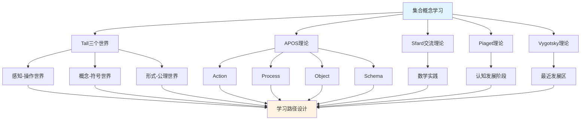

# 集合概念的多理论分析示例 / Multi-Theory Analysis Example: Set Concept

**主题编号 / Topic ID**: C.CORE.001.MULTI
**创建日期 / Created**: 2025年1月 / January 2025
**最后更新 / Last Updated**: 2025年1月 / January 2025
**关联概念 / Related Concepts**: [集合 / Set](./01-集合.md) | [集合-三视角版 / Set-Three Perspectives](./01-集合-三视角版.md)

---

## 📋 概述 / Overview

本文档为"集合"概念提供多理论分析示例，展示如何运用国际主流数学认知理论（Tall三个世界理论、Dubinsky APOS理论、Sfard交流理论、Piaget认知发展理论、Vygotsky社会文化理论）来分析数学概念，为FormalMath概念体系的理论整合提供模板。

This document provides a multi-theory analysis example for the "Set" concept, demonstrating how to apply international mainstream mathematical cognitive theories (Tall's Three Worlds Theory, Dubinsky APOS Theory, Sfard's Commognitive Theory, Piaget's Cognitive Development Theory, Vygotsky's Sociocultural Theory) to analyze mathematical concepts, providing a template for theoretical integration of the FormalMath concept system.

**分析目标 / Analysis Objectives**：

- 展示多理论分析的方法和框架 / Demonstrate methods and frameworks for multi-theory analysis
- 为其他32个核心概念提供分析模板 / Provide analysis templates for other 32 core concepts
- 建立理论整合的应用示例 / Establish application examples of theoretical integration

---

## 📑 目录 / Table of Contents

- [集合概念的多理论分析示例 / Multi-Theory Analysis Example: Set Concept](#集合概念的多理论分析示例--multi-theory-analysis-example-set-concept)
  - [📋 概述 / Overview](#-概述--overview)
  - [📑 目录 / Table of Contents](#-目录--table-of-contents)
  - [🎯 一、Tall三个世界理论分析 / Tall's Three Worlds Theory Analysis (编号: C.CORE.001.MULTI.01)](#-一tall三个世界理论分析--talls-three-worlds-theory-analysis-编号-ccore001multi01)
    - [1.1 感知-操作世界（Embodied World）](#11-感知-操作世界embodied-world)
    - [1.2 概念-符号世界（Symbolic World）](#12-概念-符号世界symbolic-world)
    - [1.3 形式-公理世界（Formal World）](#13-形式-公理世界formal-world)
    - [1.4 三个世界的转换 / Transitions Between Worlds](#14-三个世界的转换--transitions-between-worlds)
  - [🔬 二、Dubinsky APOS理论分析 (编号: C.CORE.001.MULTI.02)](#-二dubinsky-apos理论分析-编号-ccore001multi02)
    - [2.1 Action（动作）](#21-action动作)
    - [2.2 Process（过程）](#22-process过程)
    - [2.3 Object（对象）](#23-object对象)
    - [2.4 Schema（图式）](#24-schema图式)
    - [2.5 APOS发展路径 / APOS Development Path](#25-apos发展路径--apos-development-path)
  - [💬 三、Sfard交流理论分析 / Sfard's Commognitive Theory Analysis (编号: C.CORE.001.MULTI.03)](#-三sfard交流理论分析--sfards-commognitive-theory-analysis-编号-ccore001multi03)
    - [3.1 集合作为交流工具 / Set as a Communication Tool](#31-集合作为交流工具--set-as-a-communication-tool)
    - [3.2 集合学习的实践参与 / Practice Participation in Set Learning](#32-集合学习的实践参与--practice-participation-in-set-learning)
  - [🧠 四、Piaget认知发展理论分析 / Piaget's Cognitive Development Theory Analysis (编号: C.CORE.001.MULTI.04)](#-四piaget认知发展理论分析--piagets-cognitive-development-theory-analysis-编号-ccore001multi04)
    - [4.1 具体运算阶段（7-12岁）/ Concrete Operational Stage (7-12 years)](#41-具体运算阶段7-12岁-concrete-operational-stage-7-12-years)
    - [4.2 形式运算阶段（12+岁）/ Formal Operational Stage (12+ years)](#42-形式运算阶段12岁-formal-operational-stage-12-years)
  - [🌍 五、Vygotsky社会文化理论分析 / Vygotsky's Sociocultural Theory Analysis (编号: C.CORE.001.MULTI.05)](#-五vygotsky社会文化理论分析--vygotskys-sociocultural-theory-analysis-编号-ccore001multi05)
    - [5.1 最近发展区（ZPD）/ Zone of Proximal Development (ZPD)](#51-最近发展区zpd-zone-of-proximal-development-zpd)
    - [5.2 社会文化工具 / Sociocultural Tools](#52-社会文化工具--sociocultural-tools)
  - [🔄 六、多理论整合分析 / Multi-Theory Integration Analysis (编号: C.CORE.001.MULTI.06)](#-六多理论整合分析--multi-theory-integration-analysis-编号-ccore001multi06)
    - [6.1 理论共同点 / Theoretical Commonalities](#61-理论共同点--theoretical-commonalities)
    - [6.2 理论互补性 / Theoretical Complementarity](#62-理论互补性--theoretical-complementarity)
    - [6.3 整合应用框架](#63-整合应用框架)
  - [📊 七、集合概念的多理论学习路径 / Multi-Theory Learning Path for Set Concept (编号: C.CORE.001.MULTI.07)](#-七集合概念的多理论学习路径--multi-theory-learning-path-for-set-concept-编号-ccore001multi07)
    - [7.1 入门阶段（Tall感知-操作世界 + APOS Action）/ Entry Stage (Tall Embodied World + APOS Action)](#71-入门阶段tall感知-操作世界--apos-action-entry-stage-tall-embodied-world--apos-action)
    - [7.2 中级阶段（Tall概念-符号世界 + APOS Process/Object）/ Intermediate Stage (Tall Symbolic World + APOS Process/Object)](#72-中级阶段tall概念-符号世界--apos-processobject-intermediate-stage-tall-symbolic-world--apos-processobject)
    - [7.3 高级阶段（Tall形式-公理世界 + APOS Schema + Sfard实践）/ Advanced Stage (Tall Formal World + APOS Schema + Sfard Practice)](#73-高级阶段tall形式-公理世界--apos-schema--sfard实践-advanced-stage-tall-formal-world--apos-schema--sfard-practice)
  - [🧠 七、元认知理论分析 / Metacognitive Theory Analysis (编号: C.CORE.001.MULTI.07)](#-七元认知理论分析--metacognitive-theory-analysis-编号-ccore001multi07)
    - [7.1 元认知知识（Metacognitive Knowledge）](#71-元认知知识metacognitive-knowledge)
    - [7.2 元认知监控（Metacognitive Monitoring）](#72-元认知监控metacognitive-monitoring)
    - [7.3 元认知调节（Metacognitive Regulation）](#73-元认知调节metacognitive-regulation)
  - [🎓 八、教学建议 / Teaching Suggestions (编号: C.CORE.001.MULTI.08)](#-八教学建议--teaching-suggestions-编号-ccore001multi08)
    - [8.1 基于多理论的教学设计 / Multi-Theory Based Teaching Design](#81-基于多理论的教学设计--multi-theory-based-teaching-design)
    - [8.2 具体教学策略 / Specific Teaching Strategies](#82-具体教学策略--specific-teaching-strategies)
  - [🔗 九、关联文档 / Related Documents (编号: C.CORE.001.MULTI.09)](#-九关联文档--related-documents-编号-ccore001multi09)
    - [9.1 核心概念文档 / Core Concept Documents](#91-核心概念文档--core-concept-documents)
    - [9.2 理论框架文档 / Theoretical Framework Documents](#92-理论框架文档--theoretical-framework-documents)
  - [✅ 十、总结 / Summary (编号: C.CORE.001.MULTI.10)](#-十总结--summary-编号-ccore001multi10)
    - [10.1 多理论分析的价值 / Value of Multi-Theory Analysis](#101-多理论分析的价值--value-of-multi-theory-analysis)
    - [10.2 应用推广 / Application and Extension](#102-应用推广--application-and-extension)

---

## 🎯 一、Tall三个世界理论分析 / Tall's Three Worlds Theory Analysis (编号: C.CORE.001.MULTI.01)

### 1.1 感知-操作世界（Embodied World）

**集合在感知-操作世界中的理解 / Understanding Sets in the Embodied World**：

- **具体经验 / Concrete Experience**：
  - 通过观察和操作具体物体集合理解集合概念 / Understanding set concepts through observing and manipulating concrete object collections
  - 例如：一篮子苹果、一盒铅笔、一群学生 / Examples: a basket of apples, a box of pencils, a group of students
  - 通过分类活动理解集合的包含关系 / Understanding set inclusion relationships through classification activities

- **身体动作 / Bodily Actions**：
  - 通过数数、分类、比较等动作理解集合 / Understanding sets through actions such as counting, classifying, and comparing
  - 通过画圈、标记等操作表示集合 / Representing sets through operations such as drawing circles and marking
  - 通过集合运算（并、交、差）的具体操作理解 / Understanding through concrete operations of set operations (union, intersection, difference)

- **直观理解 / Intuitive Understanding**：
  - 集合是"一些东西的集合" / A set is a "collection of things"
  - 集合有大小（元素个数） / Sets have size (number of elements)
  - 集合之间有关系（包含、相等、相交等） / Sets have relationships (inclusion, equality, intersection, etc.)

**教学建议 / Teaching Suggestions**：

- 使用具体物体（如积木、卡片）进行集合操作 / Use concrete objects (such as blocks, cards) for set operations
- 通过游戏和活动理解集合概念 / Understand set concepts through games and activities
- 使用图形和图表可视化集合 / Use graphics and diagrams to visualize sets

### 1.2 概念-符号世界（Symbolic World）

**集合在概念-符号世界的理解 / Understanding Sets in the Symbolic World**：

- **符号表示 / Symbolic Representation**：
  - 使用集合符号：$\{1, 2, 3\}$、$\emptyset$、$\mathbb{N}$、$\mathbb{R}$ / Using set notation: $\{1, 2, 3\}$, $\emptyset$, $\mathbb{N}$, $\mathbb{R}$
  - 使用集合运算符号：$\cup$（并）、$\cap$（交）、$\setminus$（差）、$\subseteq$（包含） / Using set operation symbols: $\cup$ (union), $\cap$ (intersection), $\setminus$ (difference), $\subseteq$ (subset)
  - 使用逻辑符号：$\in$（属于）、$\notin$（不属于） / Using logical symbols: $\in$ (element of), $\notin$ (not element of)

- **概念理解 / Conceptual Understanding**：
  - 集合是满足某种性质的对象的全体 / A set is the collection of all objects satisfying a certain property
  - 集合的元素具有确定性、互异性、无序性 / Set elements have determinacy, distinctness, and unorderedness
  - 集合运算遵循特定规律（交换律、结合律、分配律等） / Set operations follow specific laws (commutative, associative, distributive, etc.)

- **抽象操作 / Abstract Operations**：
  - 通过符号操作进行集合运算 / Performing set operations through symbolic operations
  - 通过逻辑推理证明集合关系 / Proving set relationships through logical reasoning
  - 通过集合论语言表达数学概念 / Expressing mathematical concepts through set-theoretic language

**教学建议 / Teaching Suggestions**：

- 逐步引入集合符号 / Gradually introduce set notation
- 通过符号操作练习集合运算 / Practice set operations through symbolic operations
- 使用集合论语言表达数学概念 / Use set-theoretic language to express mathematical concepts

### 1.3 形式-公理世界（Formal World）

**集合在形式-公理世界的理解 / Understanding Sets in the Formal World**：

- **公理系统 / Axiomatic System**：
  - ZFC公理系统（Zermelo-Fraenkel集合论） / ZFC axiom system (Zermelo-Fraenkel set theory)
  - 空集公理、配对公理、并集公理、幂集公理等 / Empty set axiom, pairing axiom, union axiom, power set axiom, etc.
  - 通过公理严格定义集合 / Strictly defining sets through axioms

- **形式化定义 / Formal Definition**：
  - 集合的形式化定义：$x \in A$ 或 $x \notin A$ / Formal definition of set: $x \in A$ or $x \notin A$
  - 集合运算的形式化定义 / Formal definition of set operations
  - 集合关系的严格证明 / Strict proof of set relationships

- **逻辑推理 / Logical Reasoning**：
  - 通过逻辑推理证明集合性质 / Proving set properties through logical reasoning
  - 通过形式化方法研究集合论 / Studying set theory through formal methods
  - 通过公理系统建立数学基础 / Establishing mathematical foundations through axiom systems

**教学建议 / Teaching Suggestions**：

- 介绍ZFC公理系统 / Introduce ZFC axiom system
- 通过形式化证明理解集合性质 / Understand set properties through formal proofs
- 研究集合论在数学基础中的作用 / Study the role of set theory in mathematical foundations

### 1.4 三个世界的转换 / Transitions Between Worlds

**转换路径 / Transition Paths**：

1. **从感知-操作到概念-符号 / From Embodied to Symbolic**：
   - 将具体物体集合抽象为集合符号 / Abstracting concrete object collections into set notation
   - 从操作中提取集合概念 / Extracting set concepts from operations
   - 例如：从"一篮子苹果"到"集合$A = \{苹果_1, 苹果_2, \ldots\}$" / Example: from "a basket of apples" to "set $A = \{apple_1, apple_2, \ldots\}$"

2. **从概念-符号到形式-公理 / From Symbolic to Formal**：
   - 将集合概念形式化为公理 / Formalizing set concepts into axioms
   - 从符号操作到逻辑推理 / From symbolic operations to logical reasoning
   - 例如：从"$A \cup B$"到"并集公理" / Example: from "$A \cup B$" to "union axiom"

**转换支持 / Transition Support**：

- **识别转换困难 / Identifying Transition Difficulties**：
  - 识别从具体到抽象的困难 / Identifying difficulties in transitioning from concrete to abstract
  - 识别从符号到形式的困难 / Identifying difficulties in transitioning from symbolic to formal

- **设计转换活动 / Designing Transition Activities**：
  - 设计过渡活动支持转换 / Designing transition activities to support transitions
  - 提供渐进式支持 / Providing progressive support

- **评估转换效果 / Assessing Transition Effectiveness**：
  - 评估转换成功 / Assessing transition success
  - 提供反馈支持 / Providing feedback support

---

## 🔬 二、Dubinsky APOS理论分析 (编号: C.CORE.001.MULTI.02)

### 2.1 Action（动作）

**集合的Action阶段**：

- **具体操作**：
  - 列出集合的元素：$\{1, 2, 3, 4\}$`
  - 判断元素是否属于集合：$2 \in \{1, 2, 3\}$？
  - 进行集合运算：$\{1, 2\} \cup \{2, 3\} = ?$

- **操作特点**：
  - 需要外部指导（教师、教材）
  - 操作是具体的、机械的
  - 需要逐步执行

- **学习活动**：
  - 练习列出集合元素
  - 练习判断元素归属
  - 练习基本集合运算

**教学建议**：

- 提供大量练习机会
- 给予及时反馈
- 逐步增加操作复杂度

### 2.2 Process（过程）

**集合的Process阶段 / Process Stage of Set**：

- **内化过程 / Internalization Process**：
  - 将集合操作内化为心理过程 / Internalizing set operations as a mental process
  - 理解集合运算的内在逻辑 / Understanding the internal logic of set operations
  - 能够独立完成集合运算 / Being able to perform set operations independently

- **过程理解 / Process Understanding**：
  - 理解"并集"是"所有元素的集合" / Understanding that "union" is "the set of all elements"
  - 理解"交集"是"共同元素的集合" / Understanding that "intersection" is "the set of common elements"
  - 理解"差集"是"属于A但不属于B的元素" / Understanding that "difference" is "elements that belong to A but not to B"

- **灵活应用 / Flexible Application**：
  - 能够灵活应用集合运算 / Being able to flexibly apply set operations
  - 能够处理复杂的集合问题 / Being able to handle complex set problems
  - 能够理解集合运算的性质 / Being able to understand properties of set operations

**教学建议 / Teaching Suggestions**：

- 引导学生内化操作过程 / Guide students to internalize operation processes
- 通过变式练习加深理解 / Deepen understanding through variant exercises
- 鼓励学生独立思考和解决问题 / Encourage students to think independently and solve problems

### 2.3 Object（对象）

**集合的Object阶段**：

- **对象化理解**：
  - 将集合视为独立的对象
  - 可以对集合进行操作
  - 可以将集合作为其他概念的基础

- **对象操作**：
  - 集合的集合（幂集）
  - 集合的运算结果仍是集合
  - 集合可以作为函数的定义域和值域

- **抽象理解**：
  - 理解集合的抽象性质
  - 理解集合在数学中的基础地位
  - 理解集合论作为数学基础的作用

**教学建议**：

- 引导学生将集合视为对象
- 研究集合的集合（幂集）
- 探索集合在数学中的广泛应用

### 2.4 Schema（图式）

**集合的Schema阶段**：

- **完整图式**：
  - 整合集合的定义、运算、性质
  - 形成完整的集合概念图式
  - 理解集合与其他数学概念的关系

- **图式应用**：
  - 能够灵活应用集合概念
  - 能够解决复杂的集合问题
  - 能够理解集合论在数学中的作用

- **图式扩展**：
  - 理解集合论的推广（范畴论）
  - 理解集合论在数学基础中的作用
  - 理解集合论与其他数学分支的关系

**教学建议**：

- 帮助学生建立完整的集合概念图式
- 探索集合论与其他数学分支的关系
- 研究集合论在数学基础中的作用

### 2.5 APOS发展路径 / APOS Development Path

**发展过程 / Development Process**：

1. **Action → Process / 动作到过程**：
   - 将外部集合操作内化为心理过程 / Internalizing external set operations as mental processes
   - 从需要指导到独立完成 / From needing guidance to independent completion
   - 例如：从"计算$A \cup B$"到"理解并集过程" / Example: from "computing $A \cup B$" to "understanding the union process"

2. **Process → Object / 过程到对象**：
   - 将集合运算过程对象化 / Objectifying set operation processes
   - 从过程理解到对象理解 / From process understanding to object understanding
   - 例如：从"理解并集过程"到"将集合视为对象" / Example: from "understanding the union process" to "treating sets as objects"

3. **Object → Schema / 对象到图式**：
   - 整合多个集合对象和过程 / Integrating multiple set objects and processes
   - 形成完整的集合概念图式 / Forming a complete set concept schema
   - 例如：整合集合的各种理解和应用 / Example: integrating various understandings and applications of sets

**发展支持 / Development Support**：

- **识别发展困难 / Identifying Development Difficulties**：
  - 识别Action到Process的困难 / Identifying difficulties from Action to Process
  - 识别Process到Object的困难 / Identifying difficulties from Process to Object
  - 识别Object到Schema的困难 / Identifying difficulties from Object to Schema

- **设计发展活动 / Designing Development Activities**：
  - 设计过渡活动支持发展 / Designing transition activities to support development
  - 提供渐进式支持 / Providing progressive support

- **评估发展效果 / Assessing Development Effectiveness**：
  - 评估发展成功 / Assessing development success
  - 提供反馈支持 / Providing feedback support

---

## 💬 三、Sfard交流理论分析 / Sfard's Commognitive Theory Analysis (编号: C.CORE.001.MULTI.03)

### 3.1 集合作为交流工具 / Set as a Communication Tool

**集合的交流功能 / Communicative Function of Sets**：

- **数学交流 / Mathematical Communication**：
  - 集合用于表达数学概念：自然数集$\mathbb{N}$、实数集$\mathbb{R}$ / Sets are used to express mathematical concepts: natural number set $\mathbb{N}$, real number set $\mathbb{R}$
  - 集合用于描述数学结构：群、环、域的定义都基于集合 / Sets are used to describe mathematical structures: definitions of groups, rings, and fields are all based on sets
  - 集合用于表达数学关系：函数、映射、关系都基于集合 / Sets are used to express mathematical relationships: functions, mappings, and relations are all based on sets

- **概念表达 / Conceptual Expression**：
  - 通过集合表达"所有满足某种性质的对象" / Expressing "all objects satisfying a certain property" through sets
  - 通过集合运算表达"并"、"交"、"差"等概念 / Expressing concepts such as "union", "intersection", "difference" through set operations
  - 通过集合关系表达"包含"、"相等"等概念 / Expressing concepts such as "inclusion" and "equality" through set relationships

- **问题解决 / Problem Solving**：
  - 使用集合语言表达问题 / Using set language to express problems
  - 使用集合运算解决问题 / Using set operations to solve problems
  - 使用集合论方法证明定理 / Using set theory methods to prove theorems

### 3.2 集合学习的实践参与 / Practice Participation in Set Learning

**通过参与数学实践学习集合 / Learning Sets through Participation in Mathematical Practice**：

- **实践场景 / Practice Scenarios**：
  - 通过分类活动学习集合 / Learning sets through classification activities
  - 通过数据分析学习集合运算 / Learning set operations through data analysis
  - 通过逻辑推理学习集合关系 / Learning set relationships through logical reasoning
  - 通过数学证明学习集合论方法 / Learning set theory methods through mathematical proofs

- **实践方式 / Practice Methods**：
  - 参与数学讨论，使用集合语言 / Participating in mathematical discussions, using set language
  - 解决数学问题，应用集合方法 / Solving mathematical problems, applying set methods
  - 研究数学理论，理解集合论作用 / Studying mathematical theory, understanding the role of set theory

- **学习效果 / Learning Outcomes**：
  - 通过实践理解集合概念 / Understanding set concepts through practice
  - 通过应用掌握集合方法 / Mastering set methods through application
  - 通过参与形成数学思维 / Forming mathematical thinking through participation

**教学建议 / Teaching Suggestions**：

- 设计数学实践活动 / Design mathematical practice activities
- 鼓励学生参与数学讨论 / Encourage students to participate in mathematical discussions
- 提供实际问题解决机会 / Provide opportunities for solving real-world problems

---

## 🧠 四、Piaget认知发展理论分析 / Piaget's Cognitive Development Theory Analysis (编号: C.CORE.001.MULTI.04)

### 4.1 具体运算阶段（7-12岁）/ Concrete Operational Stage (7-12 years)

**集合在具体运算阶段的理解 / Understanding Sets in the Concrete Operational Stage**：

- **具体对象 / Concrete Objects**：
  - 通过具体物体理解集合 / Understanding sets through concrete objects
  - 例如：一篮子苹果、一盒铅笔 / Examples: a basket of apples, a box of pencils
  - 需要具体对象支持理解 / Requires concrete object support for understanding

- **逻辑思维 / Logical Thinking**：
  - 能够理解集合的包含关系 / Being able to understand set inclusion relationships
  - 能够进行简单的集合运算 / Being able to perform simple set operations
  - 但需要具体对象支持 / But requires concrete object support

- **教学建议 / Teaching Suggestions**：
  - 使用具体物体和图形 / Use concrete objects and graphics
  - 通过游戏和活动学习 / Learn through games and activities
  - 逐步引入抽象概念 / Gradually introduce abstract concepts

### 4.2 形式运算阶段（12+岁）/ Formal Operational Stage (12+ years)

**集合在形式运算阶段的理解 / Understanding Sets in the Formal Operational Stage**：

- **抽象思维 / Abstract Thinking**：
  - 能够理解抽象的集合概念 / Being able to understand abstract set concepts
  - 能够进行符号操作 / Being able to perform symbolic operations
  - 能够进行逻辑推理 / Being able to perform logical reasoning

- **形式推理 / Formal Reasoning**：
  - 能够证明集合性质 / Being able to prove set properties
  - 能够理解集合论公理 / Being able to understand set theory axioms
  - 能够研究集合论理论 / Being able to study set theory

- **教学建议 / Teaching Suggestions**：
  - 引入抽象概念和符号 / Introduce abstract concepts and symbols
  - 进行逻辑推理训练 / Conduct logical reasoning training
  - 研究集合论理论 / Study set theory

---

## 🌍 五、Vygotsky社会文化理论分析 / Vygotsky's Sociocultural Theory Analysis (编号: C.CORE.001.MULTI.05)

### 5.1 最近发展区（ZPD）/ Zone of Proximal Development (ZPD)

**集合学习的最近发展区 / Zone of Proximal Development in Set Learning**：

- **独立水平 / Independent Level**：
  - 学生可以独立理解集合的基本概念 / Students can independently understand basic set concepts
  - 学生可以独立进行基本集合运算 / Students can independently perform basic set operations
  - 学生可以独立解决简单集合问题 / Students can independently solve simple set problems

- **最近发展区 / Zone of Proximal Development**：
  - 需要指导才能理解集合的抽象性质 / Requires guidance to understand abstract properties of sets
  - 需要指导才能掌握复杂集合运算 / Requires guidance to master complex set operations
  - 需要指导才能解决复杂集合问题 / Requires guidance to solve complex set problems

- **潜在水平 / Potential Level**：
  - 未来可能理解集合论公理系统 / May understand set theory axiom systems in the future
  - 未来可能掌握集合论方法 / May master set theory methods in the future
  - 未来可能研究集合论理论 / May study set theory in the future

### 5.2 社会文化工具 / Sociocultural Tools

**集合作为社会文化工具 / Sets as Sociocultural Tools**：

- **数学符号 / Mathematical Symbols**：
  - 集合符号是数学交流的工具 / Set symbols are tools for mathematical communication
  - 通过社会文化实践学习集合符号 / Learning set symbols through sociocultural practice
  - 通过数学实践掌握集合方法 / Mastering set methods through mathematical practice

- **数学语言 / Mathematical Language**：
  - 集合论语言是数学表达的工具 / Set-theoretic language is a tool for mathematical expression
  - 通过参与数学实践学习集合语言 / Learning set language through participation in mathematical practice
  - 通过数学交流掌握集合表达 / Mastering set expression through mathematical communication

**教学建议 / Teaching Suggestions**：

- 提供适当的学习支持 / Provide appropriate learning support
- 设计最近发展区的学习活动 / Design learning activities in the zone of proximal development
- 鼓励学生参与数学实践和交流 / Encourage students to participate in mathematical practice and communication

---

## 🔄 六、多理论整合分析 / Multi-Theory Integration Analysis (编号: C.CORE.001.MULTI.06)

### 6.1 理论共同点 / Theoretical Commonalities

**各理论在集合概念分析中的共同点 / Commonalities of Theories in Set Concept Analysis**：

1. **多层次理解 / Multi-Level Understanding**：
   - 都强调从具体到抽象的发展 / All emphasize development from concrete to abstract
   - Tall的三个世界、APOS的四个阶段、Piaget的发展阶段都体现这一点 / Tall's three worlds, APOS's four stages, and Piaget's developmental stages all reflect this

2. **实践重要性 / Importance of Practice**：
   - 都强调实践在学习中的作用 / All emphasize the role of practice in learning
   - Sfard的交流理论、Vygotsky的社会文化理论都强调这一点 / Sfard's communication theory and Vygotsky's sociocultural theory both emphasize this

3. **认知发展 / Cognitive Development**：
   - 都关注认知发展的过程 / All focus on the process of cognitive development
   - 各理论都描述了从简单到复杂的发展 / Each theory describes development from simple to complex

### 6.2 理论互补性 / Theoretical Complementarity

**各理论在集合概念分析中的互补性 / Complementarity of Theories in Set Concept Analysis**：

1. **Tall三个世界 / Tall's Three Worlds**：
   - 适用于理解集合概念的不同层次 / Applicable to understanding different levels of set concepts
   - 从感知操作到形式公理的发展 / Development from embodied operations to formal axioms

2. **APOS理论 / APOS Theory**：
   - 适用于分析集合概念的学习过程 / Applicable to analyzing the learning process of set concepts
   - 从动作到图式的发展 / Development from action to schema

3. **Sfard交流理论 / Sfard's Communication Theory**：
   - 适用于设计集合概念的实践活动 / Applicable to designing practice activities for set concepts
   - 通过数学实践学习集合 / Learning sets through mathematical practice

4. **Piaget理论 / Piaget's Theory**：
   - 适用于理解集合概念的认知发展阶段 / Applicable to understanding cognitive development stages of set concepts
   - 从具体运算到形式运算的发展 / Development from concrete operations to formal operations

5. **Vygotsky理论 / Vygotsky's Theory**：
   - 适用于设计集合概念的学习支持 / Applicable to designing learning support for set concepts
   - 通过最近发展区促进学习 / Promoting learning through the zone of proximal development

### 6.3 整合应用框架

**多理论整合应用**：

---

## 📊 七、集合概念的多理论学习路径 / Multi-Theory Learning Path for Set Concept (编号: C.CORE.001.MULTI.07)

### 7.1 入门阶段（Tall感知-操作世界 + APOS Action）/ Entry Stage (Tall Embodied World + APOS Action)

**学习目标 / Learning Objectives**：

- 通过具体物体理解集合概念 / Understanding set concepts through concrete objects
- 掌握基本集合操作 / Mastering basic set operations

**学习活动 / Learning Activities**：

- 使用具体物体（积木、卡片）进行集合操作 / Using concrete objects (blocks, cards) for set operations
- 练习列出集合元素 / Practicing listing set elements
- 练习判断元素归属 / Practicing determining element membership
- 练习基本集合运算 / Practicing basic set operations

**评估标准 / Assessment Criteria**：

- 能够独立完成基本集合操作 / Being able to independently complete basic set operations
- 能够理解集合的基本概念 / Being able to understand basic set concepts

### 7.2 中级阶段（Tall概念-符号世界 + APOS Process/Object）/ Intermediate Stage (Tall Symbolic World + APOS Process/Object)

**学习目标 / Learning Objectives**：

- 理解集合的符号表示 / Understanding symbolic representation of sets
- 掌握集合运算的内在逻辑 / Mastering the internal logic of set operations
- 将集合视为对象 / Viewing sets as objects

**学习活动 / Learning Activities**：

- 学习集合符号和运算符号 / Learning set notation and operation symbols
- 通过符号操作进行集合运算 / Performing set operations through symbolic operations
- 理解集合运算的性质 / Understanding properties of set operations
- 研究集合的集合（幂集） / Studying sets of sets (power sets)

**评估标准 / Assessment Criteria**：

- 能够灵活应用集合符号 / Being able to flexibly apply set notation
- 能够理解集合运算的内在逻辑 / Being able to understand the internal logic of set operations
- 能够将集合视为对象进行操作 / Being able to operate on sets as objects

### 7.3 高级阶段（Tall形式-公理世界 + APOS Schema + Sfard实践）/ Advanced Stage (Tall Formal World + APOS Schema + Sfard Practice)

**学习目标 / Learning Objectives**：

- 理解集合论公理系统 / Understanding set theory axiom system
- 形成完整的集合概念图式 / Forming a complete set concept schema
- 通过数学实践应用集合论 / Applying set theory through mathematical practice

**学习活动 / Learning Activities**：

- 学习ZFC公理系统 / Learning ZFC axiom system
- 通过形式化证明理解集合性质 / Understanding set properties through formal proofs
- 研究集合论在数学基础中的作用 / Studying the role of set theory in mathematical foundations
- 参与数学实践，应用集合论方法 / Participating in mathematical practice, applying set theory methods

**评估标准 / Assessment Criteria**：

- 能够理解集合论公理系统 / Being able to understand set theory axiom system
- 能够形成完整的集合概念图式 / Being able to form a complete set concept schema
- 能够通过数学实践应用集合论 / Being able to apply set theory through mathematical practice

---

## 🧠 七、元认知理论分析 / Metacognitive Theory Analysis (编号: C.CORE.001.MULTI.07)

### 7.1 元认知知识（Metacognitive Knowledge）

**关于集合概念的知识 / Knowledge About the Set Concept**：

- **概念知识 / Conceptual Knowledge**：
  - 集合的定义：由确定对象组成的整体 / A set is a collection of distinct objects
  - 集合的性质：确定性、互异性、无序性 / Properties: determinacy, distinctness, unorderedness
  - 集合的表示方法：列举法、描述法、图示法 / Representation methods: roster, set-builder, Venn diagrams
  - 集合与其他概念的关系：集合是数学的基础概念 / Relationship: sets are foundational concepts in mathematics

- **策略知识 / Strategy Knowledge**：
  - 学习策略：通过具体例子理解集合，通过分类活动掌握集合运算 / Learning strategies: understand sets through concrete examples, master set operations through classification activities
  - 理解策略：从具体到抽象，从简单到复杂 / Understanding strategies: from concrete to abstract, from simple to complex
  - 应用策略：将集合方法应用到实际问题中 / Application strategies: apply set methods to real-world problems

- **任务知识 / Task Knowledge**：
  - 典型任务：集合运算、集合关系判断、集合证明 / Typical tasks: set operations, set relationship judgment, set proofs
  - 任务难度：基础任务（集合运算）→ 中级任务（集合关系）→ 高级任务（集合证明） / Task difficulty: basic (set operations) → intermediate (set relationships) → advanced (set proofs)
  - 任务要求：理解集合概念，掌握集合运算，能够进行集合推理 / Task requirements: understand set concepts, master set operations, be able to reason about sets

### 7.2 元认知监控（Metacognitive Monitoring）

**理解监控 / Comprehension Monitoring**：

- **自我提问 / Self-Questioning**：
  - "我理解集合的基本概念了吗？" / "Do I understand the basic concept of sets?"
  - "我能区分集合和元素吗？" / "Can I distinguish between sets and elements?"
  - "我理解集合运算的含义吗？" / "Do I understand the meaning of set operations?"

- **理解检查 / Comprehension Checking**：
  - 能否用自己的话解释集合概念？ / Can I explain the concept of sets in my own words?
  - 能否识别集合运算的错误？ / Can I identify errors in set operations?
  - 能否判断集合关系的正确性？ / Can I judge the correctness of set relationships?

- **困难识别 / Difficulty Identification**：
  - 识别理解困难：空集概念、无限集合、集合的集合 / Identify comprehension difficulties: empty set concept, infinite sets, sets of sets
  - 识别运算困难：复杂集合运算、集合证明 / Identify operation difficulties: complex set operations, set proofs

**过程监控 / Process Monitoring**：

- **学习过程监控 / Learning Process Monitoring**：
  - 监控学习进度：是否按计划学习？ / Monitor learning progress: Am I learning according to plan?
  - 监控学习效果：是否掌握了集合概念？ / Monitor learning effectiveness: Have I mastered the concept of sets?
  - 监控学习困难：遇到了哪些困难？ / Monitor learning difficulties: What difficulties have I encountered?

- **策略使用监控 / Strategy Use Monitoring**：
  - 使用的策略是否有效？ / Is the strategy I'm using effective?
  - 是否需要调整策略？ / Do I need to adjust my strategy?
  - 策略使用是否正确？ / Am I using the strategy correctly?

### 7.3 元认知调节（Metacognitive Regulation）

**计划调节 / Planning Regulation**：

- **学习计划制定 / Learning Plan Development**：
  - 制定学习计划：先学集合基本概念，再学集合运算，最后学集合应用 / Develop learning plan: first learn basic set concepts, then learn set operations, finally learn set applications
  - 调整学习计划：根据学习情况调整计划 / Adjust learning plan: adjust plan based on learning situation
  - 优化学习路径：选择最适合自己的学习路径 / Optimize learning path: choose the learning path that best suits oneself

**策略调节 / Strategy Regulation**：

- **策略选择 / Strategy Selection**：
  - 根据任务类型选择策略：简单任务用直接方法，复杂任务用分步方法 / Select strategies based on task type: use direct methods for simple tasks, step-by-step methods for complex tasks
  - 根据学习阶段选择策略：入门阶段用具体例子，高级阶段用抽象方法 / Select strategies based on learning stage: use concrete examples in entry stage, abstract methods in advanced stage

- **策略调整 / Strategy Adjustment**：
  - 如果遇到困难，尝试不同的策略 / If encountering difficulties, try different strategies
  - 如果策略无效，调整策略 / If strategy is ineffective, adjust strategy
  - 如果策略有效，继续使用并优化 / If strategy is effective, continue using and optimize

**反思调节 / Reflection Regulation**：

- **学习反思 / Learning Reflection**：
  - 反思学习过程：从集合学习中获得了什么？ / Reflect on learning process: What have I gained from learning sets?
  - 反思学习困难：遇到了哪些困难？如何克服？ / Reflect on learning difficulties: What difficulties did I encounter? How did I overcome them?
  - 反思学习策略：使用的策略是否有效？如何改进？ / Reflect on learning strategies: Were the strategies I used effective? How can I improve?

- **错误反思 / Error Reflection**：
  - 从错误中学习：分析错误原因，避免类似错误 / Learn from errors: analyze error causes, avoid similar errors
  - 改进学习方法：根据错误调整学习方法 / Improve learning methods: adjust learning methods based on errors

**教学建议 / Teaching Suggestions**：

- 教授元认知知识：帮助学生建立关于集合的元认知知识 / Teach metacognitive knowledge: help students build metacognitive knowledge about sets
- 培养监控能力：引导学生自我监控理解过程 / Develop monitoring ability: guide students to self-monitor their comprehension process
- 训练调节能力：教授学生如何调节学习策略 / Train regulation ability: teach students how to regulate learning strategies
- 使用元认知提示语：在学习过程中使用提示语引导学生 / Use metacognitive prompts: use prompts to guide students during learning

---

## 🎓 八、教学建议 / Teaching Suggestions (编号: C.CORE.001.MULTI.08)

### 8.1 基于多理论的教学设计 / Multi-Theory Based Teaching Design

**教学设计原则 / Teaching Design Principles**：

1. **多层次设计 / Multi-Level Design**：
   - 从感知操作到形式公理 / From embodied operations to formal axioms
   - 从动作到图式 / From action to schema
   - 从具体运算到形式运算 / From concrete operations to formal operations

2. **实践导向 / Practice-Oriented**：
   - 设计数学实践活动 / Design mathematical practice activities
   - 鼓励学生参与数学交流 / Encourage students to participate in mathematical communication
   - 提供实际问题解决机会 / Provide opportunities for solving real-world problems

3. **学习支持 / Learning Support**：
   - 提供适当的学习支持 / Provide appropriate learning support
   - 设计最近发展区的学习活动 / Design learning activities in the zone of proximal development
   - 给予及时反馈 / Give timely feedback

4. **情感因素考虑 / Affective Considerations**：
   - **减少数学焦虑 / Reducing Math Anxiety**：
     - 从具体例子开始，降低抽象难度 / Start with concrete examples to reduce abstract difficulty
     - 允许学生犯错，营造安全的学习环境 / Allow students to make mistakes and create a safe learning environment
     - 提供逐步支持，帮助学生建立信心 / Provide progressive support to help students build confidence

   - **激发学习动机 / Motivating Learning**：
     - 展示集合在现实中的应用 / Show applications of sets in real life
     - 设计有趣的集合问题 / Design interesting set problems
     - 介绍集合论的历史和数学家故事 / Introduce the history of set theory and mathematician stories

   - **培养数学兴趣 / Cultivating Math Interest**：
     - 展示集合论的美感 / Show the beauty of set theory
     - 介绍Cantor等数学家的故事 / Introduce stories of mathematicians like Cantor
     - 探索集合论在数学中的基础地位 / Explore the foundational role of set theory in mathematics

### 8.2 具体教学策略 / Specific Teaching Strategies

**入门阶段策略 / Entry Stage Strategies**：

- 使用具体物体和图形 / Use concrete objects and graphics
- 通过游戏和活动学习 / Learn through games and activities
- 提供大量练习机会 / Provide ample practice opportunities

**中级阶段策略 / Intermediate Stage Strategies**：

- 逐步引入抽象概念和符号 / Gradually introduce abstract concepts and symbols
- 通过变式练习加深理解 / Deepen understanding through variant exercises
- 鼓励学生独立思考和解决问题 / Encourage students to think independently and solve problems

**高级阶段策略 / Advanced Stage Strategies**：

- 引入公理系统和形式化方法 / Introduce axiom systems and formal methods
- 研究集合论理论 / Study set theory
- 参与数学实践和研究 / Participate in mathematical practice and research

---

## 🔗 九、关联文档 / Related Documents (编号: C.CORE.001.MULTI.09)

### 9.1 核心概念文档 / Core Concept Documents

- [集合](./01-集合.md) / [Set](./01-集合.md)
- [集合-三视角版](./01-集合-三视角版.md) / [Set-Three Perspectives Version](./01-集合-三视角版.md)
- [集合-决策导图示例](./01-集合-决策导图示例-2025年1月.md) / [Set-Decision Map Example](./01-集合-决策导图示例-2025年1月.md)

### 9.2 理论框架文档 / Theoretical Framework Documents

- [国际主流数学认知理论整合框架](../00-国际主流数学认知理论整合框架-2025年1月.md) / [International Mainstream Mathematical Cognitive Theories Integration Framework](../00-国际主流数学认知理论整合框架-2025年1月.md)
- [概念体系深度改进计划](../00-概念体系深度改进计划-2025年1月.md) / [Concept System Deep Improvement Plan](../00-概念体系深度改进计划-2025年1月.md)

---

## ✅ 十、总结 / Summary (编号: C.CORE.001.MULTI.10)

### 10.1 多理论分析的价值 / Value of Multi-Theory Analysis

**多理论分析的优势 / Advantages of Multi-Theory Analysis**：

1. **全面理解 / Comprehensive Understanding**：
   - 从多个角度理解集合概念 / Understanding set concepts from multiple perspectives
   - 理解集合概念的不同层次 / Understanding different levels of set concepts
   - 理解集合概念的学习过程 / Understanding the learning process of set concepts

2. **教学设计 / Teaching Design**：
   - 基于多理论设计教学 / Designing teaching based on multiple theories
   - 提供多层次学习支持 / Providing multi-level learning support
   - 设计实践活动 / Designing practice activities

3. **学习路径 / Learning Path**：
   - 设计基于多理论的学习路径 / Designing learning paths based on multiple theories
   - 支持不同认知发展阶段的学习 / Supporting learning at different cognitive development stages
   - 促进概念理解的发展 / Promoting the development of conceptual understanding

### 10.2 应用推广 / Application and Extension

**为其他32个核心概念建立多理论分析 / Establishing Multi-Theory Analysis for Other 32 Core Concepts**：

- 使用本文档作为模板 / Using this document as a template
- 为每个概念建立多理论分析 / Establishing multi-theory analysis for each concept
- 建立33个核心概念的多理论分析体系 / Establishing a multi-theory analysis system for 33 core concepts

---

**创建日期**: 2025年1月
**最后更新**: 2025年1月
**维护状态**: 持续更新中
**状态**: ✅ 示例完成
